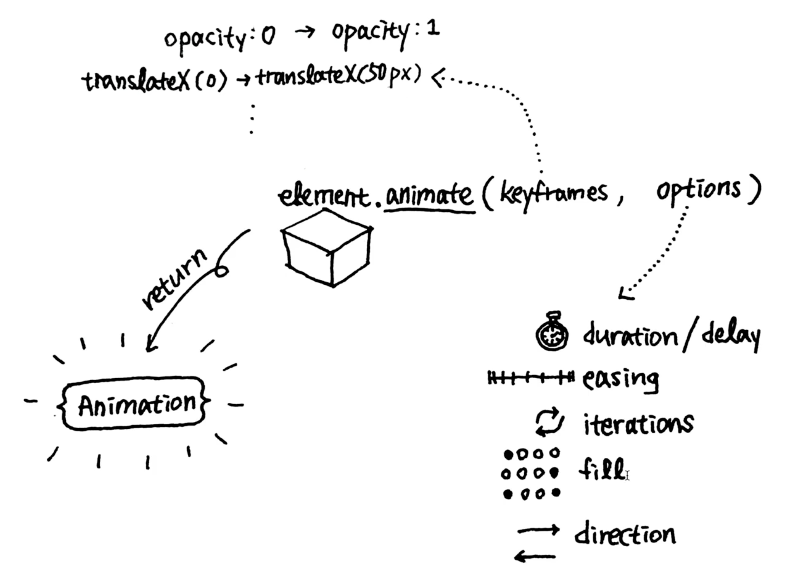
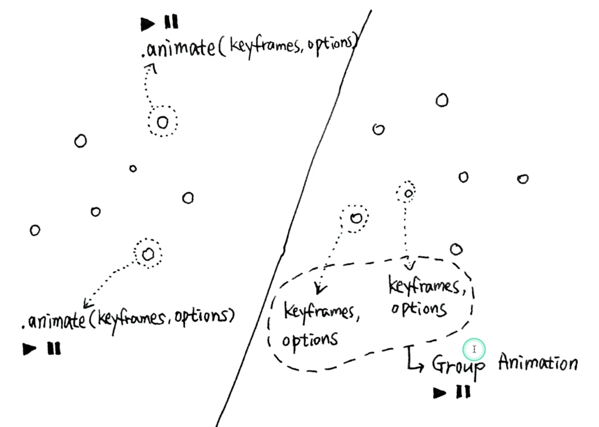

1. `animate()`
  ```javascript
  const box = document.querySelector(".box");
  box.animate(keyframes, option)
  ```
  

2. GroupEffect
  
  
  - `GroupEffect` 경우, 외부 스크립트를 이용해야 한다.
  - [GroupEffect 외부 라이브러리](https://cdnjs.cloudflare.com/ajax/libs/web-animations/2.3.2/web-animations-next.min.js)

  3. Motion Path 움직이기
    ```html
    <svg class="path-svg" viewBox="0 0 674.7 531.36">
      <path
        class="path"
        d="m.5,443.85V52.36C.5,23.72,23.72.5,52.36.5s51.86,23.22,51.86,51.86v286.64c0,28.64,23.22,51.86,51.86,51.86s51.86-23.22,51.86-51.86V52.36c0-28.64,23.22-51.86,51.86-51.86s51.86,23.22,51.86,51.86v426.64c0,28.64,23.22,51.86,51.86,51.86s51.86-23.22,51.86-51.86V52.36c0-28.64,23.22-51.86,51.86-51.86s51.86,23.22,51.86,51.86v226.64c0,28.64,23.22,51.86,51.86,51.86s51.86-23.22,51.86-51.86v-59.96c0-28.64,23.22-51.86,51.86-51.86"
      />
    </svg>
    ```
    ```css
    .car {
      position: absolute;
      left: 0;
      top: 0;
      width: 10px;
      height: 20px;
      background: red;
      offset-path: path(
        "m.5,443.85V52.36C.5,23.72,23.72.5,52.36.5s51.86,23.22,51.86,51.86v286.64c0,28.64,23.22,51.86,51.86,51.86s51.86-23.22,51.86-51.86V52.36c0-28.64,23.22-51.86,51.86-51.86s51.86,23.22,51.86,51.86v426.64c0,28.64,23.22,51.86,51.86,51.86s51.86-23.22,51.86-51.86V52.36c0-28.64,23.22-51.86,51.86-51.86s51.86,23.22,51.86,51.86v226.64c0,28.64,23.22,51.86,51.86,51.86s51.86-23.22,51.86-51.86v-59.96c0-28.64,23.22-51.86,51.86-51.86"
      );
      offset-distance: 100px;
      offset-rotate: auto 90deg;
    }
    ```
    - Path를 따라 움직이는 작업을 하고자 할 때,<br />`svg path d`에 적용된 값을 `css, offset-path: path("문자열")`로 적용을 해준다.
    - `offset-rotate: auto ??deg`로 회전시켜 원하고자 하는 방향으로 적용한다.<br /> `auto`를 적용해줘야 곡선으로 움직일 때 자연스럽게 된다.
    - `offset-distance` 값에 따라 움직인다.

3. `scroll-timeline.js`
- https://github.com/flackr/scroll-timeline
- 현재 2023.04 기준, 스크롤 애니메이션은 외부 라이브러리를 이용해야 한다.
- 다른 라이브러리와 다른 점은 웹표준 기반의 라이브러리로 추후 브라우저별로 적용 시 해당 라이브러리를 뺀 상태로 적용하면 된다.
  ```javascript
  // https://github.com/flackr/scroll-timeline#usage
  import 'https://flackr.github.io/scroll-timeline/dist/scroll-timeline.js';

  document.getElementById('parallax').animate(
      { transform: ['translateY(0)', 'translateY(100px)']},
      { duration: 10000, // Totally arbitrary!
        fill: 'both',
        timeline: new ScrollTimeline({
            scrollOffsets: [
                new CSSUnitValue(0, 'px'),
                new CSSUnitValue(200, 'px')
            ]
        })
      });
  ```

  4. `progress`
    - `target` : 스크롤의 영향을 받는 영역
      - progress 경우, 페이지 document.body 의 영향을 받기 때문에<br />target을 document.body로 적용한다.
      - 특정 영역을 기준으로 하고자 할 때, `target: scrollBox,`
    - `threshold` : 1로 할 경우, 상단(0) 기준으로 시작<br />0.5로 할 경우, 반 이상 지나갔을 때 시작.
    ```javascript
    // main.js
    import "./scroll-timeline.js";

    const progress = document.querySelector(".progress");
    const scrollBox = document.querySelector(".scroll-box");

    progress.animate(
      [
        {
          transform: "scaleX(0)",
        },
        {
          transform: "scaleX(1)",
        },
      ],
      {
        timeline: new ScrollTimeline({
          scrollOffsets: [
            {
              target: document.body,
              
              // target을 scroll-box로 하게 되면 브라우저 내 시작점에 왔을 때
              // target: scrollBox,

              // 시작
              edge: "start",

              // 1 = 0 지점으로 왔을 때 시작
              // 0.5 = 반 이상 지나갔을 때 시작
              threshold: 1,
            },
            {
              target: document.body,

              // target을 scroll-box로 하게 되면 브라우저 내 마지막점에 왔을 때
              // target: scrollBox,

              // 마지막
              edge: "end",
              threshold: 1,
            },
          ],
        }),
      }
    );

    ```

5. css 속성, `contain: paint`
- https://developer.mozilla.org/ko/docs/Web/CSS/contain
- `overflow-x: hidden;`와 비슷한 효과지만 `position: sticky` 작동이 가능하다.
  ```css
  .wrap {
    /* 가로스크롤 방지 */
    /* overflow: hidden을 하면 sticky가 제대로 동작 안하는 버그가 있음 */
    /* 따라서 contain: paint를 사용 */
    contain: paint;
  }
  ```

6. 스크롤 이벤트 시 Tip!
```javascript
// 스크롤
let prevScrollY = -1; // 처음 스크롤 할 때 오락가락 방지
let scrollFlag;
window.addEventListener('scroll', e => {
	if (scrollFlag) return;

	scrollFlag = true;

	setTimeout(() => {
		scrollFlag = false;

		if (window.scrollY >= prevScrollY) {
			console.log('down');
			airplane.dataset.direction = 'down';
		} else {
			console.log('up');
			airplane.dataset.direction = 'up';
		}
		prevScrollY = window.scrollY;
	}, 100);
});
```
- 스크롤에 따라 값을 down? up? 체크를 할 경우<br />`setTimeout()`을 이용해 위와같이 적용하는 것을 추천!
- 0.1초마다 값을 재랜더링 하기 때문에 속도 면에서 좋다!