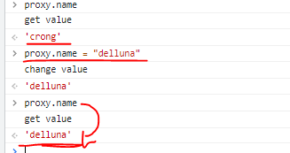

# 모던 자바스크립트(javascript) 개발을 위한 ES6 강좌
- 인프런 강좌 : https://inf.run/ohFr
- 온라인 에디터 : https://jsbin.com/?js,output

<hr />

# [ES6] 1. scope
## 1.1. let
- es6 이전에 자바스크립트는 function 단위의 scope만 존재했다.<br />`function` 안의 지역변수(`var homevar, var i`) 먼저 찾고 없으면 전역 변수(`var name`)에서 찾는다.
    ```javascript
    var name = "global var";
    function home() {
        var homevar = "homevar";
        for(var i=0; i<100; i++) {
        }
        console.log(i);
    }
    home(); // 100
    ```
    <br />

- `var` 를 `let`을 변경하여 실행하게 되면 `ReferenceError: i is not defined`를 콘솔로그에 출력하게 된다.
    -  `var i`는 block scope로 for문 안에서만 가능하다.
    - if문도 for문과 동일하게 실행되지 않는다.
    ```javascript
    var name = "global var";
    function home() {
        var homevar = "homevar";
        for(let i=0; i<100; i++) {
        }

        if(true) {
            let myif = "myif";
        }
        console.log(i);
        console.log(myif);
    }
    home(); // 
    ```
    <br />

- **let은 block scope({}) 단위에서 가능하다.**

<br />
<br />
<br />

## 1.2. let과 closure(클로저)
### 1.2.1. closure 개념
- 클로저(closure)는 내부함수가 외부함수의 맥락(context)에 접근할 수 있는 것을 가르킨다. 클로저는 자바스크립트를 이용한 고난이도의 테크닉을 구사하는데 필수적인 개념으로 활용된다.  
- [closure MDN 자세히보기](https://developer.mozilla.org/ko/docs/Web/JavaScript/Closures)
- [closure 생활코딩 자세히보기](https://opentutorials.org/course/743/6544)

<br />

### 1.2.2. var를 사용했을 때
```html
<ul>
  <li>javascript</li>
  <li>java</li>
  <li>python</li>
  <li>django</li>
</ul>
```
```javascript
var list = document.querySelectorAll("li");
for ( var i=0; i<list.length; i++) {
  list[i].addEventListener("click", function() {
    console.log(i+"번째 리스트 입니다");
  });
}
```
- 콘솔로그에 '4번째 리스트 입니다' 메세지만 출력된다.
- `function() { consol~~ }` 콜백함수는 나중에 실행되는데, 갖고 있지 않은 i값은 콜백 밖에 있는 변수 값을 참조한다.(즉, i값을 클로저 변수라고 한다)
- i의 값은 계속 변한다. 그리고 `var` 일 경우, 변한 값을 공유하게 된다. 그래서 li의 갯수가 4개, i의 마지막 값은 4이기 때문에 '4번째 리스트 입니다' 메세지가 보이는 것이다.

<br />

### 1.2.3. let을 사용했을 때
```html
<ul>
  <li>javascript</li>
  <li>java</li>
  <li>python</li>
  <li>django</li>
</ul>
```
```javascript
var list = document.querySelectorAll("li");
for ( let i=0; i<list.length; i++) {
  list[i].addEventListener("click", function() {
    console.log(i+"번째 리스트 입니다");
  });
}
```
- (클릭한 li의 index 번호)번째 리스트 입니다 라고 정상적으로 콘솔로그 메세지를 확인할 수 있다.
- let은 block scope ({}) 단위이기 때문에 var와는 다른 결과값을 가져올 수 있다.
- 보통 li에 직접적으로 이벤트를 주는 것이 아닌 ui에 이벤트를 준다. (ex. 이벤트 위임)<br />[※ 이벤트 위임 참고](https://github.com/eunhye8767/pj_eh/tree/master/05_js_event)

<br />
<br />
<br />


## 1.3. const - 선언된 변수 지키기
### 1.3.1. var를 사용했을 때
```javascript
function home() {
  var homename = "my house";
  homename = "your house";
  console.log(homename);
}

home(); // your house
```
- 콘솔로그에 "your house" 메세지가 출력된다.
- 만약 값을 변경하면 안 된다는 것을 암묵적으로 표시할 경우 `var HOME_NAME` 처럼 대문자로 표기했었다 (상수 표시를 위한 암묵적인 룰?!)
    ```javascript
    function home() {
      var HOME_NAME = "my house";
      console.log(homename);
    }

    home(); // my house
    ```

- 하지만 현재는 const를 사용한다.

<br />

### 1.3.2. const
```javascript
function home() {
  const homename = "my house";
  console.log(homename);
}

home(); // my house
```
- const를 사용했을 때 `homename = "your house";`처럼 값을 변경할 경우 에러가 발생한다.
- `const homename = [1,2,3,4]` 을 `homename = ["1","2"]` 처럼 값을 재할당할 경우 에러가 발생한다.

### 1.3.3. 정리
- const를 기본으로 사용한다.
- 변경이 될 수 있는 변수는 let을 사용한다.
- var는 사용하지 않는다.

<br />
<br />
<br />

## 1.4. const 특성과 immutable array
```javascript
function home() {
  const list = ["apple","orange","watermelon"]
  list.push("banana");
  console.log(list);
}

home();
```
- `const list` 로 선언한 배열에 push할 경우, 에러없이 추가가 된다.
- **즉, const를 사용하더라도 배열([])과 오브젝트({})의 값을 변경하는 것은 가능하다.<br />(재할당하는 것은 불가능하다)**
<br />

### 1.4.1. immutable array를 어떻게 만들지?
```javascript
const list = ["apple","orange","watermelon"];
list2 =[].concat(list, "banana");
console.log(list, list2, list === list2);
// list ["apple","orange","watermelon"]
// list2 ["apple","orange","watermelon"."banana"]
// false
```
- 예를 들어 뒤로가기, 앞으로가기를 눌러서 어떤 값을 되돌리고 싶을 때
- 원본을 둔 상태로 복사해서 수정/추가 관리한다는 개념

<br />
<br />
<br />

# [ES6] 2. String
## 2.1. ES2015 String 에 새로운 메서드들
```javascript
let str = "hello world ! ^^ ~~";
let matchstr = "hello";
let matchstrE = "^~~";
let matchstrI = "world";
console.log(str.startsWith(matchstr))  // true
console.log(str.endsWith(matchstrE))   // false
console.log(str.includes(matchstrI))   // true
```
- `.startsWith()` =  ***로 시작하는 지 체크 
- `.endsWith()` =  ***로 끝나는 지 체크 
- `.includes()` =  ***가 포함되어 있는 지 체크
- `str.includes("world")` 처럼 텍스트를 직접 적용해도 되고 변수에 담아 적용해도 된다.

<br />
<br />
<br />

# [ES6] 3. Array
## 3.1. for of - 순회하기
### 3.1.1. for in을 배열에서 사용하면 안 되는 이유
```javascript
var data = [1,2,undefined, NaN, null, ""];
Array.prototype.getIndex = function(){}

for (let idx in data) {
  console.log(data[idx])
}
```
- 자기 자신이 가진 객체 이외에 프로토타입 객체를 이용해서 상위에 추가된 객체(`Array.prototype.getIndex = function(){}`)들도 같이 나타나게 된다.
- **그래서 배열에서 for in문을 사용하면 안 되는 이유이다.**

<br />

### 3.1.2. for of문을 사용하여 값 확인하기
```javascript
var data = [1,2,undefined, NaN, null, ""];
Array.prototype.getIndex = function(){}

for (let value of data) {
  console.log(value)
}

var str = "hello world!!!!";
for (let value of str) {
  console.log(value);
}
``` 
- for of문은 for in의 문제점을 해결할 수 있다.
- str을 for of문을 돌릴 경우, "hello world!!!!" 문구가 하나씩 콘솔로그에 출력된다. (공백포함)

<br />
<br />
<br />

## 3.2. spread operator - 배열의 복사
- spread operator, 펼침 연산자
```javascript
let pre = ["apple","orange", 100];
let newData =[...pre];
console.log(newData);
```
- `...`을 사용하여 배열을 복사(copy)

<br />
<br />
<br />

## 3.3. spread operator - 몇가지 활용
### 3.3.1. 특정 위치에 배열을 적용해야 할 때
```javascript
let pre = [100, 200, "hello", null];
let newData = [0,1,2,3, ...pre, 4];
console.log(newData);  // 0, 1, 2, 3, 100, 200, "hello", null, 4
```

<br />

### 3.3.2. 배열의 값을 합쳐야할 때
```javascript
let pre = [100, 200, 300];
function sum(a,b,c) {
  return a+b+c;
}

console.log(sum.apply(null, pre));
console.log(sum(...pre));
```
- spread operator 이전엔 apply를 이용하여 계산했지만, 지금은 `...pre`만 써주면 된다.

<br />
<br />
<br />

## 3.4. from 메서드로 진짜 배열 만들기
```javascript
function addMark() {
  let newData = [];
  
  for(let i=0; i<arguments.length; i++) {
    newData.push(arguments[i]+"!");
  }
  console.log(newData);  // ["1!", "2!", "3!", "4!", "5!"]
}

addMark(1,2,3,4,5);
```
- 자바스크립트는 인자값을 안줘도 arguments라는 function안에 지역변수 같은 곳에 배열형태로 받게 된다.
- 가변적인 파라미터 일때 arguments를 활용한다. (권장되는 패턴은 아니다)
- *※ arguments 객체는 함수에 전달된 인수에 해당하는 Array 형태의 객체*
<br />

```javascript
function addMark() {
  let newData = arguments.map(function(value){
    return value + "!";
  })
  
  console.log(newData);
}

addMark(1,2,3,4,5,6,7,8,9);
```
- **arguments 는 배열이 아니기 때문에 map() 함수를 사용할 수 없다.**
- 가짜 배열, 배열과 같은 것은 from을 이용하여 쉽게 할 수 있다.

<br />

```javascript
function addMark() {
  let newArray = Array.from(arguments);
  let newData = newArray.map(function(value){
    return value + "!";
  })
  
  console.log(newData);
  
}

addMark(1,2,3,4,5,6,7,8,9);
```
- `from()`을 활용하여 arguments를 배열로 만들고 그 배열을 `map()` 함수를 이용하면 된다.
- **가짜 배열을 진짜 배열로 바꿀 땐, from() 함수를 이용한다.**

<br />
<br />
<br />

# [ES6] 4. 실습 1 - 특정 문자열이 포함된 배열 만들어 반환하기
## 4.1. 실습 예제 1
```html
<ul>
  <li>apple</li>
  <li>orange</li>
  <li>banana</li>
  <li>strawberry</li>
</ul>
```
```javascript
function print() {
  /*
    fillter, includes, from을 사용해서 문자열 'e'가 포함된 
    노드로 구성된 배열을 만들어서 반환하기
   */
  const li = document.querySelectorAll('li');
  const arr = Array.from(li);
  const result = arr.filter((item)=>{
      return item.innerText.includes('e');
  })
  
  console.log(result);
}

print();
```

<br />
<br />
<br />

## 4.2. 실습 예제 1 풀어보기
```javascript
function print() {
  let list = document.querySelectorAll('li');
  let listArray = Array.from(list);                 // li 노드로 구성된 배열
  let eArray = listArray.filter(function(v) {
    return v.innerText.includes("e");
  })
  
  console.log(eArray.length); // 3
  //console.log(toString.call(list));  // [object NodeList]
}

print();
```
- 타입을 확인할때 자주 사용하는 방법 = `toString.call()`

<br />
<br />
<br />

# [ES6] 5. Object
## 5.1. 간단히 객체생성하기
```javascript
function getObj() {
  const name = 'crong';
  const getName = function() {
    return name;
  }
  const setName = function(newname) {
    name = newname;
  }
  const printName = function() {
    console.log(name);
  }
  
  return { getName, setName}
}

var obj = getObj();
console.log(obj);
console.log(obj.getName());
```

- 오브젝트 리터럴 형태일 때, 키:밸류값이 동일할 때는 한 번만 기입해주어도 된다. (`getName : getName,` 이 경우 `getName` 처럼)
- 밸류의 값을 넘길 수도 있다. `return { getName, setName, name}`<br />이렇게 적용하고 obj를 콘솔로그에 출력하게 되면 getName, setName, name 값을 확인할 수 있다.
- 오브젝트를 선언하여 위의 코드를 좀 더 간단하게 작성할 수 있다.
  ```javascript
  const data = {
    name,
    getName() {

    },
  }
  ```

<br />
<br />
<br />

# [ES6] 6. Destructuring
## 6.1. Destructuring Array
- [Destructuring(구조 분해 할당) MDN 자세히보기](https://developer.mozilla.org/ko/docs/Web/JavaScript/Reference/Operators/Destructuring_assignment)
```javascript
let data = ["crong", "honux", "jk", "jinny"];
let [jisu, , jung] = data;
console.log(jisu, jung);     // crong, jk
```
- Destructuring(디스트럭처링)을 쓰게되면 변수에 배열이나 오브젝트에 필요한 값을 할당하는데 유용하게 사용할 수 있다.

<br />
<br />
<br />

## 6.2. Destructuring Object
```javascript
let obj = {
  name: "crong",
  address: "Korea",
  age: 10
}

// let {name, age} = obj;
// console.log(name,age);      // "crong", 10

let {name:myName, age:myAge} = obj;
console.log(myName, myAge);    // "crong", 10
```
- 필요한 키값을 변경하여 사용할 수도 있다.

<br />
<br />
<br />

## 6.3. Destructuring 활용 JSON파싱
```javascript
let news= [
  {
    "title" : "sbs",
    "imgurl" : "https://www.i-on.net/news/press/__icsFiles/artimage/2015/12/14/ck152b/sbs.png",
    "newslist" : [
      "[가보니] 가상 경주도 즐기고, 내 손으로 자동차도 만들고",
      "갤럭시s8 출시? '갤노트7' 처리 계획부터 밝혀야",
      "블로코-삼성SDS, 블록체인 사업 '맞손'",
      "[블록체인 돌아보기] 퍼블릭 블록체인의 한계와 프라이빗 블록체인"
    ]
  },
  {
    "title" : "mbc",
    "imgurl" : "https://image.imnews.imbc.com/page/include/images/meta_image.png",
    "newslist" : [
      "Lorem ipsum dolor sit amet, consectetur adipisicin",
      "ipsum dolor sit amet, consectetur adipisicin",
      "dolor sit amet, consectetur adipisicin",
      "amet, consectetur adipisicin"
     ]
  }
]

let [, mbc] = news;
let { title, imgurl } = mbc;

console.log([mbc])
console.log({title, imgurl})
```
- JSON 자료를 파싱하여 필요한 정보만 갖고 올 수 있다.
- mbc의 title, imgurl 갖고 오는 부분을 디스트럭처링으로 한 줄로 간략하게 작성할 수 있다.
  ```javascript
  let [, mbc] = news;
  let { title, imgurl } = mbc;

  // 위의 2줄을 1개의 줄로 바꿀 수 있다.
  let [, {title, imgurl}] = news;
  ```
- **★ 디스트럭처링을 이용해 JSON 파싱을 쉽게 할 수 있다! ★**

<br />
<br />
<br />

## 6.4. Destructuring 활용_Event객체전달
```javascript
let news= [
  {
    "title" : "sbs",
    "imgurl" : "https://www.i-on.net/news/press/__icsFiles/artimage/2015/12/14/ck152b/sbs.png",
    "newslist" : [
      "[가보니] 가상 경주도 즐기고, 내 손으로 자동차도 만들고",
      "갤럭시s8 출시? '갤노트7' 처리 계획부터 밝혀야",
      "블로코-삼성SDS, 블록체인 사업 '맞손'",
      "[블록체인 돌아보기] 퍼블릭 블록체인의 한계와 프라이빗 블록체인"
    ]
  },
  {
    "title" : "mbc",
    "imgurl" : "https://image.imnews.imbc.com/page/include/images/meta_image.png",
    "newslist" : [
      "Lorem ipsum dolor sit amet, consectetur adipisicin",
      "ipsum dolor sit amet, consectetur adipisicin",
      "dolor sit amet, consectetur adipisicin",
      "amet, consectetur adipisicin"
     ]
  }
]

function getNewsList([,{newslist}]) {
  console.log(newslist)
}

getNewsList(news);
```
- function으로 Destructuring 활용하기
- function - 파라미터를 활용해서 디스트럭처링을 쓰게 되면 필요한 값을 잘 받아서 파싱을 쉽게 할 수 있다.

<br />

### 6.4.1. DIV에 이벤트 핸들링 적용
```html
<div>Lorem ipsum dolor sit amet, consectetur adipisicin</div>
```
```javascript
document.querySelector("div").addEventListener("click", function(evt) {
  console.log(evt.target);
});

// target만 불러오고 싶을 때
document.querySelector("div").addEventListener("click", function({target}) {
  console.log(target);
  console.log(target.tagName);
  console.log(target.innerText);
});

// type, target 불러올 때
document.querySelector("div").addEventListener("click", function({type, target}) {
  console.log(type, target.tagName);
});
```
- 이벤트 객체에서 target 정보만 갖고 올 수 있다.<br />**즉, 특정 객체에서 디스트럭처링을 이용해 필요한 정보만 갖고 올 수 있다**

<br />
<br />
<br />


# [ES6] 7.Set & WeakSet
## 7.1. Set 으로 유니크한 배열만들기
```javascript
let mySet = new Set();
console.log(toString.call(mySet));   // [object Set]
```
- Set<br />1. 중복없이 **유일한 값을 저장**하려고 할 때.<br />2. **이미 존재하는 지 체크할 때 유용**
- Set은 배열 형태로 되어 있다.<br />(배열로 변환하고자 할 땐, from()을 이용해 변환할 수 있다.)<br />([From() 메서드란?](https://github.com/eunhye8767/__inflearn/tree/master/04_es6_beginner_yjs#34-from-%EB%A9%94%EC%84%9C%EB%93%9C%EB%A1%9C-%EC%A7%84%EC%A7%9C-%EB%B0%B0%EC%97%B4-%EB%A7%8C%EB%93%A4%EA%B8%B0))

<br />

### 7.1.1. Set 메소드 add()
```javascript
let mySet = new Set();

mySet.add("crong");
mySet.add("hary");
mySet.add("crong");

mySet.forEach(function(v){
  console.log(v);
})
```
- crong이 중복으로 추가가 되었지만, `forEach()`로 확인하면 crong, hary 값만 확인할 수 있다. (중복 추가 X)

<br />

### 7.1.2. Set 메소드 has()
```javascript
let mySet = new Set();

mySet.add("crong");
mySet.add("hary");
mySet.add("crong");

console.log(mySet.has("crong"));
```
- `has()` 메소드를 이용하여 해당 값이 있는 지 확인할 수 있다.

<br />

### 7.1.3. Set 메소드 delete()
```javascript
let mySet = new Set();

mySet.add("crong");
mySet.add("hary");
mySet.add("crong");

mySet.delete("crong");

mySet.forEach(function(v){
  console.log(v);  // "hary"
})
```
- `delete()` 을 이용하여 crong를 삭제하고 `forEach()`로 확인하게 되면, mySet에 "hary"만 존재하는 것을 확인할 수 있다.

<br />
<br />
<br />

## 7.2. WeakSet 으로 효과적으로 객체타입저장하기
```javascript
let arr = [1,2,3,4];
let ws = new WeakSet();

ws.add(arr);
console.log(ws);
```
- WeakSet : 참조를 가지고 있는 객체만 저장이 가능하다.

<br />

```javascript
let arr = [1,2,3,4];
let ws = new WeakSet();

ws.add(arr);
ws.add(111);
ws.add("111");
ws.add(null);
ws.add(function(){});
console.log(ws);
```
- 숫자, 문자열 등 add()를 이용해 추가할 경우, 에러가 발생한다.<br />하지만, `function() {}`을 추가할 경우 에러가 발생하지 않는다. 그 이윤 참조를 가진 객체이기 때문이다.

<br />

### 7.2.1. 가비지 컬렉션 (사용이 완료된 메모리를 정리하는 것)
1. ws를 콘솔로그로 출력하면 `{[1,2,3,4], [5,6,7,8], {arr: [1,2,3,4], arr2: [5,6,7,8]}}`로 보여진다.
```javascript
let arr = [1,2,3,4];
let arr2 = [5,6,7,8];
let obj = {arr, arr2};
let ws = new WeakSet();

ws.add(arr);
ws.add(arr2);
ws.add(obj);

console.log(ws);
```
<br />

2. arr에 null 값을 적용한다.
```javascript
let arr = [1,2,3,4];
let arr2 = [5,6,7,8];
let obj = {arr, arr2};
let ws = new WeakSet();

ws.add(arr);
ws.add(arr2);
ws.add(obj);

arr = null;

console.log(ws);
```
<br />

3. 콘솔로그에서 보면 null 값을 주기 전의 값과 동일한 것을 알 수 있다. 즉 존재하는 것처럼 보인다.
4. 하지만 `has()`로 확인하면 값이 존재하지 않는 것을 알 수 있다.
```javascript
let arr = [1,2,3,4];
let arr2 = [5,6,7,8];
let obj = {arr, arr2};
let ws = new WeakSet();

ws.add(arr);
ws.add(arr2);
ws.add(obj);

arr = null;

console.log(ws);
console.log(ws.has(arr), ws.has(arr2));  // false, true
```

<br />

5. 가비지 컬렉션 대상이 되지 않기 때문에 `arr2` 값은 유효하다.
6. WeakSet에서는 `arr` 배열이 저장을 하고 있는 것처럼 보이지만, 유효하지 않는 것으로 알고 있기 때문에 `has()`를 이용해 확인할 경우 `false` 값을 출력한다.
7. 객체형태를 중복없이 저장하려고 할 때(자료구조를 다룰 때) 유용하다.

<br />
<br />
<br />

# [ES8] 8. Map & WeakMap
## 8.1. Map & WeakMap 추가정보를 담은 객체저장하기
- Array -> set, weakset / Object -> map, weakmap
- map은 key/value 구조.

### 8.1.1. WeakMap
```javascript
let wm = new WeakMap();

// 이 함수가 얼마나 실행됐지?를 알려고 할 때.
let myfun = function(){};

wm.set(myfun,0);

let count = 0;
for(let i=0; i<10; i++) {
  count = wm.get(myfun); // get value
  count++;
  wm.set(myfun, count);
}

console.log(wm.get(myfun));   // 10

myfun = null;
console.log(wm.get(myfun));   // undefined
console.log(wm.has(myfun));   // false
```
- **weakmap은 weakset과 유사하지만, key/value 구조로 되어 있다.**
- [weakmap mdn 자세히보기](https://developer.mozilla.org/ko/docs/Web/JavaScript/Reference/Global_Objects/WeakMap)

<br />
<br />
<br />

## 8.2. WeakMap 클래스 인스턴스 변수 보호하기
### 8.2.1. WeakMap 활용
```javascript
function Area(height, width) {
  this.height = height;
  this.width = width;
}

Area.prototype.getArea = function() {
  return this.height * this.width;
}

let myarea = new Area(10,20);
console.log(myarea.getArea());
console.log(myarea.height);
```
1. WeakMap을 이용해서 자바스크립트 클래스를 만들면서 프라이빗한 변수를 만든다.<br />(프로토타입 기반의 클래스를 만든다)
2. `myarea.height` 처럼 활용하는 것이 아닌 숨기고 싶을 때, 접근을 효율적으로 막을 때 어떻게 해야할 까?<br />이럴 때, WeakMap을 이용하여 인스턴스 관리를 할 수 있다.
3. 객체가 필요없어 지게 되면 가비지 컬렉션 대상이 되서 자료를 보관하는 상태를 가볍게 해주기 때문에 가비지 컬렉션 대상이 되는 저장소를 만들 수 있다.
4. 먼저, `WeakMap()`을 만들어 준다.
<br />

```javascript
const wm = new WeakMap();

function Area(height, width) {
  wm.set(this, {height, width})
}

Area.prototype.getArea = function() {
  const {height, width} = wm.get(this);
  return height * width;
}

let myarea = new Area(10,20);
console.log(myarea.getArea());  // 200
console.log(myarea.height);     // undefined (접근이 안 되기 때문에)
```
5. set에 this 키워드를 적용하고 this(현재의 객체)에 값을 height, width 값을 적용한다.
6. 변수 wm에 효율적으로 객체의 추가 정보를 담아두는 것이다. `wm.set(this, {height, width})`

```javascript
const wm = new WeakMap();

function Area(height, width) {
  wm.set(this, {height, width})
}

Area.prototype.getArea = function() {
  const {height, width} = wm.get(this);
  return height * width;
}

let myarea = new Area(10,20);

console.log(wm.has(myarea));  // true

myarea = null;
console.log(wm.has(myarea));  // false
console.log(wm.get(myarea));  // undefined
```
7. wm이 전역 공간에 있을 때 효율적으로 동작되는 것을 알 수 있다.

<br />

### 8.2.2. WeakMap() 사용을 하지 않고 위의 코드를 작성했을 때
```javascript
const obj = {};

function Area(height, width) {
  obj.height = height;
  obj.width = width;
}

Area.prototype.getArea = function() {
  return obj.height * obj.width;
}

let myarea = new Area(10,20);

console.log(obj);

myarea = null;

console.log(obj);
```
- WeakMap()을 사용하지 않고 코드를 작성했을 경우, `myarea = null` 기능 작동이 되질 않아 obj 값은 그대로 유지된다.

<br />
<br />
<br />

# [ES6] 9. 실습예제 2 - Destructuring 과 Set 을 활용한 로또 번호 생성기
## 9.1. 로또 번호 생성기
### 9.1.1. 실습. Destructuring and Set 활용
#### lotto 번호 만들기.
1. 유일한 값을 추출하는 과정에서 Set을 사용한다.
2. getRandomNumber 함수에 변수를 전달하는 과정에서 destructuring을 사용한다.
```javascript
const SETTING = {
  name : "LUCKY LOTTO!",
  count : 6,
  maxNumber : 45
}

function getRandomNumber(maxNumber) {
  // 랜덤한 유일한 숫자값을 추출
}
```
<br />

#### 실습
```javascript
const SETTING = {
    name : "LUCKY LOTTO!",
    count : 6,
    maxNumber : 45,
}

const { count, maxNumber } = SETTING;
const lotto = new Set();

let result;

function getRandomNumber(maxNumber) {
  // 랜덤한 유일한 숫자값을 추출

  while (lotto.size < count ) {
    // number, 1~5사이의 랜덤한 값 (*6 했을 경우, 0~5)
    let number = Math.floor(Math.random()*maxNumber + 1);
    lotto.add(number);
  }   

  result = Array.from(lotto)
  return console.log(result);
}

getRandomNumber(maxNumber);
```

<br />
<br />
<br />

# [ES6] 10. Template
## 10.1. Template 처리
- Template 처리는 UI 작업에서 중요하다.
- JSON으로 응답을 받고, javascript object로 변환한 후에 어떠한 데이터처리 조작을 한 후에 dom에 추가.
- 데이터 + HTML 문자열의 결합이 필요하기 때문에.

```javascript
const data = [
  {
    name : 'coffee-bean',
    order : true,
    items : ['americano', 'milk', 'green-tea']
  }, {
    name : 'starbucks',
    order : false,
  }
]

const template = `<div>welcome ${data[0].name} !!`;
console.log(template);
```
- 변수는 `${data[0].name}` 처럼 `${}`으로 표기한다.

<br />
<br />
<br />

## 10.2. Tagged Template literals
```javascript
const data = [
  {
    name : 'coffee-bean',
    order : true,
    items : ['americano', 'milk', 'green-tea']
  }, {
    name : 'starbucks',
    order : false,
  }
]

// Tagged template literals
function fn(tags, name, items) {
  console.log(tags, name, items);
}

const template = fn`
    <div>welcome ${data[0].name} !!</div>
    <h2>주문 가능 항목</h2>
    <div>${data[0].items}</div>
  `;
```
- 콘솔로그 tags (3개의 배열을 확인할 수 있다)
  ```
  ["
    <div>welcome ", 
    " !!</div><h2>주문 가능 항목</h2><div>", 
    "</div>
  "]
  ```
- 콘솔로그 name
  ```
  "coffee-bean"
  ```
- 콘솔로그 items
  ```
  ["americano", "milk", "green-tea"]
  ```
  <br />

### 10.2.1. 템블릿을 만들어서 메세지 영역에 넣기
```html
<div id="message"></div>
```
```javascript
const data = [
  {
    name : 'coffee-bean',
    order : true,
    items : ['americano', 'milk', 'green-tea']
  }, {
    name : 'starbucks',
    order : false,
  }, {
    name : 'coffee-king',
    order : true,
    items: ['americano','latte']
  }
]

// Tagged template literals
function fn(tags, name, items) {
  if ( typeof items === "undefined" ) {
    items = "<span style='color:red'>주문 가능한 상품이 없습니다.</span>"
  }
  return (tags[0] + name + tags[1] + items + tags[2]);
  
}

data.forEach((v)=>{
  let template = fn`
    <h2>welcome ${v.name} !!</h2>
    <h4>주문 가능 항목</h4>
    <div>${v.items}</div>
  `;
  
  document.querySelector("#message").innerHTML += template;
 
})
```
- starbucks 일 때에만 빨간색 글씨의 "주문 가능한 상품이 없습니다" 라는 문구가 보여진다.


<br />
<br />
<br />

# [ES6] 11. function
## 11.1. Arrow function 활용
```javascript
setTimeout(function(){
  console.log("setTimeout")
}, 1000);

// Arrow function
setTimeout(()=>{
  console.log("setTimeout")
}, 1000)
```

<br />

### 11.1.1. map()
- `map()` 메서드는 배열 내의 모든 요소 각각에 대하여 주어진 함수를 호출한 결과를 모아 새로운 배열을 반환.
- [map MDN 자세히보기](https://developer.mozilla.org/ko/docs/Web/JavaScript/Reference/Global_Objects/Array/map);
```javascript
let newArr = [1,2,3,4,5].map(function(value, index, object) {
  return value * 2;
})
console.log(newArr); // [2,4,6,8,10];

// Arrow function
let newArr = [1,2,3,4,5].map((value, index, object) => {
  return value * 2;
})
console.log(newArr); // [2,4,6,8,10];

// Arrow function (더 간략하게)
let newArr = [1,2,3,4,5].map((v) => v * 2)
console.log(newArr); // [2,4,6,8,10];
```
- 콜백함수는 return을 해줘야 하는데, 생략할 수도 있다.<br />브레이스({})가 없을 때에는 뒤에 `v * 2` 부분이 그대로 반환하게 되어 있다.
- `v * 2` 이 부분을 `(v * 2)` 처럼 해줘도 된다. ( = 리턴을 의미)
- 보통은 브레이스({})를 해줘야 하지만, 짧은 코드(ex. `map((v) => v * 2)`)일 경우 브레이스({}) 없이도 가능하다.

<br />
<br />
<br />

## 11.2. Arrow function 의 this context
### 11.2.1. this context of Arrow function
```javascript
const myObj = {
  runTimeout() {
    setTimeout(function() {
      console.log(this === window)
    }, 200)
  }
}

myObj.runTimeout();  // true
```
- this가 가르키는 것이 window
- this가 가르키는 것을 myObj로 변경하고자 할땐 `bind(this)`로 감싸면 된다.
  ```javascript
  const myObj = {
    runTimeout() {
      setTimeout(function() {
        console.log(this === window)
      }.bind(this), 200)
    }
  }

  myObj.runTimeout();  // false
  ```
- this를 myObj로 가르키고, 생성한 printData 함수를 실행<br />`bind(this)`로 감싸지 않은 상태에선 `this.printData()`를 실행할 수 없다. 그 이윤, this가 window를 가르키고 있기 때문에.
  ```javascript
  const myObj = {
    runTimeout() {
      setTimeout(function() {
        this.printData();
      }.bind(this), 200)
    },
    
    printData() {
      console.log("hi codesquad!");
    }
  }

  myObj.runTimeout();
  ```
  <br />

#### ★★★arrow function일 경우, 코드가 달라진다.★★★
```javascript
const myObj = {
  runTimeout() {
    setTimeout(() => {
      console.log(this === window); // false
      this.printData();             // 함수실행
    }, 200)
  },
  
  printData() {
    console.log("hi codesquad!");
  }
}

myObj.runTimeout();
```
- arrow function을 쓸 경우, `bind(this)`를 생략해도 `this.printData()`가 정상적으로 실행이 된다.
- this가 가르키는 것이 window가 아니라 실행하는 그 context를 가르킨다. 즉, myObj를 가르키기 때문에 함수가 실행된 것을 알 수 있다.

<br />
<br />
<br />

### 11.2.2. 다른 예제 
```html
<p>mydiv</p>
```
```javascript
const el = document.querySelector("p");

const myObj = {
  register() {
    el.addEventListener('click', function(evt) {
      this.printData();
    });
  },
  printData() {
    console.log("clicked!!")
  }
}

myObj.register();
```
- `bind(this)`를 감싸기 전엔 this가 myObj를 가르키지 않아 에러가 발생한다. `this.printData()`를 실행할 수가 없다.
<br />

```javascript
const el = document.querySelector("p");

const myObj = {
  register() {
    el.addEventListener('click', (evt) => {
      this.printData(evt.target);
    });
  },
  printData() {
    console.log("clicked!!", el.innerText)
  }
}

myObj.register();
```
- arrow function로 적용하면 context가 myObj를 가르키고 `this.printData()`도 정상적으로 실행된다.
- **콜백 함수를 감싸주고 있는 오브젝트. 선언된 걸 기준으로 this가 가르키는 게 결정이 된다.**<br />(bind를 하지 않아도 되는 큰 장점도 있다.)

<br />
<br />
<br />

## 11.3. function default paramaters
#### default prameters(매개변수)
```javascript
function sum(value, size=1) {
  return value * size;
}

console.log(sum(3));      // 3
console.log(sum(3, 10));  // 30

// objcet
function sum(value, size={value:1}) {
  return value * size.value;
}

console.log(sum(3));             // 3
console.log(sum(3, {value:3}));  // 9
```
- size에 기본값 1을 선언해주었기 때문에, 값이 지정되지 않을 경우 해당 기본값 1을 불러온다.<br />`value(3) * size(1)`
- `size=1`을 <b>default prameters</b> 라고 한다.

<br />
<br />
<br />

## 11.4. rest paramaters
result1, result2 처럼 각각의 변수에 담겨져 있는 항목의 수와 값이 다를 때, 생성한 함수를 통해 숫자값이 아닌 것이 있는 지 체크한다.

### 11.4.1. ES5 이전 작성법
```javascript
function checkNum() {
  const argArray = Array.prototype.slice.call(arguments);
  // console.log(toString.call(argArray));  // 타입체크, [object Array];
  
  const result = argArray.every( (v) => typeof v === "number" );
  console.log(result);
}

const result1 = checkNum(10,2,3,4,5,"55");  // false
const result2 = checkNum(10,2,55);          // true
```
- 담겨있는 정보가 각기 다른 상황에서 함수를 실행할 때 함수에 기본 내장된 argument(아규먼트)를 이용하여 처리한다. (argument(아규먼트)에는 해당 함수를 실행했을 때의 변수들이 담겨져 있기 때문이다.)
- argument(아규먼트)는 배열이 아니기 때문에 진짜 배열로 변경해준다. `Array.prototype.slice.call(argument)`<br />- slice = Array에서 자른다는 의미<br />- `slice.call()`을 arguments context에서 실행해달라는 의미.
- `.every()` = every() 메서드는 배열 안의 모든 요소가 주어진 판별 함수를 통과하는지 테스트하고 Boolean 값을 반환한다.<br />[every() 메서드 MDN 자세히 보기](https://developer.mozilla.org/ko/docs/Web/JavaScript/Reference/Global_Objects/Array/every)

<br />

#### ※ Tip. Array.prototype.slice.call() 과 Array.from()
- `Array.prototype.slice.call` : <b>ES6 이전</b>의 자바스크립트에도 사용 가능한 문법
- `Array.from` : <b>ES6부터 지원</b>되는 것으로 알고 있습니다.<br />[Array.from() MDN 자세히보기](https://developer.mozilla.org/ko/docs/Web/JavaScript/Reference/Global_Objects/Array/from)

<br />
<br />
<br />

### 11.4.2. ES6 문법
```javascript
function checkNum(...argArray) {
  console.log(toString.call(argArray));  // object Array
  const result = argArray.every( (v) => typeof v === "number" );
  console.log(result);
}

const result1 = checkNum(10,2,3,4,5,"55");    // false
const result2 = checkNum(10,2,55);            // true
```
- ES6 이전엔 argument(아규먼트)를 배열로 바꿔주었다면 ES6에선 `...arg`처럼 <b>진짜 배열로 바꿔주고 이것을 rest paramaters라고</b> 한다.

<br />
<br />
<br />

# [ES6] 12. 객체
## 12.1. class를 통한 객체생성
### 12.1.1. ES6 class
```javascript
class Health {
  constructor(name, lastTime) {
    this.name = name;
    this.lastTime = lastTime;
  }
  
  showHealth() {
    console.log("안녕하세요" + this.name);
  }
}

const myhealth = new Health("crong");
myhealth.showHealth();
console.log(toString.call(Health));
```
- [class MDN 자세히보기](https://developer.mozilla.org/ko/docs/Web/JavaScript/Reference/Classes)
- class는 프로토타입 객체 안에 보관된 값이라고 이해하면 된다.
- `toString.call(Health)`로 확인을 해보면 <b>[object Function]</b>으로 표기된다.
- class로 코드를 작성하게 되면 가독성도 좋고 모듈화가 되기 때문에 유지보수 관리에 유용하다.

<br />
<br />
<br />

## 12.2. Object assign으로 JS객체만들기
#### Object assign 메서드
- ES5에 추가된 Object assign
- new 키워드를 통해 클래스를 만들었는데, 그런 것들이 거부감이 있어 new로 생성자를 만들지 말고 순수한 오브젝트를 만들 수 없느냐? 라고 해서 오브젝트 크리에이트가 생겼다.

```javascript
const healthObj = {
  showHealth: function() {
    console.log("오늘 운동시간 : " + this.healthTime)
  }
}

const myHealth = Object.create(healthObj);

myHealth.healthTime = "11:20";
myHealth.name = "crong";

console.log(myHealth);
```
```javascript
// 콘솔 로그
{healthTime: '11:20', name: 'crong'}
  healthTime: "11:20"
  name: "crong"
  [[Prototype]]: Object
    showHealth: ƒ ()
```
- `Object.create()`로 쉽게 프로토타입 기반의 오브젝트 객체를 만들 수 있다.
- prototype 객체 안에 showHealth()가 포함되어 있다.
- `Object.create()` 단점으론 값을 `myHealth.healthTime = "11:20";`처럼 일일이 넣어줘야 하는 불편함이 있다.<br />해서 <b>Object assign 메서드</b>를 이용하면 이런 부분들을 개선할 수 있다.
- <b>Object assign 메서드</b>를 이용하여 위의 코드 정리
```javascript
const healthObj = {
  showHealth: function() {
    console.log("오늘 운동시간 : " + this.healthTime)
  }
}

const myHealth = Object.assign(Object.create(healthObj), {
  name: "crong",
  healthTime: "11:20"
});

console.log(myHealth);
```

<br />
<br />
<br />

## 12.3. Object assign으로 Immutable 객체만들기
```javascript
// 이전 객체의 값
const previousObj = {
  name : "crong",
  lastTime: "11:20"
};

const myHealth = Object.assign({}, previousObj, {
  "lastTime" : "12:30",
  "age" : 99,
});

/* 빈객체에 값을 넣으면 프로토타입으로 적용된다
const myHealth = Object.assign({showHealth: function() {}}, previousObj, {
  "lastTime" : "12:30",
});
 */

console.log("myhealth is,", myHealth);
```
- `Object.assign`은 이전 객체의 값을 넣을 수 있다.
- `Object.assign({},이전 객체의 값,새로운 객체의 값)`
- [object.assign MDN 자세히보기](https://developer.mozilla.org/ko/docs/Web/JavaScript/Reference/Global_Objects/Object/assign)
- 위의 코드로 콘솔로그 출력을 하면 lastTime 값이 12:30 으로 변경됨을 확인할 수 있다.<br />즉, previousObj(이전 객체의 값)을 먼저 불러와서 동일한 것이 있으면 변경하고 없으면 새로 추가한다.

<br />

#### 정리
Object.assign 잘 썼을 경우, 새로운 객체를 반환해서 이전과 새로운 값의 비교를 해서 랜더링을 결정할 수 있다.<br />혹 이전 데이터 값이 저장되어 있어서 히스트리를 기억해서 이전 값으로 되돌릴 수도 있다.

<br />
<br />
<br />

## 12.4. Object setPrototypeOf로 객체만들기
setPrototypeOf는 ???에 프로토타입을 객체에 추가하는 것이다. Object assign와 유사하다.<br />Object assign은 객체 안에 있는 값을 변형시켜서 속성 값을 뽑아 다른 값으로 만들 수 있는, 카피해서 새로운 객체를 만들 수 있는 추가적인 기능을 범용적으로 지원해주는 것이다.<br />setPrototypeOf은 말그대로 프로토타입 객체만 추가하는 것이라 굉장히 명확하고 단순한 기능을 유지한다.
<br />

```javascript
const healthObj = {
  showHealth : function() {
    console.log("오늘 운동시간 : " + this.healthTime)
  },
  setHealth: function(newTime) {
    this.healthTime = newTime;
  }
}

const myHealth = {
  name : "crong",
  lastTime : "11:20"
}

console.log("myhealth is ", myHealth);
```
- myHealth 객체를 만들고 콘솔로그에 출력한다. 아래와같이 lastTime과 name 값을 확인할 수 있다.<br />`{name: "crong", lastTime: "11:20"}` (prototype Object)
- `Object.setPrototypeOf(myHealth, healthObj);` 코드를 추가한다.<br />`myHealth` 라는 오브젝트에 `healthObj`로 프로토타입을 추가시켜줘 라는 의미. (2번째에는 프로토타입의 객체를 넣어주면 된다.)
<br />

```javascript
const healthObj = {
  showHealth : function() {
    console.log("오늘 운동시간 : " + this.healthTime)
  },
  setHealth: function(newTime) {
    this.healthTime = newTime;
  }
}

const myHealth = {
  name : "crong",
  lastTime : "11:20"
}

Object.setPrototypeOf(myHealth, healthObj);

console.log("myhealth is ", myHealth);
```

- 콘솔로그에 출력해서 보면, prototype에 `showHealth`와 `setHealth`가 추가된 것을 확인할 수 있다.<br />
  
<br />

```javascript
const healthObj = {
  showHealth : function() {
    console.log("오늘 운동시간 : " + this.healthTime)
  },
  setHealth: function(newTime) {
    this.healthTime = newTime;
  }
}

const newobj = Object.setPrototypeOf({
  name : "crong",
  lastTime : "11:20"
}, healthObj);

console.log("myhealth is ", newobj);
```
- `Object.setPrototypeOf()`를 하나의 변수에 담아 코드를 작성할 수도 있다.

<br />

#### Tip. 정리
- **setPrototypeOf는 하나의 오브젝트, 객체를 만들어서 활용하고 싶을 떄, 모듈 덩어리를 만들고 싶을 때 사용하면 된다.**
- [setProtytypeOf MDN 자세히보기](https://developer.mozilla.org/ko/docs/Web/JavaScript/Reference/Global_Objects/Object/setPrototypeOf)

<br />
<br />
<br />

## 12.5. Object setPrototypeOf 로 객체간 prototype chain생성하기
```javascript
// setPrototypeOf

// parent
const healthObj = {
  showHealth : function() {
    console.log("오늘 운동시간 : " + this.healthTime);
  },
  setHealth : function(newTime) {
    this.healthTime = newTime
  }
}

// child obj
const healthChildObj = {
  getAge : function() {
    return this.age;
  }
}

Object.setPrototypeOf(healthChildObj, healthObj);

const childObj = Object.setPrototypeOf({
  age:22,
}, healthChildObj);

console.log("childobj is ", childObj);
```

- (프로토타입 체인) setPrototypeOf로 객체간 chain처럼 연결해서도 사용 할 수 있다.<br />
  <br />
  <br />

- showhealth()를 사용해보려고 한다. 먼저 `this.healthTime`이 없기 때문에 값을 준 후 showHealth를 실행해본다.

```javascript
// setPrototypeOf

// parent
const healthObj = {
  showHealth : function() {
    console.log("오늘 운동시간 : " + this.healthTime);
  },
  setHealth : function(newTime) {
    this.healthTime = newTime
  }
}

// child obj
const healthChildObj = {
  getAge : function() {
    return this.age;
  }
}

Object.setPrototypeOf(healthChildObj, healthObj);

const childObj = Object.setPrototypeOf({
  age:22,
}, healthChildObj);

childObj.setHealth("11:20");
childObj.showHealth();

console.log("childobj is ", childObj);
```
<br />
<br />

- 위의 코드를 보면 정상적으로 작동되는 것을 알 수 있다.
- 즉, **프로토타입 체인으로 연결하면 다른 객체의 메서드를 활용할 수 있다.**

<br />
<br />
<br />

# [ES6] 13. module
## 13.1. module(export & import)의 이해
```javascript
// log.js
export function log(data) {
  console.log(data);
}

// app.js
import {log} from './log'  // .js 생략 가능 (설정에 따라)
log('data');
```
- 객체 형태로 넘어오기 때문에 디스트럭쳐링 하듯이 `{log}`처럼 표기한다.
- module(export & import)를 지원하지 않는 환경에선 babel을 써서 트랜스파일링 이용하고 웹팩을 써서 빌드 환경을 만들어두면 쓸 수 있다.
<br />

```javascript
// log.js
export default log(data) {
  console.log(data)
}

// app.js
import log from './log'  // .js 생략 가능 (설정에 따라)
log('data');
```
- `default`(1개 밖에 없을 때)로 할 경우, 브레이스({}) 없이 `import log`처럼 쓸 수 있다.
<br />

- [module MDN 자세히보기](https://developer.mozilla.org/ko/docs/Web/JavaScript/Guide/Modules)
- [export MDN 자세히보기](https://developer.mozilla.org/ko/docs/Web/JavaScript/Reference/Statements/export)
- [import MDN 자세히보기](https://developer.mozilla.org/ko/docs/Web/JavaScript/Reference/Statements/import)

<br />

### 13.1.1. Module 간단 예제
```html
<!-- index.html -->
<script type="module">
    import fnc from './export.js';
    fnc();
</script>
```
```javascript
// export.js
export default function fnc() {
    console.log("module");
}
```
[Module(모듈) 자세히 보기](https://ko.javascript.info/modules-intro#ref-445)

<br />
<br />
<br />

## 13.2. module(export & import)기반 서비스코드 구현방법
### 13.2.1. Date 관련
- [Date MDN 자세히보기](https://developer.mozilla.org/ko/docs/Web/JavaScript/Reference/Global_Objects/Date)
- [Date 모던자바스크립트 자세히보기](https://ko.javascript.info/date)
- `Date.now()` = 시간정보<br />[Date.now() MDN 자세히보기](https://developer.mozilla.org/ko/docs/Web/JavaScript/Reference/Global_Objects/Date/now)
- `(new Date).getHours()` = 현재 시간 가져오기<br />[getHours() 메서드 자세히보기](http://www.w3big.com/ko/jsref/jsref-gethours.html)<br />[Date.prototype.getHours() MDN 자세히보기](https://developer.mozilla.org/ko/docs/Web/JavaScript/Reference/Global_Objects/Date/getHours)

<br />

### 13.2.2. export, import, default
- `import` 하고자 하면 `export`를 붙여준다.
```javascript
// a.js - import
import { log, getTime, getCurrentHour } from './b';

// b.js - log 함수를 사용할 수 있다.
log('my first test data');
log(`getTime is ${getTime()}`);
log(getCurrentHour());


// b.js - export
export function log(data) {
  console.log(data);
}
export const getTime = () => {
  return Date.now();
}
export const getCurrentHour = () => {
  return (new Date).getHours();
}
```

<br />

- 만약, log 함수를 자주 써야 해서 default로 하고 싶을 땐 아래와 같이 작성한다.
```javascript
// a.js - import
import log, { getTime, getCurrentHour } from './b';

// b.js - log 함수를 사용할 수 있다.
log('my first test data');
log(`getTime is ${getTime()}`);
log(getCurrentHour());


// b.js - export
export default function log(data) {
  console.log(data);
}
export const getTime = () => {
  return Date.now();
}
export const getCurrentHour = () => {
  return (new Date).getHours();
}
```

<br />

### 13.2.3. Class
- class 문법을 이용하여 export, import 하기
```javascript
// a.js - import
import log, { getCurrentHour, MyLogger } from './b';

// b.js - log 함수를 사용할 수 있다.
log('my first test data');
log(getCurrentHour());

const logger = new MyLogger();
log(`lectures of Codesquad are ${logger.getlectures()}`);


// b.js - export
export default function log(data) {
  console.log(data);
}
export const getCurrentHour = () => {
  return (new Date).getHours();
}

// class
export class MyLogger {
  constructor(props) {
    this.lectures = ['java', 'iOS'];
  }

  getLectures() {
    return this.lectures;
  }

  getTime() {
    return Date.now();
  }
}
```

<br />

### 13.2.4. log함수 보완
- utility(유틸리티) 같은 경우는 정적으로 보이는 객체로 만든다.<br />_(언더바, 언더스코어)와 겹치지만 좋은 방법은 아니다.
- [Window.console MDN 자세히보기](https://developer.mozilla.org/ko/docs/Web/API/Window/console)
```javascript
// a.js - import
import log, { getCurrentHour, MyLogger, _ } from './b';

// b.js - log 함수를 사용할 수 있다.
_.log('my first test data');
_.log(getCurrentHour());

const logger = new MyLogger();
_.log(`lectures of Codesquad are ${logger.getlectures()}`);


// b.js - export
export const _ = {
  log(data) {
    if(window.console) console.log(data);
  }
}
export const getCurrentHour = () => {
  return (new Date).getHours();
}

// class
export class MyLogger {
  constructor(props) {
    this.lectures = ['java', 'iOS'];
  }

  getLectures() {
    return this.lectures;
  }

  getTime() {
    return Date.now();
  }
}
```
<br />

#### 13.2.5. 정리
- utility 같은 경우는 파일을 따로 생성하여 관리하는 것이 좋다.
```javascript
// a.js
import { MyLogger } from './myLogger';
import _ from './utility';

_.log('my first test data');
_.log(getCurrentHour());

const logger = new MyLogger();
_.log(`lectures of Codesquad are ${logger.getlectures()}`);
```
<br />

- **default는 const와 let과 함께 쓰지 못 한다고 가이드에 표기되어 있다.**
```javascript
// 오류 문법
export default const _ = {
  log(data) {
    if(window.console) console.log(data);
  }
}

// 수정방법
const _ = {
  log(data) {
    if(window.console) console.log(data);
  }
}
export default _ ;
```

<br />
<br />
<br />

# [ES6] 14. Proxy
## 14.1. Proxy로 interception기능구현
### 14.1.1. Proxy.
- Proxy 객체는 기본적인 동작(속성 접근, 할당, 순회, 열거, 함수 호출 등)의 새로운 행동을 정의할 때 사용한다.<br />(MDN 설명, [Proxy MDN 자세히보기](https://developer.mozilla.org/ko/docs/Web/JavaScript/Reference/Global_Objects/Proxy))
- Proxy(프록시)는 어떤 오브젝트가 있을 때 그 오브젝트를 가로채서 다른 작업을 추가로 할 수 있는 일을 제공해준다.
- 오브젝트가 변경, 추가, 삭제 아니면 그 오브젝트 값을 얻으려고 했을 때 부수적인 일들을 그 사이에 넣을 수 있다.

<br />

### 14.1.2. 예제 코드1
- 기본 구문 `new Proxy(target, handler);`
```javascript
const myObj = { name: 'crong' };
const proxy = new Proxy(myObj, {});  // 핸들러값일 없어서 {}

proxy.name; // crong
proxy.name = "jisu";
proxy.name; // jisu

toString.call(proxy); // [object Object]
```
<br />

<br />

### 14.1.3. 예제 코드2
- myObj에 있는 데이터의 값을 변경하거나 얻을려고 했을 때(set, get) 커스텀한 내용을 핸들러 자리에 넣어주면 된다.
```javascript
const myObj = {name:'crong'};
const proxy = new Proxy(myObj, {
  // receiver 는 const proxy 자체를 뜻한다.
  get : function(target, property, receiver) {
    console.log("get value");
    return target[property]
  },
  set : function() {
    console.log('change value');
  }
});

proxy.name;
proxy.name = 'eunhye';
```
- `proxy.name`<br /><b>이름을 부르는 순간, get 함수가 실행</b>된다.<br />
  <br />
- `proxy.name = 'eunhye';`<br /><b>이름을 변경하는 순간, set 함수가 실행</b>된다.<br />
  <br />
<br />

- `proxy.name = "eunhye"` 했을 때, 이름이 변경되지 않는다.<br />이 경우, 프로퍼티 값을 변경해줘라 는 코드는 적용해야 한다. `target[property] = value;`<br />여기에서 target은 `myObj = {name: 'crong'}`을 가르킨다.<br />(Proxy할 때 첫번째 인자값 myObj를 가르킨다고 이해하면 된다.)
```javascript
const myObj = {name:'crong'};
const proxy = new Proxy(myObj, {
  // receiver 는 const proxy 자체를 뜻한다.
  get : function(target, property, receiver) {
    console.log("get value");
    return target[property]
  },
  set : function(target, property, value) {
    console.log('change value');
    target[property] = value;
  }
});

proxy.name = 'eunhye';
proxy.name; // eunhye
```
<br />

<br />

### 14.1.4. 예제 코드3 (변경된 횟수값 구하기)
- get과 set을 이용하여 카운터를 체크할 수 있다.
```javascript
const myObj = {name:'crong', changedValue: 0};
const proxy = new Proxy(myObj, {
  // receiver 는 const proxy 자체를 뜻한다.
  get : function(target, property, receiver) {
    console.log("get value");
    return target[property]
  },
  set : function(target, property, value) {
    console.log('change value');
    target['changedValue']++;
    target[property] = value;
  }
});
```
- proxy에 객체값을 적용할 수도 있다.<br />이렇게 작성할 경우, Proxy에서만 객체의 값에 접근할 수 있다.
```javascript
const proxy = new Proxy({name:'crong', changedValue: 0}, {
  // receiver 는 const proxy 자체를 뜻한다.
  get : function(target, property, receiver) {
    console.log("get value");
    return target[property]
  },
  set : function(target, property, value) {
    console.log('change value');
    target['changedValue']++;
    target[property] = value;
  }
});
```

<br />

### 14.1.5. 정리
- input 값이 변경되어 그 데이터를 다른 곳에 저장하고 그 변화된 값을 다른 UI에 표현할 때 Proxy를 사용할 수 있다.
- proxy는 interception 자체로 `return target[property]` 반환하는 것은 아니다 라고 하는 경우도 있다. 그럴 땐 `Reflect.get(target, property)` (리플렉트)를 사용한다. Reflect(리플렉트)는 값을 반환하는 것을 의미한다.
- proxy에서는 `return` 보다는 `Reflect`를 권장한다.
```javascript
const proxy = new Proxy({name:'crong', changedValue: 0}, {
  get : function(target, property, receiver) {
    console.log("get value");
    return Reflect.get(target, property); // target에 property 값을 얻을 수 있다. 그리고 그 값을 리턴 (=반환 )
  },
  set : function(target, property, value) {
    console.log('change value');
    target['changedValue']++;
    target[property] = value;
  }
});
```
<br />

- proxy에 없는 값을 요청하면 undefined가 나오는데, 이 메세지가 아닌 defalut 값을 주고 싶다면?
```javascript
const proxy = new Proxy({name:'crong', changedValue: 0}, {
  get : function(target, property, receiver) {
    return (property in target) ? target[property] : "anonymous";
  },
  set : function(target, property, value) {
    console.log('change value');
    target['changedValue']++;
    target[property] = value;
  }
});
proxy.name;  // 'crong'
proxy.age;   // 'anonymous'
```