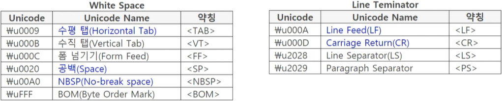
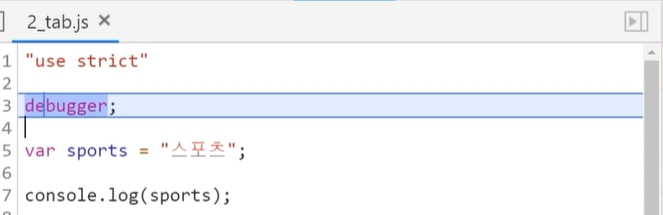
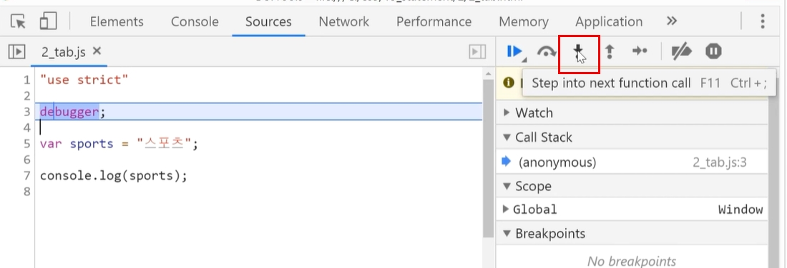
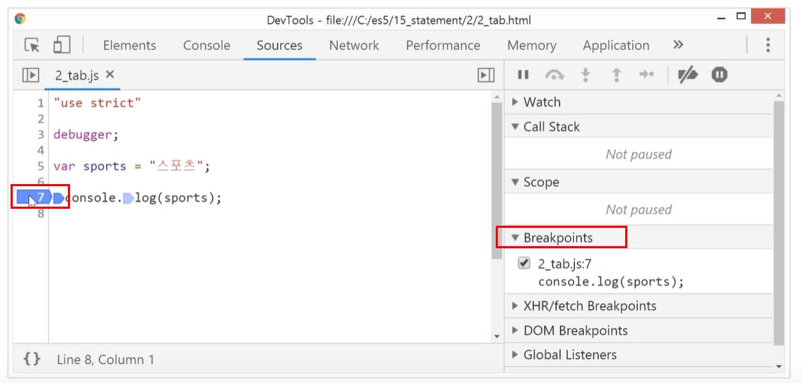
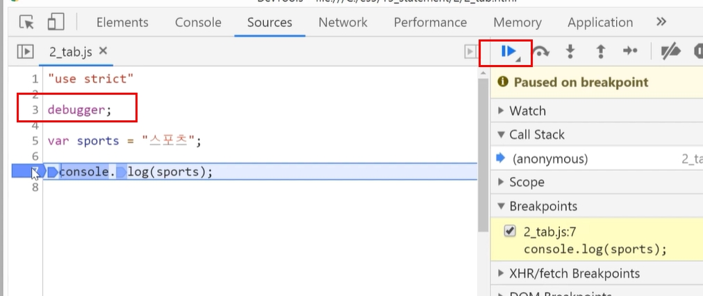
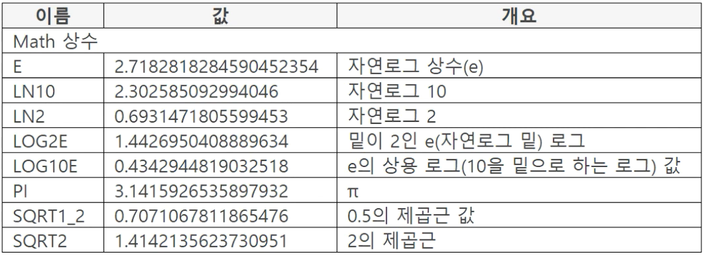

# 자바스크립트
- [강좌 1 - 자바스크립트 비기너: 튼튼한 기본만들기](https://www.inflearn.com/course/%EC%9E%90%EB%B0%94%EC%8A%A4%ED%81%AC%EB%A6%BD%ED%8A%B8-%EB%B9%84%EA%B8%B0%EB%84%88/dashboard)
<br />
<br />
<hr />
<br />
<br />

<details markdown="1">
<summary>1. 자바스크립트 언어 기본 - javascript</summary>

# 자바스크립트 언어 기본 - javascript
## 1. 기본문법
### 1.1. 강좌 환경, Hellow JavaScript
- 본 강의에서는 javascript를 head에 기입하고 defer을 적용한다.
- defer는 순차적으로 실행되는데 head에 기입된 hellow.js 파일이 body에 등록된 엘리먼트들이 다 랜더링된 후 hellow.js 파일을 실행하라는 의미이다. body랜더링 없이 hellow.js 파일이 실행하게 되면 body와 연관된 코드가 있을 경우 에러가 발생한다. 따라서 에러를 막기위해 defer를 쓴 것이다.
  ```javascript
  <head>
    <script src="./hellow.js" defer></script>
  </head>
  ```
<br />

### 1.2. 문장
- **Statement**
  - 문장이란? 자바스크립트 코드의 실행 단위.
  - 세미콜론(;)까지 하나의 문장. (아래 코드 예시, var book = "책";)
  - if() {}; == 조건문 문장 안에 문장이 속한 것도 하나의 조건문 문장이다.
  ```javascript
  if (true ) {
    var book = "책";
    var point = 123;
  };
  if (true) {
    var book = "책";
  };
  ```
- **문장 시작 위치**
  - 위치 제약 없음(개발자에 따라 틀여쓰기 유무).
  - 들여쓰기 : 일반적으로 2칸, 4칸.
  - 가독성이 좋은 코드를 작성하도록 한다.
<br />
<br />

### 1.3. 변수
- Variable : 값을 저장하는 영역.
- 변수 사용 목적 : 변수에 **저장된 값을 재사용**.
- **변수 선언 방법(1)**
  - var == 변수 만들겠다고 선언한다.
  ```javascript
  var book;
  ```
- **값을 변수에 할당하는 방법**
  - 오른쪽의 값을 왼쪽 변수에 할당한다.<br />(오른쪽의 값(책)을 왼쪽변수(book)에 할당)
  ```javascript
  var book = "책";
  ```
- **변수 선언 방법(2)**
  - **콤마로 구분하여 다수의 변수 선언**
    - 콤마(,) 다음에 var를 선언하지 않는다.
    - 콤마와 변수 이름 사이에 일반적으로 한 칸 띄움(가독성O).
    - 마지막 변수 선언 후, 세미콜론(;)을 써준다.
    ```javascript
    var book = "책", point = 123;
    ```
  - **줄을 바꾸어 다수의 변수를 선언한다**
    - 콤마(,)와 줄바꿈으로 다수의 변수를 선언한다.
    - 마지막 변수 선언 후, 세미콜론(;)을 써준다.
    ```javascript
    var book = "책",
        point = 123;
    ```
- 의미를 부여하여 변수 이름을 작명한다. 이를 시맨틱(semantic)이라 한다.<br />변수이름은 포괄적이지 않고 구체적일 수 록 좋다.
- **변수에 값 할당 방법**
  - 맨 마지막에 할당한 값으로 바뀐다.
  - js 코드는 왼쪽에서 오른쪽으로 처리된다.<br />point 값은 123 -> 456 바뀌고 789로 바뀌었다.
  ```javascript
  var point = 123, point = 456;
  point = 789;
  ```
<br />

### 1.4. 주석
- 주석은 js코드로 인식되지 않는다.
- 한 줄 주석<br />// 부터 줄 끝까지 주석으로 처리한다.
  ```javascript
  // var book = "책"
  ```
- 블록 주석<br />/* 와 */ 사이의 모든 코드를 주석으로 처리한다.<br />일반적으로 4~5줄 이상 주석처리할 때 사용된다.
  ```javascript
  /*
  var book = "책";
  var music = "음악";
  */
  ```
- 코드 형태
  - JS 스펙에 정의된 주석은 아니며 블록 주석과 같음
  - 개발자들 사이의 코딩 관례
  - 이렇게 작성하면 프로그램 설명 문서를 자동으로 만들어주는 툴이 있다.
  ```javascript
  /**
   * @function getName
   * 1. 이 형태로 작성
   * @parm {String} code, 코드
   */
  function getName(code) {};
  ```
- JS 스펙(Specification)이란?
  - 자바스크립트 문법을 작성한 문서
  - ES3, ES5는 JS 스펙의 에디션 (= 버전)
<br />
<br />

### 1.5. console.log()
- console.log(..data)
  - 소괄호()아넹 작성된 값을 브라우저 콘솔 창에 출력
  - 문자, 숫자 등을 출력
  - 콤마로 구분하여 다수 작성 가능
  - 소괄호 안에 작성한 값을 강좌에서는 파라미터 값이라고 부른다.
- JS에서 제공하는 것은 아니다.
- [console API 참조](https://console.spec.whatwg.org/#log)
- log, dir, clear 등
- 예시
  - () 소괄호 안에 있는 것을 파라미터.(123, point를 파라미터라고 한다.)
  ```javascript
  console.log(123);   // 123
  var point = 456;
  console.log(point); // 456
  ```
<br />

### 1.6. 정수, 실수, 숫자 처리
- **JS는 정수(12,-12 / 소수가 없는 숫자)와 실수(1.23, 2.45 / 소수를 가진 숫자)를 구분하지 않는다.**
  - 1, 1., 1.0 모두 1.0으로 간주하나 표시는 1로 표시된다.
- **숫자 처리**
  - 정수와 실수를 구분하지 않는다.
  - 64비트 부동 소수점 처리<br />[IEEE 754 표준](https://ko.wikipedia.org/wiki/IEEE_754)
  - 부동 소수점 처리란? 123을 123.0으로 처리<br />(정수를 실수로 처리한다는 의미.)
  - 예시
    - .123처럼 소수점 앞에 값을 작성하지 않으면 0을 붙여 0.123으로 사용한다.
    - 정수와 실수를 구분하는 언어(C++, JAVA)에서는 실수(0.12)와 정수(5)를 더할 수 없다.
    - **JS는 정수와 실수를 구분하지 않고 실수로 계산한다.**
    ```javascript
    console.log(.123);     // 0.123
    console.log(0.12 + 5); // 5.12
    ```
  - ES6에 정수, 실수 구분 추가
<br />
<br />

### 1.7. 상수, 진수
#### 상수
- 변경할 수 없는 값
- 상수 변수
  - 상수가 설정된 변수
  - JS는 변수의 값을 변경할 수 있으므로 상수 변수는 선언적 의미
- **상수 변수 표기 방법**
  - 코딩 관례로 **영문 대문자 사용**<br />var ONE = 1;<br />(상수로 사용한다는 시맨틱 선언)
- **JS가 제공하는 상수값은 변경 불가**
  - MAX_VALUE(최대값), MIN_VALUE(최소값) 등
<br />

#### 진수
- 10 진수 : 123
- 16 진수
  - 0xFF : 255
  - 1번째에 숫자 0 작성
  - 2번째에 영문자 x 작성
  - 3번째 이후 : 0 ~ f 작성<br />대소문자 구분하지 않음
  ```javascript
  console.log(0xF);   // 15
  console.log(0xff);  // 255 
  console.log(0xfff); // 4095
  ```
  - 위 코드 계산하는 방법
    - 0xF : 0x는 16진수를 나타내고 값이 아니다
    - A: 10, B:11, C:12, D:13, E:14, F:15
    - 0xff : 16*15 + 15 로 계산
    - 0xfff : (16*16*15) + (16*15) + 15 로 계산
- 8진수
  - ES3에서 폐지, ES6 재정의
- 2 진수 : ES6에서 특별한 방법 제공(ex. 머신러닝, 딥러닝)
<br />
<br />

### 1.8. 데이터 타입(Data Type)
- 데이터(data)의 사전적 의미는 자료. (= 강좌에서는 데이터로 표기)
- 데이터 타입 형태
  - 숫자 타입 : var value = 123;
  - 문자 타입 : var value = "sports"
- typeof 연산자
  - 데이터(값) 타입 반환
  - tuypeof value에 데이터를 작성
    - 123은 숫자이므로 데이터 타입은 number
    - ""(큰따옴표), ''(작은따옴표)에 작성한 것은 문자이므로 데이터 타입은 string
    ```javascript
    var point = 123;
    console.log(typeof point);  // number
    var book ="책";
    console.log(typeof book);   // string
    ```
- 키워드 
  - 특별한 기능을 가진 단어(= typeof)
- 데이터 타입
  - 데이터 타입을 자료형이라고 부름(= 강좌에서는 데이터 타입이라고 부름.)
  - **데이터 타입을 가짐**
    - JS는 데이터를 기준으로 타입을 결정
    - 타입을 먼저 선언하고 타입에 맞는 데이터를 할당하지 않음<br />(JS는 데이터 값에 따라 타입이 결정된다.)
      ```javascript
      var point = 123;
      console.log(typeof point);  // number
      var book ="책";
      console.log(typeof book);   // string
      ```
<br />

### 1.9. Number 타입, String 타입
- 데이터 타입 분류 : 언어 타입, 스펙 타입
- **언어 타입**
  - JS 프로그램에서 사용할 수 있는 타입
  - Undefined, Null, Boolean, String, Number, Object
- **스펙(문서) 타입**
  - 언어 알고리즘을 위한 타입으로 JS 프로그램에서 사용 불가
  - Reference, List, completion, Property Descriptor, Data Block, Lexical Environment, Lexical Record 등
- **Number 타입**
  - 부호(+, -)를 가진 값
  - 숫자값 범위<br />18,437,736,874,454,810,627<br />(2의 64승 - 2의 53승 + 3)
  - Number 타입의 특수한 3개 값
    - NaN : Not-a-Number<br />(값이 숫자가 아닌 것을 나타내는 값)
    - **자바스크립트는 숫자가 아닌 것을 연산할 때도 프로그램이 죽지 않고 "연산 결과가 숫자가 아닙니다" 라는 NaN 값을 나타낸다.**<br />이것은 되도록이면 프로그램을 죽이지 않으려는 자바스크립트의 특징이자 성향이다.
      ```javascript
      var point = 1 * "A";
      console.log(point);
      ```
    - Infinity : 양수 무한대
    - -Infinity : 음수 무한대
- **String 타입**
  - 문자타입<br />값을 "" 또는 '' 사이에 작성<br />(최대 문자 수 : 2의 53승 - 1)
  - 따옴표에 숫자를 작성하면 문자 타입이 된다.
  - 큰 타옴표와 작은 따옴표를 같이 사용할 때 작성법
    - 작은따옴표를 표시하려면 큰따옴표 안에 작은 따옴표를 작성한다.
    - 큰따옴표를 표시하려면 작은따옴표 안에 큰따옴표를 작성한다.
    ```javascript
    var point = "책, '123'";
    console.log(point)       // 책, '123'
    point = '책, "123"';
    console.log(point)       // 책, "123"
    ```
<br />

### 1.10. Undefined, Null 타입
#### Undefined 타입
- Undefined 타입(대문자, 스펙에서 사용하는 타입)<br />값 : undefined(소문자)
- 변수의 Default(디폴트) 값
  - var point;
  - 변수를 선언만 한 것으로 undefined가 초기값으로 설정
  - 변수에 값을 할당하지 않은 것을 나타내는 시맨틱
- 변수에 undefined 할당 가능
#### Null 타입
- Null 타입(대문자, 스펙에서 사용하는 타입)<br />값 : null(소문자)
- **null 과 undefined 차이**
  - undefined : 단지 변수만 선언.
  - null을 할당해야 값이 null이 됨.
  - 의도적으로 값을 할당한 것으로 코드를 수행한 것이 된다.
<br />
<br />

### 1.11. Boolean 타입, Object 타입
#### Boolean 타입
- 값 : true, false

#### Object 타입
- Object 형태<br />{name : value} 형태
  - 중괄호 {} 안에 key: value 형태로 작성한다.
  - 클론(:)을 기준으로 왼쪽을 프로퍼티 Key (name) 오른쪽을 프로퍼티 값이라 부른다.
  ```javascript
  var book = {
    title: "책",
    point: 123
  };
  ```
- 프로퍼티(property) :<br />name과 value 하나를 지칭
- Object는 프로퍼티 집합

#### 타입 정리
- JS의 기본 데이터 타입 정리
- 기본 데이터 타입을 Primitive(프로미티브) 타입이라고 한다.<br />(시맨티적으로 데이터 타입을 짐작할 수 있다.)
  ```javascript
  console.log(typeof 123);        // number
  console.log(typeof "문자열");   // string
  console.log(typeof true);       // boolean
  console.log(typeof undefined);  // undefined
  ```
- 데이터 타입이 같다?
  - object 데이터 타입
    - null과 {book: "책"}의 데이터 타입이 object 이다.<br />2개를 구분 지을 수 없다. 단, ES6 문법에서는 이를 해결할 방법이 나왔다고 한다.
    - **null의 데이터 타입은 null이 아니다.**
    ```javascript
    console.log(typeof null);             // object
    console.log(typeof {book: "책"});     // object
    ```
<br />
<br />
<br />

## 2. 연산자(Operator)
### 2.1. 연산자, 표현식
#### 연산자
- 연산의 사전적 의미 : 규칙에 따라 계산하여 값을 구함
- 연산자(Operator) 형태
  - (사칙연산) +, -, *, /, %
  - (부등호) >, >=, <, <=
  - (동등) ==, !=, ===, !==
  - 콤마(,), typeof, delete, void
  - instanceof, in, new 등

#### 표현식
- 표현식(Expression) 형태
  - 1 + 2
  - var total = 1 + 2;
  - var value = total / ( 2+ 3);
- "표현식을 평가(ex. 1+2)"한다고 한다.
- 표현식을 평가하면 결과가 반환되며 이를 "평가 결과"라고 한다.<br />**즉, 자바스크립트는 표현식의 연결이다.**
<br />
<br />

### 2.2. 할당 연산자, 해석/실행 순서
#### 할당 연산자
- 단일 할당 연산자
  - = 하나만 사용
  - var result = 1 + 2;
- 복합 할당 연산자
  - = 앞에 연산자 작성
  - += , -=, *=, /=, %=
  - <<=, >>=
  - >>>=, &=, ^=, |=
- 먼저 = 앞을 연산한 후, 할당
  - var point = 7'
  - point += 3;

#### 해석, 실행 순서
- 해석이란?
  - JS코드를 기계어로 바꾸는 것. Compile
  - "엔진(Engine)이 해석(컴파일)하고 실행한다"라고 한다.
- 실행 순서
  - var result = 1 + 2 + 6;
  - = 왼쪽의 표현식 평가
  - = 오른쪽의 표현식 평가<br />왼쪽에서 오른쪽으로 평가 (1 + 2, 3 + 6)
  - = 오른쪽 표현식의 평가 결과를 왼쪽 표현식 평가 결과에 할당
<br />
<br />

### 2.3. 산술 연산자(+ 연산자)
#### + 연산자
- +양쪽의 표현식을 평가<br />평가 결과를 더함
  - 우선 1과 2를 더하고 이어서 더한 값(3)에 4를 더한다.
  - 더한 값(7)을 value 변수에 할당한다.
  ```javascript
  var value = 1 + 2 + 4;
  console.log(value);    // 7
  ```
- 평가 결과 연결<br />한 쪽이라도 숫자가 아니면 연결
  - **한 쪽이라도 평가 결과가 Number 타입이 아니면 평가 결과를 더하지 않고 연결**한다.
  ```javascript
  var two = "2";
  var value = 1 + two;
  console.log(value);        // 12
  console.log(typeof value); // string
  ```
- 왼쪽에서 오른쪽으로 연산<br />1+5+"ABC" 결과는?
  - 우선 1과 5를 더하면 6이 된다.
  - 이어서 6과 "ABC"를 연결한다.
  ```javascript
  var value = 1+5+"ABC";
  console.log(value)      // 6ABC
  ```
<br />

### 2.4. 숫자로 변환
- JS는 연산하기 전에 우선 숫자로 변환한다.
- 변환된 값으로 연산한다.
  | 값 타입   | 변환 값                                        |
  |:----------|:----------------------------------------------|
  | Undefined | NaN                                           |
  | Null      | +0                                            |
  | Boolean   | true: 1, false: 0                             |
  | Number    | 변환 전/후 같음                                |
  | String    | 값이 숫자이면 숫자로 연산(단, 더하기(+)는 연결) |
  
  - undefined 더하기
    - value 값은 undefined<br />[(※참고, 변수의 디폴트값은 undefined)](https://github.com/eunhye8767/__inflearn/tree/master/03_opentutorials#undefined-%ED%83%80%EC%9E%85)
    - 10과 undefined를 더하면 NaN(Not-a-Number)
    ```javascript
    var value;
    log(10 + value);  // NaN
    ```
  - Null, Boolean 값으로 더하기
    - null은 0으로 변환
    - true는 1로, false는 0으로 변환
    ```javascript
    log(10 + null);   // 10
    log(10 + true);   // 11
    log(10 + false);  // 10
    ```
  - 숫자를 문자열로 작성
    - 더하기는 값이 숫자라도 타입이 String이면 문자열로 연결하지만<br />**-, *, /는 숫자로 변환하여 연산한다.**
    - typeof 연산자로 Number 타입 여부 체크
    ```javascript
    log(10 + "123");    // 10123 (string)
    log(123 - "23");    // 100   (Number)
    ```
<br />

### 2.5. 산술 연산자(-, *, /, % 연산자)
#### -(빼기) 연산자
- 왼쪽 표현식 평가 결과에서 오른쪽 표현식 평가 결과를 뺍니다.
- **String 타입이지만, 값이 숫자면 Number 타입으로 변환하여 계산**된다.
  - "135"가 String 타입이지만 **값이 숫자이므로 값을 Number 타입으로 변환하여 계산**
  ```javascript
  log("135" - 2);    // 133
  ```

#### *(곱하기) 연산자
- 왼쪽 표현식 평가 결과와 오른쪽 표현식 평가 결과를 곱한다.
- 숫자 값으로 변환할 수 있으면 변환하여 곱한다
- NaN 반환<br />(양쪽의 평가 결과가 하나라도 숫자가 아닐 때)
  - "20"은 string 타입이라도 값이 숫자면 숫자타입으로 변환하여 10 * 20이 된다.
  - true = 1, false = 0
  - null = 0;
  - "A" 처럼 하나라도 숫자가 아닐 때, NaN
  ```javascript
  log(10 * "20");   // 200
  log(10 * true);   // 10
  log(10 * false);  // 0
  log(10 * null);   // 0
  log(10 * "A");    // NaN
  ```
- 소수 값이 생기는 경우 처리
  - 2.3 * 3 경우, 6.9로 출력되지 않는다.<br />(정상적인 값. IEEE 754 유동 소수점 처리 때문)
  - 이를 해결하기 위해, 실수를 정수로 변환(2.3 * 10)하여 값을 구하고(23 * 3)<br />다시 정수를 실수로 변환(69 / 10)한다.<br />(소수가 2자리일 때, 100을 곱해주고 나눠주면 된다. ex. 2.34 * 100 * 3 / 100 )
  ```javascript
  log(2.3 * 3);             // 6.8999999999999995
  log(2.3 * 10 * 3 / 10);   // 6.9
  ```

#### /(나누기) 연산자
- 왼쪽 표현식 평가 결과를 오른쪽 표현식 평가 결과로 나눈다.
- NaN 반환
  - 양쪽의 평가 결과가 하나라도 숫자가 아닐 때
  - 분모, 분자 모두 0일 때
  ```javascript
  log(123 / "a")  // NaN 
  log(0/0);       // NaN
  ```
- 분모, 분자가 0일 때
  - 분모가 0이면 infinity 반환
  - 분자가 0이면 0 반환
  ```javascript
  log(10/0);    // infinity
  log(0/10);    // 0
  ```

#### %(나머지) 연산자
- 왼쪽 표현식 평가 결과를 오른쪽 표현식 평가 결과로 나누어 나머지를 구한다.
- 3 % 2의 나머지는 1
- 5를 2.5로 나누면 나머지가 0<br/>소수 끝에 36이 있는 것은 IEEE 754의 유동 소수점 처리 땜<br />실수를 정수로 변환하여 연산하고 다시 정수를 실수로 변환.
  ```javascript
  log(5 % 2.5);                       // 0
  log(5 % 2.3);                       // 0.40000000000000036
  log(5 * 10 - (2 * 2.3 * 10)) / 10); // 45.4
  ```
<br />

### 2.6. 단항 연산자
#### 단항 + 연산자
- 형태 : +value
- 값을 Number 타입으로 변환
- 코드 가독성
  - +를 더하기로 착각할 수도 있음
  - Number()도 기능 같음<br />**(+value보단 Number()함수가 가독성이 더 좋음)**
  ```javascript
  var value = "7";
  log(typeof value);          // string
  log(typeof +value);         // number
  log(typeof Number(value));  // number
  ```
<br />

#### 단항 - 연산자
- 형태 : -value
- 값의 부호를 바꿈<br />+는 -로, -는 +로 바꿈.
- 연산할 때만 바꿈<br />원래 값은 바뀌지 않음.
- 코드 예시)
  - -value : 7을 -7로 바꾼다.
  - 8 + -value => 8 + -7 = 1
  - value 변수값의 부호는 바뀌지 않는다.
  ```javascript
  var value = 7;
  log(-value);      // -7
  log(8 + -value);  // 1
  log(value);       // 7  
  ```
  ```javascript
  // 가독성이 좋지 않다.
  log(8 + -value);
  // 위의 코드대신 -1를 곱해주어 가독성을 높여준다
  log(8 + (value * -1));
  ```
<br />

### 2.7. 후치, 전치, 논리 NOT 연산자
#### 후치 ++ 연산자
- 형태 : value++
- 값을 자동으로 1 증가시킨다.
  - 문장을 수행한 후에 1 증가.
  - 즉, **세미클론(;) 다음에 증가.**
- 코드 예시)
  - one++를 하면 1이 2가 되지만 문장 안이므로 1이 증가하지 않는다.<br />1 + 3을 하게 되어 4가 된다.
  ```javascript
  var one = 1;
  var value = one++ +3;
  log(value);   // 4
  log(one);     // 2
  ```

#### 후치 -- 연산자
- 형태 : value--
- 값을 자동으로 1 감소시킨다.
  - 문장을 수행한 후에 1 감소.
  - 즉, **세미클론(;) 다음에 감소.**
- 코드 예시)
  - two--를 하면 2가 1이 되지만, 문장 안이어서 1이 감소되지 않는다.<br />2 + 3을 하게 되어 5가 출력된다.
  ```javascript
  var two = 2;
  var value = two-- + 3;
  log(value);   // 5
  log(two);     // 1
  ```

#### 전치 ++ 연산자
- 형태 : ++value
- 값을 자동으로 1 증가시킴.
  - **문장 안에서 1 증가.**
  - 표현식을 평가하기 전에 1증가<br />표현식에서 증가된 값을 사용.
- 코드 예시)
  - 문장이 끝나가기 전, 먼저 1을 증가시키고 3을 더한다<br />2 + 3을 하게 되므로 5가 출력된다.
  ```javascript
  var one = 1;
  var value = ++one + 3;
  log(value);   // 5
  ```

#### 전치 -- 연산자
- 형태 : --value
- 값을 자동으로 1 감소시킴.
  - **문장 안에서 1 감소.**
  - 표현식을 평가하기 전에 1 감소<br />표현식에서 감소된 값을 사용.
- 코드 예시)
  - 문장이 끝나가기 전, 먼저 1을 감소시키고 3을 더한다<br />1 + 3을 하게 되므로 4가 출력된다.
  ```javascript
  var two = 2;
  var value = --two + 3;
  log(value);   // 4
  ```

#### ! 연산자(논리(Logical) NOT 연산자)
- 형태 : !value
- 표현식 평가 결과를 true, false로 변환한 후 true이면 false를 false이면 true를 반환.
- 원래 값은 바뀌지 않으며 사용할때만 변환.
- 코드 예시)
  - !value = true를 바꾸어 false로 출력.
  - A는 true, !A는 false, !!A는 true.
  ```javascript
  var value = true;
  log(!value);  // false
  log(!!"A");   // true
  ```
<br />

### 2.8. 유니코드, UTF
#### 유니코드
- **Unicode**
  - 세계의 모든 문자를 통합하여 코드화
  - 언어, 이모지 등
  - 코드 값을 코드 포인트(code point)라고 부름
  - 0000~FFFF, 10000~1FFFF 값에 문자 매핑
  - 유니코드 콘소시엄 [https://home.unicode.org](https://home.unicode.org/)
- **표기방법**
  - u와 숫자 형태 : u0031은 숫자 1
  - JS는 u앞에 역슬래시(\) 작성
    ```javascript
    log("\u0031");  // 1
    log("\u0041");  // A
    log("\u1100");  // ㄱ
    log("\uac01");  // 각
    ```
  - 역슬래시(\)를 문자로 표시하려면 역슬래시(\\) 2개 작성
    ```javascript
    log("\\u0031"); u0031
    log("\\u0041"); u0041
    ```
  - ES6에서 표기 방법 추가됨<br />
  (ES6에서 4자리(0000) -> 5자리(10000)로 지원하게 됨, 5자리 코드를 사용하려면 ES6 문법으로 사용)

#### UTF
- Unicode Transformation Format
- 유니코드의 코드 포인트를 매핑하는 방법
- UTF-8, UTF-16, UTF-32로 표기
- < meta charset="utf-8" >
- UTF-8은 8비트로 코드 포인트 매핑
- 8비트 인코딩(Encoding)이라고 부름
<br />
<br />

### 2.9. 관계 연산자
- <, >, <=, >= 연산자
- instanceof 연산자, in 연산자<br />(사전 설명이 필요하므로 관련된 곳에서 다룰 예정.)

#### > 연산자
- 부등호 : Greater-than
- 양쪽이 Number 타입일 때
  - 왼쪽이 오른쪽보다 크면 true 반환 아니면 false 반환
    - 먼저 표현식을 평가하여 값을 구한다.
    - 3이 1보다 크므로 true를 반환한다.
    - 수학 값으로 비교한다.
    ```javascript
    log((1 + 2) > 1);  // true
    ```
- String 타입 비교
  - 한 쪽이 String 타입이면 false
    - 숫자 1과 문자열 A를 비교하면 false
    ```javascript
    log(1 > "A");  // false
    ```
  - **양 쪽이 모두 String 타입이면 유니코드 사전 순서로 비교**
    - 코드포인트 \u0033 : 3 , \u0032 : 2
    - 코드포인트 \u0041 : A . \u0031 : 1
    - 코드포인트는 유니코드를 등록할 때 부여
    - 유니코드 등록 순서로 비교( = 유니코드 사전 순서로 비교한다고도 말함)
    - "가" 와 "다"도 유니코드 사전 순서로 비교
    ```javascript
    log(("\u0033" > "\u0032"));  // true
    log("A" > "1");              // true
    log("가" > "다");            // false
    ```
  - 문자 하나씩 비교
    - 왼쪽에서 오른쪽으로 문자 하나씩 비교<br />A와 A가 같으므로 다음을 비교.<br />0과 2를 비교하게 되며, false 반환.
    - 결정이 되면 다음 것은 비교하지 않습니다.
    ```javascript
    log("A07" > "A21");  // false
    ```
- **<, <=, >= 는 비교 기준만 다름**
<br />
<br />

### 2.10. 동등, 부등, 일치, 불일치 연산자
#### == 연산자
- 동등 연산자
- 왼쪽과 오른쪽 값이 같으면 true, 다르면 false
- 값 타입은 비교하지 않음<br />1과 "1"이 같음
  - [코드 1] 숫자 타입으로 변환
    - 값 타입이 다르면<br />문자 : 숫자 , 숫자 : 문자 일 때<br />문자 타입을 숫자 타입으로 변환하여 비교
    - 따라서 모두 1 이므로 true 반환
    ```javascript
    log(1 == "1");   // true
    ```
  - [코드 2] undefined 비교
    - 양쪽이 모두 undefined이므로 true
    ```javascript
    var value;
    log(value == undefined);  // true
    ```
  - [코드 3] undefined, null 비교
    - undefined와 null을 비교하면 ture
    - **undefined와 null은 값입니다.<br />값이 다른데도 true가 되므로 주의**
    ```javascript
    var value;
    log(valur == null);  // true
    ```
#### != 연산자
- 부등 연산자
- 왼쪽과 오른쪽 값이 다르면 true, 같으면 false
- a != b 와 !(a == b) 가 같음
<br />

#### === 연산자
- 일치 연산자<br />**==(동등 연산자)보단 ===(일치연산자)를 사용하여 정확하게 비교하는 것이 바람직하다.**
- 왼쪽과 오른쪽의 **값과 타입이 모두 같으면** true, 값 또는 타입이 다르면 false
- 1 === 1, true<br />1 === '1', false
  - [코드 1] 타입이 다름
    - 값은 같지만 타입이 다르므로 false
    ```javascript
    log(1 === "1");   // false
    ```
  - [코드 2] undefined, null 비교
    - var로 변수를 선언만 하면 변수값은 undefined
    - undefined와 null은 값이다.
    - ==(동등 연산자)로 비교하면 true, ===(일치연산자)로 비교하면 타입이 다르므로 false
    ```javascript
    var value;
    log(value == null);   // true
    log(value === null);  // false
    ```
#### !== 연산자
- 불일치 연산자
- 값 또는 타입이 다르면 true, true가 아니면 false
<br />
<br />

### 2.11. 콤마, 그룹핑, 논리 연산자
#### 콤마 연산자
- 기호 : ,(comma)
- 콤마로 표현식을 분리
  - var a = 1, b = 2;
  - 한 번만 var 작성

#### () 연산자
- 그룹핑 연산자
- 소괄호() 안의 표현식을 먼저 평가
  - 평가한 값을 반환
  - 5 / (2 + 3)

#### || 연산자
- 논리 OR 연산자
- **표현식의 평가 결과가 하나라도 true 이면 true, 아니면 false**
  - value 변수값은 undefined 이므로 false
  - zero 변수값이 0이므로 false ( flase = 0, true = 1)
  - two 변수값이 2이므로 true가 되며 two 변수값으로 반환
  - true가 아니라 true가 되는 변수값 반환<br />2가 true이므로 전체 비교는 true
  ```javascript
  var value, zero = 0, two = 2;
  log(value || zero || two);  // 2
  ```
  - **모두가 false일 때, 마지막까지 비교하였는데 모두가 false이면 false가 아니라 마지막 변수값 반환.**
    ```javascript
    var value, zero = 0;
    log(zero || value);  // undefined
    ```
- **왼쪽 결과가 true 이면 오른쪽은 비교하지 않음.**
  - 왼쪽의 (one === 1) 결과가 true이므로 true 반환
  - 왼쪽 비교 결과가 true이면 오른쪽은 비교하지 않음
  - 오른쪽을 비교하면 tow 변수가 없으므로 에러 발생
  ```javascript
  var one = 1;
  log(one === 1 || two === 2);  // true
  ```

#### && 연산자
- 논리 AND 연산자
- 표현식의 평가 결과가 모두 true이면 true 아니면 false
  - one 변수값이 1이므로 true, true이므로 오른쪽을 비교
  - tow 변수값이 2이므로 ture, **모두가 true 이며 마지막의 2를 반환**
  ```javascript
  var one = 1; two = 2;
  log( one && two);     // 2
  ```
- 왼쪽 결과가 false이면 오른쪽은 비교하지 않음
  - one 변수값이 1이므로 true. true이므로 오른쪽 비교
  - zero 변수값이 0이므로 false. false이므로 오른쪽을 비교하지 않고 zero 변수값 0 반환
  - nine을 비교하면 nine 변수가 없으므로 에러 발생
  ```javascript
  var one = 1. zero = 0;
  log(one && zero && nine);   // 0
  ```
<br />
<br />

### 2.12. 조건 연산자, 연산자 우선순위
#### 조건 연산자 (= 3항 연산자)
- 기호 : exp ? exp-1 : exp-2<br />(3항 연산자라고도 함)
- exp 위치의 표현식을 먼저 평가
  - true 이면 exp-1의 결과 반환<br />flase 이면 exp-2의 결과 반환
- 조건 연산자 코드 예시
  - 1과 1은 값과 타입이 같으므로 true.<br /> ? 다음의 표현식을 실행
  - 1과 "1"은 값은 같지만 타입이 다르므로 false.<br /> : 다음의 표현식을 실행
  ```javascript
  log(1 === 1 ? "같음" : "다름");    // 같음
  log(1 === "1" ? "같음" : "다름");  // 다름
  ```

#### 연산자 우선순위
- 연산자의 실행 우선순위(ECMA-262 스펙에 없음)
- 우선순위가 가장 높은 것은 ()
- [MDN Operator precedence - 연산자 우선순위](https://developer.mozilla.org/ko/docs/Web/JavaScript/Reference/Operators/Operator_Precedence)
<br />
<br />
<br />

## 3. 문장(Statement)
### 3.1. 문장, 화이트 스페이스, 세미콜론 자동 삽입, 블록
#### 문장
- 형태 : ;(세미콜론)
- 문장을 끝나게 하는 역할<br />var book = '책';
<br />

#### 화이트 스페이스(White Space)
- 사람 눈에 보이지 않는 문자
  - 가독성을 위한 것
  - 문자마다 기능을 갖고 있음
  

#### 세미콜론 자동 삽입
- 세미콜론(;)은 문장 끝에 작성
- 세미콜론을 삽입하여 
  - 자동으로 문장이 끝나게 합니다. (ES5부터 지원)
  - JS엔진이 분석 및 삽입
    - var one = 1 끝에 ;을 작성하지 않았습니다.
    - 두 줄의 코드를 연결하면 var one = 1 var two = 2; 형태가 되며 var을 2번 작성했으므로 에러.
    - 에러가 나지 않은 것은 엔진이 1의 끝에 세미콜론을 삽입하여 문장을 완성시키기 때문이다.
    - 줄을 분리해야 화이트 스페이스(LF/CR) 앞에 세미콜론을 자동 삽입한다.<br />한 줄에 작성하면 삽입하지 않는다.
    ```javascript
    var one = 1
    var two = 2;
    log(one);    // 1
    ```

#### 블록
- 형태 : { 문장 리스트 opt}
  ```javascript
  var one = 1. two = 1;
  if (one === two) {
    var result = one + two;
    console.log(result);    // 2
  }
  ```
- 중괄호 {}
  - 실행 그룹으로
  - 블록 안의 모든 문장 실행
- 문장 리스트
  - {} 안의 모든 문장
  - 문장 리스트 작성은 선택(option)
  - 강좌에서 option을 opt로 표기
<br />  
<br />  

### 3.2. if, debugger
#### if
- 형태 :<br />if (표현식) 문장 1<br />if (표현식) 문장 1 else 문장2
- 조건에 따른 처리
  - 먼저 표현식을 평가
  - 평가 결과를 true/false로 변환
  - true이면 문장1 실행
    - [코드 1] 블록 사용하지 않음
      - 한 줄에 이어서 작성
      - 줄을 바꿔 작성<br />세미클론(;)까지 if 조건 실행
      ```javascript
      var a = 1, b = 1;
      if ( a === b) console.log("블록을 사용하지 않음");  // 블록을 사용하지 않음

      if ( a === b)
        console.log("1번 줄")    // 1번 줄
        console.log("2번 줄");   // 2번 줄
      ```
    - [코드 2] 블록 사용
      - 블록에 작성한 모든 문장 실행
      - **블록 사용 권장<br />(확장성과 일관성을 위해서)**
      ```javascript
      var a = 1, b = 1;
      if ( a === b) {
        console.log("블록 사용");   // 블록 사용
      }
      ```
  - false이면 문장2 실행
    - [코드 1] if else, 블록 사용하지 않음
      - 블록을 사용하지 않은 형태
      ```javascript
      var a = 1, b = 2;
      if ( a === b)
        console.log("블록 사용하지 않음, true");
      else
        console.log("블록 사용하지 않음, else");  // 블록 사용하지 않음, else
      ```
    - [코드 2] if else, 블록 사용
      - 블록을 사용한 형태
      ```javascript
      var a = 1, b = 2;
      if ( a === b) {
        console.log("블록 사용, true");
      } else {
        console.log("블록 사용, else");  // 블록 사용, else
      }
      ```

#### debugger
- debugger 위치에서 실행 멈춤
  - 브라우저의 개발자 도구 창이 열려 있을 때만 멈춤
  - 열려있지 않으면 멈추지 않음
  - ES5부터 지원
    - debugger가 있는 위치에서 실행이 멈춘다.
    ```javascript
    var sports = "스포츠";
    debugger;
    log(sports);
    ```
- debugger 실행
  - 개발자 도구 열기 (Ctrl + Shift + I)
    - Chrome 맞춤 설정 및 제어
    - 도구 더보기
    - 개발자 도구(D)
  - 브라우저 새로고침 실행(F5)
  - debugger 위치에서 실행 멈춤<br />
    
  - F11 또는 아래 빨간 네모친 부분을 클릭하면 debugger 다음 라인이 실행된다.<br />다음 라인이 실행되면서 console.log(sports) 내용이 화면 출력된다.<br />
    
  - debugger 종료(F8)
  - **Breakpoints**
    - Sources 탭에서 라인 번호를 클릭하면 Breakpoints에 관련 코드가 저장이 된다.<br />
      
    - 그리고 debugger 에서 실행 버튼을 클릭하면 Breakpoints에 저장된 코드가 실행이 된다.
      
<br />
<br />

### 3.3. while, do-while
#### while
- 형태 : while(표현식) 문장
- **표현식의 평가 결과가 false가 될 때까지**
  - 문장을 반복하여 실행
  - 반복이 종료되는 조건 필요
    - while의 표현식 평가 결과가 3보다 작으면 true이므로 while 블록의 문장 리스트를 수행한다.
    - k가 3이 되면 평가 결과가 false가 되므로 블록의 문장 리스트를 수행하지 않는다.
    - 표현식 평가 결과가 false가 되도록 조치를 취하지 않으면 무한 반복
    _ 실행 결과  : 1 / 2
    ```javascript
    var k = 1;
    while(k < 3) {
      console.log(k);
      k++;
    }
    ```

#### do ~ while
- 형태 : do 문장 while(표현식)
- 처리 방법은 while 문과 같음<br />단, do 문을 먼저 실행
  - 먼저 do 문을 실행한다.<br />실행결과, do : 0이 출력된다.
  - while 문의 표현식을 평가한다.
  - 평가 결과가 true이면 do 문의 블록을 다시 실행 k가 1이며, 3보다 작으므로 do 문을 실행한다.
  - 평가 결과가 false이면 while 문의 블록 실행
  - k가 3이면 while 문의 블록을 실행
  ```javascript
  var k = 0;
  do {
    log("do:", k);
    k++;
  } while (k<3) {
    log("while:", k);
  }
  ```
- while문에서는 while문의 조건이 true면 실행했지만<br />**do ~ while문에서는 while문의 조건이 true면 do문이 실행되고 while문의 조건이 false일 때 while문이 실행**된다.
<br />
<br />

### 3.4. for, [코딩 시간]
#### for()
- 형태 : for (초깃값opt; 비교opt; 증감opt) 문장
- 2번째의 비교 표현식의 평가 결과가 true인 동안 문장을 반복 실행
  1. var k = 0;<br />초기값 할당, 처음 한 번만 할당한다.
  2. k < 2;<br />비교 표현식을 평가한다.
  3. 평가 결과가 true이면 for() 블록의 코드를 실행한다.
  4. 처음 반복은 k가 0이므로 true가 되어 블록의 console.log(k) 실행
  5. k++<br />k 변수값을 1증가시킨다.
  6. 다시 2번부터 5번까지 실행<br />k가 2가 되면 2번에서 false가 되며 for() 문을 종료시킨다.
  ```javascript
  for (var k=0; k<2; k++) {
    log(k);
  }
  ```

#### for() 옵션
- 형태 : for (초기값opt; 비교opt; 증감opt) 문장
- 형태에서 opt는 생략 가능
  - 증감 생략
    - 증감 표현식에서 kk 작성하지 않았으며 블록에서 k 변수값을 증가시킨 형태
    - 실행결과 : 0, 1. 2
    ```javascript
    for(var k = 0; k < 3) {
      log(k);
      k++;
    }
    ```
  - 초기값과 증감 생략
    - **for()문에 초기값을 작성하지 않더라고 ;은 작성**해야 한다.
    - 대신 for()문 앞에서 k 변수에 초기값을 할당한다.
    - 증감 표현식을 작성하지 않고 블록에서 k 변수값을 증가시킨다.
    ```javascript
    var k = 0;
    for (; k<3;) {
      log(k);
      k++;
    }
    ```
  - 비교와 증감 생략 (옳지 못한 코드)
    - ;은 작성해야 한다
    ```javascript
    for (var k = 0; ;) {
      log(k);
      k++;
      if (k >2) {
        // for() 문 종료
        break;
      }
    }
    ```
  - 모두 생략 (옳지 못한 코드)
    - ;은 작성해야 한다.
    ```javascript
    var k = 0;
    for (;;) {
      log(k);
      if( k === 2) {
        // for() 문 종료
        break;
      }
      k++;
    }
    ```

#### 코딩 시간
- for() 문을 사용하여
  - 1에서 50까지 반복하면서
  - 홀수 번째 값과
  - 짝수 번째 값을 누적하고
  - 반복한 값을 누적한다.
- 반복을 완료하면
  - 누적한 홀수 번째 값과
  - 누적한 짝수 번째 값을 출력한다.
  - 누적한 전체 값을 출력한다.
```javascript
for(let i=1; i<51; i++) {
    (i%2 === 0) ? console.log("짝수 :" + i) : console.log("홀수 :" + i);
}
```
<br />

### 3.5. break, continue
#### break
- 형태 : <br />break;<br />break 식별자;
- 반복문 종료
  - [코드 1] break 위치에서 종료
    - m이 2이면 while()문을 종료. console.log(m)을 실행하지 않는다.
    ```javascript
    var k = 0, m = 0;
    while (k < 3) {
      m++;
      if ( m === 2) {
        break;
      }
      log(m);
    }
    ```
  - [코드 2] 세미콜론 자동 첨부
    - 실행경과 : 0
    - break 끝에 세미콜론을 자동으로 첨부.
    - console.log("k === 1")을 실행하지 않는다.
    ```javascript
    for (var k=0; k<3; k++) {
      if (k === 1) {
        break
        log("k === 1");
      };
      log(k);
    }
    ```
- for, for ~ in, while, do ~ while, switch에서 사용

#### continue
- 형태 :<br />continue;<br />continue 식별자;
- 반복문의 처음으로 분기
  - [코드 1] continue 위치에서 분기
    - k가 2 또는 3이면 continue 문을 수행
    - 아래의 console.log(k)를 실행하지 않는다.
    ```javascript
    for (var k = 0; k < 5; k++) {
      if (k === 2 || k ===3) {
        continue;
      };
      log(l)
    }
    ```
- for, for ~ in, while, do ~ while에서 사용
<br />
<br />

### 3.6. switch
- 형태 :
  ```javascript
  switch(표현식) {
    case 표현식 : 문장 리스트opt
    default: 문장 리스트opt
  };
  ```
- switch 표현식의 평가 값과 일치하는 case문 수행
  - [코드 1] 일치하는 case문 실행
    - switch(exp)에서 exp를 평가하여 값을 구하고 구한 값에 일치하는 case문을 수행
    - exp값이 1이므로 case: 1을 수행
    - **※주의※**<br />case 1 아래의 모든 문장을 수행하므로 200이 출력된다.<br />이를 방지하려면 **break를 작성**해야 한다.
    ```javascript
    var exp = 1;
    switch(exp) {
      case 1 :
        log(100);
      case 2 :
        log(200);
    }
    ```
- break 사용
  - [코드 2] breakk 사용
    - switch(exp)의 값이 1이므로 case 1:을 수행
    - break문을 만나 switch문을 빠져나간다.
    - 따라서, case 2:를 수행하지 못 한다.
    ```javascript
    var exp = 1;
    switch(exp) {
      case 1 :
        log(100);
        break;
      case 2 :
        log(200);
    }
    ```
- 일치하는 case가 없으면 default 수행
  - [코드 3] default 실행
    - switch(exp)의 값이 7이므로 일치하는 case가 없다. 이 때 default 코드가 실행된다.
    - case 2:도 실행한다. (break; 문이 없어서 case 2도 실행이 된다)
    ```javascript
    var exp = 7, value;
    switch(exp) {
      case 1:
        value = 100;
      default :
        value = 700;
      case 2:
        value = 200;
    }
    log(value); // 200
    ```
- OR(||) 형태
  - [코드 4] OR 형태
    - exp 값이 2 또는 3이면 case 수행
    ```javascript
    var exp = 3;
    switch(exp) {
      case 2:
      case 3:
        log(100);
    }
    ```
<br />

### 3.7. try-catch, throw
#### try-catch
- 형태 :<br />try 블록 catch (식별자) 블록<br />try 블록 finally 블록<br />try 블록 catch (식별자) 블록 finally 블록
- try 문에서 예외 발생을 인식
- 예외가 발생하면 catch 블록 실행
  - [코드 1] try - catch
    - 실행결과 : catch 실행
    - try 블록에서 ball을 value에 할당할 때 ball 변수가 없으므로 에러 발생
    - 에러가 발생하면 catch(error) 블록 실행<br />파라미터 error에 JS의 Error 오브젝트 설정
    - error는 식별자로 임의의 이름 사용 가능
    - (통신 등의 데이터를 가져왔을 때 try문에 있으면 오류 발생 시 프로그램이 멈추는 것이 아닌 catch문이 실행이 된다.) 때문에 에러가 발생할 가능성이 있으면 반드시 try - catch를 사용해야 한다.
    ```javascript
    var value;
    try {
      value = ball;
    } catch(error) {
      log("catch 실행");
    }
    ```
- finally 블록은 에외 발생과 관계없이 실행
  - [코드 2] finally
    - 실행결과 : catch 실행 / finally 실행
    - try에서 에러가 발생하면<br />catch() 블록을 실행한 후, finally 블록 실행
    - try에서 에러가 발생하지 않더라도 finally 블록 실행
    - **즉, finally문은 에러 발생유무 상관없이 무조건 마지막에 실행이 된다.**
    ```javascript
    var sports;
    try {
      sports = ball;
    } catch(error) {
      log("catch 실행");
    } finally {
      log("finally 실행");
    }
    ```

#### throw
- 형태 : throw 표현식;
- 명시적으로 예외를 발생시킴 (의도적으로 에러 발생)
- 예외가 발생하면 catch 실행
  - [코드 1] 예외를 발생시킴
    - "throw" 표현식에 문자열을 작성한 형태
    - throw를 만나면 에러가 발생하며 catch 블록이 실행된다.<br />throw 아래의 코드는 실행하지 않는다.
    - catch(error)의 error에 throw 표현식의 문자열이 설정된다.<br />(throw에 적용된 문자열이 catch(error)에서 error로 정보를 받는다.)
    ```javascript
    try {
      throw "예외 발생시킴";
      var sports = "스포츠";
    } catch(error) {
      log(error);
      log(sports);
    }
    ```
  - [코드 2] {name: 메세지} 형태
    - throw 표현식에 오브젝트를 작성한 형태
    - catch(error)의 error에 Error 오브젝트가 설정된다.
    ```javascript
    try {
      throw {
        msg : "예외 발생시킴",
        bigo : "임의의 이름 사용"
      };
    } catch(error) {
      log(error.msg);
      log(error.bigo);
    }
    ```
  - [코드 3] Error 오브젝트 사용
    - throw 표현식에 Error 오브젝트 작성<br />Error()의 파라미터에 메시지 작성<br />오브젝트의 message에 메시지가 설정된다.
    - catch(error)의 error에 Error 오브젝트가 설정된다.
    - error.message로 작성한 메시지 사용
    ```javascript
    try {
      throw new Error("예외 발생시킴");
    } catch(error) {
      log(error.message);
    }
    ```
  <br />

  ### 3.8. strict 모드, [코딩 시간]
  #### strict 모드
  - 형태 : "use strict"
  - 엄격하게 JS 문법 사용의 선언
  - 작성한 위치부터 적용
    - [코드 1] use strict 작성하지 않음
      - var를 작성하지 않은 형태
      - var를 사용하여 변수를 선언해야 하지만 변수가 선언되고 "책"이 할당된다.
      - **※ var 없이 변수를 선언할 순 있지만 옳은 방법은 아니다!**
      ```javascript
      book = "책";
      log(book);  // 책
      ```
    - [코드 2] use strict 작성
      - 실행결과 : book is not defined 출력
      ```javascript
      "use strict";
      try {
        book = "변수 선언하지 않음";
        log(book);
      } catch(error) {
        log(error.message);
      }
      ```
- ES5부터 지원
- **JS 파일 첫 줄에 필수로 사용하기! (습관화)**<br />(시스템 처리에 좋다. 퍼포먼스가 빠르다. 자바스크립트 엔진이 처리하는 알고리즘도 많이 심플해진다.)
<br />

#### label 문을 사용하지 않는 이유
- 현재 실행하는 코드에서 labelㄹ로 직접 이동하는 것은 goto문을 사용하는 것과 같다. 반복이 끝나면 아래로 내려가게 되므로 코드의 가독성을 확보할 수 있지만, 반복문에서 임의의 곳으로 이동하면 따라가야 하며, 그러다 보면 코드 흐름(프로세스, 처리)이 엉킬 수 있다. 함수에서 다른 함수를 호출했을 때 호출된 함수의 실행이 끝나면 호출한 함수로 돌아온다. 이런 형태가 되어야 코드 흐름이 엉키지않는다. label은 이런 흐름을 깨뜨릴 수 있다.<br />
이것은 80년, 90년대 코드 형태로 이렇게 작성하는 것이 나쁘다는 것을 많은 개발자들이 검증했고 지금은 사용하지 않는 코드 형태이다.
<br />
<br />
<br />

## 4. 함수(function)
### 4.1. 함수 구성 요소, 함수 이름 규칙과 관례
#### 함수
- function :<br />특정 기능을 처리하는 자바스크립트 코드 묶음
- 함수 형태 :
  ```javascript
  // book() 함수이름
  function book() {
    var title = "JS 책";
  };

  // point 라는 변수에 함수를 담았다
  var point = function(one, two) {
    var totle = one + two;
    var bonus = tatle + 100;
  }
  ```

#### 함수 구성 요소
- function 키워드
  ```javascript
  function 함수이름() {

  }
  var 변수이름 = function() {

  }
  ```
- 함수 이름
- 파라미터(parameter)
  - 매개 변수, 인자, 아규먼트로도 부름.
    - ,(콤마)로 구분하여 최대 5개까지 다수 작성
    - 일반적으로 가독성 등의 이유로 파마리터는 5개 초과시 다른 방법으로 적용한다.
  - 강좌에서는 파라미터로 표기
  - 파라미터 작성은 선택
  ```javascript
  function 함수이름(파라미터1, 파라미터2) {

  }
  ```
- 함수 Body
  - 중괄호 {} 안에 작성한 코드
  - 함수 코드, 소스 텍스트로도 부름
  - 강좌에서는 함수 코드로 표기
  - 함수 코드 작성은 선택
<br />

#### 함수 이름 규칙
- 첫문자
  - 영문자, $, 언더바(_) : 사용가능
  - 숫자, &, *, @, + : 사용불가
- 함수 이름 작명 권장
  - **함수 코드를 읽지 않더라도<br />함수 이름과 파라미터로 기능을 알 수 있도록<br />시맨틱(의미, 뜻)을 부여하여 작명.**
<br />

#### 함수 이름 관례
- calculatePoint()처럼 동사로 시작.<br />포인트를 계산한다.
- 두 개 이상의 단어를 사용할 떄
  - 두 번째 단어부터 명사 사용
  - 명사의 첫 문자를 대문자로 사용
  - CamelCase 형태라고 부름
- 동사 + 명사 형태로 동적인 모습
  - 강좌에서는 설명 편리를 위해 간단하게 작성.
<br />
<br />

### 4.2. 함수 호출, return 문
#### 호출 받는 함수
- 함수는 호출되어야 실행된다
  ```javascript
  // 호출받는 함수
  function setValue(one, two) {  // 호출 받는 함수
    var total = one + two;
  };
  setValue(10, 20);              // 호출 하는 함수 
  ```
- 호출받는 함수
  - 함수가 호출되었을 때 실행되는 함수
  - 함수라고 하면 호출받는 함수를 지칭
- 파라미터
  - 호출한 함수에서 넘겨준 값을 받음.<br />위의 코드 예시, 10과 20을 넘겨받음
  - (one, two)처럼 소괄호() 안에 파라미터 이름 작성
<br />

#### 함수 호출
- setValue() 형태로 호출
  - 함수 이름과 소괄호()를 작성
  - setValue만 작성하면 호출되지 않는다.
- 파라미터
  - 호출된 함수에 넘겨줄 값 작성
  - setValue(10, 20)처럼 소괄호() 안에 작성.<br />10과 20을 파라미터 값이라고도 한다.
  - JS에서 지원하는 타입 작성.<br />스트링, 함수를 작성할 수 있다. 함수 경우 ()는 제외.
  - 콤마(,)로 구분하여 다수 작성 가능
- 함수를 선언하고 함수를 실행하는 과정들을 하나의 싸이클이라고 한다.
<br />

#### return 문
- 형태 : return 표현식 opt;
- 표현식의 평가 결과 반환
  - 실행순서<br />1 getPoint() 함수 호출<br />2 return의 오른쪽 표현식(10*30)을 평가<br />3 평가 결과 300을 반환<br />4 300을 갖고 getPoint()로 돌아간다<br />5 300을 result 변수에 할당한다
  ```javascript
  // 표현식의 결과 반환
  function getPoint() {
    return 10 * 30;
  };
  var result = getPoint();
  log(result);  // 300
  ```
- return 또는 표현식을 작성하지 않으면 undefined 반환
  - return을 작성하지 않으면 값을 반환하지 않는 것이 아니라 undefined 값을 반환.<br />**JS에서 undefined는 값이다.**
  ```javascript
  // undefined 반환
  function getPoint() {
  };
  var result = getPoint();
  log(typeof result);  // undefined
  ```
- return과 표현식을 한 줄에 작성
  - return 끝에 세미클론을 자동으로 첨부한다.
  - return 문에서 return하므로 10 * 30을 수행하지 않게 된다.
  ```javascript
  // 줄을 분리하여 표현식 작성
  function getPoint() {
    return
    10 * 30;
  }
  var result = getPoint();
  log(result);  // undefined;
  ```
<br />

### 4.3. 주석 작성 목적, 주석 작성 사례
#### 주석 작성의 궁극적인 목적
- 코드가 목적을 달성하기 위한 기능, 시나리오 등을 **생각하고 정리하는 것.**<br />(이것을 문법에 맞추어 작성한 것이 코드)
- **코드를 작성하기 전에,<br />우선 먼저 정리한 생각을 주석으로 작성.<br />어렵지만 처음 배울 때부터 습관화.**
- 주석 작성 기준<br />1 코드의 목적, 결과가 미치는 영향을 작성<br />2 다른 사람이 알 수 있도록 자세하게 작성
<br />

#### 주석 사례
- **JS 함수는 심플하면 심플할 수 록 좋다. 간단하면 간단할 수록 좋다.**
```javascript
/**
* @function calculateAmount
* 1. 파라미터로 받은 수량에 단가를 곱해
*    금액을 계산하고 결과 값을 반환한다.
* 2. 수량과 단가의 0 체크는
*    함수를 호출하기 전에 하므로 체크하지 않는다.
* @param {Number} quantity, 수량
* @param {Number} price, 단가
* @return {Number} 계산결과
*/

function calculateAmount(quanity, price) {
  // 주석을 자세하게 작성하기 위해
  // 함수 코드를 분리하는 경우도 있다.
};
```
<br />
<br />
<br />

## 5. 오브젝트(Object)
### 5.1. 프로퍼티(Property) 개요, 프로퍼티 추가/변경
#### 프로퍼티(Property)
- 형태 : { name : value }
- name에 프로퍼티 이름 / 키를 작성<br />("따옴표 작성 생략")
  - [코드 1] name과 key
    - 프로퍼티 name(key)에서는 key는 유일하지만 name은 중복될 수 있다.
    - ES3에서는 같은 이름이 등록되기도 한다.
    - ES5에서는 key와 name을 구분하지 않아도 되지만 ES6에서는 구분해야 한다.
    ```javascript
    var book = {
      title: "책",
      point: 123
    };
    ```
  - [코드 2] 따옴표 생략
    - title은 string 타입이지만 JS에서 따옴표로 작성한 것처럼 인식하기 때문에 따옴표를 생략해도 된다.
    ```javascript
    var book = {
      title: "책"
    }
    ```
- value에 JS에서 지원하는 타입 작성
  ```javascript
  var property = {
    a: 123,       // number
    b: "ABC",     // string
    c: true,      // boolean
    d: {}         // object
  }
  // {block: function(){코드}}
  ```
  - [코드 3] JS 타입 사용
    ```javascript
    var book = {
      title: "책",
      point: {
        ten: 10,
        bonus: 200,
        promotion: function(){}
      }
    }
    ```
- 오브젝트(Object)를 객체라고 부르지만 뉘앙스가 다르며, 강좌에서는 오브젝트로 표기<br />(오프젝트와 객체 구분이 필요할 때, 별도 표기)
<br />

#### 프로퍼티 추가, 변경
- 오브젝트에 프로퍼티 추가, 변경
  ```javascript
  var obj = {};
  obj.abc = 123;
  ```
  - obj 오브젝트에 프로퍼티 이름으로 abc가 없으면 abc: 123이 추가되고<br />abc가 있으면 프로퍼티 값이 123으로 변경된다.
- 작성 방법
  - 점(.)과 프로퍼티 이름 사용
    - book.title 처럼 점(.)에 이어서 프로퍼티 이름을 작성한다.
    - title을 "title"처럼 따옴표 사용하지 않는다.
    - = 오른쪽에 프로퍼티 값을 작성한다.
    ```javascript
    // 점과 프로퍼티 이름 사용
    var book = {};
    book.title = "JS책";
    log(book);  // {title: JS책}
    ```
  - 대괄호 사용: obj["abc"]
    - book["title"]처럼 대괄호[] 안에 문자열로 프로퍼티 이름을 작성한다.
    - = 오른쪽에 프로퍼티 값을 작성한다.
    ```javascript
    var book = {};
    book["title"] = "JS책";
    log(book);  // {title: JS책}
    ```
  - abc 변수 이름 작성 : obj[abc]
    - 프로퍼티 이름을 변수에 작성하고 이를 사용
    - title 프로퍼티 이름이 있으므로 프로퍼티 값이 변경된다.
    ```javascript
    var book = {title: "JS책"};
    var varName = "title";
    book[varName] = "HTML책";
    log(book);
    ```
<br />

### 5.2. 프로퍼티 값 추출, for ~ in 문
#### 프로퍼티 값 추출
- 오프젝트에서 프로퍼티 값 추출
  ```javascript
  var obj = {book: "책"};
  var value = obj.book;
  ```
- obj 오브젝트에 프로퍼티 이름인<br />book이 있으면 프로퍼티 값 반환<br />book이 없으면 undefined 반환
  - obj.book<br />obj 오브젝트에 프로퍼티 이름으로 book이 있으므로 프로퍼티 값인 "책"이 반환된다.
  - obj["sports"]<br />obj 오브젝트에 프로퍼티 이름으로 sports가 없으므로 undefined가 반환된다.
  ```javascript
  var obj = {book: "책"};
  log(obj.book);           // 책
  log(obj["sports"]);      // undefined

  ```

#### for ~ in
- 오브젝트에서 프로퍼티를 열거<br />(*열거 : 처음부터 끝까지 모두 읽는다)
  ```javascript
  // 프로퍼티 열거
  // 변수 in 오브젝트
  var sports = {
    soccer: "축구",
    baseball: "야구"
  };
  for (var item in sports) {
    log(item);
    log(sports[item]);
  }
  ```
- 형태 :<br />for (변수 in 오브젝트) 문장<br />for (표현식 in 오브젝트) 문장
- for (var item in sports) {코드}
  - 프로퍼티 이름이 item에 설정<br />(item에 soccer이 들어간다)
  - sports[item]으로 프로퍼티 값을 구함<br />(sports[soccer]이기 때문에 축구가 출력된다)
  - (ES3 경우) 프로퍼티를 작성한 순서대로 읽혀진다는 것을 보장하지 않음.<br />단, ES5부터는 작성한 대로 읽혀진다.
- 표현식 형태 예시
  - 마지막 줄의 코드가 실행되면, 우선 getItem()함수를 호출하며 호출된 함수에서 반환하는 값이 "ski"이다.<br />이것을 표현식이다. 표현식의 범위는 매우 넓다. 1+2도 표현식이고 함수 호출도 표현식이다.<br />결국 ("ski" in sports) 형태로 실행하게 되며 sports 오브젝트에 "ski"가 있으므로 true가 출력된다.
  ```javascript
  var sports = {
    ski: "스키"
  };
  function getItem(){
    return "ski"
  };
  console.log(getItem() in sports);
  ```
<br />
<br />
<br />

## 6. 빌트인(Built-in)
### 6.1. 빌트인 개요, 빌트인 분류
#### 빌트인
- Built-in 이란?<br />값 타입, 연산자, 오브젝트(object)를 사전에 만들어 놓은 것 -> JS코드를 처리하는 영역에
- 장점<br />**사전 처리를 하지 않고 즉시 사용(자바스크립트 특징)**
- 빌트인 값 타입 :<br />Undefined, Null, Boolean, Number, String, Object
- 빌트인 연산자(Opeartor) :<br />+, -, *, /, %, ++, --, new 등

#### 빌트인 오브젝트 형태
- 빌트인 Number 오브젝트
  - 123과 같은 숫자, 상수, 지수를 처리하는 오브젝트<br />(여기서 오브젝트는 소문자 object)
    - 대문자 Object는 키, 밸류 형태로 **데이터를 저장**.
    - 소문자 object는 **데이터를 처리**하는데 중점.<br />(소문자 object에는 함수가 있다)
- 빌트인 Number 오브젝트 형태
  - 1 개발자 도구 열기<br />2 브라우저 새로고침 실행<br />3 debugger 위치에서 실행 멈춤<br />4 debugger 종료
  - 자바스크립트에서 이미 Key : Value 형태로 만들어 둔 객체로써 사용자가 Number 이라는 자료를 사용했을 때 빌트인 된 Number 오프젝트를 사용하여 숫자라는 자료를 더 쉽게 처리하기 위한 프로퍼티, 함수, 메소드가 빌트인 객체에 포함되어 있다.
  ```javascript
  window.onload = function() {
    "use strict"

    debugger;

    var obj = Number; // obj = f Number();

    /*
    1. 빌트인 Number 오브젝트를 obj에 할당한다.
       따라서 obj는 빌트인 Number 오브젝트가 된다.
    2. 오른쪽 Local의 obj를 펼친다. (브라우저 개발자모드, Sources 탭 - Local 부분)
       Local - obj : f Number() 탭메뉴를 펼친다
    3. MAX_VALUE, MIN_VALUE, NaN, Length 등이 있다.
      3.1. MIN_VALUE : 5e ~ 324에서 MIN_VALUE가 프로퍼티 이름이고 5e-324가 프로퍼티 값이다.
      3.2. Length : 1 에서 Length가 프로퍼티 이름이고 1이 프로퍼티 값이다.
      3.3. isNaN()가 있으며 ()는 함수를 나타낸다.
           isNaN이 함수 이름이고, 프로퍼티 값은 function(){} 이다.
    4. 자바스크립트는 키: 밸류 형태로 되어 있다.
    */
    
    debugger;

    /*
    1. 빌트인 Number 오브젝트는 
       - Number 처리를 위한 프로퍼티의 집합
       - 즉, Number 처리를 위한 오브젝트
    2. JS에서 Number 처리를 위한 프로퍼티를
       - 사전에 만들어 제공하므로
       - 즉, built-in으로 제공하므로
       - Number.length로 1를 구할 수 있으며
       - Number.isNan()로 함수를 호출 할 수 있다.
    */
    console.log("Number.length: ", Number.length);
    console.log("Number.isNan(123): ", Number.isNaN(123));
  }
  ```
  
<br />

### 6.2. 빌트인 오브젝트 유형, 빌트인 오브젝트 형태
- Number 오브젝트 :<br />123과 같은 숫자, 상수, 지수
- String 오브젝트 :<br />"abc"와 같은 문자열<br />(문자열을 분리하거나 연결할 수 있다)
- Boolean 오브젝트 :<br />true, false
- Object 오브젝트 :<br />{ key: value } 형태<br />(프로퍼티를 처리하기 위한 오브젝트)
- Array 오브젝트 :<br />[ 1, 2, "A", "가나다" ] 형태
- Function 오브젝트 :<br />function abc() {} 형태
- Math 오브젝트 :<br />abc(), round() 등의 수학 계산
- Date 오브젝트 :<br />연월일, 시분초 (현재, 미래 시간 적용 가능)
- JSON 오브젝트 :<br />[{"name": "value"}] 형태<br />서버와 데이터 송수신에 사용
- RegExp 오브젝트 :<br />^, $와 같은 정규 표현식<br />본 강좌에서 다루지 않음
- 글로벌(Global) 오브젝트 :<br />**소스 파일 전체에서 하나만 존재**<br />모든 코드에서 공유, 접근 가능<br />전역 객체라고도 하며, 뉘앙스에 차이 있음
<br />
<br />
<br />

## 7. Number 오브젝트
### 7.1. Number 오브젝트 개요, 프로퍼티 리스트
#### Number 오브젝트
- 숫자(123) 처리를 위한 오브젝트
- 즉, Number 오브젝트에 숫자 처리를 위한 함수와 프로퍼티가 포함되어 있으며 함수를 호출하여 숫자 처리를 하게 된다.
<br />

#### 프로퍼티 리스트
- 예시) **인스턴스를 생성하기 위한 new Number() 이다.** 라고 이해하기
<table>
  <tr>
    <th>이름</th>
    <th>개요(= 목적)</th>
  </tr>
  <tr>
    <td>new Number()</td>
    <td>인스턴스 생성</td>
  </tr>
  <tr>
    <td colspan="2">Number 함수</td>
  </tr>
  <tr>
    <td>Number()</td>
    <td>숫자 값으로 변환하여 반환</td>
  </tr>
  <tr>
    <td colspan="2">Number.prototype</td>
  </tr>
  <tr>
    <td>constructor</td>
    <td>생성자</td>
  </tr>
  <tr>
    <td>toString()</td>
    <td>숫자 값을 문자열로 반환</td>
  </tr>
  <tr>
    <td>toLocaleString()</td>
    <td>숫자 값을 지역화 문자로 변환</td>
  </tr>
  <tr>
    <td>valueOf()</td>
    <td>프리미티브 값(인스터스에 설정된 값을 의미) 반환</td>
  </tr>
  <tr>
    <td>toExponential()</td>
    <td>지수 표기로 변환</td>
  </tr>
  <tr>
    <td>toFixed()</td>
    <td>고정 소숫점 표기로 변환</td>
  </tr>
  <tr>
    <td>toPrecision()</td>
    <td>고정 소숫점 또는 지수 표기로 변환</td>
  </tr>
</table>
<br />
<br />

### 7.2. Number 타입으로 변환, Number 상수
#### Number()
<table>
  <tr>
    <th>구분</th>
    <th>데이터(값)</th>
  </tr>
  <tr>
    <td>파라미터</td>
    <td>변환할 값opt(선택, 작성하지 않아도 됨)</td>
  </tr>
  <tr>
    <td>반환</td>
    <td>변환한 값</td>
  </tr>
</table>

- 파라미터 값을 Number 타입으로 반환
- 파라미터 값이 String 타입이라도 값이 숫자이면 변환 가능
  - "123"이 String 타입이지만 값이 숫자이므로 숫자로 변환한다.
  - Number 타입이 되므로 500을 더하면 값이 연결되지 않고 더해진다.
  - Number 타입으로 변환할 수 없으면 NaN 반환.
  ```javascript
  // 문자열을 숫자로 변환

  log(Number("123") + 500);  // 623
  log(Number("ABC"));        // NaN
  ```
- 숫자로 변환할 수 있으면 변환
  - 0x14 = 16진수를 10진수로 변환
  - true = 1, false = 0으로 변환
  - null = 0 으로 변환
  - undefined = NaN으로 변환
  ```javascript
  log(Number(0x14));       // 20
  log(Number(true));       // 1
  log(Number(null));       // 0
  log(Number(undefined));  // NaN
  ```
- 파라미터 값을 작성하지 않으면 0을 반환
<br />

#### Number 상수
<table>
  <tr>
    <th>상수 이름</th>
    <th>값</th>
  </tr>
  <tr>
    <td>Nmuber.MAX_VALUE</td>
    <td>1.7976931348623157 * 10(308승)</td>
  </tr>
  <tr>
    <td>Number.MIN_VALUE</td>
    <td>5 * 110(-324승</td>
  </tr>
  <tr>
    <td>Number.NaN</td>
    <td>Not-a-Number</td>
  </tr>
  <tr>
    <td>Number.POSITIVE_INFINITY<br />(양수 무한대)</td>
    <td>Infinity</td>
  </tr>
  <tr>
    <td>Number.NEGATIVE_INFINITY<br />(음수 무한대)</td>
    <td>-Infinity</td>
  </tr>
</table>

- 상수는 값을 변경, 삭제할 수 없음
- 영문 대문자 사용이 관례
- Number.MAX_VALUE 형태로 값 사용<br />(상수는 **Number.** 형태로 사용한다)
<br />

### 7.3. 인스턴스 생성 방법/목적, new 연산자
<table>
  <tr>
    <th>구분</th>
    <th>데이터(값)</th>
  </tr>
  <tr>
    <td>constructor</td>
    <td>생성자</td>
  </tr>
  <tr>
    <td>파라미터</td>
    <td>값opt</td>
  </tr>
  <tr>
    <td>반환</td>
    <td>생성한 인스턴스</td>
  </tr>
</table>

- 오브젝트로 인스턴스를 생성하여 반환
  - 원본을 복사하는 개념<br />(원본이 오브젝트이다.)
  - new 연산자를 사용하면 인스턴스
    - 빌트인 Number 오브젝트로 인스턴스를 생성하여 반환
    - 생성한 인스턴스 타입은 object
    ```javascript
    // 인스턴스 생성
    var obj = new Number(); // Number() 를 생성자 함수라고 지칭.
    log(typeof obj);  // object
    ```
  - 코딩 관례로 첫 문자를 대문자로 작성<br />(= 인스턴스를 만들어서 사용하겠다는 의미)
- 인스턴스 생성 목적
  - 인스턴스마다 값을 갖기 위한 것
    ```javascript
    // 인스턴스 생성 목적

    var oneObj = new Number("123");
    log(oneObj.valueOf());  // 123

    var twoObj = new Number("456");
    log(twoObj.valueOf());  // 456
    ```
<br />

### 7.4. Number 인스턴스 생성, 인스턴스 형태
#### Number 인스턴스 생성 == new Number()
<table>
  <tr>
    <th>구분</th>
    <th>데이터(값)</th>
  </tr>
  <tr>
    <td>파라미터</td>
    <td>값opt</td>
  </tr>
  <tr>
    <td>반환</td>
    <td>생성한 Number 인스턴스</td>
  </tr>
</table>

- 빌트인 Number 오브젝트로 새로운 Number 인스턴스를 생성
  - 빌트인 Number 오브젝트로 인스턴스를 생성하여 반환
  - 파라미터 값이 문자열이면 숫자로 변환하여 생성한 인스턴스에 파라미터 값을 설정
  ```javascript
  // Number 인스턴스 생성
  var obj = new Number("123");
  log(obj.valueOf()); // 123
  ```
- 인스턴스 형태 ([강의 참고](https://www.inflearn.com/course/%EC%9E%90%EB%B0%94%EC%8A%A4%ED%81%AC%EB%A6%BD%ED%8A%B8-%EB%B9%84%EA%B8%B0%EB%84%88/lecture/24632?tab=note))
  - 인스턴스로 생성한 obj의proto 정보는 prototype에 있다.<br />
    <br />
  - 인스턴스를 만드는 기준은 prototype 오브젝트를 기준으로 해서 인스턴스에 할당할 수 있다.<br />(new Number()로 생성할 때 기존의 인스턴스 정보를 복사해서 생성하는데 이 때, prototype에 있는 속성(정보)만 복사되어 생성된다)<br />
    
<br />

### 7.5. 프리미티브 값, 프리미티브 타입, 프리미티브 값 구하기
#### 프리미티브 값
- **Primitive Value**
  - 언어에 있어 가장 낮은 단계의 값
  - var book = "책";<br />"책"은 **더 이상 분해, 전개 불가**

- **프리미티브 타입**
  - Number, String, Boolean : 인스턴스 생성 가능<br />
    <br />
  - Null, Undefined : 인스턴스 생성 불가
  - Object(key:value)는 프리미티브 값을 제공하지 않음<br />book: "책" 외에 proto 값도 포함되어 있는데, 이런 형태는 프리미티브 형태가 아니다.
    <br />

- 인스턴스의 프리미티브 값 형태
  - new Number(456) 으로 인스턴스를 생성하여 보면 프리미티브 형태로 보여지지 않는다.
  - 그런데, 시맨틱 적으로 PrimitiveValue 라고 적혀져 있는 것이 있다.
  - 456 값은 명시했지만 key 값을 명시하지않아 자바스크립트 엔진이 이름(PrimitiveValue)을 명시하여 적었다.<br />[[PrimitiveValue]] 처럼 [[ ]]로 표현된 것은 자바스크립트 엔진이 만든것.

  <br />

#### 인스턴스의 프리미티브 값
- var obj = new Number(123);<br />인스턴스를 생성하면 파라미터 값을 인스턴스의 프리미티브 값으로 설정
- 프리미티브 값을 갖는 오브젝트 :<br />Boolean, Date, Number, String
  - new Number(123)로 인스턴스를 생성하여 obj에 할당한 후 obj에 값을 더하면 값이 더해진다.
  - obj가 인스턴스이므로 값을 더할 수 없는데<br />값이 더해지는 것은 123을 인스턴스의 프리미티브 값으로 설정하기 때문이다.
  - 프리미티브 값을 갖는 인스턴스에 값을 더하면 인스턴스의 프리미티브 값에 값을 더한다.
  ```javascript
  var obj = new Number(123);
  log(obj + 200);  // 323
  ```

#### valueOf()
<table>
  <tr>
    <th>구분</th>
    <th>데이터(값)</th>
  </tr>
  <tr>
    <td>data</td>
    <td>Number 인스턴스, 숫자</td>
  </tr>
  <tr>
    <td>파라미터</td>
    <td>사용하지 않음</td>
  </tr>
  <tr>
    <td>반환</td>
    <td>프리미티브 값</td>
  </tr>
</table>

- Number 인스턴스의 프리미티브 값 반환
  - obj의 프리미티브 값을 반환한다.
  ```javascript
  var obj = new Number("123");
  log(obj.valueOf());  // 123
  ```
<br />

### 7.6. String 타입으로 변환, 지역화 문자
#### String 타입으로 변환, toString()
<table>
  <tr>
    <th>구분</th>
    <th>데이터(값)</th>
  </tr>
  <tr>
    <td>data</td>
    <td>변환 대상</td>
  </tr>
  <tr>
    <td>파라미터</td>
    <td>진수(2~36)opt, 디폴트: 10진수</td>
  </tr>
  <tr>
    <td>반환</td>
    <td>변환한 값</td>
  </tr>
</table>

- data를 String 타입으로 변환
  - 20 === value.toString()의 결과는 false<br />20을 String 타입으로 변환하였기 때문
  - value.toString(16)<br />20을 16진수로 변환하며 값은 14.
  ```javascript
  var value = 20;
  log(20 === value.toString());  // false

  log(value.toString(16));       // 14
  ```
- 변환할 때 주의 사항
  - 20.toString() 형태로 작성하면 에러가 난다.
  - 20이 아니라 20.을 변환 대상으로 인식하므로 점(.)이 없는 valuetoString() 형태가 되기 때문
  - 코드처럼 20..을 작성한다.<br />(20.0으로 작성해야 하는 것을 0을 생략하여 20.으로 표기한 것)
  ```javascript
  // 유동 소수점 사용
  log(20..toString());  // 20
  ```
<br />

#### 지역화 문자, toLocaleString()
<table>
  <tr>
    <th>구분</th>
    <th>데이터(값)</th>
  </tr>
  <tr>
    <td>data</td>
    <td>변환 대상</td>
  </tr>
  <tr>
    <td>파라미터</td>
    <td>사용하지 않음</td>
  </tr>
  <tr>
    <td>반환</td>
    <td>변환한 값</td>
  </tr>
</table>

- 숫자를 브라우저가 지원하는 지역화(나라별 - 프랑스,중국 등) 문자로 변환
  - 지역화 지원 및 형태를 브라우저 개발사에 일임
  - 지역화를 지원하지 않으면 toString()으로 변환
- 스펙 상태
  - ES5 : 파라미터 사용 불가
  - ES6 : 파라미터에 언어 타입 사용 가능
    - 파라미터를 작성하지 않았을 때 1234.56에 콤마(,)를 삽입하여 1,234.56으로 출력
    - 파라미터에 de-DE(독일) 작성<br />콤마를 점(.)으로, 점을 콤마로 표시
    - 중국 한자 표시
    ```javascript
    var value = 1234.56;
    log(value.toLocaleString());         // 1,234.56
    log(value.tolocaleString('de-DE'));  // 1.234,56
    log(value.tolocaleString('zh-Hans-CN-u-nu-hanidec'));  // 一,二三四.五六
    ```
<br />

### 7.7. 지수 표기, 고정 소숫점 표기
#### 지수 표기, toExponential()
<table>
  <tr>
    <th>구분</th>
    <th>데이터(값)</th>
  </tr>
  <tr>
    <td>data</td>
    <td>변환 대상</td>
  </tr>
  <tr>
    <td>파라미터</td>
    <td>소수 이하 자릿수(0~20)</td>
  </tr>
  <tr>
    <td>반환</td>
    <td>변환한 값</td>
  </tr>
</table>

- 숫자를 지수 표기로 변환하여 문자열로 반환
  - 파라미터에 소수 이하 자릿수 작성 : 0에서 20까지
- 표시 방법
  - 변환 대상의 첫 자리만 소수점(.) 앞에 표시
  - 나머지는 소수 아래에 표시
  - 지수(e+) 다음에 정수에서 소수로 변환된 자릿수 표시
- [코드 1] 지수 표기
  - 파라미터에 값을 작성하지 않으면 1234에서 1을 소수점 앞에 표시하고 1.234처럼 234를 소수에 표시한다.
  - 이어서 e+를 표시하고 정수에서 소수로 변환된 자릿수를 표시.<br />234가 3자리 이므로 3이 표시된다/
  ```javascript
  var value = 1234;
  log(value.toExponential());  // 1.234e+3
  ```
- [코드 2] 소수 이하 자릿수 작성
  - 파라미터에 3을 작성했으므로 123456이 1.234e+5로 표시되어야 하지만 **1.235e+5로 표시된 것은<br />2345에서 3자리로 표시할 때 5에서 반올림**하기 때문이다.
  ```javascript
  var value = 123456;
  log(value.toExponential(3));
  ```
<br />

#### 고정 소숫점 표기, toFixed()
<table>
  <tr>
    <th>구분</th>
    <th>데이터(값)</th>
  </tr>
  <tr>
    <td>data</td>
    <td>변환 대상</td>
  </tr>
  <tr>
    <td>파라미터</td>
    <td>반환할 소수 이하 자릿수</td>
  </tr>
  <tr>
    <td>반환</td>
    <td>변환한 값</td>
  </tr>
</table>

- 고정 소숫점 표기로 변환하여 문자열로 반환
  - 파라미터에 소수 이하 자릿수 작성 : 0에서 20까지
- 표시 방법
  - 파라미터 값보다 소수 자릿수가 길면 작성한 자리수에 1을 더한 위치에서 반올림
    - 파라미터에 2를 작성했으므로 소수 두 자리까지 표시한다. 이 때, 셋째 자리에서 반올림한다.
    - **파라미터 값을 작성하지 않으면 0으로 간주**하여 소수 첫째자리에서 반올림하여 정수값을 표시한다.
    ```javascript
    // 고정 소숫점 표기
    var value = 1234.567;
    log(value.toFixed(2));  // 1234.57
    log(value.toFixed());   // 1235
    ```
  - 변환 대상 자릿수보다 파라미터 값이 크면 나머지를 0으로 채워 반환
    - 파라미터에 5 작성
    - 소수 자릿수가 3이며 모자라는 자릿수에 0을 첨부하여 표시한다.
    ```javascript
    var value = 1234.567;
    log(value.toFixed(5));  // 1234.56700
    ```
<br />
<br />
<br />

## 8. String 오브젝트
### 8.1. String 오브젝트 개요, 문자열 연결 방법, 프로퍼티 리스트
#### String 오브젝트
- "ABC"처럼 문자 처리를 위한 오브젝트
- 즉, String 오브젝트에 문자 처리를 위한 함수와 프로퍼티가 포함되어 있으며 함수를 호출하여 문자 처리를 하게 된다. (프로퍼티 이름으로 값을 구하게 된다.)
<br />

#### 문자열 연결 방법
- 한 줄에서 연결<br />var book = "12" + "AB" + "가나";
- 줄을 분리하여 연결
  - +로 문자열 연결
    ```javascript
    var concat = 123 + "abc" + "가나다라";
    log(concat);  // 123abc가나다라
    ```
  - 역슬래시(\)로 문자열 연결
    - 줄 끝에 역슬래시를 작성.<br />역슬래시 뒤에 다른 문자 작성 불가
    - 일반적으로 사용하지 않는다.(+ 방식 선호)
    ```javascript
    var concat = "abc \ 가나다라";
    log(concat);  // abc 가나다라
    ```
<br />

#### 프로퍼티 리스트
<table>
  <tr>
    <th>이름</th>
    <th>개요</th>
  </tr>
  <tr>
    <td>new String()</td>
    <td>인스턴스 생성</td>
  </tr>
  <tr>
    <td colspan="2"><b>String 함수</b></td>
  </tr>
  <tr>
    <td>String()</td>
    <td>문자열로 변환하여 반환</td>
  </tr>
  <tr>
    <td>fromCharCode()</td>
    <td>유니코드를 문자열로 변환하여 반환 <-> charCodeAt()</td>
  </tr>
  <tr>
    <td colspan="2"><b>String 프로퍼티</b></td>
  </tr>
  <tr>
    <td>length</td>
    <td>문자열의 문자 수 반환</td>
  </tr>
  <tr>
    <td colspan="2"><b>String.prototype</b></td>
  </tr>
  <tr>
    <td>constructor</td>
    <td>생성자</td>
  </tr>
  <tr>
    <td>valueOf()</td>
    <td>프리미티브 값 반환</td>
  </tr>
  <tr>
    <td>toString()</td>
    <td>문자열로 변환</td>
  </tr>
  <tr>
    <td>charAt()</td>
    <td>인덱스 번째 문자 반환</td>
  </tr>
  <tr>
    <td>indexOf()</td>
    <td>일치하는 문자열 중에서 가장 작은 인덱스 반환</td>
  </tr>
  <tr>
    <td>lastIndexOf()</td>
    <td>일치하는 문자열 중에서 가장 큰 인덱스 반환</td>
  </tr>
  <tr>
    <td>concat()</td>
    <td>문자열 연결</td>
  </tr>
  <tr>
    <td>toLowerCase()</td>
    <td>영문 소문자로 변환</td>
  </tr>
  <tr>
    <td>toUpperCase()</td>
    <td>영문 대문자로 변환</td>
  </tr>
  <tr>
    <td>trim()</td>
    <td>문자열 앞뒤의 화이트 스페이스 삭제</td>
  </tr>
  <tr>
    <td>substring()</td>
    <td>시작에서 끝 직전까지 값 반환</td>
  </tr>
  <tr>
    <td>substr()</td>
    <td>시작 위치부터 지정한 문자 수 반환</td>
  </tr>
  <tr>
    <td>slice()</td>
    <td>시작에서 끝 직전까지 값 반환. substring()과 차이 있음</td>
  </tr>
  <tr>
    <td>match()</td>
    <td>매치(= 일치) 결과 반환<br />(정규표현식을 사용)</td>
  </tr>
  <tr>
    <td>replace()</td>
    <td>매치 결과를 지정한 값으로 대체<br />(정규표현식을 사용)</td>
  </tr>
  <tr>
    <td>search()</td>
    <td>검색된 첫번째 인덱스 반환<br />(정규표현식을 사용)</td>
  </tr>
  <tr>
    <td>split()</td>
    <td>구분자로 분리하여 반환<br />(정규표현식을 사용)</td>
  </tr>
  <tr>
    <td>charCodeAt()</td>
    <td>인덱스 번째 문자를 유니코드로 반환 <-> fromCharCode()</td>
  </tr>
  <tr>
    <td>localeCompare()</td>
    <td>값의 위치를 1, 0, -1로 반환</td>
  </tr>
</table>

<br />

### 8.2. 문자열로 변환, 프리미티브 값 구하기
#### 문자열로 변환, String()
<table>
  <tr>
    <th>구분</th>
    <th>데이터(값)</th>
  </tr>
  <tr>
    <td>파라미터</td>
    <td>변환 대상opt</td>
  </tr>
  <tr>
    <td>반환</td>
    <td>변환한 값</td>
  </tr>
</table>

- 파라미터 값을 String 타입으로 변환하여 반환
  - 값을 작성하지 않으면 빈문자열 반환
    ```javascript
    var value = String(123);
    log(value);              // 123
    log(typeof value);       // string
    log(typeof ("" + 123));  // string
    ```
- 가독성
  - ("" + 123)도 숫자가 String 타입이 되지만 **String(123) 형태가 가독성이 높다.**
<br />

#### new String()
<table>
  <tr>
    <th>구분</th>
    <th>데이터(값)</th>
  </tr>
  <tr>
    <td>파라미터</td>
    <td>값opt</td>
  </tr>
  <tr>
    <td>반환</td>
    <td>생성한 String 인스턴스</td>
  </tr>
</table>

- String 인스턴스를 생성하여 반환
  ```javascript
  var obj = new String(123);
  log(typeof obj);   // object
  ```
- 파라미터 값을 String 타입으로 변환<br />파라미터 값이 프리미티브 값이 된다.
<br />

#### valueOf()
<table>
  <tr>
    <th>구분</th>
    <th>데이터(값)</th>
  </tr>
  <tr>
    <td>data</td>
    <td>String 인스턴스, 문자</td>
  </tr>
  <tr>
    <td>파라미터</td>
    <td>사용하지 않음</td>
  </tr>
  <tr>
    <td>반환</td>
    <td>프리미티브 값</td>
  </tr>
</table>

- String 인스턴스의 프리미티브 값 반환
  - obj는 String 인스턴스
  - 파라미터 값 123이 String 인스턴스의 프리미티브 값으로 설정
  - obj에 프리미티브 값으로 설정된 값 반환
  ```javascript
  var obj = new String(123);
  log(obj.valueOf());   // 123
  ```
<br />

### 8.3. length 프로퍼티, length 값 반환 논리
#### length 프로퍼티
- 문자 수 반환
  - "ABC"에 문자가 3개이므로 3을 반환
  ```javascript
  var value = "ABC";
  log(value.length);  // 3
  ```
- length 프로퍼티 활용
  - "ABC"를 문자 하나씩 분리하여 반복
  - 따라서 3번 반복한다.
  ```javascript
  var value = "ABC";
  for (var k = 0; k < value.length; k++) {
    log(value[k]);  // A , B , C 순으로 출력
  }
  ```
<br />


- var obj = "ABC" 경우, var obj = new String("ABC")로 한 것과 동일하다.<br />따라서, length를 obj.length로 사용하여 문자열을 확인할 수 있다. 
- [[PrimitiveValue]] == value 와 동일하지만, PrimitiveValue를 화면에 출력하고자 할 땐 valueOf()를 사용하여 화면에 출력한다.

<br />

### 8.4. 화이트 스페이스 삭제
#### trim()
<table>
  <tr>
    <th>구분</th>
    <th>데이터(값)</th>
  </tr>
  <tr>
    <td>data</td>
    <td>삭제 대상</td>
  </tr>
  <tr>
    <td>파라미터</td>
    <td>사용하지 않음</td>
  </tr>
  <tr>
    <td>반환</td>
    <td>삭제한 결과</td>
  </tr>
</table>

- 문자열 앞뒤의 화이트 스페이스 삭제
  - abcd 앞뒤로 공백이 2개씩 있으므로 length 값은 8
  - 앞뒤의 공백을 삭제하므로 length 값은 4
  ```javascript
  var value = "  abcd  ";
  log(value.length);          // 8

  log(value.trim().length);   // 4
  ```
- 메소드 체인(Method chain)<br />(value.trim().length처럼 .으로 연결하여 실행하는 것을 메소드 체인이라고 한다.)
<br />
<br />

### 8.5. 함수 호출 구조, __proto__구조
#### toString()
<table>
  <tr>
    <th>구분</th>
    <th>데이터(값)</th>
  </tr>
  <tr>
    <td>data</td>
    <td>문자열, String 인스턴스</td>
  </tr>
  <tr>
    <td>파라미터</td>
    <td>사용하지 않음</td>
  </tr>
  <tr>
    <td>반환</td>
    <td>변환한 값</td>
  </tr>
</table>

- data 위치의 값을 String 타입으로 변환
  - 123을 String 타입으로 변환하므로 결과값이 string으로 출력된다.
  ```javascript
  var value = 123;
  var result = value.toString();
  log(typeof result);  // string
  ```
- "123".toString();
  - String 타입을 String 타입으로 변환.<br />의미가 없다? -> **의미가 없지 않다. 반드시 필요하다!**
- toString() 함수가 필요한 이유
  - 다른 사람 글 참고([인프런](https://www.inflearn.com/course/%EC%9E%90%EB%B0%94%EC%8A%A4%ED%81%AC%EB%A6%BD%ED%8A%B8-%EB%B9%84%EA%B8%B0%EB%84%88/lecture/24641?tab=community&q=212356))
  ```
  왜 빌트인String에 toString() 이 존재할까?

  빌트인Number에만 toString()이 있어야 정상아닌가?

  1. 일단 일반적인 인스턴스를 만들 때를 보면 인스턴스가 빌트인오브젝트에 있는 prototype하위 레벨들을  __proto__에 상속을 받는다.  (length파트에서도 설명함)

  2. new String으로 받는 인스턴스를 전개해보면 __proto__ 가 나오는데 거기에 toString()이 존재한다. 

  근데 스크롤을 내리다보면  __proto__ 가 한 개 더있다

  근데 거기에도 toString()이 존재한다.

  3. 인스턴스에 __proto__ . __proto__ 가 있는데 첫번째 프로토는 빌트인 스트링이고, 두번째 프로토는 빌트인 오브젝트이다.

  첫번째 프로토에 내가 호출하려는게 없다면 JS는 두번째 프로토를 들어가서 찾는다. 근데 두번째 프로토에도 없다? 에러난다. 또 함수가 아니라  프로퍼티면 undefined 반환

  즉 자바스크립트는 계층적으로 내려가면서 호출하려는 함수를 찾는 구조를 갖는것이다.

  그렇다면 만약에 String오브젝트에 toString()이 없다고 가정해보자.

  Object 오브젝트에 toSring()이 호출될것이다. (두번째__proto__에 있는 toString())

  근데 빌트인 오브젝트는 {key:value}형태이다. 그러면 toString()도  {key:value}에 맞춰서 문자열로 바꿀텐데 거기에String을 넣어버리면 이상한  모습이 된다. 이상한 모습을 더 자세히 말하자면  {key:value} 형태를 문자열로 바꿔야하는데 value만 작성하는게 아니라 온전하게 {key:value}로   작성해야해서 이상해진다는 것이다.

  그렇게 되지 않게하려고 첫번째 __proto__즉, 빌트인 스트링에 toString() 함수를 넣어준것이다. {key:value}형태의 이상한 모습이 되지 않게 하려고   일부러 넣어준것이라 볼 수 있겠다.

  빌트인 Number도 똑같은 맥락이다. 인스턴스 첫번째 프로토에 toString()이 없으면 두번째 프로토인 빌트인오브젝트로 계층이 이동하여 {key:value}  형태로 만들어져 모습이 이상해진다.

  __proto__: toString(), __proto__: toString()

  그래서 대부분 빌트인 옵젝에 toString()과 valueOf()가 있다. 
  ```
  ```
  __proto__:
    toString();
    __proto__
      toString();
  ```
- 그래서 대부분의 빌트인 오브젝트에 toString()과 valueOf()가 있다.

<br />

#### JS 함수 호출 구조
- 우선, 데이터 타입으로 오브젝트를 결정하고 오브젝트의 함수를 호출한다
  - value.toString()은<br />Number 오브젝트의 toString()을 호출한다.
  - "123".toString()은<br />String 오브젝트의 toString()을 호출한다.
  ```javascript
  var value = 123;
  value.toString();

  "123".toString();
  ```
- toString(123)<br />123을 파라미터에 작성
  - Object 오브젝트의 toString()이 호출된다.
  - 123을 오브젝트로 간주하여 Object 형태(키:밸류)로 문자열로 변환한다.
  ```javascript
  var result = toString(123);
  log(result);  // [object Undefined]
  ```

<br />

### 8.6. 인덱스로 문자열 처리, [코딩시간]
#### charAt()
<table>
  <tr>
    <th>구분</th>
    <th>데이터(값)</th>
  </tr>
  <tr>
    <td>data</td>
    <td>반환 대상</td>
  </tr>
  <tr>
    <td>파라미터</td>
    <td>반환 기준 인덱스(index)</td>
  </tr>
  <tr>
    <td>반환</td>
    <td>인덱스 번째 문자</td>
  </tr>
</table>

- 인덱스의 문자를 반환<br />(인덱스란 파라미트에 작성한 값을 뜻한다.)
  - JS에서는 인덱스는 0부터 시작
  - 0번 인덱스는 s, 1번 인덱스는 p
  - value.charAt(1)을 ES5에서는 [1] 형태로 사용할 수 있다.<br />(ES5부터 사용할 수 있는 방식)
  ```javascript
  var value = "sports";
  log(value.charAt(1));  // p
  log(value[1]);         // p
  ```
- 문자열 길이보다 인덱스가 크면 빈 문자열 반환
  - 전체 문자열 수는 6
  - 파라미터의 인덱스가 전체 문자열 길이보다 크면 빈 문자열 반환
  ```javascript
  var value = "sports";
  log(value.charAt(12));   // ""
  ```
- 일반적으로 존재하지 않으면 undefined를 반환
  - **value[12]에서 12번째 인덱스가 없으면 undefined 반환**
  - **charAt(12)에서 빈 문자열을 반홚하는 것과는 차이가 있음**
  - 개념적으로 undefined 반환이 적절하다. undefined는 시맨틱적으로 인덱스 번째가 없다는 뉘앙스가 강하다.
  ```javascript
  var value = "sports";
  log(value[12]);       // undefined
  ```

<br />

#### indexOf()
<table>
  <tr>
    <th>구분</th>
    <th>데이터(값)</th>
  </tr>
  <tr>
    <td>data</td>
    <td>검색 대상</td>
  </tr>
  <tr>
    <td rowspan="2">파라미터</td>
    <td>검색할 문자열</td>
  </tr>
  <tr>
    <td>검색 시작 위치, 디폴트 : 0</td>
  </tr>
  <tr>
    <td>반환</td>
    <td>인덱스</td>
  </tr>
</table>

- data 위치의 문자열에서 파라미터의 문자와 같은 첫 번째 인덱스를 반환
- 검색 기준
  - 왼쪽에서 오른쪽으로 검색
    - "123123"에서 2가 두 개 이지만 처음 인덱스를 반환하므로 1을 반환
    - **값을 구하게 되면 더 이상 값을 구하지 않는다.**
    - indexOf(23)에서 12이 존재하며 2가 검색된 인덱스를 반환한다.
    ```javascript
    var value = "123123";
    log(value.indexOf(2));   // 1
    log(value.indexOf(23));  // 1
    ```
  - 두 번째 파라미터를 작성하면 작성한 인덱스부터 검색  
    - indexOf(2, 3)에서 3은 3번 인덱스부터 검색하므로 1이 아닌 4를 반환.<br />indexOf(찾을문구, 특정 인덱스부터검색)
    ```javascript
    var value = "123123";
    log(value.indexOf(2,3));  // 4
    ```
  - 같은 문자가 없으면 -1 반환<br />(검색했을 때 해당 문자열이 없으면 if문으로 0보다 작으면 이란 조건을 걸어준다)
    ```javascript
    var value = "123123";
    log(value.indexOf(15)); // -1
    ```
    - 두 번째 파라미터 값이 0보다 작으면 처음부터 검색
    - 두 번째 파라미터 값이 length보다 크면 -1 반환
    - 두 번째 파라미터가 NaN이면 처음부터 검색
    ```javascript
    var value = "123123";
    log(value.indexOf(2, -1));    // 1
    log(value.indexOf(2, 9));     // -1
    log(value.indexOf(2, "A"));   // 1
    ```
<br />

#### lastIndexOf()
<table>
  <tr>
    <th>구분</th>
    <th>데이터(값)</th>
  </tr>
  <tr>
    <td>data</td>
    <td>검색 대상</td>
  </tr>
  <tr>
    <td rowspan="2">파라미터</td>
    <td>검색할 문자열</td>
  </tr>
  <tr>
    <td>검색 시작 위치, 디폴트: 0</td>
  </tr>
  <tr>
    <td>반환</td>
    <td>인덱스</td>
  </tr>
</table>

- data 위치의 문자열에서 파라미터의 문자와 같은 인덱스를 반환<br />단, 뒤에서 앞으로 검색(오른쪽에서 왼쪽으로 검색)
  - "123123"에서 2가 두 개 이지만 마지막 인덱스를 반환하므로 4를 반환.
  ```javascript
  var value = "123123";
  log(value.lastIndexOf(2));  // 4
  ```
- 검색 기준
  - 두 번째 파라미터를 작성하면 작성한 인덱스부터 검색
    - 4번째부터 찾아야 하기 때문에 왼쪽을 기준으로 4번째부터 검색, 그러면 123 "1"이 되기 때문에 3이 나온다.
    - 두 번째 파라미터가 0보다 작으면 -1 반환.
    ```javascript
    var value = "1231231";
    log(value.lastIndexOf(1, 4));   // 3
    log(value.lastIndexOf(2, -1));  // -1
    ```
  - 같은 문자가 없으면 -1 반환

<br />

### 7.7. 문자열 연결, 대소문자 변환
#### concat()
<table>
  <tr>
    <th>구분</th>
    <th>데이터(값)</th>
  </tr>
  <tr>
    <td>data</td>
    <td>연결 시작 값, String 인스턴스</td>
  </tr>
  <tr>
    <td>파라미터</td>
    <td>연결 대상opt, 다수 작성 가능</td>
  </tr>
  <tr>
    <td>반환</td>
    <td>연결한 결과</td>
  </tr>
</table>

- data 위치의 값에 파라미터 값을 작성 순서로 연결하여 문자열로 반환
  ```javascript
  var result = "sports".concat("축구", 11);
  log(result);               // sports축구11

  var obj = new String(123);
  log(obj.concat("ABC"));    // 123ABC
  ```
- String 인스턴스를 작성하면 프리미티브 값을 연결
<br />

#### toLowerCase()
<table>
  <tr>
    <th>구분</th>
    <th>데이터(값)</th>
  </tr>
  <tr>
    <td>data</td>
    <td>변환 대상</td>
  </tr>
  <tr>
    <td>파라미터</td>
    <td>사용하지 않음</td>
  </tr>
  <tr>
    <td>반환</td>
    <td>변환 결과</td>
  </tr>
</table>

- 영문 대문자를 소문자로 변환
<br />

#### toUpperCase()
<table>
  <tr>
    <th>구분</th>
    <th>데이터(값)</th>
  </tr>
  <tr>
    <td>data</td>
    <td>변환 대상</td>
  </tr>
  <tr>
    <td>파라미터</td>
    <td>사용하지 않음</td>
  </tr>
  <tr>
    <td>반환</td>
    <td>변환 결과</td>
  </tr>
</table>

- 영문 소문자를 대문자로 변환
  ```javascript
  log("ABCDE".toLowerCase());  // abcde
  log("abcde".toUpperCase());  // ABCDE
  ```

<br />

### 7.8. 문자열 추출
#### substring()
<table>
  <tr>
    <th>구분</th>
    <th>데이터(값)</th>
  </tr>
  <tr>
    <td>data</td>
    <td>반환 대상</td>
  </tr>
  <tr>
    <td rowspan="2">파라미터</td>
    <td>시작 인덱스</td>
  </tr>
  <tr>
    <td>끝 인덱스</td>
  </tr>
  <tr>
    <td>반환</td>
    <td>결과</td>
  </tr>
</table>

- 파라미터의 **시작 인덱스부터 끝 인덱스 직전까지** 반환
  - 2번 인덱스부터 5번 인덱스 직전까지 반환 (2 ~ 4)
  ```javascript
  var value = "01234567";
  log(value.substring(2, 5));   // 2,3,4
  ```
- 두 번째 파라미터를 작성하지 않으면 반환 대상의 끝까지 반환
  - 첫 번째 파라미터만 작성하면 첫 번째 인덱스부터 끝까지 반환
  - 파라미터를 모두 작성하지 않으면 전체 반환
  ```javascript
  var value = "01234567";
  log(value.substring(5));   // 567
  log(value.substring());    // 01234567
  ```
- 다양한 추출 조건 작성
  - 전체 length 사용
    - 두 번쨰 파라미터 값이 전체 length보다 크면 전체 문자열 length 사용
    - 따라서 시작 인덱스부터 끝까지 반환
    ```javascript
    var value = "01234567";
    log(value.substring(5, 20));  // 567
    ```
  - 다양한 선택
    - 파라미터 값(-7)이 음수면 0으로 간주. 0번 인덱스부터 2번 인덱스 직전까지 반환
    - 첫 번째 파라미터 값이 두 번째보다 크면 파라미터 값을 바꿔서 처리.<br />5, 0 형태가 아닌 1, 5형태로 된다.
    - NaN은 0으로 간주.<br />첫 번째 파라미터 값이 두 번째보다 크므로 5, "A" -> 5, 0 -> 0 ,5 형태로 바뀌어 적용된다.
    ```javascript
    var value = "01234567";
    log(value.substring(-7, 2));    // 01
    log(value.substring(5, 1));     // 1234
    log(value.substring(5, "A"));   // 01234
    ```

#### substr()
<table>
  <tr>
    <th>구분</th>
    <th>데이터(값)</th>
  </tr>
  <tr>
    <td>data</td>
    <td>반환 대상</td>
  </tr>
  <tr>
    <td rowspan="2">파라미터</td>
    <td>시작 인덱스</td>
  </tr>
  <tr>
    <td>반환할 문자 수</td>
  </tr>
  <tr>
    <td>반환</td>
    <td>결과</td>
  </tr>
</table>

- 파라미터의 **시작 인덱스부터 지정한 문자 수**를 반환
  - 0번 인덱스부터 문자 3개를 반환
  ```javascript
  var value = "01234567";
  log(value.substr(0, 3));  // 012
  ```
- 첫 번째 파라미터 값이 음수이면 length에서 파라미터 값을 더해 시작 인덱스로 사용
  ```javascript
  var value = "01234567";
  log(value.substr(-3, 3));   // 567
  ```
- 두 번째 파라미터를 작성하지 않으면 양수 무한대로 간주 
  - 두 번째 파라미터를 작성하지 않으면 양수 무한대, 즉 최대값이므로 첫 번째 파라미터부터 전체 반환
  - 첫 번째 파라미터를 작성하지 않으면 0으로 간주. 따라서 전체가 반환된다.
  ```javascript
  var value = "01234567";
  log(value.substr(4));    // 4567
  log(value.substr());     // 01234567
  ```

#### slice()
<table>
  <tr>
    <th>구분</th>
    <th>데이터(값)</th>
  </tr>
  <tr>
    <td>data</td>
    <td>반환 대상</td>
  </tr>
  <tr>
    <td rowspan="2">파라미터</td>
    <td>시작 인덱스</td>
  </tr>
  <tr>
    <td>끝 인덱스</td>
  </tr>
  <tr>
    <td>반환</td>
    <td>결과</td>
  </tr>
</table>

- 파라미터의 시작 인덱스부터 끝 인덱스 직전까지 반환
  - 1번 인덱스부터 4번 인덱스 직전까지 반환
  - false, undefined, null, 빈 문자열은 0으로 간주
  ```javascript
  // 파라미터 모두 작성
  var value = "01234567";
  log(value.slice(1,4));      // 123
  log(value.slice(false,4));  // 0123
  ```
- 첫 번째 파라미터 값을 작성하지 않거나 NaN이면 0으로 간주
  - 첫 번쨰 파라미터가 NaN이면 0으로 간주
  - 파라미터를 모두 작성하지 않으면 전체 반환
  ```javascript
  var value = "01234567";
  log(value.slice("A"));   // 01234567
  log(value.slice());      // 01234567
  ```
- 두 번째 파라미터 작성하지 않으면 length 사용<br />값이 음수이면 length에 더해 사용
  - 두 번째를 작성하지 않으면 length 사용
  - 첫 번째가 두 번째보다 크거나 같으면 빈 문자열
  ```javascript
  // 두 번째 파라미터
  var value = "01234567";
  log(value.slice(5));      // 567
  log(value.slice(5, 3));   // ""
  ```
  - 파라미터 값이 음수이면 length를 더해 사용. 더한 값이 0보다 작으면 0을 사용
  ```javascript
  // 음수 사용
  var value = "01234567";
  log(value.slice(4,-2));   // 45
  log(value.slice(-5,-2));  // 345
  log(value.slice(-2,-5));  // ""
  ```
<br />

### 7.9. 정규 표현식을 사용할 수 있는 함수
#### match()
<table>
  <tr>
    <th>구분</th>
    <th>데이터(값)</th>
  </tr>
  <tr>
    <td>data</td>
    <td>매치 대상</td>
  </tr>
  <tr>
    <td>파라미터</td>
    <td>정규표현식, 문자열</td>
  </tr>
  <tr>
    <td>반환</td>
    <td>[매치 결과]</td>
  </tr>
</table>

- 매치 결과를 배열로 반환
  - 매치 대상에 정규 표현식의 패턴을 적용하여 매치하고 매치 결과를 반환
    - 매치는 정규표현식 용어
    - match(/s/)에서 /s/는 정규표현식으로 소문자 s를 매치
    - "Sports" 끝에 s가 있으므로 매치되며 매치된 문자를 배열로 반환
    - match("spo")에서 spo가 있으나 대문자 S이므로 null 반환
    ```javascript
    var value = "Sports";
    log(value.match(/s/));    // [s]
    log(value.match("spo"));  // null
    ```
  - 문자열 작성 가능, 엔진이 정규 표현식으로 변환하여 매치
- 정규 표현식
  - 문자열을 패턴(=기호)으로 매치
  - 패턴(pattern) 형태 : ^(첫문자 매치), $(끝문자 매치), *, + 등<br />(각각의 패턴에 일치하는 것을 매치한다)
<br />

#### replace()
<table>
  <tr>
    <th>구분</th>
    <th>데이터(값)</th>
  </tr>
  <tr>
    <td>data</td>
    <td>치환 대상</td>
  </tr>
  <tr>
    <td rowspan="2">파라미터</td>
    <td>정규표현식, 문자열</td>
  </tr>
  <tr>
    <td>대체할 값, 함수</td>
  </tr>
  <tr>
    <td>반환</td>
    <td>치환 결과</td>
  </tr>
</table>

- 매치 결과를 파라미터에 작성한 값으로 대체하여 반환
- 두 번째 파라미터에 함수를 작성하면 **먼저 함수를 실행**하고 함수에서 반환한 값으로 대체
  - "a" == /a/
  - /a/는 처음 하나만 바꿈<br />(a 나올 때마다 바꾸는 방법도 있음)
  - 함수를 실행하고 반환된 값으로 바꿈
  ```javascript
  var value = "abcabc";
  log(value.replace("a", "바꿈"));   // 바꿈bcabc
  log(value.replace(/a/, "바꿈"));   // 바꿈bcabc

  function change() {
    return "함수";
  };

  log(value.replace(/a/, change())); 함수bcabc
  ```

#### search()
<table>
  <tr>
    <th>구분</th>
    <th>데이터(값)</th>
  </tr>
  <tr>
    <td>data</td>
    <td>검색 대상</td>
  </tr>
  <tr>
    <td>파라미터</td>
    <td>정규 표현식, 문자열</td>
  </tr>
  <tr>
    <td>반환</td>
    <td>매치된 인덱스</td>
  </tr>
</table>

- **검색된 첫 번째 인덱스 반환**. 매치되지 않으면 -1 반환.<br />(정규 표현식을 사용하여 복잡한 조건을 적용할 수 있다.)
  ```javascript
  // 매치된 첫 번째 인덱스 반환
  var value = "cbacba";
  log(value.search(/a/));   // 2
  log(value.search("K"));   // -1
  ```

#### split()
<table>
  <tr>
    <th>구분</th>
    <th>데이터(값)</th>
  </tr>
  <tr>
    <td>data</td>
    <td>분리 대상</td>
  </tr>
  <tr>
    <td rowspan="2">파라미터</td>
    <td>분리자 : 정규 표현식, 문자열</td>
  </tr>
  <tr>
    <td>반환 수</td>
  </tr>
  <tr>
    <td>반환</td>
    <td>결과</td>
  </tr>
</table>

- 분리 대상을 분리자로 분리하여 배열로 반환
  - "_"를 분리자로 사용
  - "12_34_56"을 "_"로 분리. 분리자는 반환되지 않는다.
  ```javascript
  // 분리자 작성
  log("12_34_56".split("_"));  // [12, 34, 56]
  ```
- 분리자를 작성하지 않은 경우
  - 분리자에 빈 문자열을 작성하면 문자를 하나씩 분리하여 반환
  - 분리자를 작성하지 않으면 분리 대상 전체를 하나의 배열로 반환
  ```javascript
  // 분리자를 작성하지 않음
  var value = "123";
  log(value.split(""));   // [1, 2, 3]
  log(value.split());     // [123]
  ```
- 두 번째 파라미터에 반환 수를 작성
  - 두 번째 파라미터에 숫자를 작성하면 앞에서부터 수만큼만 반환
  - 분리자가 분리 대상에 없으면 분리 대상 전체를 하나의 배열로 반환
  ```javascript
  // 두 번째에 숫자 작성
  var value = "12_34_56_78";
  log(value.split("_", 3));     // [12, 34, 56]

  value = "123";
  log(value.split("A"));        // [123]
  ```
<br />

### 7.10. Unicode 관련 함수
#### charCodeAt()
<table>
  <tr>
    <th>구분</th>
    <th>데이터(값)</th>
  </tr>
  <tr>
    <td>data</td>
    <td>반환 대상</td>
  </tr>
  <tr>
    <td>파라미터</td>
    <td>반환 기준 인덱스(Index)</td>
  </tr>
  <tr>
    <td>반환</td>
    <td>인덱스 번째 문자</td>
  </tr>
</table>

- **인덱스 번째의 문자를 유니코드의 코드 포인트 값을 반환**
- 인덱스가 문자열 길이보다 크면 NaN 반환
  ```javascript
  // 유니코드로 반환
  var value = "1Aa가";
  for (var k = 0; k < value.length; k++) {
    log(value.charCodeAt(k));
  }
  log(value.charCodeAt(12));
  ```
  - [실행결과]<br />49<br />65<br />97<br />44032<br />NaN
  - charCode(12)에서 12번째가 없으며 NaN 반환
<br />

#### fromCharCode()
<table>
  <tr>
    <th>구분</th>
    <th>데이터(값)</th>
  </tr>
  <tr>
    <td>data</td>
    <td>String 오브젝트</td>
  </tr>
  <tr>
    <td>파라미터</td>
    <td>유니코드, 다수 작성 가능</td>
  </tr>
  <tr>
    <td>반환</td>
    <td>변환한 문자</td>
  </tr>
</table>

- 파라미터의 유니코드를 문자열로 변환하고 연결하여 반환. 작성하지 않으면 빈 문자열 반환
- 작성 방법
  - data 위치에 String 오브젝트 작성. 변환 대상 값을 작성하지 않음
  - String.fromCharCode() 형태
  ```javascript
  // 유니코드를 문자열로
  log(String.fromCharCode(49, 65, 97, 44032));   // 1Aa가
  ```

#### localeCompare()
<table>
  <tr>
    <th>구분</th>
    <th>데이터(값)</th>
  </tr>
  <tr>
    <td>data</td>
    <td>비교 대상</td>
  </tr>
  <tr>
    <td>파라미터</td>
    <td>비교할 값</td>
  </tr>
  <tr>
    <td>반환</td>
    <td>1(앞), 0(같음), -1(뒤)</td>
  </tr>
</table>

- 값을 비교하여 위치를 나타내는 값으로 반환
- 위치 값 : 1(앞), 0(같음), -1(뒤)
- Unicode 사전 순으로 비교
  - "가"가 "나"보다 앞에 있으므로 1 반환
  - 비교 기준과 비교 대상이 모두 "나"이므로 0
  - "다"가 "나"보다 뒤에 있으므로 -1 반환
  ```javascript
  var value = "나";
  log(value.localeCompare("가"));    // 1
  log(value.localeCompare("나"));    // 0 
  log(value.localeCompare("다"));    // -1
  ```
<br />
<br />
<br />

## 8. Object 오브젝트(ES3 기준)
### 8.1. 자바스크립트 오브젝트 구분, 네이티브/호스트 오브젝트, 오브젝트와 인스턴스
#### 자바스크립트 오브젝트
- 빌트인 오브젝트(Built-in Object)
- 네이티브 오브젝트(Native Object)<br />(빌트인 오브젝트는 네이티브 오브젝트에 속한다)
- 호스트 오브젝트(Host Object)

#### 네이티브 오브젝트
- **빌트인 오브젝트**
  - 사전에 만들어놓은 오브젝트
  - 빌트인 Number 오브젝트, 빌트인 String 오브젝트

- **네이티브 오브젝트**
  - JS 스펙에서 정의한 오브젝트
  - 빌트인 오브젝트 포함
  - JS 코드를 실행할 때 만드는 오브젝트<br />(예, Argument 오브젝트)

#### 호스트 오브젝트
- 빌트인, 네이티브 오브젝트를 제외한 오브젝트<br />예 : window, DOM 오브젝트
  - querySelector()는 DOM 함수.
  - DOM에서 제공하는 오브젝트를 호스트(Host) 오브젝트라고 부른다.<br />(document를 호스트 오브젝트라 일컫는다)
  - 마치 JS 함수처럼 DOM 함수를 사용.
  ```javascript
  var node = document.querySelector("div");
  log(node.nodeName);   // div
  ```
- JS는 호스트 환경에서 브라우저의 모든 요소 기술을 연결하고 융합하며 이를 제어.
- **호스트 오브젝트는 자바스크립트에서 제공하는 오브젝트가 아니다.**
- 예를 들어 DOM(Document Object Model : 마우스 클릭 등을 처리)에서 제공하는 오브젝트는 자바스크립트 소유가 아니다. 그런데 이런 오브젝트를 자바스크립트에서 바로 사용할 수 있다. 이런 환경을 호스트 환경이라고 한다.
- DOM에서 제공하는 오브젝트는 자바스크립트에서 사전 처리 없이 바로 사용 가능하다.
- 각종 API도 자바스크립트에서 사용할 수 있다. 
- 이런 점이 자바스크립트의 장점이다. 자바스크립트를 잘 다룰려면 호스트 오브젝트도 다룰 줄 알아야 한다.

#### 오브젝트와 인스턴스
- 강좌에서는 오브젝트, 인스턴스를 구분
- 강좌에서는 오브젝트는 new 연산자를 사용하지 않고 빌트인 오브젝트로 만든 오브젝트를 지칭
- var abc = new Object();<br />var obj = {};<br />new 연산자를 사용한 abc는 인스턴스<br />사용하지 않은 obj는 오브젝트
- 오브젝트를 번역하면 객체이지만 뉘앙스 차이가 있다.

<br />

### 8.2. 프로퍼티 리스트
#### 빌트인 Object 프로퍼티(ES3)
<table>
  <tr>
    <th>이름</th>
    <th>개요</th>
  </tr>
  <tr>
    <td>new Object()</td>
    <td>파라미터 데이터 타입의 인스턴스 생성<br />파라미터 타입이 number이면 number 인스턴스<br />String이면 String 인스턴스 생성</td>
  </tr>
  <tr>
    <td>Object()</td>
    <td>Object 인스턴스 생성</td>
  </tr>
  <tr>
    <td colspan="2"><b>Object.prototype</b><br />(인스턴스를 생성하는 모든 곳에 적용이 가능한 함수)</td>
  </tr>
  <tr>
    <td>constructor</td>
    <td>생성자</td>
  </tr>
  <tr>
    <td>valueOf()</td>
    <td>프리미티브 값 반환</td>
  </tr>
  <tr>
    <td>hasOwnProperty()</td>
    <td>프로퍼티 소유 여부 반환(프로퍼티 == 키:밸류)</td>
  </tr>
  <tr>
    <td>propertyIsEnumerable()</td>
    <td>프로퍼티 열거 여부 반환</td>
  </tr>
  <tr>
    <td>isPrototypeOf()</td>
    <td>prototype의 존재 여부 반환</td>
  </tr>
  <tr>
    <td>toString()</td>
    <td>문자열로 변환</td>
  </tr>
  <tr>
    <td>toLocaleString()</td>
    <td>지역화 문자열로 변환</td>
  </tr>
</table>

<br />

### 8.3. Object 인스턴스 생성, 프리미티브 값 구하기
#### new Object()
<table>
  <tr>
    <th>구분</th>
    <th>데이터(값)</th>
  </tr>
  <tr>
    <td>파라미터</td>
    <td>값opt</td>
  </tr>
  <tr>
    <td>반환</td>
    <td>생성한 인스턴스</td>
  </tr>
</table>

- 인스턴스를 생성하여 반환
- **파라미터의 데이터 타입에 따라 생성할 인스턴스 결정**
  - Number 오브젝트 생성
    - new Number(123)으로 생성한 인스턴스 타입은 object이며 프리미티 값은 123
    ```javascript
    var newNum = new Number(123);
    web.log(typeof newNum);       // object
    web.log(newNum + 100);        // 223
    ```
  - Object 오브젝트 생성
    - new Object(123)으로 생성한 인스턴스의 타입도 object이고 프리미티 값은 123
    - 2개 인스턴스 모두 100을 더할 수 있으며 값이 더해진다는 것은 Number 타입이라는 것
    - new Object()는 파라미터 값 타입이<br />
    Number 타입이면 Number 인스턴스를 생성하고<br />
    String 타입이면 String 인트턴스를 생성.
    ```javascript
    var newObj = new Object(123);
    web.log(typeof newObj);       // object
    web.log(newObj + 100);        // 223
    ```
- 파라미터 값이 undefined, null 이면 빈 Object 인스턴스 반환
  - new Object()처럼 파라미터를 작성하지 않으면 undefined를 작성한 것과 같으며 값을 갖지 않은 Object 생성
  ```javascript
  var newObj = new Object();
  web.log(newObj);            // {}
  ```
<br />

#### Object()
<table>
  <tr>
    <th>구분</th>
    <th>데이터(값)</th>
  </tr>
  <tr>
    <td>파라미터</td>
    <td>깂opt</td>
  </tr>
  <tr>
    <td>반환</td>
    <td>생성한 인스턴스</td>
  </tr>
</table>

- Object 인스턴스 생성.<br />파라미터는 {name: value} 형태
  - 파라미터를 작성하지 않으면 new Object()와 같음
  ```javascript
  var obj = Object({name: "JS책"});
  log(obj);      // {name: JS책}

  var emptyObj = Object();
  log(emptyObj)  // {}
  ```
<br />

#### Object 생성 방법
- var abc = {};
  - var abc = Object()와 같음
  - 즉, var abc = {}를 실행하면 Object 인스턴스가 생성됨
    - Object() 사용
      - true가 출력된 것은 Object로 생성한 인스턴스를 뜻함.
      ```javascript
      var obj = Object({name: "value"});
      log(obj);                       // {name: value}
      log(obj instanceof Object);     // true
      ```
    - Object 리터럴{} 사용
      - true가 출력된 것은 Object로 생성한 인스턴스를 뜻함.
      - Object()와 Object 리터럴{} 모두 Object 인스턴스를 생성함.
      - Object()를 사용하지 않고 간단하게 {}를 사용한다.
      ```javascript
      var obj = {name: "value"};
      log(obj);                       // {name: value}
      log(obj instanceof Object);     // true
      ```
- {} 표기를 오브젝트 리터럴(Literal) 이라고 부름.
<br />
<br />

#### valueOf()
<table>
  <tr>
    <th>구분</th>
    <th>데이터(값)</th>
  </tr>
  <tr>
    <td>data</td>
    <td>Object 인스턴스, 숫자</td>
  </tr>
  <tr>
    <td>파라미터</td>
    <td>사용하지 않음</td>
  </tr>
  <tr>
    <td>반환</td>
    <td>프리미티브 값</td>
  </tr>
</table>

- data 위치에 작성한 Object 인스턴스의 프리미티브 값 반환
  - obj에 프리미티브 값으로 설정된 값 반환
  ```javascript
  var obj = {key: "value"};
  log(obj.valueOf());       // {key: value}
  ```
<br />

### 8.4. 빌트인 오브젝트 구조, prototype
- 오브젝트 이름(Object, String, Number...)
- 오브젝트.prototype
  - 인스턴스 생성 가능 여부 기준
  - 프로퍼티를 연결하는 오브젝트
- 오브젝트.prototype.constructor<br />(오브젝트의 생성자)
- 오브젝트.prototype.method<br />(메소드 이름과 함수 작성)
<br />
<br />

### 8.5. 함수와 메소드 연결, 함수, 메소드 호출
#### 함수와 메소드 연결
- 함수
  - 오브젝트에 연결
  - Object.create()<br />(Object.함수이름)
- 메소드
  - 오브젝트의 prototype에 연결
  - Object.prototype.toString()<br />(Object.prototype.함수이름(=메소드))
<br />


- 위 이미지는 ES5에 기재된 스펙이다.
- 함수 경우, function 으로 되어 있다.
<br />

#### 함수, 메소드 호출
- 함수 호출 방법<br />Object.create();
  - Object에 create가 존재하므로 함수 출력
  - Object.prototype에 create가 존재하지 않으므로 undefined 출력
  ```javascript
  // 함수호출
  log(Object.create);  // function create() { [native code] }
  log(Object.prototype.create);  // undefined
  ```
- 메소드 호출 방법<br />Object.prototype.toString();
  - Object.prototype에 toString이 존재하므로 함수 출력
  - 인스턴스를 사용하여 메소드를 호출할 때는 prototype를 작성하지 않는다.
  - prototype에 연결된 메소드로 인스턴스를 생성하기 때문
  ```javascript
  // 메소드 호출
  log(Object.prototype.toString);  // function toString() { [native code] }
   
  var obj = {};
  log(obj.toString);  // function toSting() { [native code] }
  ```
- 함수와 메소드를 구분해야 하는 이유
  - JS 코드 작성 방법이 다르기 떄문
  - prototype이 없으면 함수, 있으면 메서드
  - 함수는 파라미터에 값을 작성하고<br />메소드는 메소드 앞에 값을 작성
    - 함수 앞에 배열로 값을 작성하면 Array 오브젝트의 함수가 호출된다.<br />String 오브젝트의 함수를 호출하면서 파라미터에 값을 작성해야 한다.
    ```javascript
    // 함수의 파라미터에 값 작성
    log(String.fromCharCode(49, 65));  // 1A
    ```

#### 메소드와 메서드
- 메서드(method)
- 국립국어원 표준국어대사전에서 메소드는 검색되고 메서드는 검색되지 않음.(메서드 == 메소드)
- 프로그램과 관련지어 설명하고 있음

<br />

### 8.6. 프로퍼티 처리 메소드
#### hasOwnProperty()
<table>
  <tr>
    <th>구분</th>
    <th>데이터(값)</th>
  </tr>
  <tr>
    <td>object</td>
    <td>기준 인스턴스</td>
  </tr>
  <tr>
    <td>파라미터</td>
    <td>프로퍼티 이름</td>
  </tr>
  <tr>
    <td>반환</td>
    <td>true, false</td>
  </tr>
</table>

- 인스턴스에 파라미터 이름이 존재하면 true 반환, 존재하지 않으면 false 반환
  - [코드 1] 프로퍼티 존재 여부
    - obj 인스턴스에 value 프로퍼티가 존재하며 obj를 만들면서 직접 작성했으므로 true 반환
    ```javascript
    var obj = {value: 123};
    var own = obj.hasOwnProperty("value");
    log(own);  // true
    ```
  - [코드 2] 값은 체크하지 않음
    - undefined가 값이지만 false로 인식.
    - 하지만 값은 체크하지 않고 존재 여부만 체크하므로 true 반환.
    ```javascript
    var obj = {value: undefined};
    var own = obj.hasOwnProperty("value");
    log(own);  // true
    ```
- 자신이 만든 것이 아니라 상속받은 프로퍼티이면 false 반환
  - hasOwnProperty()는 자신이 만든 것이 아니라 빌트인 Object 오브젝트에 있는 것.
  - {}를 실해앟면 빌트인 Object 오브젝트의 prototype에 연결된 메소드를 사용하여 Object 인스턴스를 만드므로 자신이 만든 것이 아니다.
  ```javascript
  // 자신이 만든 것 체크
  var obj = {};
  var own = obj.hasOwnProperty("hasOwnProperty");
  log(own);  // false
  ```

#### propertyIsEnumerable()
<table>
  <tr>
    <th>구분</th>
    <th>데이터(값)</th>
  </tr>
  <tr>
    <td>object</td>
    <td>인스턴스, 오브젝트</td>
  </tr>
  <tr>
    <td>파라미터</td>
    <td>프로퍼티 이름</td>
  </tr>
  <tr>
    <td>반환</td>
    <td>true, false</td>
  </tr>
</table>

- 오브젝트에서 프로퍼티를 열거할 수 있으면 true 반환,<br />열거할 수 없으면 fasle 반환
  - [코드 1] 열거 가능
    - {sports:"축구"} 형태로 생성한 인스턴스는 obj의 프로퍼티를 열거할 수 있다.
    ```javascript
    var obj = {sports: "축구"};
    log(obj.propertyIsEnumerable("sports"));  // true
    ```
  - [코드 2] 열거 불가
    - {enumerable: false}로 열거 불가 설정
    - for - in 문에서 프로퍼티가 열거되지 않았다
    - defineProperty는 Object(ES5)에서 다룬다.
    ```javascript
    var obj = {sports:"축구"};
    Object.defineProperty(obj, "sports", {enumerable: false});
    log(obj.propertyIsEnumerable("sports"));   // false

    for(var name in obj) {
      log(name);
    }
    ```
  
### 8.7. Object와 prototype, 빌트인 Object 특징
#### 빌트인 Object 특징
- 인스턴스를 만들 수 있는 모든 빌트인 오브젝트의 __proto__에 Object.prototype의 6개의 메소드가 설정됨.<br />
  <br />
  - Number의 prototype에 연결된 메소드를 볼 수 있다.<br />
  <br />

  <br />
  - Number 오브젝트의 __proto__는 Number가 아닌 Object이다.
  - 6개의 메소드를 확인할 수 있다.
- 따라서 빌트인 오브젝트로 만든 인스턴스에도 설정됨.
<br />

#### isPrototypeOf()
<table>
  <tr>
    <th>구분</th>
    <th>데이터(값)</th>
  </tr>
  <tr>
    <td>object</td>
    <td>검색할 오브젝트. prototype</td>
  </tr>
  <tr>
    <td>파라미터</td>
    <td>검색 대상 오브젝트</td>
  </tr>
  <tr>
    <td>반환</td>
    <td>true, false</td>
  </tr>
</table>

- 파라미터에 작성한 오브젝트에 object 위치에 작성한 prototype이 존재하면 true 반환,<br />존재하지 않으면 false 반환
  - Object.prototype처럼 오브젝트의 prototype을 작성한다.
  - numObj에 Object.prototype의 존재를 체크한다. 존재하므로 true 반환.
  ```javascript
  // 프로퍼티 존재 여부
  var numObj = new Number(123);
  log(Object.prototype.isPrototypeOf(numObj));  // true
  ```

#### toString()
<table>
  <tr>
    <th>구분</th>
    <th>데이터(값)</th>
  </tr>
  <tr>
    <td>object</td>
    <td>Object 인스턴스</td>
  </tr>
  <tr>
    <td>파라미터</td>
    <td>사용 불가</td>
  </tr>
  <tr>
    <td>반환</td>
    <td>변환한 값</td>
  </tr>
</table>

- 인스턴스 타입을 문자열로 표시
  - toString() 앞에 Object 인스턴스를 작성했으며<br />toString()을 실행하면 [object Object]를 표시
  - 앞의 소문자 object는 인스턴스를 나타내고 뒤의 대문자 Object는 빌트인 Object를 나타낸다.
  ```javascript
  // 인스턴스 타입을 문자열 표시
  var point = {book:"책"};
  log(point.toString());  // [object Object]


  var obj = new Number(123);
  log(Object.prototype.toString.call(obj));  // [object Number]
  ```
- 오브젝트에 toString()이 있으면 toString()이 호출되고,<br />없으면 Object의 toString()이 호출됨.
<br />

#### toLocaleString()
<table>
  <tr>
    <th>구분</th>
    <th>데이터(값)</th>
  </tr>
  <tr>
    <td>data</td>
    <td>변환 대상</td>
  </tr>
  <tr>
    <td>파라미터</td>
    <td>사용하지 않음</td>
  </tr>
  <tr>
    <td>반환</td>
    <td>변환한 값</td>
  </tr>
</table>

- 지역화 문자 변환 메소드 대체 호출
  - Array, Number, Date 오브젝트의 toLocaleString() 메소드가 먼저 호출된다.
- [코드 1] 메소드 대체 호출
  - 1234.56에 콤마(,)를 삽입하여 1,234.56으로 출력.<br />이 때에는 Number.prototype.toLocaleString() 메소드가 호출된다.
  - "4567.89"는 String 타입이며<br />String.prototype.toLocaleString()이 없으므로<br />Object.prototype.toLocaleString() 메소드가 호출된다.<br />Object의 toLocaleString()이 없으면 에러 발생. 즉, 에러 발생을 방지하기 위한 것이다.
  ```javascript
  log(1234.56.toLocaleString());    // 1,234.56
  log("4567.89".toLocaleString());  // 4567.89
  ```
<br />
<br />
<br />

## 9. Function 오브젝트
### 9.1. 프로퍼티 리스트, Function 인스턴스 생성
#### 프로퍼티 리스트
<table>
  <tr>
    <th>이름</th>
    <th>개요</th>
  </tr>
  <tr>
    <td colspan="2"><b>Function</b></td>
  </tr>
  <tr>
    <td>new Function()</td>
    <td>인스턴스 생성</td>
  </tr>
  <tr>
    <td>Function()</td>
    <td>인스턴스 생성</td>
  </tr>
  <tr>
    <td colspan="2"><b>Function 프로퍼티</b></td>
  </tr>
  <tr>
    <td>length</td>
    <td>함수의 파라미터 수</td>
  </tr>
  <tr>
    <td><b>Function.prototype</b></td>
  </tr>
  <tr>
    <td>constructor</td>
    <td>생성자</td>
  </tr>
  <tr>
    <td>call()</td>
    <td>함수호출(단일값)</td>
  </tr>
  <tr>
    <td>apply()</td>
    <td>함수호출: 배열을 파라미터로 사용</td>
  </tr>
  <tr>
    <td>toString()</td>
    <td>함수를 문자열로 반환</td>
  </tr>
  <tr>
    <td>bind()</td>
    <td>새로운 오브젝트를 생성하고 함수 실행</td>
  </tr>
</table>

#### new Function()
<table>
  <tr>
    <th>구분</th>
    <th>데이터(값)</th>
  </tr>
  <tr>
    <td rowspan="2">파라미터</td>
    <td>파라미터opt</td>
  </tr>
  <tr>
    <td>실행 가능한 JS 코드opt</td>
  </tr>
  <tr>
    <td>반환</td>
    <td>생성한 Function 인스턴스</td>
  </tr>
</table>

- Function 인스턴스 생성
- 파라미터에 문자열로 함수의 파라미터와 함수 코드 작성
  - var obj = new Function("book", "return book");<br />obj("JS책")
- 파라미터 수에 따라 인스턴스 생성 기준이 다름
- 파라미터 2개 이상 작성
  - 마지막 파라미터에 함수에서 실행한 함수 코드 작성
  - 마지막을 제외한 파라미터에 이름 작성
    - 파라미터를 3개 작성했다
    - 1번째와 2번째는 호출한 곳에서 넘겨준 값을 매핑할 파라미터 이름을 작성
    - 3번째는 호출되었을 때 실행될 함수코드
    ```javascript
    // 파라미터 2개 이상 작성
    var obj = new Function("one", "two", "return one + two");
    log(obj(100, 200));   // 300
    ```
- 파라미터 하나 작성
  - 함수에서 실행할 함수 코드 작성
  - 파라미터가 없을 때 사용
    ```javascript
    // 파라미터 하나 작성
    var obj = new Function("return 1+2;");
    log(obj()); //3
    ```
- 파라미터를 작성하지 않으면 함수 코드가 없는 Function 인스턴스 생성

<br />

#### Function()
<table>
  <tr>
    <th>구분</th>
    <th>데이터(값)</th>
  </tr>
  <tr>
    <td rowspan="2">파라미터</td>
    <td>파라미터opt</td>
  </tr>
  <tr>
    <td>실행 가능한 JS 코드opt</td>
  </tr>
  <tr>
    <td>반환</td>
    <td>생성한 Function 인스턴스</td>
  </tr>
</table>

- Function 인스턴스 생성
- 처리 방법과 파라미터 작성이 new Function()과 같음<br />단지 new 연산자를 사용하지 않은 것
<br />
<br />

### 9.2. 함수 생명 주기, 함수 분류, length 프로퍼티
#### 함수 분류
- **function 분류**
  - 빌트인 Function 오브젝트
  - function 오브젝트<br />(function 오브젝트와 function 인스턴스는 같다)
  - function 인스턴스(new 연산자 사용)
- **function 오브젝트 생성 방법**
  - function 키워드 사용
  - function getBook(title){return title};
- JS 엔진이 function 키워드를 만나면 이름이 getBook인 function 오브젝트 생성
<br />

#### 함수 생명 주기(함수 라이프 사이클)
- **함수 호출**
  - getBook("JS북");
  - 함수를 호출하면서 파라미터 값을 넘겨줌
  ```javascript
  // 함수 생명 주기
  function getBook(title) {
    return title;
  }
  var result = getBook("JS북");
  log(resutl);   // JS북
  ```
- **함수 코드 실행**
  - JS 엔진 컨트롤이 함수의 처음으로 이동
  - 파라미터 이름에 넘겨 받은 파라미터 값 매핑
  - 함수 코드 실행
  - return 작성에 관계없이 반환 값을 갖고 함수를 호출한 곳으로 돌아감.
<br />

#### length 프로퍼티
- **함수의 파라미터 수**가 생성되는 function 오브젝트에 설정됨
  ```javascript
  function add(one, two) {
    return one + two;
  }
  log(add.length);  // 2
  ```
- 함수를 호출한 곳에서 보낸 파라미터 수가 아님
  - add(1,2,3,4)로 호출하면 one에 1이 설정되고 two에 2가 설정된다.
  - add() 함수를 호출한 곳에서 보낸 값의 수가 아니다.
  - length 값은 4가 아니라 2 이다.
  ```javascript
  function add(one, two) {
    return one + two;
  }
  add(1,2,3,4);
  log(add.length); // 2
  ```
- JS 엔진이 자동으로 설정

<br />
<br />

### 9.3. 함수 형태, 함수 선언문, 함수 표현식
#### 함수 형태
- **함수 선언문**
  - Function Declaration
  - function getBook(book) {코드}<br />function 함수이름(파라미터) {코드}
- **함수 표현식**
  - Function Expression
  - var getBook = function(book) {코드}<br />var 변수 이름 = function(파라미터) {코드}<br />getBook은 변수 이름이면서 함수 오브젝트이자 함수 이름이 된다.
<br />

#### 함수 선언문
<table>
  <tr>
    <th>구분</th>
    <th>데이터(값)</th>
  </tr>
  <tr>
    <td>function</td>
    <td>function 키워드</td>
  </tr>
  <tr>
    <td>식별자</td>
    <td>함수 이름</td>
  </tr>
  <tr>
    <td>파라미터</td>
    <td>파라미터 리스트opt</td>
  </tr>
  <tr>
    <td>함수 블록</td>
    <td>{실행 가능한 코드opt}</td>
  </tr>
  <tr>
    <td>반환</td>
    <td>생성한 function 오브젝트</td>
  </tr>
</table>

- function getBook(title){함수 코드} 형태
  - function 키워드, 함수이름, 블록{}은 작성 필수
  - 파라미터, 함수 코드는 선택
  ```javascript
  function getBook(title) {
    return title;
  }
  var result = getBook("JS책");
  log(result);  // JS책
  ```
- 함수 이름을 생성한 function 오브젝트의 이름으로 사용
<br />

#### 함수 표현식
<table>
  <tr>
    <th>구분</th>
    <th>데이터(값)</th>
  </tr>
  <tr>
    <td>function</td>
    <td>function 키워드</td>
  </tr>
  <tr>
    <td>식별자</td>
    <td>함수 이름opt</td>
  </tr>
  <tr>
    <td>파라미터</td>
    <td>파라미터 리스트opt</td>
  </tr>
  <tr>
    <td>함수 블록</td>
    <td>{실행 가능한 코드opt}</td>
  </tr>
  <tr>
    <td>반환</td>
    <td>생성한 function 오브젝트</td>
  </tr>
</table>

- var getBook = function(title){코드}
  - function 오브젝트를 생성하여 변수에 할당
  - 변수 이름이 function 오브젝트 이름이 됨
  ```javascript
  // 함수 표현식 형태
  var getBook = function(title) {
    return title;
  }
  var result = getBook("JS책");
  log(result)   // JS책
  ```
- 식별자 위치의 함수 이름은 생략 가능
  - var name = function abc(){}에서 abc가 식별자 위치의 함수 이름
    - inside 이름으로 function 오브젝트를 생성하여 getBook 변수에 할당한다.
    - 함수 외부에서 inside()를 호출할 수 없으며 getBook()을 호출하여 함수 안으로 이동한 후 inside()를 호출할 수 있다.
    - 함수 안에서 inside()를 호출하는 것은 자신을 호출하는 것이므로 무한으로 반복하여 호출하게 된다. **(= 재귀함수)**
      - 재귀함수란? 어떤 함수에서 자신을 다시 호출하여 작업을 수행하는 방식의 함수를 의미.
    - 함수가 종료되도록 조취를 취해야 한다.
  ```javascript
  // 식별자 위치의 함수 이름
  var getBook = function inside(value) {
    if (value === 102) {
      return value;
    }
    log(value);
    return inside(value + 1);
  }
  getBook(100);
  ```
<br />
<br />

### 9.4. 함수노출
#### call() 메소드
<table>
  <tr>
    <th>구분</th>
    <th>데이터(값)</th>
  </tr>
  <tr>
    <td>object</td>
    <td>호출할 함수 이름</td>
  </tr>
  <tr>
    <td rowspan="2">파라미터</td>
    <td >this로 참조할 오브젝트</td>
  </tr>
  <tr>
    <td>호출된 함수로 넘겨줄 파라미터opt</td>
  </tr>
  <tr>
    <td>반환</td>
    <td>호출된 함수에서 반환한 값</td>
  </tr>
</table>

- getTotal.call(this, 10, 20) 
  - getTotal.call(this, 10, 20) 형태로 호출
  - **1번째 파라미터가 this가 파라미터 값으로 넘어가지 않는다.**
  - 2번째 파라미터가 첫번째 파라미터로 넘어가고,<br />3번째 파라미터가 두 번째 파라미터로 넘어간다.
  - one에 10이, two에 20이 설정된다.
  - call()은 파라미터 수가 고정일 때 사용한다.
  ```javascript
  function getTotal(one, two) {
    return one + two;
  }
  var result = getTotal.call(this, 10, 20);
  log(result);  // 30
  ```
- 첫번째 파라미터
  - 호출된 함수에서 this로 참조할 오브젝트
  - 일반적으로 this 사용<br />다른 오브젝트 작성 가능
    - getTotal.call(value)의 파라미터에 value 오브젝트 작성
    - getTotal()에서 this가 value 오브젝트 참조<br />this.one으로 프로퍼티 값을 구할 수 있다.
    ```javascript
    var value = {one: 10, two: 20};
    function getTotal() {
      return this.one + this.two;
    };
    var result = getTotal.call(value);
    log(result); // 30
    ```
<br />

#### apply() 메소드
<table>
  <tr>
    <th>구분</th>
    <th>데이터(값)</th>
  </tr>
  <tr>
    <td>object</td>
    <td>호출할 함수 이름</td>
  </tr>
  <tr>
    <td rowspan="2">파라미터</td>
    <td>this로 참조할 오브젝트</td>
  </tr>
  <tr>
    <td>[호출된 함수로 넘겨줄 파라미터 opt]</td>
  </tr>
  <tr>
    <td>반환</td>
    <td>호출된 함수에서 반환한 값</td>
  </tr>
</table>

- getTotal.apply(this, [10, 20]);<br />(call() 메소드와 같다.)
- 파라미터 수가 유동적일 때 사용<br />**두 번째 파라미터에 배열 사용**
  - 파라미터 수가 유동적이므로 배열을 사용한다.
  - getTotal() 파라미터 one에 10이, two에 20이 설정된다.
  ```javascript
  // 파라미터 수가 유동적일 때 사용
  function getTotal(one, two) {
    return one + two;
  }
  var result = getTotal.apply(this, [10, 20]);
  log(result); // 30
  ```
- **call(), apply() 부가적인 목적?**
  - 첫 번째 파라미터에 호출된 함수에서 this로 참조할 오브젝트 사용<br />(논리 전개는 단계적 설명이 필요하므로 중고급 강좌에서....)

<br />

#### toString() 메서드
<table>
  <tr>
    <th>구분</th>
    <th>데이터(값)</th>
  </tr>
  <tr>
    <td>object</td>
    <td>function</td>
  </tr>
  <tr>
    <td>파라미터</td>
    <td>사용하지 않음</td>
  </tr>
  <tr>
    <td>반환</td>
    <td>변환한 값</td>
  </tr>
</table>

- 모든 빌트인 오브젝트에 toString()이 있지만 오브젝트마다 반환되는 형태가 다름
- function 오브젝트의 toStirng()은 함수 코드를 문자열로 반환
  ```javascript
  // 함수를 문자열로 반환
  var getBook = function() {
    return 100 + 23;
  }
  var result = getBook.toString();
  log(result);  // function() { return 100 + 23;}
  ```
<br />

### 9.5. Argument 오브젝트
#### Argument(아규먼트) 오브젝트란?
- 함수가 호출되어 함수 안으로 이동했을 때 arguments 이름으로 생성되는 오브젝트
- 함수를 호출한 곳에서 넘겨 준 값을 순서대로 저장
- 호출된 함수에 파라미터에도 값을 설정하고 아규먼트 오브젝트에도 저장(코드 1)<br />apply()와 아규먼트 오브젝트(코드2)
  - **[코드 1] 모든 파라미터 값 저장**
    - getTotal()을 호출한다.<br />10, 20, 30을 파라미터 값으로 넘겨준다.
    - 함수가 호출을 받게 되면 함수 안에 arguments 이름을 가진 오브젝트를 생성한다.
    - 10, 20, 30이 arguments에 순서대로 설정된다.<br />arguments[0]처럼 인덱스를 사용하여 값을 사용한다.<br />(arguments[0] = 10)
    - getTotal()의 one 파라미터에 10이 설정된다.
    ```javascript
    function getTotal(one) { 
      return one + arguments[1] + arguments[2];
    }
    var result = getTotal(10, 20, 30);
    log(result);  // 60
    ```
  - **[코드 2] apply()와 아규먼트 오브젝트**
    - apply()의 두 번째 파라미터가 배열이며 파라미터 값이 유동적이다.
    - 이 때 arguments를 사용하여 유동적인 파라미터 수에 대응할 수 있다.
    - **사용 사례**<br />웹페이지에서 "좋아하는 음악"을<br />checkbox로 선택받으면 선택한 수가 유동적이다.<br />apply()와 아규먼트 오브젝트로 대응할 수 있다.
    - apply()의 유동적인 값(배열)을 for문을 이용해 arguments[i]로 불러와서 처리할 수 있다.
    ```javascript
    function getTotal(one) {
      return one + arguments[1] + arguments[2];
    }
    var result = getToatal.apply(this, [10,20,30]);
    log(result); // 60
    ```

- 파라미터라고 부른 것은 아규먼트 오브젝트와 구분하기 위한 것
<br />
<br />
<br />

## 10. Global 오브젝트
### 10.1. Global 오브젝트 개요, Global 함수, 변수
#### Global 오브젝트 개요
- 모든 `<script>`를 통해 하나만 존재
  - new 연산자로 인스턴스 생성 불가
  - 모든 코드에서 공유
- 이름(Global)은 있지만 오브젝트 실체가 없음<br />오브젝트를 작성(사용)할 수 없음.
<br />

#### Global 오브젝트 함수, 변수
- Global 오브젝트의 함수, 변수를 Global 함수, Global 변수라고 부름
- 함수 안에 작성한 것
  - 지역 함수, 로컬(Local) 함수라고 부름
  - 지역 변수, 로컬 변수라고 부름
- **전역 객체라고 부르기도 하지만** Global은 오브젝트 이름<br />(본 강좌에서는 Global(글로벌) 오브젝트로 표기))
<br />
<br />

### 10.2. Global 프로퍼티, 프로퍼티 리스트
#### 프로퍼티 리스트
<table>
  <tr>
    <th>이름</th>
    <th>개요</th>
  </tr>
  <tr>
    <td colspan="2"><b>값</b></td>
  </tr>
  <tr>
    <td>NaN</td>
    <td>Not-a-Number</td>
  </tr>
  <tr>
    <td>Infinity</td>
    <td>무한대 값</td>
  </tr>
  <tr>
    <td>undefined</td>
    <td>undefined</td>
  </tr>
  <tr>
    <td colspan="2"><b>함수</b></td>
  </tr>
  <tr>
    <td>isNaN()</td>
    <td>NaN 여부. NaN이면 true 아니면 false 반환</td>
  </tr>
  <tr>
    <td>isFinite()</td>
    <td>유한대 여부. 유한이면 true 아니면 false</td>
  </tr>
  <tr>
    <td>parseInt()</td>
    <td>정수로 변환하여 반환</td>
  </tr>
  <tr>
    <td>parseFloat()</td>
    <td>실수를 변환하여 반환</td>
  </tr>
  <tr>
    <td>eval()</td>
    <td>문자열을 JS코드로 간주하여 실행<br />(보안상의 이유로 쓰지 않는 것을 추천)</td>
  </tr>
  <tr>
    <td>encodeURI()</td>
    <td>URI 인코딩(인코딩 = 사람이 보기 어렵다)</td>
  </tr>
  <tr>
    <td>encodeURIComponent()</td>
    <td>URI 확장 인코딩</td>
  </tr>
  <tr>
    <td>decodeURI()</td>
    <td>encodeURI 함수의 인코딩 값을 디코딩(디코딩 = 사람이 읽을 수 있다)</td>
  </tr>
  <tr>
    <td>decodeURIComponent()</td>
    <td>encodeURIComponent 함수의 인코딩 값을 디코딩</td>
  </tr>
</table>

#### Global 프로퍼티
- Global 프로퍼티 종류
  - NaN : Not-a-Number
  - Infinity : 무한대
  - undefined : undefined
- **상수 개념으로 사용**<br />외부에서 프로퍼티 값 변경 불가
  - Number.MAX_VALUE처럼 프로퍼티 앞에 오브젝트 이름을 작성해야 하지만<br />글로벌 오브젝트는 실체가 없으므로<br />아래 코드처럼 오브젝트 이름을 작성하지 않고 프로퍼티 이름만 작성한다.
  - **오브젝트 이름을 작성하지 않으면 글로벌 프로퍼티로 인식**
  - 글로벌 오브젝트는 window 오브젝트에 저장된다.
  ```javascript
  // 글로벌 프로퍼티
  log(NaN);        //NaN
  log(Infinity):   //Infinity
  log(undefined);  //undefined
  ```
- delete 연산자로 삭제 불가

<br />
<br />

### 10.3. Global과 Window 관계
- Global과 Window 오브젝트 주체
  - Global 오브젝트는 JS가 주체(자바스크립트 스펙의 정의)
  - window 오브젝트는 window가 주체
- 주체는 다르지만, Global 오브젝트의 프로퍼티와 함수가 Window 오브젝트에 설정됨<br />(= Global 프로퍼티와 함수가 window에 저장)
- Host 오브젝트 개념 활용
<br />
<br />

### 10.4. 정수, 실수 변환
#### pareseInt() - 정수 변환
<table>
  <tr>
    <th>파라미터</th>
    <th>데이터(값)</th>
  </tr>
  <tr>
    <td rowspan="2">파라미터</td>
    <td>값</td>
  </tr>
  <tr>
    <td>진수, 디폴트 : 10진수</td>
  </tr>
  <tr>
    <td>반환</td>
    <td>변환한 값</td>
  </tr>
</table>

- 값을 정수로 변환하여 반환<br />(값이 123.56이면 123 반환)
  - 소수를 제외하고 정수만 반환<br />(반올림하지 않는다.)
  ```javascript
  log(parseInt(123.56)); // 123
  ```
- 값이 "123px"이면 123 반환<br />(이 용도로도 많이 사용)
  - string 타입이라도 값이 숫자이면 변환
  - "123px"에서 123은 변환하고 px는 변환하지 않음
  - "12AB34"에서 12는 변환하고 AB와 34는 변환하지 않음
  ```javascript
  log(parseInt("-123.45")); // -123
  log(parseInt("123px"));   // 123
  log(parseInt("12AB34"));  // 12
  ```
- 0 또는 빈 문자열을 제외시킴
  - 0012에서 00은 없어짐
  - "  12"에서 앞의 공백을 무시하고 변환
  - 값을 작성하지 않으면 NaN<br />undefined가 아닌 것은 기준이 Number이기 떄문
  ```javascript
  log(parseInt("0012"));   // 12
  log(parseInt("  123"));  // 123
  log(parseInt());         // NaN
  ```
- 진수를 적용하여 값을 변환
  - 두 번째 파라미터에 16진수 작성<br />13을 16진수로 변환.<br />16 + 3은 19
  - 0(숫자)x는 16진수를 나타냄
  ```javascript
  log(parseInt(13, 16));  // 19
  log(parseInt("0x13"));  // 19
  ```
<br />

#### parseFloat() - 실수 변환
<table>
  <tr>
    <th>파라미터</th>
    <th>데이터(값)</th>
  </tr>
  <tr>
    <td>파라미터</td>
    <td>값</td>
  </tr>
  <tr>
    <td>반환</td>
    <td>변환한 값</td>
  </tr>
</table>

- 값을 실수로 변환하여 반환
  - **JS는 기본적으로 실수로 처리하므로 실수로 변환하는 것이 의미가 없지만,<br />문자열의 실수 변환은 의미가 있음.**
    - string 타입이지만 소수를 포함하여 변환<br />-123.45에 6을 더하면 -117.45
    - 12.34AB56에서 12.34는 변환되고 AB56은 변환되지 않음
    - 문자 이후는 변환하지 않는다.
    ```javascript
    log(parseFloat("-123.45") + 6);  // -117.45
    log(parseFloat("12.34AB56"));    // 12.34
    ```
  - 지수, 공백 변환
    - 지수를 변환
    - 앞뒤 공백을 제외하고 변환<br />Number 타입의 12.34로 변환하므로 20을 더할 수 있음
    - 값을 작성하지 않으면 NaN
    ```javascript
    log(parseFloat("1.2e3"));           // 1200
    log(parseFloat("  12.34  ") + 20);  // 32.34
    log(parseFloat());                  // NaN
    ```
<br />
<br />

### 10.5. NaN, 유한대 체크 함수
#### isNaN()
<table>
  <tr>
    <th>구분</th>
    <th>데이터(값)</th>
  </tr>
  <tr>
    <td>파라미터</td>
    <td>값</td>
  </tr>
  <tr>
    <td>반환</td>
    <td>true, false</td>
  </tr>
</table>

- 값의 NaN 여부 반환
- 숫자 값이 아니면 true 반환
  - 값이 String 타입이므로 true 반환
  - 파라미터를 작성하지 않으면 undefined와 같음
  ```javascript
  log(isNaN("ABC"));  // true
  log(isNaN());       // true
  ```
- **숫자 값이면 false 반환**<br />값이 숫자로 변환되면 숫자로 인식
  - String 타입이라도 값이 숫자이면 숫자로 인식
  - null을 숫자로 변환하면 0
  ```javascript
  log(isNaN(123));    // false
  log(isNaN("123"));  // false
  log(isNaN(null));   // false
  ```
- NaN === NaN 결과는 false
  - 설계 실수
  - ES6의 Object.is() 사용하면 true 반환
    ```javascript
    log(NaN === NaN);          // false
    log(Object.is(NaN, NaN));  // true
    ```
<br />

#### isFinite()
<table>
  <tr>
    <th>구분</th>
    <th>데이터(값)</th>
  </tr>
  <tr>
    <td>파라미터</td>
    <td>값</td>
  </tr>
  <tr>
    <td>반환</td>
    <td>true, false</td>
  </tr>
</table>

- 값이 Infinity, NaN이면 false 반환<br />아니면 즉, finite(유한)이면 true 반환
  ```javascript
  // NaN
  log(isFinite(0 / 0));  // false

  // Infinity
  log(isFinite(1 / 0));  // false 
  log(isFinite("ABC"));  // false
  ```
- 값이 숫자로 변환되면 숫자로 인식
  ```javascript
  log(isFinite(123));    // true
  log(isFinite("123"));  // true
  log(isFinite(false));  // true
  ```
<br />
<br />

### 10.6. 인코딩, 디코딩
#### encodeURI()
<table>
  <tr>
    <th>구분</th>
    <th>데이터(값)</th>
  </tr>
  <tr>
    <td>파라미터</td>
    <td>값</td>
  </tr>
  <tr>
    <td>반환</td>
    <td>인코딩 결과</td>
  </tr>
</table>

- URI를 인코딩하여 반환<br />Uniform Resource Identifier<br />인코딩 제외 문자를 제외하고 "%16진수%16진수" 형태로 변환
  ```javascript
  var uri = "data?a=번&b=호";
  log(encodeURI(uri));    // data?a=%EB%B2%88&b=%ED%98%B8
  ```

- **인코딩 제외 문자**
  - 영문자, 숫자
  - `# ; / ? : @ & = + $ , - + . ! ~ * ( ) 따옴표`
<br />

#### encodeURIComponent()
<table>
  <tr>
    <th>구분</th>
    <th>데이터(값)</th>
  </tr>
  <tr>
    <td>파라미터</td>
    <td>값</td>
  </tr>
  <tr>
    <td>반환</td>
    <td>인코딩 결과</td>
  </tr>
</table>

- URI를 인코딩하여 반환
  - "; / ? : @ & = + $ ,"를 인코딩하는 것이 encodeURI()와 다름
  - 인코딩 제외 문자를 제외하고 "%16진수 16진수" 형태로 변환
- **인코딩 제외 문자**
  - 영문자, 숫자
  - `# - _ . ! ~ * ( ) 따옴표`
  - encodeURI보다 인코딩 제외 문자가 적다.
<br />

#### decodeURI()
<table>
  <tr>
    <th>구분</th>
    <th>데이터(값)</th>
  </tr>
  <tr>
    <td>파라미터</td>
    <td>인코딩 문자열</td>
  </tr>
  <tr>
    <td>반환</td>
    <td>디코딩 결과</td>
  </tr>
</table>

- 인코딩을 디코딩하여 반환
- 파라미터에 encodeURI()로 인코딩한 문자열 작성
  ```javascript
  var uri = "data?a=%EB%B2%88&b=%ED%98%B8";
  log(decodeURI(uri));  // data?a=번&b=호
  ```
<br />

#### decodeURIComponent()
<table>
  <tr>
    <th>구분</th>
    <th>데이터(값)</th>
  </tr>
  <tr>
    <td>파라미터</td>
    <td>인코딩 문자열</td>
  </tr>
  <tr>
    <td>반환</td>
    <td>디코딩 결과</td>
  </tr>
</table>

- 인코딩을 디코딩하여 반환
- **파라미터에 encodeURIComponent()로 인코딩한 문자열 작성**

<br />
<br />

### 10.7. eval() 함수
<table>
  <tr>
    <th>구분</th>
    <th>데이터(값)</th>
  </tr>
  <tr>
    <td>파라미터</td>
    <td>JS 코드</td>
  </tr>
  <tr>
    <td>반환</td>
    <td>JS 코드를 실행하여 반환한 것</td>
  </tr>
</table>

- **파라미터의 문자열을**
  - **JS 코드로 간주하여 실행**
  - 실행 결과를 반환 값으로 사용<br />값을 반환하지 않으면 undefined 반환
  - [코드 1] 문자열 코드 실행
    ```javascript
    var result = eval("parseInt('-123.45')");
    log(result);  // -123
    ```
- **보안에 문제가 있다고 알려져 있음(사용 비권장)**

<br />
<br />
<br />

## 11. Array 오브젝트(ES3 기준)
### 11.1. Array 오브젝트 개요, 배열 생성 방법, 엘리먼트 작성 방법, 배열차원
#### Array 오브젝트 개요
- 빌트인 오브젝트
- Array(배열) 형태<br />[123, "ABC", "가나다"]<br />대괄호 안에 콤마로 구분하여 값 작성
- 배열 엘리먼트 :<br />[123, "ABC"]에서 123, "ABC" 각각을 엘리먼트 또는 요소라고 부름<br />(본 강좌에서는 엘리먼트로 표기)
- 인덱스 :<br />1. 엘리먼트 위치를 인덱스라고 부름<br />2. 왼쪽부터 0번 인덱스, 1번 인덱스..
- 배열 특징 :<br />1. 엘리먼트 작성이 순서를 갖고 있음.<br />2. 배열 전체를 작성한 순서로 읽거나 인덱스로 값을 추출할 수 있음.
<br />

#### 배열 생성 방법
- new Array()로 생성<br />`var book = new Array();`
- Array()로 생성<br />`var book = Array();`
- 대괄호로 생성<br />`var book = [];`<br />일반적으로 이 형태를 사용
<br />

#### 엘리먼트 작성 방법
- `var book = ["책1", '책2'];`
- 대괄호 안에 콤마로 구분하여 다수 작성 가능
- String 타입은 큰따옴표, 작은따옴표 모두 가능
- JS의 모든 타입의 값, 오브젝트 사용 가능
- 값을 작성하지 않고 콤마만 작성하면 undefined가 설정됨
<br />

#### 배열 차원
- **1차원 배열**
  - 대괄호 하나에 엘리먼트 작성<br />`[12,34,56]` 형태
  ```javascript
  var list = [12,34,56];
  for (var k = 0; k < list.length; k++) {
    log(list[k]);
  };
  // 실행결과 - 12 / 34 / 56
  ```
- **2차원 배열**
  - 배열 안에 1차원 배열을 작성<br />`[[12,34,56]]`
    ```javascript
    var list = [12,34,56];
    for (var k = 0; k < list.length; k++) {
      var one = list[k];
      for (var m = 0; m < one.length; m++) {
        log(one[m]);
      }
    };
    // 실행결과 - 12 / 34 / 56
    ```
- **3차원 배열**
  - 배열 안에 2차원 배열을 작성<br />`[[[12,34,56]]]`
    - 일반적으로 쓰는 방법이 아니다.
    ```javascript
    var list = [12,34,56];
    for (var k = 0; k < list.length; k++) {
      var one = list[k];  // [12,34,56] 배열 값이 적용된다.
      for (var m = 0; m < one.length; m++) {
        var two = list[k];  // [12,34,56] 배열 값이 적용된다.
        for (var p = 0; p < two.length; p++) {
          log(two[p]);
        }
      }
    };
    // 실행결과 - 12 / 34 / 56
    ```

<br />
<br />

### 11.2. 프로퍼티 리스트
#### ES3 프로퍼티 리스트
<table>
  <tr>
    <th>이름</th>
    <th>개요</th>
  </tr>
  <tr>
    <td>new Array()</td>
    <td>인스턴스 생성</td>
  </tr>
  <tr>
    <td>Array()</td>
    <td>인스턴스 생성</td>
  </tr>
  <tr>
    <td colspan="2"><b>Array 프로퍼티</b></td>
  </tr>
  <tr>
    <td>length</td>
    <td>배열의 엘리먼트 수 반환</td>
  </tr>
  <tr>
    <td colspan="2"><b>Array.prototype</b></td>
  </tr>
  <tr>
    <td>constructor</td>
    <td>생성자</td>
  </tr>
  <tr>
    <td>unshift()</td>
    <td>배열 처음에 엘리먼트 삽입<br />(0번 인덱스에 삽입)</td>
  </tr>
  <tr>
    <td>push()</td>
    <td>배열 끝에 엘리먼트 첨부</td>
  </tr>
  <tr>
    <td>concat()</td>
    <td>배열 끝에 값을 연결</td>
  </tr>
  <tr>
    <td>slice()</td>
    <td>인덱스 범위의 엘리먼트를 복사</td>
  </tr>
  <tr>
    <td>join()</td>
    <td>엘리먼트와 분리자를 결합하여 반환</td>
  </tr>
  <tr>
    <td>toString()</td>
    <td>엘리먼트를 문자열로 연결하여 반환</td>
  </tr>
  <tr>
    <td>toLocaleString()</td>
    <td>엘리먼트를 지역화 문자로 변환하고 문자열로 연결하여 반환</td>
  </tr>
  <tr>
    <td>shift()</td>
    <td>첫 번째 엘리먼트를 삭제하고 삭제한 엘리먼트 반환</td>
  </tr>
  <tr>
    <td>pop()</td>
    <td>마지막 엘리먼트를 삭제하고 삭제한 엘리먼트 반환</td>
  </tr>
  <tr>
    <td>splice()</td>
    <td>엘리먼트를 삭제하고 새로운 엘리먼트를 삽입, 삭제한 엘리먼트 반환</td>
  </tr>
  <tr>
    <td>sort()</td>
    <td><b>엘리먼트 값</b>을 Unicode(ex. 한글(가나다순), 영문(ABC순)) 순서로 분류하여 반환</td>
  </tr>
  <tr>
    <td>reverse()</td>
    <td><b>엘리먼트 위치</b>를 역순으로 바꾸어 반환</td>
  </tr>
</table>

<br />
<br />

### 11.3. Array 인스턴스 생성, length 프로퍼티
### new Array()
- Array 인스턴스 생성, 반환
- 배열 생성 기준
  - 파라미터에 따라 배열 생성 기준이 다름
  - 파라미터를 작성하지 않으면 빈 배열
    - new Array()로 생성한 인스턴스 타입은 object
    - length는 배열의 엘리먼트 수를 나타내며 엘리먼트가 없으므로 0 출력
    ```javascript
    var obj = new Array();
    log(typeof obj);        // object
    log(obj.length);        // 0
    ```
  - 작성한 순서로 엘리먼트에 설정
    - 값을 콤마로 구분하여 다수 작성<br />작성한 순서대로 엘리먼트 값으로 설정
    - 배열로 작성하면 1차원을 더한 차원이 된다.
    ```javascript
    var one =new Array(10, 20);
    log(one);  // [10,20]
    var two = new Array([30, 40]);
    log(two);  // [[30,40]]
    ```
  - new Array(3)처럼 파라미터에 숫자를 작성하면 3개의 엘리먼트 생성<br />(공간을 먼저 세팅해놓는다 라고 이해하면 될듯. 허나 요즘은 컴퓨터 사양이 빨라져서 선호하는 방식 X)
    - 숫자 하나를 작성하면 엘리먼트 수가 되어 3개의 엘리먼트를 가진 배열이 된다.
    - 엘리먼트에는 undefined가 설정된다.
    ```javascript
    var obj = new Array(3);
    log(obj);  // [undefined, undefined, undefined]
    ```
<br />

#### Array()
- Array 인스턴스 생성, 반환<br />**new Array()와 생성 방법 및 기능 같음**
- 인스턴스 생성 논리
  - new Array()는 new 연산자에서 생성자 함수를 호출하여 인스턴스 생성
  - **Array()는 직접 생성자 함수를 호출하여 인스턴스 생성(= 생성자 함수)**

<br />

#### length 프로퍼티
- 배열[1,2,3]에서 length 값은 3.<br />Array 오브젝트에 {length: 3} 형태로 설정<br />처음 인덱스는 0, 마지막 인덱스는 2
  - [1,2,3]의 length 값은 3
  - {length: 3} 형태로 설정되어 length를 프로퍼티 이름으로 악세스 할 수 있음.
  ```javascript
  var value = [1,2,3];
  log(value.length);  // 3
  ```
- 열거/삭제는 할 수 없지만 변경은 가능
- length 값을 변경하면 배열의 엘리먼트 수가 변경됨.
  - 늘어난 엘리먼트 값은 undefined
  ```javascript
  // length 값을 크게 변경
  var value = [1,2,3];
  value.length = 5;
  log(value);  // [1, 2, 3, undefined, undefined];
  ```
  <br />

  - 3에서 2로 줄이면 뒤의 엘리먼트가 삭제된다.<br />**(권장하지않는 방법)**
  ```javascript
  // length 값을 작게 변경
  var value = [1,2,3];
  value.length = 2;
  log(value);  // [1, 2]
  ```

<br />
<br />

### 11.4. 엘리먼트 추가/삭제 매커니즘, delete 연산자
#### 엘리먼트 추가
- 배열에 엘리먼트를 추가하는 방법
  - 삽입할 위치에 인덱스 지정
    - 값을 설정하지 않은 추가된 엘리먼트에 undefined 설정
    ```javascript
    var value = [1, 2];
    value[4] = 5;
    log(value); // [1, 2, undefined, undefined, 5]
    ```
  - 표현식으로 인덱스 지정
    - 인덱스 값을 더해 인덱스로 사용
    ```javascript
    var value = [1, 2];
    value[value.length + 2] = 5;
    log(value);  // [1, 2, undefined, undefined, 5]
    ```

#### delete 연산자
<table>
  <tr>
    <th>구분</th>
    <th>데이터(값)</th>
  </tr>
  <tr>
    <td>object</td>
    <td>매치 대상</td>
  </tr>
  <tr>
    <td>프로퍼티</td>
    <td>삭제할 프로퍼티 이름</td>
  </tr>
  <tr>
    <td>인덱스</td>
    <td>배열의 인덱스</td>
  </tr>
  <tr>
    <td>반환</td>
    <td>삭제 성공 : true , 실패 : false</td>
  </tr>
</table>

- var 변수는 삭제 불가
  - var 변수를 삭제할 수 없다
  - 삭제 실패로 처리하여 false가 반환된다
  ```javascript
  var value = 123;
  log(delete value); // false
  ```
- 글로벌 변수는 삭제 가능
  - var 키워드를 사용하지 않은 글로벌 변수는 삭제할 수 있다
  - 삭제하게 되어 true 가 반환된다
  ```javascript
  value = "글로벌변수";
  log(delete value);  // true

  try{
    log(value);  // 값이 없으므로 오류 - catch 문 실행
  } catch(e) {
    log("존재하지 않음"); // 존재하지않음 출력
  }
  ```
- {name: value} 삭제 방법<br />1. 삭제할 프로퍼티 이름 작성<br />2. ES5에서 삭제 불가 설정 가능
  - [코드 1] 오브젝트의 프로퍼티 삭제
    - 오브젝트이름(book).프로퍼티이름(title) 형태로 작성
    - 오브젝트에 프로퍼티 이름이 없으면 undefined 반환
    ```javascript
    var book = {title: "책"};
    log(delete book.title);  // true
    log(book.title);         // undefined
    ```
  - [코드 2] 오브젝트 전체 삭제 
    - var 변수에 오브젝트를 할당하면 오브젝트 전체를 삭제할 수 없다.
    - var 키워드를 사용하지 않은 변수에 할당하면 삭제할 수 있다.
    - var 키워드를 사용해야 하는 또 하나의 목적
    ```javascript
    var book = {title:"책"};
    log(delete book);    // false

    sports = {item: "축구"};
    log(delete sports);  // true
    ```
- 인덱스로 배열의 엘리먼트 삭제
  - 1번 인덱스가 존재하므로 삭제되며 true 반환
  - 삭제되어 length 가 4에서 3으로 줄어야 하는 변하지 않고 4가 출력된다.<br />이것은 **배열 처리 매커니즘** 때문이다.
  - 삭제는 되지만 length 값의 변화는 없다. 삭제된 인덱스에 undefined 설정
  ```javascript
  var value = [1, 2, 3, 4];
  log(delete value[1]);     // true
  log(value.length);        // 4
  ```

<br />

#### 배열 엘리먼트 삭제 메커니즘
- 삭제된 인덱스에 undefined 설정<br />배열을 읽을 때 제외시켜야 한다.
  ```javascript
  var value = [1, 2, 3, 4];
  delete value[1];
  log(value);       // 실행값 [1, undefined, 3, 4]

  for (var k = 0; k < value.length; k++){
    log(value[k]);  // 1, undefined, 3,4
  }
  ```

<br />
<br />

### 11.5. 엘리먼트 삽입, 첨부
#### unshift()
<table>
  <tr>
    <th>구분</th>
    <th>데이터(값)</th>
  </tr>
  <tr>
    <td>data</td>
    <td>기준</td>
  </tr>
  <tr>
    <td>파라미터</td>
    <td>[item1 [, item2 [, ...]]]opt</td>
  </tr>
  <tr>
    <td>반환</td>
    <td>추가 후의 length</td>
  </tr>
</table>

- 0번 인덱스에 파라미터 값 삽입
- 배열에 있던 엘리먼트는 뒤로 이동
  ```javascript
  var value = [1,2];
  value.unshift(345, 67);
  log(value);  // [345, 67, 1, 2]
  ```

  <br />

#### push()
<table>
  <tr>
    <th>구분</th>
    <th>데이터(값)</th>
  </tr>
  <tr>
    <td>data</td>
    <td>첨부 기준</td>
  </tr>
  <tr>
    <td>파라미터</td>
    <td>[item1 [, item2 [, ...]]]opt</td>
  </tr>
  <tr>
    <td>반환</td>
    <td>추가 후의 length</td>
  </tr>
</table>

- 배열 끝에 파라미터 값을 첨부
  ```javascript
  var value = [1,2];
  value.push(345,67);
  log(value);  // [1,2,345,67]
  ```
  <br />

#### concat()
<table>
  <tr>
    <th>구분</th>
    <th>데이터(값)</th>
  </tr>
  <tr>
    <td>data</td>
    <td>연결 기준</td>
  </tr>
  <tr>
    <td>파라미터</td>
    <td>[item1 [, item2 [, ...]]]opt</td>
  </tr>
  <tr>
    <td>반환</td>
    <td>연결 결과</td>
  </tr>
</table>

- 배열에 파라미터 값을 연결하여 반환
  ```javascript
  var value = [1,2];
  var result = value.concat(3,4);
  log(result); [1,2,3,4]
  ```
- 파라미터가 1차원 배열이면 값만 반영
  ````javascript
  var value = [1,2];
  var result = value.concat([3],[4]);
  log(Result);  // [1,2,3,4]
  ```

#### push() 와 concat() 차이점
- push() 함수는 **기존 배열에 원소를 추가하며 배열의 총 길이를 리턴**한다.
- concat() 함수는 **기존 배열을 복사한 후 원소를 추가하며 새 배열을 리턴**한다.
<br />
<br />

### 11.6. 엘리먼트 복사
#### slice()
<table>
  <tr>
    <th>구분</th>
    <th>데이터(값)</th>
  </tr>
  <tr>
    <td>data</td>
    <td>대상</td>
  </tr>
  <tr>
    <td rowspan="2">파라미터</td>
    <td>시작 인덱스, 디폴트: 0</td>
  </tr>
  <tr>
    <td>끝 인덱스opt, 디폴트: length</td>
  </tr>
  <tr>
    <td>반환</td>
    <td>{결과}</td>
  </tr>
</table>

- 배열의 일부를 복사하여 배열로 반환
  - 첫번째 파라미터의 인덱스부터 두번째 인덱스 **직전까지**
    - 1번 인덱스부터 3번 인덱스 직전까지 복사.<br />즉, 1번과 2번을 복사
    - **복사 대상 원본은 바뀌지 않는다.**
    ```javascript
    // 시작, 끝 파라미터 모두 작성
    var origin = [1,2,3,4,5];
    var result = origin.slice(1,3);
    log(result);  // [2,3]
    log(origin);  // [1,2,3,4,5]
    ```
- true, false를 숫자로 변환
  ```javascript
  var value = [1,2,3,4,5];
  log(value.slice(true, 3));   // [2,3]
  log(value.slice(false, 3));  // [1,2,3]
  ```
- 첫 번째 파라미터만 작성
  - 첫 번쨰 파라미터를 작성하고 두 번째 파라미터를 작성하지 않으면 2번 인덱스부터 **끝까지 반환**
  ```javascript
  log([1,2,3,4,5].slice(2));  // [3,4,5]
  ```
- 두 번째 파라미터 값이 클 때
  - 첫 번째 파라미터 값이 두 번째 파라미터 값보다 크면 **빈 배열을 반환**한다.
  ```javascript
  log([1,2,3,4,5].slice(4,3));  // []
  ```
- 파라미터에 음수 작성
  - 파라미터 값이 음수이면 length 값을 더한다.<br />-4 + 5 = 1 / -2 + 5 = 3
  - 따라서, slice(1,3)을 실행
  ```javascript
  var value = [1,2,3,4,5];
  log(value.slice(-4, -2));  // [2,3]
  ```
<br />
<br />

### 11.7. 엘리먼트 값을 문자열로 변환
#### join()
<table>
  <tr>
    <th>구분</th>
    <th>데이터(값)</th>
  </tr>
  <tr>
    <td>data</td>
    <td>기준</td>
  </tr>
  <tr>
    <td>파라미터</td>
    <td>분리지opt, 디폴트 : 콤마(,)</td>
  </tr>
  <tr>
    <td>반환</td>
    <td>연결한 문자열</td>
  </tr>
</table>

- 엘리먼트와 분리자를 하나씩 결합하여 문자열로 연결
  - [0] 인덱스, 분리자, [1] 인덱스, 분리자
- 마지막 엘리먼트는 분리자를 연결하지 않음
  ```javascript
  // 구분자 작성
  var value = [1,2,3];
  var result = value.join("##");
  log(result);         // 1##2##3
  log(typeof result);  // string
  ```
- 파라미터를 작성하지 않으면 **콤마(,)로 분리**
  ```javascript
  var value = [1,2,3];
  var result = value.join();
  log(result); // 1,2,3
  ```
- 파라미터에 빈 문자열 작성
  - 엘리먼트 값만 연결하여 반환
  - **사용 빈도수가 높은 편**
  -- 데이터로 HTML의 마크업을 만들어 한 번에 표시할 때 사용<br />예) <table>
  ```javascript
  var value = [1,2,3];
  var result = value.join("");
  log(result);  // 123
  ```
  <br />

#### toString()
<table>
  <tr>
    <th>구분</th>
    <th>데이터(값)</th>
  </tr>
  <tr>
    <td>data</td>
    <td>변환 대상</td>
  </tr>
  <tr>
    <td>파라미터</td>
    <td>사용하지 않음</td>
  </tr>
  <tr>
    <td>반환</td>
    <td>변환한 값</td>
  </tr>
</table>

- 배열의 엘리먼트 값을 문자열로 연결<br />콤마로 엘리먼트를 구분
  - 2차원 배열의 각 엘리먼트 값을 1차원 배열로 펼치고 다시 1차원을 문자열로 연결하여 반환
  ```javascript
  var result = ["A","B","C"].toSting();
  log(result);  // A,B,C
  log([["가"],["나"]].toSting());  // 가,나
  ```

<br />

#### toLocaleString()
<table>
  <tr>
    <th>구분</th>
    <th>데이터(값)</th>
  </tr>
  <tr>
    <td>data</td>
    <td>변환 대상</td>
  </tr>
  <tr>
    <td>파라미터</td>
    <td>사용하지 않음</td>
  </tr>
  <tr>
    <td>반환</td>
    <td>변환한 값</td>
  </tr>
</table>

- 엘리먼트 값을 지역화 문자로 변환<br />문자열을 콤마로 연결하여 반환
  ```javascript
  var value = [12.34, 56];
  console.log(value.toLocaleString("zh-Hans-CN-u-nu-hanidec"));  // 一二.三四,五六
  ```

<br />
<br />

### 11.8. 엘리먼트 삭제
#### shift()
<table>
  <tr>
    <th>구분</th>
    <th>데이터(값)</th>
  </tr>
  <tr>
    <td>data</td>
    <td>대상</td>
  </tr>
  <tr>
    <td>파라미터</td>
    <td>사용하지 않음</td>
  </tr>
  <tr>
    <td>반환</td>
    <td>삭제한 엘리먼트</td>
  </tr>
</table>

- **배열의 첫 번째 엘리먼트 삭제**
- 삭제한 엘리먼트 값이 undefined로 남지 않고 완전히 삭제됨.<br />(length 값이 하나 줄어 듬)
  ```javascript
  // 첫 번째 엘리먼트 삭제
  var value = [1,2,34];
  log(value.shift());   // 1  -  삭제한 값
  log(value);           // [2,34]
  ```
- 빈 배열이면 undefined가 반환됨.
  ```javascript
  var result = [].shift();
  log(result);  // undefined
  ```
  <br />

#### pop()
<table>
  <tr>
    <th>구분</th>
    <th>데이터(값)</th>
  </tr>
  <tr>
    <td>data</td>
    <td>대상</td>
  </tr>
  <tr>
    <td>파라미터</td>
    <td>사용하지 않음</td>
  </tr>
  <tr>
    <td>반환</td>
    <td>삭제한 엘리먼트</td>
  </tr>
</table>

- **배열의 마지막 엘리먼트 삭제** (<->shift와 반대)
- 삭제한 엘리먼트 값이 undefined 로 남지 않고 완전히 삭제됨.<br />length 값이 하나 줄어듬
  ```javascript
  var value = [1,2,34];
  log(value.pop());     // 34  -  삭제한 값
  log(value);           // [1,2]
  ```
- 빈 배열이면 undefined 반환
  ```javascript
  var result = [].pop();
  log(result);  // undefined
  ```
<br />

### splice()
<table>
  <tr>
    <th>구분</th>
    <th>데이터(값)</th>
  </tr>
  <tr>
    <td>data</td>
    <td>대상</td>
  </tr>
  <tr>
    <td rowspan="3">파라미터</td>
    <td>시작 인덱스, 디폴트 : 0</td>
  </tr>
  <tr><td>삭제할 엘리먼트 수</td></tr>
  <tr><td>추가할 엘리먼트: [item1 [, ...]]opt</td></tr>
  <tr>
    <td>반환</td>
    <td>삭제한 엘리먼트</td>
  </tr>
</table>

- 엘리먼트를 삭제하고 삭제한 엘리먼트 반환
  - 1번 인덱스부터 엘리먼트 3개를 삭제
  - 뒤에 엘리먼트가 앞으로 당겨진다.
  ```javascript
  var value = [1,2,3,4,5];
  log(value.splice(1,3));  // [2,3,4]
  log(value);              // [1,5]
  ```
- 삭제한 위치에서 세번째 파라미터 삽입
  ```javascript
  var value = [1,2,3,4,5];
  log(value.splice(1,3,"A","B"));  // [2,3,4]
  log(value);                      // [1,A,B,5] 
  ```
- 파라미터를 작성하지 않으면?
  - 삭제하지 않는다.<br />삭제한 것이 없기 떄문에 빈 배열 반환
  ```javascript
  var value = [1,2,3,4,5];
  log(value.splice());   // []
  log(value);            // [1,2,3,4,5]
  ```
  <br />

### 11.9. sort(분류), sort와 Unicode
#### sort()
<table>
  <tr>
    <th>구분</th>
    <th>데이터(값)</th>
  </tr>
  <tr>
    <td>data</td>
    <td>대상</td>
  </tr>
  <tr>
    <td>파라미터</td>
    <td>함수 opt</td>
  </tr>
  <tr>
    <td>반환</td>
    <td>sort 결과</td>
  </tr>
</table>

- 엘리먼트 값을 승순으로 정렬
- 정렬 기준은 엘리먼트 값의 Unicode
  - 코드 포인트가 작으면 앞에 오고 크면 뒤에 온다
    ```javascript
    var value = [4,2,3,1];
    log(value.sort());  // [1,2,3,4]
    ```
    <br />

    - 왼쪽에서 오른쪽으로 문자 하나씩 비교하여 정렬
    - A01과 A1에서 A가 같으므로 다음 문자 비교
    - 0과 1을 비교하게 되며 0이 1보다 코트 포인트가 앞에 있으므로 앞에 정렬
    ```javascript
    // Unicode 순서
    var value = ["A1","A01","B2","B02"];
    log(value.sort());  // [A01, A1, B02, B2]
    ```
- **주의 : sort 대상 배열도 정렬됨**
  ```javascript
  var value = [4,2,3,1];
  log(value.sort());  // [1,2,3,4]
  log(value);         // [1,2,3,4]
  ```
- 값이 undefined이면 끝으로 이동
  ```javascript
  var value = [,,1,2];
  log(value.sort());   // [1,2,undefined,undefined]
  ```

<br />

#### sort() 와 Unicode
- 숫자에 해당하는 Unicode의 code point로 정렬
  - 사람이 생각하는 일반적인 정렬은 [7,26,101,1234]이다.
  - 실행결과처럼 정렬된 것은 코드 포인트로 비교하여 sort하기 때문
  - 101과 26에서 1이 2보다 작으므로 101이 26보다 작은 것으로 정렬
  - 또한 101과 7에서 1이 7보다 작으므로 101이 7보다 작은 것으로 정렬
  ```javascript
  var value = [101, 26, 7, 1234];
  log(value.sort());  // [101,1234,26,7]
  ```

<br />
<br />

### 11.10. sort 알고리즘, 역순정렬
#### sort() 알고리즘
- sort() 파라미터의 function(){}을 호출하면서 101과 26을 파라미터 값으로 넘긴다.<br />101이 one에, 26이 two에 설정된다.
- one(101) - two(26)의 결과는 양수이며 이 값을 반환한다.<br />**(양수이기 때문에 101과 26의 위치를 바꾼다.)**
- 이때 0보다 큰 값이 반환되면 배열에서 값의 위치를 바꾼다.<br />즉 [26, 101, 7, 1234]가 된다.
- 다시 콜백 함수(sort(function(){})를 호출하면서 101과 7을 넘겨 준다.<br />one(101) - two(7)의 결과는 양수이며 0보다 큰 값을 반환하게 된다.
- 반환 값이 0보다 크므로 배열에서 값의 위치를 바꾼다.<br />[26, 7, 101, 1234]가 된다.
- 다시 함수를 호출하면서 101과 1234를 넘겨준다.<br />one(101) - tow(1234)의 결과는 음수이며 0보다 작은 값을 반환하게 된다.
- **반환 값이 0보다 작거나 같으면 배열에서 값의 위치를 바꾸지 않는다.**
- 따라서, 26, 7, 101, 1234 가 된다.
- 다시 처음으로 돌아가 바뀌는 것이 없을 때까지 배열의 엘리먼트 위치를 조정한다.
```javascript
var value = [101,26,7,1234];
value.sort(function(one, two){
  return one - two;
});
log(value);  // [7,26,101,1234]
```

#### sort() 메소드는 역순 정렬을 제공하지 않는다.
sort()메소드의 콜백 함수를 사용하여 역순으로 정렬할 수 있다.
```javascript
var value = [101,26,7,1234];
value.sort(function(one, two){
  return two - one;   // [1234, 101, 26, 7]
})
log(value);
```
- sort()메소드의 콜백 함수 == `sort(function(){})`

<br />

#### reverse()
<table>
  <tr>
    <th>구분</th>
    <th>데이터(값)</th>
  </tr>
  <tr>
    <td>data</td>
    <td>대상</td>
  </tr>
  <tr>
    <td>파라미터</td>
    <td>함수 opt</td>
  </tr>
  <tr>
    <td>반환</td>
    <td>결과</td>
  </tr>
</table>

- 배열의 **엘리먼트 위치를 역순**으로 바꿈
  - 엘리먼트 **값이 아닌 인덱스 기준**<br /> 대상 배열도 바뀜
  ```javascript
  var value = [1,3,7,5];
  log(value); // [5,7,3,1]
  ```
<br />
<br />
<br />

## 12. Array 오브젝트(ES5 기준)
### 12.1. 프로퍼티 리스트, 함수여부 체크
#### 프로퍼티 리스트(ES5)
<table>
  <tr>
    <th>이름</th>
    <th>개요</th>
  </tr>
  <tr>
    <td colspan="2"><b>Array 함수</b></td>
  </tr>
  <tr>
    <td>isArray()</td>
    <td>배열 여부 반환; 배열이면 true 아니면 false 반환</td>
  </tr>
  <tr>
    <td colspan="2"><b>Array.prototype</b></td>
  </tr>
  <tr>
    <td>indexOf()</td>
    <td>지정한 값에 일치하는 엘리먼트 인덱스 반환</td>
  </tr>
  <tr>
    <td>lastIndexOf()</td>
    <td>indexOf()와 같으며 마지막 인덱스 반환</td>
  </tr>
  <tr>
    <td>forEach()</td>
    <td>배열을 반복하면서 콜백 함수 실행</td>
  </tr>
  <tr>
    <td>every()</td>
    <td>반환 값이 false일 때까지 콜백 함수 실행</td>
  </tr>
  <tr>
    <td>some()</td>
    <td>반환 값이 true일 때까지 콜백 함수 실행</td>
  </tr>
  <tr>
    <td>filter()</td>
    <td>콜백함수에서 true를 반환한 엘리먼트 반환</td>
  </tr>
  <tr>
    <td>map()</td>
    <td>콜백함수에서 반환한 값을 새로운 배열로 반환</td>
  </tr>
  <tr>
    <td>reduce()</td>
    <td>콜백함수의 반환 값을 파라미터 값으로 사용</td>
  </tr>
  <tr>
    <td>reduceRight()</td>
    <td>reduce()와 같음. 단, 배열의 끝에서 앞으로 진행</td>
  </tr>
</table>

#### isArray()
<table>
  <tr>
    <th>구분</th>
    <th>데이터(값)</th>
  </tr>
  <tr>
    <td>object</td>
    <td>Array 오브젝트</td>
  </tr>
  <tr>
    <td>파라미터</td>
    <td>체크 대상</td>
  </tr>
  <tr>
    <td>반환</td>
    <td>배열 : true, 아니면 false</td>
  </tr>
</table>

- 체크 대상이 배열이면 true, 아니면 false 
- isArray()는 함수
  - **isArray()는 함수이므로 Array.isArray() 형태로 호출**
  ```javascript
  log(Array.isArray([1,2]));  // true
  log(Array.isArray(123));    // false
  ```
- isArray() 함수가 필요한 이유
  - typeof 연산자로 데이터 타입을 구하면 모두 object 이므로 배열 여부 체크 불가
  - [1,2]는 Array.isArray() 사용
  - null은 Object.is() 사용
  ```javascript
  log(typeof {a:1});  // object
  log(typeof [1,2]);  // object
  log(typeof null);   // object
  ```
<br />

### 12.2. index 처리 메소드 
#### indexOf()
<table>
  <tr>
    <th>구분</th>
    <th>데이터(값)</th>
  </tr>
  <tr>
    <td>data</td>
    <td>검색 대상</td>
  </tr>
  <tr>
    <td rowspan="2">파라미터</td>
    <td>검색할 값</td>
  </tr>
  <tr>
    <td>검색 시작 인덱스, 디폴트 : 0</td>
  </tr>
  <tr>
    <td>반환</td>
    <td>검색된 인덱스</td>
  </tr>
</table>

- 파라미터 값과 같은 엘리먼트의 인덱스 반환<br />- 왼쪽에서 오른쪽으로 검색<br />- 값이 같은 엘리먼트가 있으면 검색 종료<br />- 데이터 타입까지 체크
  - [코드 1] 왼쪽에서 오른쪽으로 검색
    - 배열의 왼쪽부터 5를 검색. 2번 인덱스에 5가 있으므로 2를 반환
    ```javascript
    var value = [1,2,5,2,5];
    log(value.indexOf(5));  // 2
    ```
  - [코드 2] 데이터 타입까지 체크
    - 배열의 왼쪽부터 "5" 를 검색
    - 2번과 4번 인덱스에 5가 있지만 타입이 다름.<br />**같은 값이 없으면 -1를 반환.**
    ```javascript
    var value = [1,2,5,2,5];
    log(value.indexOf("5"));  // -1
    ```
- 두번째 파라미터의 인덱스부터 검색
  - 3번 인덱스부터 5를 검색
  - 2번 인덱스에 5가 있지만 3번 인덱스부터 검색하므로 4가 반환.<br />indexOf(찾을 값, 검색 시작할 인덱스번호)
  ```javascript
  var value = [1,2,5,2,5];
  log(value.indexOf(5,3));  // 4
  ```
- **String과 Array의 indexOf() 차이**
  - **두번째 파라미터에 음수를 작성했을 때 검색방법이 다르다.**
  - String 오브젝트는 0으로 간주하여 처음부터 검색<br />ABCBC 에서 C가 2번 인덱스에 있으므로 2를 반환
  - Array 오브젝트는 음수에 length를 더해 시작 인덱스로 사용.<br />-2 + length(5) = 3<br />2번 인덱스에 C가 있지만 4번 인덱스를 반환.
  ```javascript
  log("ABCBC".indexOf("C", -2));         // 2
  var list = ["A", "B", "C", "B", "C"];
  log(list.indexOf("C", -2));            // 4
  ```
<br />

#### lastIndexOf()
<table>
  <tr>
    <th>구분</th>
    <th>데이터(값)</th>
  </tr>
  <tr>
    <td>data</td>
    <td>검색 대상</td>
  </tr>
  <tr>
    <td rowspan="2">파라미터</td>
    <td>검색할 값</td>
  </tr>
  <tr>
    <td>검색 시작 인덱스opt</td>
  </tr>
  <tr>
    <td>반환</td>
    <td>검색된 인덱스</td>
  </tr>
</table>

- 파라미터 값과 같은 엘리먼트의 마지막 인덱스 반환<br />**오른쪽에서 왼쪽으로 검색**하여 인덱스 반환.
- 다른 처리 방법은 indexOf()와 같음.
  ```javascript
  var value = [1,2,5,2,5];
  log(value.lastIndexOf(5));  // 4
  ```
<br />
<br />

### 12.3. 콜백함수를 가진 Array 메소드, forEach()
#### forEach()
<table>
  <tr>
    <th>구분</th>
    <th>데이터(값)</th>
  </tr>
  <tr>
    <td>data</td>
    <td>반복 대상</td>
  </tr>
  <tr>
    <td rowspan="2">파라미터</td>
    <td>콜백 함수</td>
  </tr>
  <tr>
    <td>this로 참조할 오브젝트opt</td>
  </tr>
  <tr>
    <td>반환</td>
    <td>undefined</td>
  </tr>
</table>

- 배열의 엘리먼트를 하나씩 읽어가면서 콜백 함수 호출
  - 배열의 첫 번째 엘리먼트인 "A"를 읽는다
  - 콜백 함수를 호출하면서 파라미터에 엘리먼트 값, 인덱스, 배열 전체 순서로 설정
  - 콜백함수의 함수코드를 실행<br />`console.log()` 실행
  - 다음 엘리먼트를 읽는다<br />배열 끝까지 반복한다.(엘리먼트 수 만큼 반복 실행)
  ```javascript
  var list = ["A","B","C"];
  list.forEach(function(el, index, all){
    log(el + ":" + index + ":" + all);
  });
  /*
   실행결과
   A:0:A,B,C
   B:1:A,B,C
   C:2:A,B,C
   */
  ```
- 콜백 함수 파라미터 
  - 엘리먼트 값, 인덱스, 배열 전체
- **break, continue 사용 불가(도중에 멈출 수 없음!!)**
- throw는 사용 가능
- 콜백 함수 분리(독립성)
  - 위 코드와 같다
  - **단지, 콜백 함수를 분리한 것 뿐이다.**
  - **★★위 방식보단 함수를 분리하는 방식을 선호!!★★**
  ```javascript
  var list = ["A","B","C"];
  var fn = function(el, index, all) {
    log(el + ":" + index + ":" + all);
  }
  list.forEach(fn);  // 함수 호출 fn() 이 아닌 함수 이름 fn만 작성
  /*
   실행결과
   A:0:A,B,C
   B:1:A,B,C
   C:2:A,B,C
   */
  ```
- this로 오브젝트 참조
  - **this로 오브젝트를 참조한다**<br />(파라미터로 ten:10 값을 넘겨주지 않는다. this로 참조한다.)
  - this.ten의 값은 10
  - 함수 안에서 값(데이터)을 사용하는 방법
    - 파라미터, 변수, this로 참조, 함수 호출(반환값)
  - 콜백 함수의 완전한 독립성을 보장
  ```javascript
  var list = [1,2];
  var fn = function(el, index, all) {
    log(el + this.ten);
  }
  list.forEach(fn, {ten: 10}); 
  /*
   실행결과
   11
   12
   */
  ```
<br />
<br />

### 12.4. for()와 forEach() 차이
#### forEach()
- forEach()를 시작할 때 반복 범위 결정
- 엘리먼트를 추가하더라도 처리하지 않음
  - 배열을 처음 읽었을 때 즉, index가 0일 때 배열 끝에 "AB"를 첨부한다
  - **이렇게 반복하는 도중에 배열에 엘리먼트를 추가하면 처리하지 않는다.**
  ```javascript
  // 반복 도중에 엘리먼트 추가
  var list = [1,2,3];
  var fn = function(el, index, all) {
    if(index === 0){
      list.push("AB");
    }
    log(el);
  }
  list.forEach(fn); // 1 / 2 / 3 
  ```
- 현재 인덱스보다 큰 인덱스의 값을 변경하면 변경된 값을 사용
  - 현재 인덱스보다 작은 인덱스의 값을 변경하면 처리하지 않음
    - index가 0일때 2번 인덱스의 값을 345로 변경
    - 변경된 값을 사용한다.
    ```javascript
    // 큰 인덱스의 값 변경
    var list = [1,2,3];
    var fn = function(el, index, all) {
      if(index === 0){
        list[2] = 345;
      }
      log(el);
    }
    list.forEach(fn);  // 1 / 2 / 345
    ```
- 현재 인덱스보다 큰 인덱스의 엘리먼트를 삭제하면 배열에서 삭제되므로 반복에서 제외됨
  - **추가는 처리하지 않지만 삭제는 반영**
    - delete는 완전 삭제가 아닌 값을 undefined 로 변경된다.[참고](https://github.com/eunhye8767/__inflearn/tree/master/03_javascript_kyb#%EB%B0%B0%EC%97%B4-%EC%97%98%EB%A6%AC%EB%A8%BC%ED%8A%B8-%EC%82%AD%EC%A0%9C-%EB%A9%94%EC%BB%A4%EB%8B%88%EC%A6%98)<br />2번 인덱스에 undefined가 설정된 것도 맞고 list.length 값도 3이다<br />forEach() 메소드에서는 undefined를 제외시키기 때문에 실행값은 1, 2이다.<br />반면 for문으로 반복하면 3번 반복하고 undefined가 출력된다.
    ```javascript
    // 큰 인덱스의 엘리먼트 삭제
    var list = [1,2,3];
    var fn = function(el, index, all) {
      if(index === 0){
        delete list[2];
      };
      log(el);
    }
    list.forEach(fn); // 1 / 2
    ```
<br />

#### for() 와 forEach()
- forEach()는 **시맨틱 접근**
  - 처음부터 끝까지 반복한다는 시맨틱
  - 반복 중간에 끝나지 않는다는 시맨틱
  - 시맨틱으로 소스 코드의 가독성 향상
- for()는 함수 코드를 읽어야 알 수 있음
  - break, continue
- **forEach()는 반복만 하며 콜백함수에서 기능 처리, this 사용 가능**
- forEach()는 인덱스 0 부터 시작
  - for()와 같이 인덱스 증가 값을 조정할 수 없음
  - 뒤에서 앞으로 읽을 수도 없음, 이것도 **시맨틱 접근**

<br />
<br />

### 12.5. true, false를 반환하는 메소드
#### every()
<table>
  <tr>
    <th>구분</th>
    <th>데이터(값)</th>
  </tr>
  <tr>
    <td>data</td>
    <td>반복 대상</td>
  </tr>
  <tr>
    <td rowspan="2">파라미터</td>
    <td>콜백 함수</td>
  </tr>
  <tr>
    <td>this로 참조할 오브젝트opt</td>
  </tr>
  <tr>
    <td>반환</td>
    <td>true, false</td>
  </tr>
</table>

- forEach()처럼 **시맨틱 접근**
- 배열의 엘리먼트를 하나씩 읽어가면서 **false를 반환할 때까지** 콜백 함수 호출<br />즉, false가 반환되면 반복 종료. false를 반환하지 않으면 true 반환.
  - 처음에 20을 읽으면 15보다 크므로 true 반환<br />true이므로 다음 엘리먼트를 읽는다
  - 다음의 10은 15보다 작으므로 false 반환<br />false이므로 반복을 종료한다.
  - 따라서 [30, 40]은 처리하지 않는다.
  - result 변수에 false가 할당된다.
  - 배열의 마지막까지 처리했는데 false가 반환되지 않으면 true가 반환되며 result 변수에 설정된다.
  ```javascript
  var value = [20, 10, 30, 40];
  var fn = function(el, index, all) {
    log(el);
    return el > 15;
  };
  var result = value.every(fn);
  log("결과 : ", result);
  /*
    실행결과
    20
    10
    결과: false
   */
  ```
- **false가 되는 조건이 배열의 앞에 있을 때 효율성 높음**
<br />

#### some()
<table>
  <tr>
    <th>구분</th>
    <th>데이터(값)</th>
  </tr>
  <tr>
    <td>data</td>
    <td>반복 대상</td>
  </tr>
  <tr>
    <td rowspan="2">파라미터</td>
    <td>콜백 함수</td>
  </tr>
  <tr>
    <td>this로 참조할 오브젝트opt</td>
  </tr>
  <tr>
    <td>반환</td>
    <td>true, false</td>
  </tr>
</table>

- every() 처럼 **시맨틱 접근**
- 단, **true를 반환할 때까지** 콜백 함수 호출<br />즉, true가 반환되면 반복 자동 종료<br />true를 반환하지 않으면 false 반환
  ```javascript
  var value = [10, 20, 30, 40];
  var fn = function(el, index, all) {
    log(el);
    return el > 15;
  };
  var result = value.every(fn);
  log("결과 : ", result);
  /*
    실행결과
    10
    20
    결과: true
   */
  ```
- true가 되는 조건이 배열의 앞에 있을 떄 효율성 높음

<br />
<br />

### 12.6. 필터, 매핑
#### filter()
<table>
  <tr>
    <th>구분</th>
    <th>데이터(값)</th>
  </tr>
  <tr>
    <td>data</td>
    <td>반복 대상</td>
  </tr>
  <tr>
    <td rowspan="2">파라미터</td>
    <td>콜백 함수</td>
  </tr>
  <tr>
    <td>this로 참조할 오브젝트opt</td>
  </tr>
  <tr>
    <td>반환</td>
    <td>[true일 떄의 엘리먼트]<br />(배열로 반환)</td>
  </tr>
</table>

- forEach()처럼 **시맨틱 접근**
- 배열의 엘리먼트를 하나씩 읽어가면서 **콜백 함수에서 true를 반환하면 현재 읽은 엘리먼트를 반환**
  - [20,30,40]이 15보다 크므로 return el > 15에서 비교 결과가 true이다.
  - true일 때 현재의 엘리먼트를 반환한다.
  - 다수를 반환할 수 있으므로 반환하는 엘리먼트를 배열에 첨부한다.
  - 콜백 함수에서 false만 반환하면 **즉, true가 하나도 없으면 빈 배열**이 result 변수에 할당된다.
  ```javascript
  var value = [10, 20, 30, 40];
  var fn = function(el, index, all) {
    return el > 15;
  };
  var result = value.filter(fn);
  log(result); // [20,30,40];
  ```
- 조건에 맞는 엘리먼트를 추려낼 때 응용
<br />

#### map()
<table>
  <tr>
    <th>구분</th>
    <th>데이터(값)</th>
  </tr>
  <tr>
    <td>data</td>
    <td>반복 대상</td>
  </tr>
  <tr>
    <td rowspan="2">파라미터</td>
    <td>콜백 함수</td>
  </tr>
  <tr>
    <td>this로 참조할 오브젝트opt</td>
  </tr>
  <tr>
    <td>반환</td>
    <td>[콜백 함수에서 반환한 엘리먼트]<br />(배열로 반환)</td>
  </tr>
</table>

- forEach()처럼 **시맨틱 접근**
- 배열의 엘리먼트를 하나씩 읽어가면서 **콜백 함수에서 반환한 값을 새로운 배열에 첨부하여 반환**<br />(반환되는 값이 forEach()와 다르다. forEach()는 반환되는 값이 없는 반면, map()은 콜백 함수에서 반환되는 값이 있다.)
  ```javascript
  var value = [10, 20, 30];
  var fn = function(el, index, all) {
    return el + this.add;
  };
  var point = {add: 100};
  var result = value.map(fn, point);
  log(result); // [110,120,130];
  ```
<br />
<br />

### 12.7. 반한 값을 파라미터 값으로 사용
#### reduce()
<table>
  <tr>
    <th>구분</th>
    <th>데이터(값)</th>
  </tr>
  <tr>
    <td>data</td>
    <td>반복 대상</td>
  </tr>
  <tr>
    <td rowspan="2">파라미터</td>
    <td>콜백 함수</td>
  </tr>
  <tr>
    <td>초깃값opt</td>
  </tr>
  <tr>
    <td>반환</td>
    <td>콜백 함수에서 반환한 값</td>
  </tr>
</table>

- forEach()처럼 시맨틱 접근
- 배열 끝까지 콜백 함수 호출.<br />파라미터 작성 여부에 따라 처리가 다름
- **콜백 함수만 작성한 경우**<br />즉, 파라미터를 하나만 작성
  - 처음 콜백 함수를 호출할 때
    - 인덱스 [0]의 값을 직전 값에 설정
    - 인덱스 [1]의 값을 현재 값에 설정
    - 인덱스에 1을 설정
    - 4번이 아니라 3번 반복하는 것은 처음 시작할 때 인덱스가 1이기 때문이다.<br />(prev = 1, curr = 3, index = 1, all = 1,3,5,7)
    - 초기값을 설정하지 않으면 배열의 [0]이 prev로, [1]이 curr 이다.
  - 두 번째로 콜백 함수를 호출할 때
    - 콜백 함수에서 반환된 값을 직전 값에 설정
    - 인덱스 [2]의 값을 현재 값에 설정
  - reduce()는 4개의 파라미터를 가진다.
  ```javascript
  var value = [1,3,5,7];
  var fn = function(prev, curr, index, all) {
    log(prev + "," + curr);
    return prev + curr;
  };
  var result = value.reduce(fn);
  log("결과:",result); // 1,2 / 4,5 / 9,7 결과 16
  ```
  <br />

- **두 번째 파라미터를 작성한 경우**
  - 처음 콜백 함수를 호출할 때
    - 두번째 파라미터 값을 직전 값에 설정
    - 인덱스 [0]의 값을 현재 값에 설정
    - 인덱스에 0을 설정
  - 두 번째로 콜백 함수를 호출할 때
    - 콜백 함수에서 반환된 값을 직전 값에 설정
    - 인덱스 [1]의 값을 현재 값에 설정
  - **풀이과정**
    - 두번째 파라미터에 초깃값으로 7을 작성
    - 처음 콜백 함수를 호출할 때 두번째 파라미터 값 7을 prev에 설정<br />prev:7, curr:1, index:0, 반환값:8
    - 두번째 콜백함수를 호출할 때<br /><br />prev:8, curr:3, index:1, 반환값:11
  ```javascript
  var value = [1,3,5];
  var fn = function(prev, curr, index, all) {
    log(prev + "," + curr);
    return prev + curr;
  }
  var result = value.reduce(fn, 7);
  log("결과:",result); // 7,1 / 8,3 / 11,5 결과 16
  ```
<br />

#### reduceRight()
<table>
  <tr>
    <th>구분</th>
    <th>데이터(값)</th>
  </tr>
  <tr>
    <td>data</td>
    <td>반복 대상</td>
  </tr>
  <tr>
    <td rowspan="2">파라미터</td>
    <td>콜백 함수</td>
  </tr>
  <tr>
    <td>초깃값opt</td>
  </tr>
  <tr>
    <td>반환</td>
    <td>콜백 함수에서 반환한 값</td>
  </tr>
</table>

- **reduce()와 처리 방법 같음**
- **배열 끝에서 앞으로 하나씩 읽어가면서** 콜백 함수에서 반환한 값을 반환.
  ```javascript
  var value = [1,3,5,7];
  var fn = function(prev, curr, index, all) {
    log(prev + "," + curr);
    return prev + curr;
  };
  var result = value.reduceRight(fn);
  log("반환:",result); // 7,5 / 12,3 / 15,1 반환 16
  ```
<br />
<br />
<br />

## 13. Boolean 오브젝트
### 13.1. Boolean 오브젝트 개요, 프러퍼티 리스트, Boolean 값으로 변환
### Boolean 오브젝트
- 빌트인 오브젝트<br />true와 false 처리
- 값이 있으면 true로 인식
- false 인식 기준<br />1. undefined, null, NaN<br />2. 빈 문자열, 숫자 타입의 0
- 숫자 값 변환 기준<br />true를 1로, false를 0으로 변환
<br />

#### 프로퍼티 리스트
<table>
  <tr>
    <th>이름</th>
    <th>개요</th>
  </tr>
  <tr>
    <td>new Boolean()</td>
    <td>인스턴스 생성</td>
  </tr>
  <tr>
    <td colspan="2"><b>Boolean 함수</b></td>
  </tr>
  <tr>
    <td>Boolean()</td>
    <td>Boolean 타입으로 변환</td>
  </tr>
  <tr>
    <td colspan="2"><b>Boolean.prototype</b></td>
  </tr>
  <tr>
    <td>constructor</td>
    <td>생성자</td>
  </tr>
  <tr>
    <td>toString()</td>
    <td>true/false를 문자열로 반환</td>
  </tr>
  <tr>
    <td>valueOf()</td>
    <td>프리미티브 값 반환</td>
  </tr>
</table>

<br />

#### new Boolean()
<table>
  <tr>
    <th>구분</th>
    <th>데이터(값)</th>
  </tr>
  <tr>
    <td>파라미터</td>
    <td>값</td>
  </tr>
  <tr>
    <td>반환</td>
    <td>생성한 Boolean 인스턴스</td>
  </tr>
</table>

- Boolean 인스턴스 생성
- 파라미터 값을 true 또는 false로 변환하여 프리미티브에 설정
  - value의 모든 값이 false로 변환되며 생성한 Boolean 인스턴스의 프리미티브 값으로 설정
  - false를 값으로 변환하면 0이 되며 1을 더하면 1이 된다.
  ```javascript
  var value = [undefined, null, NaN, 0, ""];
  for (var k = 0; k < value.length; k++) {
    var obj = new Boolean(value[k]);
    log(obj + 1);   // 1 / 1 / 1 / 1 / 1
  }
  ```
- 문자열이면서 값이 있으면 true로 변환
  - value의 모든 값이 true로 변환되며 생성한 Boolean 인스턴스의 프리미티브 값으로 설정
  - true를 값으로 변환하면 1이 되며 1을 더하면 2가 된다.
  ```javascript
  var value = [12, "1", "C", "false"];
  for (var k = 0; k < value.length; k++) {
    var obj = new Boolean(value[k]);
    log(obj + 1); // 2 / 2 / 2 / 2
  }
  ```
<br />

#### Boolean()
<table>
  <tr>
    <th>구분</th>
    <th>데이터(값)</th>
  </tr>
  <tr>
    <td>파라미터</td>
    <td>값</td>
  </tr>
  <tr>
    <td>반환</td>
    <td>변환한 값</td>
  </tr>
</table>

- Boolean 값으로 변환
- 인스턴스를 생성하지 않고 true 또는 false로 변환 
  - value의 모든 값이 true로 변환되고 true를 값으로 변환하면 1이 된다.<br />1을 더하면 2가 된다.
  ```javascript
  var value = [12, "1", "0", "false"];
  for (var k = 0; k < value.length; k++) {
    log(Boolean(value[k]) + 1);  // 2 / 2 / 2 / 2
  }
  ```
<br />

#### toString()
<table>
  <tr>
    <th>구분</th>
    <th>데이터(값)</th>
  </tr>
  <tr>
    <td>data</td>
    <td>변환대상</td>
  </tr>
  <tr>
    <td>파라미터</td>
    <td>사용하지 않음</td>
  </tr>
  <tr>
    <td>반환</td>
    <td>문자열로 변환한 값</td>
  </tr>
</table>

- data 위치의 true, false를 문자열로 변환<br />즉, "true", "false"로 변환
  ```javascript
  var result = true.toString();
  log(result);         // true
  log(typeof result);  // string
  ```
<br />

#### valueOf()
<table>
  <tr>
    <th>구분</th>
    <th>데이터(값)</th>
  </tr>
  <tr>
    <td>object</td>
    <td>Boolean 인스턴스</td>
  </tr>
  <tr>
    <td>파라미터</td>
    <td>사용하지 않음</td>
  </tr>
  <tr>
    <td>반환</td>
    <td>true, false</td>
  </tr>
</table>

- Boolean 인스턴스의 프리미티브 값 반환<br />즉, true 또는 false 반환
  ```javascript
  var obj = new Boolean(3);
  log(obj.valueOf());  // true
  ```
<br />
<br />
<br />

## 14. 자바스크립트 특징
### 14.1. 스크립트 언어 특징, 컴파일 순서, JS의 객체지향, OOP의 객체
#### 자바스크립트 특징
- 자바스크립트는  스크립팅(scripting) 언어
- **스크립팅 언어 특징**
  - 소스 파일의 코드를 사전에 컴파일하여 실행 파일을 만들어 놓지 않고<br />**사용하는 시점에 컴파일하고 실행**<br />장점을 활용하는 지혜 필요<br />(사용 시 컴파일 되기 때문에 값을 변환할 수가 있다.)
    ```javascript
    // book.js 파일
    var value = 123;
    var book = function() {
      var point = 456;
      var getPoint = function() {
        return point;
      }
      getPoint();
    }
    book();
    ```
- 컴파일 순서
  - 소스 파일의 위에서부터 아래로 컴파일
  - function 키워드를 만나면 function 오브젝트를 생성
  - 이 때, 함수 안의 코드는 컴파일하지 않음<br />함수가 호출되었을 때, 위의 방법으로 컴파일<br />(book 이란 오브젝트만 생성하고 book()을 사용하는 시점에 함수 코드가 컴파일된다.)
<br />

#### JS와 객체지향
- 객체지향 프로그래밍 언어<br />**OOP** : Object Oriented Programming
- 자바스크립트는 객체 지향 언어<br />ES5 스펙에 아래와 같이 기술되어 있음(스펙적으로는 ECMA스크립트라고 부른다)<br />
  
- 자바스크립트 OOP 구현
  - 다른 언어의 OOP 구현과 차이가 있으므로 비교하는 것은 의미가 없음
  - JS 특징이 반영된 OOP 구현
<br />

#### OOP의 객체
- 객체(Object)<br />1. 개념적 접근<br />2. 행위(Hehavior)와 속성(Attribute)으로 구성<br />행위 : 먹다, 마시다 / 속성: 밥, 사이다<br />(키,밸류의 오브젝트(=프로퍼티 집합)와는 다른 개념의 오브젝트 = 객체이다.)
- 객체를 형상화하면 행위가 메소드가 되고 속성이 프로퍼티가 된다. 객체가 클래스로 된다
- 클래스(Class)<br />행위와 속성을 정의한 것으로 인스턴스로 생성하여 프로그램에서 사용<br />(함수와의 차이점, 클래스는 인스턴스를 생성한다.)
<br />
<br />

### 14.2. 자바스크립트 객체 형태, JS의 OOP 구현 방법, prototype 형태/연결
#### JS 객체 형태
- Object 오브젝트 형태
  ```javascript
  var book = {
    read: function(param) {코드}
  }
  ```
  - 인스턴스를 생성할 수 없음
- Function 오브젝트 형태
  - `function readBook(param){코드}`
  - 객체이지만 OOP의 객체라고 하기에는 부족
  - 객체에 메소드가 하나 있는 모습
<br />

#### prototype
- JS의 OOP 구현 방법
  - prototype에 메소드 연결
  - prototype 형태
- prototyoe에 연결하여 작성
  - Book 함수 작성
  - Book.prototype에 getBook 메소드 연결
  - prototype이 오브젝트 이므로 {이름 : 메소드} 형태로 연결할 수 있다.
  - **변수를 Book 처럼 대문자로 시작하면 클래스로 쓰겠다는 의미도 있다**
  ```javascript
  var Book = function(){};
  Book.prototype.getBook = function() {
    return "JS북";
  }
  ```
- 다른 언어는 class 안에 메소드와 프로퍼티를 작성하지만<br />자바스크립트는 prototype에 메소드를 연결하여 작성한다.<br />ES6에 class에 메소드를 작성(하지만, 내부에서 prototype에 연결한다.)<br>
  - 아래처럼 코드로 작성하지만 위의 코드로 변환되어 실행된다. 위의 코드를 이해해야 한다!
  
  ```javascript
  // ES6의 class
  class Book {
    constructor(title) {
      this.title = title;
    }
    getBook() {
      return this.title;
    }
  }
  ```
<br />
<br />

### 14.3. 자바스크립트 인스턴스, instanceof 연산자
#### 인스턴스
- instance : Class를 new 연산자로 생성한 것
- 인스턴스 목적 :<br />1. Class에 작성된 메소드 사용<br />2. **인스턴스마다 프로퍼티 값을 유지**<br />3. 예: 축구경기에서 각 팀에 적용되는 규칙(= 메소드)은 같지만 팀마다 점수(=프로퍼티 값)는 다르다.

<br />

#### new 연산자
<table>
  <tr>
    <th>구분</th>
    <th>데이터(값)</th>
  </tr>
  <tr>
    <td>constructor</td>
    <td>생성자</td>
  </tr>
  <tr>
    <td>파라미터</td>
    <td>값 opt</td>
  </tr>
  <tr>
    <td>반환</td>
    <td>생성한 인스턴스</td>
  </tr>
</table>

- 인스턴스를 생성하여 반환
  - new Book("JS책");
  - 인스턴스를 생성하므로 Book()을 생성자 함수라고 부름
  - 코딩 관례로 첫 문자를 대문자로 작성
- 파라미터 
  - 생성자 함수로 넘겨 줄 값을 소괄호()에 작성
    - new Book(200)으로 인스턴스 생성<br />oneInstance가 인스턴스 이름
    - 파라미터 값을 생성하는 인스턴스에 설정
    - 따라서 인스턴스마다 고유의 값을 가질 수 있음
    - oneInstance.getPoint() 형태로 prototype에 연결된 getPoint() 메소드 호출
    ```javascript
    // 인스턴스 생성
    var Book = function(point) {
      this.point = point;
    };
    Book.prototype.getPoint = function() {
      return this.point + 100;
    };
    var oneInstance = new Book(200);
    log(oneInstance.getPoint());  // 300
    ```
<br />

#### instanceof
- 오브젝트로 생성한 인스턴스 여부 반환
  - instance instanceof object
    - new Book()으로 인스턴스 생성
    - oneInstance instanceof Book
    - oneInstance가 Book()으로 생성한 인스턴스 이므로 true 반환
    ```javascript
    var Book = function(point) {
      this.point = point;
    };
    Book.prototype.getPoint = function() {
      return this.point + 100;
    };
    var oneInstance = new Book(200);
    log(oneInstance instanceof Book);  // true
    ```
  - instance 위치에 인스턴스 작성
  - object 위치에 비교 기준 오브젝트 작성
- instance가 object로 생성한 인스턴스이면 true, 아니면 false 반환
<br />
<br />

### 14.4. 메소드 형태, 메소드 호출 방법
#### 메소드 호출 형태
- 데이터 형태<br />배열 : `["book","책",123]`
- OOP의 일반적인 형태
  - new Array()로 인스턴스 생성
  - obj.concat(data) :<br />obj 인스턴스의 concat() 호출<br />데이터를 파라미터로 넘겨 줌
  - JS는 일반적으로 이 방법을 사용하지 않고 아래의 [코드2] 방법을 사용한다.
  ```javascript
  // 코드 1
  var data = ["book","책",123];
  var obj = new Array();
  var result = obj.concat(data);
  log(result); // ["book","책",123]
  ```
- 자바스크립트 형태
  - 데이터로 메소드 호출
    - data.concat();
    - 엔진이 data 타입에 따라 오브젝트 결정
    - data가 배열이므로 Array의 concat() 호출<br />data를 파라미터로 넘겨줌
    ```javascript
    // 코드2
    var data = ["book","책",123];
    var result = data.concat();
    log(result); // ["book","책",123]
    ```
  - 오브젝트의 함수 호출
    - bookObj의 (만든) concat 메소드 실행
    ```javascript
    // 코드3
    var data = ["book","책",123];
    var bookObj = {
      concat: function(data) {
        return data.concat();
      }
    };
    log(bookObj.concat(data)); // ["book","책",123]
    ```
  - 인스턴스의 메소드 호출
    ```javascript
    // 코드4
    var data = ["book","책",123];
    var Book = function(data) {
      this.data = data;
    }
    Book.prototype.concat = function() {
      return this.data.concat();
    }
    var oneInstance = new Book(data);
    log(oneInstance.concat()); // ["book","책",123]
    ```
- Object 확장
  - 네임스페이스(NameSpace)로 사용
  - Book = {};
  - `Book.Javascript = {}; Book.Html = {};`
<br />

#### 메소드 사용 팁
- 메소드를 알 수 없을 때
  - [MDN 활용](https://developer.mozilla.org/ko/docs/Web/JavaScript/Reference/Global_Objects/Array/Array/)
  - MDN에서 "오브젝트 이름"으로 검색
  - 왼쪽의 리스트에서 메소드 이름을 찾는다
  - 메소드 이름이 시맨틱을 갖고 있으므로 메소드 이름으로 기능 예측 가능
- 메소드를 알고 있을 떄
  - 기능을 정확하게 사용하기 위해 사용
<br />
<br />
<br />

## 15. Object 오브젝트(ES5 기준)
### 15.1. ES5 Object 특징, ES5 Object 함수, 프로퍼티 디스크립터
#### ES5 Object 특징
- ES5 Object에 함수가 추가됨<br />메소드는 하나도 없음
- 빌트인 Object의 모든 메소드는 대부분의 빌트인 오브젝트에 첨부됨<br />빌트인으로 오브젝트를 생성하므로 연결이 많이 발생
- 함수는 첨부되지 않으므로 연결 부하를 줄일 수 있음
<br />

#### ES5 Object 함수
<table>
  <tr>
    <th>이름</th>
    <th>개요</th>
  </tr>
  <tr>
    <td>defineProperty()</td>
    <td>프로퍼티 추가, 프로퍼티  속성 변경</td>
  </tr>
  <tr>
    <td>defineProperties()</td>
    <td>다수의 프로퍼티 추가, 속성 변경</td>
  </tr>
  <tr>
    <td>getPrototypeOf()</td>
    <td>prototype에 연결된 프로퍼티 반환</td>
  </tr>
  <tr>
    <td>getOwnPropertyNames()</td>
    <td>프로퍼티 이름을 배열로 반환</td>
  </tr>
  <tr>
    <td>keys()</td>
    <td>열거 가능 프로퍼티 이름 반환</td>
  </tr>
  <tr>
    <td>getOwnPropertyDescriptor()</td>
    <td>디스크립터 속성 반환</td>
  </tr>
  <tr>
    <td>preventExtensions()</td>
    <td>프로퍼티 추가 금지 설정</td>
  </tr>
  <tr>
    <td>isExtensible()</td>
    <td>프로퍼티 추가 금지 여부 반환</td>
  </tr>
  <tr>
    <td>seal()</td>
    <td>프로퍼티 추가, 삭제 금지 설정</td>
  </tr>
  <tr>
    <td>isSealed()</td>
    <td>프로퍼티 추가, 삭제 금지 여부 반환</td>
  </tr>
  <tr>
    <td>freeze()</td>
    <td>프로퍼티 추가, 삭제/변경 금지 설정</td>
  </tr>
  <tr>
    <td>isFrozen()</td>
    <td>프로퍼티 추가, 삭제/변경 금지 여부 반환</td>
  </tr>
</table>

<br />

#### 프로퍼티 디스크립터
<table>
  <tr>
    <th>이름</th>
    <th>개요</th>
  </tr>
  <tr>
    <td>value</td>
    <td>[[Value]], 설정할 값</td>
  </tr>
  <tr>
    <td>writable</td>
    <td>[[Writable]], 값 변경 가능 여부</td>
  </tr>
  <tr>
    <td>get</td>
    <td>[[GET]], 값 반환 프로퍼티 함수</td>
  </tr>
  <tr>
    <td>set</td>
    <td>[[Set]], 값 설정 프로퍼티 함수</td>
  </tr>
  <tr>
    <td>enumerable</td>
    <td>[[Enumerable]], 프로퍼티 열거 가능 여부</td>
  </tr>
  <tr>
    <td>configurable</td>
    <td>[[Configurable]], 프로퍼티 삭제 가능 여부</td>
  </tr>
</table>
<br />
<br />

### 15.2. Object에 프로퍼티 추가
#### defineProperty()
<table>
  <tr>
    <th>구분</th>
    <th>데이터(값)</th>
  </tr>
  <tr>
    <td>object</td>
    <td>Object 오브젝트</td>
  </tr>
  <tr>
    <td rowspan="3">파라미터</td>
    <td>대상 오브젝트</td>
  </tr>
  <tr>
    <td>프로퍼티 이름</td>
  </tr>
  <tr>
    <td>속성</td>
  </tr>
  <tr>
    <td>반환</td>
    <td>대상 오브젝트</td>
  </tr>
</table>

- 대상 오브젝트에 프로퍼티 추가 또는 프로퍼티 속성 변경
- 프로퍼티마다 상태를 갖고 있음
  - 상태란? 변경/삭제/열거 가능 여부
  - **상태가 가능일 때만 처리할 수 있음**
  - 프로퍼티를 추가할 때 상태 결정
- [코드 1] 프로퍼티 추가
  - 첫번째 파라미터에 프로퍼티를 추가할 오브젝트(obj) 작성
  - 두번째 파라미터에 프로퍼티 이름(book) 작성<br />(키 : 밸류 == 프로퍼티 이름 : 프로퍼티 속성값)
  - 세번쨰 파라미터에 {value:"JS책"}에서<br />- value는 프로퍼티 값을 나타내는 속성<br />- "JS책"dms value의 속성 값으로 [실행결과]처럼 프로퍼티 값이 된다.
  - 기본값은 false 이기 때문에 **true 값을 반드시!** 줘야한다.
  - 데이터를 보호하는 목적으로 쓰이는 함수
  ```javascript
  var obj = {};
  Object.defineProperty(obj, "book", {
    value: "JS북",
    enumerable: true
  });
  log(obj);  // {book: JS북}
  ```
  - false 이므로 값을 변경할 수가 없다.
  ```javascript
  const object1 = {};

  Object.defineProperty(object1, 'property1', {
    value: 42,
    writable: false
  });

  object1.property1 = 77;
  
  console.log(object1.property1);  // 42
  ```
<br />

#### defineProperties()
<table>
  <tr>
    <th>구분</th>
    <th>데이터(값)</th>
  </tr>
  <tr>
    <td>object</td>
    <td>Object 오브젝트</td>
  </tr>
  <tr>
    <td rowspan="2">파라미터</td>
    <td>대상 오브젝트</td>
  </tr>
  <tr>
    <td>프로퍼티 이름과 속성</td>
  </tr>
  <tr>
    <td>반환</td>
    <td>대상 오브젝트</td>
  </tr>
</table>

- **다수의 프로퍼티를 추가하거나 속성** 변경<br />함수기능은 defineProperty와 같음
  - [참고 for~in문](https://github.com/eunhye8767/__inflearn/tree/master/03_javascript_kyb#for--in)
  ```javascript
  var obj = {};
  Object.defineProperties(obj, {
    soccer: {
      value:"축구", enumerable: true
    },
    basketball: {
      value: "농구", enumerable: true
    }
  });
  for (var name in obj) {
    log(name + ":" + obj[name]);  // soccer: 축구 / basketball: 농구
  }
  ```
<br />
<br />

### 15.3. 프로퍼티 디스크립터, value/writable/enumerable/configurable 속성
#### 프로퍼티 디스크립터
<table>
  <tr>
    <th>타입</th>
    <th>속성이름</th>
    <th>속성 값</th>
    <th>디폴트 값</th>
    <th>개요</th>
  </tr>
  <tr>
    <td rowspan="2">데이터</td>
    <td>value</td>
    <td>JS 지원 데이터 타입</td>
    <td>undefined</td>
    <td>프로퍼티 값으로 사용</td>
  </tr>
  <tr>
    <td>writable</td>
    <td>true, false</td>
    <td>false</td>
    <td>false: value 값 변경 불가</td>
  </tr>
  <tr>
    <td rowspan="2">악세스</td>
    <td>get</td>
    <td>Function Object, undefined</td>
    <td>undefined</td>
    <td>프로퍼티 함수</td>
  </tr>
  <tr>
    <td>set</td>
    <td>Function Object, undefined</td>
    <td>undefined</td>
    <td>프로퍼티 함수</td>
  </tr>
  <tr>
    <td rowspan="2">공용</td>
    <td>enumerable</td>
    <td>true, false</td>
    <td>false</td>
    <td>false: for-in으로 열거 불가</td>
  </tr>
  <tr>
    <td>configurable</td>
    <td>true, false</td>
    <td>false</td>
    <td>false: 프로퍼티 삭제 불가</td>
  </tr>
</table>

- 프로퍼티 디스크립터(Descriptor)<br />프로퍼티의 속성 이름과 속성 값을 정의
- 디스크립터 타입 분류
  - 데이터 프로퍼티 디스크립터
  - 악세스(Access) 프로퍼티 디스크립터
  - 공용 프로퍼티 디스크립터
  - **디스크립터 타입에 속한 속성만 같이 사용할 수 있음**<br />(데이터 타입의 value와 악세스 타입의 get 을 같이 사용 할 수 없다.)

<br />

#### 디스크립터 타입 인식 기준
- 먼저 value 또는 writable 작성 체크
- 작성되어 있으면 데이터 프로퍼티 디스크립터 타입으로 인식
- 작성되어 있지 않으면 악세스 프로퍼티 디스크립터 타입으로 인식
- **데이터와 악세스 프로퍼티 디스크립터를 함께 작성할 수 없으므로 구분이 가능**

#### value 속성
- 프로퍼티 값을 `{value: "JS북"}` 형태로 작성
- for ~in에서 "JS북"이 프로퍼티 값이 됨
  ```javascript
  // value 속성
  var obj = {};
  Object.defineProperty(obj, "book", {
    value: "JS북",
    enumerable: true
  });
  for(var name in obj) {
    log(name);      // book
    log(obj[name]); // JS북
  }
  ```
- **value 속성을 get/set 속성과 같이 작성 불가**
  ```javascript
  // value, get/set 작성 불가
  var obj = {};
  Object.defineProperty(obj, "book", {
    value: "JS북",
    // get: function() {}
  })
  ```
<br />

#### writable 속성
- 프로퍼티 값 변경 가능, 불가
- writable: true
  - 프로퍼티 변경 가능
  ```javascript
  var obj = {};
  Object.defineProperty(obj, "book", {
    value: "JS북",
    writable: true  // 변경 가능
  });
  obj.book = "변경 가능";
  log(obj.book);   // 변경 가능
  ```
- writable: false
  - 디폴트값 : false
  - 프로퍼티 변경 불가<br />에러가 발생하지 않지만, 값이 변경되지 않음
  ```javascript
  var obj = {};
  Object.defineProperty(obj, "book", {
    value: "JS북",
    writable: false  // 변경 불가
  });
  obj.book = "변경 불가";
  log(obj.book);     // JS북
  ```
<br />

#### enumerable 속성
- **for~in으로 열거 가능 여부**
- enumerable: true
  - 프로퍼티 열거 가능
  ```javascript
  var obj = {};
  Object.defineProperty(obj, "book", {
    value: "JS북",
    enumerable: true  // 열거 가능
  });
  for (var name in obj) {
    log(name, ":" + obj[name]);  // book:"JS북"
  }
  ```
- enumerable: false
  - 디폴트 값: false
  - 프로퍼티 열거 불가
  ```javascript
  var obj = {};
  Object.defineProperty(obj, "book", {
    value: "JS북",
    enumerable: false  // 열거 불가
  });
  for (var name in obj) {
    log(name, ":" + obj[name]);
  }
  ```
<br />

#### configurable 속성
- 프로퍼티 삭제 가능, 불가
- configurable: true
  - 프로퍼티 삭제 가능
  - value 이외 속성 변경 가능
  ```javascript
  var obj = {};
  Object.defineProperty(obj, "book", {
    value: "JS북",
    configurable: true  // 삭제가능
  });
  delete obj.book;
  log(obj.book);  // undefined
  ```
- configurable: false
  - 디폴트값: false
  - 프로퍼티 삭제 불가
  - value 이외 속성 변경 불가
  ```javascript
  var obj = {};
  Object.defineProperty(obj, "book", {
    value: "JS북",
    configurable: false  // 삭제불가
  });
  delete obj.book;
  log(obj.book);  // JS북
  ```

<br />
<br />

### 15.4. getter와 setter, get 속성, set 속성
#### get 속성
- getter : OOP 용어
- `var result = obj.book;`코드를 만나면
  - `obj.book`의 get 함수가 호출되며 get 함수에서 "JS책"을 반환.<br />반환된 "JS책"을 result 변수에 할당
  - `obj.book.get()` 처럼 함수로 호출하면 에러 발생
  ```javascript
  // getter 정의
  var obj = {};
  Object.defineProperty(obj, "book", {
    get: function(){
      return "JS책";
    }
  });
  var result = obj.book;
  log(result); // JS책
  ```
<br />

#### set 속성
- setter : OOP 용어
- `obj.book = "JS책;"` 코드를 만나면
  - `obj.book`의 set 함수를 호출하면서 "JS책"을 파라미터 값으로 넘겨줌
  - data의 title 프로퍼티에 "JS책"을  설정
  - `obj.book;` 코드를 만나면 
    - `obj.book`의 get 함수가 호출되며 get 함수에서 data.title 값을 반환
    - setter에서 설정한 "JS책"이 반환됨.
  - 아래 코드는 ES5 기준의 getter와 setter이다. ES6에서는 다른 방식으로 사용된다.
  ```javascript
  // setter 정의
  var obj = {}, data = {};
  Object.defineProperty(obj, "book", {
    set: function(param){
      data.title = param;
    },
    get: function(){
      return data.title;
    }
  });
  obj.book = "JS책"
  log(obj.book); // JS책
  ```
<br />
<br />

### 15.5. 프로퍼티 추출
#### getPrototypeOf()
<table>
  <tr>
    <th>구분</th>
    <th>데이터(값)</th>
  </tr>
  <tr>
    <td>object</td>
    <td>Object 오브젝트</td>
  </tr>
  <tr>
    <td>파라미터</td>
    <td>대상 인스턴스</td>
  </tr>
  <tr>
    <td>반환</td>
    <td>프로퍼티</td>
  </tr>
</table>

- 파라미터의 prototype에 연결된 프로퍼티 반환
  - 파라미터에 인스턴스를 작성한다
  - 인스턴스를 생성한 function 오브젝트의 prototype에 연결된 프로퍼티를 반환
  - 생성자 함수인 Book을 작성하거나 Book.prototype을 작성하면 반환하지 않는다.
  - this.point는 prototype에 연결되어 있지 않으므로 반환되지 않는다.
  - `getPrototypeOf(obj)`를 실행하면 prototype에 연결된 getPoint와 setPoint가 반환된다.
  ```javascript
  // prototype에 연결된 프로퍼티
  function Book(point) {
    this.point = point;
  }
  Book.prototype.getPoint = function(){};
  Book.prototype.setPoint = function(){};
  var obj = new Book(100);
  var result = Object.getPrototypeOf(obj);
  for (var key in result) {;  
    log(key + ":" + result[key]);  // getPoint:function(){} / setPoint:function(){}
  }
  ```
- 참고 : setPrototypeOf()가 ES5 스펙에 없고 ES6에 있음
<br />

#### getOwnPropertyNames()
<table>
  <tr>
    <th>구분</th>
    <th>데이터(값)</th>
  </tr>
  <tr>
    <td>object</td>
    <td>Object 오브젝트</td>
  </tr>
  <tr>
    <td>파라미터</td>
    <td>대상 오브젝트</td>
  </tr>
  <tr>
    <td>반환</td>
    <td>[프로퍼티 이름]</td>
  </tr>
</table>

- 오브젝트의 프로퍼티 이름을 배열로 반환
- **열거 가능 여부를 체크하지 않음**
- 자신이 만든 프로퍼티가 대상<br />다른 오브젝트에서 받은 프로퍼티는 제외
  ```javascript
  var obj = {};
  Object.defineProperties(obj, {
    book : {value: "책"},
    point : {value: 123},
  });
  var names = Object.getOwnPropertyNames(obj);
  for (var k = 0; k < names.length; k++) {
    log(names[k]);  // book / point
  }
  ```
<br />

#### keys()
<table>
  <tr>
    <th>구분</th>
    <th>데이터(값)</th>
  </tr>
  <tr>
    <td>object</td>
    <td>Object 오브젝트</td>
  </tr>
  <tr>
    <td>파라미터</td>
    <td>대상 오브젝트</td>
  </tr>
  <tr>
    <td>반환</td>
    <td>프로퍼티 이름</td>
  </tr>
</table>

- 열거 가능 프로퍼티 이름 반환<br />`(enumerable: true)`  
  - point는 enumerable: false 이므로 반환되지 않음
  ```javascript
  var obj = {};
  Object.defineProperties(obj, {
    book : {
      value: "책",
      enumerable: true,
    },
    point : {value: 123},
  });
  var names = Object.keys(obj);
  for (var k = 0; k < names.length; k++) {
    log(names[k]);  // book
  }
  ```
  <br />
  <br />

### 15.6. 프로퍼티 디스크립터 함수
#### getOwnPropertyDescriptor()
<table>
  <tr>
    <th>구분</th>
    <th>데이터(값)</th>
  </tr>
  <tr>
    <td>object</td>
    <td>Object 오브젝트</td>
  </tr>
  <tr>
    <td rowspan="2">파라미터</td>
    <td>대상 오브젝트</td>
  </tr>
  <tr>
    <td>프로퍼티 이름</td>
  </tr>
  <tr>
    <td>반환</td>
    <td>디스크립터</td>
  </tr>
</table>

- 프로퍼티 디스크립터의 속성 이름, 값 반환<br />다른 오브젝트에서 받은 프로퍼티는 제외
  ```javascript
  // 디스크립터 속성 반환
  var obj = {};
  Object.defineProperty(obj, "book", {
    value : "책",
    writable: true, enumerable: true
  });
  var desc = Object.getOwnPropertyDescriptor(obj, "book");
  for (var key in desc) {
    log(key + ":" + desc[key]);  // value: 책 / writable: true / enumerable: true / configurable: false
  }
  ```
<br />

#### preventExtensions()
<table>
  <tr>
    <th>구분</th>
    <th>데이터(값)</th>
  </tr>
  <tr>
    <td>object</td>
    <td>Object 오브젝트</td>
  </tr>
  <tr>
    <td>파라미터</td>
    <td>대상 오브젝트</td>
  </tr>
  <tr>
    <td>반환</td>
    <td>대상 오브젝트</td>
  </tr>
</table>

- 오브젝트에 프로퍼티 추가 금지 설정
- 프로퍼티 삭제, 변경은 가능
- 추가 금지를 설정한 후에는 추가 가능으로 변경 불가
  - 추가 금지 상태에서 프로퍼티를 추가하면 에러 발생
  ```javascript
  // 프로퍼티 추가 금지 설정
  var obj = {};
  Object.preventExtensions(obj);
  try {
    Object.defineProperty(obj, "book", {
      value: "책"
    });
  } catch(e) {
    log("추가 불가");
  }
  // 실행결과 - 추가불가
  ```
<br />

#### isExtensible()
<table>
  <tr>
    <th>구분</th>
    <th>데이터(값)</th>
  </tr>
  <tr>
    <td>object</td>
    <td>Object 오브젝트</td>
  </tr>
  <tr>
    <td>파라미터</td>
    <td>대상 오브젝트</td>
  </tr>
  <tr>
    <td>반환</td>
    <td>true / false</td>
  </tr>
</table>

- 오브젝트에 프로퍼티 추가 금지 여부 반환<br />true: 추가 가능, false: 추가 불가
  ```javascript
  var obj = {};
  Object.defineProperty(obj, "book", {
    value : "책",
  })
  log(Object.isExtensible(obj));  // true
  Object.preventExtensions(obj);
  log(Object.isExtensible(obj));  // false
  ```
  <br />

#### seal()
<table>
  <tr>
    <th>구분</th>
    <th>데이터(값)</th>
  </tr>
  <tr>
    <td>object</td>
    <td>Object 오브젝트</td>
  </tr>
  <tr>
    <td>파라미터</td>
    <td>대상 오브젝트</td>
  </tr>
  <tr>
    <td>반환</td>
    <td>대상 오브젝트</td>
  </tr>
</table>

- 오브젝트에 프로퍼티 추가, 삭제 금지 설정
- 추가 금지는 오브젝트 단위로 설정하고<br />삭제 금지는 프로퍼티 단위로 설정
  ```javascript
  var obj = {};
  Object.defineProperty(obj, "book", {
    value: "책", writable: true
  });
  Object.seal(obj);
  try {
    Object.defineProperty(obj, "sports", {
      value : "스포츠"
    })
  } catch(e) {
    log("추가 불가");
  }
  // 실행결과 추가불가
  ```
- 추가 금지를 하더라도 변경은 가능
<br />

#### isSealed()
<table>
  <tr>
    <th>구분</th>
    <th>데이터(값)</th>
  </tr>
  <tr>
    <td>object</td>
    <td>Object 오브젝트</td>
  </tr>
  <tr>
    <td>파라미터</td>
    <td>대상 오브젝트</td>
  </tr>
  <tr>
    <td>반환</td>
    <td>true/false</td>
  </tr>
</table>

- 오브젝트에 프로퍼티 추가, 삭제 금지 여부 반환<br />true: 불가, false: 가능
  ```javascript
  var obj = {};
  Object.defineProperty(obj, "book", {
    value: "책", writable: true
  });
  log(Object.isSealed(obj)); // false
  Object.seal(obj);
  log(Object.isSealed(obj)); // true
  ```
<br />

#### freeze()
<table>
  <tr>
    <th>구분</th>
    <th>데이터(값)</th>
  </tr>
  <tr>
    <td>object</td>
    <td>Object 오브젝트</td>
  </tr>
  <tr>
    <td>파라미터</td>
    <td>대상 오브젝트</td>
  </tr>
  <tr>
    <td>반환</td>
    <td>대상 오브젝트</td>
  </tr>
</table>

- 오브젝트에 프로퍼티 추가, 삭제, 변경 금지 설정
  ```javascript
  var obj = {};
  Object.defineProperty(obj, "book", {
    value: "JS책", writable: true
  });
  Object.freeze(obj);
  try {
    Object.defineProperty(obj, "book", {
      value : "포인트"
    })
  } catch(e) {
    log("변경 불가");
  }
  log(obj.book);
  // 실행결과 => 변경불가 / JS책
  ```
<br />

#### isFrozen()
<table>
  <tr>
    <th>구분</th>
    <th>데이터(값)</th>
  </tr>
  <tr>
    <td>object</td>
    <td>Object 오브젝트</td>
  </tr>
  <tr>
    <td>파라미터</td>
    <td>대상 오브젝트</td>
  </tr>
  <tr>
    <td>반환</td>
    <td>true / false</td>
  </tr>
</table>

- 오브젝트에 프로퍼티 추가, 삭제, 변경 금지 여부 반환<br />true : 불가, false : 가능
  ```javascript
  var obj = {};
  Object.defineProperty(obj, "book", {
    value: "책", 
    writable: true
  });
  log(Object.isfrozen(obj)); // false
  Object.freeze(obj);
  log(Object.isfrozen(obj)); // true
  ```
<br />
<br />
<br />

## 16. JSON 오브젝트
### 16.1. JSON 오브젝트 개요, JS타입을 JSON 타입으로 변환
#### JSON 오브젝트 개요
- Javascript Object Notation<br />빌트인 오브젝트<br />new 연산자로 인스턴스 생성 불가
- JSON 주요 기능
  - **데이터 송수신의 변환 기준**
  - 텍스트이므로 전송 속도가 빠름
  - 파일 확장자 : json, txt도 사용 가능<br />(json 이전에 xml을 사용하였다. xml은 오브젝트로 무거운 단점이 있다)
- JS 데이터 타입 지원<br />다른 언어도 사용하지만, 완전하게 같지 않을 수도 있음
<br />

#### stringify()
<table>
  <tr>
    <th>구분</th>
    <th>데이터(값)</th>
  </tr>
  <tr>
    <td>object</td>
    <td>JSON 오브젝트</td>
  </tr>
  <tr>
    <td rowspan="3">파라미터</td>
    <td>변환 대상</td>
  </tr>
  <tr>
    <td>함수 또는 배열opt</td>
  </tr>
  <tr>
    <td>가독성을 위한 구분자opt</td>
  </tr>
  <tr>
    <td>반환</td>
    <td>변환 결과</td>
  </tr>
</table>

- JS타입을 JSON 타입의 문자열로 변환<br />`JSON.stringify()` 형태로 호출
- 첫번째 파라미터
  - 변환이란 큰따옴표 안에 작성되도록 만드는 것을 뜻한다.
  - 프로퍼티 이름인 book이 "book"으로 변환
  - '책'이 "책"으로 변환
  - **숫자는 변환하지 않는다.**
  ```javascript
  // 코드 1. 큰따옴표("") 안에 작성됨
  var value = {
    book: '책',
    title: 123,
  };
  var result = JSON.stringify(value);
  log(result); // {"book":"책","title":123}

  // 코드 2. 배열 변환
  var value = ['book','책',123];
  var result = JSON.stringify(value);
  log(value); // ["book","책",123]
  ```
  <br />

  - infinity, NaN, null 은 null로 변환된다.
  - true, false는 변환하지 않는다.
  ```javascript
  // 코드 3. 특수한 값 변환
  log(JSON.stringify([]infinity, NaN, null));   // [null, null, null]
  log(JSON.stringify([true, false]));           // [true, false]
  ```

  <br />

  - **undefined는 작성한 곳에 따라 다르게 변환된다.**
  - 값 하나이면 그대로 변환<br />배열 안에 있으면 null로 변환<br />프로퍼티 값이면 프로퍼티를 제외시킴. 프로퍼티 이름도 없어지므로 주의해야 한다.
  ```javascript
  // 코드 4. undefined 변환
  log(JSON.stringify(undefined));          // undefined
  log(JSON.stringify([undefined]));        // null 
  log(JSON.stringify({value:undefined}));  // {}
  ```
  <br />

- 두번째 파라미터
  - replace 함수를 실행할 때 data 정보를 갖고 온다.<br />book을 key, '책'을 value 에 넣어 실행한다.(data 오브젝트 모두 실행)
  - 함수에서 return한 값을 변환 값으로 사용한다.
  - 값을 return 하지 않거나 undefined를 return 하면 최종 데이터에서 제외시킨다.<br />즉, 데이터를 걸러 내게 된다.
  ```javascript
  // 코드 5. 두번째 파라미터에 함수 작성
  var data = {book: '책', point: 55};
  function replace(key, value){
    // point 값 55를 11로 변경
    return key === "point" ? 11 : value;
  };
  var result = JSON.stringify(data, replace);
  log(result);  // {"book":"책","point":55}
  ```
  <br />

  - 배열에 프로퍼티 이름을 작성한다.
  - **이름이 같은 것만 result에 설정된다.**
  - 그래서 `{point:11}`이 출력되지 않는다.
  ```javascript
  // 코드 6. 두번재 파라미터에 배열 작성
  var data = {book: '책', point: 11, amount: 90};
  var result = JSON.stringify(data, ['book', 'amount]);
  log(result);  // {"book":"책","amount":90}
  ```
<br />

- 세번째 파라미터
  - 사람이 데이터를 보기 쉽게 하기 위한 것으로 줄을 분리하여 표시한다.
  ```javascript
  // 코드 7. 세번째 파라미터에 줄분리 작성
  var data = {sports:'soccer',time:90};
  var result = JSON.stringify(data, "", '\m');
  log(result);
  // 실행결과
  /* {
      "sports":"soccer",
      "time":90
     }
   */
  ```
  <br />

  - 숫자는 들여쓰기 자릿수 이다.
  - **숫자만큼 들여쓰기를 한다.**
  ```javascript
  // 코드 8. 들여쓰기 숫자 작성
  var data = {sports:'soccer',time:90};
  var result = JSON.stringify(data, "", '4');
  log(result);
  // 실행결과
  /* {
         "sports":"soccer",
         "time":90
     }
   */
  ```
  <br />

  - **문자열(##)을 작성하면 데이터 앞에 ##을 표시한다.**
  ```javascript
  // 코드 9. 문자 앞에 삽입할 문자 작성
  var data = {sports:'soccer',time:90};
  var result = JSON.stringify(data, "", '##');
  log(result);
  // 실행결과
  /* {
     ##"sports":"soccer",
     ##"time":90
     }
   */
  ```
<br />
<br />

### 16.2. JSON 타입 파싱
파싱이란 ? 파싱은 어떤 페이지(문서, html 등)에서 내가 원하는 데이터를 특정 패턴이나 순서로 추출해 가공하는 것을 말한다. 
<br />

#### parse()
<table>
  <tr>
    <th>구분</th>
    <th>데이터(값)</th>
  </tr>
  <tr>
    <td>object</td>
    <td>JSON 오브젝트</td>
  </tr>
  <tr>
    <td rowspan="2">파라미터</td>
    <td>변환 대상</td>
  </tr>
  <tr>
    <td>파싱 데이터로 실행할 함수opt</td>
  </tr>
  <tr>
    <td>반환</td>
    <td>변환 결과</td>
  </tr>
</table>

- **JSON 타입을 JS타입으로 변환**
  - JSON 형태는 기본적으로 큰따옴표 사용
  - 즉, String 타입이지만 `JSON.parse()`에서 JS타입에 맞도록 변환
  - "123"은 문자열이지만 값이 숫자이므로 Number 타입의 숫자로 변환
  - **파싱 대상이 서버에서 받은 데이터일 때, try-catch 사용을 필수이다.**
  ```javascript
  // 코드 1. 값이 숫자일 때
  var value = "123";
  try {
    var result = JSON.parse(value);
  } catch(e) {
    console.log("JSON 파싱 에러");
  }
  log(result);         // 123
  log(typeof result);  // Number
  ```
  <br />

  - "true"도 숫자처럼 true로 변환
  - 설명 편의를 위해 try-catch를 사용하지 않았으나 **try-catch 사용은 필수**
  ```javascript
  // 코드 2. true, false
  var value = "true";
  var result = JSON.parse(value);
  log(result);         // true
  log(typeof result);  // boolean
  ```
  <br />

  - **배열에 작성된 String 타입의 숫자는 숫자로 변환하지 않는다.**
  ```javascript
  // 코드 3. 배열에 작성
  var value = '["ABC","가나","12"]';
  var result = JSON.parse(value);
  log(result); // ["ABC","가나","12"]
  ```
  <br />

  - JS는 프로퍼티 이름에 큰따옴표를 사용하지 않으므로 큰따옴표가 표시되지 않는다.<br />(JS타입으로 변환 => "point" -> point로 표시)
  ```javascript
  // 코드 4. Object에 작성
  var value = '{"point":"123"}';
  var result = JSON.parse(value);
  log(result); // {point:"123"}
  ```
  <br />

- 두번째 파라미터 작성
  - `{"book":"책"}` 한 세트를 먼저 읽는다. book을 key 넣어주고 "책"을 value에 대입한다.<br />따라서 key는 book이므로 값이 JS책으로 바뀐다.
  - 한 세트가 끝나면 다음 `{"move":"영화"}` 값을 대입하여 실행한다.
  - **값을 반환하지 않거나 undefined를 반환하면 프로퍼티가 제외되므로 반환해야 한다.**<br />(key === "move" 경우 거짓일때 retrun으로 value 값을 반환하지 않으면 프로퍼티가 제외가 되기 때문에 반드시 반환해야 한다!!!)
  ```javascript
  var data = '{"book":"책", "move":"영화"}';
  var check = function(key, value) {
    return key === "book" ? "JS책" : value;
  };
  var result = JSON.parse(data, check);
  log(result); // {book:"JS책", move:"영화"}
  ```
  <br />

- **작성 주의**
  - "123."을 "123.0"으로 작성
  - "0123"처럼 첫 자리에 0 사용 불가
  - 대문자 "NULL" 사용 불가, "null" 사용
  - 10진수 사용
<br />
<br />
<br />

## 17. Date 오브젝트
### 17.1. Data 오브젝트 개요, 시간값 표시 기준, 시간의 문자열 형태
#### Date 오브젝트 개요
- 년월일, 시분초, 밀리초(Millisecond) 제공<br />시간값(Time Value) 이라고 부름
- UTC(Universal Time Coordinated) 기준<br />1. 1970년 1월 1일 기준으로 밀리초를 제공<br />남는 초는 무시.<br />1970.01.01 0시 기준으로 전후 100,000,000일 지원
- UTC와 GMT(Greenwich Mean Time)<br />JS는 UTC 기준

<br />

#### 시간값 표시 기준
- 월은 0부터 시작<br />0: 1월, 1: 2월, 11: 12월
- 일은 1에서 31일까지 정수로 표시
- 요일은 0부터 시작<br />0: 일요일, 1: 월요일, 6: 토요일
```javascript
// 년월일, 시분초, 밀리초
// 두 번째가 월이며 1은 2월
// 값을 지정할 수도 있고 new Date() 로도 쓸 수 있다.
var obj = new Date(1970, 1, 1, 1, 1, 1, 1);
log(obj.toLocaleString());  // 1970. 2. 1. 오전 1:01:01
```

<br />

#### 시간의 문자열 형태
<table>
  <tr>
    <th>형태</th>
    <th>개요</th>
  </tr>
  <tr>
    <td></td>
    <td><b>2015-11-30T09:12:34.123</b></td>
  </tr>
  <tr>
    <td>YYYY</td>
    <td>그레고리력(Gregorian Calendar)으로 0000 ~ 9999년의 10진수</td>
  </tr>
  <tr>
    <td>-</td>
    <td>하이픈</td>
  </tr>
  <tr>
    <td>MM</td>
    <td>월, 00에서 11까지</td>
  </tr>
  <tr>
    <td>-</td>
    <td>하이픈</td>
  </tr>
  <tr>
    <td>DD</td>
    <td>일, 01에서 31까지</td>
  </tr>
  <tr>
    <td>T</td>
    <td>시간을 나타내는 문자</td>
  </tr>
  <tr>
    <td>HH</td>
    <td>시, 오전 0시부터 경과 시간. 00에서 24까지 두 자리로 1시간 단위 값</td>
  </tr>
  <tr>
    <td>:</td>
    <td>콜론</td>
  </tr>
  <tr>
    <td>mm</td>
    <td>분, 00에서 59로 표시</td>
  </tr>
  <tr>
    <td>:</td>
    <td>콜론</td>
  </tr>
  <tr>
    <td>ss</td>
    <td>초, 00에서 59로 표시</td>
  </tr>
  <tr>
    <td>.</td>
    <td>초와 밀리초 구분</td>
  </tr>
  <tr>
    <td>sss</td>
    <td>밀리초, 3자리로 표시</td>
  </tr>
  <tr>
    <td>Z</td>
    <td>타임존(Time zone). + 또는 -로 연결하고 HH:mm형태로도 표시</td>
  </tr>
</table>

<br />
<br />

### 17.2. 프로퍼티 리스트, Date 인스턴스 생성, Date 오브젝트 함수 분류
#### 프로퍼티 리스트
<table>
  <tr>
    <th>이름</th>
    <th>개요</th>
  </tr>
  <tr>
    <td>new Date()</td>
    <td>인스턴스 생성</td>
  </tr>
  <tr>
    <td colspan="2"><b>Date 함수</b></td>
  </tr>
  <tr>
    <td>Date()</td>
    <td>현재 시각 반환</td>
  </tr>
  <tr>
    <td>Date.parse()</td>
    <td>문자열 값을 밀리초로 변환</td>
  </tr>
  <tr>
    <td>Date.UTC()</td>
    <td>UTC 기준 밀리초로 변환</td>
  </tr>
  <tr>
    <td>Date.now()</td>
    <td>현재 시각을 밀리초로 반환</td>
  </tr>
  <tr>
    <td colspan="2"><b>Date.prototype</b></td>
  </tr>
  <tr>
    <td>constructor</td>
    <td>생성자</td>
  </tr>
  <tr>
    <td>toString()</td>
    <td>일자와 시간을 변환해서 문자열로 반환</td>
  </tr>
  <tr>
    <td>toUTCString()</td>
    <td>UTC 일자와 시간 반환</td>
  </tr>
  <tr>
    <td>toISOString()</td>
    <td>ISO 8601 확장 형식의 간소화 버전 형태로 일자와 시간 반환</td>
  </tr>
  <tr>
    <td>toDateString()</td>
    <td>연월일과 요일을 사람이 읽기 쉬운 형태로 반환</td>
  </tr>
  <tr>
    <td>toTimeString()</td>
    <td>시분초와 타임존을 사람이 읽기 쉬운 형태로 반환</td>
  </tr>
  <tr>
    <td>toLocaleString()</td>
    <td>일자와 시간을 지역 언어로 반환</td>
  </tr>
  <tr>
    <td>toLocaleDateString()</td>
    <td>연월일을 지역 언어로 반환</td>
  </tr>
  <tr>
    <td>toLocaleTimeString()</td>
    <td>시분초와 오전/오후를 지역 언어로 반환</td>
  </tr>
  <tr>
    <td>toJSON()</td>
    <td>JSON.stringify()와 연동하여 JSON 형태의 일자, 시간 설정</td>
  </tr>
</table>

<br />
<br />


<table>
  <tr>
    <th>이름</th>
    <th>개요</th>
    <th>이름</th>
    <th>개요</th>
  </tr>
  <tr>
    <td colspan="4"><b>Date.prototoype</b>(메소드)</td>
  </tr>
  <tr>
    <td>getTime()</td>
    <td>시간값 반환</td>
    <td>valueOf()</td>
    <td>프리미티브 시간값 반환</td>
  </tr>
  <tr>
    <td>getFullYear()</td>
    <td>연도반환</td>
    <td>getYear()</td>
    <td>세기 구분과 연도 2자리 반환<br />getFullYear() 사용 권장</td>
  </tr>
  <tr>
    <td>getMonth()</td>
    <td>월 반환</td>
    <td>getDate()</td>
    <td>일 반환</td>
  </tr>
  <tr>
    <td>getDay()</td>
    <td>요일 반환</td>
    <td>getHours()</td>
    <td>시 반환</td>
  </tr>
  <tr>
    <td>getMinutes()</td>
    <td>분 반환</td>
    <td>getTimezoneOffset()</td>
    <td>UTC와 지역 시간 차이를 분으로 반환</td>
  </tr>
  <tr>
    <td>getSeconds()</td>
    <td>초 반환</td>
    <td>getMilliseconds()</td>
    <td>밀리초 반환</td>
  </tr>
  <tr>
    <td>getUTCFullYear()</td>
    <td>UTC 연도 반환</td>
    <td>getUTCMonth()</td>
    <td>UTC 월 반환</td>
  </tr>
  <tr>
    <td>getUTCDate()</td>
    <td>UTC 일 반환</td>
    <td>getUTCDay()</td>
    <td>UTC 요일 반환</td>
  </tr>
  <tr>
    <td>getUTCHours()</td>
    <td>UTC 시 반환</td>
    <td>getUTCMinutes()</td>
    <td>UTC 분 반환</td>
  </tr>
  <tr>
    <td>getUTCSeconds()</td>
    <td>UTC 초 반환</td>
    <td>getUTCMilliseconds()</td>
    <td>UTC 밀리초 반환</td>
  </tr>
</table>

<br />
<br />

<table>
  <tr>
    <th>이름</th>
    <th>개요</th>
    <th>이름</th>
    <th>개요</th>
  </tr>
  <tr>
    <td colspan="4"><b>Date.prototoype</b>(메소드)</td>
  </tr>
  <tr>
    <td>setFullYear()</td>
    <td>연도 변경.</td>
    <td>setYear()</td>
    <td>두 자리로 연도 변경<br />setFullYear() 사용 권장</td>
  </tr>
  <tr>
    <td>setMonth()</td>
    <td>월 변경</td>
    <td>setDate()</td>
    <td>일 변경</td>
  </tr>
  <tr>
    <td>setHours()</td>
    <td>시 변경</td>
    <td>setMinutes()</td>
    <td>분 변경</td>
  </tr>
  <tr>
    <td>setSeconds()</td>
    <td>초 변경</td>
    <td>setMilliseconds()</td>
    <td>밀리초 변경</td>
  </tr>
  <tr>
    <td>setTime()</td>
    <td>1970년 1월 1일부터 경과한 밀리초 변경</td>
    <td>setUTCFullYear()</td>
    <td>UTC 연도 변경</td>
  </tr>
  <tr>
    <td>setUTCMonth()</td>
    <td>UTC 월 변경</td>
    <td>setUTCDate()</td>
    <td>UTC 일 변경</td>
  </tr>
  <tr>
    <td>setUTCHours()</td>
    <td>UTC 시 변경</td>
    <td>setUTCMinutes()</td>
    <td>UTC 분 변경</td>
  </tr>
  <tr>
    <td>setUTCSeconds()</td>
    <td>UTC 초 변경</td>
    <td>setUTCMilliseconds()</td>
    <td>UTC 밀리초 변경</td>
  </tr>
</table>

<br />

#### new Date()
<table>
  <tr>
    <th>구분</th>
    <th>데이터(값)</th>
  </tr>
  <tr>
    <td>파라미터</td>
    <td>년, 월[, 일[, 시[, 분[, 초[, 밀리초]]]]]</td>
  </tr>
  <tr>
    <td>반환</td>
    <td>생성한 Date 인스턴스</td>
  </tr>
</table>

- Date 인스턴스 생성<br />파라미터 값을 인스턴스의 프리미티 값으로 설정
  - **값을 작성하지 않으면 0으로 간주**
  ```javascript
  var obj = new Date(2019, 02);
  log(obj); // Fri Mar 01 2019 00:00:00 GMT+0900(한국 표준시)
  ```
- 파라미터를 작성하지 않으면 **UTC 기준 현재 시간**
  ```javascript
  log(new Date());  // Mon Jul 26 2021 23:41:26 GMT+0900 (대한민국 표준시)
  ```
- 파라미터를 문자열로 작성하면 "2019-12-15T09:11:23.123" 밀리초로 변환
  - 문자열 작성의 차이<br />new Date(2019, 02)에서 02가 3월로 변환되지만<br />new Date("2019-02")는 2월로 변환된다.
  ```javascript
  log(new Date("2019-02")); // Fri Feb 01 2019 09:00:00 GMT+0900 (한국 표준시)
  ```
- 시간 자동 넘김
  - 월일시분초 범위를 넘치면 **상위 시간값에 반영된다.**<br />단, 문자열로 작성하면 에러가 난다.
  - new Date(2019, 11, 34)에서 34가 31을 넘치므로 3을 남겨두고 11에 1을 더한다.<br />12는 13월이므로 1을 남겨두고 2019에 1을 더한다.
  - 그래서 2020.01.03이 출력된다.
  ```javascript
  log(new Date(2019, 11, 34));  // Fri Jan 03 2020 00:00:00 GMT+0900(한국 표준시)
  ```

<br />

#### Date.now()
<table>
  <tr>
    <th>구분</th>
    <th>데이터(값)</th>
  </tr>
  <tr>
    <td>object</td>
    <td>Date 오브젝트</td>
  </tr>
  <tr>
    <td>파라미터</td>
    <td>사용하지않음</td>
  </tr>
  <tr>
    <td>반환</td>
    <td>밀리초</td>
  </tr>
</table>

- 현재 시간을 밀리초로 반환
  - Date.now()와 new Date()가 같은 시간 값이지만 값 표시가 다르다.
  ```javascript
  log(Date.now());  // 1627311022902
  log(new Date());  // Mon Jul 26 2021 23:50:26 GMT+0900 (대한민국 표준시)
  ```
  <br />

#### Date.parse()
<table>
  <tr>
    <th>구분</th>
    <th>데이터(값)</th>
  </tr>
  <tr>
    <td>object</td>
    <td>Date 오브젝트</td>
  </tr>
  <tr>
    <td>파라미터</td>
    <td>년월일, 시분초, 밀리초</td>
  </tr>
  <tr>
    <td>반환</td>
    <td>밀리초</td>
  </tr>
</table>

- 문자열 값을 밀리초로 반환<br />**(기준: 1970.01.01부터 경과한 시간)**
  ```javascript
  log(Date.parse("2019-01-23T09:11:23.123")); //1548202283123
  ```
<br />

#### Date 오브젝트 함수 분류
- 시간을 반환하는 함수<br />`getMonth(), getDate()` 등
  ```javascript
  var obj = new Date(2019, 02, 15);
  log(obj.getMonth());  // 02
  log(obj.getDate());   // 15
  ```
- 시간을 설정하는 함수<br />`setMonth(), setDate()` 등
  ```javascript
  var obj = new Date();   // Mon Feb 15 2021 23:57:43 GMT+0900 (대한민국 표준시)
  log(obj.valueOf());     // 1627311463886
  log(obj.setMonth(01));  // 1614351463886
  log(obj.setDate(15));   // 1613401063886
  ```
- 함수 이름으로 기능을 알 수 있으므로 설명 생략
- 주의사항<br />1. 클라이언트의 시간은 사용자가 변경 가능<br />2. 마감 시간처럼 **시간이 중요할 때에는 서버 시간 사용**

<br />
<br />
<br />

## 18. Math 오브젝트
### 18.1. Math 오브젝트 개요, Math 상수, Math 함수
#### Math 오브젝트 개요
- 수학 계산용 오브젝트 :<br />상수, 절대값, 사인, 탄젠트 등
- new 연산자로 인스턴스 생성불가(인스턴스를 생성할 수 없다는 건 프로토타입이 없다는 것)<br />Math, JSON, 글로벌 오브젝트
- 메소드가 아니라 함수<br />Math.abs(값) 형태

#### Math 상수


#### Math 함수
<table>
  <tr>
    <th>이름</th>
    <th>개요</th>
    <th>이름</th>
    <th>개요</th>
  </tr>
  <tr>
    <td>abs()</td>
    <td>절대값 반환</td>
    <td>acos()</td>
    <td>아크 코사인(arc cosine)</td>
  </tr>
  <tr>
    <td>floor()</td>
    <td>소수 이하 버림, 정수값 반환</td>
    <td>sin()</td>
    <td>사인(sine)</td>
  </tr>
  <tr>
    <td>ceil()</td>
    <td>소수 이하 올림, 정수값 반환</td>
    <td>asin()</td>
    <td>아크 사인(arc sine)</td>
  </tr>
  <tr>
    <td>round()</td>
    <td>소수 이하 반올림, 정수값 반환</td>
    <td>tan()</td>
    <td>탄젠트(tangent)</td>
  </tr>
  <tr>
    <td>max()</td>
    <td>최대값</td>
    <td>atan()</td>
    <td>아크 탄젠트(arc tangent)</td>
  </tr>
  <tr>
    <td>min()</td>
    <td>최소값</td>
    <td>atan2()</td>
    <td>x,y좌표의 아크 탄젠트(arc tanget)</td>
  </tr>
  <tr>
    <td>random()</td>
    <td>0에서 1미만 난수</td>
    <td>sqrt()</td>
    <td>제곱근</td>
  </tr>
  <tr>
    <td>pow()</td>
    <td>x의 y자승 값</td>
    <td>exp()</td>
    <td>자연로그 상수(e)의 제곱근</td>
  </tr>
  <tr>
    <td>cos()</td>
    <td>코사인(cosine)</td>
    <td>log()</td>
    <td>자연로그 값</td>
  </tr>
</table>

- ES6에서 수학함수가 많이 늘어났다.<br /> 이로 인해 자바스크립트 사용 범위가 더 넓어졌다. 특히 머신러닝/딥러닝에서 Math 함수는 유용하다.

<br />

#### abs()
<table>
  <tr>
    <th>구분</th>
    <th>데이터(값)</th>
  </tr>
  <tr>
    <td>파라미터</td>
    <td>값</td>
  </tr>
  <tr>
    <td>반환</td>
    <td>변환한 절대값</td>
  </tr>
</table>

- 음수를 양수로 변환한 절대값 반환
```javascript
log(Math.abs(-123));       // 123
log(Math.abs(-Infinity));  // Infinity
```
<br />

#### floor()
<table>
  <tr>
    <th>구분</th>
    <th>데이터(값)</th>
  </tr>
  <tr>
    <td>파라미터</td>
    <td>값</td>
  </tr>
  <tr>
    <td>반환</td>
    <td>변환한 값</td>
  </tr>
</table>

- 소수 이하 버림, 정수값 반환
- **소수 이하 값이 있으면서 음수이면 -1을 더해 반환**
```javascript
log(Math.floor(5.3));   // 5
log(Math.floor(-1.7));  // -2
log(Math.floor(-1.0));  // -1
```

<br />

#### ceil
<table>
  <tr>
    <th>구분</th>
    <th>데이터(값)</th>
  </tr>
  <tr>
    <td>파라미터</td>
    <td>값</td>
  </tr>
  <tr>
    <td>반환</td>
    <td>변환한 값</td>
  </tr>
</table>

- 소수 이하 올림, 정수값 반환
```javascript
log(Math.ceil(5.1));   // 6
log(Math.ceil(-1.7));  // -1
log(Math.ceil(-0.3));  // 0
```

<br />

#### round()
<table>
  <tr>
    <th>구분</th>
    <th>데이터(값)</th>
  </tr>
  <tr>
    <td>파라미터</td>
    <td>값</td>
  </tr>
  <tr>
    <td>반환</td>
    <td>변환한 값</td>
  </tr>
</table>

- 소수 이하 반올림, 정수값 반환
- 양수이면 반올림, 음수이면 반내림
```javascript
log(Math.round(5.1));   // 5
log(Math.round(5.5));   // 6
log(Math.round(-1.6));  // -2
log(Math.round(-1.3));  // -1
```

<br />

#### max()
<table>
  <tr>
    <th>구분</th>
    <th>데이터(값)</th>
  </tr>
  <tr>
    <td>파라미터</td>
    <td>콤마로 구분하여 값 작성</td>
  </tr>
  <tr>
    <td>반환</td>
    <td>변환한 값</td>
  </tr>
</table>

- **파라미터 값 중에서 가장 큰 값을 반환**
- 파라미터 값을 전부 숫자로 변환하여 비교<br />**NaN가 하나라도 있으면 NaN 반환**
```javascript
log(Math.max(5,3,9));;   // 9
log(Math.max(5,3,"AB"))  // NaN
```

<br />

#### min()
<table>
  <tr>
    <th>구분</th>
    <th>데이터(값)</th>
  </tr>
  <tr>
    <td>파라미터</td>
    <td>콤마로 구분하여 값 작성</td>
  </tr>
  <tr>
    <td>반환</td>
    <td>변환한 값</td>
  </tr>
</table>

- **파라미터 값 중에서 가장 작은 값을 반환**
- 파라미터 값을 전부 숫자로 변환하여 비교<br />**NaN가 하나라도 있으면 NaN 반환**
```javascript
log(Math.min(5,3,9));     // 3
log(Math.min(5,3,"AB"));  // NaN
```

<br />

#### pow()
<table>
  <tr>
    <th>구분</th>
    <th>데이터(값)</th>
  </tr>
  <tr>
    <td rowspan="2">파라미터</td>
    <td>x</td>
  </tr>
  <tr>
    <td>y</td>
  </tr>
  <tr>
    <td>반환</td>
    <td>변환한 값</td>
  </tr>
</table>

- 파라미터 x 값의 y승 값을 반환
- y가 0일 때 x가 NaN라도 1을 반환
- y가 NaN이면 NaN 반환
- 이처럼 경우의 수가 많으므로 사용하기 전에 테스트 필요<br />(두번째 파라미터를 작성하지 않으면 NaN)
```javascript
log(Math.pow(10,2));     // 100
log(Math.pow(10, 0));    // 1 
log(Math.pow("A",1));    // NaN
log(Math.pow(1,"A"));    // NaN
log(Math.pow(1));        // NaN
```
<br />

#### random()
<table>
  <tr>
    <th>구분</th>
    <th>데이터(값)</th>
  </tr>
  <tr>
    <td>파라미터</td>
    <td>사용하지 않음</td>
  </tr>
  <tr>
    <td>반환</td>
    <td>변환한 값</td>
  </tr>
</table>

- 0에서 1미만 사이의 난수 반환<br />random() 함수를 실행할 때마다 다른 값이 반환된다.
```javascript
log(Math.random())   // 0.31851120438799563
log(Math.random())   // 0.5279633050051644
```


</details>