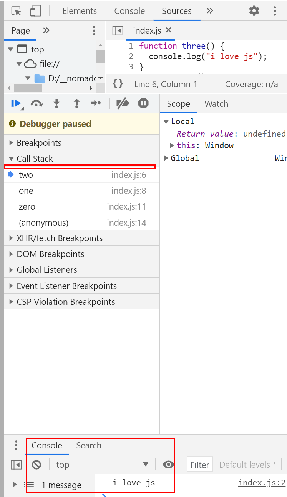

<br />
<br />

# 노마드코더 - 자바스크립트 개발자라면 알아야하는 핵심 컨셉 33개
- [노마드코더 유튜브 강의](https://youtu.be/QkFkFqg-J04)
<hr />

### 1. Call Stack
<details>
<summary>Call Stack 보기</summary>
<div markdown="1">

#### Call Stack
- 자바스크립트가 함수 실행을 핸들하는 방법<br />자바스크립트가 실행해야하는 함수를 보면 스택(stack) 위에 올린다.
  - 스택(stack) : 쌓아올리는 것.<br />책을 쌓아올리거나 카드 스택을 만들거나 등등<br />Call Stack도 그런 스택(쌓은 덩어리)과 비슷함.
- 자바스크립트는 함수를 그 스택 위에 올리고, 함수를 실행하면 제거.<br />(스택을 다 처리하면? 실행 시킬 것이 없다)
<br />

#### 예시 1) 자바스크립트 실행 함수
```javascript
function three() {
  console.log("i love js");
}
function two() {
  three();
}
function one() {
  two();
}
function zero() {
  one();
}

zero();
```
<br />
- 브라우저 - Sources 탭에서 Call Stack 에서 확인이 가능.
- 멈춰져 있는 상태에서 "->" 버튼을 클릭하게 되면 다음에 실행되는 함수의 위치로 이동된다.<br />(zero() 함수 실행 후 "->" 버튼을 클릭하면 function zero() { one(); } 으로 이동된다.)<br />
<br />

<br />
- 함수 리스트 중 제일 마지막 three에서 "->" 버튼을 클릭하게 되면 Call Stack에서 three가 사라진다.<br />**함수는 return 이라는 말이 나오거나 실행이 완료되면 끝난다. 그러면 Call Stack에서는 사라진다.**<br />
<br />

<br />
- Call Stack에서 사라진 것을 확인할 수 있다.
- Console에서 로그를 확인을 할 수 있다.<br />
<br />

<br />
- three 함수를 했던 것처럼 Call Stack에 있는 함수를 선택하고 "->" 버튼을 클릭하면 Call Stack에서 사라진 것을 확인할 수 있다.<br />(프로그램을 종료되었고, Call Stack에서 불러올 것은 없다)
<br />

#### 예시 2) 자바스크립트 실행 함수 :: 에러가 생겼을 때
```javascript
function three() {
  console.log("i love js");
}
function two() {
  three();
}
function one() {
  two();
}
function zero() {
  one();
  throw Error("omg im am an error");
}

zero();
```
- zero() 함수 실행을 시작으로 콘솔 로그까지 제대로 작동이 된다.
- 작동이 된 것을 확인한 후, Sources 탭에서 Call Stack - three 함수부터 차례대로 클릭하여 "->" 버튼을 클릭한다.<br />one() 함수 실행까지 위와 동일하게 진행된다.<br />
<br />

<br />
- 함수 리스트 순으로 이동이 되기 때문에 one(); 함수 실행 후, throw Error 문이 실행이 된다.<br />
<br />

<br />
- 오류가 실행이 되면서 콘솔 에러가 발생한다.
- 이것이 바로 Call Stack(콜 스택)이다.<br />(이런 순서로 차례로 함수가 진행이 되는 것)
- **에러메세지를 보면, 에러 전에 있던 모든 Call Stack을 알려준다.**
- 현재 코드의 경우, one(); -> throw Error(); -> zero() 순으로 실행이 되기 때문에 에러메세지에 at zero 문구를 확인할 수가 있다.
<br />

#### 정리(복습)
- 리스트가 존재한다. 함수는 리스트에 추가된다. 실행이 완료되면 함수는 리스트에서 제거된다.
- 자바스크립트의 to do list(할일목록)으로 이해하면 된다.
<br />

#### 추가설명
```javascript
function hello() {
  bye();
}
function bye() {
  hello();
}
hello();
```
- hello() 와 bye() 함수는 서로를 부르는데, 이렇게 하다보면 "맥시멈 콜 스택 사이즈를 초과했다"라는 메세지가 콘솔에서 보여진다.<br />
<br />
- 위와 같이 서로를 계속 부르는 함수를 만들면 위와 같은 에러가 발생한다.

</div>
</details>

### 2. Primitive Types
<details>
<summary>Primitive Types 보기</summary>
<div markdown="2">

#### Primitive type
- Primitive : 원시적인, 기초적인
- **Sring**
  - 반드시 " 또는 ' 으로 시작하고 끝내야 한다.
    ```
    "Hello"
    'hello'
    "Hello they call me \"the awesome man\""
    "Hello they call me 'the awesome man'"
    ```
- **Number** : 정수(123), 소숫점(12.34)
- **Boolean** : 참(true), 거짓(false)
  ```javascript
  true
  false
  "true" // "" 을 사용하게 되면 String으로 인식한다.
  ```
- **undefined 와 null**
  - **undefined : 정의가 되지 않음**
    - hello는 값이 정의되지 않았기 때문에 undefined 이다.
    ```javascript
    let hello;
    console.log(hello);  // undefined
    console.log(hello === undefined);  // true
    ```
  - **null : 존재하지 않음**
- **NaN** : Not A Number
- 타입을 알아내는 방법은? typeOf를 사용하면 된다
  ```javascript
  typeOf true // boolean
  ```

</div>
</details>

### 3. Value Types and Reference Types
<details>
<summary>Value Types and Reference Types 보기</summary>
<div markdown="3">

#### Value vs Reference
- **Value**
  - b = 50. 이것을 value 라고 한다.
  - a = 50 에서 **값 50**을 복사해서 b에 붙여넣는다.<br />(**a값 복사 == value 복사**)
  - a = 10 으로 바꿔도 b는 영향에서 벗어난다.
  - **value는 복사, 붙여넣기이다. Reference(참조)를 하지 않는 것.**
  ```javascript
  let a = 50;
  let b = a;
  
  a = 10;
  
  console.log(b);  // 50
  ```
<br />

- **Reference**
  - 예시 1)
    - pretty를 콘솔 로그로 출력하면 kimch, potato, hEllo가 출력된다.<br />이것을 reference 라고 한다.
    - sexy를 변경하자 pretty가 업데이트 되었다.
    - **이것은 값을 복사하는 것이 아니라 레퍼런싱 하는 것이다.**
    - sexy의 값이 해당 배열(kimchi, potato)이 아니라 sexy는 해당 배열을 '참조'하고 있는 것.<br />(배열은 둥둥 떠 있고, sexy는 해당 배열을 가리키고 있다.)
    - **즉, sexy와 pretty는 같은 동일한 배열을 참고하고 있는 것이다**<br />(그렇기 때문에 배열을 업데이트하면 preety, sexy 모두 업데이트된 배열을 출력하는 것이다.)
    - pretty에 "lalalala"을 배열에 추가하면 sexy도 pretty와 마찬가지로 배열이 업데이트된다.
    ```javascript
    const sexy = ["kimchi", "potato"];
    const pretty = sexy;

    sexy.push("hEllo");
    //console.log(pretty);  // ["kimchi", "potato", "hEllo"]
    
    pretty.push("lalalala");
    console.log(sexy);     // ["kimchi", "potato", "hEllo", "lalalala"]
    ```
    - 따라서, <code>console.log([10] === [10])</code> 이라고 했을 때<br />false(거짓)이 출력된다. 이 둘은 각각 메모리에 위치한 각기 다른 오브젝트이기 때문이다.
  - 예시 2)
    - x를 b를 통해서 업데이트 했다.<br />a의 값은 hello -> lalaal로 변경되었다.
    ```javascript
    const x = {
      a: "hello"
    }
    const b = x;
    b.a = "lalaal";
    console.log(x); // {a : lalaal}
    ```
  - 예시 1과 2처럼 reference는 value와 큰 차이점을 가지고 있다.
<br />

#### 정리
**Value는 string, number, boolean, NaN, undefined, null 가능하고,<br />Reference는 array, object, function에서 사용될 수 있다.**

</div>
</details>

### 4. Type Coercion
<details>
<summary>Type Coercion 보기</summary>
<div markdown="4">

#### Type Coercion
- Type Coercion을 Type Conversion 이라고 이해하자.
- **Conversion? 자바스크립트가 강제적으로! 값을 변환시킨다는 뜻.**
  - 예시 1) true = 1 / false = 0
    - true는 1로 변환이 되어 66 + 1 = 67 이라는 결과값을 출력한다.
    - 연산을 할 때 "1" 로 되어 있으면 1로 인식을 한다.
    - "" 빈 문자열은 false 이다.<br />(텅 빈 문자열은 제로바이트. 0을 가리킨다. 0은 거짓. 즉, false)
    ```javascript
    console.log(66 + true);   // 67
    console.log(66 + false);  // 66
    console.log(44 * true);   // 44
    console.log(44 * false);  // 0
    console.log(25 - "1");    // 24
    console.log("" == true);  // false
    ```
  - **==을 사용하면 type coercion 이 일어나지만 ===을 사용하면 일어나지 않는다.**
    - ==이 boolean을 만나면 숫자로 변환이 된다.<br />true는 1로 변환이 된다.<br />"true"는 숫자로 변환이 되지 않는다.<br />따라서 NaN == 1. 즉 값은 false가 된다.
    ```javascript
    console.log("1" == 1);         // true
    console.log("1" === 1);        // false
    console.log("true" == true);   // false
    ```
  - ==, boolean을 만나면 숫자로 변환되고 여러 경우의 수가 발생하기 때문에 == 보다는 === 을 사용을 권장한다.<br />===을 사용하면 type coercion(이상한 규칙ㅋㅋ)을 피해갈 수 있다!

#### type coercion 버그를 피할 수 있는 예제
```javascript
const hello = "";
if(typeof hello !== undefined) {
  console.log("hello");
}
```

</div>
</details>

### 5. typeof
<details>
<summary>== vs === vs typeof 보기</summary>
<div markdown="5">

#### typeof
- 자바스크립트는 항상 type을 체크해야 한다.<br />(Boolean, string, number 등등)
- `typeof`을 이용하여 type을 체크하면 된다.<br />(거의 모든 primitive에서 작동이 가능하다. Number, boolean, string, undefined)<br />`typeof true` 또는 `typeof (true)` 쓴다.
  ```javascript
  console.log(typeof "11212");        // string
  console.log(typeof true);           // boolean
  console.log(typeof function() {});  // function
  console.log(typeof (undefined));    // undefined
  console.log(typeof undefined);      // undefined
  ```
- **버그 예시(WTF버그)**
  ```javascript
  console.log(typeof null);    // object
  console.log(typeof []);      // object
  console.log(typeof {});      // object
  ```
  <br />

  - Array 인지 object인지 체크하고 싶을 땐, **typeof가 아닌 instance of를 사용한다**<br />(primitive에선 작동하지 않음)
  ```javascript
  console.log({} instanceof Object);      // true
  console.log("abc" instanceof String);   // false
  console.log(true instanceof Boolean);   // false
  ```
  <br />
  <br />

#### typeof, instanceof 정리
- **typeof**<br />number, boolean, undefined, function, string 을 체크하고 싶을 때
  ```javascript
  console.log(typeof 1)                // number
  console.log(typeof false)            // boolean
  console.log(typeof undefined)        // undefined
  console.log(typeof (function(){}))   // function
  console.log(typeof "string")         // string
  ```
- **instanceof**<br />array(배열), object 를 체크하고 싶을 때
  ```javascript 
  const he = [];
  console.log( he instanceof Array);    // true

  const she = {};
  console.log( she instanceof Object);  // true
  ```
- `typeof null`은 object 이다.
  ```javascript
  console.log(typeof null);             // object
  console.log(null instanceof Object);  // false
  ```

</div>
</details>

### 6. scope
<details>
<summary>Primitive Types 보기</summary>
<div markdown="6">

- **스코프(Scope)란?**<br />ES6(ES2015)이전에는 변수를 선언할 수 있는 키워드가 var 였고, ES6에서 let, const 키워드가 추가되었다.
- scope는 한마디로 말하면 "너의 variable(변수)이 존재하는 가? 아닌 가?"<br />(variable[변수]이 정의가 되었나? 아닌 가?)
- scope == 변수 유효범위

<br />

#### 6.1. 예시 1
```javascript
if (true) {
  const hello = "hi";
}
console.log(hello);
```
- 여기서 hello는 정의되지 않았다.
- hello는 여기 {} 안에서만 존재한다.
<br />

```javascript
if (true) {
  const hello = "hi";
  console.log(hello);
}
```
- 위 코드에선 hello가 존재한다.
- **이것이 scope 이다. 접근할 수 있느냐? 없느냐?**

<br />
<br />

#### 6.2. 예시 2
```javascript
const h = "hello";   // h는 Global scope

function a() {
  console.log(h);
}

a();
```
- Global scope = 무엇이든 접근할 수 있다.
- 함수 a 안에는 h가 정의되어 있다. 

<br />

```javascript
const h = "hello";   // h는 Global scope

function a() {
  console.log(h);
  const b = 'b';
}
a();
console.log(b);
```
- 하지만 b는 접근할 수 없다. 즉, b는 정의되지 않았다.
- **Variable은 큰 곳에서 작은 곳으로 접근이 가능하다.**
- 예를 들면, Global scope는 `const h = "hello"`가 있다.<br />그 다음 함수 a가 있다. 함수는 버블과 같다. 이 버블은 부모 버블에 접근할 수 있다.<br />하지만 부모 버블은 자식 버블에게 접근할 수가 없다.<br /><br />즉, A에서 Global scope로 접근할 수 있지만 global scope에서 함수 a로 접근할 수는 없다.

<br />
<br />

#### 6.3. 예시 3
```javascript
if ( true ) {
  var hello = "h";
}
console.log(hello);
```
- var로 선언할 경우, hello에 접근이 가능하며 h를 출력해준다.<br />**이것이 var를 쓰면 안 되는 이유 중 하나이다.**

<br />
<br />

#### 6.4. 예시 4
```javascript
function a() {
  const b = "b";
  function c() {
    const d="d";
    function e() {
      const nn = "nn"
    }
  }
}
```
- 함수 e는 d 그리고 b에 접근할 수 있다.
- d는 b에 접근할 수 있지만, d는 nn에 접근할 수 없다.

<br />

```javascript
let hello;
if(ture) {
  hello ="hello";
}
console.log(hello);
```
- 버블 안에 들어가고, 나가고, 콘솔로그 헬로우. 정상 작동한다.
- 이것이 scope 이다.

<br />
<br />

#### 6.5. let, const 는 block scope
- let, const 는 블록({} 단위) 레벨 스코프
- var 는 함수 레벨 스코프
- **var 는 이미 선언되어 있는 이름과 같은 이름으로 변수를 또 선언해도 에러가 나지 않지만, let과 const는 이미 존재하는 변수와 같은 이름의 변수를 또 선언하면 에러가 난다.**
- var, let은 변수 선언 시 초기 값을 주지 않아도 되지만 const는 반드시 초기값을 할당해야 한다.
- **var, let은 값을 다시 할당할 수 있지만 const는 한 번 할당한 값은 변경할 수 없다.<br />단, 객체 안에 프로퍼티가 변경되는 것까지는 막지 못 한다.**

</div>
</details>

### 7. Expression vs. Statement
<details>
<summary>Expression vs. Statement 보기</summary>
<div markdown="7">

#### 7.1. Expression
무엇이든 Value를 리턴하는 것은 expression.<br />(expression이란 값을 만들어내는 코드 단위)
<br />

```javascript
function add(a, b) {
  return a + b;
}
const how = add(5, 6);
```
- `add(5, 6)`이 expression이 된다. 그 이윤, value를 리턴하니깐!
- `return a + b`가 아닌 `a+ b`를 하게되면 undefined를 출력하게 되는데, 이것 또한 expreesion 이다. undefined 라는 value를 리턴하기 때문에.
- 복잡한 함수를 읽는다면, 기억해야될 건 **함수가 return 하는 것은 무엇인가?**

<br />
<br />

#### 7.2. Statement
명령 혹은 지시.<br />(statement은 무언가를 수행하는 코드 단위.)
<br />

```javascript
if(true) {

}
```
- 이건 아무것도 리턴하지 않는다. 이건 지시, 명령이다.
- 이걸 contants로 저장(ex. `const thing`)하면? statement를 variable로 저장할 순 없다.<br />(아래 코드 참고)
  ```javascript
  const thing = if (true) {

  }
  ```
<br />
<br />

#### 7.3. Variable로 저장할 수 있는 건 expression이다.<br />Statement는 저장할 수 없다.
- Expression은 자바스크립트에 의해 value를 리턴한다.
- Statement는 그냥 명령이다.<br />`if else, else if , for, while ...`이런 지시들은 다 Statement라고 보면 된다.

<br />
<br />

#### 7.4. Function declaration
```javascript
const awesome = add(1, 5);

// declaration
function add(a, b) {
  return a + b;
}

consle.log(awesome);
```
- declaration 와 expression은 차이가 있다.
- `const awesome = add(1, 5);` 함수를 사용하여 에러없이 결과값 6을 얻었다.<br />이게 바로 function dexclaration 그리고 function expression의 차이이다.
- `function add(a, b) { return a + b }` 은 declaration이다.<br />자바스크립트가 코드를 보면, **모든 declaration을 상단으로 가져온다. 이것을 hoisting 이라는 프로세스이다.**<br />`function add() -> const awesome -> log` 순으로 읽는다.

<br />
<br />

```javascript
function sayYeah() { 
  //#1: function declaration 
  console.log("Yeah"); 
}; 
sayYeah(); 

var sayHo = function () { 
  //#2: function expression 
  console.log("Ho"); 
}; 
sayHo();
```
- #1는 함수는 자바스크립트가 로드될 때 생성하게 되고, 현재 함수가 선언되는 해당 context에 함수와 같은 이름의 local 변수가 생성되고, 그 변수에 sayYeah() 함수가 들어가는 것이다. 그 반면, #2는 해당하는 행이 실제로 실행되기 전까지 함수가 생성되지 않는다.<br />[>> 블로그 참고사이트](https://unikys.tistory.com/305)


</div>
</details>

### 8. IIFE(웹팩 없는 자바스크립트 모듈)
<details>
<summary>IIFE 보기</summary>
<div markdown="8">

#### 8.1. IIFE(Immediately-Invoked Function Expressions) 이란?
- 즉시 실행 함수 표현(IIFE, Immediately Invoked Function Expression)은 정의되자마자 즉시 실행되는 Javascript Function 를 말한다.<br />[MDN - IIFE 자세히보기](https://developer.mozilla.org/ko/docs/Glossary/IIFE)
- `()()` 즉시 실행 함수를 사용하면 콘솔로그 창에 `const secretUsers` 변수를 확인할 수 없다.<br />`console.log(secretUsers)` 콘솔로그의 값인 `["Nicolas", "Lynn", "Stevey", "Autumn"]`만 확인할 수 있다.
```javascript
(function() {
  const secretUsers = ["Nicolas", "Lynn", "Stevey", "Autumn"];
  console.log(secretUsers);
})()
```

<br />

- `(function() { 여기에 모든 코드를 넣으면 아무도 바꿀 수 없다 })()`<br />`(() => { 여기에 모든 코드를 넣으면 아무도 바꿀 수 없다 })()`

<br />
<br />

#### 8.2. Modules
- Modules(모듈)를 이해하기 위해 js 파일 2개를 생성한다.<br />(`./8_modules/app.js`, `./8_modules/app2.js`)
  - 아래 코드 방식은 immutable(값을 돌릴 수 없는) 방식이며 기능들을 쪼개서 만들었다.
    ```javascript
    // app.js
    let users = ["Nico", "Lynn", "Dal"];

    const addUser = (user) => users = [...users, user];

    const getUsers = () => users;

    const deleteUser = (user) => users = users.filter(aUser => aUser !== user);
    ```
  - app2.js 파일에서 app.js를 import 하기 위해 app.js 에서 만든 변수들을 export 한다.
    ```javascript
    // app.js
    let users = ["Nico", "Lynn", "Dal"];

    export const addUser = (user) => users = [...users, user];

    export const getUsers = () => users;

    const deleteUser = (user) => users = users.filter(aUser => aUser !== user);
    ```
  - 정의한 users와 autumn이 콘솔 창에 보여져야 한다.
    ```javascript
    // app2.js
    import {addUser, getUsers} from  "./app2.js";

    console.log(getUsers());
    addUser("Autumn");
    console.log(getUsers());
    ```
  - 하지만, 브라우저에서는 import, Export를 이해하지 못 한다.<br />(이럴 때 웹팩, gulp 같은 것을 사용한다.)<br />
    <br />

  - index.html 파일에서 `<script src="app.js"></script>` 와 `<script src="app2.js"></script>`는 모듈이라고 브라우저에게 얘기한다.
    ```HTML
    <!-- index.html -->
    <!DOCTYPE html>
    <html lang="en">
    <head>
      <meta charset="UTF-8">
      <meta http-equiv="X-UA-Compatible" content="IE=edge">
      <meta name="viewport" content="width=device-width, initial-scale=1.0">
      <title>Document</title>
    </head>
    <body>
      
      <script src="app.js"></script>
      <script src="app2.js"></script>

    </body>
    </html>
    ```
  - `<script src="app.js"></script>` 코드를 `<script type="module" src="app.js"></script>`로 적용한다.<br />이렇게 하면 브라우저는 모듈처럼 사용하게 된다.<br />
    <br />
    <br />

  - **웹팩, gulp 등 모듈 번들러 없이 순수 바닐라 자바스크립트 만으로도 모듈 사용이 가능하다.**

  - [모듈 자세히 알아보기](https://ko.javascript.info/modules-intro)

</div>
</details>

### 9. Message Queue and Event Loop
<details>
<summary>Message Queue and Event Loop 보기</summary>
<div markdown="9">

#### 9.1. blocking? none blocking?
- 파이썬은 blocking 언어이고, 자바스크립트는 none blocking 언어이다.
- 자바스크립트가 blocking 언어였다면, 웹사이트에서 input에 유저가 타이핑을 칠 수가 없다. 왜냐면 자바스크립트는 API fetch를 핸들링하느라 바쁠 것이기 때문이다.
- 자바스크립트는 none blocking 이지만, alert 같은 경우 blocking function 이다. `alert("hello")`로 하면 알럿창이 뜨고 아무것도 할 수가 없다.
  - 야래와 같이 코드를 작성하면, alert 창이 뜨지만 콘솔로그는 실행되지 않는다. alert이 blocking function 이기 때문이다.
  - 이런 식으로 자바스크립트가 blocking 이었다면 fetch, request.. 등 모든 게 block(ckeks) 되었을 것이다.
  ```javascript
  alert("hello");
  console.log("hi");
  ```
- 자바스크립트는 Events, callbacks를 사용한다.<br />예를 들면 버튼을 만들고 Add Event listener click을 할 수 있다. 자바스크립트는 그 클이 실행되기를 기다려준다.

<br />
<br />

#### 9.2. parallel
```javascript
setTimeout(()=> console.log("hi"), 5000);
console.log("bye");

// 콘솔로그
bye;
//5초 후에 출력
hi;
```
- Stack == 콜스택, 스택이 쌓이는 것으로 생각한다. [Call Stack 자세히보기](https://github.com/eunhye8767/__nomadcoders/tree/master/03_js_concepts33#1-call-stack)<br />`console.log("bye")` 가 실행되고 `setTimeout(()=> console.log("hi"), 5000);`이 실행된다.<br />
  <br />
  <br />

- Web api는 자바스크립트가 디폴트로 갖고 있지 않은 많은 함수가 있다.<br />예를 들어 로컬스토리지는 브라우저에 저장을 하기 위한 것이다. 로컬스토리지는 브라우저에 의해 정의되는 Functionality 이다.
- setTimeout는 브라우저에 의해 실행된다.<br />
  <br />
  <br />

- 자바스크립트는 5000ms 후에 queue에 넣는다.<br />여기서 queue는 message queue를 뜻한다. **즉, Web api에서 온 메시지를 뜻한다.**
- 규칙은 스택에 아무것도 없을 경우에만 자바스크립트는 메시지 queue에 있는 걸 가져간다.<br />
  <br />
  <br />

- 다시 정리하자면<br />1. `setTimeout(()=> console.log("hi"), 5000);` 과 `console.log("bye")` 를 Stack(스택)에 넣는다.<br />2. 자바스크립트는  이걸(스택)보고 타임아웃 부분을 Web api로 가져간다. (요건 브라우저다. 브라우저가 관리한다.)<br />3. 그리고 나서 bye 부분을 실행한다. 그렇게 Stack(스택)이 끝난다.<br />4. bye 하고 나서 Web api에서 (브라우저) 타임아웃의 두번째 인자를 살펴본다. 그것은 뜻은 이 함수를 실행하기 까지 얼마나 기다려야 하는 가? 이다. (`ex. 5000`)<br />참고로 이건 얼마나 기다려야 하는 가가 아니라 "`실행하기 까지 [최소] 기다려야 하는 시간`"이다.<br />5. Web api는 5000ms를 기다리고 그 함수는 메시지 queue로 간다.<br />6. 만약 `스택에 아무것도 없다면(규칙임)` 자바스크립트는 queue를 보고 (hi로군) 스택으로 가는 것이다.<br />7. 그렇기 때문에 bye가 먼저 나오고, 그 다음에 hi가 나오는 것이다.

<br />

- **Fetch는 어떻게 될 까?**<br />스택에서 web api로 갈 것이고, 그건 뭐든 웹사이트를 부르고.. 돌아왔을 때 그 함수는 queue로 간다. 그리고 자바스크립트가 준비가 되었을 때 queue에서 불러다가 함수를 다시 실행한다.


</div>
</details>

### 10. set Timeout, set Interval, Request Animaition frame
<details>
<summary> set Timeout 보기</summary>
<div markdown="10">

#### Set Timeout
- 자바스크립트 개념에서 온 것이 아니라 브라우저 그리고 node JS 개념에서 왔다.
- 시간이 지난 후에 기능을 메시지큐(message queue)에 붙여준다.<br />[참고](https://github.com/eunhye8767/__nomadcoders/tree/master/03_js_concepts33#9-message-queue-and-event-loop)
<br />

- 함수를 자동으로 부르는 것이 아니라 함수를 메세지 큐에 넣고, 스택이 비게되면 자바스크립트가 실행
- 바로 이뤄질 수도 있고 자바스크립트가 바쁘면 천천히 할 수도 있음. 그래서 time specific 하다고 볼 수 없다.
- 첫번째 인자(ex. aa)는 함수, 두번째 인자(ex. bb)는 최소 대기시간 1초를 적용하고자 할 땐 1000 (밀리세컨드 단위로 적용)
  ```javascript
  // setTimeout(aa, bb)

  setTimeout(()=> console.log("hi"), 1000);
  ```
- **알아둬야 할 것!**<br />함수를 직접 부르는 것이 아니다. 함수를 set timeout에게 주고 그 다음 set timeout이 함수를 부른다.<br />`setTimeout(console.log, 1000, "hi");`

<br />

#### set timeout을 취소하고 싶을 때
- set timeout을 variable 안에 넣으면 된다.
  - 실행해보면 ID의 콘솔로그가 출력이 되고 타임아웃의 ID인 것이다. (현 상황에선 1을 의미)<br />타임아웃이 생성될 때 마다 ID가 리턴된다. 이걸 저장하고 함수 clear timeout을 실행시킨다.<br />그리고 얻은 id로 timeout을 정리하는 것이다.
```javascript
const helloT = setTimeout(console.log, 1000, "hello");

console.log(helloT); // 1 -> hello 출력
clearTimeout(helloT);
```
- 존재하지 않는 timeout을 적용한다고해서 자바스크립트가 '이건 존재하지 않아' 라고 알려주진 않는다.<br />`clearTimeout(89898989);`<br />타임아웃을 클리어했지만, 에러가 생기지도 않는다.

<br />

#### set Timeout에 적용한 시간은 최소대기시간이다. 이 함수를 큐에 올리기까지 준비가 되면 자바스크립트가 부르는 것이다.
- 확실한 시간이 아니다. 지연이 될 수 있다.(지연 시간이 크진 않음.)

<br />

#### set interval
- 매시간마다 함수를 실행시킨다.
- set timeout과 동일하게 인자, 함수를 갖고 있다.<br />첫번째 인자는 함수, 두번째 인자는 최소 대기시간(초는 밀리세컨트 단위)
- 5초마다 hello 메세지를 콘솔로그에서 확인할 수 있다.<br />`const helloT = setInterval(console.log, 5000, "hello");`
- 만약, 인터벌이 1초보다 작다면?<br />크롬의 경우 1초로 맞춰버린다.<br />예를 들어 인터벌이 0.5초 였다면 유저가 크롬 탭을 바꾸거나 나가면 크롬은 그걸 1초로 바꿔버린다.(브라우저 강제 조정 == 설정한 값을 무시)

<br />

#### set interval을 취소하고 싶을 때
- set timeout은 몇 초 기다린 후 함수를 실행하는 것이고 set interval은 매 정해진 초마다 함수를 실행하는 것이다.
- **함수를 실행하지 말고 함수의 이름을 넣도록! 그러면 set timeout, interval이 대신 실행해준다**
- timeout, interval를 취소하고 싶다면, clear를 사용하면 된다.<br />(variable로 저장하고 clear 사용)
```javascript
const helloT = setInterval(console.log, 5000, "hello");

console.log(helloT); // 1 -> hello 출력
clearInterval(helloT);
```

<br />

#### requestAnimationFrame
- 애니메이션을 적용할 때 time specific이 아니여서 interval에만 의지할 수 없다. 또한, cpu와 그래픽카드가 느리면 interval 역시 느려질 수 있다.<br />그럴 땐 request animation framme을 사용한다.
- requestAnimationFrame은 브라우저가 업데이트 할 때마다 animation frame을 요청한다. 그리고 애니메이션을 수정할 수 있다.
- requestAnimationFrame은 CPU와 그래픽카드에 최적화 되어 있다.<br />예를 들어 내가 다른 탭으로 이동하면 크롬은 그걸 실행시키지 않는다. 해당 스크린을 페인트하는 것이 아니기 때문이다.
```javascript
const sayHi = () => {
  console.log("Hi");
  requestAnimationFrame(sayHi);
}
requestAnimationFrame(sayHi); // sayHi 함수를 아주 빠르게 실행한다
```
- [MDN 참고](https://developer.mozilla.org/ko/docs/Web/API/Window/requestAnimationFrame)

#### 무언가를 최대한 빠르게 실행하고 싶다면 Request animation frame를 해보자!

<!--  -->

</div>
</details>

<!-- ### 0. scope
<details>
<summary> 보기</summary>
<div markdown="0">


</div>
</details> -->