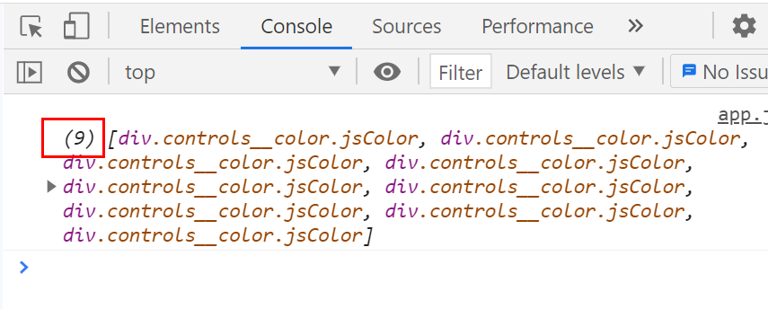
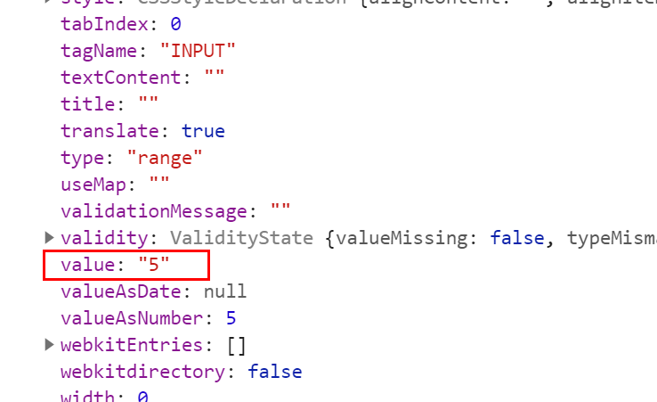

<details markdown="1">
<summary>1. 바닐라 JS로 크롭 앱 만들기</summary>

# 바닐라 JS로 크롭 앱 만들기
https://nomadcoders.co/javascript-for-beginners
<br />
<br />
<br />

## 1. THEORY
### 1.1. Variable (변수)
- Create (생성), Initialize (초기화), Use (사용)
  ```javascript
  let a = 221;
  let b = a - 5;
  console.log(b);  // 216
  ```
- 이미 생성된 변수를 사용할 땐 let을 쓰지 않아도 된다.
- 변수는 가변적, 값이 변할 수 있다.
  ```javascript
  let a = 221;
  let b = a - 5;
  a = 4;
  console.log(b, a);  // b - 216, a - 4
  ```
<br />
<br />

### 1.2. let, const, var
- **const (constant, 상수)**
  - 변하지 않는 변수.
    ```javascript
    let a = 221;
    let b = a - 5;
    a = 4;  // 문법 오류
    console.log(b, a);
    ```
  - const로 선언한 변수는 상수로 값이 변하지 않는다.<br />따라서 위 코드로 쓸 경우 오류가 발생한다.
  - **상수에는 대입을 할 수 없다.**
  - **constant(상수) 재선언 금지, 재할당 금지**
  <br />

- **let**
  - 변수, 값이 바뀌는 걸 허용.
  - 선언 후, 대입하여 값을 바꿀 수 있다.
  - **재선언 금지, 재할당 가능**
    ```javascript
    let a = b
    let a = c // 문법오류(재선언)
    ```
    ```javascript
    let a = b
    a = c     // 재할당 가능
    ```
  <br />

- **var**
  - var = varible
  - let을 쓴 것처럼 var 도 값을 바꿀 수 있다.
    ```javascript
    var a = 221;
    var b = a - 5;
    a = 4;
    console.log(b, a);  // b - 216, a - 4
    ```
  - **variables(변수) 재선언 가능, 재할당 가능**
    ```javascript
    var a = b
    var a = c // 재선언, 재할당 가능
    ```
  - **var 대신 let, const 를 사용한다.**
<br />
<br />

### 1.3. Data Types on JS
- **변수를 선언할 때는 기본적으로 const를 쓰도록!**
  - 첫 사용은 const로, 진짜 필요할때만 let!
  <br />

- **String**
  - String은 보통 텍스트 스트링을 일컫는다.
  - ""을 사용하여 문자를 적용한다
    ```javascript
    // String (보통 문자열을 뜻 함)
    const what = "Nicolas"
    console.log(what);    // Nicolas
    ```
  - **단, "123456" 라고 입력하면 숫자가 아닌 텍스트이다.**
    ```javascript
    const what = "123456"
    console.log(what);    // 문자형식의 123456
    ```
  <br />

- **Boolean**
  - True or False 이다.
  - false = 0, true = 1
  ```javascript
  const wat = true;
  ```
  <br />

- **Number**
  ```javascript
  const wat = 0713;
  ```
  <br />

- **Float**
  - float는 숫자인데, floating number(소숫점)을 가지고 있다.
  ```javascript
  const wat = 55.1  // 소숫점 .1
  ```
  <br/>
  <br/>

### 1.4. Organizing Data with Arrays
- **Array** : 데이터를 저장하는 곳 (= 리스트 같이 저장).
- Array는 여러 string들을 하나로 묶는 것을 뜻한다.
- Array(배열)은 [] 사이에 적용한다.
- **Array(배열) [] 엔 텍스트, true/false, numbers, floats 데이터 타입만 적용할 수 있다.**
- 요일을 저장한다고 가정했을 때,
  - daysOfWeek처럼 **변수명을 정할 때 카멜케이스(Camel case) 방식으로 짓는다.**
  - 카멜케이스 = camel(낙타)처럼 구불구불한 형식으로<br />두번째 단어부터 첫글자 대문자로.
  ```javascript
  // 기본 문법 const daysOfWeek = []
  const daysOfWeek = ["Mon","Tue","Wed","Thu","Fri","Sat","Sun"];
  console.log(daysOfWeek);    // ['Mon','Tue','Wed','Thu','Fri','Sat','Sun']
  ```
- **Array는 규칙을 갖고 있다**
  - 에를 들어, Array 3번째 요일이 알고 싶다면<br />[인덱스번호]를 써준다. 인덱스번호는 0부터 시작
    ```javascript
    const daysOfWeek = ["Mon","Tue","Wed","Thu","Fri","Sat","Sun"];
    console.log(daysOfWeek[2]);    // Wed
    ```
  - 변수명을 Array에 적용할 수도 있다
    ```javascript
    const something = "Something";
    const daysOfWeek = ["Mon","Tue","Wed","Thu","Fri","Sat","Sun", 54, true, "stuff", "lalala", something];
    console.log(daysOfWeek)   // ['Mon','Tue','Wed','Thu','Fri','Sat','Sun', 54, true, 'stuff', 'lalala', 'something']
    ```
<br />
<br />

### 1.5. Organizing Data with Objects
- Object에는 각 value에 이름을 줄 수 있다.
- Object를 선언하기 위해 **{컬리 브라켓}**을 쓴다.
- Object 생성하는 방법
  ```javascript
  const nicoInfo = {};
  ```
  - **Object == 객체 생성**
    ```javascript
    const nicoInfo = {
      name: "Nico",
      age: 33,
      gender: "Male",
      isHandosme: true,
    }
    console.log(nicoInfo);
    // {name: "Nico", age: 33, gender: "Male", isHandosme: true}
    ```
  - **gender 값만 추출하고 싶을 때**
    - 변수.데이터이름 으로 값을 추출할 수 있다.
    - 데이터이름(key) : 값(value)
    ```javascript
    const nicoInfo = {
      name: "Nico",
      age: 33,
      gender: "Male",
      isHandosme: true,
    }
    console.log(nicoInfo.gender);  // Male
    ```
  - **데이터의 값을 바꿀 수도 있다.**
    - 자바스크립트는 위에서 아래로 실행된다.<br />(gender 값이 바뀌는 것을 확인할 수 있다.)
    ```javascript
    const nicoInfo = {
      name: "Nico",
      age: 33,
      gender: "Male",
      isHandosme: true,
    }
    console.log(nicoInfo.gender);  // Male
    nicoInfo.gender = "Female";
    console.log(nicoInfo.gender);  // Female
    ```
  - **const 로 변수를 선언했지만, 데이터의 값은 바꿀 수 있다.**
    - **nicoInfo = true 처럼 데이터를 대입하여 바꿀 수 없다!!!**
    ```javascript
    const nicoInfo = {
      name: "Nico",
      age: 33,
    }
    nicoInfo = true
    ```
- **데이터를 정렬하는 방법은 2가지 방법이 있다.**
  - **Array**
    - DB에서 가져온 리스트 데이터라면 Array.
  - **Object**
    - Object 를 Array 안에 넣을 수 있다 (데이터의 정보를 합쳐야 할 때).
      ```javascript
      const nicoInfo = {
        name: "Nico",
        age: 33,
        gender: "Male",
        isHandosme: true,
        favMovies: ["Along the gods", "LOTR", "Oldbody"],
        favFood: [
          {
            name: "Kimchi",
            fatty: false
          },
          {
            name: "Cheese burger", 
            fatty:true
          }],
      }
      ```
- 콘솔로그로 오류를 수시로 확인하는 습관.
<br />
<br />
<br />

## 2. PRACTICE
### 2.0. Your first JS Function
- **Function(함수)**
  - 어떤 것의 기능, 기능적인 것.
  - 어떤 걸 수행하려는 한 부분으로 원하는 만큼 쓸 수 있다.
  - 한 조각의 코드
- **자바스크립트에서 함수 만드는 방법(기본)**
  - 기본 문법
    ```javascript
    function 함수이름() {
      // 실행
    }
    ```
  - 예제 문법
    ```javascript
    function sayHello() {
      console.log('hello!');
    }

    sayHello();   // hello!
    ```
  - **인자(argument), 파라미터(parameter, 매개변수)**
    - 인자(argument) == 변수와 비슷하다.
    - 함수 실행 시, 두 개의 ''(따옴표) 또는 ""(쌍따옴표) 사이에 인자를 넣고<br />함수는 인자 ==> 파라미터(매개변수)로 받아 사용한다.
    - **함수 실행 시, 받은 인자를 파라미터(매개변수)에 담아 함수를 실행**한다.
    - 파라미터(parameter, 매개변수)는 함수에서 사용되는 변수명.
    - 기본 문법
      ```javascript
      function 함수이름(파라미터) {

      }

      함수이름('인자');
      ````
    - 예제 문법 (1)
      - 외부에 있는 데이터를 읽는 함수를 만드는 방법
      ```javascript
      function sayHello(name) {
        console.log('Hello!', name);  // Hello! Nicolas
      }

      sayHello('Nicolas');
      ````
    - 예제 문법 (2)
      - 인자와 파라미터의 이름을 일치시키지 않아도 된다!
      ```javascript
      function sayHello(name, age) {
        console.log('Hello!', name, "you have", age);  // Hello! Nicolas
      }

      sayHello('Nicolas', 15);
      ````
<br />
<br />

### 2.1. More Function Fun
- ``(벡틱)을 이용하여 스트링을 출력한다.<br />변수는 ${변수명} 으로 표기한다
  ```javascript
  function sayHello(name, age) {
    console.log(`Hello ${name} you are ${age} years old`);
  }
  sayHello("Nicolas", 15);  // Hello Nicolas you are 15 years old
  ```
- **return**
  - greetNicolas는 sayHello 함수의 리턴 값이다.
  - greetNicolas는 sayHello의 실행된 결과 값이다.
    ```javascript
    function sayHello(name, age) {
      console.log(`Hello ${name} you are ${age} years old`);
    }
    const greetNicolas = sayHello("Nicolas", 15);

    console.log(greetNicolas);  // undefined
    ```
  - 만약 greetNicolas가 정의안된상태(undefined)가 되지 않길 원한다면 뭔가를 반환하도록 해야한다
    - sayHello 함수는 어떤 값을 반환하지만 return 하지 않으면 console.log로 찍어주진 않는다.
    - greetNicolas는 sayHello 함수의 return 값과 같다.<br />함수에 return 값을 써주지 않으면 greetNicolas 변수를 출력하려 해도 값이 나올 수 없다.<br />**return의 기능이 함수 내부의 값을 외부로 꺼낼 수 있는 기능을 하기 때문이다.<br />외부에서 사용하고 싶으면 꼭!! 함수 내부에 return 값을 적용**해야 한다.
    ```javascript
    function sayHello(name, age) {
      return console.log(`Hello ${name} you are ${age} years old`);
    }
    const greetNicolas = sayHello("Nicolas", 15);

    console.log(greetNicolas);
    ```
  - return을 통해 (순간)저장하지 않으면,<br />console.log에는 저장된 값이 없으므로, undefined(정의안됨, 저장안됨) 값이 반환된다.


- **console.log() 기능과 비슷한 object 함수 만들기**
  - 수학 공식 등을 이용해 다양한 함수를 만들 수 있다.
  ```javascript
  const calculator = {
    plus: function(a, b) {
      return a+b;
    }
  }

  const plus = calculator.plus(5,5);
  console.log(plus);
  ```
  <br />
  <br />

### 2.2. JS DOM Functions
- <code>console.log(document)</code> document를 대표하는 HTML을 출력한다.
- 특정 아이디에 접근 = <code>document.getElementById("title");</code>
  ```html
  <h1 id="title">This works!</h1>
  <script src="index.js"></script>
  ```
  ```javascript
  const title = document.getElementById("title");
  
  console.log(title); // <h1 id="title">This works!</h1>
  ```
- DOM : Document Object Module
  - 자바스크립트는 html에 있는 모든 요소를 가지고 올 수 있다.
  - Document == html == 객체<br />(DOM이란, 자바스크립트를 이용해 document, 즉 html을 자유자재로 변경할 수 있다.)
  - 내장함수 innerHTML을 이용해 DOM 구조의 텍스트도 변경할 수 있다.
    ```html
    <h1 id="title">This works!</h1>
    <script src="index.js"></script>
    ```
    ```javascript
    const title = document.getElementById("title");

    title.innerHTML = "Hi! From JS";

    console.log(title);  // Hi! From JS
    ```
  - 모든 함수, 모든 객체들의 함수들은 DOM(Document Object Model) 형태로 변경이 가능하다.
<br />
<br />

### 2.3. Modifying the DOM with JS
```html
<h1 id="title">This works!</h1>
<script src="index.js"></script>
```
```javascript
const title = document.getElementById("title");

title.innerHTML = "Hi! From JS";

console.dir(title); // h1#title (선택한 아이디로 할 수 있는 기능들을 볼 수 있다)
```
- 내장함수 console 에서 log가 아닌 dir을 이용하여<br />선택한 객체로 할 수 있는 것들을 확인할 수 있다.
  - dir 로 출력해보면 className, dataset, nodeName, ondblclick, style, parentElement 등을 확인할 수 있다<br />(정보, 스타일, 클릭/마우스 이벤트 등 할 수 있는 것들을 확인하여 자유자재로 조종(변경)이 가능하다)
  - HTML을 수정할 수 있는 알 수 있는 지?
  - 어떻게 숨기고 보여줄 수 있는 지?
  - 어떻게 Click을 감지할 수 있는 지?
<br />

- querySelector는 노드의 첫번째 자식을 반환한다<br />(document 에서 제일 첫번째 자식을 찾는다는 얘기)
  - get ID와 Class 로 찾게될 경우, 해당 아이디명과 클래스명으로만 찾을 수 있는 반면<br />querySelector 경우, div> span : first-child 처럼 적용하여 선택할 수 있다.
  ```javascript
  document.querySelector("#title);
  ```
<br />
<br />

### 2.4. Events and event handlers
- 자바스크립트는 이벤트에 반응하기 위해서 만들어 졌다.
- 이벤트란? 웹사이트에서 발생하는 것<br />(click, resize, submit, input, change, load, before, closing, printing 등)
- 자바스크립트는 HTML과 CSS를 바꾸지 않고 웹사이트 이벤트(클릭, 입력, 로드 등) 반응을 위해 만들어졌다
- <code>window.addEventListener("resize", 함수이름)</code>
  - 이벤트를 받기 기다린다 (listen to event)
  - handleResize 함수를 만들고 이벤트에 연결을 해준다.<br />연결할땐 handleResize()가 아닌 handleResize로 쓴다.
  - 함수이름 == 함수호출을 뜻한다.
  - 브라우저 창의 사이즈를 조절하면 이벤트가 실행되어 콘솔로그 메세지를 출력한다.
    ```javascript
    function handleResize() {
      console.log("I have been resized");
    }
    window.addEventListener("resize", handleResize);
    ```
  - 이벤트 함수에 매개변수 event 를 적용하면 이벤트가 발생할 때마다 이벤트 객체가 호출이 된다
    - 자동적으로 이벤트 객체가 생성이 된다.
    - 매개변수 자리에 event 또는 e를 적용하고<br />console.log(event) 또는 console.log(e)로 확인이 가능하다.+
    - 이벤트 객체를 콘솔로그로 보면 다양한 정보들을 확인할 수 있다.
    ```javascript
    function handleResize(e) {
      console.log(e)
    }
    ```
    <br />
  - 이벤트 함수명을 적어줄 때 ()을 적용하게되면, 지금 바로 호출을 의미하게 된다.<br />따라서, 함수명을 적을 땐 필요한 시점인 "resize"일 때 발생해야하니 () 없이 적용한다.

- title에 클릭 이벤트를 적용한다
  - title을 클릭하면 폰트 색상이 파랑색으로 바뀐다
  ```html
  <h1 id="title">This works!</h1>
  <script src="index.js"></script>
  ```
  ```javascript
  const title = document.querySelector("#title");

  function handleClick() {
    title.style.color = "red";
  }

  title.addEventListener("click", handleClick);
  ```
  <br />
  <br />

### 2.5. If, else, and, or
- if-else : 기본적으로 프로그래밍에서 어떻게 모든 게 잘 동작하는 지 보여준다.
- if문 기본 구조
  - **condition == 조건**
  - **참(true)을 의미하면 뭐든 condition에 넣을 수 있다.**
  - 조건이 참일 경우 실행 A로, 거짓일 경우 다음블럭인 else 실행 B.
  ```javascript
  if ( condition ) {
    // 실행 A
  } else {
    // 실행 B
  }
  ```
- if문 예시(1)
  - 10 은 5 보다 크기 떄문에 콘솔로그에 'hi'가 출력된다.
  ```javascript
  if (10 > 5) {
    console.log('hi');
  } else {
    console.log('ho');
  }
  ```
  - 10 은 5 보다 크기 떄문에 콘솔로그에 'ho'가 출력된다.
  ```javascript
  if (10 === 5) {
    console.log('hi');
  } else {
    console.log('ho');
  }
  ```
- if문 예시(2)
  - nicolas 과 necolas 은 전혀 다르기 때문에 콘솔로그 'ho'가 출력된다.
  ```javascript
  if ("nicolas" === "necolas") {
    console.log('hi');
  } else {
    console.log('ho');
  }
  ```
  - '10'은 문자열, 10은 숫자로 타입이 다르기 때문에 콘솔로그 'ho'가 출력된다.
  ```javascript
  if ('10' === 10) {
    console.log('hi');
  } else {
    console.log('ho');
  }
  ```
- **if문에서 조건을 여러개 적용할 수 있다**
  ```javascript
  if ( conditionA ) {
    // 실행 A
  } else if ( conditionB ) {
    // 실행 B
  } else {
    // 실행 C
  }
  ```
  - 예시 (1)
    - "10"과 "10"은 같은 문자열로 콘솔로그는 lalala 로 출력된다.
    ```javascript
    if ("10" === 10) {
      console.log("hi");
    } else if ("10" === "10") {
      console.log("lalala");
    } else {
      console.log("ho");
    }
    ```
<br />

- **피연산자 &&(and) 와 ||(or)을 이용한 if문을 작성할 수 있다**
  - **&&(and)**
    - 조건이 **모두 "참"** 이어야만 한다.<br />조건 중 1개라도 거짓이면 거짓.
    - 예시 (1)
      - 20이 5보다 크고, nicolas 문자열이 같기 때문에 콘솔로그 yes 가 출력된다.
      ```javascript
      if (20 > 5 && "nicolas" === "nicolas") {
        console.log("yes");
      } else {
        console.log("no");
      }
      ```
    - 정리
      ```
      true && true = true
      false && true = false
      true && false = false
      false && false = false
      ```
  - **||(or)**
    - 조건 중 1개라도 참이면 참이 된다.
    - 정리
      ```
      true || true = true
      false || true = true
      true || false = true
      false || false = false
      ```
<br />
<br />

### 2.6. DOM - If else - Function practice
- 클릭하면 컬러값을 확인 후, 다른 컬러로 대체할 예정.
  - 컬러 값을 체크하는 변수를 생성한다.
  - 변수로 생성한 컬러값과 같은 지 체크한 후, 다른 컬러값으로 바꿀려고 한다.
  - 대문자로 BASE_COLOR 를 선언한다.
    ```html
    <h1 id="title">This works!</h1>
    <script src="index.js"></script>
    ```
    ```javascript
    const title = document.querySelector("#title");

    const BASE_COLOR = "#34495e";

    function handleClick() {
      console.log(title.style.color);
    }

    function init() {
      title.style.color = BASE_COLOR;
      title.addEventListener('click', handleClick);
    }

    init();
    ```
  - 위 코드대로 작성하고 클릭하면 rgb(52, 73, 94) 을 콘솔로그로 확인이 가능하다.
  - BASE_COLOR = #34495e 값을 rgb(52, 73, 94) 대체한다.
    ```javascript
    const title = document.querySelector("#title");

    const BASE_COLOR = "rgb(52, 73, 94)";

    function handleClick() {
      console.log(title.style.color);
    }

    function init() {
      title.style.color = BASE_COLOR;
      title.addEventListener('click', handleClick);
    }

    init();
    ```
  - OTHER_COLOR 변수를 하나 생성하고<br />색상 코드값을 적용해준다.<br />(rgb 또는 16진수 6자리로 색상 적용)
    ```javascript
    const title = document.querySelector("#title");

    const BASE_COLOR = "rgb(52, 73, 94)";
    const OTHER_COLOR = "#7f8c8d";

    function handleClick() {
      const currentColor = title.style.color;
    
      if (currentColor === BASE_COLOR) {
        title.style.color = OTHER_COLOR;
      } else {
        title.style.color = BASE_COLOR;
      }
    }

    function init() {
      title.style.color = BASE_COLOR;
    }
    
    title.addEventListener('click', handleClick);

    init();
    ```
  - 마우스 오버했을 때 이벤트로 변경하고 싶을 땐, click -> mouseenter로 교체한다.
    ```javascript
    title.addEventListener("mouseenter", handleClick);
    ```
<br />

- MDN - Javascript DOM Event 중 Network의 online, offline를 해보자.
  - 와이파이를 on, off 하면 콘솔로그에 출력되는 거 확인이 가능하다.
  ```javascript
  function handleOffline() {
    console.log("Bye bye");
  }
  function handleOnline() {
    console.log("Welcome back);
  }
  window.addEventListener("offline", handleOffline);
  window.addEventListener("online", handleOnline);
  ```

#### ※ 참고
- [flatuicolors](https://flatuicolors.com/)
- [HTML Javascript DOM event MDN(한)](https://developer.mozilla.org/ko/docs/Web/Events)
- [HTML Javascript DOM event MDN(영)](https://developer.mozilla.org/en-US/docs/Web/Events)
<br />
<br />

### 2.7. DOM - If else - Function practice Two
- [2.6](https://github.com/eunhye8767/__nomadcoders#26-dom---if-else---function-practice)의 코드는 추천하지 않는 방식이다.
- **HTML은 HTML 파일에서만 작업하고<br />CSS는 CSS 파일에서만 작업한다**
  - 자바스크립트는 로직을 처리하고<br />웹사이트의 스타일을 처리하는 건 좋지 않다.
<br />

- [2.6](https://github.com/eunhye8767/__nomadcoders#26-dom---if-else---function-practice) 코드보완
  - **index.css**
    - h1에 컬러값을 적용한다.
    - clicked 클래스를 생성하여 다른 컬러값을 적용한다.
      ```CSS
      /* index.css */
      body {
        background-color: #ecf0f1;
      }
      h1 {
        color: #34495e;
      }
      .clicked {
        color: #7f8c8d;
      }
      ```
  - **index.js**
    - 변수 CLICKED_CLASS 를 생성한다
    - handleCLick 함수를 만들어 클릭할 때마다 실행되게 한다
      ```javascript
      // index.js
      const title = document.querySelector("#title");

      const CLICKED_CLASS = "clicked";

      function handleClick() {
        
      }

      function init() {
        title.addEventListener('click', handleClick);
      }

      init();
      ```
    - className을 이용하여 토글 이벤트를 만든다.
      ```javascript
      const title = document.querySelector("#title");

      const CLICKED_CLASS = "clicked";

      function handleClick() {
        const currentClass = title.className;
        if (currentClass !== CLICKED_CLASS) {
          title.className = CLICKED_CLASS;
        } else {
          title.className = '';
        }
      }

      function init() {
        title.addEventListener('click', handleClick);
      }

      init();
      ```
      - className을 사용하게 되면 아래처럼 btn 클래스가 적용되어 있는 상태에서<br />클래스를 추가하는 것이 아닌 btn -> clicked로 변경시킨다.<br />btn은 클릭하기 전 상태에서만 적용이 되어있다<br />(className == 적용된 클래스 유지X)
        ```html
          <h1 id="title" class="btn">This works!</h1>
         ```
         <br />

    - **className의 단점을 보완해주는 classList를 이용한다.**
      - classList의 add(추가), remove(삭제) 를 이용하여 토글 이벤트를 적용한다.
      - class="btn"에 상관없이 clicked를 추가했다 삭제한다.
        ```html
        <h1 id="title" class="btn">This works!</h1>
        ```
        ```javascript
        const title = document.querySelector("#title");

        const CLICKED_CLASS = "clicked";

        function handleClick() {
          const currentClass = title.className;
          if (currentClass !== CLICKED_CLASS) {
            title.classList.add(CLICKED_CLASS);
          } else {
            title.classList.remove(CLICKED_CLASS);
          }
        }

        function init() {
          title.addEventListener('click', handleClick);
        }

        init();
        ```
      - if (currentClass !== CLICKED_CLASS) 내용도 보완을 해줘야 한다<br />currentClass는 클릭 이후의 상태에서는 "btn clicked"로 적용되어 있기 때문에<br />contains를 이용하여 values 값을 확인해줄 필요가 있다.
        ```javascript
        const title = document.querySelector("#title");
        
        const CLICKED_CLASS = "clicked";
        
        function handleClick() {
          const hasClass = title.classList.contains(CLICKED_CLASS);
        
          if (hasClass) {
            title.classList.remove(CLICKED_CLASS);
          } else {
            title.classList.add(CLICKED_CLASS);
          }
        }
        
        function init() {
          title.addEventListener('click', handleClick);
        }
        
        init();
        ```
      - 현재 if문을 **toggle 메서드를 이용해 좀 더 간결하게 보완**한다.<br />(현재 이벤트가 토글 이벤트이다.)
        - toggle() == 클래스가 있는 지? 없는 지? 체크해서 add, remove를 한다.
        ```javascript
        const title = document.querySelector("#title");

        const CLICKED_CLASS = "clicked";

        function handleClick() {
          title.classList.toggle(CLICKED_CLASS);
        }

        function init() {
          title.addEventListener('click', handleClick);
        }

        init();
        ```
<br />
<br />
<br />

## 3. MAKE YOUR FIRST JS APP
### 3.0. Making a JS Clock part One
- 기본 템플릿으로 세팅한다.<br />(스크립트 경우, 초기화 함수 init를 만들고 실행한다.)
  ```html
  <!-- index.html -->
  <!DOCTYPE html>
  <html lang="ko">
  <head>
    <meta charset="UTF-8">
    <meta http-equiv="X-UA-Compatible" content="IE=edge">
    <meta name="viewport" content="width=device-width, initial-scale=1.0">
    <title></title>
    <link rel="stylesheet" href="index.css">
  </head>
  <body>
    <script src="clock.js"></script>
  </body>
  </html>
  ```
  ```javascript
  // clock.js
  function init() {

  }

  init();
  ```
- class="js-clock" 이름이 적용된 div를 만들고 스크립트로 연결해준다.
  ```html
  <!-- index.html -->
  <div class="js-clock"></div>
  ```
  ```javascript
  const clockContainer = document.querySelector(".js-clock");

  function init() {
  
  }
  
  init();
  ```
- querySelector는 element의 자식을 탐색한다
  ```html
  <div class="js-clock">
    <h1>00:00</h1>
  </div>
  ```
  ```javascript
  const clockContainer = document.querySelector(".js-clock");
  const clockTitle = clockContainer.querySelector("h1");

  function init() {

  }

  init();
  ```
  - const를 좀 더 깔끔 간결하게 하고 싶을 땐 아래와 같이 쓸 수 있다.<br />
    ```javascript
    const clockContainer = document.querySelector(".js-clock"),
      clockTitle = clockContainer.querySelector("h1");

    function init() {
    
    }

    init();
    ```
- 현재 시간의 정보를 **브라우저 콘솔 창에서 확인**해본다.
  - **getDate() 와 getDay()는 같은 숫자지만 의미하는 바가 다르다!**
  - getDay == 요일 (1은 월요일, 5는 금요일)
  - getDate == 일수 ( 1일, 5일, 27일)
  - getHours == 시 (10시, 15시)
  - getMinutes == 분 ( 5분, 27분)
  - **위 getDay, getDate 등은 new Date()를 입력했을 당시의 시간 정보를 갖고 온다.**
  ```javascript
  const date = new Date()
  
  date 
  Fri Apr 16 2021 10:27:34 GMT+0900 (대한민국 표준시)
  
  date.getDay()
  5 // 1은 월요일, 5는 금요일을 뜻한다.

  date.getDate()
  16  // 일 수를 뜻한다.

  date.getHours()
  10  // 시

  date.getMinutes()
  27  // 분 
  ```
- 현재 시간의 정보를 가져오는 함수를 생성한다.
  ```javascript
  const clockContainer = document.querySelector(".js-clock"),
      clockTitle = clockContainer.querySelector("h1");

  // 현재 시간 정보
  function getTime() {
    const date = new Date();
    const minutes = date.getMinutes();
    const hours = date.getHours();
  }

  function init() {

  }

  init();
  ```
- getTime() 함수에서 변수로 생성한 정보를 h1(clockTitle) 태그에 적용한다.
  ```javascript
  const clockContainer = document.querySelector(".js-clock"),
      clockTitle = clockContainer.querySelector("h1");

  // 현재 시간 정보
  function getTime() {
    const date = new Date();
    const minutes = date.getMinutes();
    const hours = date.getHours();
    clockTitle.innerText = `${hours}:${minutes}`;
  }

  function init() {
    getTime();
  }

  init();
  ```
- 초(seconds) 도 적용해본다.
  ```javascript
  const clockContainer = document.querySelector(".js-clock"),
      clockTitle = clockContainer.querySelector("h1");

  // 현재 시간 정보
  function getTime() {
    const date = new Date();
    const minutes = date.getMinutes();
    const hours = date.getHours();
    const seconds = date.getSeconds();
    clockTitle.innerText = `${hours}:${minutes}:${seconds}`;
  }

  function init() {
    getTime();
  }

  init();
  ```
- 첫 date 정보를 가져왔을 때의 시간을 보여준다.<br />새로고침을 계속할 경우 초 단위 변동을 확인할 수 있다.
<br />
<br />

### 3.1 Making a JS Clock part Two
- 실시간으로 현재 시간을 업데이트 하려고 한다
- setInterval 함수를 이용한다.
  - <code>setInterval(fn, 1000)</code><br />첫번째 인자로 실행할 함수를 받고 두번째 인자로 그 함수를 실행한 시간 간격을 표현한다.
- setInterval 함수를 이용하여 1초마다 getTime()를 실행한다
  - 1초 == 1000
  ```javascript
  const clockContainer = document.querySelector(".js-clock"),
      clockTitle = clockContainer.querySelector("h1");

  // 현재 시간 정보
  function getTime() {
    const date = new Date();
    const minutes = date.getMinutes();
    const hours = date.getHours();
    const seconds = date.getSeconds();
    clockTitle.innerText = `${hours}:${minutes}:${seconds}`;
  }
  
  function init() {
    getTime();
    
    setInterval(getTime, 1000);
  }
  
  init();
  ```
- 현재까지 작업을 하면 실시간으로 시간이 보여진다.<br />하지만 10보다 작은 수는 1,2,3 한자리로 나오는데<br />2자리로 표기되게 수정해보려고 한다.
  - 작은 if문 == 삼항연산자를 이용한다.
  - 삼항연산자 => 조건 ? 참 : 거짓
  - <code>`hours < 10 ? `0${hours}` : hours `</code>
  ```javascript
  const clockContainer = document.querySelector(".js-clock"),
      clockTitle = clockContainer.querySelector("h1");

  // 현재 시간 정보
  function getTime() {
    const date = new Date();
    const minutes = date.getMinutes();
    const hours = date.getHours();
    const seconds = date.getSeconds();
    clockTitle.innerText = `${
      hours < 10 ? `0${hours}` : hours
    }:${
      minutes < 10 ? `0${minutes}` : minutes
    }:${
      seconds < 10 ? `0${seconds}` : seconds
    }`;
  }

  function init() {
    getTime();

    // 1초마다 getTime() 함수 실행
    setInterval(getTime, 1000);
  }

  init();
  ```
<br />
<br />

### 3.2. Saving the User Name part One
- form을 만들어 이름을 입력하고 내 컴퓨터에 저장해보자.
  ```html
  <div class="js-clock">
    <h1>00:00</h1>
  </div>
  <form action="" class="js-form">
    <input type="text" placeholder="What is your name?">
  </form>
  ```
- gretting.js 파일을 하나 생성한다.
  ```javascript
  // gretting.js
  const form = document.querySelector(".js-form"),
        input = form.querySelector("input");
  function init() {
    loadName();
  }

  init();
  ```
- **local storage**
  - local storage는 작은 정보를 유저 컴퓨터에 저장하는 방법이다.
  - 로컬스토리지 정보 보는 방법 (예시, 크롬 브라우저)
    - 개발자 모드 창을 연다.
    - 상단 Application 패널 탭으로 이동한다.
    - 왼쪽 메뉴, Storage > Local Storage > 해당 브라우저 창 선택.
    - key, value 정보들을 확인할 수 있다.
  - 브라우저 - 콘솔 창에서 local storage 테스트를 해본다.
    - local storage에 **정보를 추가할 땐 setItem**(key, value).
    - local storage의 **정보를 갖고올 땐 getItem**(key).
    - local storage에 없는 정보를 요청했을 땐, null<br />null은 존재하지 않음을 뜻한다(= undefined, cannot find)
    ```javascript
    // local storage에 정보 추가 key 값, value 값
    localStorage.setItem("nico", true)

    // local storage에서 정보를 갖고올 때
    localStorage.getItem("nico")
    "true"

    // local storage에 없는 정보를 갖고올 때
    localStorage.getItem("username")
    null
    ```
- loadName 이라는 함수를 생성한다.<br />(로컬스토리지에 저장된 정보를 가져올 예정이다.)
  ```javascript
  // gretting.js
  const form = document.querySelector(".js-form"),
      input = form.querySelector("input");

  const USER_LS = "currentUser";

  function loadName() {
    const currentUser = localStorage.getItem(USER_LS);
  }

  function init() {
    loadName();
  }

  init();
  ```
- loadName 함수에서 로컬스토리지 getItem 했을 때<br />null일 때와 아닐 때의 조건을 주어 실행시킨다.
  ```html
  <!-- index.html -->
  <div class="js-clock">
    <h1>00:00</h1>
  </div>
  <form action="" class="js-form form">
    <input type="text" placeholder="What is your name?">
  </form>
  <h4 class="js-greetings greetings"></h4>
  ```
  ```css
  /* index.css */
  .form,
  .grettings {
    display: none;
  }
  .showing {
    display: block;
  }
  ```
  - 브라우저 콘솔 창에 <code>localStorage.setItem("currentUser", "Eun-hye Lee")</code> 입력.
  - 위와 같이 콘솔 창에 입력 후 새로고침 하면 Hello~ 라는 메세지를 확인할 수 있다.
  ```javascript
  // grettings.js
  const form = document.querySelector(".js-form"),
        input = form.querySelector("input"),
        greeting = document.querySelector(".js-greetings");

  const USER_LS = "currentUser",
        SHOWING_CN = "showing";

  function paintGreeting(text) {
    form.classList.remove(SHOWING_CN);
    greeting.classList.add(SHOWING_CN);
    greeting.innerText = `Hello ${text}`;
  }

  function loadName() {
    const currentUser = localStorage.getItem(USER_LS);
    if (currentUser === null) {
      // 유저가 없을 때
    } else {
      // 유저가 있을 때
      paintGreeting(currentUser);
    }
  }

  function init() {
    loadName();
  }

  init();
  ```
<br />
<br />

### 3.3. Saving the User Name part Two
- askForName, handleSubmit 함수를 새로 생성한다.
  - currentUser 정보가 없으면 user의 이름을 요청하려고 한다.
  - 이름이 없으면 form - input 을 보여준다.<br />(이름이 없다는 건, 로컬스토리지의 currentUser가 없다는 뜻.)
- input에 이름을 입력하고 엔터를 누르면 로컬스토리지에 저장하려고 한다.
  - form input의 경우, default에 의해서 form 제출하면 어딘 가로 이벤트를 보내고<br />새로고침하는 특징이 있다.<br />이 현상을 preventDefault를 통해 제어하려고 한다.
    - preventDefault() 메서드를 사용하게 되면<br />input에서 텍스트 입력 후 엔터를 클릭해도 입력한 데이터가 사라지지않는다.
    - 이벤트의 기본 동작을 막은 것이다.
  ```javascript
  // gretting.js
  const form = document.querySelector(".js-form"),
      input = form.querySelector("input"),
      greeting = document.querySelector(".js-greetings");

  const USER_LS = "currentUser",
        SHOWING_CN = "showing";
  
  function handleSubmit(event) {
    event.preventDefault();
  }
  
  function askForName() {
    form.classList.add(SHOWING_CN);
    form.addEventListener("submit", handleSubmit);
  }
  
  function paintGreeting(text) {
    form.classList.remove(SHOWING_CN);
    greeting.classList.add(SHOWING_CN);
    greeting.innerText = `Hello ${text}`;
  }
  
  function loadName() {
    const currentUser = localStorage.getItem(USER_LS);
    if (currentUser === null) {
      // 유저가 없을 때
      askForName();
    } else {
      // 유저가 있을 때
      paintGreeting(currentUser);
    }
  }
  
  function init() {
    loadName();
  }
  
  init();
  ```
  - input에 입력한 value 값을 콘솔로 찍어본다.<br />(input.value)
    ```javascript
    // gretting.js    
    const form = document.querySelector(".js-form"),
          input = form.querySelector("input"),
          greeting = document.querySelector(".js-greetings");

    const USER_LS = "currentUser",
          SHOWING_CN = "showing";

    function handleSubmit(event) {
      event.preventDefault();
      const currentValue = input.value;
      console.log(currentValue);
    }

    function askForName() {
      form.classList.add(SHOWING_CN);
      form.addEventListener("submit", handleSubmit);
    }

    function paintGreeting(text) {
      form.classList.remove(SHOWING_CN);
      greeting.classList.add(SHOWING_CN);
      greeting.innerText = `Hello ${text}`;
    }

    function loadName() {
      const currentUser = localStorage.getItem(USER_LS);
      if (currentUser === null) {
        // 유저가 없을 때
        askForName();
      } else {
        // 유저가 있을 때
        paintGreeting(currentUser);
      }
    }

    function init() {
      loadName();
    }

    init();
    ```
  - input에 입력한 정보를 hello 문구와 함께 보여주고<br />form은 display: none으로 하려고 한다.
    - handleSubmit 함수에서 paintGreeting()를 이용한다.
    ```javascript
    const form = document.querySelector(".js-form"),
          input = form.querySelector("input"),
          greeting = document.querySelector(".js-greetings");

    const USER_LS = "currentUser",
          SHOWING_CN = "showing";

    function handleSubmit(event) {
      // 폼 이벤트의 기본 동작을 막는다
      // 폼 이벤트 시, 새로고침(데이터가 어딘가로 전달되는 상황)
      event.preventDefault();
      const currentValue = input.value;
      paintGreeting(currentValue);
    }

    function askForName() {
      form.classList.add(SHOWING_CN);
      form.addEventListener("submit", handleSubmit);
    }

    function paintGreeting(text) {
      form.classList.remove(SHOWING_CN);
      greeting.classList.add(SHOWING_CN);
      greeting.innerText = `Hello ${text}`;
    }

    function loadName() {
      const currentUser = localStorage.getItem(USER_LS);
      if (currentUser === null) {
        // 유저가 없을 때
        askForName();
      } else {
        // 유저가 있을 때
        paintGreeting(currentUser);
      }
    }

    function init() {
      loadName();
    }

    init();
    ```
  - Hello 문구에 보여지기는 하나, 로컬스토리지 저장이 되어있지 않아<br />새로고침하면 다시 input 박스가 보여진다.
    - 로컬스토리지에 이름을 저장해주는 saveName 함수를 생성한다.
    ```javascript
    const form = document.querySelector(".js-form"),
          input = form.querySelector("input"),
          greeting = document.querySelector(".js-greetings");

    const USER_LS = "currentUser",
          SHOWING_CN = "showing";


    function saveName(text) {
      localStorage.setItem(USER_LS, text);
    }

    function handleSubmit(event) {
      // 폼 이벤트의 기본 동작을 막는다
      // 폼 이벤트 시, 새로고침(데이터가 어딘가로 전달되는 상황)
      event.preventDefault();
      const currentValue = input.value;
      paintGreeting(currentValue);
      saveName(currentValue);
    }

    function askForName() {
      form.classList.add(SHOWING_CN);
      form.addEventListener("submit", handleSubmit);
    }

    function paintGreeting(text) {
      form.classList.remove(SHOWING_CN);
      greeting.classList.add(SHOWING_CN);
      greeting.innerText = `Hello ${text}`;
    }

    function loadName() {
      const currentUser = localStorage.getItem(USER_LS);
      if (currentUser === null) {
        // 유저가 없을 때
        askForName();
      } else {
        // 유저가 있을 때
        paintGreeting(currentUser);
      }
    }

    function init() {
      loadName();
    }

    init();
    ```
  - 로컬스토리지에 이름이 저장되어 있지 않으면 input 박스가 보이고<br />이름이 저장되어 있으면 hello 이름이 보여진다.
  - 이름을 삭제, 재입력하고 싶으면 Application - local storage 에서 정보를 삭제하면 된다.
<br />
<br />

### 3.4. Making a To Do List part One
- todo.js 파일을 생성하고 index.html 에서 연결한다.
  - js-toDoForm 과 js-toDoList 영역 생성.
    ```html
    <!-- index.html -->
    <div class="js-clock">
      <h1>00:00</h1>
    </div>
    <form action="" class="js-form form">
      <input type="text" placeholder="What is your name?">
    </form>
    <h4 class="js-greetings greetings"></h4>
    <form action="" class="js-toDoForm">
      <input type="text" placeholder="Write a to do">
    </form>
    <ul class="js-toDoList">

    </ul>
    ```
    ```javascript
    // todo.js
    const toDoForm = document.querySelector(".js-toDoForm"),
         toDoInput = toDoForm.querySelector("input"),
          toDoList = document.querySelector(".js-toDoList");

    function init() {
    
    }

    init();
    ```
- loadToDos() 함수를 만들고 init() 함수에 적용시킨다
  ```javascript
  const toDoForm = document.querySelector(".js-toDoForm"),
       toDoInput = toDoForm.querySelector("input"),
        toDoList = document.querySelector(".js-toDoList");

  function loadToDos() {

  }

  function init() {
    loadToDos();
  }

  init();
  ```
- 로컬스토리지에서 load 하려고 한다.
- if문을 적용한다<br />(toDos가 null이랑 일치하지 않을 때)
  ```javascript
  // todo.js
  const toDoForm = document.querySelector(".js-toDoForm"),
       toDoInput = toDoForm.querySelector("input"),
        toDoList = document.querySelector(".js-toDoList");

  const TODOS_LS = 'toDos';

  function loadToDos() {
    const toDos = localStorage.getItem(TODOS_LS);

    if (toDos !== null) {
      
    }
  }

  function init() {
    loadToDos();
  }

  init();
  ```
- toDoForm 이벤트 함수를 적용한다.
  - 이벤트 리스터를 추가하고 서브밋한다.
  - handleSubmit 함수를 만들고 이벤트 기본동작을 막아준다.

  ```javascript
  const toDoForm = document.querySelector(".js-toDoForm"),
       toDoInput = toDoForm.querySelector("input"),
        toDoList = document.querySelector(".js-toDoList");

  const TODOS_LS = 'toDos';

  function handleSubmit(event) {
    event.preventDefault();
    const currentValue = toDoInput.value;
  }

  function loadToDos() {
    const toDos = localStorage.getItem(TODOS_LS);

    if (toDos !== null) {

    }
  }

  function init() {
    loadToDos();
    toDoForm.addEventListener("submit", handleSubmit);
  }

  init();
  ```
- paintToDo 라는 함수를 만든다.
  - handleSubmit 함수에서 paintToDo 함수에 호출한다.
  ```javascript
  // todo.js
  const toDoForm = document.querySelector(".js-toDoForm"),
       toDoInput = toDoForm.querySelector("input"),
        toDoList = document.querySelector(".js-toDoList");
  
  const TODOS_LS = 'toDos';
  
  function paintTodo(text) {
    console.log(text);
  }
  
  function handleSubmit(event) {
    event.preventDefault();
    const currentValue = toDoInput.value;
    paintTodo(currentValue);
  }
  
  function loadToDos() {
    const toDos = localStorage.getItem(TODOS_LS);
  
    if (toDos !== null) {
    
    }
  }
  
  function init() {
    loadToDos();
    toDoForm.addEventListener("submit", handleSubmit);
  }
  
  init();
  ```
- 엔터를 눌렀을 때, todo를 생성하고 삭제하는 기능을 구현한다.
  - input에 입력하는 순서대로 콘솔창에 입력한 내용이 보여진다
    ```javascript
    // todo.js
    const toDoForm = document.querySelector(".js-toDoForm"),
         toDoInput = toDoForm.querySelector("input"),
          toDoList = document.querySelector(".js-toDoList");

    const TODOS_LS = 'toDos';

    function paintTodo(text) {
      // console.log(text);

    }

    function handleSubmit(event) {
      event.preventDefault();
      const currentValue = toDoInput.value;
      paintTodo(currentValue);
      toDoInput.value = "";
    }

    function loadToDos() {
      const toDos = localStorage.getItem(TODOS_LS);

      if (toDos !== null) {
      
      }
    }

    function init() {
      loadToDos();
      toDoForm.addEventListener("submit", handleSubmit);
    }

    init();
    ```
  - ul.js-toDoList 안에 < li id="1" >입력내용</ li >으로 보여지게 할 예정.
    - createElement로 엘리먼트를 생성하고<br />appendChild 으로 생성한 엘리먼트를 선택자(부모) 기준 마지막 자식요소로 적용해준다.
    - 이모지 입력 방법 : [윈도우 + . (마침표)] or [윈도우 + ; (세미콜론)]
    ```javascript
    const toDoForm = document.querySelector(".js-toDoForm"),
        toDoInput = toDoForm.querySelector("input"),
          toDoList = document.querySelector(".js-toDoList");

    const TODOS_LS = 'toDos';

    function paintTodo(text) {
      // console.log(text);
      const li = document.createElement("li");
      const delBtn = document.createElement("button");
      delBtn.innerText = "❌";
      const span = document.createElement("span");
      span.innerText = text;
      li.appendChild(delBtn);
      li.appendChild(span);
      toDoList.appendChild(li);
    }

    function handleSubmit(event) {
      event.preventDefault();
      const currentValue = toDoInput.value;
      paintTodo(currentValue);
      toDoInput.value = "";
    }

    function loadToDos() {
      const toDos = localStorage.getItem(TODOS_LS);

      if (toDos !== null) {

      }
    }

    function init() {
      loadToDos();
      toDoForm.addEventListener("submit", handleSubmit);
    }

    init();
    ```
<br />
<br />

### 3.5. Making a To Do List part Two
- 할 일 목록을 저장할 빈 배열(Arrery)을 만든다.
  ```javascript
  // todo.js
  const toDos = [];
  ```
- 헤야 할 일이 생성(paintTodo()) 될 때마다 toDos에 추가하려고 한다.
- paintTodo 함수에서 toDoObj 객체 변수를 만든다.
  - id: toDos.length + 1의 의미 :<br />
    ```javascript
    const a = [1,2,3,4,5];
    a.length;
    5;  // 배열 5개를 의미
    ```
    - paintTodo() 함수가 실행될 때 toDoObj의 배열은 0으로 아이디값이 0부터 시작되기 때문에<br />length에 1을 더함으로써 id 값을 1부터 시작할 수 있게 한다.
    ```javascript
    const b = []
    b.length + 1  // 빈 배열의 1을 더하면 1
    1
    b.push(2)     // 변수 b에 배열을 추가
    1             // b의 배열 갯수는 1개
    b.length + 1  // b의 배열 객수 1개에 1을 더하면
    2             // 2
    ```
- push를 써서 array 안에 element를 추가한다.
  ```javascript
  function paintTodo(text) {
    // console.log(text);
    const li = document.createElement("li");
    const delBtn = document.createElement("button");
    delBtn.innerText = "❌";
    const span = document.createElement("span");
    span.innerText = text;
    li.appendChild(delBtn);
    li.appendChild(span);
    toDoList.appendChild(li);

    const toDoObj = {
      text: text,
      id : toDos.length + 1,
    }
    toDos.push(toDoObj);
  }
  ```
- loadToDos 함수에서 toDos의 이름을 loadedToDos로 변경<br />(빈 배열 toDos 변수와 이름이 동일하여 헷릴 수도 있어서 이름변경)
  ```javascript
  function loadToDos() {
    const loadedToDos = localStorage.getItem(TODOS_LS);

    if (loadedToDos !== null) {

    }
  }
  ```
- 브라우저에서 할 일 목록을 입력해보고 콘솔로그에서 toDos 를 확인하면 할 일 목록을 입력할때마다 toDos에 배열이 추가된 것을 확인할 수 있다.
- 새로 발급되는 ID값을 하나의 변수로 만들어서 li 생성시, ID값이 적용될 수 있게 한다.
  ```javascript
  function paintTodo(text) {
    // console.log(text);
    const li = document.createElement("li");
    const delBtn = document.createElement("button");
    const span = document.createElement("span");
    const newId = toDos.length + 1;

    delBtn.innerText = "❌";
    span.innerText = text;
    li.appendChild(delBtn);
    li.appendChild(span);
    li.id = newId;
    toDoList.appendChild(li);

    const toDoObj = {
      text: text,
      id : newId,
    }
    toDos.push(toDoObj);
  }
  ```
- toDos를 가져와 로컬스토리지에 저장하는 saveToDos 함수를 만든다.<br />toDos에 push한 후 saveToDos를 호출한다.
  ```javascript
  const toDoForm = document.querySelector(".js-toDoForm"),
       toDoInput = toDoForm.querySelector("input"),
        toDoList = document.querySelector(".js-toDoList");

  const TODOS_LS = 'toDos';

  const toDos = [];

  function saveToDos() {
    localStorage.setItem(TODOS_LS, toDos);
  }

  function paintTodo(text) {
    // console.log(text);
    const li = document.createElement("li");
    const delBtn = document.createElement("button");
    const span = document.createElement("span");
    const newId = toDos.length + 1;

    delBtn.innerText = "❌";
    span.innerText = text;
    li.appendChild(delBtn);
    li.appendChild(span);
    li.id = newId;
    toDoList.appendChild(li);

    const toDoObj = {
      text: text,
      id : newId,
    }
    toDos.push(toDoObj);
    saveToDos();
  }

  function handleSubmit(event) {
    event.preventDefault();
    const currentValue = toDoInput.value;
    paintTodo(currentValue);
    toDoInput.value = "";
  }

  function loadToDos() {
    // toDos에서 loadedToDos 로 변경
    const loadedToDos = localStorage.getItem(TODOS_LS);

    if (loadedToDos !== null) {

    }
  }

  function init() {
    loadToDos();
    toDoForm.addEventListener("submit", handleSubmit);
  }

  init();
  ```
- 위 코드대로 적용하게 되면 로컬스토리지에 추가는 되지만<br />애플리케이션 패널 탭 - 로컬스토리지에서 Value 값을 확인할 수 없다<br />**그 이윤, 로컬스토리지에는 자바스크립트의 data를 저장할 수 없다.<br /> 오직 string만 저장할 수 있다.**<br />자바스크립트는 로컬스토리지에 있는 모든 데이터를 string으로 저장하려고 한다.<br />그래서 object가 string이 되도록 만들어야 한다.
- 위의 문제를 해결하기 위해 JSON.stringify 를 쓴다.
  - JSON.stringify == 자바스크립트 object를 string으로 바꿔준다.
  - 로컬스토리지에 string으로 변환되어 저장된 것을 확인할 수 있다.
  ```javascript
  function saveToDos() {
    localStorage.setItem(TODOS_LS, JSON.stringify(toDos));
  }
  ```
- loadToDos 함수에서 toDos를 불러오는 작업을 하려고 한다.
  - loadedToDos를 불러오면 string 으로 불러오는 것을 확인할 수 있디.
  ```javascript
  function loadToDos() {
    // toDos에서 loadedToDos 로 변경
    const loadedToDos = localStorage.getItem(TODOS_LS);

    if (loadedToDos !== null) {
      console.log(loadedToDos);
    }
  }
  ```
- JSON은 Javascript object Notation의 준말이다.
  - 데이터를 전달할 때, 자바스크립트가 그걸 다룰 수 있도록 object로 바꿔주는 기능인 셈.
  - 자바스크립트의 object를 string으로, string을 object로 변환.
- 변수 parsedToDos를 생성하여 JSON을 쓴다.
  - JSON.parse를 해주기 전 loadedToDos 와 해준 후 parsedToDos를 각각 콘솔로그에서 확인.
  ```javascript
  function loadToDos() {
    // toDos에서 loadedToDos 로 변경
    const loadedToDos = localStorage.getItem(TODOS_LS);

    if (loadedToDos !== null) {
      console.log(loadedToDos);
      const parsedToDos = JSON.parse(loadedToDos);
      console.log(parsedToDos);
    }
  }
  ```
  - JSON.parse를 사용하면 string이 object로 변환된 걸 확인할 수 있다.
- 현재 새로고침을 하면 로컬스토리지에 내역이 있어도 화면에 출력되지 않는다.<br />parsedToDos를 이용하여 로컬스토리지에서 불러온 것을 화면에 출력시킨다.
  - paintToDo 함수를 실행하려고 한다.
  - forEach()를 이용한다.<br />forEach는 array에 담겨있는 것들 각각에 한 번씩 함수를 실행시켜준다.
  - forEach(function(){}) 처럼 함수를 호출하는 것이 아닌<br />안에다가 함수를 만들어서 실행하려고 한다.
  - forEach에 적용된 함수는 parsedToDos에 있는 것들 각각에 대해 실행시켜준다.
  - 그 각각을 toDo라고 칭한다.
  ```javascript
  function loadToDos() {
    // toDos에서 loadedToDos 로 변경
    const loadedToDos = localStorage.getItem(TODOS_LS);

    if (loadedToDos !== null) {
      const parsedToDos = JSON.parse(loadedToDos);
      parsedToDos.forEach(function(toDo){
        console.log(toDo.text);
      });
    }
  }
  ```
  - toDo.text로 하면 로컬스토리지에 적용된 값을 확인할 수 있다.
  - forEach는 function을 따로 떼서 밖에다가 둘 수도 있다.
    - 이름을 임시로 something으로 주고, forEach에서는 이 something이라는 function을 호출.
    ```javascript
    function something (toDo){
      console.log(toDo.text);
    }

    function loadToDos() {
      // toDos에서 loadedToDos 로 변경
      const loadedToDos = localStorage.getItem(TODOS_LS);

      if (loadedToDos !== null) {
        const parsedToDos = JSON.parse(loadedToDos);
        parsedToDos.forEach(something);
      }
    }
    ```
    - 본 강의에서는 따로 빼서 함수를 생성하는 것이 아닌 직접 함수코드를 적용할 예정
- 이전에 내용을 정리하면 toDos를 가져온 뒤, 이 라인에서는 parse.<br />즉, 가져온 것을 자바스크립트 object로 변환해줄 것이고,<br />각각에 대해서 paintToDo라는 function이 실행된다.<br />paintToDo는 이 위에 정해둔 것으로 toDo.text가 실행된다.
  ```javascript
  const toDoForm = document.querySelector(".js-toDoForm"),
      toDoInput = toDoForm.querySelector("input"),
        toDoList = document.querySelector(".js-toDoList");

  const TODOS_LS = 'toDos';

  const toDos = [];

  function saveToDos() {
    localStorage.setItem(TODOS_LS, JSON.stringify(toDos));
  }

  function paintTodo(text) {
    // console.log(text);
    const li = document.createElement("li");
    const delBtn = document.createElement("button");
    const span = document.createElement("span");
    const newId = toDos.length + 1;

    delBtn.innerText = "❌";
    span.innerText = text;
    li.appendChild(delBtn);
    li.appendChild(span);
    li.id = newId;
    toDoList.appendChild(li);

    const toDoObj = {
      text: text,
      id : newId,
    }
    toDos.push(toDoObj);
    saveToDos();
  }

  function handleSubmit(event) {
    event.preventDefault();
    const currentValue = toDoInput.value;
    paintTodo(currentValue);
    toDoInput.value = "";
  }

  function loadToDos() {
    // toDos에서 loadedToDos 로 변경
    const loadedToDos = localStorage.getItem(TODOS_LS);

    if (loadedToDos !== null) {
      const parsedToDos = JSON.parse(loadedToDos);
      parsedToDos.forEach(function(toDo){
        paintTodo(toDo.text);
      });
    }
  }

  function init() {
    loadToDos();
    toDoForm.addEventListener("submit", handleSubmit);
  }

  init();
  ```
<br />
<br />

### 3.6. Making a To Do List part Three
- 삭제버튼을 클릭하면 HTML part를 지우고, 로컬스토리지에서도 삭제해야 한다.
- 먼저, HTML part를 지워주기 위해 deleteToDo 함수를 생성한다.
  ```javascript
  // deleteToDo 함수를 생성한다.
  function deleteToDo(event) {

  }

  // paintToDo 함수, delBtn 클릭 이벤트에 적용시킨다.
  function paintTodo(text) {
    // console.log(text);
    // ...
    delBtn.innerText = "❌";
    delBtn.addEventListener("click", deleteToDo);
    // ...
  }
  ```
- 버튼 클릭 시, 콘솔로그에 event 정보를 담아본다.<br />현재 클릭했을 때의 이벤트 정보가 콘솔로그에 보여진다.
  ```javascript
  function deleteToDo(event) {
    console.log(event);
  }
  ```
- 이벤트의 .target을 적용하여 어떤 버튼이 클릭되어 있는 지 확인한다.
  - button에 아이디, 클래스 등의 정보없이 button만 있어 구분하기가 어렵고<br />li를 지워줘야 하는데 이 버튼의 부모가 누군지 확인할 수가 없다.
    ```javascript
    function deleteToDo(event) {
      console.log(event.target);
    }
    ```
  - 클릭한 대상(target)의 부모가 누군지 알아보려고 할 때 console.dir(event.target) 으로 확인해본다.
    ```javascript
    function deleteToDo(event) {
      console.dir(event.target);
    }
    ```
  - 콘솔 로그에 찍힌 정보를 살펴보면 parentNode에서 클릭한 버튼의 부모가 누구인지 확인할 수 있다.
  - event.target에 parentNode를 적용하고 콘솔로그에서 확인해본다.
    ```javascript
    function deleteToDo(event) {
      console.log(event.target.parentNode);
    }
    ```
  - 버튼을 클릭할 때마다 버튼의 부모가 어떤 li이 인지 확인할 수가 있다.
    ```html
    <!-- 클릭한 버튼의 부모 li -->
    <li id="2">할 일 리스트1</li>
    ```
- removechild를 할 수 있게 작업하려고 한다.<br />(※ 참고 : delete child element mdn)
  - 브라우저에서 삭제를 해주지만, 새로고침하면 이전의 데이터들이 그대로 복구된다.<br />(로컬스토리지에 있는 정보들도 삭제해줘야 한다.)
  ```javascript
  function deleteToDo(event) {
    const btn = event.target;
    const li = btn.parentNode;
    toDoList.removeChild(li);
  }
  ```
- filter는 마치 forEach에서 function을 실행하는 것 같이 각각의 item과 같이 실행시키려 한다.
  - 이 filter가 하는 것은 array를 하나 만드려고 한다.
  - filter는 true 인 아이템들만 가지고 새로운 array를 만든다.<br />아래 코드에선 id 값이 1인 경우에만 array에 포함된다.
- 예를 들어, cleanToDos를 콘솔로그로 출력한다.
  - filterFn은 하나의 아이템만 갖고 있는다.<br />왜냐하면 체크가 된 아이템이 하나 밖에 없기 때문에<br />id === 1인 아이템은 1개 밖에 없다.
  - cleanToDos와 filter가 하는 것은 filterFn이 체크가 된 아이템들의 array를 주는 것이다.
    ```javascript
    function filterFn(toDo) {
      return toDo.id === 1;
    }

    function deleteToDo(event) {
      const btn = event.target;
      const li = btn.parentNode;
      toDoList.removeChild(li);

      const cleanToDos = toDos.filter(filterFn);
      console.log(cleanToDos);
    }
    ```
- cleanToDos
  - 방금 클릭한 id가 1인 경우가 아닌 toDos를 하고 싶을 때
  - li에 없는 id인 toDos를 체크하고 싶을 때<br />(그것이 지우고 싶은 것이기 때문)
  - 이제 할 것은 return toDo.id !== li.id<br />(모든 toDos가 li의 id와 같지 않을 때)
    - 콘솔로그로 toDo.id와 li.id를 확인해보면<br />toDo.id == toDos에 있는 배열 id를 전부다 확인할 수 있고<br />li.id == 클릭한 버튼의 부모 li의 id값을 확인할 수 있다.
    - toDos 배열이 5개면 toDo.id 경우 1~5까지 확인이 가능하고 li.id는 같은 숫자 5개로 확인이 가능하다.
    - li.id 경우 콘솔로그로 보면 string(문자열)로 보여지기 때문에 li.id를 숫자로 바꾼다<br />parseInt를 이용해 string -> 문자열로 수정한다.
  ```javascript
  function deleteToDo(event) {
    const btn = event.target;
    const li = btn.parentNode;
    toDoList.removeChild(li);

    const cleanToDos = toDos.filter(function(toDo){
      return toDo.id !== parseInt(li.id);
    });
    console.log(cleanToDos);
  }
  ```
- const toDos를 let 으로 선언한 후에 deleteToDo 함수에서 toDos = CleanToDos 를 적용한다.
  ```javascript
  const toDoForm = document.querySelector(".js-toDoForm"),
       toDoInput = toDoForm.querySelector("input"),
        toDoList = document.querySelector(".js-toDoList");

  const TODOS_LS = 'toDos';


  let toDos = [];

  function deleteToDo(event) {
    const btn = event.target;
    const li = btn.parentNode;
    toDoList.removeChild(li);

    const cleanToDos = toDos.filter(function(toDo){
      return toDo.id !== parseInt(li.id);
    });
    toDos = cleanToDos;
    saveToDos();
  }

  function saveToDos() {
    localStorage.setItem(TODOS_LS, JSON.stringify(toDos));
  }

  function paintTodo(text) {
    // console.log(text);
    const li = document.createElement("li");
    const delBtn = document.createElement("button");
    const span = document.createElement("span");
    const newId = toDos.length + 1;

    delBtn.innerText = "❌";
    delBtn.addEventListener("click", deleteToDo);
    span.innerText = text;
    li.appendChild(delBtn);
    li.appendChild(span);
    li.id = newId;
    toDoList.appendChild(li);

    const toDoObj = {
      text: text,
      id : newId,
    }
    toDos.push(toDoObj);
    saveToDos();
  }

  function handleSubmit(event) {
    event.preventDefault();
    const currentValue = toDoInput.value;
    paintTodo(currentValue);
    toDoInput.value = "";
  }

  function loadToDos() {
    // toDos에서 loadedToDos 로 변경
    const loadedToDos = localStorage.getItem(TODOS_LS);

    if (loadedToDos !== null) {
      const parsedToDos = JSON.parse(loadedToDos);
      parsedToDos.forEach(function(toDo){
        paintTodo(toDo.text);
      });
    }
  }

  function init() {
    loadToDos();
    toDoForm.addEventListener("submit", handleSubmit);
  }

  init();
  ```
<br />
<br />

### 3.7. Image Background
- img 폴더를 만들고 1,2,3 순번으로 이미지 파일명을 저장한다.
- bg.js 라는 파일을 하나 생성하고 index.html에 연결시킨다.
- 자바스크립트에서 math(수학)란 모듈을 통해 숫자를 랜덤으로 호출한다.
  - 브라우저 콘솔창에서 Math를 입력하면 많은 정보들이 나온다.
  - Math.random() == 이 함수를 사용하면 임의적으로 숫자가 생성.
    ```javascript
    Math.random();
    ```
  - 예로, 5개의 숫자를 랜덤으로 불러오려고 한다.
    ```javascript
    Math.random()*5
    ```
  - Math.random()은 .1234 식으로 소숫점이 나오게 되는데 소숫점을 버리거나 올릴 수 있다.<br />버림, 반올림, 올림에 따라 5개의 숫자가 0~4가 될 수도 있고 1~5가 될 수 있다.
    ```javascript
    // 버림
    Math.floor(3.45); // 3
    // 올림
    Math.ceil(3.45);  // 4
    // 반올림
    Math.round(3.45)  // 3
    ```
- IMG_NUMBER 숫자에 따라 랜덤수가 정해진다.<br />버림을 적용하여 0 ~ 4까지의 숫자를 확인할 수 있다.
  ```javascript
  const body = document.querySelector("body");

  const IMG_NUMBER = 5;

  function genRandom() {
    const number = Math.floor(Math.random() * IMG_NUMBER);
    return number;
  }

  function init() {
    const randomNumber = genRandom();
  }

  init();
  ```
- paintImage 함수를 만들고 genRandom에서 리턴한 number 값을 인자로 받는다.
  ```javascript
  const body = document.querySelector("body");

  const IMG_NUMBER = 5;

  function paintImage(imgNumber) {

  }

  function genRandom() {
    const number = Math.floor(Math.random() * IMG_NUMBER);
    return number;
  }

  function init() {
    const randomNumber = genRandom();
    paintImage(randomNumber);
  }

  init();
  ```
- 배경에 넣을 img를 새로 생성한다 (= new Image())
  ```javascript
  const body = document.querySelector("body");

  const IMG_NUMBER = 5;

  function paintImage(imgNumber) {
    const image = new Image();
    image.src = `/img/${imgNumber + 1}.jpg`;
  }

  function genRandom() {
    const number = Math.floor(Math.random() * IMG_NUMBER);
    return number;
  }

  function init() {
    const randomNumber = genRandom();
    paintImage(randomNumber);
  }

  init();
  ```
- 생성한 image에 bgImage 클래스를 적용하고 body 제일 상단에 이미지를 추가한다.
  ```javascript
  const body = document.querySelector("body");

  const IMG_NUMBER = 5;

  function paintImage(imgNumber) {
    const image = new Image();
    image.src = `./img/${imgNumber + 1}.jpg`;
    image.classList.add("bgImage");
    body.prepend(image);
  }

  function genRandom() {
    const number = Math.floor(Math.random() * IMG_NUMBER);
    return number;
  }

  function init() {
    const randomNumber = genRandom();
    paintImage(randomNumber);
  }

  init();
  ```
- bgImage 클래스에 css를 적용하여 위치값 등을 적용한다.
  ```css
  @keyframes fadeIn {
    0% { opacity: 0;}
    100% { opacity: 1;}
  }

  .bgImage {
    position: absolute;
    top: 0;
    left: 0;
    width: 100%;
    height: 100%;
    z-index: -1;
    animation: fadeIn .5s ease-in-out;
  }
  ```
<br />
<br />

### 3.8. Getting the Weather part One Geolocation
- Location 정보를 가져오려고 한다.<br />(유저의 Location 좌표 정보를 읽어서 그 정보를 저장, 없으면 요청)
- weather.js 파일을 생성하고 index.html에 연결해준다.
- 만약 loadedCoords가 null이면 함수(좌표를 요청)를 요청한다.<br />(askForCoords 함수는 아직 존재히자 않는 함수)
  ```javascript
  // weather.js
  const COORDS = 'coords';

  function loadCoords() {
    const loadedCords = localStorage.getItem(COORDS);
    if ( loadCoords === null ) {
      askForCoords();
    } else {
      // getWeather
    }
  }
  
  function init() {
    loadCoords();
  }
  
  init();
  ```
- 좌표를 요청하는 함수를 만든다. = askForCoords()
  - navigator API를 사용할 예정.
  - getCurrentPosition(함수1, 함수2)
    - 함수1 == 좌표를 가져오는데 성공했을 때를 처리하는 함수<br />handleGeoSucces 함수 생성<br />position 인자를 갖고 있는다.
    - 함수2 == 좌표를 가져오는데 실패했을 때를 처리하는 함수<br />handleGeoError 함수 생성
    - LiveServer로 하게 되면 https 보안 관련하여 확인이 불가하다
    - index.html 파일을 실행하게 되면, 이 파일에서 다음 권한을 요청합니다 라는 메세지창이 뜬다.<br />허용을 클릭하면 콘솔에서 position 정보들을 확인할 수가 있다. (위치, 경도, timestamp, 등등)
  ```javascript
  function handleGeoSucces(position) {
    console.log(position);
  }

  function handleGeoError() {
    // 위치정보를 불러올 수 없다.
    console.log("Cant access geo location.");
  }

  function askForCoords() {
    navigator.geolocation.getCurrentPosition(handleGeoSucces, handleGeoError);
  }
  ```
- handleGeoSucces 함수에 위도, 경도 등의 정보들을 갖고 온다.
  - 자바스크립트 객체 작성 팁 :<br />객체에 변수의 이름과 객체의 key 이름을 같게 저장할 때는 한 번만 작성해도 된다.<br /> a: a ==> a 이렇게 한 번만 작성하면 된다.
  ```javascript
  function handleGeoSucces(position) {
    const latitude = position.coords.latitude;  // 위도
    const longitude = position.coords.longitude;  // 경도
    const coordsObj = {
      latitude,
      longitude,
    }
  }
  ```
  
- 좌표를 저장하는 saveCoords 함수를 생성한다.<br />위치 허용에 동의하면 로컬스토리지에 정보가 저장이 된다.
  ```javascript
  function saveCoords(coordsObj) {
    localStorage.setItem(COORDS, JSON.stringify(coordsObj));
  }

  function handleGeoSucces(position) {
    const latitude = position.coords.latitude;  // 위도
    const longitude = position.coords.longitude;  // 경도
    const coordsObj = {
      latitude,
      longitude,
    };
    saveCoords(coordsObj);
  }
  ```
- weather API 관련 사이트에 회원가입을 하고 key를 붙여받는다.
  - [OpenWeather API 바로가기](https://openweathermap.org/api)
  - [my API key](https://home.openweathermap.org/api_keys)
  - API_KEY 상수를 만든 후, 해당 API key 값을 적용한다.
<br />
<br />

### 3.9. Getting the Weather part Two API
- API(Application Programming Interface) :<br />다른 서버로부터 손쉽게 **데이터를 가져올 수 있는** 수단.
- API는 특정 웹사이트로부터 데이터를 얻거나 컴퓨터(Machines)끼리 소통하기 위해 고안된 것.
- [OpenWeather 예제 - 무료 API](https://openweathermap.org/current)
  - 지리좌표를 이용하는 (By geographic coordinates) API 사용 예정.
  - 무엇을 호출하면 되는 지 알려주고 있다.<br />lat == latitude(위도) / lon == longitude(경도)<br />
    
- 자바스크립트는 웹사이트로 Request를 보내고 응답을 통해 데이터를 얻을 수 있다.<br />가져온 데이터를 Refresh 없이도 나의 웹사이트에 적용시킬 수 있다.   
  - 예로, 웹사이트를 새로고침하지 않아도 실시간으로 메일이 오는 것을 확인할 수 있는 이유이다.
  - 자바스크립트가 보이지 않는 곳에서 계속 데이터를 가져오고 있기 때문이다.
  - 앞으로 할 일이, 새로고침없이 데이터를 가져오는 것이다.
- getWeather 라는 함수를 생성한다.
  - 이 함수에는 lat(latitude 위도), lon(longitude 경도) 매개변수가 필요하다.
    ```javascript
    function getWeather(lat, lng) {

    }
    ```
  - handleGeoSucces에서 불러준다.
    ```javascript
    function getWeather(lat, lng) {

    }

    function handleGeoSucces(position) {
      const latitude = position.coords.latitude;  // 위도
      const longitude = position.coords.longitude;  // 경도
      const coordsObj = {
        latitude,
        longitude,
      };
      saveCoords(coordsObj);
      getWeather(latitude, longitude);
    }
    ```
- fetch 를 이용하여 데이터를 얻는다.
  - fetch() 안에는 가져올 데이터가 들어가면 된다. 이런식으로 앞에 https://를 넣어준다.
  - *fetch() 안에는 ""(따옴표)가 아닌 ``(backtick)을 사용할 것!*
  ```javascript
  function getWeather(lat, lng) {
    fetch(`https://api.openweathermap.org/data/2.5/weather?lat=${lat}&lon=${lng}&appid=${API_KEY}`);
  }
  ```
- loadCoords() 함수에서 로컬스토리지에<br />**값이 없으면** askForCoords()가 실행이 되고,<br />**값이 있으면** parseCoords 로그가 찍히게 된다.
  ```javascript
  const API_KEY = "762b77da626ebfbeee672006845cfa20";
  const COORDS = 'coords';

  function getWeather(lat, lng) {
    fetch(`https://api.openweathermap.org/data/2.5/weather?lat=${lat}&lon=${lng}&appid=${API_KEY}`);
  }

  function saveCoords(coordsObj) {
    localStorage.setItem(COORDS, JSON.stringify(coordsObj));
  }

  function handleGeoSucces(position) {
    const latitude = position.coords.latitude;  // 위도
    const longitude = position.coords.longitude;  // 경도
    const coordsObj = {
      latitude,
      longitude,
    };
    saveCoords(coordsObj);
    getWeather(latitude, longitude);
  }

  function handleGeoError() {
    // 위치정보를 불러올 수 없다.
    console.log("Cant access geo location.");
  }

  function askForCoords() {
    navigator.geolocation.getCurrentPosition(handleGeoSucces, handleGeoError);
  }

  function loadCoords() {
    const loadedCords = localStorage.getItem(COORDS);
    if ( loadedCords === null ) {
      askForCoords();
    } else {
      // getWeather
      const parseCoords = JSON.parse(loadedCords);
      console.log(parseCoords);
    }
  }

  function init() {
    loadCoords();
  }

  init();
  ```
- 좌표 값이 있을 때 로컬스토리지, 콘솔로그 창에서 보여지는 확인해본다.
- 로컬스토리지에 좌표 값이 있을 때, 콘솔로그(parseCoords)가 보여지는 것이 아닌 getWeather() 함수를 호출한다.
  - getWeather() 함수를 실행시킬 때 latitude(위도), longitude(경도) 값을 인자로 넘겨준다.
  ```javascript
  function loadCoords() {
    const loadedCords = localStorage.getItem(COORDS);
    if ( loadedCords === null ) {
      askForCoords();
    } else {
      // getWeather
      const parseCoords = JSON.parse(loadedCords);
      getWeather(parseCoords.latitude, parseCoords.longitude);
    }
  }
  ```
- network 탭에서 Request 등록이 된 것을 확인할 수 있다.<br />
  
- 등록된 Request를 클릭하여 보면 URL에서 latitude와 longitude, API Key 값을 확인할 수가 있다.<br />
  
- 등록된 Request URL을 인터넷 브라우저에서 보면 station(지역단위), 최저온도, 최고온도, 바람불고, 흐리고 등의 정보들을 확인할 수 있다.
  - [예제 바로보기](https://api.openweathermap.org/data/2.5/weather?lat=37.5499076&lon=126.9218479&appid=762b77da626ebfbeee672006845cfa20)
  - API 문서 중 [units format](https://openweathermap.org/current#data)을 찾아본다.<br />문서 확인 후, metric(미터법)을 사용하고 싶을 땐 units=metric를 fatch에 적용된 URL에 추가 적용한다.
    ```javascript
    function getWeather(lat, lng) {
      fetch(`https://api.openweathermap.org/data/2.5/weather?lat=${lat}&lon=${lng}&appid=${API_KEY}&units=metric`);
    }
    ```
    
- fetch().then() 을 이용하여 데이터가 넘어왔을 때 특정 함수를 호출시킨다.<br />then()은 fetch에서 데이터가 완전히 들어온 다음 호출한다.
  - then에서 response를 매개변수로 넣고 콘솔로그로 보면 response에 대한 정보를 확인할 수 있다.
    ```javascript
    function getWeather(lat, lng) {
      fetch(
        `https://api.openweathermap.org/data/2.5/weather?lat=${lat}&lon=${lng}&appid=${API_KEY}&units=metric`
      ).then(function(response){
        console.log(response);
      });
    }
    ```
  - response.json() 으로 JSON 데이터를 콘솔로그창에서 확인해본다.<br />pending 으로 보여지는데, 이건 대기상태(가져온 데이터를 처리 중)라는 뜻이다.
    ```javascript
    function getWeather(lat, lng) {
      fetch(
        `https://api.openweathermap.org/data/2.5/weather?lat=${lat}&lon=${lng}&appid=${API_KEY}&units=metric`
      ).then(function(response){
        console.log(response.json());
      });
    }
    ```
  - 자바스크립트에서 뭔가가 끝나길 기다리는 방법은 then을 사용하는 거다, 한 번 더 then을 사용한다.
    - JSON 데이터가 준비가 되면 2번째 then으로 와서 새로고침, 콘솔로그창에 json 정보를 확인할 수 있다.
    ```javascript
    function getWeather(lat, lng) {
      fetch(
        `https://api.openweathermap.org/data/2.5/weather?lat=${lat}&lon=${lng}&appid=${API_KEY}&units=metric`
      )
        .then(function(response){
          return response.json();
        })
        .then(function(json){
          console.log(json);
        });
    }
    ```
- index.html 에서 마크업 작업을 한다.
  - 콘솔로그 창에서 보여진 json 정보를 참고하여 작성한다.
  ```html
  <!-- index.html -->
  <span class="js-weather"></span>
  ```
  ```javascript
  const weather = document.querySelector(".js-weather");

  function getWeather(lat, lng) {
    fetch(
      `https://api.openweathermap.org/data/2.5/weather?lat=${lat}&lon=${lng}&appid=${API_KEY}&units=metric`
    )
      .then(function(response){
        return response.json();
      })
      .then(function(json){
        // console.log(json);
        const temperature = json.main.temp; // 온도
        const place = json.name             // 위치정보
        weather.innerText = `${temperature} @ ${place}`;
      });
  }
  ```
  
  <br />
  <br />

- [완성본 바로가기](https://eunhye8767.github.io/__nomadcoders/01_js_chromeApp/__refactoring/index.html)
</details>

<details markdown="2">
<summary>2. 바닐라 JS로 그림판 만들기</summary>

# 바닐라 JS로 그림판 만들기
https://nomadcoders.co/javascript-for-beginners-2/lectures/1710
<br />
<br />
<br />

## 1. SETUP + STYLES
### 1.0. Project Setup
- index.html, app.js, style.css 파일을 생성하고 연결한다.
<br />
<br />

### 1.1. Styles part One
- [Css reset](https://meyerweb.com/eric/tools/css/reset/)
- 자바스크립트로 작업할 땐 id를 사용하고 css를 작업할 땐 class를 사용할 예정.
<br />
<br />

### 1.2 Styles part Two
- 컨트롤에 필요한 2개의 버튼 생성(fill, save)
- fill 버튼의 경우 default로 painting로 설정하고 클릭하면 fill로 바꾸고 다시 클릭하면 painting 으로
- 페인트 브러쉬에 사이즈 조정해줄 input 박스 추가.<br />input의 type은 range
<br />
<br />
<br />

## 2. PAINT JS
### 2.0. Canvas Events
- 캔버스 위에 마우스가 있는 지 체크하려고 한다.
- 캔버스 위에서 마우스가 움직일 때의 이벤트를 적용한다.
  - 마우스 움직임 이벤트 == mousemove
  - if문으로 canvas가 있을 때, onMouseMove 이벤트를 호출한다.
    ```javascript
    const canvas = document.getElementById("jsCanvas");

    function onMouseMove(e) {
      console.log(e);
    }

    if (canvas) {
      canvas.addEventListener("mousemove", onMouseMove);
    }
    ```
  - clientX, clientY는 윈도우 전체의 범위 내에서 마우스의 위치값을 나타낸다.
  - 콘솔로그에 보여지는 e 정보들 중 offset을 이용하려고 한다.<br />offset은 캔버스 부분과 관련있는 값이다.<br />(캔버스 내에서의 좌표값만 알아내면 되기 때문에 offsetX, offsetY을 사용한다.)
  - 만약 캔버스의 사이즈를 스크린, 윈도우 전체 사이즈와 동일하게 했을 경우 clientX와 clientY를 사용해도 된다.
    ```javascript
    function onMouseMove(e) {
      const x = e.offsetX;
      const y = e.offsetY;
      console.log(x, y);
    }
    ```
- 캔버스를 클릭하는 순간을 인지한 후 마우스를 움직이면 그려줘야 한다.
  - mousedown == 클릭했을 때 발생하는 event
  - 변수 painting을 만들고, 기본적으로 false 값을 적용한다.<br />하지만 캔버스에서 마우스를 클릭하면 true로 바뀌게 한다.
    ```javascript
    const canvas = document.getElementById("jsCanvas");

    let painting = false;

    function onMouseMove(e) {
      const x = e.offsetX;
      const y = e.offsetY;
      console.log(x, y);
    }

    function onMouseDown(e) {
      painting = true;
    }

    if (canvas) {
      canvas.addEventListener("mousemove", onMouseMove);
      canvas.addEventListener("mousedown", onMouseDown);
    }
    ```
  - 마우스를 클릭하고 움직인 다음, 마우스를 놓으면 painting 값은 다시 false로 바꾼다.
    ```javascript
    const canvas = document.getElementById("jsCanvas");
  
    let painting = false;
  
    function onMouseMove(e) {
      const x = e.offsetX;
      const y = e.offsetY;
      console.log(x, y);
    }
  
    function onMouseDown(e) {
      painting = true;
    }
  
    function onMouseUp(e) {
      painting = false;
    }
  
    if (canvas) {
      canvas.addEventListener("mousemove", onMouseMove);
      canvas.addEventListener("mousedown", onMouseDown);
      canvas.addEventListener("mouseup", onMouseUp);
    }
    ```
  - 마우스가 캔버스에서 나가게 되면 painting은 false로 되도록 설정한다.
    ```javascript
    const canvas = document.getElementById("jsCanvas");

    let painting = false;

    function onMouseMove(e) {
      const x = e.offsetX;
      const y = e.offsetY;
      console.log(x, y);
    }

    function onMouseDown(e) {
      painting = true;
    }

    function onMouseUp(e) {
      painting = false;
    }

    function onMouseLeave(e) {
      painting = false;
    }

    if (canvas) {
      canvas.addEventListener("mousemove", onMouseMove);
      canvas.addEventListener("mousedown", onMouseDown);
      canvas.addEventListener("mouseup", onMouseUp);
      canvas.addEventListener("mouseleave", onMouseLeave);
    }
    ```
  - 코드를 보면 painting = false <-> true 로 반복된다. 각각 적용하는 것이 아닌 stopPainting 이라는 함수를 만든다.
    - onMouseUp에서 stopPainting 함수를 호출한다.
    - mouseleave 이벤트에서 onMouseLeave 함수는 삭제해주고 stopPainting 함수를 호출한다.
    - mouseup 이벤트에서 onMouseUp 함수를 삭제하지 않는 이유는 나중에 해당 함수에 line이 필요하기 때문이다.
    ```javascript
    const canvas = document.getElementById("jsCanvas");

    let painting = false;

    function stopPainting() {
      painting = false
    }

    function onMouseMove(e) {
      const x = e.offsetX;
      const y = e.offsetY;
      console.log(x, y);
    }

    function onMouseDown(e) {
      painting = true;
    }

    function onMouseUp(e) {
      stopPainting();
    }

    if (canvas) {
      canvas.addEventListener("mousemove", onMouseMove);
      canvas.addEventListener("mousedown", onMouseDown);
      canvas.addEventListener("mouseup", onMouseUp);
      canvas.addEventListener("mouseleave", stopPainting);
    }
    ```
- **※ 마우스 이벤트의 종류**
  - **click :**<br />사용자해 해당 element를 클릭했을 때(버튼을 눌렀다가 떼었을 때) 발생.
  - **mousedown :**<br />사용자가 해당 element에서 마우스 버튼을 눌렀을 때 발생.
  - **mouseup :**<br />사용자가 해당 element에서 눌렀던 마우스 버튼을 떼었을 때 발생.
  - **dblclick :**<br />사용자가 해당 element에서 마우스 버튼을 더블 클릭했을 때 발생.
  - **mousemove :**<br />사용자가 해당 element에서 마우스를 움직였을 때 발생.
  - **mouseover :**<br />사용자가 마우스를 해당 element 바깥에서 안으로 옮겼을 때 발생.
  - **mouseout :**<br />사용자가 마우스를 해당 element 안에서 바깥으로 옮겼을 때 발생.
  - **mouseenter :**<br />사용자가 마우스를 해당 element 바깥에서 안으로 옮겼을 때 발생.<br />버블링이 발생하지 않는다.
  - **mouseleave :**<br />사용자가 마우스를 해당 element 안에서 바깥으로 옮겼을 때 발생.<br />버블링이 발생하지 않는다.
  - **contextmenu :**<br />마우스 오른쪽 버튼을 눌렀을 때 발생.
<br />
<br />

### 2.1. 2D Context
- [canvas MDN 바로가기](https://developer.mozilla.org/ko/docs/Web/API/Canvas_API)
- 캔버스에 그림을 그리기 위해선 변수 ctx를 만들고 해당 canvas에 getContext를 적용한다.
  - context에는 2d외에 3d도 적용할 수 있다.
  - context로 라인, 사각형, 칠해진 사각형(fillRect) 등을 그릴 수 있다.
  - moveTo == 어딘가로 이동할 수도 있다.
  - lineTo == 다른 곳에 라인을 그릴 수도 있다.
  - canvas로 이 외에 다른 것들도 할 수 있다.
  ```javascript
  const ctx = canvas.getContext('2d')
  ```
  - canvas는 context를 갖고 있는 HTML의 요소.<br />그 요소 안에서 픽셀들을 다룰려고 한다.
  ```javascript
  const canvas = document.getElementById("jsCanvas");
  const ctx = canvas.getContext("2d");

  let painting = false;

  function stopPainting() {
    painting = false;
  }

  function onMouseMove(e) {
    const x = e.offsetX;
    const y = e.offsetY;
    console.log(x, y);
  }

  function onMouseDown(e) {
    painting = true;
  }

  function onMouseUp(e) {
    stopPainting();
  }

  if (canvas) {
    canvas.addEventListener("mousemove", onMouseMove);
    canvas.addEventListener("mousedown", onMouseDown);
    canvas.addEventListener("mouseup", onMouseUp);
    canvas.addEventListener("mouseleave", stopPainting);
  }
  ```
- context의 default를 설정한다.
  - 라인 색상, 라인 너비값을 적용한다.
  - 라인 너비값 경우, input type=range 로 만든 값과 연동될 예정이다.
  ```javascript
  const canvas = document.getElementById("jsCanvas");
  const ctx = canvas.getContext("2d");

  ctx.strokeStyle = "#2c2c2c";
  ctx.lineWidth = 2.5;  // range로 만든 단위

  let painting = false;

  function stopPainting() {
    painting = false;
  }

  function onMouseMove(e) {
    const x = e.offsetX;
    const y = e.offsetY;
    console.log(x, y);
  }

  function onMouseDown(e) {
    painting = true;
  }

  function onMouseUp(e) {
    stopPainting();
  }

  if (canvas) {
    canvas.addEventListener("mousemove", onMouseMove);
    canvas.addEventListener("mousedown", onMouseDown);
    canvas.addEventListener("mouseup", onMouseUp);
    canvas.addEventListener("mouseleave", stopPainting);
  }
  ```
- startPainting 함수를 생성한다.
  - 먼저, painting을 true 로 바꿔준다.
  - 일단 mouseuup 이벤트에 stopPainting()을 적용하고 onMouseUp 함수는 삭제한다.<br />(onMouseUp 함수에 line logic(로직)을 넣지 않아도 되기 때문에)
  - line logic은 onMouseDown에 적용할 예정이다.
  - mousedown 이벤트는 startPainting 함수를 호출한다.
  ```javascript
  const canvas = document.getElementById("jsCanvas");
  const ctx = canvas.getContext("2d");

  ctx.strokeStyle = "#2c2c2c";
  ctx.lineWidth = 2.5;  // range로 만든 단위

  let painting = false;

  function stopPainting() {
    painting = false;
  }

  function startPainting() {
    painting = true;
  }

  function onMouseMove(e) {
    const x = e.offsetX;
    const y = e.offsetY;
    console.log(x, y);
  }

  function onMouseDown(e) {
    painting = true;
  }

  if (canvas) {
    canvas.addEventListener("mousemove", onMouseMove);
    canvas.addEventListener("mousedown", startPainting);
    canvas.addEventListener("mouseup", stopPainting);
    canvas.addEventListener("mouseleave", stopPainting);
  }
  ```
- **제일 중요한 것(신경써야할 것)은 mousemove 이다.**<br />모든 움직임을 onMouseMove 함수에서 감지하고 라인을 만들어야 하기 때문이다.
- context는 많은 걸 갖고 있는데, 그 중 path를 이용하려고 한다.
  - [캔버스(canvas)를 이용한 도형 그리기 - Web API | MDN](https://developer.mozilla.org/ko/docs/Web/API/Canvas_API/Tutorial/Drawing_shapes)
  - [Path2D() - Web APIs | MDN](https://developer.mozilla.org/en-US/docs/Web/API/Path2D/Path2D)
  - path는 기본적인 선(라인)이다.<br />path로 시작할 수도 있고 움직일 수 있고 색을 채울 수도 있고 닫을 수도 있다.
- path를 만드는 건 기본적으로 선(line), 선의 시작점을 만든다.<br />클릭한 순간 시작점이 만들어진다.
  - 시작점은 마우스가 움직이는 곳이라면 어디든지 된다.
  - 클릭하게 되면 시작점부터 클릭한 곳까지 선을 만든다.
  - painting이 아니게 되면 beginPath로 path를 시작한다.<br />moveTo로 path를 옮긴다.<br />마우스를 움직일때마다 path를 시작하게 되고 해당 x, y좌표로 옮겨지게 된다.
  - 클릭하면 클릭한 위치가 그 path의 끝나는 지점으로 선택된 것.
  - 클릭하면 else 내용이 적용된다.
  - lineTo == 현재 sub-path의 마지막 점을 특정 좌표와 직선으로 연결한다.
  - lineTo를 호출하면 클릭한 path 좌표점에서 연결된다.
  - stroke == 현재의 fill style로 현재의 sub-path를 채움.<br />(혹은 현재의 stroke style로 현재의 sub-path에 획을 그음.)
  ```javascript
  function onMouseMove(e) {
    const x = e.offsetX;
    const y = e.offsetY;
    if(!painting) {
      ctx.beginPath();
      ctx.moveTo(x, y);
    } else {
      ctx.lineTo(x, y);
      ctx.stroke();
    }
  }
  ```
<br />
<br />

### 2.2 Recap!
- 전 시간에 그림을 그려지지 않았던 이유는 width와 height 값을 주지 않았기 때문이다.<br />canvas 엘리먼트 자체에 width와 height 값을 준다.<br />**pixel modifier에 사이즈를 주지 않아 발생한 오류**였다.
  ```javascript
  canvas.width = 700;
  canvas.height = 700;
  ```
- 컨버스 위에 마우스를 움직이면 그냥 path만 만들고 있는 중이다.<br />(마우스를 클릭하기 전까지)
- 마우스를 클릭하고 드래그하면 선이 만들어진다.<br />**lineTo와 stroke는 마우스를 움직이는 내내 발생**하는 것이다.
  - path일 때와 line일 때 콘솔로그에 출력되게 해보면 이해하기 쉽다.
  ```javascript
  function onMouseMove(e) {
    const x = e.offsetX;
    const y = e.offsetY;
    if(!painting) {
      console.log("creating path in ", x, y);
      ctx.beginPath();
      ctx.moveTo(x, y);
    } else {
      console.log("creating  line in ", x, y);
      ctx.lineTo(x, y);
      ctx.stroke();
    }
  }
  ```
<br />
<br />

### 2.3 Changing Color
- jsColor 클래스를 만들고 컬러값을 가져와야 할 엘리먼트에 적용한다.
  ```html
  <div class="controls__colors" id="jsColors">
    <div class="controls__color jsColor" style="background-color: #2c2c2c;"></div>
    <div class="controls__color jsColor" style="background-color: #ffffff;"></div>
    <div class="controls__color jsColor" style="background-color: #ff3b30;"></div>
    <div class="controls__color jsColor" style="background-color: #ff9500;"></div>
    <div class="controls__color jsColor" style="background-color: #ffcc00;"></div>
    <div class="controls__color jsColor" style="background-color: #4cd963;"></div>
    <div class="controls__color jsColor" style="background-color: #5ac8fa;"></div>
    <div class="controls__color jsColor" style="background-color: #0579ff;"></div>
    <div class="controls__color jsColor" style="background-color: #5856d6;"></div>
  </div>
  ```
  ```javascript
  const colors = document.getElementsByClassName("jsColor");
  console.log(colors);
  ```
  - 콘솔로그에 HTMLCollection(9)로 보여진다.<br />jsColor 클래스가 적용된 엘리먼트는 총 9개이기 때문이다.<br />
    
  - Array.from 메소드를 이용하여 array로 만든다.<br />(Array.from 메소드는 object로부터 array를 만든다.)
    ```javascript
    console.log(Array.from(colors));
    ```
    
- Array.from 메서드를 이용하여 Array를 만들고 forEach문을 통해 color를 가질 수 있다.
  - 콘솔로그에 출력된 정보를 보면 backgroundColor 값을 확인할 수 있다. 이 값을 이용하여 컬러값을 체인지 해주면 된다.
    ```javascript
    function handleColorClick(e) {
      console.log(e.target.style);
    }

    Array.from(colors).forEach(color => color.addEventListener("click", handleColorClick));
    ```
  - 클릭 시 해당 컬러값이 콘솔로그창에 나오게 설정.
    ```javascript
    function handleColorClick(e) {
      const color = e.target.style.backgroundColor;
      console.log(color);
    }
    ```
- stroke color 값을 target - backgroundColor 으로 바뀌게 적용한다.  
  ```javascript
  function handleColorClick(e) {
    const color = e.target.style.backgroundColor;
    ctx.strokeStyle = color;
  }
  ```
<br />
<br />

### 2.4. Brush Size
- if문으로 range가 있을 때 실행.(해당 ***이 있을 때 실행하는 if문을 만드는 것이 좋다)
  - range는 input을 이용하여 값을 조절하기 때문에 input 이벤트 적용한다.
  ```javascript
  const range = document.getElementById("jsRange");

  handleRangeChange(e) {
    console.log(e);
  }

  if (range) {
    range.addEventListener("input", handleRangeChange);
  }
  ```
- input을 움직일 때마다 콘솔로그에 정보가 출력이 된다.<br />출력된 정보들 중 target - value(input - range 값)를 이용한다.<br />
  
  ```javascript
  function handleRangeChange(e) {
    console.log(e.target.value);
  }
  ```
- fill 버튼과 paint 버튼 기능을 구현시키려고 한다.
  ```javascript
  const mode = document.getElementById("jsMode");

  function handleModeClick() {
    
  }

  if (mode) {
    mode.addEventListener("click", handleModeClick);
  }
  ```
- filling 이라는 변수를 만든다.
  ```javascript
  let filling = false;
  ```
- handleModeClick 함수에 아래와 같이 if문을 적용하여 Fill 버튼을 누르면 paint로 바뀌고 paint 버튼을 누르면 fill 버튼으로 바뀌게 적용한다.
  ```javascript
  function handleModeClick() {
    if (filling === true) {
      filling = false;
      mode.innerText = "Fill";
    } else {
      filling = true;
      mode.innerText = "Paint";
    }
  }
  ```
<br />
<br />

### 2.5. Filling Mode
- 색상을 클릭한 다음에 canvas를 클릭하면 canvas 바탕색을 변경한다.<br />(drawing event를 인식하지 않은 상태에서)
- 캔버스 안에 초록색 사각형 100px * 49px 을 그려본다.
  ```javascript
  ctx.fillStyle = "green";
  ctx.fillRect(50, 20, 100, 49);
  ```
  
- color 값이 바뀔 때, fillStyle 값도 바뀌게 설정
  ```javascript
  function handleColorClick(e) {
    const color = e.target.style.backgroundColor;
    ctx.strokeStyle = color;
    ctx.fillStyle = color;
  }
  ```
- defualt 컬러값 변수를 만든다.<br />반복적으로 사용할 때 변수로 만들어서 적용한다.
  ```javascript
  const INITIAL_COLOR = "#2c2c2c";
  
  ctx.strokeStyle = INITIAL_COLOR;
  ctx.fillStyle = INITIAL_COLOR;
  ```
- 컨버스를 클릭했을 때의 이벤트를 만든다.
  ```javascript
  function handleCanvasClick() {

  }

  if (canvas) {
    canvas.addEventListener("mousemove", onMouseMove);
    canvas.addEventListener("mousedown", startPainting);
    canvas.addEventListener("mouseup", stopPainting);
    canvas.addEventListener("mouseleave", stopPainting);
    canvas.addEventListener("click", handleCanvasClick);
  }
  ```
- handleCanvasClick 함수에서 사각형 만드는 것을 적용한다.
  - 변수로 만든 canvas_size로 적용해도 되고 canvas.width, canvas.height 로 적용해도 된다.
  ```javascript
  const CANVAS_SIZE = 700;

  canvas.width = CANVAS_SIZE;
  canvas.height = CANVAS_SIZE;

  function handleCanvasClick() {
    // ctx.fillRect(0, 0, canvas.width, canvas.height);
    ctx.fillRect(0, 0, CANVAS_SIZE, CANVAS_SIZE);
  }
  ```
- fill 버튼을 클릭한 후 색상 선택, 컨버스 선택했을 때에만 컨버스 바탕색 적용하기
  ```javascript
  function handleCanvasClick() {
    if ( filling ) {
      // ctx.fillRect(0, 0, canvas.width, canvas.height);
      ctx.fillRect(0, 0, CANVAS_SIZE, CANVAS_SIZE);
    }
  }
  ```
<br />
<br />

### 2.6. Saving the Image
- canvas는 pixel을 다루고 image를 만든다.<br />그래서 download와 save 파트는 이미 내장되어 있다.
- 화면엔 흰색으로 보여지지만 색이 지정되지 않은(= pixel mainpulator canvas) 캔버스에 그림을 그리고 저장하게 되면 그레이톤의 배경색이 들어간 상태로 저장이 된다.<br />(강의에 나온 사파리 브라우저에선 그레이톤으로 저장되지만 실습한 윈도우 크롬 브라우저에서는 투명으로 저장됨)
- canvas가 로드될 때 기본 배경색이 들어가도록 설정한다.<br />기본적으로 white 색상으로 주고, 700 * 700 사이즈로 네모난 도형을 그려준다.
  ```javascript
  ctx.fillStyle = "white";
  ctx.fillRect(0, 0, CANVAS_SIZE, CANVAS_SIZE);
  ```
- 마우스 오른쪽 클릭하면 나오는 메뉴들을 contextmenu 라고 한다.<br />canvas에 contextmenu 이벤트를 만든다.<br />
  
  ```javascript
  function handleCM(e) {
    console.log(e);
  }
  if (canvas) {
    canvas.addEventListener("mousemove", onMouseMove);
    canvas.addEventListener("mousedown", startPainting);
    canvas.addEventListener("mouseup", stopPainting);
    canvas.addEventListener("mouseleave", stopPainting);
    canvas.addEventListener("click", handleCanvasClick);
    canvas.addEventListener("contextmenu", handleCM);
  }
  ```
  - contextmenu 이벤트 시, 해당 이벤트 콘솔로그를 통해 정보들을 확인할 수 있다.<br />
    
  - 이벤트 인자에 **preventDefual 메서드를 적용하면 기본적인 기능을 제거**시킨다.<br/>(contextmenu 경우 오른쪽 클릭시 나오는 메뉴들을 안 보이게 한다)
    ```javascript
    function handleCM(e) {
      e.preventDefault();
    }
    ```
- save 이벤트리스너를 만든다.
  - save 버튼을 클릭하면 그린 것들을 다 넣고 image안에 그린 것들의 정보는 담아내는 것이다.
  - 사용자가 이걸 자동으로 저장할 수 있게 만들어야 한다.
    ```javascript
    const saveBtn = document.getElementById("jsSave");

    function handleSaveClick() {

    }

    if (saveBtn) {
      saveBtn.addEventListener("click", handleSaveClick);
    }
    ```
  - 첫번째로 필요한 것이 canvas의 데이터를 image처럼 얻어내는 것이다.
  - 여기서 필요한 것이 canvas to data URL 이다.<br />[※ 참고 :](https://developer.mozilla.org/en-US/docs/Web/API/HTMLCanvasElement/toDataURL)
  - HTMLCanvasElement.toDataURL() 메소드는 (기본적으로 PNG로 설정된) type parameter에 의해 저장된 포맷의 이미지 표현을 포함한 data URL을 반환한다.(png, jpeg 모두 가능하다, image format이라면 뭐든지 가능한다.)
    ```javascript
    function handleSaveClick() {
      const image = canvas.toDataURL("image/jpeg");
      console.log(image);
    }
    ```
  - 콘솔로그를 보면 data:image의 이미지 주소를 확인할 수 있고 브라우저에서도 해당 이미지 주소로 확인할 수 있다.<br />
   
  - 존재하지 않는 link를 만든다.
    ```javascript
    function handleSaveClick() {
      const image = canvas.toDataURL("image/jpeg");
      const link = document.createElement("a");
      link.download = image;
      console.log(link);
    }
    ```
  - 콘솔창에서 보면 a태그가 생성이 되고 download 부분을 확인할 수 있다.<br />
    
  - click() 메서드를 주어 다운로드 되게 적용한다.
    ```javascript
    function handleSaveClick() {
      const image = canvas.toDataURL("image/jpeg");
      const link = document.createElement("a");
      link.download = image;
      link.click();
    }
    ```
  - 브라우저 실행하면 다운로드가 되지 않는다.<br />그 이유는 image에 적용된 URL은 link.href 에 적용이 되어야 하고 download 에는 저장하려는 파일명이 적용되어야 한다.<br />[※ 참고 - download 특성으로 <canvas>를 PNG로 저장하기](https://developer.mozilla.org/ko/docs/Web/HTML/Element/a#download_%ED%8A%B9%EC%84%B1%EC%9C%BC%EB%A1%9C_%3Ccanvas%3E%EB%A5%BC_png%EB%A1%9C_%EC%A0%80%EC%9E%A5%ED%95%98%EA%B8%B0)
    ```javascript
    function handleSaveClick() {
      const image = canvas.toDataURL("image/jpeg");
      const link = document.createElement("a");
      link.href = image;
      link.download = "PaintJS";
      link.click();
    }
    ```
  - 위 코드대로 적용하면 브라우저에서 제대로 다운로드가 된다.<br />
    
  - png로 저장되길 원하면 defualt 값이 png이기 때문에 dataURL에 적용된 jpeg 값을 빼준다.
    ```javascript
    function handleSaveClick() {
      const image = canvas.toDataURL();
      const link = document.createElement("a");
      link.href = image;
      link.download = "PaintJS";
      link.click();
    }
    ```
  - **저장된 파일의 화질을 고해상도로 하고 싶을 땐, canvas를 고품질로 만들어야 한다.**
<br />
<br />

[완성본 바로가기](https://eunhye8767.github.io/__nomadcoders/02_js_paintApp/index.html)

</details>