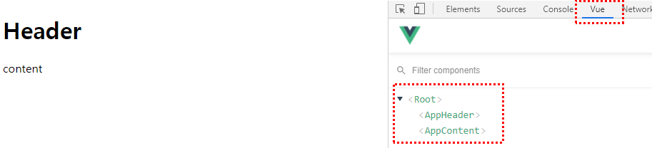
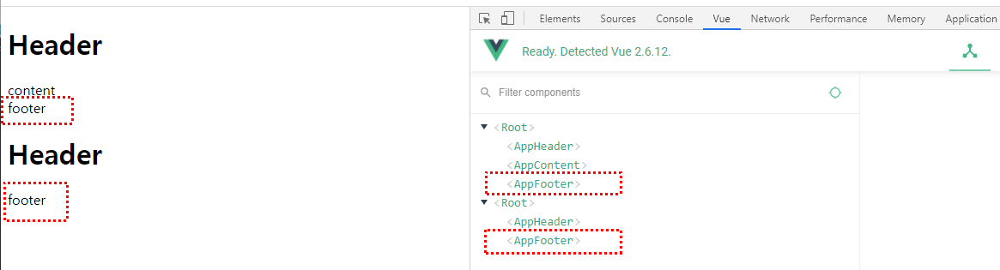
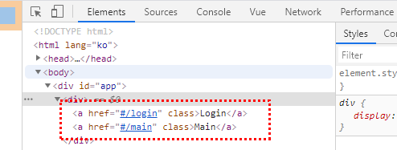
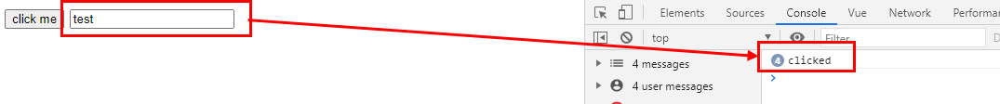
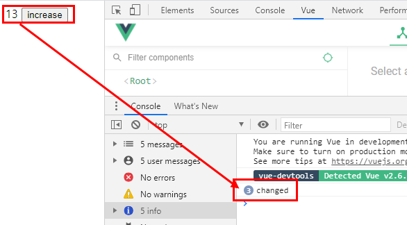
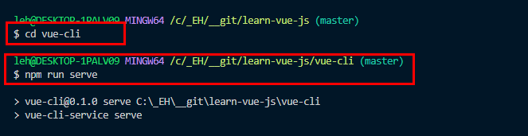
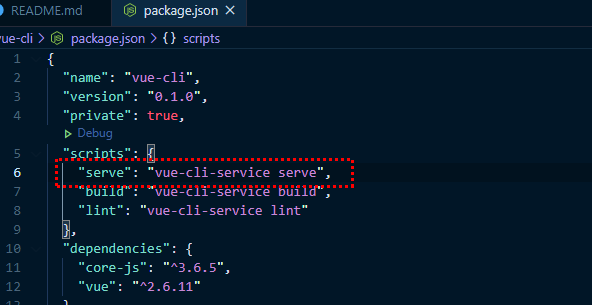
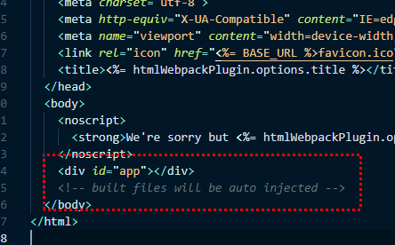
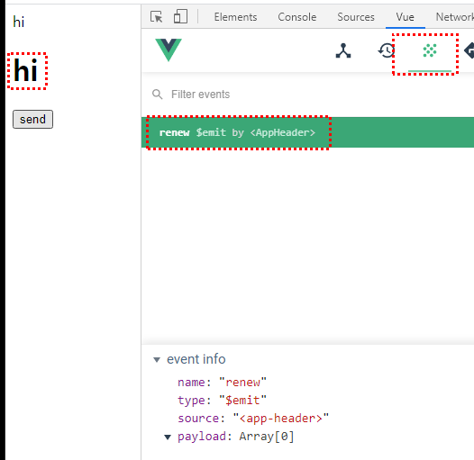

# 개발 환경 세팅
- Chrome(크롬 브라우저) : <br />
https://www.google.com/intl/ko/chrome/
- 크롬 확장프로그램 - Vue.js Devtools :<br />
https://chrome.google.com/webstore/detail/vuejs-devtools/nhdogjmejiglipccpnnnanhbledajbpd
- Visual Studio Code : <br />
https://code.visualstudio.com/
- Node.js (LTS 버전) : <br />
https://nodejs.org/ko/

- [VS Code 플러그인 설치] Vetur
- [VS Code 플러그인 설치] Night Owl
- [VS Code 플러그인 설치] Material Icon Theme
- [VS Code 플러그인 설치] Live Server
- [VS Code 플러그인 설치] ESLint
- [VS Code 플러그인 설치] Prettier
- [VS Code 플러그인 설치] Auto Close Tag

<br /><br /><br />

# LV.01 Vue.js 시작하기 - Age of Vue.js

##  1. vue.js 소개

### 1.1. MVVM 모델에서의 Vue
- Vue : MVVM 패턴의 뷰모델(ViewModel) 레이어에 해당하는 화면(View)단 라이브러리

- View : (html => Dom) 사용자 화면
- Vue :
    1. Dom Listeners : 사용자 키보드 입력, 클릭 등의 정보
    2. Data Bindings : 서버에 저장된 정보를 사용자 화면에 출력

<br />

### 1.2. 기존 웹 개발 방식(HTML, Javascript)
- 기존 HTML 웹개발 방식 : HTML, CSS, Javascript
- playground/web-dev.html
    ```
    <div id="app"></div>
    <script>
        // console.log(div);
        var div = document.querySelector('#app');
        var str = 'hello word';
        div.innerHTML = str;
        
        // 일반적인 기본 개발 방식
        // 기존 코드 값 변경시 그 값을 다시 재실행
        str = 'hello word!!'
        div.innerHTML = str;
    </script>
    ```

<br />

### 1.3. Reactivity 구현
- html 문서에 아래 내용 추가
```
    <div id="app"></div>

    <script>
        var div = document.querySelector('#app');
        var viewModel = {};

        // 객체의 동작을 재정의 하는 api
        // Object.defineProperty(대상객체, 객체의 속성, {
        //    정의할 내용
        //})

        Object.defineProperty(viewModel,'str', {
            // 속성에 접근했을 때의 동작을 정의
            get: function() {
                console.log('접근');
            },
            // 속성에 값을 할당했을 때의 동작을 정의
            set: function(newValue) {
                console.log('할당', newValue);
                div.innerHTML = newValue;
            }
        })

    </script>
```
- 브라우저 console 탭에서 viewModel.str = 'hi' 입력
- 브라우저 뷰화면에서 hi 라는 문구가 보여지고 console 창엔 할당, hi 로 보여진다.
```
    <div id="app">hi</div>
```
- vue의 핵심은 데이터의 변화를 라이브러리에서 감지해서 알아서 화면을 자동으로 그려주는 것이 바로 Reactivity 라고 보면 된다.
- MVVM 모델에서의 Vue 에서 Data Bindings 을 브라우저 화면에서 보여지는 hi 라고 이해하면 된다.

<br />

### 1.4. Hello Vue.js 와 뷰 개발자 도구
- 뷰 개발자 도구 : 크롬에서 확장 프로그램 설치
    - https://chrome.google.com/webstore/detail/vuejs-devtools/nhdogjmejiglipccpnnnanhbledajbpd
    - 확장 프로그램을 설치하고 브라우저 재실행 후 개발자도구를 보면 vue 탭메뉴가 생성된다.
- vue 개발자 도구에서 컴포넌트 탭 > <Root> 클릭하면 Data 부분이 보여진다
- message 부분의 텍스트를 수정하면 브라우저에서 보여지는 부분이 바뀌는 것을 알 수 있다
- 이 기능이 Reactivity 기능이고 vue의 데이터 속성에 기본 기능이라고 이해하면 된다

<br /><br /><br />

##  2. 인스턴스

### 2.1.1 인스턴스 소개 - 뷰 인스턴스
- 인스턴스는 뷰로 개발할 때 **필수로 생성해야 하는 코드**

### 2.1.2 인스턴스 소개 - 인스턴스 생성 -1
- 인스턴스는 아래와 같이 생성할 수 있다
```
    new Vue();
```
- 인스턴스를 생성하고 나면 아래와 같이 인스턴스 안에 어떤 속성과 API가 있는 지 콘솔 창에서 확인할 수 있다
```
    var vm = new Vue();
    console.log(vm);
```
- 브라우저 console 탭에서 vm 을 입력하면 vue에 관한 인스턴스를 확인할 수 있다
```
    // 브라우저 Console 탭, clear console (ctrl + L)
    vm
```
<details><summary>Vue {_uid: 0, _isVue: true, $options: {…}, _renderProxy: Proxy, _self: Vue, …}</summary>
$attrs: (...)
$children: []
$createElement: ƒ (a, b, c, d)
$listeners: (...)
$options: {components: {…}, directives: {…}, filters: {…}, _base: ƒ}
$parent: undefined
$refs: {}
$root: Vue {_uid: 0, _isVue: true, $options: {…}, _renderProxy: Proxy, _self: Vue, …}
$scopedSlots: {}
$slots: {}
$vnode: undefined
_c: ƒ (a, b, c, d)
_data: {__ob__: Observer}
_directInactive: false
_events: {}
_hasHookEvent: false
_inactive: null
_isBeingDestroyed: false
_isDestroyed: false
_isMounted: false
_isVue: true
_renderProxy: Proxy {_uid: 0, _isVue: true, $options: {…}, _renderProxy: Proxy, _self: Vue, …}
_self: Vue {_uid: 0, _isVue: true, $options: {…}, _renderProxy: Proxy, _self: Vue, …}
_staticTrees: null
_uid: 0
_vnode: null
_watcher: null
_watchers: []
$data: (...)
$isServer: (...)
$props: (...)
$ssrContext: (...)
get $attrs: ƒ reactiveGetter()
set $attrs: ƒ reactiveSetter(newVal)
get $listeners: ƒ reactiveGetter()
set $listeners: ƒ reactiveSetter(newVal)
__proto__: Object
</details>

### 2.1.3 인스턴스 소개 - 인스턴스 생성 -2
- body 태그 안에서 app 이라고 아이디를 가진 태그를 찾아서 인스턴스를 붙이겠다는 의미.
- 붙이는 순간 vue의 기능과 속성들이 유효해진다. 
- el(엘리먼트)를 반드시 지정해줘야 사용할 수가 있다.
- 아래처럼 코드를 입력 후, 브라우저 vue 탭 > Root > data에서 입력한 정보를 확인할 수 있다
```
    <div id="app"></div>

    <script src="https://cdn.jsdelivr.net/npm/vue/dist/vue.js"></script>
    <script>
        var vm = new Vue({
            el: '#app',
            data: {
                message: 'hi'
            }
        });
    </script>
```

<br />

### 2.2.1 인스턴스와 생성자 함수 -1 javascript
- 기본적으로 자바스크립에서 어떤 함수를 이용하여 인스턴스를 생성하는 방법은 바로 생성자 함수를 이용하는 것이다.
```
    // Person 이라는 생성자 함수를 만들었다
    // 생성자 함수는 이름을 대문자로 시작한다
    function Person(name, job) {
        this.name = name;
        this.job = job;
    }

    new Person('josh', 'developer');
```
- 그러면 객체가 하나가 생성이 된다
```
    Person { name: josh, job: developer}
```
- 새로 생성된 객체를 P라는 객체 안에 넣어준다
```
    function Person(name, job) {
        this.name = name;
        this.job = job;
    }

    var p = new Person('josh', 'developer');

    console.log(p);
```
- p 객체에 대한 정보를 알 수 있다
```
    Person { name : "josh", job: "developer" }
```
- 이것이 기본 생성자 함수에 대한 정의라고 이해하면 된다

### 2.2.2 인스턴스와 생성자 함수 -2 Vue
- 생성자 함수를 이용해 logoText 라는 함수를 생성했다
```
    // function 에 Vue 라는 생성자 함수를 이용해서
    // 어떤 기능과 속성들을 사람들이 편하게 쓰게 하고 싶을 때
    // logText 함수를 미리 정의하려고 한다

    function Vue() {
        this.logText = function() {
            console.log('Hello');
        }
    }
```
- vm 으로 vue를 생성할 때 마다 객체 안에 logoText 란 함수가 들어가 있다<br />
따라서, 매번 함수를 정의하는 것이 아니라 미리 정의된 함수를 갖다가 사용할 수 있다<br />
이렇기 때문에 생성자 함수로 Vue 에서 api와 속성들을 다 정해놓고<br />
갖다 쓰거나 재사용하게 되는 패턴을 갖고 있는 것이다<br />
**이것이 new Vue()를 쓰는 이유다.**
```
    var vm = new Vue();

    vm.logoText();
```

- MDN 생성자 함수 설명 문서 :<br />
https://developer.mozilla.org/ko/docs/Web/JavaScript/Guide/Obsolete_Pages/Core_JavaScript_1.5_Guide/Creating_New_Objects/Using_a_Constructor_Function

<br />

### 2.3 인스턴스 옵션 속성
- 인스턴스에서 사용할 수 있는 속성과 API는 다음과 같다
    1. el : 인스턴스가 그려지는 화면의 시작점 (특정 HTML 태그)
    2. template: 화면에 표시할 요소(HTML, CSS 등)
    3. data: 뷰의 반응성(Reactivity)가 반영된 데이터 속성
    4. methods: 화면의 동작과 이벤트 로직을 제어하는 메서드
    5. created: 뷰의 라이프 사이클과 관련된 속성
    6. watch: data에서 정의한 속성이 변화했을 때 추가 동작을 수행할 수 있게 정의하는 속성
```
    new Vue({
        // key : value 형태
        el: ,
        template: ,
        data: , 
        methods: ,
        created: ,
        watch: ,
    });
```
- 객체를 생성하고 그 안에 표기하는 vue 문법
```
    // var vm = new Vue({객체 속성값 적용});
    
    var vm = new Vue({
        el: '#app',
        data: {
            message: 'hi',
        },
        methods: {

        },
        created: function() {

        }
    });
```

<br /><br /><br />

##  3. 컴포넌트

### 3.1 컴포넌트 소개 :: 뷰 컴포넌트
- 컴포넌트는 **화면의 영역을 구분**하여 개발할 수 있는 뷰의 기능<br />
컴포넌트 기반으로 화면을 개발하게 되면 **코드의 재사용성이 올라가고 빠르게 화면을 제작**할 수 있다<br />

<br />

### 3.2 전역 컴포넌트 등록
- 인스턴스 생성 > - el: '#app' - 객체 생성
- div id="app"에 인스턴스를 붙이겠다, 적용하겠다 
```
    <div id="app"></div>

    <script src="https://cdn.jsdelivr.net/npm/vue/dist/vue.js"></script>
    <script>
        
        new Vue({
            el: '#app'
        })
    </script>
```
- Vue 인스턴스를 생성하면 기본적으로 Root 안에 컴포넌트가 된다<br />
<br />

- **전역 컴포넌트 등록하는 방법**
    1. component()로 전역 컴포넌트 등록
    ```
        Vue.Component('컴포넌트 이름', 컴포넌트 내용);
    ```
    2. 컴포넌트 내용엔 객체를 열어서 속성: 속성값 형식으로 적용한다
    3. 컴포넌트 내용을 적고 app-header 컴포넌트를 등록한다
    ```
        Vue.component('app-header', {
            template: '<h1>Header</h1>'
        });

        Vue.component('app-content', {
            template: '<div>content</div>'
        })

    ```
    4. 등록한 컴포넌트의 태그를 el: #app 항목 안에 적용해준다
    5. 컴포넌트한 태그를 적어주면 컴포넌트 template에 적용된 내용이 나타나게 된다
    ```
        <div id="app">
            <app-header></app-header>
            <app-content></app-content>
        </div>
    ```
    6. 전역 컴포넌트 등록은 실제 사용하는 일은 거의 없다고 한다.
    7. 브라우저, Vue 개발자 도구에서 app-header, app-content가 등록된 것을 확인할 수 있다<br />
        - Root = 상위 컴포넌트, 일반적으로 부모에 해당 된다
        - header, content 가 하위 컴포넌트로써 보통 자식 컴포넌트라고 부르기도 한다
    


<br />

### 3.3 지역 컴포넌트 등록
- 서비스를 만들 때 가장 많이 쓰는 컴포넌트 등록 방법이다
- **지역 컴포넌트 등록하는 방법**
    1. 인스턴스 객체 안에 component 객체를 만들어준다 
        - {} 객체표기법(=객체 리터럴) ex) 속성명: {}
    ```
        new Vue({
            el: '#app',
            components: {
            }
        });
    ```
    2. component 에 생성해야 할 컴포넌트 객체를 만든다 ex) app-footer
        - 컴포넌트 내용을 적용해줄 때도 객체표기법('{}')을 이용해 작성한다
    ```
        new Vue({
            el: '#app',
            components: {
                // '키(속성)': '값(속성)',
                // '컴포넌트 이름' : 컴포넌트 내용
                'app-footer': {
                    template: '<footer>footer</footer>'
                }
            }
        });
    ```

    

    <br />

### 3.4 전역 컴포넌트와 지역 컴포넌트의 차이점
- 전역 컴포넌트 등록 시 **component** &nbsp;&nbsp;/&nbsp;&nbsp;지역 컴포넌트 등록 시 **components**
- 지역 컴포넌트로 등록할 땐, 뒤에 **s**가 붙는 걸 명시!!!
    - 예로 method 경우에도 methods 로 적용해야 한다
```
    // 전역 컴포넌트
    Vue.component('컴포넌트 이름', 컴포넌트 내용);

    // 지역 컴포넌트
    new Vue({
        el: '#app',
        components: {
            '컴포넌트 이름': 컴포넌트 내용
        }
    });
```
- 전역 컴포넌트 사용 예<br />
: 플러그인, 라이브러리 형태로 전역으로 사용할 때만 전역 컴포넌트로 사용한다.
- 일반적으론 지역 컴포넌트를 사용하며,<br />
components 에서 어떤 컴포넌트를 사용했는 지 확인이 가능하다

### 3.5 컴포넌트와 인스턴스와의 관계
- Vue 인스턴스를 2개 만든다
```
    <div id="app"></div>
    <div id="app2"></div>

    new Vue({
        el: '#app',
    })
    new Vue({
        el: '#app2',
    })
```
- Root 가 2개 생성된 것을 확인할 수 있다
- 인스턴스를 생성하면 Root 컴포넌트로 기본 생성된다는 것을 확인할 수 있다


- 전역 컴포넌트(app-header) 경우, <br />
생성된 인스턴스 > components 에 적용하지 않아도되지만<br />
지역 컴포넌트(app-footer)는 반드시! 해당 인스턴스 객체 안에 표기를 해주어야 한다

- **즉, 전역 컴포넌트는 인스턴스를 생성할 때마다 적용할 필요가 없지만**<br />
**지역 컴포넌트는 반드시! 해당 인스턴스 안에 적용을 해줘야 한다!!**

```
    <div id="app">
        <app-header></app-header>
        <app-content></app-content>
        <app-footer></app-footer>
    </div>

    <div id="app2">
        <app-header></app-header>
        <app-footer></app-footer>
    </div>

    <script>

        Vue.component('app-header', {
            template: '<h1>Header</h1>'
        });

        Vue.component('app-content', {
            template: '<div>content</div>'
        })

        new Vue({
            el: '#app',
            components: {
                'app-footer': {
                    template: '<footer>footer</footer>'
                }
            }
        });

        new Vue({
            el: '#app2',
            components: {
                'app-footer': {
                    template: '<footer>footer</footer>'
                }
            }
        })

    </script>
```


<br /><br /><br />

##  4. 컴포넌트 통신 방법 - 기본

### 4.1. 컴포넌트 통신
- 뷰 컴포넌트는 각각 고유한 데이터 유효 범위를 갖는다.
- 따라서, 컴포넌트 간에 데이터를 주고 받기 위해선 아래와 같은 규칙을 따라야 한다.


- 상위에서 하위로는 데이터를 내려줌, **프롭스 속성**
- 하위에서 사위로는 이벤트를 올려줌, **이벤트 발생**

<br />

### 4.2. 컴포넌트 통신 규칙이 필요한 이유
- 컴포넌트 통신 규칙으로 데이터의 흐름을 추적할 수 있다
- 데이터는 아래로 흘러가고 이벤트는 위로 올라가기 때문이다<br />
(데이터 = props(프롭스))


<br />

### 4.3. props 속성
- template를 변수로 만들어서 적용하려고 한다
- 아래 코드에서 components: { ***template:'< h1 >header< /h1 >'** } 이 부분을 변수로 만든다
```
    new Vue({
        el: '#app',
        components: {
            // template 길어질 수 있어 변수로 등록한다
            // 'app-header': {
                // template: '<h1>header</h1>'
            //}
            'app-header': appHeader,
        }
    });
```
- template 변수로 만들기
- 변수는 **카멜케이스를 이용**해 만든다. <br />
단어들을 묶어서 표현할 때 **첫번째 단어를 제외한 단어들의 앞글자를 대문자**로 쓴다.<br />
ex) app-header = appHeader
- template 를 변수로 만들어서 사용하는 이유는 코드가 길어지기 때문에 해당영역을 변수로 사용하여 적용한다
```
    var appHeader = {
        template: '<h1>header</h1>'
    }

    new Vue({
        el: '#app',
        components: {
            'app-header': appHeader,
        }
    });
```
- Vue() 인스턴스에 data 객체 속성을 적용하고 message 객체를 적용한다
- 뷰 개발자 도구에서 보면 Root에 data - message:hi 를 확인할 수 있다
```
    <script>
        new Vue({
            el: '#app',
            components: {
                'app-header': appHeader,
            },
            data: {
                message: 'hi'
            }
        });
    </script>
```


- app-header 컴포넌트에 data - message 값을 받기 위해 props 를 적용한다
```
    <app-header v-bind:프롭스 속성 이름="상위 컴포넌트의 데이터 이름"></app-header>
```
- 상위 컴포넌트의 데이터 이름 : message<br />
app-header 상위 컴포넌트는 Root = #app<br />
따라서 app의 data 에 적용된 속성이름 message 를 적어준다
- 프롭스 속성이름은 변수로 만든 appHeader 에 props 속성을 적용하여 이름을 적어준다<br />
props: ['프롭스 이름']
- 따라서 v-bind:**propsdata**=**'message'**
```
    <div id="app">
        <app-header v-bind:propsdata="message"></app-header>
    </div>

    <script src="https://cdn.jsdelivr.net/npm/vue/dist/vue.js"></script>
    <script>

        var appHeader = {
            template: '<h1>header</h1>',
            props: ['propsdata']
        }

        new Vue({
            el: '#app',
            components: {
                'app-header': appHeader,
            },
            data: {
                message: 'hi'
            }
        });
    </script>
```
- [뷰 개발자 도구] Root 에 data - message: 'hi' 값을 확인할 수 있다


- [뷰 개발자 도구] AppHeader 에서 props - propsdata: 'hi' 값을 확인할 수 있다


### 4.4. props 속성의 특징
- data 에서 받은 props 내용을 화면에 출력하고자 할 땐,<br />
데이터 바인딩 {{}} 문법을 통해 props에 정의한 propsdata 이름을 template 에 적용한다<br />
template: '< h1 >{{ propsdata }}< /h1 >'
- 데이터 바인딩 {{ }} 문법에 data 속성과 props 속성이름을 적어주면 해당 내용이 화면에 출력된다
```
    <div id="app">
        <app-header v-bind:propsdata="message"></app-header>
    </div>

    <script src="https://cdn.jsdelivr.net/npm/vue/dist/vue.js"></script>
    <script>

        var appHeader = {
            // template: '<h1>header</h1>',
            template: '<h1>{{ propsdata }}</h1>',
            props: ['propsdata']
        }

        new Vue({
            el: '#app',
            components: {
                'app-header': appHeader,
            },
            data: {
                message: 'hi'
            }
        });
    </script>
```


<br />

### 4.5. event emit
- **이벤트 발생 :**<br />
이벤트 발생은 컴포넌트의 통신 방법 중 하위 컴포넌트에서 상위 컴포넌트로 통신하는 방식이다
- 이벤트 발생 코드 형식<br />
하위 컴포넌트의 메서드나 라이프 사이클 훅과 같은 곳에 아래와 같이 코드를 추가한다
- this.$emit = 뷰의 api = 기능
```
    // 하위 컴포넌트의 내용
    this.$emit('이벤트 명');
```
- 그리고 나서 해당 이벤트를 수신하기 위해 상위 컴포넌트의 템플릿에 아래와 같이 구현한다.
```
    <!-- 상위 컴포넌트의 템플릿 -->
    <div id="app>
        <child-component v-on:이벤트 명="상위 컴포넌트의 실행할 메서드 명 또는 연산"></child-component>
    </div>
```
<br />

- **event emit 예시-1**
    1. button 을 만들고 v-on:click 클릭 이벤트를 적용한다
    2. 버튼을 클릭했을 때 passEvent 메서드 실행시킬려고 한다<br />
    해당 컴포넌트 변수에 methods - passEvent 함수를 정의해준다
    3. 기본적으로 메서드의 함수 표기는 아래와 같다<br />
    methods: {<br />
    &nbsp;&nbsp;//메서드 함수이름 : function()
    &nbsp;&nbsp;passEvent: function() {<br />
    &nbsp;&nbsp;}<br />
    }
    4. this.$emit('pass') => this.$emit 으로 pass 라는 이벤트를 보낼려고 한다
    ```
        <div id="app">
            <app-header></app-header>
        </div>

        <script src="https://cdn.jsdelivr.net/npm/vue/dist/vue.js"></script>
        <script>

            var appHeader = {
                template: '<button v-on:click="passEvent">click me</button>',
                methods: {
                    passEvent: function() {
                        this.$emit('pass');
                    }
                }
            }

            new Vue({
                el: '#app',
                components: {
                    'app-header': appHeader
                }
            })
        </script>
    ```
    5. [뷰 개발자 도구] Events 항목에서 이벤트 내역(로깅)을 확인할 수 있다
        - < app-header > 에서 $emit 이벤트가 발생되는데 pass라는 이벤트가 발생되었다는 것을 확인할 수 있다
    

<br />

### 4.6. event emit으로 콘솔 출력하기
- $emit을 설정한 후, 컴포넌트에서 해당 값을 받을 수 있게 설정을 해줘야 한다
- v-on:하위 컴포넌트에서 발생한 이벤트 이름="상위 컴포넌트에서의 메서드 이름"
```
    <app-header v-on:하위 컴포넌트에서 발생한 이벤트 이름="상위 컴포넌트에서의 메서드 이름"></app-header>
```

<br />

- **event emit으로 콘솔 출력하는 방법**
    1. logText : 상위 컴포넌트에서의 메서드 이름<br />
    2. pass&nbsp;&nbsp;&nbsp;&nbsp;&nbsp;: 하위 컴포넌트에서 발생한 이벤트 이름<br />
    ```
        <app-header v-on:pass="logText"></app-header>
    ```
    3. Root 에서 methods - logText 함수를 생성하고<br />
    passEvent 이벤트 발생 시 해당 함수가 실행되게 적용을 한다
    ```
        new Vue({
            el: '#app',
            components: {
                'app-header': appHeader
            },
            methods: {
                logText: function() {
                    console.log('hi');
                }
            }
        })
    ```
    4. appHeader 변수에서 methods - passEvent 함수에서 정의된 this.$emit(이벤트이름)을 확인할 수 있다
    ```
        var appHeader = {
            template: '<button v-on:click="passEvent">click me</button>',
            methods: {
                passEvent: function() {
                    this.$emit('pass');
                }
            }
        }
    ```

    5. [뷰 개발자 도구] Events 에서 **click me 버튼을 클릭할 때마다 이벤트 내역(로깅) 추가 확인**을 할 수 있다<br />
    (하위 컴포넌트 --(이벤트 발생)--> 상위 컴포넌트 )
    6. [콘솔] 창에서 **click me 버튼을 클릭할 때마다 로그가 추가** 된 것을 확인할 수 있다
    

<br />

### 4.7. 실습 - event emit
- add 버튼을 클릭하면 addNumber 함수를 실행하겠다<br />
v-on:click="addNumber"
- addNumber 함수 실행 시 increase 이벤트를 실행하겠다<br />
this.$emit('increase');
```
    var appContent = {
        template: '<button v-on:click="addNumber">add</button>',
        methods: {
            addNumber: function() {
                this.$emit('increase');
            }
        }
    }
```
- increase 이벤트를 app-content 컴포넌트에서 increaseNumber 함수를 실행하겠다
- increaseNumber 함수 이벤트는 add 버튼 클릭 시 num 값을 1씩 증가 시킨다
```
    <app-content v-on:increase="increaseNumber"></app-content>

    new Vue({
        el: '#app',
        components: {
            'app-content': appContent,
        },
        methods: {
            increaseNumber: function() {
                this.num = this.num +1;
            }
        },
        data: {
            num: 10
        }
    })
```


- num 값을 html에서 화면 출력하고자 할 땐, 데이터 바인딩 문법을 이용하여 적용한다
- num 값이 화면 출력 화면에 실시간으로 나오게 되고<br />
[뷰 개발자 도구] Events에서 increase 이벤트가 실행되는 것을 확인할 수 있다
```
    <div id="app">
        <p>{{ num }} </p>
    </div>
```


### 4.8. 뷰 인스턴스에서의 this
- obj 객체에서 num 에 접근하고 싶으면<br />
getNumber 메소드에서 this.num 으로 적용하면 된다.
- obj 객체 안에서 객체 속성에서 다른 속성이나 어떤 것을 가리킬 때에는<br />
this 를 쓰면 obj 를 가리키게 된다.<br />
(ex. obj = this )
```
    var obj = {
        num:10,
        getNumber: function() {
            console.log(this.num);
        }
    }
```


- 아래 this 가 가르키는 것은 Vue
- methods의 getNumber 속성 함수 안에서 this 는 해당 data의 num 을 바라본다
```
    var Vue = {
        el: '',
        data: {
            num: 10,
        },
        methods: {    
            getNumber: function() {
                this.num
            }
        }
    }
```

- this 관련 글 1 : https://www.w3schools.com/js/js_this.asp
- this 관련 글 2 : https://medium.com/better-programming/understanding-the-this-keyword-in-javascript-cb76d4c7c5e8

<br /><br /><br />

##  5. 컴포넌트 통신 방법 - 응용
### 5.1. 같은 컴포넌트 레벨 간의 통신 방법
- Root : Vue 인스턴스<br />
app-header 컴포넌트와 app-content 컴포넌트에서 데이터를 보내고자 할 때<br />
즉, 같은 컴포넌트 레벨 간의 톧신방법을 알아보고자 한다<br />
상위 컴포넌트 -> 하위 컴포넌트 (props 프롭스)<br />
상위 컴포넌트 <- 하위 컴포넌트 (이벤트 발생)


### 5.2. 같은 컴포넌트 레벨 간의 구현 1
**content 에서 pass 버튼 클릭 시 header 에 데이터를 전송하려고 한다**
```
    <div id="app">
        <app-header></app-header>
        <app-content></app-header>
    </div>

    <script>

        var appHeader = {
            template: '<div>header</div>'
        }
        var appContent = {
            template: '<div>content<button>pass</button></div>',
        }

        new Vue({
            el: '#app',
            components: {
                'app-header': appHeader,
                'app-content': appContent
            }
        });
    </script>
```
- pass 버튼 클릭 시 passNum 함수를 실행시키려고 한다<br />
- passNum 함수가 실행될 때, pass 이벤트가 실행이 되면서 10을 넘겨줄려고 한다.
```
    var appContent = {
        template: '<div>content<button v-on:click="passNum">pass</button></div>',
        methods: {
            passNum: function() {
                this.$emit('pass', 10)
            }
        }
    }
```

- pass 이벤트가 실행되면 10이 넘어간 것을 확인할 수 있다<br />
payload: Array[1] 에서 0:10 
<br />


- app-content 에서 app-header로 바로 데이터를 넘길 수가 없어서<br />
app-header의 상위 컴포넌트인 Root로 넘긴 후에 Root에서 app-header로 넘기려고 한다
- 올릴 때는 이벤트, 내릴 때는 props(프롭스)

<br />

- Root 에서 app-header로 데이터를 넘길려면 root에서 데이터를 선언해야 한다
```
    new Vue({
        el: '#app',
        components: {
            'app-header': appHeader,
            'app-content': appContent
        },
        data: {
            num: 0,
        }
    });
```

- app-content에서 v-on을 통해 pass 이벤트의 값을 받고 상위 컴포넌트의 메서드를 실행한다<br />
(상위 컴포넌트, 현재 기준으론 Root 를 가리키게 된다)
-  Root의 메서드 deliverNum 생성하고 pass 이벤트를 받았을 때 수행할 수 있게 v-on에 적용한다
```
    <div id="app">
        <app-header></app-header>
        <app-content v-on:pass="deliverNum"></app-header>
    </div>
```
```
    new Vue({
        el: '#app',
        components: {
            'app-header': appHeader,
            'app-content': appContent
        },
        data: {
            num: 0,
        },
        methods: {
            // 받은 인자를 value로 정의한다
            deliverNum: function(value) {
                this.num = value
            }
        }
    });
```

- pass 버튼을 클릭하면 Root에 data num:10이 생성되는 걸 볼 수 있다
<br />

- 이제, 전달된 num:10 값을 app-header에 전달하려고 한다.
- appHeader 에 props 객체를 추가해주고,<br />
app-header 태그에 v-bind로 추가한 props 객체를 연결해준다
```
    <div id="app">
        <app-header v-bind:propsdata="num"></app-header>
        <app-content v-on:pass="deliverNum"></app-header>
    </div>

    <script src="https://cdn.jsdelivr.net/npm/vue/dist/vue.js"></script>
    <script>

        var appHeader = {
            template: '<div>header</div>',
            props: ['propsdata']
        }
        var appContent = {
            template: '<div>content<button v-on:click="passNum">pass</button></div>',
            methods: {
                passNum: function() {
                    // pass 이벤트 실행, 값 10을 넘겨준다
                    this.$emit('pass', 10)
                }
            }
        }

        new Vue({
            el: '#app',
            components: {
                'app-header': appHeader,
                'app-content': appContent
            },
            data: {
                num: 0,
            },
            methods: {
                // 받은 인자(10)를 value로 정의한다
                deliverNum: function(value) {
                    this.num = value
                }
            }
        });
    </script>
```

- 작업한 html 파일에서 클릭이벤트가 제대로 작동이 되는 지<br />
[뷰 개발자 도구] Events 에서 확인해본다
<br />

- [뷰 개발자 도구] app-header 태그에 props 값이 적용된 것을 확인할 수 있다
<br />


<br /><br /><br />

##  6. 라우터 (router)
### 6.1. 뷰 라우터 소개와 설치
#### 6.1.1. 뷰 라우터
뷰 라우터는 뷰 라이브러리를 이용하여 싱글 페이지 애플리케이션을 구현할 때 사용하는 라이브러리 이다<br />
공식 사이트 : https://router.vuejs.org/installation.html

#### 6.1.2. 뷰 라우터 설치
프로젝트에 뷰 라우터를 설치하는 방법은 CDN 방식과 NPM 방식 2가지가 있다

**6.1.2.1. CDN 방식**
```
    <script src="https://unpkg.com/vue-router@3.4.9/dist/vue-router.js"></script>
```
- CDN 방식으로 할 때 vue.js > vue-router 순으로 적용한다
- vue와 router 인스턴스까지 생성한다 (기본 폼)
```
    <div id="app"></div>

    <script src="https://cdn.jsdelivr.net/npm/vue/dist/vue.js"></script>
    <script src="https://unpkg.com/vue-router@3.4.9/dist/vue-router.js"></script>
    <script>

        new VueRouter({

        });

        new Vue({
            el: '#app'
        });
        
    </script>
```

**6.1.2.2. NPM 방식**
```
    npm install vue-router
```

### 6.2. 뷰 라우터 인스턴스 연결 및 초기 상태 안내
- VueRouter 를 Vue 인스턴스에 동작 시키려고 한다
- new VueRouter 를 변수 router에 담는다
- Vue 인스턴스에 변수로 만든 router 를 연결하는데<br />
router: 로 명시된 부분은 vue에 methode, components 처럼 미리 만들어져있는 속성이다<br />
router: router (변수로 만든 router를 연결한다)
```
    <script>
        var router = new VueRouter({

        });

        new Vue({
            el: '#app',
            router:  router,
        });
    </script>
```
- VueRouter 가 Vue에 제대로 주입이 되었다 라는 것을 알 수 있다


**6.2.1 뷰 라우터 등록**<br />
뷰 라우터를 설치하고 나면 아래와 같이 라우터 인스턴스를 하나 생성하고 뷰 인스턴스에 등록한다
```
    // 라우터 인스턴스 생성
    var router = new VueRouter({
        // 라우터 옵션
    })

    // 인스턴스에 라우터 인스턴스를 등록
    new Vue({
        router: router
    })
```

<br />

**6.2.2 뷰 라우터 옵션**<br />
위와 같이 라우터를 등록하고 나면 그 다음에 할 일은 라우터에 옵션을 정의하는 일이다.<br />
대부분의 SPA 앱에서는 아래와 같이 2개 옵션을 필수로 지정한다
- routes : 라우팅 할 URL과 컴포넌트 값 지정
- mode : URL의 해쉬 값 제거 속성
그럼 위 옵션으로 라우터를 정의해보겠다
```
    new VueRouter({
        mode: 'history',
        routes: [
            {
                path: '/login',
                component: LoginComponent
            },
            {
                path: '/home',
                component: HomeComponent
            }
        ]
    })
```
<br />

- mode: 'history' 는 라우팅을 할 때 URL에 # 값을 제거하고, <br />
URL 값이 /login 과 /home 일 때 각각 로그인 컴포넌트와  홈 컴포넌트를 뿌려준다<br />
(※ 아래 이미지에 네모 박스로 표시된 # 부분을 제거해준다는 뜻!)

<br />

**6.2.3 router-view**<br />
브라우저의 주소 창에서 URL이 변경되면, <br />
앞에서 정의한 routes 속성에 따라 해당 컴포넌트가 화면에 뿌려진다<br />
이 때 뿌려지는 지점이 템플릿의 < router-view > 이다.
```
    <div id="app">
        <router-view></router-view> <!-- LoginComponent 또는 HomeComponent -->
    </div>
```
(6.2.1, 6.2.2) 앞에서 정의한 라우팅 옵션 기준으로 /login 은 로그인 컴포넌트를<br />
/home 은 홈 컴포넌트를 화면에 표시한다

**6.2.4 router-link**<br />
일반적으로 웹 페이지에서 페이지 이동을 할 때는 사용자가 url을 다 쳐서 이동하지 않는다.<br />
이 때 화면에서 특정 링크를 클릭해서 페이지를 이동할 수 있게 해줘야 하는데 그게 바로 < router-link > 이다.
```
    <router-link to="이동할 URL"></router-link>
```
실제 코드 예시는 다음과 같다
```
    <div>
        <router-link to="/login"></router-link>
    </div>
```
위 코드를 실행하면 화면에서는 < a > 태그로 변형되서 나온다<br />
< a > 태그를 클릭하면 /login URL로 이동이 된다

### 6.3. [실습] routes 속성 설명 및 실습안내
- VueRouter 객체 안에 routes 속성을 추가한다
- **routes** 속성은 **페이지의 라우팅 정보**를 뜻한다.
    - **페이지의 라우팅 정보란**, 어떤 URL로 이동했을 때<br />
    어떤 페이지가 뿌려질 지에 대한 정보가 배열로 담기게 된다
    - routes: [, , ...]
```
    var router = new VueRouter({
        routes: [
        ]
    });
```
<br />

- routes 속성에 2개의 페이지를 담아보려고 한다
- 2개의 페이지 모두 객체로 적용하려고 한다<br />
**즉, 페이지의 갯수만큼 객체가 들어간다** (페이지 2개를 만들 예정으로 객체 2개 생성)<br />
- 작업하기 전, 구조를 아래처럼 먼저 잡은 후 내용을 채워넣는 식으로 작업을 진행한다
```
    var router = new VueRouter({
        routes: [
            {},
            {},
        ]
    });
```

<br />

- routes 객체(**{ }**) 안에 path, component 속성을 추가한다
- path : 페이지의 url
- component : 해당 url에서 표시될 컴포넌트
```
    var LoginComponent = {
        template: '<div>login</div>'
    }

    var router = new VueRouter({
        routes: [
            {
                path: '/login',
                component: LoginComponent
            },
            {},
        ]
    });
```

<br />

- **< router-view >**<br />
: 페이지 url이 이동(변경)되었을 때 그 url에 따라서 변경되는 영역을 말한다
- router-view는 Vue 인스턴스에 router 속성으로 연결이 되어야만 쓸 수 있는 태그이다.<br />
(연결이 안되었을 경우, 콘솔 창에 에러 발생)
```
    <div id="app">
        <router-view></router-view>
    </div>
```


<br />

- 주소 뒤에 /login 으로 페이지 이동을 하게 되면<br />
해당 페이지에 맞는 컴포넌트로 변경된 것을 확인할 수 있다
- **path 속성에 기입한 url로 페이지 이동되면 해당 컴포넌트로 변경**


<br />

### 6.4. 링크를 이용한 페이지 이동 및 router-link 태그 설명
- router-link 태그는 페이지 이동을 위한 링크 태그이다
- **router-link to="경로"** 를 적어주면 된다
```
    <div id="app">
        <!-- router-link 태그는 페이지 이동을 위한 링크 태그이다 -->
        <div>
            <router-link to="/login">Login</router-link>
            <router-link to="/main">Main</router-link>
        </div>

        <!-- 페이지 url이 이동(변경)되었을 때 그 url에 따라서 변경되는 영역  -->
        <router-view></router-view>
    </div>
```
- router-link 태그는 html 페이지에서는 **< a href="/login" > Login < /a >** 로 보여지게 된다


<br /><br /><br />

##  7. HTTP 통신 라이브러리 - axios(액시오스)
### 7.1. HTTP 라이브러리와 Ajax 그리고 Vue Resource
**HTTP 라이브러리와 Ajax**<br />
- Ajax(Asynchronous Javascript and XML, 에이잭스)는 비동기적 웹 애플리케이션의 제작
- 특정 데이터만 서버에 요청하여 받아올 수 있다
- 뷰 라우터 라던지 싱글 페이지 웹 애플리케이션이 구현하기 쉬워졌다
- ex. jQuery.ajax()

<br />

**Vue Resource**<br />
- pagekit/vue-resource : <br />
2,3년전 공식 라이브러리 였지만 vue 창지자 에반뉴가 공식 라이브러리로 관리하지 않겠다고 발표했다
- 현재는 공식 라이브러리로 지정되지 않은 상태로 추후 작업할 때 참고해야 한다
- 샘플들을 볼 때 구 버전일 확률로 주의해서 사용해야 한다

<br />

### 7.2. axios  소개 및 오픈소스를 사용하기 전에 알아야 할 것들
**7.2.1 axios(액시오스)**
뷰에서 권고하는 HTTP 통신 라이브러리는 액시오스(Axios).<br />
**Promise 기반의 HTTP 통신 라이브러리**이며 상대적으로 다른 HTTP 통신 라이브러리들에 비해<br />
**문서화가 잘되어 있고 API가 다양**하다
- https://github.com/axios/axios<br />
또는 구글에서 axios github 검색

- 오픈소스(github)을 이용할 때 참고할 점
    - Star : 페이스북의 좋아요와 같은 기능 (인지도를 확인할 수 있다)
    - commits :작업 이력 확인
    - contributors : 수정/보완을 하기 위해 몇 명의 사람들이 동참했는 지 확인 가능
    - 최신 수정 날짜도 확인을 한다

    

- **비동기 처리 :** <br />
자바스크립트의 비동기 처리란 특정 코드의 연산이 끝날 때까지 코드의 실행을 멈추지 않고<br />
다음 코드를 먼저 실행하는 자바스크립트의 특성을 의미한다

<br />

- **자바스크립트의 비동기 처리 패턴**
    1. callback
    2. promise
    3. promise + generator
    4. async & await

<br />

- **promise :** javascript 의 비동기적 처리 방법
    - "A promise is an object that may produce a single value some time in the future"
    - 프로미스 : 자바스크립트 비동기 처리에 사용되는 객체<br />
    - 프로미스 : 주로 서버에서 받아온 데이터를 화면에 표시할 때 사용한다<br />
    - **프로미스의 3가지 상태(states)**
        - Pending(대기) : 비동기 처리 로직이 아직 완료되지 않은 상태
        - Fulfilled(이행) : 비동기 처리가 완료되어 프로미스가 결과 값을 반환해준 상태 (=완료)
        - Rejected(실패) : 비동기 처리가 실패하거나 오류가 발생한 상태

<br />

- **여러 개의 프로미스 연결하기 (Promise Chaining) :**<br />
프로미스의 또 다른 특징은 여러 개의 프로미스를 연결하여 사용할 수 있다<br />
then() 메서드를 호출하고 나면 새로운 프로미스 객체가 반환된다
```
    function getData() {
        return new Promise({
            // ...
        });
    }

    // then() 으로 여러 개의 프로미스를 연결한 형식
    getData()
        .then(function(data) {
            // ...
        })
        .then(function() {
            // ...
        })
        .then(function() {
            // ...
        });
```
<br />

- **실무에서 있을 법한 프로미스 연결 사례**
    - 실제 웹 서비스에서 있을 법한 사용자 로그인 인증 로직에 프로미스를 여러 개 연결해보았다
    ```
        getData(userInfo)
            .then(parseValue)
            .then(auth)
            .then(diaplay);
    ```
    - 위 코드는 페이지에 입력된 사용자 정보를 받아와 파싱, 인증 등의 작업을 거치는 코드를 나타낸다<br />>
    여기서 userInfo는 사용자 정보가 담긴 객체를 의미하고, parseValue, auth, display는 각각 프로미스를 반환해주는 함수라고 가정한다
    ```
        var userInfo = {
            id: 'test@abc.com',
            pw: '****'
        };

        function parseValue() {
            return new Promise({
                // ...
            });
        }
        function auth() {
            return new Promise({
                // ...
            });
        }
        function display() {
            return new Promise({
                // ...
            });
        }
    ```
    - **여러 개의 프로미스를 .then()으로 연결하여 처리**할 수 있다

<br />

- **프로미스의 에러 처리 방법**
    - 실제 서비스를 구현하다 보면 네트워크 연결, 서버 문제 등으로 인해 오류가 발생할 수 있다<br />
    따라서, 프로미스의 에러 처리 방법에 대해서도 알고 있어야 한다
    - 에러 처리 방법에는 다음과 같이 2가지 방법이 있다
        1. then()의 두 번째 인자로 에러를 처리하는 방법
        ```
        getData().then(
            handleSuccess,
            handleError
        );
        ```
        2. catch()를 이용하는 방법
        ```
            getData().then().catch();
        ```
        3. 위 2가지 방법 모두 프로미스의 reject() 메서드가 호출되어 실패 상태가 된 경우에 실행된다<br />
        간단하게 말해서 프로미스의 로직이 정상적으로 돌아가지 않는 경우 호출된다
        ```
            function getData() {
                return new Promise(function(resolve, reject) {
                    reject('failed');
                });
            }

            // 1. then()의 두 번째 인자로 에러를 처리하는 코드
            getData().then(function() {
                // ...
            }, function(err) {
                console.log(err);
            });

            // 2. catch()로 에러를 처리하는 코드
            getData().then().catch(function(err) {
                console.log(err);
            });
        ```
<br />        

- **프로미스 에러 처리는 가급적 catch()를 사용**
    - 개인의 코딩 스타일에 따라서 then()의 두 번째 인자로 처리할 수도 있고 catch()로 처리할 수도 있겠지만<br />
    **가급적 catch()로 에러를 처리하는 게 더 효율적**이다<br />

    1. catch() 코드를 써야 하는 이유 - 아래 코드 참고
    ```
        // then()의 두 번째 인자로는 감지하지 못하는 오류
        function getData() {
            return new Promise(function(resolve, reject) {
                resolve('hi');
            });
        }

        getData().then(function(result) {
            console.log(result);
            throw new Error("Error in then()"); // Uncaught (in promise) Error: Error in then()
        }, function(err) {
            console.log('then error : ', err);
        });
    ```

    2. getData() 함수의 프로미스에서 resolve() 메서드를 호출하여 정상적으로 로직을 처리했지만,<br /> 
    then()의 첫 번째 콜백 함수 내부에서 오류가 나는 경우 오류를 제대로 잡아내지 못 한다<br />
    따라서 코드를 실행하면 아래와 같은 오류가 난다

    

    3. 하지만 똑같은 오류를 catch()로 처리하면 다른 결과가 나온다
    ```
        // catch()로 오류를 감지하는 코드
        function getData() {
            return new Promise(function(resolve, reject) {
                resolve('hi');
            });
        }

        getData().then(function(result) {
            console.log(result); // hi
            throw new Error("Error in then()");
        }).catch(function(err) {
            console.log('then error : ', err); // then error :  Error: Error in then()
        });
    ```
    4. 위 코드의 처리 결과는 다음과 같다
    

    5. **따라서, 더 많은 예외 처리 상황을 위해 프로미스의 끝에 가급적 catch()를 사용해야 한다**

<br />

- **async & await**
    - async와 await는 자바스크립트의 비동기 처리 패턴 중 가장 최근에 나온 문법이다<br />
    기존의 비동기 처리 방식인 콜백 함수와 프로미스의 단점을 보완하고 개발자가 읽기 좋은 코드를 작성할 수 있게 도와준다

<br />

### 7.3. axios 실습 및 this 설명
- get user 버튼 클릭 시 **getData 메서드 실행**
- 샘플 데이터 정보(10개의 사용자 정보가 담긴 객체 배열) : https://jsonplaceholder.typicode.com/users/
    - jsonplaceholder : 자바스크립트로 api를 요청할 때 테스트해볼 수 있는 사이트
- 샘플 데이터를 받아올 때 **성공하면 then 진입** / **실패하면 catch 를 진입**
- **then, catch 개념은 promise 에서 이해**해야 한다
```
    <div id="app">
        <button v-on:click="getData">get user</button>
    </div>

  <script src="https://cdn.jsdelivr.net/npm/vue/dist/vue.js"></script>
  <script src="https://unpkg.com/axios/dist/axios.min.js"></script>
  <script>
    new Vue({
        el: '#app',
        methods: {
            getData: function() { 
            axios.get('https://jsonplaceholder.typicode.com/users/')
                .then(function(response) {
                    console.log(response);
                })
                .catch(function(error) {
                    console.log(error);
                });
            }
        }
    })
  </script>
```
- 서버에서 받아온 데이터 결과물 <br />
    - 액시오스에서의 일반적인 구조 
        1. config 속성
        2. data 속성 : data 영역을 보면 사용자 정보 10개가 보여진다
        3. headers 속성
        4. request 속성

    

<br />

- data 정보만 보고싶을 경우 console.log(response.data); 로 확인할 수 있다
```
    new Vue({
        el: '#app',
        methods: {
            getData: function() { 
            axios.get('https://jsonplaceholder.typicode.com/users/')
                .then(function(response) {
                    console.log(response.data);
                })
                .catch(function(error) {
                    console.log(error);
                });
            }
        }
    })
```


<br />

- response.data 정보를 화면에 출력하고자 한다
    1. Vue 인스턴스에 data 속성 객체를 추가하고 users 빈 배열 객체를 추가한다
    ```
        new Vue({
            el: '#app',
            data: {
                users: []
            },
        })
    ```
    
    
    <br />

    2. this 를 사용하여 data - users에 정보를 전달 해야 하는데<br />
    해당 위치의 this가 무엇을 가리키는 지는 console.log(this)로 확인을 해본다
        - A this 와 B this 는 가리키는 것이 다르다. <br />
        A this 는 Vue 인스턴스 를 가리키지만 B this 는 수시로 바뀌게 된다<br />
        따라서 B this 가 가리키는 것이 A this 와 동일하게 하고자 한다면 <br />
        A this 를 변수로 선언해줘야 한다
    ```
        new Vue({
            el: '#app',
            data: {
                users: []
            },
            methods: {
                getData: function() { 
                    console.log('A'+this);
                    axios.get('https://jsonplaceholder.typicode.com/users/')
                        .then(function(response) {
                            console.log('B'+this);
                        })
                        .catch(function(error) {
                            console.log(error);
                        });
                }
            }
        })
    ```

    3. A this 를 변수 vm 으로 선언한다
    ```
        new Vue({
            el: '#app',
            data: {
                users: []
            },
            methods: {
                getData: function() { 
                    var vm = this;
                    axios.get('https://jsonplaceholder.typicode.com/users/')
                        .then(function(response) {
                            console.log(response.data);
                            vm.users = response.data;
                        })
                        .catch(function(error) {
                            console.log(error);
                        });
                }
            }
        })
    ```

    4. [뷰 개발자 도구] get user 버튼을 클릭하면<br />
    Root - data > users 속성에 사용자 정보가 추가된 것을 확인할 수 있다
    


    5. Root 에서 받아온 users 정보를 화면에 출력하고자 할 땐<br />
    div 안에 {{ users }} 를 적용해준다
    ```
        <div id="app">
            <button v-on:click="getData">get user</button>
            <div>
                {{ users }}
            </div>
        </div>

        <script src="https://cdn.jsdelivr.net/npm/vue/dist/vue.js"></script>
        <script src="https://unpkg.com/axios/dist/axios.min.js"></script>
        <script>
            new Vue({
                el: '#app',
                data: {
                    users: []
                },
                methods: {
                    getData: function() { 
                        var vm = this;
                        axios.get('https://jsonplaceholder.typicode.com/users/')
                            .then(function(response) {
                                console.log(response.data);
                                vm.users = response.data;
                            })
                            .catch(function(error) {
                                console.log(error);
                            });
                    }
                }
            })
        </script>
    ```
    
    6. get user 버튼을 클릭하면 [] -> [사용자정보] 를 확인할 수 있다
    

<br />

### 7.4. 웹서비스에서의 클라이언트와 서버와의 HTTP 통신 구조
- 브라우저(클라이언트)와 서버 간의 규칙(=약속)<br />
브라우저(클라이언트)가 자료를 요청하면 서버는 자료를 보내준다(응답)


- 전반적인 웹 서비스의 구조
    1. HTTP Request(요청) : 브라우저(클라이언트)가 서버에 데이터를 요청
    2. 특정 백엔드 로직
    3. 서버의 특정 로직을 통해 DB에 자료 요청
    4. DB 자료 결과
    5. 특정 백엔드 로직을 통해 DB 자료 결과를 전달
    6. HTTP Response(응답) : 서버에서 브라우저(클라이언트)로 DB 전달 


<br />

### 7.5. 크롬 개발자 도구 네트워크 패널 보는 방법
- 네트워크(Network) 패널에서 data 통신만 보려고 할 땐 XHR(비동기 통신)에서 확인할 수 있다


- get user 버튼을 클릭 하기 전, 네트워크 패널 상태


- get user 버튼을 클릭하면 아래와 같이 나타나게 된다
- Headers 탭 : http의 header 를 의미한다. header 에는 일반적인 정보들를 담는다.<br />
특정 요청에 대한 정보라던지 응답에 대한 정보라던지 부가적인 정보를 담는다


- Header 탭
    1. General
        - Request URL 로 Get(Request Method: get) 요청을 보냈다
        - Status Code: 
            1. 초록불 : 정상적으로 작동했다
            2. 200 : Status Code 는 여러개의 번호가 있는데 200번대는 성공을 의미한다
            

    2. Responese Headers
        - 서버에서 이런 식으로 응답을 주었다 라는 정보를 알 수 있다
        

    3. Request Headers
        - 실제로 해당 브라우저에 대한 정보를 알려준다
        - Accept 와 같이 해당 브라우저가 받아줄 수 있는 포맷 등 부가적인 정보를 알려준다
        
        <br />

- Response 탭<br />
: Get 으로 보낸 것은 정보를 달라고 요청한 것이기 때문에<br />
Response 탭에서 받은 정보를 확인할 수 있다


- Preview 탭<br />
: Get 으로 보낸 것은 정보를 달라고 요청한 것이기 때문에<br />
Responese 가 어떤 식으로 구조화가 되서 오는 지 Preview 탭에서 확인할 수 있다


<br />

**7.5.1. HTTP 프로토콜**
- 문서 참고 : https://joshua1988.github.io/web-development/http-part1/
- **HTTP 프로토콜이란?**
    - HTTP(Hypertext Transfer Protocol)는 통신 프로토콜. 
    - 프로토콜이란 상호 간에 정의한 규칙을 의미하며 특정 기기 간에 데이터를 주고받기 위해 정의. 
    - 통신 프로토콜을 쉽게 풀어보면 “나는 이렇게 줄 테니 넌 이렇게 받고 난 너가 준거 그렇게 받을께” 
    - 웹에서는 **브라우저와 서버 간에 데이터를 주고받기 위한 방식**으로 **HTTP 프로토콜을 사용**

- **HTTP 프로토콜 특징**
    - HTTP 프로토콜은 **상태가 없는(stateless) 프로토콜**
    - 상태가 없다 :
        1. 데이터를 주고 받기 위한 각각의 데이터 요청이 서로 독립적으로 관리가 된다
        2. **이전 데이터 요청과 다음 데이터 요청이 서로 관련이 없다**라는 뜻
    - 이러한 특징으로 **서버**는 세션과 같은 별도의 추가 정보를 관리하지 않아도 되고, **다수의 요청 처리 및 서버의 부하를 줄일 수 있는 성능 상의 이점**
    - HTTP 프로토콜은 일반적으로 TCP/IP 통신 위에서 동작하며 기본 포트는 80번

- **HTTP Request & HTTP Response**
    - HTTP 프로토콜로 데이터를 주고받기 위해서는 **요청(Request)을 보내고 응답(Response)을 받아야** 한다
    - **클라이언트**란 **요청을 보내는 쪽**을 의미하며 일반적으로 웹 관점에서는 **브라우저를 의미**한다
    - **서버**란 **요청을 받는 쪽**을 의미하며 일반적으로 **데이터를 보내주는 원격지의 컴퓨터**를 의미한다
    

- **URL**
    - 서버에 자원을 요청하기 위해 입력하는 영문 주소
    - 숫자로 되어 있는 IP 주소보다 훨씬 기억하기 쉽기 때문에 사용
    

- **HTTP 요청 메서드**
    - URL을 이용하면 서버에 특정 데이터를 요청할 수 있고<br />
    요청하는 데이터에 특정 동작을 수행하고 싶을 땐 HTTP 요청 메서드(Http Request Methods)를 이용한다

    - 일반적으로 HTTP 요청 메서드는 HTTP Verbs라고도 불리우며 아래와 같이 주요 메서드를 갖는다
        - GET : 존재하는 자원에 대한 요청
        - POST : 새로운 자원을 생성
        - PUT : 존재하는 자원에 대한 변경
        - DELETE : 존재하는 자원에 대한 삭제

    - 데이터에 대한 조회, 생성, 변경, 삭제 동작을 HTTP 요청 메서드로 정의할 수 있다
    - 때에 따라서는 POST 메서드로 PUT, DELETE의 동작도 수행할 수 있다

    - 기타 요청 메서드는 다음과 같다
        - HEAD : 서버 헤더 정보를 획득. GET과 비슷하나 Response Body를 반환하지 않음
        - OPTIONS : 서버 옵션들을 확인하기 위한 요청. CORS에서 사용

- **HTTP 상태 코드**
    - URL과 요청 메서드가 클라이언트에서 설정해야 할 정보라면 <br />
    HTTP 상태 코드(HTTP Status Code)는 서버에서 설정해주는 응답(Response) 정보이다
    - HTTP 상태 코드로 에러 처리를 할 수 있다
    - 아래와 같이 사용자 목록을 받아오는 GET 메서드 요청을 날린다
    ```
        http://domain.com/users
    ```
    - 위 요청을 보내면 **서버에서 응답으로 오는 상태 코드가 크게 2개로 나뉜다**<br />
    **200(성공)과 404(실패)**<br />
    따라서, 이 HTTP 상태 코드로 추가적인 로직을 구현할 수 있다

    - **주요 상태 코드**
        1. **2xx - 성공** : 200번대의 상태 코드는 대부분 성공을 의미
            - 200 : GET 요청에 대한 성공
            - 204 : No Content. 성공했으나 응답 본문에 데이터가 없음
            - 205 : Reset Content. 성공했으나 클라이언트의 화면을 새로 고침하도록 권고
            - 206 : Partial Conent. 성공했으나 일부 범위의 데이터만 반환
            <br />

        2. **3xx - 리다이렉션** : 300번대의 상태 코드는 대부분 클라이언트가 이전 주소로 데이터를 요청하여 서버에서 새 URL로 리다이렉트를 유도하는 경우입니다.
            - 301 : Moved Permanently, 요청한 자원이 새 URL에 존재
            - 303 : See Other, 요청한 자원이 임시 주소에 존재
            - 304 : Not Modified, 요청한 자원이 변경되지 않았으므로 클라이언트에서 캐싱된 자원을 사용하도록 권고. ETag와 같은 정보를 활용하여 변경 여부를 확인
            <br />

        3. **4xx - 클라이언트 에러** : 400번대 상태 코드는 대부분 클라이언트의 코드가 잘못된 경우입니다. 유효하지 않은 자원을 요청했거나 요청이나 권한이 잘못된 경우 발생합니다. 가장 익숙한 상태 코드는 404 코드입니다. 요청한 자원이 서버에 없다는 의미죠.
            - 400 : Bad Request, 잘못된 요청
            - 401 : Unauthorized, 권한 없이 요청. Authorization 헤더가 잘못된 경우
            - 403 : Forbidden, 서버에서 해당 자원에 대해 접근 금지
            - 405 : Method Not Allowed, 허용되지 않은 요청 메서드
            - 409 : Conflict, 최신 자원이 아닌데 업데이트하는 경우. ex) 파일 업로드 시 버전 충돌
            <br />

        4. **5xx - 서버 에러** : 500번대 상태 코드는 서버 쪽에서 오류가 난 경우입니다.
            - 501 : Not Implemented, 요청한 동작에 대해 서버가 수행할 수 없는 경우
            - 503 : Service Unavailable, 서버가 과부하 또는 유지 보수로 내려간 경우
            <br />
    
- **다시 살펴보는 HTTP 요청과 응답**
: URL, 요청 메서드, 상태 코드를 조합하면 아래와 같은 구조가 나온다


<br /><br /><br />

##  8. 템플릿 문법 - 기본
뷰의 템플릿 문법이란 뷰로 화면을 조작하는 방법을 의미한다<br />
템플릿 문법은 크게 데이터 바인딩과 디렉티브로 나뉜다

### 8.1. 데이터 바인딩과 computed 속성
- **데이터 바인딩**
    1. 뷰 인스턴스에서 정의한 속성들을 화면에 표시하는 방법
    2. 가장 기본적인 데이터 바인딩 방식은 콧수염 괄호(Mustache Tag) => {{ }}
    3. 데이터 바인딩 {{ }} 을 코드로 작성해본다
    ```
        <div id="app">
            {{ str }}
        </div>
        
        <script>
            new Vue({
                el: '#app',
                data: {
                    str: 'hi'
                }
            })
        </script>
    ```
    4. 브라우저 화면서 hi 로 출력이 되고 <br />
    [뷰 개발자도구] Root 에서 data - str 속성값 hi 확인 가능
    

- **computed 속성**
    1. doubleNum 을 만들고, 그 값은 num 값의 2배로 적용하려고 한다
    2. 이 때, **기존 data 속성의 값에 따라 바뀐 값을 정의**할 때 **computed 속성을 이용**한다
    ```
        <div id="app">
            <p>{{ num }}</p>
            <p>{{ doubleNum }}</p>
        </div>
        
        <script src="https://cdn.jsdelivr.net/npm/vue/dist/vue.js"></script>
        <script>
            new Vue({
                el: '#app',
                data: {
                    num: 10
                },
                computed: {
                    doubleNum: function() {
                        return this.num * 2;
                    }
                }
            })
        </script>
    ```
    

<br />

### 8.2. 뷰 디렉티브와 v-bind
- **디렉티브**
    - 디렉티브는 뷰로 화면의 요소를 더 쉽게 조작하기 위한 문법 <br />
    (v- 가 붙는 특수한 속성들을 의미)
    - 화면 조작에서 자주 사용되는 방식들을 모아 디렉티브 형태로 제공하고 있다<br />
    예를 들어 아래와 같이 특정 속성 값에 따라 화면의 영역을 표시하거나 표시하지 않을 수 있다
    - **예시 1** : show라는 데이터 속성 값에 따라 <br />
    Vue.js 텍스트가 출력되거나 되지 않는 코드
    ```
        <div>
            Hello <span v-if="show">Vue.js</span>
        </div>
    ```
    ```
        new Vue({
            data: {
                show: false
            }
        })
    ```

    - **예시 2** : v-for 디렉티브를 활용하면 데이터 속성의 개수만큼<br />
    화면의 요소를 반복하여 출력할 수 있다. <br />
    목록을 표시해야 할 때 유용하게 사용할 수 있는 기능
    ```
        <ul>
            <li v-for="item in items">{{ item }}</li>
        </ul>
    ```
    ```
        new Vue({
            data: {
                items: ['shirts', 'jeans', 'hats']
            }
        })
    ```
    - 이외에도 자주 사용되는 디렉티브는 v-bind, v-on, v-model

- **디렉티브 v-bind**
    1. v-bind (연결하겠다)
    2. **id** 에 binding 하겠다. 즉, data - **uuid 값을 연결**하겠다
    ```
        <div id="app">
            <p v-bind:id="uuid">{{ num }}</p>
        </div>
    ```
    ```
        new Vue({
            el: '#app',
            data: {
                uuid: 'abc1234'
            },
        })
    ```
    

<br />

### 8.3. 클래스 바인딩, v-if, v-show
- **클래스 바인딩(v-bind 디렉티브)**
    1. 클래스를 추가해보려고 한다
    ```
        <div id="app">
            <p v-bind:id="uuid" v-bind:class="name">{{ num }}</p>
        </div>
    ```
    ```
        new Vue({
            el: '#app',
            data: {
                uuid: 'abc1234',
                name: 'text-blue'
            },
        })
    ```
    2. [뷰 개발자도구] data 속성에 추가한 uuid, name 속성 객체를 확인할 수 있다
    

    3. html 화면 페이지에서 id와 클래스가 추가된 것을 확인할 수 있다
    

- **디렉티브 v-if**
    1. 로그인 하기 전에 Loaing ..<br />
       로그인을 하면 test user haas 상태 메세지가 보이게 적용하려 한다
    ```
    <div id="app">
        <div>
            Loading...
        </div>
        <div>
            test user haas been loggen in
        </div>
    </div>
    ```

    2. 로그인 전, 로그인 후의 v-if 조건을 적용한다
        - loading: true &nbsp;=> Loading...
        - loading: false => test user haas been loggen in
    ```
    <div id="app">
        <div v-if="loading">
            Loading...
        </div>
        <div v-else>
            test user haas been loggen in
        </div>
    </div>
    ```
    ```
        new Vue({
            el: '#app',
            data: {
                loading: true,
            },
        })
    ```

    3. [뷰 개발자 도구] loading 부분을 체크(true), 해제(false) 하면<br />
    문구 부분이 바뀌는 것을 확인할 수 있다
        - true
        
        - false
        

    4.  특정 태그에 조건에 따라서 보여주냐? 보여주지 않느냐? 에 대해서 활용하면 된다

<br />

- **디렉티브 v-show**
    1. v-if 와 동일하게 loading 적용을 해준다
    ```
        <div id="app">
            <div v-if="loading">
                Loading...
            </div>
            <div v-else>
                test user haas been loggen in
            </div>
            <div v-show="loading">
                Loading...
            </div>
        </div>
    ```
    ```
        new Vue({
            el: '#app',
            data: {
                loading: true,
            },
        })
    ```
    2. loading 값이 true 일 땐 v-if 와 v-show 모두 Loading... 이 보여진다
    

    3. loaading 값을 false로 했을 때 v-if 와 v-show 의 차이를 알 수 있다
    
    
    4. **v-if** 경우, **조건에 맞지 않는 영역은 DOM의 정보가 없다**<br />
    **v-show** 경우, display: none 으로 스타일 값이 적용되어<br />
    **육안 상으로만 보이질 않고 DOM 의 정보는 남아 있게** 된다
    

<br />

### 8.4. 모르는 문법이 나왔을 때 공식 문서를 보고 해결하는 방법
- 공식문서 : https://vuejs.org/
- 한글버전 : https://kr.vuejs.org/v2/guide/index.html

<br />

- **TODO: 인풋 박스를 만들고 입력된 값을 P 태그에 출력해보기**
    1. 태그 코드를 작성한다
    ```
        <input type="text">
        <p></p>
    ```
    2. 인풋박스를 만들고 입력된 값을 p 태그에 출력하는 기능을 모르기 때문에<br />
    https://vuejs.org/ 사이트에 접속하여 해당 태그를 검색해본다
        - 인풋 박스를 만들어야 하기 때문에 **input 을 검색**한다
        

    3. 검색해서 들어가면 text에 관한 코드를 확인할 수 있다
    

    4. vuejs.org 사이트에 입력된 코드를 참고하여 data 속성에 message 속성을 추가한다<br />
    [뷰 개발자도구] 에서 message가 빈 공란으로 추가된 것을 확인할 수 있다
    ```
        data: {
            message: '',
        },
    ```
    

    5. input 태그에 v-model="message" 연결해준다
    ```
        <input type="text" v-model="message">
        <p></p>
    ```

    6. html 페이지에서 input에 값을 입력하면<br />
    [뷰 개발자도구] message에 값이 적용되는 것을 확인할 수 있다
    

    7. p 태그에 데이터바인딩을 통해 message 를 입력해주면<br />
    input에 입력된 값이 p 태그에 노출된다
    

- vuejs.org 사이트에서 최대한 검색을 많이 해보기
- vuejs.org 사이트에서 Learn > Guide, API 등을 많이 찾아본다

<br />

### 8.5. methods 속성과 v-on 디렉티브를 이용한 키보드, 마우스 이벤트 처리 방법
1. 버튼을 만들고 v-on:click 이벤트를 적용하고 logText 메서드를 만든다
2. logText 클릭하면 log clicked 라는 메세지가 보이게 적용했다
```
    <div id="app">
        <!-- button v-on:click="메서드이름">click me</button -->
        <button v-on:click="logText">click me</button>
    </div>
```
```
    new Vue({
        el: '#app',
        methods: {
            logText:function() {
                console.log('clicked'); 
            }
        }
    })
```

3. clicke me 버튼을 클릭했을 때 console log "clicked" 가 출력되는 것을 확인할 수 있다


4. 인풋박스에 keyup 이벤트를 주면 인풋박스에 키를 입력할 때마다 이벤트가 발생한다
```
    <input type="text" v-on:keyup="logText">
```


5. 인풋박스에 keyup.모디파이어 enter 기능을 적용하면 해당 인풋박스에서 엔터를 누르때마다 이벤트가 발생한다
    - Modifier 는 keyup 뒤에 . 을 누르고 해당 Modifier(모디파이어) 지정키를 적용하면 된다
    - enter 외에 esc 등등 지정자들이 있는 공식문서를 확인해보면 알 수 있다
    - https://vuejs.org/v2/guide/render-function.html#Event-amp-Key-Modifiers
    - Modifier(모디파이어) 사용 예시 : 인풋에 텍스트를 적고 엔터를 눌렀을 때 검색하는 버튼 실행
```
    <input type="text" v-on:keyup.enter="logText">
```


<br /><br /><br />

##  9. 템플릿 문법 - 실전
### 9.1. watch 속성
- **9.1.1 watch 속성**<br />
watch 속성은 **특정 데이터의 변화를 감지하여 자동으로 특정 로직을 수행**해주는 속성이다
    - **watch 코드 형식**
        - message라는 데이터에 watch 속성을 지정한 코드
        - message의 데이터가 변할 때마다 watch 속성에 정의한 message 함수가 실행되면서 콘솔에 변한 데이터를 출력한다
    ```
    new Vue({
        data() {
            return {
                message: 'Hello'
            }
        },
        watch: {
            message: function(value, oldValue) {
                console.log(value);
            }
        }
    })
    ```
    - **watch 실용 문법**<br />
        **1. watch 속성에 메서드 함수를 연결** <br />
        : watch 대상 속성에 함수를 연결하는 대신 메서드 함수를 연결할 수 있다
        ```
            new Vue({
                data() {
                    return {
                        message: 'Hello'
                    }
                },
                methods: {
                    logMessage() {
                        console.log(this.message);
                    }
                },
                watch: {
                    'message': 'logMessage' // 대상 속성과 메서드 함수를 매칭
                }
            })
        ```
        **2. 핸들러와 초기 실행 옵션**<br />
        : watch 대상 속성에 아래와 같이 handler()와 immediate 속성을 정의할 수 있다
        ```
        new Vue({
            data() {
                return {
                    message: 'Hello'
                }
            },
            watch: {
                'message': {
                    handler(value, oldValue) {
                        console.log(value);
                },
                immediate: true // 컴포넌트가 생성되자마자 즉시 실행
                }
            }
        })

<br />

- **9.1.2 watch 강의 실습**
    1. increase 버튼을 클릭하면 숫자가 1씩 증가한다 (초기값 10)
    ```
        <div id="app">
            {{ num }}
            <button v-on:click="addNum">increase</button>
        </div>
    ```
    ```
        new Vue({
            el: '#app',
            data: {
                num: 10,
            },
            methods: {
                addNum: function() {
                    this.num = this.num + 1;
                },
            }
        })
    ```
    <br />

    2. 숫자가 증가하면(addNum 함수 실행) logText 함수가 실행되게 하려고 한다
        - 숫자가 증가할 때마다 log "changed" 를 출력해야하는데,<br />
        이 때 쓸 수 있는 기능이 **watch**
        - **watch** : 기본적으로 data 속성을 넣을 수 있고 data의 변화에 따라서 특정 로직을 실행시킬 수 있다
        - data 속성의 num 이 증가하면 logText 함수를 실행시켜야 하기 때문에<br />
        watch 속성에 num:function() 함수를 추가한다
    ```
        new Vue({
            el: '#app',
            data: {
                num: 10,
            },
            watch: {
                num: function() {
                    this.logText();
                }
            },
            methods: {
                addNum: function() {
                    this.num = this.num + 1;
                },
                logText: function() {
                    console.log('changed');
                }
            }
        })
    ```
    

<br /><br /><br />

### 9.2. watch 속성 VS computed 속성
- data 속성에 num : 10
- computed 속성에 doubleNum 속성에 this.num * 2<br />
{{ doubleNum }} => num 값에 2배수로 곱해진다<br />
data에 의존성. 즉, doubleNum 로직이 실행될 때 기본적으로 기준이 되는 값이 data - num 속성
- watch : watch도 computed와 동일하게 로직이 실행될 때 data - num 값이 기준이 된다
- **computed 와 watch 차이** (아래 코드 예시 참고)
    - **computed : 단순한 값에 대한 계산**<br />
    특히, 밸리데이션. VeeValidate(비밸리데이트)라는 <br />
    밸리데이션 뷰 라이브러리가 있는데 내부적으로 구현된 것들이<br />
    밸리데이션 대부분의 computed 속성이 쓰여져 있다<br />
    단순한 텍스트의 입력을 받아서 <br />
    거기에 대한 밸리데이션 값을 계산하는 것은 computed를 많이 사용하고 있다
    - **watch : 실제로 무거운 로직들**<br />
    무거운 로직이라고 하면, 매번 실행되는게 부담스러운 로직이라고 생각하면 된다
    (예, 아래 코드 "this.fetchUserByNumber"는 num 값에 따라서 데이터를 불러오는 로직)
```
    <div id="app">
        {{ num }}
    </div>
```
```
    new Vue({
        el: "#app",
        data: {
            num: 10,
        },
        computed: {
            doubleNum: function () {
                return this.num * 2;
            },
        },
        watch: {
            num: function (newValue) {
                this.fetchUserByNumber(newValue);
            },
        },
        methods: {
            fetchUserByNumber: function (num) {
                console.log(num);
                // axios.get(num);
            },
        },
    });
```
- [뷰 개발자도구] Root 선택 시 data - num / computed - doubleNum 값을 확인할 수 있다


- [뷰 개발자도구] data - num 값을 더하거나 뺄 때 console에 나오는 부분이 watch에 적용한 로직에 대한 값이다


- watch 에서는 기본적으로 newValue(1번째)와 oldValue(2번째) 값을 받는다
    - **oldValue 는 이전의 값, newValue 는 갱신된 값**
    - watch 라는 것은 계속 추적을 하고 있기 때문에 이전값(oldValue)과 바뀐값(newValue)을 인자로 받을 수 있다
- 바뀐값(newValue)을 인자로 넘기고 methods(메소드)에서 num 받고 console.log('num')으로 출력해준다
```
    watch: {
        num: function (newValue, oldValue) {
            this.fetchUserByNumber(newValue);
        },
    },
```
- 만약 받은 num 값으로 데이터를 요청(axios.get)했더라면 watch에 가장 의미에 적합한 데이터 로직이라고 생각한다
```
    methods: {
        fetchUserByNumber: function (num) {
            axios.get(num); // 예시용 코드
        },
    },
```
- 정리하자면<br />
computed 는 "밸리데이션"이라던지, 간단한 텍스트 연산<br />
watch 는 무거운 동작들, 특히 데이터 요청에 적합. 데이터 요청시 메서드에 있는 내용들을 엮어서 하면 좋을 것 같다

- **vuejs.org 공식문에 따른 watch VS computed**<br />
공식문서 내용에 따르면 웬만하면 computed를 쓰는 것이 좋고 <br />
watch 보다는 computed가 대부분의 케이스에 적합하다 라고 명시되어 있다<br />
    - https://vuejs.org/v2/guide/computed.html#Computed-vs-Watched-Property
    - computed로 해결될 수 있는데 watch로 쓰게 되면 코드가 너저분하게 될 수 있다
    - computed가 캐싱이라던지 내부적으로 튜닝이 많이 되어 있기 때문에<br />
    watch 보다는 computed를 통해서 간단한 값을 계산하는 것들을 추천
    ```
    <div id="demo">{{ fullName }}</div>
    ```
    - **watch :**
    ```
        var vm = new Vue({
            el: '#demo',
            data: {
                firstName: 'Foo',
                lastName: 'Bar',
                fullName: 'Foo Bar'
            },
            watch: {
                firstName: function (val) {
                    this.fullName = val + ' ' + this.lastName
                },
                lastName: function (val) {
                    this.fullName = this.firstName + ' ' + val
                }
            }
        })
    ```
    - **computed :**<br />
    **watch 코드에 비해 간결하게 표현할 수 있다**
    ```
        var vm = new Vue({
            el: '#demo',
            data: {
                firstName: 'Foo',
                lastName: 'Bar'
            },
            computed: {
                fullName: function () {
                    return this.firstName + ' ' + this.lastName
                }
            }
        })
    ```

<br />

### 9.3. computed 속성을 이용한 클래스 코드 작성 방법
- v-bind 디렉티브를 이용해 class 를 아래처럼 연결하는 방법도 있지만<br />
클래스를 넣을 때 여러가지 조건을 넣을 수도 있다
```
    <div id="app">
        <p v-bind:class="cname">Hello</p>
    </div>
```
```
    new Vue({
        el: '#app',
        data: {
            cname: 'blue-text',
            isError: false
        }
    });
```
- data 속성에 isError 값에 따라서 클래스를 넣거나 넣지 않거나 조건을 설정한다
- v-bine:class="{클래스이름: data - 속성(조건값)}"<br />
**v-bind:class="{ warning: isError }"**
```
    <style>
        .warning {
            color: red;
        }
    </style>
```
```
    <div id="app">
        <!-- <p v-bind:class="cname">Hello</p> -->
        <p v-bind:class="{ warning: isError }">Hello</p>
    </div>
```
```
    new Vue({
        el: '#app',
        data: {
            // cname: 'blue-text',
            isError: false
        }
    });
```
- isError 값이 true 일 때는 warning 클래스 추가 

- isError 값이 false 일 때는 warning 클래스 미추가


- 클래스를 조작하는 { warning: isError } 부분은 <br />
개발자 입장에서 v-bind:class 에 넣을 필요 없이 computed로 적용하려 한다
    - v-bind:class="{ warning: isError }" 에서 { warning: isError } 부분을<br />
    computed 속성 중 errorTextColor 함수로 변경해준다
    - errorTextColor 는 삼항연산자를 통해 <br />
    true = "warning" 클래스를 추가, false면 null(클래스 변동X)
```
    <div id="app">
        <p v-bind:class="errorTextColor">Hello</p>
    </div>
```
```
    new Vue({
        el: '#app',
        data: {
            isError: false
        },
        computed: {
            errorTextColor: function() {
                return this.isError ? 'warning' : null;
            }
        }
    });
```
- isError 값에 따라 errorTextColor 값이 warning 또는 null 로 바뀐다


<br /><br /><br />

##  10. 프로젝트 생성 도구 - Vue CLI
### 10.1. 최신 Vue CLI 소개
- Vue CLI(공식 문서)<br />
: https://cli.vuejs.org
- Vue CLI는 Command line interface 약자로,<br />
**명령어를 통한 특정 액션을 수행**하는 도구. ( =명령어 실행 보조도구)
- [Vue CLI 공식문서] Installation 페이지에서처럼 명령어를 통해 설치를 해야한다<br />
: https://cli.vuejs.org/guide/installation.html
- Vue CLI는 애플리케이션 개발에 집중할 수 있도록 프로젝트의 구성을 도와주는 역할이다.

<br />

- **Vue CLI 설치하기 전 확인해야될 사항**
    1. VS Code에서 터미널 > 새터미널을 연다 
    2. 그리고 **node-v 명령어를 입력**하여 현재 버전을 확인해야 한다<br />
    (**10번대 이상, LTS 버전을 꼭 설치**해야 한다)
    
    3. **npm-v 명령어를 입력**하여 npm 버전도 확인해야 한다<br />
    (**6번대 버전이 설치**되어야 한다)
    

<br />

- 위처럼 **터미널을 통해 버전이 맞는 지 확인 후에 Vue CLI**를 공식문서를 참고하여 설치한다
- VS Code에서 npm install -g @vue/cli 으로 설치한다
```
    npm install -g @vue/cli
    # OR
    yarn global add @vue/cli
```

- 설치가 완료되면 **@vue/cli@버전** 을 확인할 수 있다<br />
(CLI 4버전대로 설치했다는 것을 알 수 있다)


<br />

### 10.2. Vue CLI 도구 설치할 때 문제점 해결 방법
**1. permission 에러**<br />
: npm install에서 -g(글로벌)이라고 하는 명령어를 입력했을 때<br /> 
설치하는 라이브러리가 위치하는 폴더에 파일 쓰기 권한이 없기 때문에 에러가 발생한다
- 기존 npm install -g @vue/cli 앞에 **sudo** 추가 입력해준다
```
    sudo npm install -g @vue/cli
```
<br />

**2. Where does npm install packages? (npm 패키지를 어디에 설치해야 하는 지?)**<br />
- 스택오버 플로우글 참고(질문/답변 참고)<br />
https://stackoverflow.com/questions/5926672/where-does-npm-install-packages
- Windows XP : %USERPROFILE%\AppData\npm\node_modules
- Windows 7, 8 and 10 : %USERPROFILE%\AppData\Roaming\npm\node_modules
- MAC : /usr/local/lib/node_modules

<br />

### 10.3 CLI 버전 차이, 프로젝트 생성&서버실행
- **VS Code에서 터미널 bash 로 변경하는 방법**
    1. git bash가 설치되어 있다는 가정하에 진행한다
    2. 설정 검색 칸에 "terminal.integrated.shell.windows" 입력
    
    3. "settings.json에서 편집" 클릭
    4. "terminal.integrated.shell.windows" 부분에<br />
    **"C:\\Program Files\\Git\\bin\\bash.exe"** 적어준다
    (git bash 경로가 맞는 지 한 번 확인 후 적용)
    
    5. 터미널 > 새터미널을 열어 bash 로 바뀌었는 지 확인한다
    
    6. "powershell" 로 되어있을 경우 오류 발생<br />
    "bash" 로 바꾼 후 vue --version 입력을 하면 설치된 cli 버전을 확인할 수 있다 
    
    7. 관련 글 참고 : https://mishka.kr/2019/06/24/vscode-gitbash/


- **[Vue CLI 2.x]**
    - 예) webpack-simple : github에 있는 특정 레파지토리 다운로드 
```
    vue init '프로젝트 템플릿 유형' '프로젝트 폴더 위치'
    vue init webpack-simple '프로젝트 폴더 위치'
```

<br />

- **[Vue CLI 3.x] 이상 버전**
    - init > **create 명령어로 바뀌**었고 폴더위치만 지정해주면 된다.
    - 프로젝트 템플릿 유형이 사라진 이유는 Vue CLI는 플러그인 기반이라던지 이런 식의 어떤 차이점이 있어서..
    - 가장 기본적인 차이라고 생각하면 된다
    ```
        vue create '프로젝트 폴더 위치'
    ```

<br />

- **프로젝트 생성&서버 실행**
    1. vue create vue-cli 명령어를 입력한다
    ```
        vue create vue-cli
    ```
    2. 3.x 버전에서는 default(babel, eslint)를 선택하고<br />
    **4.x 버전에서는 Default([Vue 2] babel, eslint)를 선택**한다
    
    3. 설치가 완료가 되면 그 다음 명령어가 터미널에 보여진다
        - vue-cli 폴더가 생성된 것을 확인할 수 있다
        - cd : 폴더 이동을 하는 기본 터미널 명령어
        - npm run serve : npm run serve 명령어를 실행하면<br />
        vue-cli를 이용해서 프로젝트 서비스를 구현할 수 있는 기본 구성이 갖쳐줬다는 것을 의미한다
    ```
        cd vue-cli
        npm run serve
    ```
    
    
    <br />

    4. 위의 안내대로 명령어 cd vue-cli를 입력한다.
        1. cd vue-cli<br />
        vue-cli 폴더로 이동된 것을 확인할 수 있다.<br />
        /c/_EH/__git/**learn-vue-js/vue-cli**
        2. npm run serve
    
    
    <br />

    5. **npm run serve 을 입력**하면 아래와 같은 **Local 사이트를 확인**할 수 있다
    

    <br />

    6. alt 키를 누르고 로컬사이트 주소를 클릭하면 브라우저에서 확인할 수 있다
    

    7. 터미널 종료는 **ctrl + c 를 누르면 해당 로컬서버로 연결된 것이 종료**가 된다.
<br />

### 10.4 CLI로 생성한 프로젝트 폴더 구조 확인 및 main.js 파일 설명
- CLI 로 생성하면 다음과 같은 폴더와 파일들을 확인할 수 있다<br />

<br />

- npm run serve 명령어를 살펴보면,<br />
npm은 node package manager 약자로 npm이 하는 역활은 *package.json*에서<br />
라이브러리(dependencies, devDependencies)에 대한 설명을 확인할 수 있다<br />


- **package.json**
    - npm run serve 명령어는<br />
    *package.json*에서 정의되어 있는 serve 라는 명령어<br />
    scripts 속성 밑에 serve 라는 명령어를 정의할 수 있다<br />
    ```
        // vue 에서 미리 잡아놓은 명령어
        "serve": "vue-cli-service serve",
    ```
    

    - npm run serve 명령어를 입력한다는 것은<br />
    원래 vue-cli-service serve 입력한 것과 동일하다

<br />

- **public/index.html**
    - npm run serve 명령어를 통해 실행되는 파일<br />
    (*제일 먼저 살펴봐야 할 파일*)<br />
    

    - id="app" 을 가진 div 태그와<br />
    built files~ 주석을 확인할 수 있다
    ```
        <div id="app"></div>
        <!-- built files will be auto injected -->
    ```
    

    - **주석의 의미** : 빌드된 파일들이 자동으로 추가된다<br />
    src 폴더 밑에 정의해둔 main.js , App.vue 등등 여러가지 파일들을<br />
    다 종합해서 최소한의 파일로 변환하여 묶어서 해당 주석에 적용을 해준다<br />
    *※ 내부적으로 웹팩(webpack)이 적용되어 있어 추후 웹팩에 대해 학습 필요!*

<br />

- **src/main.js**
    1. main.js 파일<br />
    

    2. **$mount('#app')** == **el: '#app'**<br />
    $mount()는 el과 동일한 역활을 한다
    ```
        new Vue({

        }).$mount('#app')
    ```
    ```
        new Vue({
            el: '#app'
        })
    ```

    3. render: h => h(App) ?
        - **render** : 뷰 내부적으로 사용하는 함수로,<br />
        기본적으로 템플릿이라는 속성을 정의했을 때<br />
        내부적으로 render 라는 함수가 실행된다고 보면 된다
        - **ES6 기반 Vue.js - render: h => h(App) 해석**<br />
        : Vue.js의 기본적인 render function의 간소화 버전
        ```
            // 변환과정 : #1 -> #2 -> #3 -> #4

            // #1
            render: function (createElement) {
                return createElement(App);
            }

            // #2
            render (createElement) {
                return createElement(App);
            }

            // #3
            render (h){
                return h(App);
            }

            // #4
            /*
               참고 : h는 hyperscript의 약자로 
               HTML 구조를 생성하는 스크립트를 의미. 
               Virtual DOM 구현에서 관행적으로 사용
             */ 
            render: h => h(App);
        ```
    
    4. App 이라는 컴포넌트의 파일을 import(불러온다)
        - **컴포넌트의 파일을 다른 파일로 불러와서 render에 적용한다**
    ```
    import App from './App.vue'
    ```

    5. **render: h => h(app)** == **components: { 'app; : App }**<br />
    render로 불러오는 것과 components 속성으로 정의한 것은 동일한 역활이다<br />
    **Vue CLI 에서 문법이 바뀐 것을 확인**해야 한다
    ```
        var App  {
            template: '<div>app</div>'
        }

        new Vue({
            render: h => h(app),
            components: {
                'app; : App
            }
        }).$mount('#app')
    ```

<br />

### 10.5. 싱글 파일 컴포넌트 소개 및 여태까지 배운 내용 적용하는 방법
- .vue 확장자에 따라 Vue 로고가 파일 이름에서 확인된다<br />

<br />

- .vue 파일에서 **vue** 라고 입력하면 **템플릿이 자동 완성**된다
    - (VS Code 확장프로그램) Vetur 버전이 0.22이하에선 vue -> scf<br />
<br />

<br />

- **싱글 파일 컴포넌트**<br />
: 화면의 영역을 나눴을 때, **특정 영역에 해당하는 HTML, javascript, css 파일을**<br />
**한 파일에서 관리하겠다 라는게 싱글 파일 컴포넌트이자 .vue 파일**이다.
```
    <template>
        <!-- HTML -->
    </template>

    <script>
    export default {
        // javascript
    }
    </script>

    <style>
        /* CSS */
    </style>
```
<br />

- **배웠던 내용을 CLI에 맞게 적용할 때**
    1. appHeader 컴포넌트를 생성했을 때 template의 내용을<br />
    [ **.vue 파일** ]에서 - **template 안에 적용**한다
    ```
        var appHeader = {
            template: '<div>header</div>'
        }
    ```
    ```
        <template>
            <!-- HTML -->
            <div>header</div>
        </template>
    ```
    2. appHeader 컴포넌트 - **methods에 추가한 코드**들은<br />
    [ **.vue 파일** ]에서 script - **export default 안에** 적용한다
    ```
        var appHeader = {
            template: '<div>header</div>',
            methods: {
                addNum: function() {

                }
            }
        }
    ```
    ```
        <template>
            <!-- HTML -->
            <div>header</div>
        </template>

        <script>
        export default {
            // javascript - 인스턴스 옵션
            methods: {
                addNum: function() {

                }
            }
        }
        </script>

        <style>
            /* CSS */
        </style>
    ```

<br />

### 10.6. App.vue 와 HelloWorld.vue 설명
1. main.js 파일을 보면 <br />
**App** 변수에 ./App.vue(컴포넌트) 파일을 넣어주고 **불러왔다(import)**<br />
불러온 **App 컴포넌트**를 #app 에 **연결하였다(render)**<br />


2. **App.vue**
    1. App.vue : template, script, style 로 구성 확인<br />
    (**.vue 파일의 기본 구성**)<br />
    

    2. **< template >**
        - template 영역에 HTML 코드 작성
        ```
            <template>
                <div id="app">
                    
                    <HelloWorld msg="Welcome to Your Vue.js App"/>
                </div>
            </template>
        ```
        - HelloWorld 컴포넌트 태그는 이름은 다르지만 이전에 작업한 hello-world와 같다
            - **컴포넌트 태그 명명법**
                1. < hello-world >< /hello-world >
                2. < HelloWorld >< /HelloWorld > 
                3. < HelloWorld />
        ```
            // vs code에서 파일 바로가기를 활용하려면
            // 본 컴포넌트 태그 명명법을 사용해야 한다
            <hello-world></hello-world>
            
            // 파스칼케이스 - 단어를 연결할 때 첫 스펠링 대문자로
            <HelloWorld></HelloWorld>  

            // 파스칼케이스에서 한 단어로 표시하고 닫힘기호(/>)로 닫아준다
            // 현재 <HelloWorld /> 사용
            <HelloWorld />             
        ```
    
    3. **< script >**
        - components 속성 안의 속성이 "키:밸류" 형태가 아닌 한 단어로 표시되어 있는데<br />
        HelloWorld 이 단어는 'hello-world': HelloWorld 것을 뜻한다
        - HelloWorld 를 import로 불러와서 components에 HelloWorld 로 표기할 수 있다
        - export default { } 에 **인스턴스 옵션 속성 or 컴포넌트 옵션 속성**을 적용하면 된다
        ```
            import HelloWorld from './components/HelloWorld.vue'

            export default {
                name: 'App',
                components: {
                    HelloWorld
                }
            }
        ```

3. **components/HelloWorld.vue**
    1. App.vue 에 연결된 HelloWorld.vue 파일 열기<br />
    

    2. HelloWorld.vue 파일도 기본 구성이 template, script, css로 되어 있다<br />
    

    3. **< script >**
        - props: { msg: string } == props: [ 'msg' ] <br />
        역활이 동일하다
        - msg: string => string 타입까지 설정하였다
        ```
            var appContent= {
                props: ['msg']
            }
        ```
        ```
            export default {
                name: 'HelloWorld',
                props: {
                    msg: String
                }
            }
        ```
        - 데이터바인딩으로 표시되어 있다
        ```
            <template>
                <div class="hello">
                    <h1>{{ msg }}</h1>
                </div>
            </template>
        ```

<br /><br /><br />

## 11  싱글 파일 컴포넌트
### 11.1 싱글 파일 컴포넌트에 배운 내용 적용하여 개발 시작하기
1. App.vue 파일을 초기화 한다.<br />
vue 를 입력하고 자동완성 기능으로 적용해준다
```
    <template>
    
    </template>
    
    <script>
    export default {
    
    }
    </script>
    
    <style>
    
    </style>
```


<br />

2. template 에서 사용할 수 있는 것은 맨 먼저 div 태그를 만든다
    - template 속성에는 html 앨리먼트가 최상위 레벨에 하나만 있어야 한다
    - **옳은 방법 :**
    ```
        <template>
            <div>
                
            </div>
        </template>
    ```
    - **옳지 않은 방법 :**
    ```
        <template>
            <div>
                
            </div>
            <div>
                
            </div>
        </template>
    ```
<br />

3. div 태그에 app 문구를 추가한다
```
    <template>
        <div>
            app
        </div>
    </template>
```


<br />

4. vue 인스턴스 속성을 추가한다
    - 기존 Vue 인스턴스 생성 방법
    ```
        new Vue({
            data: {

            }
        })
    ```

    - **CLI - Vue 인스턴스 생성 방법**
        - *.vue 파일에서는 컴포넌트를 재사용 확률이 높기 때문에*<br />
        *여러개의 컴포넌트에서 동일한 값을 공유(=참조)하면 안되기 때문에*<br />
        아래와 같이 **function() 함수를 연결하여**<br />
        **return 으로 새 객체를 반환해주는 문법으로 작업**해야 한다
    ```
        data: function() {
            return {
            
            }
        }
    ```
<br />

5. App.vue 에 data 속성 -> str 객체 속성을 추가하고<br />
데이터바인딩 문법을 통해 화면에 출력한다
```
    <template>
        <div>
            {{ str }}
        </div>
    </template>
```
```
    export default {
        data: function() {
            return {
                str: 'hi'
            }
        }
    }
```


<br />

### 11.2. 싱글 파일 컴포넌트 체계에서 컴포넌트 등록하기
1. 컴포넌트를 등록할 때엔 CLI 체계에선 src/components 폴더에 생성한다<br />
    - Vue CLI 설치시 자동으로 components 폴더가 생성됨<br />


2. src/components/AppHeader.vue 파일을 생성한다
    - **components에 .vue 파일을 만들 때에는**<br />
        1. 파스칼케이스로 단어와 단어를 묶을 때 첫 단어 스펠링은 대문자<br />
        (ex. appheader => AppHeader)
        2. **단어는 ★무조건★ 2단어 이상으로 묶어야 한다.**
            - 표준 태그와 충돌날 수가 있기 때문에 2단어 이상을 묶어줘야 한다
            - 예를 들어 main.vue 컴포넌트 파일을 만들었을 때<br />
            브라우저가 표준 태그 '< main >'과 헷갈릴 수 있어 오류(충돌)이 발생한다.<br />
            그래서 공식문서 가이드에 *2개의 단어를 조합하는 것을 강조*했다
            ```
                <AppHeader></AppHeader>
                <main></main>
            ```

        3. 공식문서 스타일 가이드 참고(한글)<br />
        https://kr.vuejs.org/v2/style-guide/index.html<br />
    
<br />

3. 생성한 AppHeader.vue 파일에서 작업을 한다<br />
vue 자동완성 기능을 통해 기본 구성을 갖춘 후 작업을 한다
```
    <template>
    <header>
        <h1>header</h1>
    </header>
    </template>

    <script>
    export default {

    }
    </script>

    <style>

    </style>
```

4. 생성한 AppHeader.vue 컴포넌트 파일을 App.vue 에서 사용하려고 한다
5. App.vue 파일을 열고 script 에서 AppHeader.vue 파일을 불러온다<br />
    - < script > 영역 제일 첫번째 줄에 import 로 AppHeader.vue 파일을 불러온다<br />
    **import 변수명 from '경로'**
    - AppHeader 변수를 만들고 AppHeader.vue 를 변수에 담았다
    - components 에서 변수를 app-header 태그에 연결해준다
```
    <script>
        iimport AppHeader from './components/AppHeader.vue'
        export default {
            data: function() {
                return {
                    str: 'hi'
                }
            },
            components: {
                'app-header': AppHeader
            }
        }
    </script>
```
6. 생성한 컴포넌트 태그를 template 영역에 추가한다
```
    <template>
        <div>
            {{ str }}
            <app-header></app-header>
        </div>
    </template>
```
또는 다른 컴포넌트 명명법에 따라 아래와 같이 적용할 수도 있다
```
    <template>
        <div>
            <AppHeader />
        </div>
    </template>

    <script>
        import AppHeader from './components/AppHeader.vue'
        export default {
            data: function() {
                return {
                    str: 'hi'
                }
            },
            components: {
                AppHeader
            }
        }
    </script>

    <style>

    </style>
```


<br />

### 11.3. 싱글 파일 컴포넌트에서 props 속성 사용하는 방법
AppHeader.vue 파일에서 header 텍스트를<br />
App.vue에서 정의한 내용으로 props<br />
1. [ App.vue ] 파일에서 data 에 전달할 내용을 속성으로 추가한다
```
    export default {
        data: function() {
            return {
                message: 'header',
            }
        },
    }
```
2. [ App.vue ] 파일에서 app-header 컴포넌트 태그에 **v-bind 디렉티브를 이용해 props 데이터 값을 연결**해준다<br />
v-bind:"(하위컴포넌트에서 정의한)프롭스속성이름="상위컴포넌트의 데이터 이름'
    - 상위컴포넌트의 데이터 이름 = [App.vue 파일] data로 정의한 message 속성
```
    <app-header v-bind:프롭스속성이름="message"></app-header>
```
3. [ AppHeader.vue ] 파일에서 props 속성을 생성한다
```
    <script>
        export default {
            props: ['propsdata']
        }
    </script>
```
4. 생성한 props를 [ AppHeader.vue ] 파일에서 데이터바인팅 문법을 통해 화면에 출력한다
```
    <template>
        <header>
            <h1>{{ propsdata }}</h1>
        </header>
    </template>
```
5. 2번 [ App.vue ] 파일, v-bind 디렉티브에 생성한 props 속성을 적용한다
    - (하위컴포넌트에서 정의한)프롭스속성이름 : propsdata
```
    <app-header v-bind:propsdata="message"></app-header>
```
<br />


<br />

### 11.4. 싱글 파일 컴포넌트에서 event emit 구현하기
1. [ AppHeader.vue ] - send 버튼을 생성하고 클릭이벤트를 적용한다<br />
send 버튼을 클릭하면 메서드 sendEvent 함수가 실행된다<br />
즉, $emit 으로 정의한 이벤트가 위쪽 컴포넌트(상위 컴포넌트)인 App.vue 로 전달이 된다
```
    <template>
        <header>
            <h1>{{ propsdata }}</h1>
            <button v-on:click="sendEvent">send</button>
        </header>
    </template>
```
```
    <script>
        export default {
            props: ['propsdata'],
            methods: {
                sendEvent: function() {
                    this.$emit('')
                }
            }
        }
    </script>
```
<br />

2. [ AppHeader.vue ] 파일에서 보낼 이벤트 이름을 'renew' 로 지정한다<br />
버튼을 클릭하면 props 데이터 내용을 바꾸려고 한다
```
    <script>
        export default {
            props: ['propsdata'],
            methods: {
                sendEvent: function() {
                    this.$emit('renew')
                }
            }
        }
    </script>
```
<br />

3. renew 라는 이벤트를 올렸기 때문에<br />
이벤트를 올렸을 때 받을 수 있는 곳은 [ App.vue ] 파일에서<br />
app-header 컴포넌트 태그가 된다<br />

<br />

4. [ App.vue ] 파일에서 버튼을 눌렀을 때 실행된 메소드 함수를 만들어주고 
app-header 컴포넌트 태그에 v-on 디렉티브를 이용해 연결해준다
    - 생성한 버튼을 클릭하면 message: 'header' 텍스트가 'hi'로 바뀐다
```
    <template>
        <div>
            {{ str }}
            <app-header 
                v-bind:propsdata="message"
                v-on:renew="renewMessage"></app-header>
        </div>
    </template>
```
```
    <script>
        import AppHeader from './components/AppHeader.vue'
        export default {
            data: function() {
                return {
                    str: 'hi',
                    message: 'header',
                }
            },
            components: {
                'app-header': AppHeader
            },
            methods: {
                renewMessage: function() {
                    this.message = 'hi';
                }
            }
        }
    </script>
```
<br />

5. [ 뷰 개발자 도구] 에서 이벤트 로깅을 확인한다
    - header 텍스트가 hi 로 바뀐 것을 확인할 수 있다
    - [ 뷰 개발자 도구 ] 이벤트 로깅 탭에서 renew 이벤트과 관련된 로그를 확인할 수 있다


<br /><br /><br />

##  12. 최종 프로젝트 - 사용자 입력 폼 만들기
### 12.1. 프로젝트 생성 및 마크업 작업
1. 새 터미널에서 **vue create vue-form 명령어를 입력**한다<br />
Successfully 메세지가 나오고 cd vue-form 이 터미널창에서 보여져야 한다<br />
<br />

2. cd ~~ , npm run ~~ 2개의 명령어를 차례대로 입력한다<br />
<br />

3. Local, Network 서버 사이트 주소가 보여져야 한다<br />
<br />

4. App.vue 파일의 내용을 초기화 하고 vue 자동완성 기능으로 기본 구성을 갖춘다<br />
<br />

5. 기본 마크업 작성 (로그인 폼 생성)
```
    <template>
        <form action="">
            <div>
                <label for="username">id : </label>
                <input type="text" name="username" id="username">
            </div>
            <div>
                <label for="password">pw : </label>
                <input type="password" name="password" id="password">
            </div>
            <button>login</button>
        </form>
    </template>
```

6. 데이터 속성을 추가한다<br />
아이디(ID)와 비밀번호(PW) 값을 가져오기 위해 추가
```
    export default {
        data: function() {
            return {
                username: '',
                password: '',
            }
        }
    }
```
<br />

7. v-model 디렉티브를 이용하여 data 속성과 연결한다<br />
- id 인풋박스 : v-model="username"<br />
- pw 인풋박스 : v-model="password"
```
    <template>
        <form action="">
            <div>
                <label for="username">id : </label>
                <input type="text" name="username" id="username" v-model="username">
            </div>
            <div>
                <label for="password">pw : </label>
                <input type="password" name="password" id="password" v-model="password">
            </div>
            <button>login</button>
        </form>
    </template>
```
<br />

8. login 버튼을 클릭하면 type=submit 일 땐, 정보가 form 으로 전달이 되기 때문에 <br />
버튼 태그가 아닌 form 태그에 v-on 디렉티브를 적용한다
```
    <template>
        <form action="">
            <div>
                <label for="username">id : </label>
                <input type="text" name="username" id="username" v-model="username">
            </div>
            <div>
                <label for="password">pw : </label>
                <input type="password" name="password" id="password" v-model="password">
            </div>
            <button>login</button>
        </form>
    </template>
```
```
    export default {
        data: function() {
            return {
                username: '',
                password: '',
            }
        },
        methods: {
            submitForm: function() {
            
            }
        }
    }
```

9. submitForm 메서드에 입력한 아이디와 비밀번호를 콘솔에 보일 수 있게 정의한다.
```
    export default {
        data: function() {
            return {
                username: '',
                password: '',
            }
        },
        methods: {
            submitForm: function() {
                console.log(this.username, this.password)
            }
        }
    }
```

10. login 버튼을 클릭하면 콘솔에 찍히자마자 새로고침이 된다.<br />
**form 의 기본 동작인 새로고침이 작동**된다<br /><br />
*어떤 폼을, 어떤 정보를 제출하고 해당 페이지로 넘어가는 특성이 있기 때문에*<br />
*그걸 막아주기 위해서 submitForm 메서드에 event 라는 인자를 받아서*<br />
**event.preventDefault();** 를 한다<br />
    - **event.preventDefault() = 폼의 이동, 새로고침을 막는 방법**
<br />
```
    export default {
        data: function() {
            return {
                username: '',
                password: '',
            }
        },
        methods: {
            submitForm: function(event) {
                event.preventDefault();
                console.log(this.username, this.password)
            }
        }
    }
```
<br />

11. [ 참고 ] 이벤트 버블링, 이벤트 캡처 그리고 이벤트 위임<br />
https://joshua1988.github.io/web-development/javascript/event-propagation-delegation/

12. **event.preventDefault()** 경우,<br />
**이전의 바닐라JS, jQuery에서 사용하던 방식**으로<br />
vue에서는 v-on:submit.prevent 로 적용해준다<br />
먼저, script 영역에서 event.preventDefault() 는 **주석처리**한다
```
    export default {
        data: function() {
            return {
                username: '',
                password: '',
            }
        },
        methods: {
            submitForm: function() {
                // event.preventDefault();
                console.log(this.username, this.password);
            }
        }
    }
```
13. form v-on 속성에 이벤트 모디파이어 .prevent 를 추가한다
    - v-on:submit.prevent == submit에 대해서 이벤트 기본 동작을 막겠다
```
    <template>
        <form v-on:submit.prevent="submitForm">
            <div>
                <label for="username">id : </label>
                <input type="text" name="username" id="username" v-model="username">
            </div>
            <div>
                <label for="password">pw : </label>
                <input type="password" name="password" id="password" v-model="password">
            </div>
            <button type="submit">login</button>
        </form>
    </template>
```
14. 인풋에 입력한 ID와 PW 값을 콘솔에서 확인할 수 있다<br />
<br />

15. 받아온 ID와 PW 값을 서버에다가 POST로 전송시키려 한다<br />
(axios 라이브러리 사용예정)
    - http 통신 라이브러리 axios(액시오스),<br />
    3rd party(third party, 서드파티) 라이브러리 설치할 때는<br />
    실행되고 있는 터미널을 종료시킨다
```
    // 터미널 종료키 
    ctrl + c
```
16. 종료된 상태에서 npm i axios 명령어를 입력한다<br />
(axios 라이브러리 설치)
```
    npm i axios
```
17. 설치가 완료되면 script 에서 axios 를 불러온다
```
    import axios from 'axios';
```
18. 메서드 영역에 axios.post() 을 입력한다
    1. axios를 사용하는 이유는 브라우저에서 서버로 어떤 데이터를 주고받기 위한 라이브러리
    2. .post() == 데이터를 생성하거나 조작할 때 사용하는 메서드
```
    import axios from 'axios';

    export default {
        data: function() {
            return {
                username: '',
                password: '',
            }
        },
        methods: {
            submitForm: function() {
                // event.preventDefault();
                console.log(this.username, this.password);

                axios.post();
            }
        }
    }
```
19. https://jsonplaceholder.typicode.com/ 사이트에서 Try it 또는 example 에서 url 갖고온다<br />
https://jsonplaceholder.typicode.com/todos/1 갖고온 주소에서 todos/1 을 users로 수정하여 적용한다<br />
*REST API 규칙에 의해 https://jsonplaceholder.typicode.com/users 에서 데이터를 보내고 받을 수 있다*<br />
<br />
```
    import axios from 'axios';
    
    export default {
        data: function() {
            return {
                username: '',
                password: '',
            }
        },
        methods: {
            submitForm: function() {
                // event.preventDefault();
                console.log(this.username, this.password);
            
                var url = 'https://jsonplaceholder.typicode.com/users'
                axios.post();
            }
        }
    }
```
20. .post() 규칙에 따라서 값을 입력해준다 == .post(url, data)<br />
(url을 보내고 data 를 넘긴다)<br />
data에는 입력받은 this.username 과 this.userpassword 를 보낸다
```
    import axios from 'axios';
    
    export default {
        data: function() {
            return {
                username: '',
                password: '',
            }
        },
        methods: {
            submitForm: function() {
                // event.preventDefault();
                console.log(this.username, this.password);
            
                var url = 'https://jsonplaceholder.typicode.com/users';
                var data = {
                    username: this.username,
                    password: this.password
                }
                axios.post(url, data);
            }
        }
    }
```
21. url과 data를 호스트 요청으로 보내게 되는데<br />
성공적으로 보냈는 지? 실패했는 지를 than(), catch() 프로미스 구문에 의해서 확인할 수 있다
```
    import axios from 'axios';
    
    export default {
        data: function() {
            return {
                username: '',
                password: '',
            }
        },
        methods: {
            submitForm: function() {
                // event.preventDefault();
                console.log(this.username, this.password);
            
                var url = 'https://jsonplaceholder.typicode.com/users';
                var data = {
                    username: this.username,
                    password: this.password
                }
                axios.post(url, data)
                    .then()
                    .catch();
            }
        }
    }
```
22. then쪽에 function 으로 response 로 받아본다 (성공했을 때)<br />
catch쪽에 function 으로 error 를 받아본다 (실패했을 때)
```
    import axios from 'axios';
    
    export default {
        data: function() {
            return {
                username: '',
                password: '',
            }
        },
        methods: {
            submitForm: function() {
                // event.preventDefault();
                console.log(this.username, this.password);
            
                var url = 'https://jsonplaceholder.typicode.com/users';
                var data = {
                    username: this.username,
                    password: this.password
                }
                axios.post(url, data)
                    .then(function(response) {
                    console.log(response);
                    })
                    .catch(function(error){
                    console.log(error);
                    });
            }
        }
    }
```
23. 터미널을 다시 켜준다.<br />
해당 폴더를 선택하고 우클릭으로 "터미널 열기" 클릭<br />
내가 원하는 폴더의 경로로 터미널이 열린다<br />
<br />
<br />

24. npm run serve 명령어를 입력하여 로컬서버를 다시 켜준다<br />
동일하게 :8080 으로 되어있는 지 확인 후 해당 주소를 브라우저에서 확인한다<br />
<br />

25. 브라우저에서 ID와 PW를 입력해서 보면<br />
config: url 을 보내고 <br />
data{ username: , password: , } 응답 받은 것을 확인할 수 있다<br />
<br />

26. 로직이 완료되면 브라우저 - Network 패널에서도 결과 확인이 가능하다<br />
<br />

<br /><br /><br />

##  13. 마무리
### 13.1. 배웠던 내용 정리
1. Reactivity : Vue의 핵심 기능
    - 데이터에 대한 변화를 Vue에서 감지해서 화면에 반영
    - 화면 조작에 대한 API, 속성들을 Vue에서 제공
    - 이전의 웹 개발에 대한 동작들을 라이브러리에서 편하게 관리
2. 인스턴스
    - Vue에서 필수로 생성해야 하는 단위
    - 인스턴스에 내용을 추가함으로써 화면을 조작
3. 컴포넌트
    - 화면의 영역을 구분해서 개발
    - 컴포넌트 기반으로 개발된 UI<br />
    (코드 반복사용 줄임/컴포넌트 재사용성↑)
4. 컴포넌트 통신 <br />
: 컴포넌트로 개발했을 때, 데이터의 흐름을 제어
    - props : 상위 -> 하위로 프롭스
    - event emit : 하위 -> 상위로 이벤트 발생
5. HTTP 통신 라이브러리 (axios)
6. 템플릿 문법
    - 데이터 바인딩<br />
    : 데이터 변화에 따라서 그걸 화면에 반영
    - 뷰 디렉티브(v-)<br />
    : 화면을 조작하기 위해서 Vue가 추가적으로 제공하는 문법
7. Vue CLI<br />
: 프로젝트 생성할 떄 명령어를 이용해 생성
8. 싱글 파일 컴포넌트<br />
: .vue 파일이 실제로 내부적으로 어떻게 돌아가는 지는 <br />
WEBPACK(웹팩)의 공식문서를 참고하면 좋을 것 같다<br />
실제로 그 WEBPACK(웹팩)의 기능 중에 뷰 loader(로더) 라는 부분이<br />
싱글 파일 컴포넌트의 내용들을 찢어서 브라우저가 이해할 수 있는 형태로<br />
바꿔준다 라고 이해할 수 있다
    - *WEBPACk 에 대해서 학습할 것!*

<br/>

### 13.2. 관련 참고 사이트
1. Vue.js 공식 문서 :<br />
https://vuejs.org/v2/guide/

2. Vue.js 스타일 가이드 :<br />
https://vuejs.org/v2/style-guide/

3. Vue.js Cookbook :<br />
https://vuejs.org/v2/cookbook/

4. Vuex 공식 문서 :<br />
https://vuex.vuejs.org/

5. VueRouter 공식 문서 :<br />
https://router.vuejs.org/

6. Vue CLI 공식 문서 :<br />
https://cli.vuejs.org/