# Vue.js 중급강좌
웹앱 제작으로 배워보는 Vue.js, ES6, Vuex

## 1. Todo App - 프로젝트 소개 및 구성
### 1.1. 뷰 CLI로 프로젝트 생성하기
1. [ 터미널 ] node 버전과 npm 버전 확인 후 CLI 설치한다
```
// node 10.x 버전 이상 (LTS 버전)
node -v
// 6.x 버전 이상
npm -v

// CLI 설치 (Vue CLI 공식문서 참고)
npm install -g @vue/cli
```
<br />

2. 설치가 완료 되면 @vue/cli@버전 확인할 수 있다
```
+ @vue/cli@4.5.10
updated 1 package in 34.824s
```
<br />

3. [  터미널 ] todo 프로젝트 관련 폴더를 생성한다.
```
vue create vue-todo
```
<br />

4. Default - Vue 2 babel, eslint 버전을 클릭한다<br />
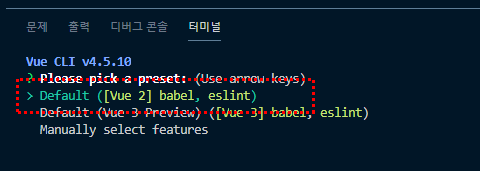
<br /><br />

5. 설치가 완료되면 cd vue-todo, npm run serve 명령어를 확인할 수 있다<br />
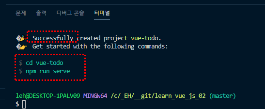
<br /><br />

6. vue-todo 로컬서버를 실행시킨다
```
// 1. vue-todo 폴더로 이동
cd vue-todo

// 로컬서버 실행
npm run serve
```
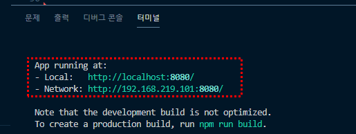
<br /><br />

### 1.2. 프로젝트 소개 및 컴포넌트 설계 방법
- 컴포넌트를 작게 분리했을 때(영역별로 컴포넌트 분리) 재사용성이 높아진다<br />
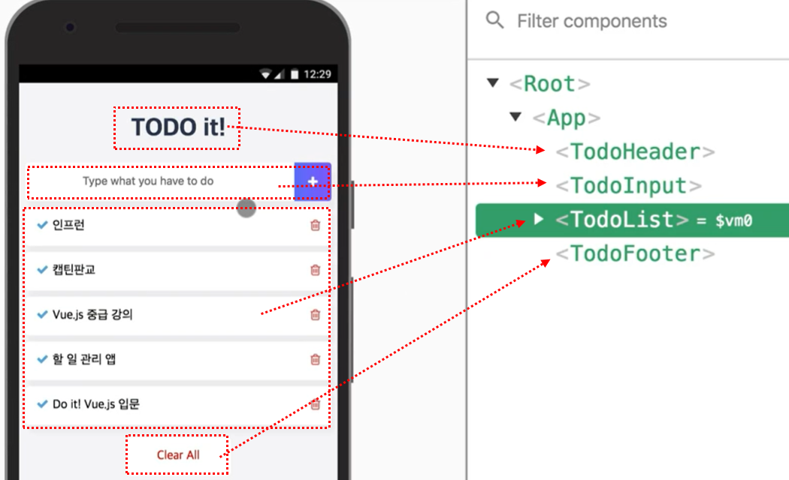

<br /><br /><br />

## 2. Todo App - 프로젝트 구현
### 2.1. 컴포넌트 생성 및 등록하기
1. **src/components 에 컴포넌트를 등록**한다
2. components 폴더에 컴포넌트 .vue 파일을 생성하고 <br />
vue 자동완성 기능을 통해 기본 구성(template, script, style)을 맞춰준다<br />
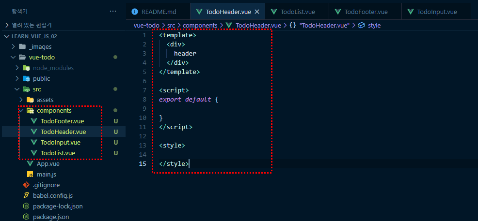<br />

3. src/App.vue 파일에 생성한 컴포넌트 파일을 script 영역에 연결(import)해준다
```HTML
<template>
  <div id="app">
    <TodoHeader></TodoHeader>
    <TodoInput></TodoInput>
    <TodoList></TodoList>
    <TodoFooter></TodoFooter>
  </div>
</template>

<script>
// 컴포넌트 등록
import TodoHeader from './components/TodoHeader.vue'
import TodoInput from './components/TodoInput.vue'
import TodoList from './components/TodoList.vue'
import TodoFooter from './components/TodoFooter.vue'

export default {
  components: {
    // 컴포넌트 태그명 : 컴포넌트 내용
    'TodoHeader' : TodoHeader,
    'TodoInput' : TodoInput,
    'TodoList' : TodoList,
    'TodoFooter' : TodoFooter,
  }
}
</script>

<style>
</style>
```

4. 브라우저에서 확인해보면 컴포넌트별로 등록된 것을 확인할 수 있다<br />
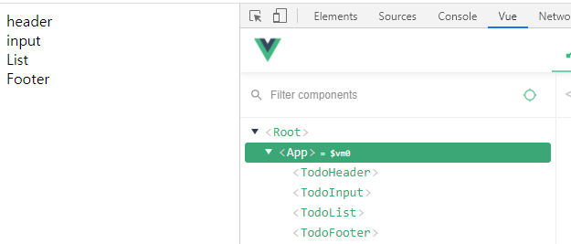<br />

<br />

### 2.2. 파비콘, 아이콘, 폰트, 반응형 태그 설정하기
- ./public/index.html 에 적용한다
	1. 반응형 메타태그 외에 아래 메타태그 3종이 적용되어 있는 지 확인
		- 뷰포트 < meta name="viewport" content="width=device-width,initial-scale=1.0" >
		```HTML
		<meta charset="utf-8">
		<meta http-equiv="X-UA-Compatible" content="IE=edge">
		<meta name="viewport" content="width=device-width,initial-scale=1.0">
		```

<br />

### 2.3. TodoHeader 컴포넌트 구현
1. TodoHeader.vue 파일에서 마크업을 한다
```HTML
<template>
  <header>
    <h1>TODO it!</h1>
  </header>
</template>
```
<br />

2. style 값을 적용한다
	- scoped : 뷰 싱글 파일 컴포넌트에서 지원하는 속성
		- 해당 컴포넌트 아래에서만 존재하는(유효한) style 적용<br />
		동일한 곳, 클래스명, 아이디명 이라 하더라도 해당 컴포넌트에 포함되어 있지 않으면 상속되지 않는다.
	```CSS
	<style scoped>
	  h1 {
      color: #2f3b52;
      font-weight: 900;
      margin: 2.5rem 0 1.5rem;
    }
	</style>
	```
<br />

### 2.4. TodoInput 컴포넌트의 할 일 저장 기능 구현
1. 인풋박스에 입력된 내용을 받기 위해 v-model 디렉티브를 이용한다
2. v-model을 사용하기 위해 script 에 data 속성 newTodoItem을 추가하여 인풋박스 v-mdodel과 연결한다
	```HTML
	<template>
		<div>
			<input type="text" v-model="newTodoItem">
		</div>
	</template>
	```
	```JAVASCRIPT
	export default {
		data: function() {
			return {
				newTodoItem: "",
			}
		}
	}
	```
	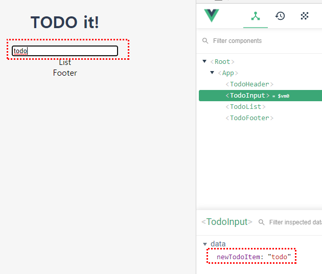<br />
	<br />

3. add 버튼을 만들고 addTodo 이벤트를 연결한다.<br />
연결된 이벤트를 script - methods 속성에 addTodo 함수를 만든다
	```HTML
	<template>
		<div>
			<input type="text" v-model="newTodoItem">
			<button v-on:click="addTodo">add</button>
		</div>
	</template>
	```
	```JAVASCRIPT
	export default {
	  data: function() {
      return {
        newTodoItem: "",
      }
    },
    methods: {
      addTodo: function() {
        
      }
    }
	}
	```

4. 버튼을 클릭할 때마다 인풋박스에 입력된 내용이 log에 보이게 적용
	```JAVASCRIPT
	export default {
	  data: function() {
	    return {
	      newTodoItem: "",
	    }
	  },
	  methods: {
	    addTodo: function() {
	      console.log(this.newTodoItem);
	    }
	  }
	}
	```
	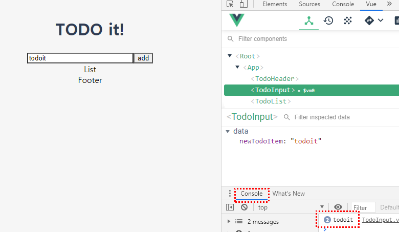<br />
	<br />

5. 인풋박스 입력 후 add 를 클릭한 후에 localStarage(로컬스토리지)에 저장을 한다
	- localStorage.setItem(keyName, keyValue)
	- localStorage에 keyName, keyValue 값을 전달하여 추가하거나 업데이트
	```JAVASCRIPT
	export default {
	  data: function() {
	    return {
	      newTodoItem: "",
	    }
	  },
	  methods: {
	    addTodo: function() {
	      // 저장하는 로직
	      localStorage.setItem();
	    }
	  }
	}
	```

6. setItem에 keyName 과 keyValue 값을 this.newTodoItem 으로 동일하게 적용한다
	```JAVASCRIPT
	export default {
	  data: function() {
	    return {
	      newTodoItem: "",
	    }
	  },
	  methods: {
	    addTodo: function() {
	      // 저장하는 로직
	      localStorage.setItem(this.newTodoItem, this.newTodoItem);
	    }
	  }
	}
	```

7. localStorage(로컬스토리지)에 .setItem() 을 이용해 인풋박스에 입력된 정보를 저장하면 브라우저 개발자도구에서 **Application 패널 탭 -> Storage -> Local Storage 에서 입력된 정보를확인**할 수 있다<br />
	<br />
	<br />

8. add 버튼을 누른 후 인풋박스를 초기화시킨다
	```JAVASCRIPT
	export default {
	  data: function() {
	    return {
	      newTodoItem: "",
	    }
	  },
	  methods: {
	    addTodo: function() {
	      // 저장하는 로직
	      localStorage.setItem(this.newTodoItem, this.newTodoItem);
	      this.newTodoItem = ""
	    }
	  }
	}
	```
	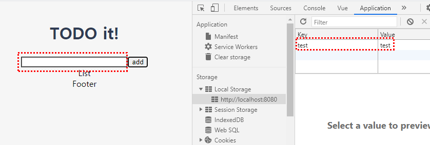<br />
	<br />

### 2.5. TodoInput 컴포넌트 코드 정리 및 UI 스타일링
1. 인풋박스 입력 -> add 버튼을 클릭하면 인풋박스 초기화 시켜주는 코드를 함수로 생성한다<br />
	- clearInput 메서드 함수를 만들었다
	```JAVASCRIPT
	export default {
		data: function() {
			return {
				newTodoItem: "",
			}
		},
		methods: {
			addTodo: function() {
				localStorage.setItem(this.newTodoItem, this.newTodoItem);
			},
			clearInput: function() {
				this.newTodoItem = ""
			}
		}
	}
	```

2. addTodo 메서드 함수에서 this 를 이용하여 clearInput 함수를 실행시켜준다<br />
그러면 아까와 동일한 기능을 적용하게 된다
	```JAVASCRIPT
	export default {
		data: function() {
			return {
				newTodoItem: "",
			}
		},
		methods: {
			addTodo: function() {
				localStorage.setItem(this.newTodoItem, this.newTodoItem);
				this.clearInput();
			},
			clearInput: function() {
				this.newTodoItem = ""
			}
		}
	}
	```

3. UI 스타일링 작업(css 작업)
	- button 에 적용한 v-on 디렉티브를 span에 추가하면 button과 동일한 기능이 적용된다
	- **style** 에 **scoped** 를 적용하여 **해당 컴포넌트 .vue 파일에서만 적용**되게 한다
	```HTML
	<template>
		<div class="inputBox shadow">
			<input type="text" v-model="newTodoItem">
			<!-- <button v-on:click="addTodo">add</button> -->
			<span class="addContainer" v-on:click="addTodo">
				<i class="fas fa-plus addBtn"></i>
			</span>
		</div>
	</template>
	```
	```JAVASCRIPT
	export default {
		data: function() {
			return {
				newTodoItem: "",
			}
		},
		methods: {
			addTodo: function() {
				localStorage.setItem(this.newTodoItem, this.newTodoItem);
				this.clearInput();
			},
			clearInput: function() {
				this.newTodoItem = ""
			}
		}
	}
	```
	```CSS
	<style scoped>
	input:focus {
		outline: none;
	}
	.inputBox {
		background: #fff;
		height: 50px;
		line-height: 50px;
		border-radius: 5px;
	}
	.inputBox input {
		border-style: none;
		font-size: .9rem;
	}
	.addContainer {
		float: right;
		background: linear-gradient(to right, #6478fb, #8763fb);
		display: block;
		width: 3rem;
		border-radius: 0 5px 5px 0;
	}
	.addBtn {
		color: #fff;
		vertical-align: middle;
	}
	</style>
	```

4. 수정한 마크업과 css 적용이 되었고 기능도 제대로 작동한 것을 확인할 수 있다
	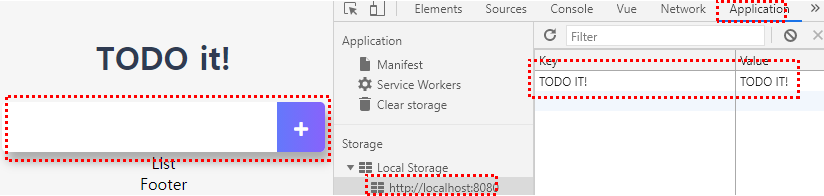<br />
	<br />

5. **인풋박스 입력 후, 엔터를 누르면 엔터버튼을 클릭한 것과 동일한 효과**를 주려고 한다.
	- 인풋박스에 v-on:keyup.enter 이벤트 기능을 추가하고 addTodo 메서드 함수를 연결해준다
	```HTML
	<template>
	  <div class="inputBox shadow">
	    <input type="text" v-model="newTodoItem" v-on:keyup.enter="addTodo">
	    <!-- <button v-on:click="addTodo">add</button> -->
	    <span class="addContainer" v-on:click="addTodo">
	      <i class="fas fa-plus addBtn"></i>
	    </span>
	  </div>
	</template>
	```

<br />

### 2.6. TodoList 컴포넌트의 할 일 목표 표시 기능 구현
1. **created 뷰 라이프사이클 적용**
	- 뷰 라이프사이클은 created, Mounted, updated, destoryed 되는 주요 4개의 라이프사이클이 있고
	beforeUpdate, befoCreate 등 총 8개~10개정도 있다
	- **created : 인스턴스가 생성되자마자 호출되는 라이프사이클 훅**을 말한다
	- 훅 : 훅은 생성되는 시점에 로직이 실행된다는 의미.
	```JAVASCRIPT
	export default {
		created: function() {
			
		}
	}
	```
<br />

2. created 뷰 라이프사이클에 log를 적용해본다
	- 인스턴스가 생성되지마자 log 되는 것을 확인할 수 있다
	```JAVASCRIPT
	export default {
		created: function() {
			console.log('created');
		}
	}
	```
	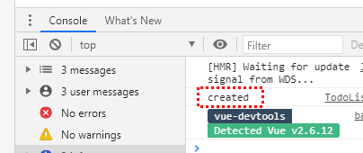<br />
	<br />

3. created 라이프사이클에서 로컬스토리지에 저장된 것을 log로 확인한다
	- log에 localStorage.key(i) 정보를 가져오게 되어 있는데 브라우저에 접속하면 로컬스토리지에 저장된 정보들을 보여준다
	- loglevel:webpack-dev-server는 웹팩 데브 서버로 프로포타이핑을 하기 때문에 자동으로 주입되는 것, 신경쓰지 않아도 된다
	```JAVASCRIPT
	export default {
	  data: function() {
	    return {
	      todoItems: []
	    }
	  },
	  created: function() {
	    if ( localStorage.length > 0 ) {
	      for(var i=0; i < localStorage.length; i++) {
	        console.log(localStorage.key(i));
	      }
	    }
	  }
	}
	```
	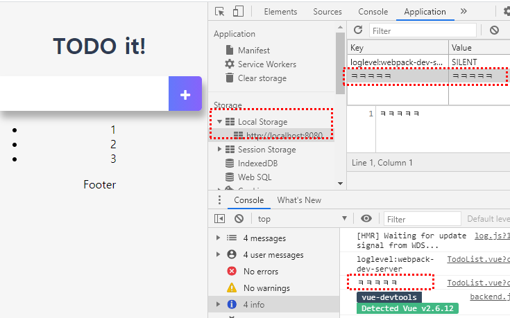<br />
	<br />

4. created 라이프사이클에서 로컬스토리지에 저장된 것을 TodoList로 가져온다
	- 로컬스토리지에서 가져오는 정보를 담을 data 속성에서 todoItems 빈 배열 객체를 만든다
	- created 라이프사이클 훅에서 로컬스토리지의 정보를 todoItems에 적용한다(=넣어준다)(push)
	```JAVASCRIPT
	export default {
	  data: function() {
	    return {
	      todoItems: []
	    }
	  },
	  created: function() {
	    if ( localStorage.length > 0 ) {
	      for(var i=0; i < localStorage.length; i++) {
	        this.todoItems.push(localStorage.key(i));
	      }
	    }
	  }
	}
	```
<br />

5. 뷰 개발자 도구에서 보면 가져온 todoItems 정보들을 TodoList 컴포넌트에 담겨있는 것을 확인할 수 있다
	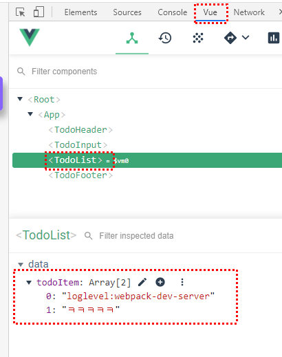<br />
	<br />

6. loglevel:webpack-dev-server 을 제거하는 코드를 적용한다.<br />
	- for문 안에 if으로 조건을 걸어준다.
	- 조건을 준 후에 브라우저에서 확인해보면 뷰 컴포넌트에서 webpack-dev-server 관련 정보가 제거된 것을 확인할 수 있다
	```JAVASCRIPT
	export default {
	  data: function() {
	    return {
	      todoItems: []
	    }
	  },
	  created: function() {
	    // 로컬스토리지에 저장된 것을 가져온다
	    if ( localStorage.length > 0 ) {
	      for(var i=0; i < localStorage.length; i++) {
	        if(localStorage.key(i) !== 'loglevel:webpack-dev-server') {
	          this.todoItems.push(localStorage.key(i));
	        }
	      }
	    }
	  }
	}
	```
	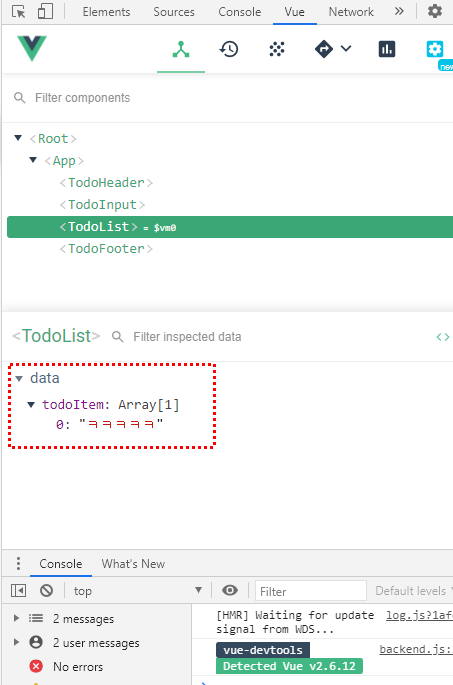<br />
	<br />

7. data - todoItems 에 저장된 정보를 화면에 출력해준다
	- 리스트(li) 영역에 v-for문을 사용한다
	- v-for="todoItem in todoItems"<br />
	(data todoItems 기준)
	- **v-bind:key를 입력**해준다<br />
	key 가 중복되지 않는 선에서 key가 유일하기 때문에 **v-for문의 성능을 가속하시키는 장점**이 있다
	- 데이터바인딩 문법으로 {{ todoItem }} 입력하여 화면에 출력시킨다
	```HTML
	<template>
	  <div>
	    <ul>
	      <li v-for="todoItem in todoItems" v-bind:key="todoItem">
	        {{ todoItem }}
        </li>
	    </ul>
	  </div>
	</template>
	```
	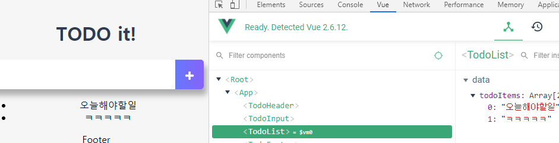<br />
	<br />

### 2.7. TodoList 컴포넌트 UI 스타일링
1. UI 스타일링 관련 CSS 적용
	```CSS
	<style>
	ul {
	  list-style-type: none;
	  padding-left: 0px;
	  margin-top: 0;
	  text-align: left;
	}
	li {
	  display: flex;
	  min-height: 50px;
	  height: 50px;
	  line-height: 50px;
	  margin: .5rem 0;
	  padding: 0 .9rem;
	  background: #fff;
	  border-radius: 5px;
	}
	.removeBtn {
	  margin-left: auto;
	  color: #de4343;
	}
	.checkBtn {
	  line-height: 45px;
	  color: #62acde;
	  margin-right: 5px;
	}
	.checkBtnCompleted {
	  color: #b3adad;
	}
	.textCompleted {
	  text-decoration: line-through;
	  color: #b3adad;
	}
	</style>
	```
<br />

2. 리스트(li)에 삭제 버튼을 추가한다
	```HTML
	<template>
		<div>
			<ul>
				<li v-for="todoItem in todoItems" v-bind:key="todoItem" class="shadow">
					{{ todoItem }}
					<span class="removeBtn">
						<i class="fas fa-trash-alt"></i>
					</span>
				</li>
			</ul>
		</div>
	</template>
	```
	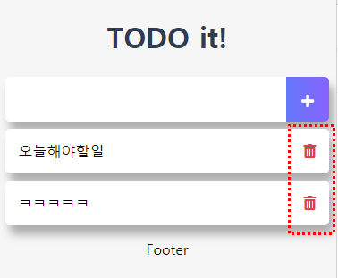<br />
	<br />

3. 추가한 버튼에 v-on:click 이벤트를 연결하고<br />
연결한 이벤트의 메서드 함수도 추가한다
	```HTML
	<template>
	  <div>
	    <ul>
	      <li v-for="todoItem in todoItems" v-bind:key="todoItem" class="shadow">
	        {{ todoItem }}
	        <span class="removeBtn" v-on:click="removeTodo">
	          <i class="fas fa-trash-alt"></i>
	        </span>
	      </li>
	    </ul>
	  </div>
	</template>
	```
	```JAVASCRIPT
	export default {
	  data: function() {
	    return {
	      todoItems: []
	    }
	  },
	  methods: {
	    removeTodo: function() {
			
	    }
	  },
	  created: function() {
	    if ( localStorage.length > 0 ) {
	      for(var i=0; i < localStorage.length; i++) {
	        if(localStorage.key(i) !== 'loglevel:webpack-dev-server') {
	          this.todoItems.push(localStorage.key(i));
	        }
	        // console.log(localStorage.key(i));
	      }
	    }
	  }
	}
	```
	<br />

### 2.8. TodoList 컴포넌트 할 일 삭제 기능 구현
1. removeBtn을 클릭했을 때 해당 리스트(li)를 삭제하려고 한다
2. 뷰의 v-for문은 내장하는 index 값이 있다.<br />
v-for문에서 나오는 값이 몇 개이던 가에 index. 순서를 지정해주는 것이 있다.
3. v-for 문에서 todoItem과 index 값을 받고<br />
그 값을 메서드에 넘길 수 있다.<br /> 
즉, removeBtn 메서드 함수에서 todoItem과 index 값을 받아올 수 있다
	```HTML
	<template>
	  <div>
	    <ul>
	      <li v-for="(todoItem, index) in todoItems" v-bind:key="todoItem" class="shadow">
	        {{ todoItem }}
	        <span class="removeBtn" v-on:click="removeTodo(todoItem, index)">
	          <i class="fas fa-trash-alt"></i>
	        </span>
	      </li>
	    </ul>
	  </div>
	</template>
	```
<br />

4. 받아온 값을 removeBtn 메서드 함수에도 적용하고 log로 확인해본다
	```JAVASCRIPT
	export default {
	  methods: {
	    removeTodo: function(todoItem, index) {
	      console.log(todoItem, index);
	    }
	  },
	}
	```
	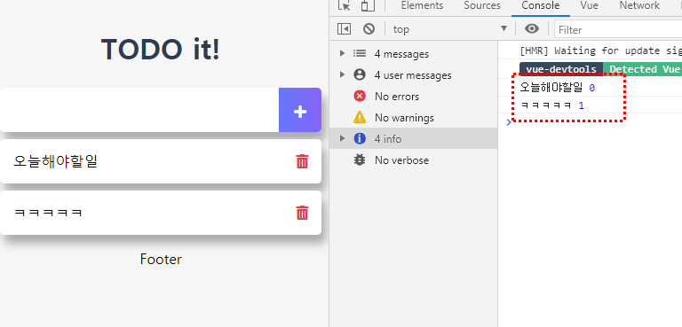<br />
	<br />

5. removeBtn을 클릭했을 때 받아온 todoItem과 Index를 이용해 삭제 기능을 구현한다
	1. **로컬스토리지에서 removeItem() API를 이용하여 해당 아이템을 삭제**한다
		- TodoInput.vue 에서 로컬스토리지에 정보를 추가할 때, Key와 Value 값을 this.newTodoItem 로 
		동일하게 적용하였기 때문에 받아온 todoItem을 removeItem API에 넣어준다
		- 버튼을 클릭하면 로컬스토리지에서 해당 부분이 삭제되는 것을 확인할 수 있다		
	```
	localStorage.removeItem(todoItem);
	```
	2. 로컬스토리지에서 삭제 기능을 구현한 후, (화면 영역) 리스트(li) 영역 삭제 기능도 구현한다
		- 로컬스토리지 영역과 화면 영역을 별개라고 생각하면 된다
		- 화면 영역은 스크립트로 삭제 기능을 구현해야 한다

	3. **리스트(li) 영역은 splice() 를 이용해 삭제**한다
		- splice() 는 기존의 배열을 변경하여 지워준다 ( => slice는 기존 배열을 둔 상태에서 지워준다)
		```
		this.todoItems.splice(index, 1);
		```
	4. 따라서, removeBtn 메서드 함수를 아래와 같이 적용한다
	```JAVASCRIPT
	methods: {
	  removeTodo: function(todoItem, index) {
	    localStorage.removeItem(todoItem);
	    this.todoItems.splice(index, 1);
	  }
	},
	```
<br />

### 2.9. TodoList 컴포넌트의 할 일 완료 기능 구현
체크 박스를 추가하고 체크 했을 때의 효과도 적용하려고 한다( = 토글 컴포넌트 기능 구현)<br />
<br />

1. 체크버튼을 추가하고 toggleComplate 메서드 클릭이벤트를 연결한다<br />
class="checkBtn fas fa-check" v-on:click="toggleComplate"
	```HTML
	<template>
	  <div>
	    <ul>
	      <li v-for="(todoItem, index) in todoItems" v-bind:key="todoItem" class="shadow">
	        <i class="checkBtn fas fa-check" v-on:click="toggleComplate"></i>
	        {{ todoItem }}
	        <span class="removeBtn" v-on:click="removeTodo(todoItem, index)">
	          <i class="fas fa-trash-alt"></i>
	        </span>
	      </li>
	    </ul>
	  </div>
	</template>
	```
	```JAVASCRIPT
	export default {
	  data: function() {
	  },
	  methods: {
	    toggleComplate: function() {
			
	    }
	  },
	}
	```
<br />

2. [ TodoInput.vue ] setItem에서 key, value를 구분하지 않고 넣은 코드를 수정한다
	- 변수 obj를 만들고 obj 안에<br />
	텍스트 값과 체크를 했는 지? 안했는 지의 블린 값을 obj 적용한다
	- 적용한 obj를 setItem 의 value 값에 적용한다
	- stringify : 자바스크립트 obj(객체)를 스트링으로 변환해주는 API<br />
	스트링으로 변환을 해야 로컬스토리지에 value 값이 적용된다.
	```JAVASCRIPT
	methods: {
	  addTodo: function() {
	    var obj = {
	      completed: false,
	      item: this.newTodoItem,
	    };
	    localStorage.setItem(this.newTodoItem, JSON.stringify(obj));
	    this.clearInput();
	  },
	  clearInput: function() {
	    this.newTodoItem = ""
	  }
	}
	```
	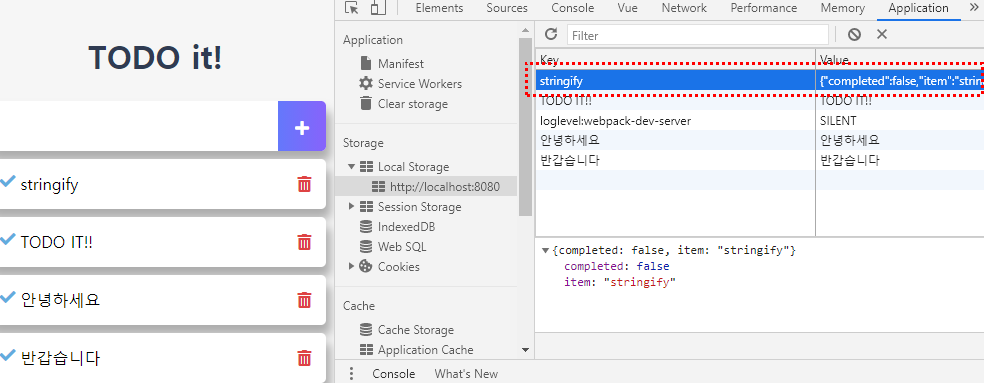<br />
	<br />

3. [ TodoInput.vue ] input에 값이 있을 경우에만 addTodo 메서드 함수가 실행되게 코드를 보완한다.
	- if문으로 조건을 적용해준다
	- 조건 : this.newTodoItem !== '' <br />
	(!== 는 false를 의미한다. '' 값이 없을 때의 반대는 값이 있을 떄)
	```JAVASCRIPT
	methods: {
	  addTodo: function() {
	    if(this.newTodoItem !== '') {
	      var obj = {
	        completed: false,
	        item: this.newTodoItem,
	      };
	      // console.log(this.newTodoItem);
	      // 저장하는 로직
	      localStorage.setItem(this.newTodoItem, JSON.stringify(obj));
	      this.clearInput();
	    }
	  },
	}
	```
<br />

4. [ TodoList.vue ] TodoInput.vue 파일에서 로컬스토리지에 저장할 때의 value 값을 수정하였기 때문에 TodoList.vue 파일에서 코드를 수정해줘야 한다.
	- 기존 코드 주석 처리 :<br />
	this.todoItems.push(localStorage.key(i));
	- localStorage.key(i) 값을 getItem 으로 받아오고 받아온 정보를 log로 출력한다
	- key 값을 getItem 으로 받아와서 log창에 value 값이 출력된 것을 확인할 수 있다
	- TodoInput.vue 파일에서 setItem() 불러올 때 stringify() 문자열로 변환했기 때문에 동일하게 문자열(string)로 값을 받아오게 된다.<br />
	console.log(typeof localStorage.getItem(localStorage.key(i)));
	```JAVASCRIPT
	created: function() {
	  if ( localStorage.length > 0 ) {
	    for(var i=0; i < localStorage.length; i++) {
	      if(localStorage.key(i) !== 'loglevel:webpack-dev-server') {
	        // this.todoItems.push(localStorage.key(i));

	        console.log(localStorage.getItem(localStorage.key(i)));
	      }
	    }
	  }
	}
	```
	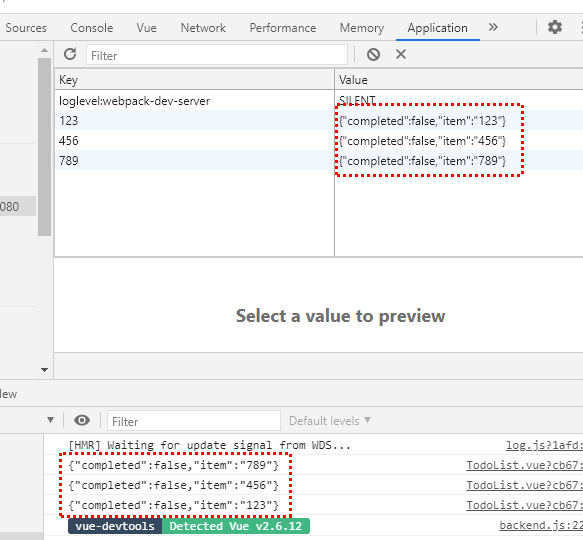<br />
	<br />

5. 스트링(문자열)으로 받아온 것을 오브젝트(객체)로 변화시킨다
	- parse() 을 사용하여 문자열 -> 객체로 변환한다
	```JAVASCRIPT
	created: function() {
	  if ( localStorage.length > 0 ) {
	    for(var i=0; i < localStorage.length; i++) {
	      if(localStorage.key(i) !== 'loglevel:webpack-dev-server') {
	        // this.todoItems.push(localStorage.key(i));

	        console.log(JSON.parse(localStorage.getItem(localStorage.key(i))));
	      }
	    }
	  }
	}
	```
	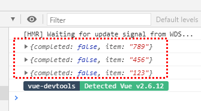<br />
	<br />

6. 불러온 정보를 화면에 출력한다
	```JAVASCRIPT
	created: function() {
	  if ( localStorage.length > 0 ) {
	    for(var i=0; i < localStorage.length; i++) {
	      if(localStorage.key(i) !== 'loglevel:webpack-dev-server') {
	        this.todoItems.push(JSON.parse(localStorage.getItem(localStorage.key(i))));
	      }
	    }
	  }
	}
	```
	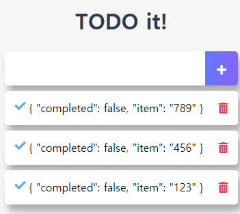<br />
	<br />

7. 객체의 정보 중 item 값만 보이게 수정을 한다
	```HTML
	<template>
	  <div>
	    <ul>
	      <li v-for="(todoItem, index) in todoItems" v-bind:key="todoItem" class="shadow">
	        <i class="checkBtn fas fa-check" v-on:click="toggleComplate"></i>
	        {{ todoItem.item }}
	        <span class="removeBtn" v-on:click="removeTodo(todoItem, index)">
	          <i class="fas fa-trash-alt"></i>
	        </span>
	      </li>
	    </ul>
	  </div>
	</template>
	```
	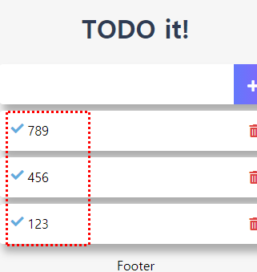<br />
	<br />

8. 수정한 {{ todoItem.item }} 부분을 span으로 감싸고 css를 적용해준다
	```HTML
	<template>
	  <div>
	    <ul>
	      <li v-for="(todoItem, index) in todoItems" v-bind:key="todoItem" class="shadow">
	        <i class="checkBtn fas fa-check" v-on:click="toggleComplate"></i>
	        <span class="textCompleted">{{ todoItem.item }}</span>
	        <span class="removeBtn" v-on:click="removeTodo(todoItem, index)">
	          <i class="fas fa-trash-alt"></i>
	        </span>
	      </li>
	    </ul>
	  </div>
	</template>
	```
	<br />

9. i.checkBtn 과 span.textCompleted 에 v-bind로 클래스 조건을 걸어준다<br />
	- checkBtn 경우, completed 값이 true면 checkBtnCompleted 클래스가 추가 된다
	- span 경우, completed 값이 true면 todoItems.completed 클래스가 추가 된다
	```HTML
	<template>
	  <div>
	    <ul>
	      <li v-for="(todoItem, index) in todoItems" v-bind:key="todoItem" class="shadow">
	        <i class="checkBtn fas fa-check" v-bind:class="{checkBtnCompleted: todoItem.completed}" v-on:click="toggleComplate"></i>
	        <span v-bind:class="{textCompleted: todoItem.completed}">{{ todoItem.item }}</span>
	        <span class="removeBtn" v-on:click="removeTodo(todoItem, index)">
	          <i class="fas fa-trash-alt"></i>
	        </span>
	      </li>
	    </ul>
	  </div>
	</template>
	```
	<br />

10. completed 값을 true 또는 false 로 변경하기 위해 checkBtn 클릭 시 todoItem과 Index 정보를 받아온다
	- log 창에서 클릭한 checkBtn의 todoItem 정보를 확인할 수 있다
	```HTML
	<template>
	  <div>
	    <ul>
	      <li v-for="(todoItem, index) in todoItems" v-bind:key="todoItem" class="shadow">
	        <i class="checkBtn fas fa-check" 
	          v-bind:class="{checkBtnCompleted: todoItem.completed}" 
	          v-on:click="toggleComplate(todoItem, index)"></i>
	        <span v-bind:class="{textCompleted: todoItem.completed}">{{ todoItem.item }}</span>
	        <span class="removeBtn" v-on:click="removeTodo(todoItem, index)">
	          <i class="fas fa-trash-alt"></i>
	        </span>
	      </li>
	    </ul>
	  </div>
	</template>
	```
	```JAVASCRIPT
	methods: {
	  toggleComplate: function(todoItem, index) {
	    console.log(todoItem);
	  }
	},
	```
	<br />
	<br />

11. todoItem의 completed 값을 클릭할 때마다 바꿔준다
	- 로컬스토리지의 값은 변경되지 않는다.
	```JAVASCRIPT
	methods: {
	  toggleComplate: function(todoItem, index) {
	    todoItem.completed = !todoItem.completed;
	  }
	},
	```
	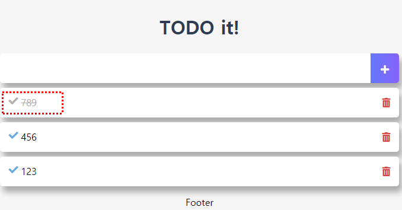<br />
	<br />

12. 로컬스토리지의 completed 값도 변경한다.<br />
로컬스토리지에서는 업데이트 해주는 API가 없기 때문에 삭제 후 추가해야 한다.
	```JAVASCRIPT
	methods: {
	  toggleComplate: function(todoItem, index) {
	    todoItem.completed = !todoItem.completed;
	
	    // 로컬스토리지의 데이터를 갱신
	    // 기존의 정보를 삭제한다 (로컬스토리지에서는 업데이트 해주는 기능이 없다)
	    localStorage.removeItem(todoItem.item);
	    localStorage.setItem(todoItem.item, JSON.stringify(todoItem));
	  }
	},
	```
	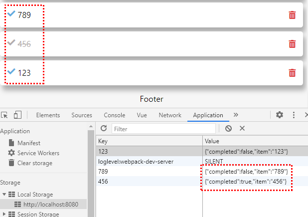<br />
	<br />

### 2.10. TodoFooter 컴포넌트 구현
Clear All 버튼을 생성하여 클릭했을 때 Todo List 삭제를 하려고 한다<br />
<br />

1. 마크업/CSS 작업
	```HTML
	<template>
	  <div class="clearAllContainer">
	    <span class="clearAllBtn">Clear All</span>
	  </div>
	</template>
	```
	```CSS
	.clearAllContainer {
	  width: 8.5rem;
	  height: 50px;
	  line-height: 50px;
	  background-color: #fff;
	  border-radius: 5px;
	  margin: 0 auto;
	}
	.clearAllBtn {
	  color: #e20302;
	  display: block;
	}
	```
<br />

2. clearAll 버튼에 v-on:click 이벤트를 적용하여 clearTodo 메서드를 연결한다
	```HTML
	<template>
	  <div class="clearAllContainer">
	    <span class="clearAllBtn" v-on:click="clearTodo">Clear All</span>
	  </div>
	</template>
	```
	```JAVASCRIPT
	export default {
	  methods: {
	    clearTodo: function() {
			
	    }
	  }
	}
	```
	<br />

3. 로컬 스토리지의 내역을 삭제한다 <br />
clear() 로 로컬 스토리지의 삭제를 한다
	```JAVASCRIPT
	export default {
	  methods: {
	    clearTodo: function() {
	      localStorage.clear();
	    }
	  }
	}
	```
<br /><br /><br />

## 3. Todo App - 애플리케이션 구조 개선하기
### 3.1. [리팩토링] 할 일 목록 표시 기능
1. 애플리케이션 구조를 개선한다 (아래 이미지 참고)<br />
	- App 컴포넌트를 Container로 생각하면 된다
	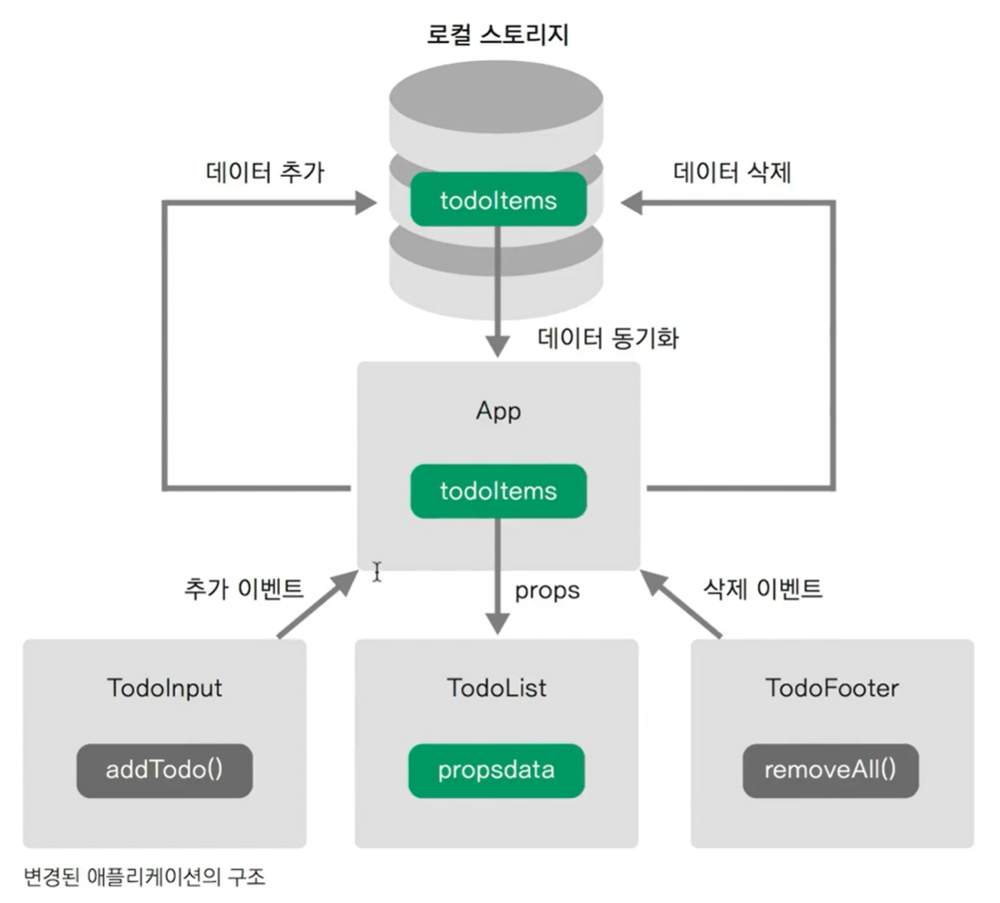<br />
	<br />

2. 각각의 컴포넌트에서 했던 로직들을 App.vue 파일에 끌어온다

3. 리스트를 먼저 뿌려보려고 한다. <br />
[ TodoList.vue ] 에서 created: function {} 코드를 [ App.vue ]에 적용한다
	```JAVASCRIPT
	// App.vue
	export default {
	  created: function() {
	    if ( localStorage.length > 0 ) {
	      for(var i=0; i < localStorage.length; i++) {
	        if(localStorage.key(i) !== 'loglevel:webpack-dev-server') {
	          this.todoItems.push(JSON.parse(localStorage.getItem(localStorage.key(i))));
	        }
	      }
	    }
	  },
	  components: {
	    // 컴포넌트 태그명 : 컴포넌트 내용
	    'TodoHeader' : TodoHeader,
	    'TodoInput' : TodoInput,
	    'TodoList' : TodoList,
	    'TodoFooter' : TodoFooter,
	  }
	}
	```
<br />

4. created 코드를 App.vue 로 적용한 후에<br />
todoItems 정보를 담을 data 속성을 App.vue 파일에 적용을 하고
TodoList.vue 에서는 data - todoItems 속성을 삭제한다.
	```JAVASCRIPT
	export default {
	  data: function() {
	    return {
	      todoItems: [],
	    }
	  },
	  created: function() {
	    if ( localStorage.length > 0 ) {
	      for(var i=0; i < localStorage.length; i++) {
	        if(localStorage.key(i) !== 'loglevel:webpack-dev-server') {
	          this.todoItems.push(JSON.parse(localStorage.getItem(localStorage.key(i))));
	        }
	      }
	    }
	  },
	  components: {
	    // 컴포넌트 태그명 : 컴포넌트 내용
	    'TodoHeader' : TodoHeader,
	    'TodoInput' : TodoInput,
	    'TodoList' : TodoList,
	    'TodoFooter' : TodoFooter,
	  }
	}
	```
<br />

5. [ App.vue ] 에 todoItems 정보가 저장이 된다.<br />
저장된 정보를 TodoList에 넘겨줘야 한다 (props)
	```HTML
	// App.vue
	<TodoList v-bind:내려보낼 프롭스 속성이름="현재 위치의 컴포넌트 데이터속성"></TodoList>
	```
따라서 위의 규칙의 맞게 TodoList v-bind 연결한다<br />
내려보낼 프롭스 속성이름을 propsdata 라고 지정한다
	```HTML
	<TodoList v-bind:propsdata="todoItems"></TodoList>
	```
<br />

6. [ App.vue ] 에서 프롭스 이름을 설정한 후,
[ TodoList.vue ]에서 프롭스 정보를 전달 받아야 하기 때문에
해당 파일에서 프롭스 정보를 적용한다
	```JAVASCRIPT
	// TodoList.vue
	export default {
	  props: ['propsdata'],
	  methods: {
	    removeTodo: function(todoItem, index) {
	      localStorage.removeItem(todoItem);
	      this.todoItems.splice(index, 1);
	    },
	    toggleComplate: function(todoItem) {
	      todoItem.completed = !todoItem.completed;
	      localStorage.removeItem(todoItem.item);
	      localStorage.setItem(todoItem.item, JSON.stringify(todoItem));
	    }
	  },
	}
	```
<br />

7. propsdata 를 전달 받았기 때문에 TodoList.vue에서 v-for문을 수정한다
	- v-for문에서 todoItems -> propsdata
	```HTML
	<template>
	  <div>
	    <ul>
	      <li v-for="(todoItem, index) in propsdata" v-bind:key="todoItem.item" class="shadow">
	        <i class="checkBtn fas fa-check" 
	          v-bind:class="{checkBtnCompleted: todoItem.completed}" 
	          v-on:click="toggleComplate(todoItem)"></i>
	        <span v-bind:class="{textCompleted: todoItem.completed}">{{ todoItem.item }}</span>
	        <span class="removeBtn" v-on:click="removeTodo(todoItem, index)">
	          <i class="fas fa-trash-alt"></i>
	        </span>
	      </li>
	    </ul>
	  </div>
	</template>
	```
<br />

8. 여기까지 수정 한 후, 브라우저에서 확인을 해보면 아래와 같이 제대로 동작하는 것을 확인할 수 있다.
	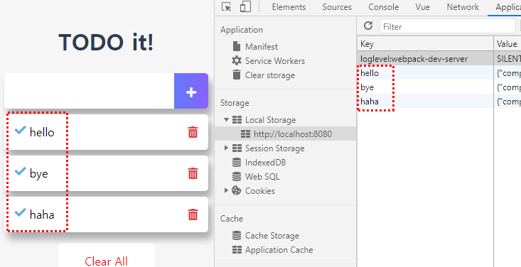<br />
	<br />

### 3.2. 할 일 추가 기능
TodoInput 에서 add 한 기능과 todoItems 를 연동시키려고 한다.<br />
<br />

1. 현재 TodoInput.vue 에서 코드를 확인해보면
	- add 버튼을 클릭할 때, newTodoItem 을 이용하여 추가하고 있다.
	- 다시 말하면, add 할 때 todoItems에 추가하는 기능을 구현시켜주면 된다.
<br />

2. [ App.vue ] TodoInput 컴포넌트 태그에 이벤트 발생을 적용시킨다.
	```HTML
	<TodoInput v-on:하위 컴포넌트에서 발생시킨 이벤트 이름="현재 컴포넌트의 메서드 이름"></TodoInput>
	```
<br />

3. [ App.vue ] TodoInput 컴포넌트 태그에 적용할 메서드를 추가한다
	- 추가 메서드 이름 : addOneItem
	```JAVASCRIPT
	methods: {
	  addOneItem: function() {
		
	  }
	},
	```
<br />

4. TodoInput.vue 에서 로컬스토리지로 정보를 추가하는 코드를 App.vue 에 적용한다.
	- localStorage.setItem(this.newTodoItem, JSON.stringify(obj));
	```JAVASCRIPT
	methods: {
	  addOneItem: function() {
	    var obj = {
	      completed: false,
	      item: this.newTodoItem,
	    };
	    localStorage.setItem(this.newTodoItem, JSON.stringify(obj));
	  }
	},
	```
<br />

5. [ TodoInput.vue ] newTodoItem 값을 상위로 전달하기 위해 이벤트 $emit을 이용한다
  - this.$emit('이벤트 이름', 인자1, 인자2, ..)
	```JAVASCRIPT
	methods: {
	  addTodo: function() {
	    if(this.newTodoItem !== '') {
	      this.$emit('addTodoItem', this.newTodoItem)
	      this.clearInput();
	    }
	  },
	}
	```
<br />

6. 전달받은 addTodoItem 이벤트 $emit 을 App.vue 파일에 연결한다
	- v-on:하위 컴포넌트에서 발생시킨 이벤트 이름="현재 컴포넌트의 메서드 이름"
	```HTML
	<template>
	  <div id="app">
	    <TodoHeader></TodoHeader>
	    <TodoInput v-on:addTodoItem="addOneItem"></TodoInput>
	    <TodoList v-bind:propsdata="todoItems"></TodoList>
	    <TodoFooter></TodoFooter>
	  </div>
	</template>
	```
<br />

7. 로직을 정리하면,
	1. TodoInput.vue 에서 addTodo 버튼이 실행되면
	2. 메서드 addTodo 동작이 작동한다
	3. this.$emit 에서 addTodoItem 이 작동을 하고 <br />
	this.newTodoItem 이 App.vue로 전달합니다
	4. App.vue 에서 addTodoItem 작동으로 addOneItem 이벤트가 실행됩니다
	
8. TodoInput.vue 에서 전달받은 this.newTodoITem 을 App.vue 파일에서 addOneItem: function(매개변수) 로 받아 실행시킨다
	- addOneItem에서 매개변수 todoItem 으로 받는다
	- this.newTodoItem ==> todoItem 으로 수정하여 <br />
	TodoInput.vue에서 전달받은 값을 적용한다
	```JAVASCRIPT
	methods: {
	  addOneItem: function(todoItem) {
	    var obj = {
	      completed: false,
	      item: todoItem,
	    };
	    localStorage.setItem(todoItem, JSON.stringify(obj));
	  }
	},
	```
<br />

9. App.vue 의 data - todoItems 속성 배열에도 추가되게 코드 보완
	- input 에 입력하면 자동으로 아래 리스트에 내용이 추가된다
	```JAVASCRIPT
	methods: {
	  addOneItem: function(todoItem) {
	    var obj = {
	      completed: false,
	      item: todoItem,
	    };
	    localStorage.setItem(todoItem, JSON.stringify(obj));
	    this.todoItems.push(obj);
	  }
	},
	```
	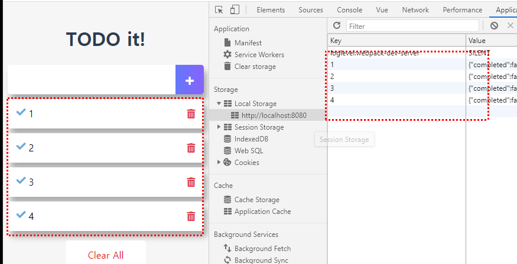<br />
	<br />

### 3.3. 할 일 삭제 기능
1. App.vue 에서 TodoList 컴포넌트에 v-on 디렉티브를 이용해 이벤트를 연결한다 
	- removeItem 이 발생했을 때, removeOneItem 이라는 메서드 함수가 실행
	```HTML
	// App.vue
	<template>
	  <div id="app">
	    <TodoHeader></TodoHeader>
	    <TodoInput v-on:addTodoItem="addOneItem"></TodoInput>
	    <TodoList v-bind:propsdata="todoItems" v-on:removeItem="removeOneItem"></TodoList>
	    <TodoFooter></TodoFooter>
	  </div>
	</template>
	```
	```JAVASCRIPT
	methods: {
	  removeOneItem: function() {
	  }
	},
	```
<br />

2. TodoList.vue 의 removeTodo 메서드 함수에서<br />
매개변수로 받은 todoItem, Index 를 $emit 으로 그대로 전달한다.
	```JAVASCRIPT
	methods: {
	  removeTodo: function(todoItem, index) {
	    this.$emit('removeItem', todoItem, index);
	  },
	},
	```
	<br />

3. TodoList.vue 에 있었던 로컬스토리지에 관한 코드는 App.vue 의 removeOneItem 메서드에 적용한다
	- localStorage.removeItem(todoItem.item) 경우 특정 key 값을 적용해야 remove 된다.
	```JAVASCRIPT
	methods: {
	  removeOneItem: function(todoItem, index) {
	    localStorage.removeItem(todoItem.item);
	    this.todoItems.splice(index, 1);
	  }
	}
	```
	<br />

### 3.4. 할 일 완료 기능
1. App.vue 의 메서드 toggleOneItem을 생성한다
	```JAVASCRIPT
	// App.vue
	toggleOneItem: function(todoItem, index) {
	}
	```
<br />

2. TodoList.vue 의 toggleComplate 메서드에 적용되었던 코드를<br />
App.vue 에 그대로 적용한다.
	```JAVASCRIPT
	// App.vue
	toggleOneItem: function(todoItem, index) {
	  todoItem.completed = !todoItem.completed;
	  localStorage.removeItem(todoItem.item);
	  localStorage.setItem(todoItem.item, JSON.stringify(todoItem));
	}
	```
	<br />

3. TodoList.vue 의 toggleComplate 메서드에 이벤트를 발생시킨다
	```JAVASCRIPT
	// TodoList.vue
	methods: {
	  toggleComplate: function(todoItem, index) {
	    this.$emit('toggleItem', todoItem, index);
	  }
	},
	```
<br />

4. App.vue 에서 TodoList 컴포넌트에 v-on 디렉티브로 이벤트를 연결한다
	```HTML
	<template>
	  <div id="app">
	    <TodoHeader></TodoHeader>
	    <TodoInput v-on:addTodoItem="addOneItem"></TodoInput>
	    <TodoList 
	      v-bind:propsdata="todoItems" 
	      v-on:removeItem="removeOneItem"
	      v-on:toggleItem="toggleOneItem"></TodoList>
	    <TodoFooter></TodoFooter>
	  </div>
	</template>
	```
	<br />

5. TodoList.vue 에서 전달받은 todoItem 의 값을 그대로 받아 바꿔주는 것은<br />
**옮지 않은 방법**으로 **App.vue에서 전달받은 todoItems 속성을 이용해 코드를 보완**한다.
	```JAVASCRIPT
	// 옮지 않은 방법
	methods: {
	  toggleOneItem: function(todoItem, index) {
	    todoItem.completed = !todoItem.completed;

	    // 로컬 스토리지의 데이터 갱싱
	    localStorage.removeItem(todoItem.item);
	    localStorage.setItem(todoItem.item, JSON.stringify(todoItem));
	  }
	},
	```
	```JAVASCRIPT
	// 보완
	methods: {
	  toggleOneItem: function(todoItem, index) {
	    this.todoItems[index].completed = !this.todoItems[index].completed

	    // 로컬 스토리지의 데이터 갱싱
	    localStorage.removeItem(todoItem.item);
	    localStorage.setItem(todoItem.item, JSON.stringify(todoItem));
	  }
	},
	```
<br />

### 3.5. 할 일 모두 삭제 기능
1. TodoFooter.vue 에 적용된 clearTodo 메서드에 적용한 코드를<br />
App.vue에서 clearAllItem 메서드 함수를 만들고 여기에 코드를 적용한다
	```JAVASCRIPT
	methods: {
	  clearAllItem: function() {
	    localStorage.clear();
	  }
	},
	```
<br />

2. TodoFooter.vue 의 clearTodo 메서드에 이벤트 $emit 을 적용한다
	```JAVASCRIPT
	methods: {
	  clearTodo: function() {
	    this.$emit('clearAll');
	  }
	}
	```
<br />

3. App.vue 의 TodoFooter 컴포넌트에 v-on 디렉티브를 이용해<br />
$emit 으로 만든  이벤트과 App.vue의 clearAllItem 이벤트를 연결한다.
	```HTML
	<TodoFooter v-on:clearAll="clearAllItem"></TodoFooter>
	```

4. 위 코드 대로 적용을 하면 로컬스토리지의 내역만 삭제되고
리스트에 적용된 todoItems 는 그대로 보여진다.

5. App.vue 의 clearTodo 메서드 함수 todoItems 삭제 코드도 적용한다
	- this.todoItems = []<br />
	todoItems를 빈 배열로 초기화 시키다는 뜻.
	```JAVASCRIPT
	methods: {
	  clearTodo: function() {
	    this.$emit('clearAll');
	    this.todoItems = [];
	  }
	}
	```

<br />

### 3.6. 리팩토링이 완료된 애플리케이션 정리
- 동일한 성격을 지닌 각각의 데이터를 App.vue에서 모아 <br />
App.vue 에 이벤트를 발생시키고 전달 받게 리팩토링
- App.vue 를 컨테이너의 역활로 사용하고<br />
TodoList, TodoHeader 등은 프레젠테이션 역활로 사용했다
- (마크업)UI적으로 표현한 TodoList, TodoInput, TodoHeader, TodoFooter
- 어떤 특정 동작을 위해서 데이터를 변경하려면 모든 이벤트들을 컨테이너 컴포넌트 App.vue 로 올린다
- 위와 같이 작업하는 방식이 일반적인 컴포넌트 설계 방식.
- **App.vue를 컨테이너 컴포넌트로 설계하는 것이 보완, 관리하는 부분에 있어서 로직이 깔끔(편리)**해진다<br />
(Vuex와 비슷한 설계 구조다)
- **뷰와 리액트의 다른 점은 트랜지션, 애니메이션 효과를 라이브러리로 표현**할 수 있다

<br /><br /><br />

## 4. 사용자 경험 개선
### 4.1. 모달 컴포넌트 등록
- 모달 컴포넌트 공식문서 :<br />
https://vuejs.org/v2/examples/modal.html
<br />

- **컴포넌트 모듈화 하는 방법**
	1. 공식문서 - 모달 관련 마크업 복사
	2. components 폴더에 common 폴더 생성 > Modal.vue 파일 생성
		- 공통으로 사용하는 파일은 common 폴더를 생성하여 관리<br />
		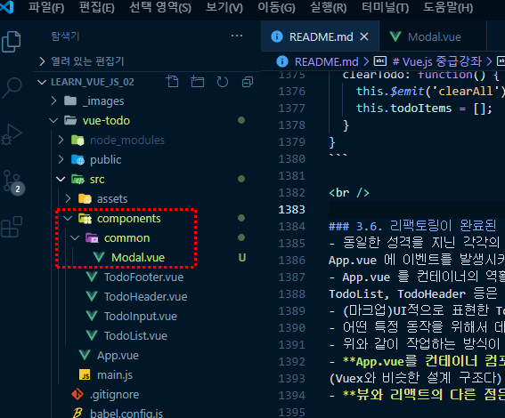<br />
		<br />

	3. vue 자동완성 기능 적용(template, script, style)<br />
	복사한 마크업은 template에 적용한다<br />
	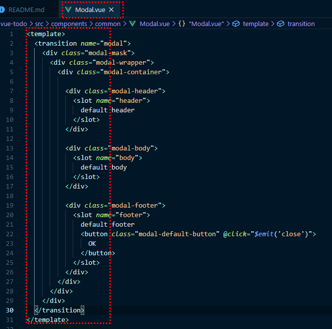<br />
	<br />

	4. 공식문서의 style 값도 복사 > 붙여넣기 한다

	5. TodoInput.vue 컴포넌트에 생성한 Modal.vue 컴포넌트를 하위 컴포넌트로 적용한다
		```JAVASCRIPT
		//TodoInput.vue
		import Modal from './common/Modal.vue';

		export default {
		  components: {
		    Modal: Modal,
		  }
		}
		```
	<br />

	6. 공식문서에서 #app 에 적용된 내용을 복사하여 TodoInput.vue에 적용한다<br />
	그리고 Modal로 등록한 컴포넌트 이름으로 수정한다<br />
	(공식문서 modal -> Modal)
		```HTML
		<template>
		  <div class="inputBox shadow">
		    <input type="text" v-model="newTodoItem" v-on:keyup.enter="addTodo">
		    <!-- <button v-on:click="addTodo">add</button> -->
		    <span class="addContainer" v-on:click="addTodo">
		      <i class="fas fa-plus addBtn"></i>
		    </span>
		    <Modal v-if="showModal" @close="showModal = false">
		      <h3 slot="header">custom header</h3>
		    </Modal>
		  </div>
		</template>
		```
	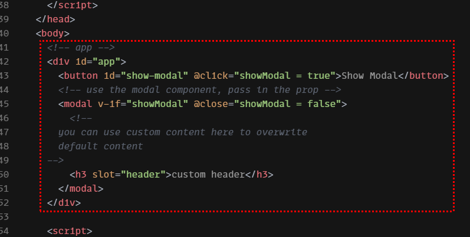<br />
	<br />

	7. 공식문서에서 #app 에 적용된 data 속성도 동일하게 TodoInput.vue에 적용한다
		```JAVASCRIPT
		import Modal from './common/Modal.vue';

		export default {
		  data: function() {
		    return {
		      showModal: false,
		    }
		  },
		  components: {
		    Modal: Modal,
		  }
		}
		```
		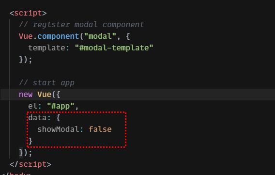<br />
		<br />

	8. **slot 이란?**
		- slot은 뷰의 유용한 기능
		- slot은 Modal.vue에서 정의한 영역을 다시 정의할 수 있다
			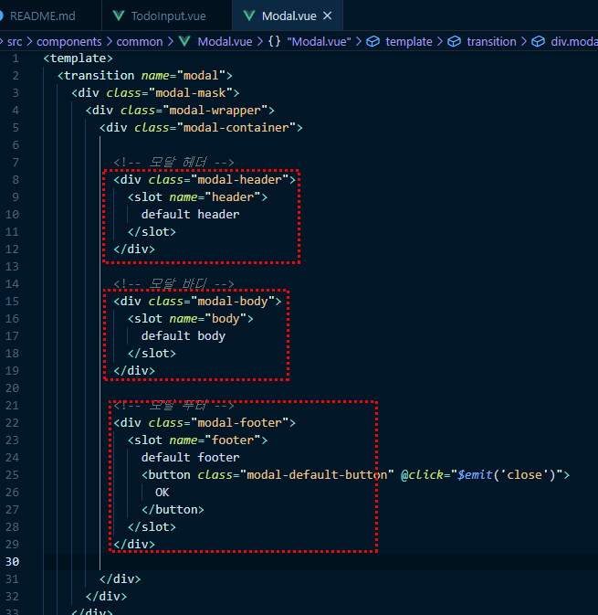<br />
			<br />
		- 공식문서에 따르면 you can use custom ~~ default content 이라는 영문 주석이 있는데 "너가 원하는 컨텐트를 이용해서 이 모달을 다시 재정의할 수 있다" 는 뜻이다.
			```HTML
			<!-- Modal 컴포넌트 -->
			<Modal v-if="showModal" @close="showModal = false">
			  <!--
			    you can use custom content here to overwrite
			    default content
			  -->
			  <h3 slot="header">custom header</h3>
			</Modal>
			```
		- TodoInput.vue 에서 slot 테스트
			1. TodoInput.vue에서 h3 내용을 경고로 수정한다
			```HTML
			<Modal v-if="showModal" @close="showModal = false">
			  <h3 slot="header">경고</h3>
			</Modal>
			```
			2. 현재 showModal: false 로 적용되어 있다<br />
			즉, Modal v-if="showModal" 이 뜻은 false 이면 보이지 않는다는 뜻.<br />
			**TodoInput.vue 에서 false 값을 True 바꿔주는 코드를 작성**한다<br />
			this.showModal = !this.showModal
				```JAVASCRIPT
				export default {
				  data: function() {
				    return {
				      newTodoItem: "",
				      showModal: false,
				    }
				  },
				  methods: {
				    addTodo: function() {
				      if(this.newTodoItem !== '') {
				        this.$emit('addTodoItem', this.newTodoItem)
				        this.clearInput();
				      } else {
				        this.showModal = !this.showModal
				      }
				    },
				  }
				}
				```

			3. 아무 내용없이 클릭하면 해당 모달 창이 뜨는 것을 확인할 수 있다
				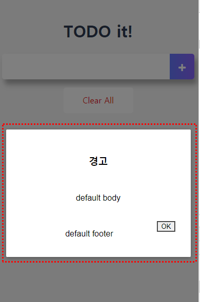<br />
				<br />
			
			4. 모달 창에서 header 부분이 바뀐 것을 확인할 수 있다
				- Modal.vue 에서는 *default header 로 보여지는데*
					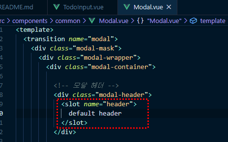<br />
					해당 페이지에서는 *경고로 바뀌었다* <br />
					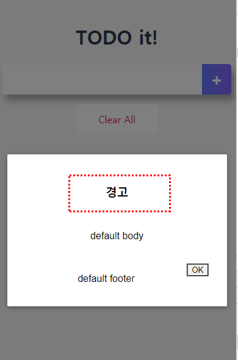<br />
					<br />
			5. **Modal.vue 에서 slot 으로 정의한 부분이 TodoInput.vue에서 slot 으로 정의한 부분으로 대체된다(바뀐다)**
				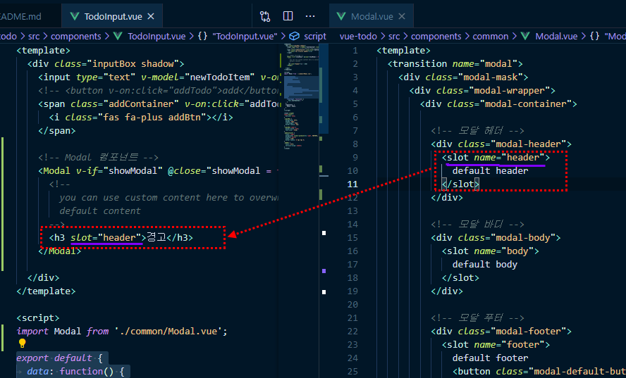<br />
				<br />

			6. **slot name="header" 으로 등록하면 slot="header" 으로 동일한 이름을 지정하여 사용**하면 된다
			<br />
	
	9. Modal.vue 에서 footer 영역은 주석처리하고<br />
	Header 영역에 닫기 버튼을 추가한다
		```HTML
		// TodoInput.vue
		<template>
		  <div class="inputBox shadow">
		    <!-- Modal 컴포넌트 -->
		    <Modal v-if="showModal" @close="showModal = false">
		      <h3 slot="header">
		        경고
		        <i class="closeModalBtn fas fa-times"></i>
		      </h3>
		      <div slot="body">무언가를 입력하세요</div>
		      <div slot="footer">copyright</div>
		    </Modal>
		  </div>
		</template>
		```
		```CSS
		// TodoInput.vue
		.closeModalBtn {
		  color: #42b983;
		}
		```
	<br />

	10. 모달 창에서 클릭했을 때의 이벤트를 적용한다
		- **v-on:click 를 축약하면 @click**
		- showModal = false 로 모달창을 닫는다.
			```HTML
			// TodoInput.vue
			<template>
			  <div class="inputBox shadow">
			    <!-- Modal 컴포넌트 -->
			    <Modal v-if="showModal" @close="showModal = false">
			      <h3 slot="header">
			        경고
			        <i class="closeModalBtn fas fa-times" @click="showModal = false"></i>
			      </h3>
			      <div slot="body">무언가를 입력하세요</div>
			      <div slot="footer">copyright</div>
			    </Modal>
			  </div>
			</template>
			```
	<br />

### 4.2. 트렌지션 소개 및 구현
- 트렌지션 공식문서 :<br />
https://vuejs.org/v2/guide/transitions.html
- 트렌지션은 구현 관점, 사용자 관점에서 보는 것이다.
	- 사용자 관점 : 애니메이션과 트렌지션, 간단한 임펙트를 뷰 프레임워크에서 바로바로 추가할 수 있다.
	- 구현 관점 : transition classes (트랜지션 이름)에 따라서 구현이 된다<br />
		https://vuejs.org/v2/guide/transitions.html#Transition-Classes
<br />
<br />

**트렌지션 구현**<br />
1. 공식문서(https://vuejs.org/v2/guide/transitions.html#List-Entering-Leaving-Transitions) 참고하여 list-item 효과 적용하기
	- 트랜지션 : https://vuejs.org/v2/guide/transitions.html#CSS-Transitions
	- 애니메이션 : https://vuejs.org/v2/guide/transitions.html#CSS-Animations
<br />

2. TodoList.vue 파일에 list-item 관련 css 적용한다
	```CSS
	/* TodoLIst.vue */
	
	/* 리스트 아이템 트렌지션 효과 */
	.list-enter-active, .list-leave-active {
	  transition: all 1s;
	}
	.list-enter, .list-leave-to /* .list-leave-active below version 2.1.8 */ {
	  opacity: 0;
	  transform: translateY(30px);
	}
	```
<br />

3. 아래 그림처럼 List에 적용해야하기 때문에 transition-group 를 이용한다
	- name : css와 연관된 네임이라고 보면 된다.<br />
	.list-enter-active, .list-leave-active
	- tag : 말 그대로 태그를 의미한다.<br />
	즉, p태그에 트랜지션을 넣겠다는 뜻이다.
	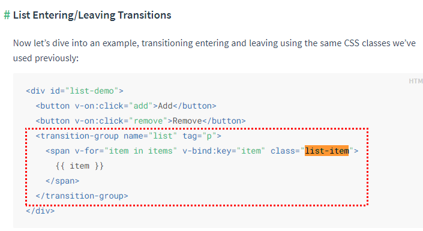<br />
	<br />

4. TodoList.vue에서 li 에 트렌지션 효과를 적용하기 위해 li를 감싸는 ul을 transition-group 으로 변경하여 li를 감싸준다.
	```HTML
	<ul>
	  <li v-for="(todoItem, index) in propsdata" v-bind:key="todoItem.item" class="shadow">
	    <i class="checkBtn fas fa-check" 
	      v-bind:class="{checkBtnCompleted: todoItem.completed}" 
	      v-on:click="toggleComplate(todoItem, index)"></i>
	    <span v-bind:class="{textCompleted: todoItem.completed}">{{ todoItem.item }}</span>
	    <span class="removeBtn" v-on:click="removeTodo(todoItem, index)">
	      <i class="fas fa-trash-alt"></i>
	    </span>
	  </li>
	</ul>
	```
	- 위 코드에서 ul -> transition-group 변경
	```HTML
	<transition-group name="list" tag="ul">
	  <li v-for="(todoItem, index) in propsdata" v-bind:key="todoItem.item" class="shadow">
	    <i class="checkBtn fas fa-check" 
	      v-bind:class="{checkBtnCompleted: todoItem.completed}" 
	      v-on:click="toggleComplate(todoItem, index)"></i>
	    <span v-bind:class="{textCompleted: todoItem.completed}">{{ todoItem.item }}</span>
	    <span class="removeBtn" v-on:click="removeTodo(todoItem, index)">
	      <i class="fas fa-trash-alt"></i>
	    </span>
	  </li>
	</transition-group>
	```
<br />

5. name은 클래스와 연관되어 있다.
	- 공식문서 : https://vuejs.org/v2/guide/transitions.html#Transition-Classes
	- 클래스 값을 적용할 때 Enter 와 Leave 그림 설명처럼<br>
	-enter & -leave-to , -enter-to & -leave 로 동일한 값을 적용한다.
	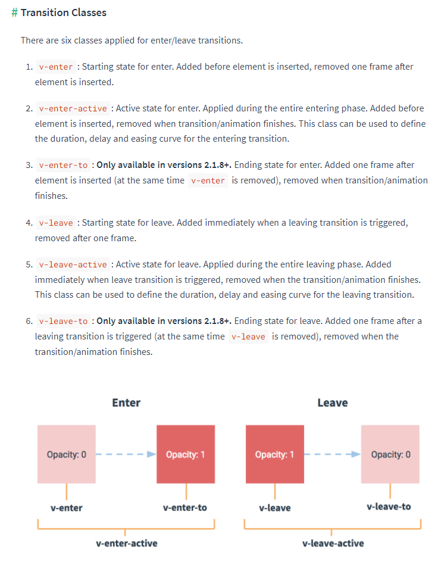<br />
	<br />

6. **List에 추가**될 때는 **list-enter-active, list-enter-to 클래스가 추가**된 것을 확인할 수 있다.
	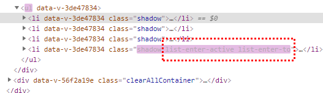<br />
	<br />

7. **List에 삭제**될 때는 **list-leave-active, list-leave-to 클래스가 삭제**된 것을 확인할 수 있다.
	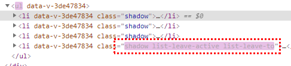<br />
	<br />
	<br />
	<br />

## 5. ES6 for Vue.js
### 5.1. ES6배경과 Babel 소개
- **ES6 란?**
	- ECMAScript 2015와 동일한 용어 (정확한 용어는 ECMAScript 2015)
	- 2015년은 ES5(2009년)이래로 진행한 첫 메이저 업데이트가 승인된 해
	- 최신 Front-End Framework인 React, Angular, Vue 에서 권고하는 언어 형식
	- ES5에 비해 문법이 간결해져서 익숙해지면 코딩을 훨씬 편하게 할 수 있음
<br />

- **Babel(바벨)**
	- https://babeljs.io/
	- 구 버전 브라우저 중에서는 ES6의 기능을 지원하지 않는 브라우저가 있으므로 **transpiling(트랜스파일링)이 필요**
	- *ES6의 문법을 각 브라우저의 호환 가능한 ES5로 변환하는 컴파일러*<br />
		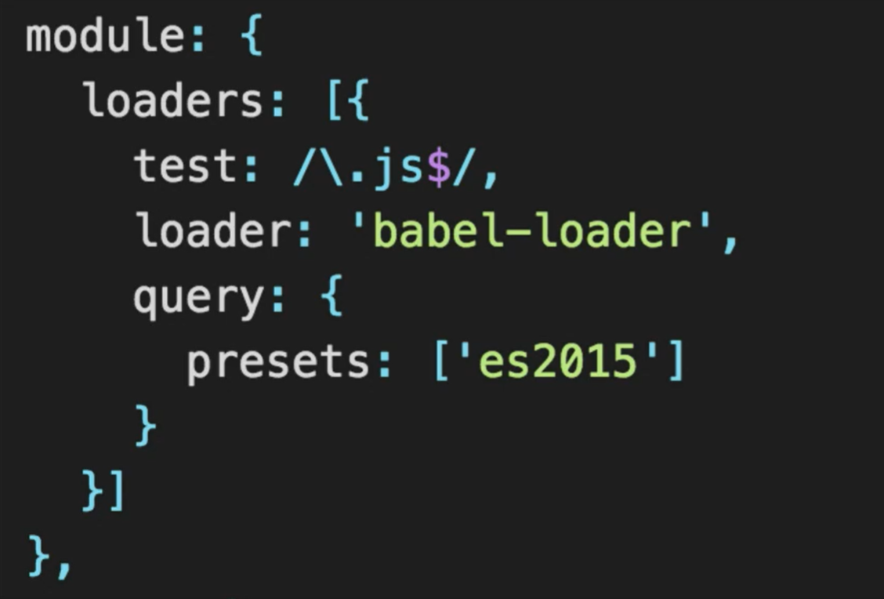<br />
		<br />

### 5.2. const & let 소개
- const & let : 새로운 변수 선언 방식
- **블록 단위 { } 로 변수의 범위가 제한**되었음
	- i는 접근이 되질 않아 값을 알 수가 없다
		```JAVASCRIPT
		let sum = 0;
		for ( let i=1; i <=5; i++ ) {
			sum = sum + i;
		}
		console.log(sum)	// 10
		console.log(i)	  // Uncaught ReferenceError : i is not defined
		```
	<br />
	
- **const** : 한 번 선언한 값에 대해서 **변경할 수 없음**(상수 개념)
	- const 예시 :<br /> 
		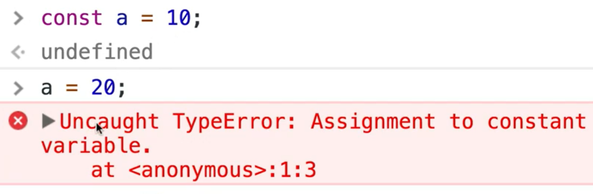<br />
	- 단, **객체나 배열의 내부는 변경**할 수 있다.
		```JAVASCRIPT
		const a = {};
		a.num = 10;
		console.log(a);	    // {num: 10}

		const a = [];
		a.push(20);
		console.log(a);      // [20]
		```
		<br />

- **let** : 한 번 선언한 값에 대해서 **다시 선언할 수 없음**
	- let 예시 :<br />
		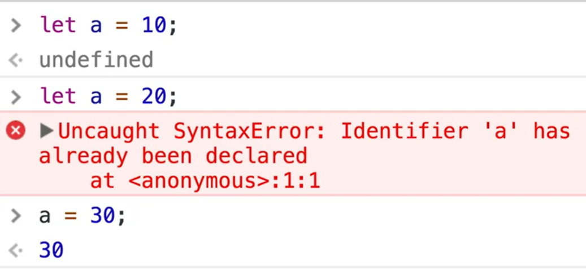<br />
		<br />

### 5.3. [ES5의 주요특징] 변수 스코프와 호이스팅
#### 5.3.1 변수의 Scope(스코프)
- 기존 자바스크립트(ES5)는 { }에 상관없이 스코프가 설정됨
- 스코프는 블록의 유효범위
	```JAVASCRIPT
	var sum = 0;
	for ( var i=1; i <= 5; i++ ) {
	  sum = sum + i;
	}
	console.log(sum);   // 15
	console.log(i);     // 6
	```
<br />

#### 5.3.2. Hoisting(호이스팅)
- Hoisting이란 선언한 함수와 변수를 해석기가 가장 상단에 있는 것처럼 인식한다
- js 해석기는 코드의 **라인 순서와 관계 없이 함수선언식과 변수를 위한 메모리 공간을 먼저 확보**한다.
	- **함수선언식**
		```JAVASCRIPT
		function sum() {
		  // function statement
		  return 10 + 20
		}
		```
	- 함수표현식
		```JAVASCRIPT
		var sum = function() {
		  // function expression
		  return 10 + 20;
		}
		```
- 따라서, function a()와 var 는 코드의 최상단으로 **끌어 올려진 것(hoisted)**처럼 보인다
	```JAVASCRIPT
	function willBeOveridden() {
	  return 10;
	}
	willBeOveridden();      // 5
	function willBeOveridden() {
	  return 5;
	}
	```

- 아래와 같은 코드를 실행할 때 자바스크립트 해석기가 어떻게 코드 순서를 재조정할까?
	```JAVASCRIPT
	var sum = 5;
	sum = sum + i;
	function sumAllNumbers() {
	  //
	}
	var i = 10;
	```
	- 아래 코드 순서 
	```JAVASCRIPT
	// #1 - 함수 선언식과 변수 선언을 Hositing
	var sum;
	function sumAllNumbers() {
	  //
	}
	var i;

	// #2 - 변수 대입 및 할당
	sum = 5;
	sum = sum + i;
	i = 10;
	```
<br />

### 5.4. [리팩토링] const 와 let
- const 를 선호하는 이유는 한 번 할당되고 나서 다시 변수 충돌나는, 오버라이딩이 안되니깐 그런 부분들이 디버깅할 때 편하다. 좀 더 안전한 프로그램을 할 수 있다.
	- 예시 : [ App.vue ] const obj
- for문에선 값이 계속 바뀌기 때문에 let을 사용한다
	- 예시 : [ App.vue ] let i

<br />

### 5.5. 화살표 함수 소개 및 설명
- **Arrow Function (화살표 함수)** 또는 fat arrow(팻 애로우), 팻 화살표 함수 라고 불린다.
- 함수를 정의할 때 **function 이라는 키워드를 사용하지 않고 => 로 대체**
- 흔히 사용하는 *콜백 함수*의 문법을 간결화
	```JAVASCRIPT
	// ES5 함수 정의 방식
	var sum = function(a,b) {
	  return a+b;
	}
	
	// ES6 함수 정의 방식
	var sum = (a,b) => {
	  return a+b;
	}
	
	sum(10, 20);
	```
- 화살표 함수 사용 예시
	- ES6에서 인자가 1개일 경우 ( ) 를 하지 않아도 된다
	```JAVASCRIPT
	// ES5
	var arr = ["a","b","c"];
	arr.forEach(function(value){
	  console.log(value);     // a,b,c
	})

	// ES6
	var arr = ["a","b","c"];
	arr.forEach(value => console.log(value));     // a,b,c
	```
	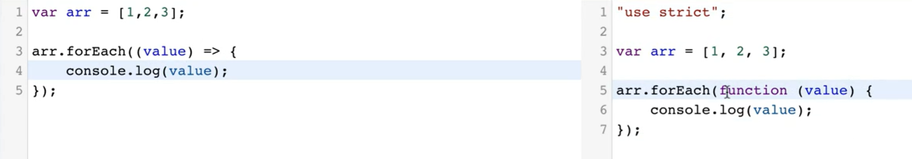<br />
	<br />

	- 함수 표현식 예시<br />
	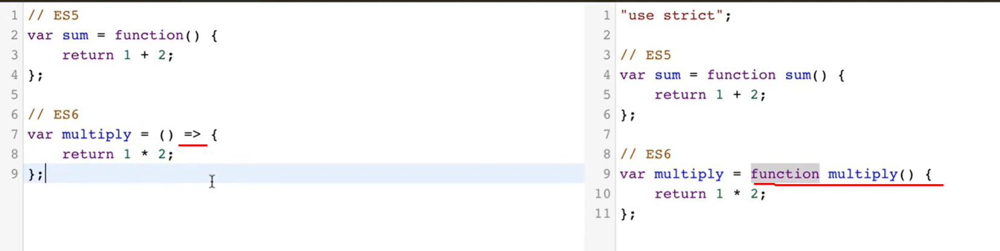<br />
	<br />

### 5.6. EnHanced Object Literals(향상된 객체 리터럴)
- EnHanced Object Literlas: 인핸스드 오브젝트 리터럴
- **객체의 속성을 메서드로 사용할 때 function 예약어를 생략**하고 생성가능
	- lookup: function() --> lookup() 으로 변경되어 사용
	```JAVASCRIPT
	var dictionary = {
	  words: 100,
	  // ES5
	  lookup: function() {
	    console.log("find words")
	  },
	  // ES6
	  lookup() {
	    console.log("find words")
	  }
	}
	```
	- 사용 예시 : data() {}, addTodo() {}, clearInput() {}
		```JAVASCRIPT
		// TodoInput.vue
		export default {
		  data() {
		    return {
		      newTodoItem: "",
		      showModal: false,
		    }
		  },
		  methods: {
		    addTodo() {
		      if(this.newTodoItem !== '') {
		        this.$emit('addTodoItem', this.newTodoItem)
		        this.clearInput();
		      } else {
		        this.showModal = !this.showModal
		      }
		    },
		    clearInput() {
		      this.newTodoItem = ""
		    }
		  },
		  components: {
		    Modal: Modal,
		  }
		}
		```
	<br />

- **객체의 속성명과 값 명이 동일할 때** 아래와 같이 **축약 가능**
	- figures : figures 동일할 때 -> figures 로 축약가능
	```JAVASCRIPT
	var figures = 10;
	var dictionary = {
	  //figures : figures
	  figures
	}
	```
	- 사용 예시 : 'TodoHeader' : TodoHeader -> TodoHeader
	```JAVASCRIPT
	// App.vue
	
	components: {
	  // 'TodoHeader' : TodoHeader,
	  // 'TodoInput' : TodoInput,
	  // 'TodoList' : TodoList,
	  // 'TodoFooter' : TodoFooter,
	  TodoHeader,
	  TodoInput,
	  TodoList,
	  TodoFooter,
	}
	```
<br />

### 5.7. Modules - 자바스크립트 모듈화 방법
- ES5 : ES5에서는 모듈화 방법이 없었다. 그렇기 때문에 모듈화를 지원하기 위해 모듈 로더 라이브러리(AMD, Commons JS)를 사용했었다
	- 모듈 : 특정 기능을 수행하는 한 단위(한 덩어리. 묶음)
- **ES6 : 자바스크립트 모듈 로더 라이브러리(AMD, Common JS) 기능을 js 언어 자체에서 지원**
	- 언어 자체에서 지원을 함으로써 개발자의 수고가 덜어짐.
- **모듈화를 이용하는 이유는 재사용성이 뛰어난 기능들을 묶어서 필요할 때마다 갖다 쓸 수** 있게끔 하는 측면에서 사용
- 호출되기 전까지는 코드 실행과 동작을 하지 않는 특징이 있음
- import 를 할 때 export 가 실행이 된다
	- main.js 파일에서 import로 libs/math.js (정의된 함수 등) 가져오고 그것을 main.js에서 호출한다
```JAVASCRIPT
// libs/math.js
export function sum(x, y) {
  return x + y;
}
export var pi = 3.131593;

// main.js
import {sum} from 'libs/math.js';
sum(1,2);
```
- 사용예시 :
```JAVASCRIPT
// App.vue
import TodoHeader from './components/TodoHeader.vue'
```
<br />

- Vue.js에서 마주칠 **default** export
	- defult : 한 개의 파일에서 하나 밖에 export 되지 않는다
	- 이름을 부여하여 사용할 수 있다 ( x -> util, x -> log)
```JAVASCRIPT
// util.js
export default function (x) {
  return console.log(x);
}

// main.js
import util from 'util.js';
console.log(util);	// function (x) { return console.log(x); }
util('hi');

// app.js
import log from 'util.js'
console.log(log)
log('hi');
```
<br />
<br />
<br />

## 6. Vuex
### 6.1. Vuex - 소개
Vuex : **상태 관리 라이브러리**<br />
**복잡한 애플리케이션의 컴포넌트들을 효율적으로 관리**하는 Vuex 라이브러리

#### 6.1.1 Vuex란?
- **무수히 많은 컴포넌트의 데이터를 관리하기 위한 상태 관리 패턴이자 라이브러리**
- React의 Flux 패턴에서 기인함
- Vue.js 중고급 개발자로 성장하기 위한 필수 관문
<br />

### 6.2. Flux와 MVC 패턴 소개 및 Flux 등장 배경
#### 6.2.1 Flux 란?
- MVC 패턴의 복잡한 데이터 흐름 문제를 해결하는 개발 패턴(단방향) == **Unidirectional data flow**
	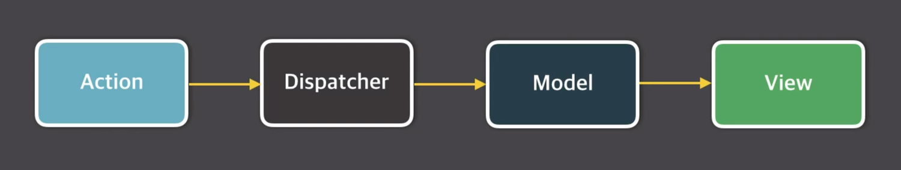<br />
	<br />
	1. action : 화면에서 발생하는 이벤트 또는 사용자의 입력
	2. dispatcher : 데이터를 변경하는 방법, 메서드
	3. model : 화면에 표시할 데이터
	4. view : 사용자에게 비춰지는 화면<br />

#### 6.2.2 MVC 패턴과 Flux 패턴 비교
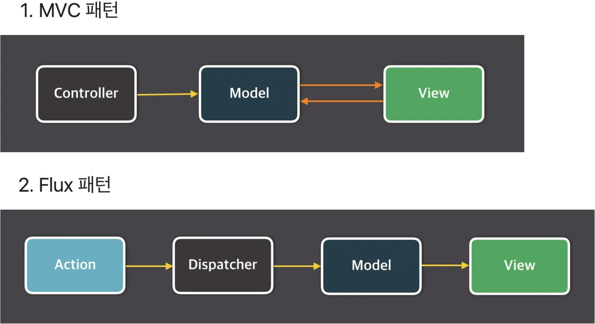<br />
<br />

#### 6.2.3. MVC 패턴의 문제점
1. 기능 추가 및 변경에 따라 생기는 문제점을 예측할 수가 없음. (예) 페이스북 채팅 화면
2. 앱이 복잡해지면서 생기는 업데이트 루프(= 데이터의 흐름을 추적할 수 없다)<br />
	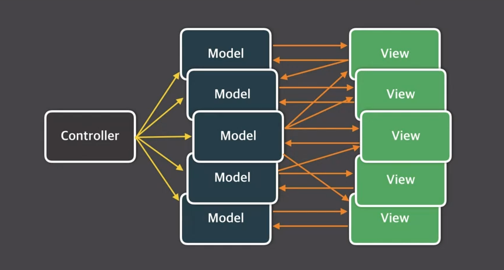<br />
	<br />

#### 6.2.4. Flux 패턴의 단방향 데이터 흐름
- 데이터의 흐름이 여러 갈래로 나뉘지 않고 단방향으로만 처리
- store == model
	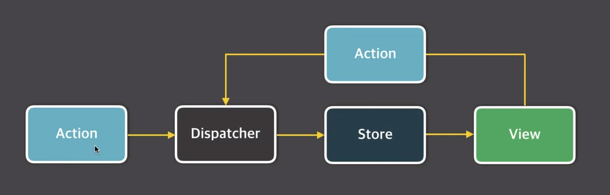<br />
	<br />

### 6.3. Vuex가 필요한 이유, Vuex 컨셉, Vuex 구조
#### 6.3.1. Vuex가 왜 필요할 까?
- 복잡한 애플리케이션에서 컴포넌트의 개수가 많아지면 컴포넌트 간에 데이터 전달이 어려워진다.
	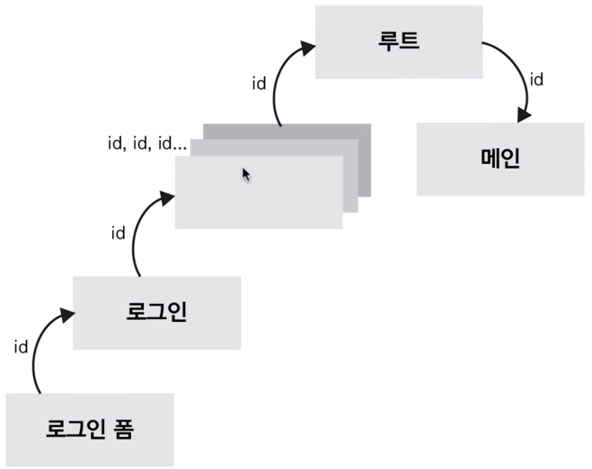<br />
	<br />
	- 이벤트 버스로 해결?
		- 어디서 이벤트를 보냈는 지 혹은 어디서 이벤트를 받았는 지 알기 어려움
			```JAVASCRIPT
			// Login.vue
			eventBus.$emit('fetch', loginInfo)

			// List.vue
			eventBus.$on('display',data => this.displayOnScreen(data));

			// Chart.vue
			eventBus.$emit('refreshData', chartData);
			```
			**※ 컴포넌트 간 데이터 전달이 명시적이지 않음**
<br />

- **Vuex 로 해결할 수 있는 문제**
	1. MVC 패턴에서 발생하는 구조적 오류
	2. 컴포넌트 간 데이터 전달 명시
	3. 여러 개의 컴포넌트에서 같은 데이터를 업데이트 할 때 동기화 문제
<br />

#### 6.3.2. Vuex 컨셉 
- Vuex도 단방향 데이터 흐름
- State : 컴포넌트 간에 공유하는 데이터 **data()** (== 데이터 프로퍼티)
- View : 데이터를 표시하는 화면 **template**
- Action : 사용자의 입력에 따라 데이터를 변경하는 **methods**<br />
	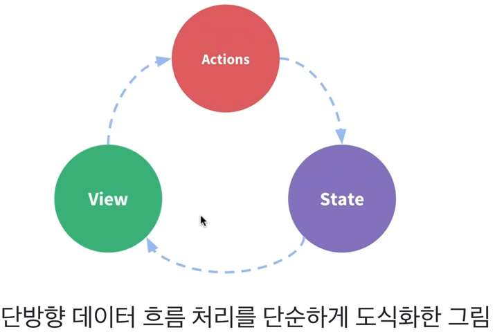<br />
	<br />
	※ View에서 내용을 입력하고 버튼을 클릭(Action)<br />
	--> 입력받은 내용을 View에 전달(State)<br /> 
	--> View에서 입력한 내용 화면에서 확인 )

#### 6.3.3. Vuex 구조
- 컴포넌트 --> 비동기 로직 --> 동기로직 --> 상태
	- 비동기 로직 == Actions (메서드) : setTimeOut 같은, 데이터 변경X
	- 동기 로직 == Mutations (메서드) : 데이터를 변경하여 State 전달
		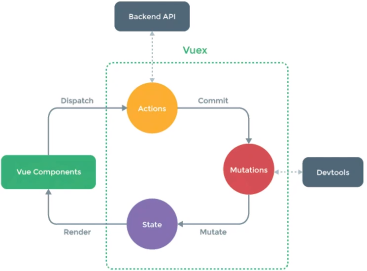<br />
		<br />
- 자바스크립트 비동기 처리와 콜백 함수 글<br />
https://joshua1988.github.io/web-development/javascript/javascript-asynchronous-operation/
- 자바스크립트 Promise 쉽게 이해하기<br />
https://joshua1988.github.io/web-development/javascript/promise-for-beginners/

<br />
<br />
<br />

## 7. Vuex - 주요 기술 요소
### 7.1. Vuex 설치 및 등록
1. Vuex 설치하기
	- Vuex 공식 문서 : https://vuex.vuejs.org/
	- Vuex 설치는 ES5와 ES6 2가지 방식이 있다<br />
	ES6와 함께 사용해야 더 많은 기능과 이점을 제공받을 수 있음.
	- Vuex는 싱글 파일 컴포넌트 체계에서 **NPM방식으로 라이브러리를 설치**하는 것이 좋다<br />
	따라서, **Vue CLI로 생성한 프로젝트 폴더에서 npm 방식으로 라이브러리를 설치**한다.
		```
		npm install vuex --save
		```
	- Vuex 3.6 버전으로 설치된 것을 확인할 수 있다<br />
		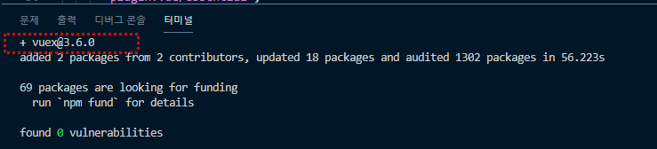<br />
		<br />

2. Vue CLI로 생성한 프로젝트 폴더 > package.json 파일에서 Vuex가 설치되어 적용된 것을 확인할 수 있다
	- Vue CLI로 생성한 프로젝트 폴더명 : vue-todo
	- vue-todo/package.json 에서 **"dependencies": { "vuex": "^3.6.0" }**<br />
		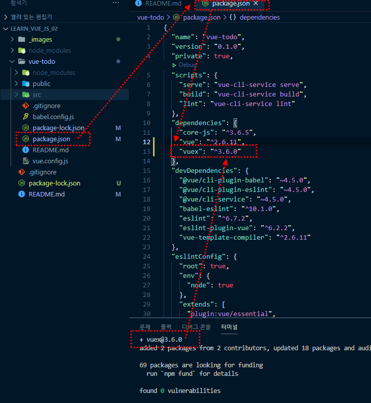<br />
		<br />

3. Vuex 를 보통 스토어 라고 하며, 스토어 경우 관행적으로 저장하는 폴더가 있다
	- src/store 폴더를 생성한 후, store.js 파일을 생성한다<br />
		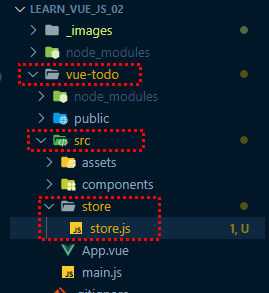<br />
	- 이것이 일반적이 Vuex 구조라고 생각하면 된다

4. store.js 에서 Vuex 호출을 한다
	```JAVASCRIPT
	import Vue from 'vue'
	import Vuex from 'vuex'
	```
<br />

5. Vue 플러그인 사용 설정
	- .use : 뷰의 플러그인 이라는 기능
	- **.use를 사용하는 이유는 뷰를 사용할 때 전역**으로, 뷰를 사용하는 모든 영역에 특정 기능을 추가하고 싶을 때 글로벌 펑셔널리티(Global Functionality)를 추가 하고 싶을 때 사용하는 부분이다.
	- .use(Vuex) : *Vuex를 쓴다* 라고 했기 때문에 나중에 코드 단에서 어떤 특정 컴포넌트에서 this.$store 접근이 가능한 부분이다
	- .use(Vuex) 의 this.$store 처럼 지원되는 라이브러리가 있고 그렇지 않은 것은 플러그인을 만들어서 사용해야 한다.
	```JAVASCRIPT
	// store.js
	import Vue from 'vue';
	import Vuex from 'vuex';

	Vue.use(Vuex);
	```
<br />

6. 여기까지가 **설치부터 Vuex 등록까지 완료된 상태**이다.
	``` JAVASCRIPT
	// store.js

	import Vue from 'vue'
	import Vuex from 'vuex'

	Vue.use(Vuex);

	export const store = new Vuex.Store({

	});
	```
<br />

7. **main.js 에 등록 완료된 Vuex 를 연결**해준다
	- **export const 변수로 선언한 순간 변수를 다른 파일에서도 사용**할 수 있다
		```JAVASCRIPT
		// store.js
		export const store
		```
	- **main.js 파일에서** export const 변수로 선언한 변수를 **{ 변수명 } 설정**해준다
		- import { 변수명 } from '경로'
		- import 로 연결 해준 후, new Vue({  }) 인스턴스에 import로 선언한 변수명을 기재해준다
		```JAVASCRIPT
		// main.js
		import { store } from './store/store'

		new Vue({
		  render: h => h(App),
		  store,
		}).$mount('#app')
		```
<br />

### 7.2. Vuex 기술요소
- **state** : 여러 컴포넌트에 공유되는 데이터 **data**
- **getters** : *연산된 state 값을 접근*하는 속성 **computed**
- **mutations** : *state 값을 변경*하는 이벤트 로직/메서드 **methods**
- **actions** : *비동기 처리 로직*을 선언하는 메서드 **aysnc methods**

<br />

### 7.3. state 와 getters 소개
#### 7.3.1. state
- **state 란?** : 여러 컴포넌트 간에 공유할 데이터 - 상태
	- Vue.use(Vuex); 로 글로벌 펑셔널리티(Global Functionality)로 적용 해주었기 때문에 **this.$store** 로 쓸 수 있다.
	```JAVASCRIPT
	// Vue 
	data: {
	  message : 'Hello Vue.js!'
	}

	// Vuex
	state: {
	  message: 'Hello Vue.js!'
	}
	```
	```HTML
	<!-- Vue -->
	<p>{{ message }}</p>
	
	<!-- Vuex -->
	<p>{{ this.$store.state.message }}</p>
	```
<br />

#### 7.3.2. getters
- **getters 란?** : *state 값을 접근하는 속성*이자 *computed: {} 처럼 미리 연산된 값을 접근*하는 속성
	```JAVASCRIPT
	// store.js
	state: {
	  num: 10
	},
	getters: {
	  getNumber(state) {
	    return state.num;
	  },
	  doubleNumber(state) {
	    return state.num * 2;
	  }

	}
	```
	```HTML
	<p>{{ this.$store.getters.getNumber }}</p>
	<p>{{ this.$store.getters.doubleNumber }}</p>
	```
<br />

### 7.4. [리팩토링] state 속성 적용
1. 애플리케이션에 바로 적용하는 것이 아닌 테스트로 제대로 작동하는 지 확인 작업을 한다
	```JAVASCRIPT
	// store.js
	export const store = new Vuex.Store({
	  state: {
	    headerText : 'TODO it!',
	  }
	});
	```
	- state에 추가한 headerText 를 적용해본다
	```HTML
	<!-- TodoHeader.vue -->
	<template>
	  <header>
	    <!-- <h1>TODO it!</h1> -->
	    <h1>{{ this.$store.state.headerText}}</h1>
	  </header>
	</template>
	```
	- [뷰 개발자 도구] store.js 파일의 state의 headerText 속성에 적용된 값이 화면 view에 적용된 것을 확인할 수 있다
		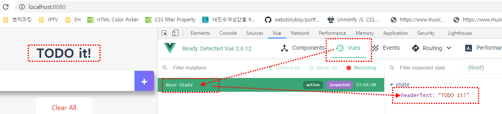<br />
		<br />

2. App.vue 에 적용했던 data - todoItems 를 **store.js 에 적용**한다
	```JAVASCRIPT
	// store.js

	export const store = new Vuex.Store({
	  state: {
	    todoItems: []
	  }
	});
	```
	<br />

3. App.vue 의 created() 에 적용된 코드를 store.js 에 적용한다
	1. 로컬스토리지에 관련된 것들을 하나의 변수를 만들어서 적용한다.
	2. 만든 변수에 fetch() 라는 속성을 선언한다.
	3. created()에 적용되었던 코드를 fetch()에 적용한다<br />
	(기존 created() 에 적용된 API, 동작들을 fetch()에 적용)
		```JAVASCRIPT
		const storage = {
		  fetch() {
		    if ( localStorage.length > 0 ) {
		      for(let i=0; i < localStorage.length; i++) {
		        if(localStorage.key(i) !== 'loglevel:webpack-dev-server') {
		          this.todoItems.push(JSON.parse(localStorage.getItem(localStorage.key(i))));
		        }
		      }
		    }
		  }
		}
		```
	<br />

4. storage(스토리지) 라는 객체 변수를 export const store 에서 호출하려고 한다.<br />
store.fatch() 로 호출하면 로컬스토리지에 저장된 정보들을 다 담아와서 배열로 돌려주려고 한다<br />

5. const storage 객체 변수의 fetch() 속성에 const arr 를 선언한다
	```JAVASCRIPT
	const storage = {
	  fetch() {
	    const arr = [];
	    if ( localStorage.length > 0 ) {
	      for(let i=0; i < localStorage.length; i++) {
	        if(localStorage.key(i) !== 'loglevel:webpack-dev-server') {
	          this.todoItems.push(JSON.parse(localStorage.getItem(localStorage.key(i))));
	        }
	      }
	    }
	  }
	}
	```
	<br />

6. const storage - fetch() 속성에 적용된 코드에서 this.todoItems 는 스코프가 다르기 때문에 todoItems에 접근할 수가 없다.<br />
새로 만든 빈 배열인 arr에 담아준다
	```JAVASCRIPT
	const storage = {
	  fetch() {
	    const arr = [];
	    if ( localStorage.length > 0 ) {
	      for(let i=0; i < localStorage.length; i++) {
	        if(localStorage.key(i) !== 'loglevel:webpack-dev-server') {
	          arr.push(JSON.parse(localStorage.getItem(localStorage.key(i))));
	        }
	      }
	    }
	    return arr;
	  }
	}
	```
<br />

7. storage - arr 배열에 담긴 정보를 todoItems에 넣어준다.
	```JAVASCRIPT
	const storage = {
	  fetch() {
	    const arr = [];
	    if ( localStorage.length > 0 ) {
	      for(let i=0; i < localStorage.length; i++) {
	        if(localStorage.key(i) !== 'loglevel:webpack-dev-server') {
	          arr.push(JSON.parse(localStorage.getItem(localStorage.key(i))));
	        }
	      }
	    }
	    return arr;
	  }
	}

	export const store = new Vuex.Store({
	  state: {
	    todoItems: storage.fetch(),
	  }
	});
	```
<br />

8. TodoList.vue 에서 store.js 에서 생성한 state - todoItems 값으로 변경해준다
	```HTML
	<!-- AS-IS -->
	<template>
	  <div>
	    <transition-group name="list" tag="ul">
	      <li v-for="(todoItem, index) in propsdata" v-bind:key="todoItem.item" class="shadow">
	        <i class="checkBtn fas fa-check" 
	          v-bind:class="{checkBtnCompleted: todoItem.completed}" 
	          v-on:click="toggleComplate(todoItem, index)"></i>
	        <span v-bind:class="{textCompleted: todoItem.completed}">{{ todoItem.item }}</span>
	        <span class="removeBtn" v-on:click="removeTodo(todoItem, index)">
	          <i class="fas fa-trash-alt"></i>
	        </span>
	      </li>
	    </transition-group>
	  </div>
	</template>	
	<!-- TO-BE -->
	<template>
	  <div>
	    <transition-group name="list" tag="ul">
	      <li v-for="(todoItem, index) in this.$store.state.todoItems" v-bind:key="todoItem.item" class="shadow">
	        <i class="checkBtn fas fa-check" 
	          v-bind:class="{checkBtnCompleted: todoItem.completed}" 
	          v-on:click="toggleComplate(todoItem, index)"></i>
	        <span v-bind:class="{textCompleted: todoItem.completed}">{{ todoItem.item }}</span>
	        <span class="removeBtn" v-on:click="removeTodo(todoItem, index)">
	          <i class="fas fa-trash-alt"></i>
	        </span>
	      </li>
	    </transition-group>
	  </div>
	</template>
	```
<br />

9. [ 뷰 개발자 도구 ] Vuex 탭에서 보면 store.js 에서 설정한 state - todoItems 값이 적용된 것을 확인할 수 있다
	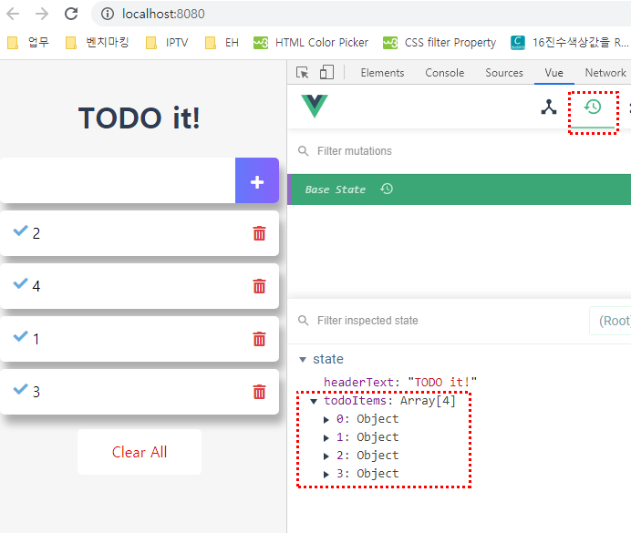<br />
	<br />

### 7.5. mutations 와 commit() 형식 소개
#### 7.5.1 mutation
- **state의 값을 변경**할 수 있는 **유일한 방법**이자 메서드
- mutation(뮤테이션)은 commit()으로 동작시킨다
- mutations - 속성 메서드에는 첫번째 인자로 항시 state를 갖고 온다. 그래서 mutations에서 state 속성 값을 변경할 수 있다.	Vuex의 규약이라고 생각하면 된다.
	- **commit() 커밋**은 mutation을 발동시키는, **동작시키는 명령어**이다
		- commit(mutation - 속성이름) == this.$store.commit('printNumbers');
		- commit(mutation - 속성이름, 인자) == this.$store.commit('sumNumbers', 20);
	```JAVASCRIPT
	// store.js
	state: { 
	  num: 10
	},
	mutations: {
	  printNumbers(state) {
	    return state.num
	  },
	  sumNumbers(state, anothereNum) {
	    return state.num + anotherNum;
	  }
	}

	// App.vue
	this.$store.commit('printNumbers');   // 10
	this.$store.commit('sumNumbers', 20); // 30

	```
	<br />

#### 7.5.2. mutations의 commit() 형식
- state를 변경하기 위해 mutations를 동작시킬 때 인자(payload)를 전달할 수 있음
	- 여러 개의 값을 넘겨줄 경우 key: value 의 객체 형태로 넘겨줄 수 있음
	- 통상적으로 payload 를 쓰는데 다른 이름으로 바꿔서 사용해도 된다
	```JAVASCRIPT
	// store.js
	state: {
	  storeNum: 10
	},
	mutations: {
	  modifyState(state, payload) {
	    console.log(payload.str);
	    return state.storeNum += payload.num;
	  }
	}

	// App.vue
	this.$store.commit('modifyState', {
	  str: 'passed from payload',
	  num: 20
	})
	```
	<br />

### 7.6. [리팩토링] mutations 적용
1. TodoList.vue 에서 v-for 디렉티브에서 propsdata가 아닌 this.$store.state.todoItems 으로 대체하였기 때문에 propsdata 적용된 **코드를 삭제**한다
	```JAVASCRIPT
	// TodoList.vue 
	props: ['propsdata'],  // 삭제
	```
<br />

2. App.vue 의 created() {}에 적용된 코드는<br />
store.js - fetch() {} 에 적용하였기 때문에 **App.vue에서 Created() {} 는 삭제**한다.
	```JAVASCRIPT
	// App.vue
	// created() {} 전체 삭제
	created() {
	  if ( localStorage.length > 0 ) {
	    for(let i=0; i < localStorage.length; i++) {
	      if(localStorage.key(i) !== 'loglevel:webpack-dev-server') {
	        this.todoItems.push(JSON.parse(localStorage.getItem(localStorage.key(i))));
	      }
	    }
	  }
	},
	```
<br />

3. App.vue의 methods를 mutations으로 적용한다.<br />
(methods == mutations)
<br />

4. [ App.vue - methods : addOneItem ]
	1. store.js 의 mutations 속성을 만든 후, addOneItem 메서드를 생성하고 App.vue에 적용된 코드를 그대로 붙여넣기 한다.
		```JAVASCRIPT
		export const store = new Vuex.Store({
		  mutations: {
		    addOneItem() {
		      const obj = { completed: false, item: todoItem,};
		      localStorage.setItem(todoItem, JSON.stringify(obj));
		      this.todoItems.push(obj);
		    }
		  }
		});
		```
	2. App.vue - addOneItem 메서드 에선 todoItem 인자를 받고 있다.<br />
	해당 부분을 보면 TodoInput 에서 addOneItem 이벤트가 실행되는 것을 볼 수 있다.

	3. TodoInput.vue 파일을 연다.<br />this.$emit('addTodoItem', this.newTodoItem)<br />$emit 으로 인자를 전달하는 것을 알 수 있다.<br />this.$emit 을 this.$store.commit() 으로 코드를 변경한다  
		- TodoInput.vue에서 commit 할 때, 입력된 값(this.newTodoItem)도 같이 보내준다.
		- .trim() == 앞뒤의 공백을 제거해주는 기능
			```JAVASCRIPT
			// TodoInput.vue
			// $emit 부분을 아래 코드로 변경
			const text = this.newTodoItem.trim();
			this.$store.commit('addOneItem', text);
			```
	
	4. store.js - addOneItem(state, todoItem)
		- mutations(뮤테이션)은 항시 첫번째 인자로 state
		- 2번째 인자로는 TodoInput.vue에서 전달해준 값을 todoItem 인자로 받는다.
		```JAVASCRIPT
		mutations: {
		  addOneItem(state, todoItem) {
		    const obj = { completed: false, item: todoItem, };
		    localStorage.setItem(todoItem, JSON.stringify(obj));
		    this.todoItems.push(obj);
		  },
		}
		```

	5. store.js - addOneItem(state, todoItem)
		- this.todoItems.push 가 아닌 state.todoItems 로 변경한다
		- state로 접근해서 값을 넣어준다
		```JAVASCRIPT
		export const store = new Vuex.Store({
		  state: {
		    todoItems: storage.fetch(),
		  },
		  mutations: {
		    addOneItem(state, todoItem) {
		      const obj = { completed: false, item: todoItem, };
		      localStorage.setItem(todoItem, JSON.stringify(obj));
		      state.todoItems.push(obj);
		    },
		  }
		});
		```

	6. [ 뷰 개발자 도구 ] mutations 에 추가된 내역을 확인할 수 있다
		- payload : 5  ==  인자 값을 5로 받았다
		- type == 이벤트 메서드 이름
		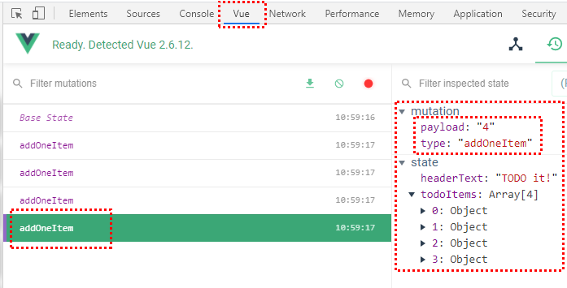<br />
		<br />
	
	7. App.vue 에서 메서드와 v-on 디렉티브 **삭제**
		- addOneItem 메서드 삭제
		- TodoInput v-on: 디렉티브 삭제 
			- TodoInput.vue 와 Store.js 와 직접적으로 연관되어 있기 때문에 App.vue 에서 v-on 디렉티브는 삭제
		```HTML
		<template>
		  <div id="app">
		    <TodoHeader></TodoHeader>
		    <!-- TodoInput v-on:addTodoItem="addOneItem"></TodoInput  v-on 삭제-->
		    <TodoInput></TodoInput>
		    <TodoList 
		      v-bind:propsdata="todoItems" 
		      v-on:removeItem="removeOneItem"
		      v-on:toggleItem="toggleOneItem"></TodoList>
		    <TodoFooter v-on:clearAll="clearAllItem"></TodoFooter>
		  </div>
		</template>
		```
		<br />

	5. [ App.vue - methods : removeOneItem ] -> store.js 코드 적용
		1. TodoList.vue 코드 수정
			- 인자로 받은 todoItem, index 를 하나의 객체(obj)로 생성하여 commit으로 정보를 전달한다
			- ES6 객체지향 문법에 따라 키:밸류 값이 같을 땐, 한 번만 기재<br />(index: index => index)
			```JAVASCRIPT
			// TodoList.vue
			// 방법 1
			export default {
			  methods: {
			    removeTodo(todoItem, index) {
			      // this.$emit('removeItem', todoItem, index);
			      const obj = { 
			        todoItem,
			        index
			      };
			      this.$store.commit('removeItem', obj);
			    },
			  },
			}
			
			// 방법 2
			export default {
			  methods: {
			    removeTodo(todoItem, index) {
			      // this.$emit('removeItem', todoItem, index);
			      this.$store.commit('removeItem', { todoItem, index} );
			    },
			  },
			}
			```
		2. store.js 에서 payload로 obj 정보를 넘겨 받는다
			```JAVASCRIPT
			mutations: {
			  removeOneItem(state, payload) {
			    localStorage.removeItem(payload.todoItem.item);
			    state.todoItems.splice(payload.index, 1);
			  },
			  
			}
			```
		3. App.vue - TodoList 컴포넌트에서 v-on:removeItem="removeOneItem" 삭제
	<br />

	6. [ App.vue - methods : toggleOneItem ] -> store.js 코드 적용
		1. 기존 toggleOneItem 메서드도 todoItems 와 index 를 인자로 받기 때문에 removeOneItem 과 마찬가지로 state, payload 로 인자를 받는다.
			```JAVASCRIPT
			// store.js
			mutations: {
			  toggleOneItem(state, payload) {
			  },
			}
			```
		2. TodoList.vue 에서 commit() 코드를 적용한다
			```JAVASCRIPT
			// TodoList.vue
			export default {
			  methods: {
			    toggleComplate(todoItem, index) {
			      this.$store.commit('toggleOneItem', {todoItem, index} );
			    }
			  },
			}
			```
		3. App.vue - TodoList 컴포넌트에서 v-on:toggleItem="toggleOneItem" 삭제
		4. toggleOneItem 메서드를 store.js에 맞게 수정한다
			```JAVASCRIPT
			// store.js
			mutations: {
			  toggleOneItem(state, payload) {
			    state.todoItems[payload.index].completed = !state.todoItems[payload.index].completed

			    // 로컬 스토리지의 데이터 갱싱
			    localStorage.removeItem(payload.todoItem.item);
			    localStorage.setItem(payload.todoItem.item, JSON.stringify(payload.todoItem));
			  },
			}
			```
		<br />
	
	7. **[ 뷰 개발자 도구 팁 ]**
		- 뷰 개발자도구, Vuex 탭에서 해당 아이콘을 클릭하면 해당 버튼을 클릭하기 전의 상태로 돌아간다.
		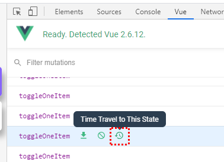<br />
		<br />

	8. [ App.vue - methods : clearAllItem ] -> store.js 코드 적용
		1. store.js - mutation에 clearAllItem 메서드 적용
		2. TodoFooter.vue 에서 commit('clearAllItem')을 실행한다.
			```JAVASCRIPT
			// TodoFooter.vue
			export default {
			  methods: {
			    clearTodo() {
			      this.$store.commit('clearAllItem')
			    }
			  }
			}
			```
		3. App.vue - TodoFooter 컴포넌트 태그에서 v-on:clearAll="clearAllItem" 삭제
		4. store.js - clearAllItem 코드 작성
			```JAVASCRIPT
			// store.js
			clearAllItem(state) {
			  localStorage.clear();
			  state.todoItems = [];
			}
			```
			<br />
	
	9. App.vue, data - todoItems 속성 삭제
	10. App.vue, TodoList 컴포넌트 태그에서 v-bind:propsdata="todoItems" 삭제
		```HTML
		<template>
		  <div id="app">
		    <TodoHeader></TodoHeader>
		    <TodoInput></TodoInput>
		    <TodoList></TodoList>
		    <TodoFooter></TodoFooter>
		  </div>
		</template>
		```
	<br />

	11. 코드가 한결 깔끔해진 것을 확인할 수 있다.
<br />

### 7.7. 왜 mutations로 상태를 변경해야 하는 가?
**state는 왜 직접 변경하지 않고 mutations로 변경할까?**
- 여러 개의 컴포넌트에서 아래와 같이 state 값을 변경하는 경우 **어느 컴포넌트에서 해당 state를 변경했는 지 추적하기가 어렵다**(뷰 개발자도구에서도 확인 불가)
	```JAVASCRIPT
	methods: {
	  increaserCounter() {
	    this.$store.state.counter++;
	  }
	}
	```
- 특정 시점에 어떤 컴포넌트가 state를 접근하여 변경한 건지 확인하기 어렵기 때문
- 따라서, 뷰의 반응성을 거스르지 않게 명시적으로 상태 변화를 수행. **반응성. 디버깅. 테스팅 혜택**
	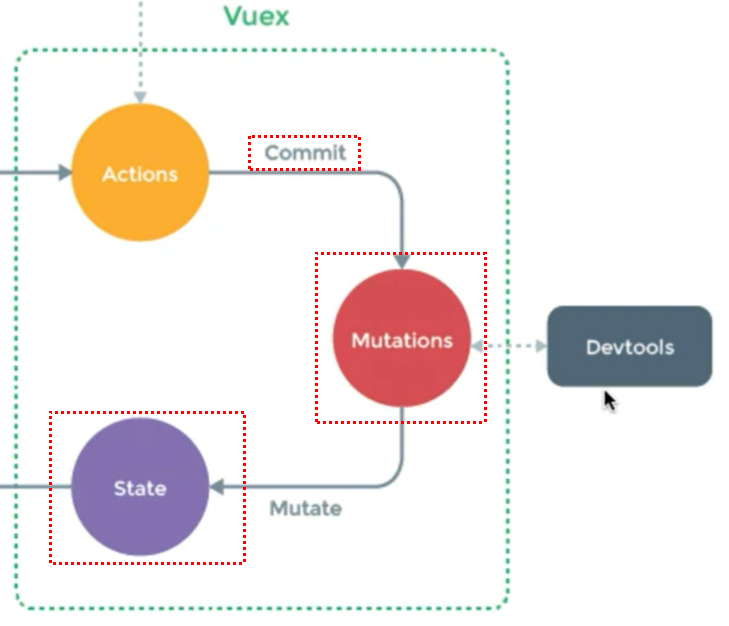<br />
	<br />

### 7.8. actions 소개 및 예제
- **actions 란?**
	- 비동기 처리 로직을 선언하는 메서드, 비동기 로직을 담당하는 mutations
	- 데이터 요청, **Promise**, ES6 async과 같은 **비동기 처리**는 모두 actions에 선언
	```JAVASCRIPT
	// store.js
	state: {
	  num: 10
	},
	mutations: {
	  dobleNumber(state) {
	    state.num * 2;
	  }
	},
	actions: {
	  delayDoubleNumber(context) { // context로 store의 메서드와 속성 접근
	    context.commit('doubleNumber')
	  }
	}

	// App.vue
	this.$store.dispatch('delayDoubleNumber');
	```
	<br />

- **actions 비동기 코드 예제 1**
	- 비동기처리의 대표적인 예시, setTimeout 
	- actions : dispatch 라는 API로 호출해서 실행시킨다
		- App.vue의 메소드 incrementCounter() 에서 dispatch 로 sotre.js의 actions - delayedAddCounter를 호출하여 실행
		- context로 store의 메서드와 속성 접근
	```JAVASCRIPT
	// store.js
	mutations: {
	  addCounter(state) {
	    state.counter++
	  },
	},
	actions: {
	  delayedAddCounter(context) {
	    setTimeout( () => context.commit('addCounter'), 2000 );
	  }
	}

	// App.vue
	methods: {
	  incrementCounter() {
	    this.$store.dispatch('delayedAddCounter')
	  }
	}
	```
<br />

- **actions 비동기 코드 예제 2**
	- 서버에 데이터를 불러와서 화면에 출력하는 예제
	- App.vue의 메서드 getProduct 에서 dispatch로 store.js의 actions - fetchProductData 메서드 호출
	- store.js 에서 actions -fetchProductData 메서드 실행
	- axios API로 URL에 따른 정보를 받아오는데, 성공시(then) store.js의 commit으로 mutations - setData 로 호출하면서 response 로 데이터 값을 전달
	- store.js 의 mutations - setData 에서 받은 데이터 값을 fetchedData 인자로 받는다
	- fetchedData 인자로 전달 받은 값은 state.product 에 대입해준다.
	```JAVASCRIPT
	// store.js
	mutations: {
	  setData(state, fetchedData) {
	    state.product = fetchedData
	  }
	},
	actions: {
	  fetchProductData(context) {
	    return axios.get('https://domain.com/products/1)
	                .then(response => context.commit('setData', response));
	  }
	}

	// App.vue
	methods: {
	  getProduct() {
	    this.$store.dispatch('fetchProductData');
	  }
	}
	```

<br />

- **참고자료**
	- Promise 이해하기 :<br />
	https://joshua1988.github.io/web-development/javascript/promise-for-beginners/
	- 자바스크립트 비동기 처리 이해하기 :<br />
	https://joshua1988.github.io/web-development/javascript/javascript-asynchronous-operation/
	
	<br />

### 7.9. 왜 actions에 비동기 로직을 선언해야 하는 가?
#### 왜 비동기 처리 로직은 actions에 선언해야 할 까?
- 언제 어느 컴포넌트에서 해당 state를 호출하고, 변경했는 지 확인하기가 어려움
- [아래 그림 참고] 여러 개의 컴포넌트에서 mutations로 시간 차를 두고 state를 변경하는 경우
	- state 값의 변화를 추적하기 어렵기 때문에 mutations 속성에는 동기 처리 로직만 넣어야 한다.
	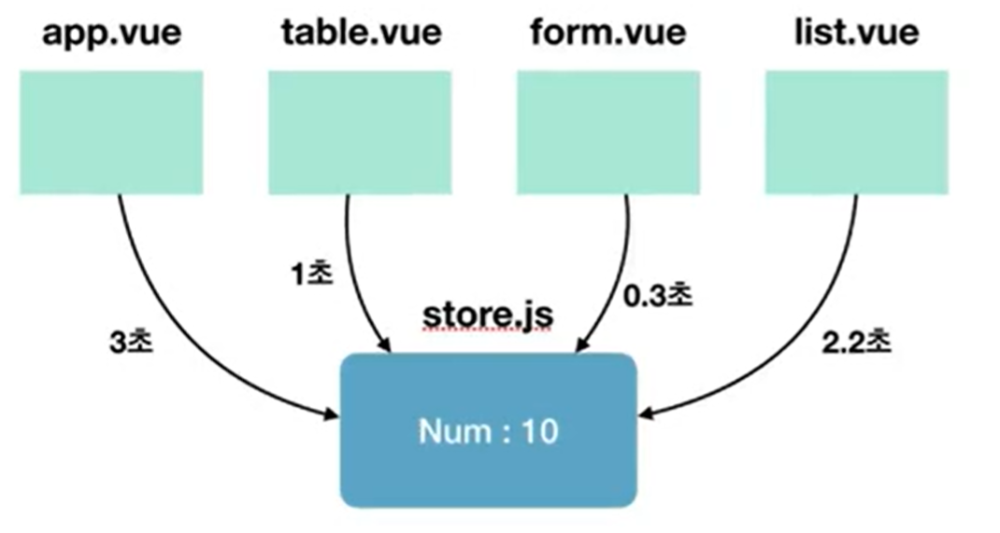<br />

<br />
<br />
<br />

## 8. Vuex - 헬퍼함수
### 8.1. 헬퍼 함수 및 ES6 Spread 연산자 소개
#### 8.1.1. 각 속성들을 더 쉽게 사용하는 방법 - Helper
- Store에 있는 아래 4가지 속성들을 간편하게 코딩하는 방법
	- state -> mapState
	- getters -> mapGetters
	- mutations -> mapMutations
	- actions -> mapActions
<br />

#### 8.1.2. 헬퍼의 사용법
- 헬퍼를 사용하고자 하는 vue 파일에서 아래와 같이 해당 헬퍼를 로딩
	- import { } from ''  <br />
	: 이 문법은 ES6의 Modules 문법으로 모듈화된 파일에서 변수나, 함수 등의 단일 기능을 꺼내오는 경우에는 { }를 붙여야 한다<br />
	https://developer.mozilla.org/ko/docs/Web/JavaScript/Reference/Statements/import
- mapState('num') => this.$store.state.num
- ...는 ES6의 Object Spread Operator 이다
```javascript
// App.vue
import { mapState } from 'vuex'
import { mapGetters } from 'vuex'
import { mapMutations } from 'vuex'
import { mapActions } from 'vuex'

export default {
  computed: { ...mapState('num'), ...mapGetters(['countedNum']) },
  methods: { ...mapMutations(['clickBtn']), ...mapActions(['asyncClickBtn']) }
}
```
- ES6의 Object Spread Operator(스프레이드 오퍼레이터로) 예제
	- 일일이 나열하지 않아도 **...** 하나로 **전체 내용을 끌어온다(=불러온다)** 라고 생각하면 된다.
```javascript
let josh = {
  field: 'web',
  language: 'js',
};
let developer = {
  nation: 'korea',
  ...josh
}

console.log(developer);
```
```javascript
// 결과값
[object Object] {
  field: 'web',
  language: 'js',
  nation: 'korea',
}
```
<br />

### 8.2. mapState, mapGetters 소개 및 ES6 Spread 연산자 쓰는 이유
#### 8.2.1. mapState
- Vuex에 선언한 state 속성을 뷰 컴포넌트에 **더 쉽게 연결**해주는 헬퍼
- computed: {} 에서 ...mapState(['']) 으로 선언
	- ...mapState(['num'])  == [] 은 배열 괄호
	```javascript
	// App.vue
	import { mapState } from 'vuex'

	computed: {
	  ...mapState(['num'])
	  // num() { return this.$store.state.num}
	}

	// store.js
	state: {
	  num: 10
	}
	```
	```html
	<!-- <p>{{ this.$store.state.num }}</p> -->
	<p>{{ this.num }}</p>
	```
<br />

#### 8.2.2. mapGetters
- Vuex에 선언한 getters 속성을 뷰 컴포넌트에 **더 쉽게 연결**해주는 헬퍼
- computed: {} 에서 ...mapGetters(['']) 으로 선언
	```javascript
	// App.vue
	import { mapGetters } from 'vuex'
	computed: {
	  ...mapGetters(['reverseMessage'])
	}

	// store.js
	getters: {
	  reverseMessage(state) {
	    return state.msg.split('').reverse().join('');
	  }
	}
	```
	```html
	<!-- <p>{{ this.$store.getters.reverseMessage }}</p> -->
	<p>{{ this.reverseMessage }}</p>
	```
<br />

#### 8.2.3. ES6 Spread 연산자 쓰는 이유
- **기존 컴포넌트에 존재하는 computed 속성**과 mapGetters 속성을 **함께 쓰기 위해서 사용**하는 것이다.
	- **... 을 사용했을 때**
		```javascript
		let josh = {
		  field: 'web',
		  language: 'js',
		};
		let developer = {
		  nation: 'korea',
		  ...josh
		}

		console.log(developer);
		```
		```javascript
		// 결과값
		[object Object] {
		  field: 'web',
		  language: 'js',
		  nation: 'korea',
		}
		```
	- **... 을 사용하지 않았을 때**
		```javascript
		let josh = {
		  field: 'web',
		  language: 'js',
		};
		let developer = {
		  nation: 'korea',
		  josh
		}
		
		console.log(developer);
		```
		```javascript
		// 결과값
		[object Object] {
		  josh: [object Object] {
		    field: "web",
		    language: "js",
			},
		  nation: 'korea',
		}
		```
		<br />

### 8.3. [리팩토링] getters와 mapGetters 적용하기
1. mapGetters 를 쓰기 전, getters 를 먼저 적용해본다.
2. store.js 에 getters - storedTodoItems() 속성을 추가한다.
	```javascript
	export const store = new Vuex.Store({
	  state: {
	    todoItems: storage.fetch(),
	  },
	  getters: {
	    storedTodoItems(state) {
	      return state.todoItems;
	    }
	  },
	}
	```
3. TodoList.vue 에서 getters에 접근한다
	- v-for="**(todoItem, index) in this.$store.state.todoItems**" 에서<br />**this.$store.getters.storedTodoItems**적용할 수 있다
	```html
	<template>
	  <div>
	    <transition-group name="list" tag="ul">
	      <li v-for="(todoItem, index) in this.$store.state.todoItems" v-bind:key="todoItem.item" class="shadow">
	      </li>
	    </transition-group>
	  </div>
	</template>
	```
4. 뷰 개발자도구, getters에 등록된 것을 확인할 수 있다.<br />
	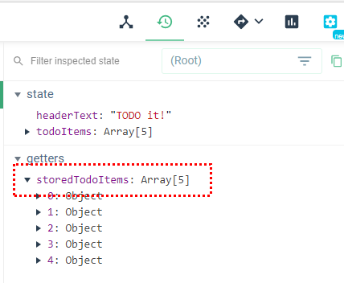<br />
	<br />
5. 그런데 보통은 위와 같이 쓰질 않는다.
6. TodoList.vue 에서 computed: {} 속성을 추가하여 사용한다
	- template li v-for 디렉티브에 적용했던 this.$store.getters.storedTodoItems를<br />script computed - todoItem속성에 적용한다
		```javascript
		export default {
		  computed: {
		    todoItems() {
		      return this.$store.getters.storedTodoItems;
		    }
		  }
		}
		```
	- template li v-for 디렉티브에 적용했던 this.$store.getters.storedTodoItems는<br />this.todoItems으로 적용한다
		```html
		<template>
		  <div>
		    <transition-group name="list" tag="ul">
		      <li v-for="(todoItem, index) in this.todoItems" v-bind:key="todoItem.item" class="shadow">
		      </li>
		    </transition-group>
		  </div>
		</template>
		```
	- 이런 부분들이 **vue에서 권고하는 가이드** 이다.
	- **template 안에서 표현하는 부분은 가급적 자바스크립트 연산,<br />전체적인 속성 접근을 최대한 줄이는 방안에서 template깔끔하게 표기**한다.<br />그리고 깔끔하게 표기해야하는 연산 등은<br />script(해당 컴포넌트의 내부 로직, 예시 TodoList.vue) script안에서 해결한다.

7. mapGetters 적용해보기
8. TodoList.vue 파일에 import 로 mapGetters 를 적용한다
	- import 를 적용해야 mapGetters 에 접근할 수 있다
	- computed 속성에 ...mapGetters 를 추가해준다. [''] 배열 안에는 stores.js에서 명시한 storedTodoItems 이름을 적용한다
		```javascript
		// TodoList.vue
		import { mapGetters } from 'vuex
		export default {
		  computed: {
		    ...mapGetters(['storedTodoItems']),
		  }
		}
		```
	- script에 적용을 한 후, template에 this.storedTodoItems 로 적용한다
		```html
		<template>
		  <div>
		    <transition-group name="list" tag="ul">
		      <li v-for="(todoItem, index) in this.storedTodoItems" v-bind:key="todoItem.item" class="shadow">
		      </li>
		    </transition-group>
		  </div>
		</template>
		```
9. 번외로 ...mapGetters(['storedTodoItems']) 에서 배열이 아닌 객체 형태로도 적용할 수도 있다.
	- store.js 에서 명시한 getters 이름과 컴포넌트.vue 파일에서 명시한 이름이 서로 다를 때
	- template 에서 this.todoItems 로 적용
		```html
		<template>
		  <div>
		    <transition-group name="list" tag="ul">
		      <li v-for="(todoItem, index) in this.todoItems" v-bind:key="todoItem.item" class="shadow">
		      </li>
		    </transition-group>
		  </div>
		</template>			
		```
	- store.js - getters: storedTodoItems 명시
		```javascript
		// store.js
		getters: {
		   storedTodoItems(state) {
		     return state.todoItems;
		   }
		}
		// TodoLIst.vue
		computed: {
		  ...mapGetters({
		    todoItems: 'storedTodoItems'
		  }),
		}
		```
10. mapGetters 처럼 mapState도 적용해보기
	```html
	<h1>{{ this.headerText}}</h1>
	```
	```javascript
	// store.js
	state: {
	  headerText : 'TODO it!',
	},

	// TodoHeader.vue
	import { mapState } from 'vuex'
	export default {
	  computed: {
	    ...mapState(['headerText']),
	  }
	}
	```

<br />

### 8.4. mapMutations, mapActions 소개 및 헬퍼의 유연한 문법
#### 8.4.1. mapMutations
- Vuex에 선언한 mutations 속성을 뷰 컴포넌트에 **더 쉽게 연결**해주는 헬퍼
- methods: {} 에서 ...mapMutations(['']) 으로 선언
	```javascript
	// App.vue
	import { mapMutations } from 'vuex'

	methods: {
	  ...mapMutations(['clickBtn']),
	  authLogin() {},
	  displayTable() {}
	}

	// store.js
	mutations: {
	  clickBtn(state) {
	    alert(state.msg);
	  }
	}
	```
	```html
	<button @click="clickBtn">popup message</button>
	```
<br />

#### 8.4.2. mapActions
- Vuex에 선언한 actions 속성을 뷰 컴포넌트에 **더 쉽게 연결**해주는 헬퍼
- methods: {} 에서 ...mapActions(['']) 으로 선언
	```javascript
	// App.vue
	import { mapActions } from 'vuex'

	methods: {
	  ...mapActions(['delayClickBtn']),
	}

	// store.js
	actions: {
	  delayClickBtn(context) {
	    setTimeout( () => context.commit('clickBtn'), 2000)
	  }
	}
	```
	```html
	<button @click="delayClickBtn">delay popup message</button>
	```
<br />

#### 8.4.3. 헬퍼의 유연한 문법
- Vuex에 선언한 속성을 **그대로 컴포넌트에 연결**하는 문법
	- 인자를 선언하지 않아도 인자의 값을 넘겨준다. addNumber(인자)  -> addNumber
	```javascript
	// 배열 리터럴
	...mapMutations([
	  'clickBtn',   // 'clickBtn': clickBtn
	  'addNumber'   // addNumber(인자)
	])
	```
- Vuex에 선언한 속성을 **컴포넌트의 특징 메서드에다가 연결**하는 문법
	```javascript
	// 객체 리터럴
	...mapMutations({
	  popupMsg: 'clickBtn'   // 컴포넌트 메서드 명 : Store의 뮤테이션 명
	})
	```
<br />

### 8.5. mapMutations 적용 및 풀이과정
1. TodoList.vue 에서 mapMutations 를 선언한다
	- 2개 이상 선언할 땐 ,(컴마)로 구분한다 { mapGetters, mapMutations }
	```javascript
	// TodoList.vue
	import { mapGetters, mapMutations } from 'vuex'
	```
2. [ TodoList.vue ] removeTodo 메서드를 ...mapMutations 으로 변경한다
	- 컴포넌트 태그
	```html
	<span class="removeBtn" v-on:click="removeTodo(todoItem, index)">
	```
	- mapMutations **적용 전**
		```javascript
		export default {
		methods: {
		  removeTodo(todoItem, index) {
		    this.$store.commit('removeOneItem', {todoItem, index} );
		  },
		},
		```
	- mapMutations **적용 후**
		- ...mapMutations 경우 { todoItem, index } 의 인자를 따로 **기재하지 않아도 된다**
		- 컴포넌트 태그에 인자가 적용되어 있으면 자동으로 ...mapMutations 으로 받아온다.
		- 그런데 컴포넌트 태그를 보면 (todoItem, index) 인자를 2개 받아오는 걸로 적용되어 있다.<br />해당 부분을 ({todoItem, index}) 으로 변경하면 된다
		```html
		<span class="removeBtn" v-on:click="removeTodo({todoItem, index})">
		```
		```javascript
		methods: {
		  ...mapMutations({
		    // 컴포넌트 메서드 명 : Store의 뮤테이션 명
		    removeTodo : 'removeOneItem'
		  }),
		}
		```
<br />

### 8.6. 헬퍼 함수가 주는 간편함
1. store/demoStore.js 파일을 생성한다
	```javascript
	// demoStore.js
	import Vue from 'vue'
	import Vuex from 'vuex'

	Vue.use(Vuex);

	export const store = new Vuex.Store({
	  state: {
	    price : 100
	  },
	  getters: {
	    originalPrice(state) {
	      return state.price;
	    },
	    doublePrice(state) {
	      return state.price * 2;
	    },
	    triplePrice(state) {
	      return state.price * 3;
	    }
	  }
	});
	```
	<br />

2. components/Demo.vue 파일을 생성한다
	```html
	<template>
	  <div id="root">
	    <p>{{ this.$store.getters.originalPrice }}}</p>
	    <p>{{ this.$store.getters.doublePrice }}}</p>
	    <p>{{ this.$store.getters.triplePrice }}}</p>
	  </div>
	</template>
	```
	```javascript
	export default {
	  computed: {
	    originalPrice() {
				
	    },
	    doublePrice() {
				
	    },
	    triplePrice() {
				
	    }
	  }
	}
	```
<br />

3. Vue에서 권고하는 것은 template 에서 최대한 심플, 간결, 단순하게 표현하는 것이다.<br />2번처럼 적용되었던 부분을 아래와 같이 수정한다.
	```html
	<template>
	  <div id="root">
	    <p>{{ originalPrice }}}</p>
	    <p>{{ doublePrice }}}</p>
	    <p>{{ triplePrice }}}</p>
	  </div>
	</template>
	```
	```javascript
	export default {
	  computed: {
	    originalPrice() {
	      return this.$store.getters.originalPrice;
	    },
	    doublePrice() {
	      return this.$store.getters.doublePrice
	    },
	    triplePrice() {
	      return this.$store.getters.triplePrice
	    }
	  }
	}
	```
<br />

4. 위와 같이 적용한 부분을 mapGetters로 적용한다
	- 컴포넌트 태그에 명시한 이름과<br />store.js - getters에서 명시한 이름이 **동일하기 때문에**<br />mapGetters **배열로 적용**한다
	- **template 에서** {{ this.originalPrice }} 가 아닌 **{{ originalPrice }}} 적용**
		- **템플릿의 HTML 코드에서 computed, data 를 사용할 때엔 this 없이** originalPrice 처럼 사용한다
		- this는 컴포넌트의 자바스크립트 부분에만 넣으면 된다.
	```html
	<template>
	  <div id="root">
	    <p>{{ originalPrice }}}</p>
	    <p>{{ doublePrice }}}</p>
	    <p>{{ triplePrice }}}</p>
	  </div>
	</template>
	```
	```javascript
	import { mapGetters } from 'vuex'

	export default {
	  computed: {
	    ...mapGetters(['originalPrice','doublePrice','triplePrice']),
	  }
	}
	```
	<br />
	<br />
	<br />

## 9. Vuex - 프로젝트 구조화 및 모듈화
### 9.1. 스토어 속성 모듈화 방법
#### 9.1.1. 프로젝트 구조화와 모듈화 방법 1
아래와 같은 store 구조를 어떻게 모듈화 할 수 있을 까?
```javascript
// store.js
import Vue from 'vue'
import Vuex from 'vuex'

export const store = new Vuex.Store({
  state: {},
  getters: {},
  mutations: {},
  actions: {}
})
```
- ES6의 import & export를 이용하여 속성별로 모듈화
	- import * as 로 연결해준다
```javascript
import Vue from 'vue'
import Vuex from 'vuex'
import * as getters from 'store/getters.js'
import * as mutations from 'store/mutations.js'
import * as actions from 'store/actions.js'

export const stroe = new Vuex.Store({
  state: {},
  getters: getters,
  mtations: mutations,
  actions: actions
})
```
<br />

#### 9.1.2. 프로젝트 구조화와 모듈화 1 실습
1. store 폴더에 getters.js, mutations.js 파일 생성
2. store.js - getters 에 적용되어 있는 storedTodoItems 메서드를 **getters.js에 적용**한다
	- export const 메서드명 = (매개변수) => {}
	```javascript
	// store.js
	getters: {
	  storedTodoItems(state) {
	    return state.todoItems;
    }
	}

	// getters.js
	export const storedTodoItems = (state) => {
	  return state.todoItems;
	}
	```
	<br />

3. store.js - mutations에 적용된 메서드를 **mutations.js에 적용**한다
	- export const 메서드명 = (매개변수) => {}
	- const 메서드명 = (매개변수) => {} 로 쓰고<br />아래 코드처럼 export  { 메서드명1, 메서드명2 }
	```javascript
	const addOneItem = (state, todoItem) => {
	  const obj = { completed: false, item: todoItem, };
	  localStorage.setItem(todoItem, JSON.stringify(obj));
	  // this.todoItems.push(obj);
	  state.todoItems.push(obj);
	};
	
	const removeOneItem = (state, payload) => {
	  localStorage.removeItem(payload.todoItem.item);
	  state.todoItems.splice(payload.index, 1);
	};
	
	const toggleOneItem = (state, payload) => {
	  state.todoItems[payload.index].completed = !state.todoItems[payload.index].completed
	
	  // 로컬 스토리지의 데이터 갱싱
	  localStorage.removeItem(payload.todoItem.item);
	  localStorage.setItem(payload.todoItem.item, JSON.stringify(payload.todoItem));
	};
	
	const clearAllItem = (state) => {
	  localStorage.clear();
	  state.todoItems = [];
	};

	export  { addOneItem, removeOneItem, toggleOneItem, clearAllItem}
	```
	<br />

4. getters.js 와 mutations.js 작업을 완료했다면<br />store.js 에서 만든 속성별 모듈화 파일을 import 한다.
	```javascript
	// store.js
	import * as getters from './getters'
	import * as mutations from './mutations'

	export const store = new Vuex.Store({
	  getters: getters,
	  mutations: mutations,
	});
	```
	- ES6 문법에 따라 key:Value 값이 같으면 축약이 가능하다
	```javascript
	// store.js
	import * as getters from './getters'
	import * as mutations from './mutations'

	export const store = new Vuex.Store({
	  getters,
	  mutations,
	});
	```	
	<br />

### 9.2. 스토어 모듈화 방법
#### 9.2.1 프로젝트 구조화와 모듈화 방법 2
- 앱이 비대해져서 1개의 store로는 관리가 힘들 때 modules 속성 사용
```javascript
// store.js
import Vue from 'vue'
import Vuex from 'vuex'
import todo from 'modules/todo.js'

export const store = new Vuex.Store({
  modules : {
    moduleA: todo    // 모듈 명칭 ; 모듈 파일명
    todo             // todo : todo
  }
});

// todo.js
const state = {}
const getters = {}
const mutations = {}
const actions = {}
```

#### 9.2.2. 프로젝트 구조화와 모듈화 2 실습
*(모듈화 1에서 작업한 상태에서 진행하여 1번 실습내용을 확인할땐 체크아웃 b15201a 해서 확인하기)*
1. store 폴더 안에 modules 폴더를 만들고 todoApp.js 파일을 생성한다
2. store.js 파일에서 import * as 로 선언하는 문구는 삭제한다.
3. store.js 파일에 import로 todoApp.js 파일을 선언한다
	- import 에서 선언한 경로의 파일인 todoApp 파일이 변수 todoApp에 담겨서 modules 의 todoApp으로 선언<br />ES6 문법에 따라서 todoApp : todoApp => todoApp
	```javascript
	// store.js 
	import todoApp from './modules/todoApp'

	export const store = new Vuex.Store({
	   modules: {
	     todoApp,
	   }
	});
	```

4. todoApp.js 파일에서 state를 선언한다
	- modules js 파일로 구조화 할 경우, 화살표 함수 방식이 아닌 변수를 만들고 그 안에 메서드를 적용한다.
	- const 변수 -= { 기존 메서드 방식과 동일 }
	```javascript
	// todoApp.js
	const storage = {
	  fetch() {
	    const arr = [];
	    if ( localStorage.length > 0 ) {
	      for(let i=0; i < localStorage.length; i++) {
	        if(localStorage.key(i) !== 'loglevel:webpack-dev-server') {
	          arr.push(JSON.parse(localStorage.getItem(localStorage.key(i))));
	        }
	      }
	    }
	    return arr;
	  }
	}

	const state = {
	  todoItems: storage.fetch(),
	}

	const getters = {
	  storedTodoItems(state) {
	    return state.todoItems;
	  }
	}

	const mutations = {
	  addOneItem(state, todoItem) {
	    const obj = { completed: false, item: todoItem, };
	    localStorage.setItem(todoItem, JSON.stringify(obj));
	    // this.todoItems.push(obj);
	    state.todoItems.push(obj);
	  },

	  removeOneItem(state, payload) {
	    localStorage.removeItem(payload.todoItem.item);
	    state.todoItems.splice(payload.index, 1);
	  },

	  toggleOneItem(state, payload) {
	    state.todoItems[payload.index].completed = !state.todoItems[payload.index].completed

	    // 로컬 스토리지의 데이터 갱싱
	    localStorage.removeItem(payload.todoItem.item);
	    localStorage.setItem(payload.todoItem.item, JSON.stringify(payload.todoItem));
	  },

	  clearAllItem(state) {
	    localStorage.clear();
	    state.todoItems = [];
	  }
	}

	export default {
	  state,
	  getters,
	  mutations
	}
	```
	<br />
	<br />
	<br />

## 10. 번외
### 10.1. export default
- export default는 ES6의 modules 구문
- 기존의 ES5 방식은 변수에 컴포넌트 내용을 넣어 인스턴스 안에서 참조하는 방식이었다. 같은 파일 내에 변수를 선언했기 때문에 그냥 일반 자바스크립트 값을 참조하듯이 참조할 수 있었다. **export default는 다른 파일의 있는 내용을 참조해오기 위한 방식**이다. 
- https://ko.javascript.info/import-export#ref-4122
- export 와 export default 차이
	- export 할 경우에는 import { 함수명 } from * 으로 사용
	- export default 하실 경우에는 import 함수명 from * 으로 사용
- export default :<br />
코딩중 export할 파일소스내 제일처음 export default로 정의한 클래스(함수, 변수등 모든 정의되것들)로 가지고옴, 같은 소스내에 export default로 정의한 것들이 여러개 있다하더라도 제일처음 정의 한건만 가능
	- export default를 사용할 때 var, let, const는 사용하지 못합니다.
- export :<br />
export할 파일소스내의 클래스(함수, 변수등 모든 정의되것들)들중 위 답변 “import {그안에 들어있는 것들중1, 것들중2,것들중3, 계속추가} from 파일.js” 처럼 특정해서 사용됨
- mdn 참고 : https://developer.mozilla.org/ko/docs/Web/JavaScript/Reference/Statements/export