# 웹팩 시작하기

이 리포지토리는 인프런 웹팩 온라인 강의의 수업 리포지토리입니다.

## 개발 환경 설정

- [Chrome](https://www.google.com/intl/ko/chrome/)
- [Git](https://git-scm.com/downloads)
- [Visual Studio Code](https://code.visualstudio.com/)
- [Node.js LTS 버전(v12.x 이상)](https://nodejs.org/ko/)

## VSCode 유용한 플러그인 목록

- 색 테마 : [Night Owl](https://marketplace.visualstudio.com/items?itemName=sdras.night-owl)
- 파일 아이콘 테마 : [Material Icon Theme](https://marketplace.visualstudio.com/items?itemName=PKief.material-icon-theme)
- 문법 검사 : ESLint, [TSLint](https://marketplace.visualstudio.com/items?itemName=eg2.tslint)
- 실습 환경 보조 : [Live Server](https://marketplace.visualstudio.com/items?itemName=ritwickdey.LiveServer)
- 기타 : [Prettier](https://marketplace.visualstudio.com/items?itemName=esbenp.prettier-vscode), [Project Manager](https://marketplace.visualstudio.com/items?itemName=alefragnani.project-manager), [Auto Close Tag](https://marketplace.visualstudio.com/items?itemName=formulahendry.auto-close-tag), [GitLens](https://marketplace.visualstudio.com/items?itemName=eamodio.gitlens), [Atom Keymap](https://marketplace.visualstudio.com/items?itemName=ms-vscode.atom-keybindings), [Jetbrains IDE Keymap](https://marketplace.visualstudio.com/items?itemName=isudox.vscode-jetbrains-keybindings) 등

<br /><br /><br />

***

## 1. Webpack   
### 1.1. 웹팩이란?
**웹팩이란 최신 프런트엔드 프레임워크에서 가장 많이 사용되는 모듈 번들러(Module Bundler)**.<br />
모듈 번들러란 웹 애플리케이션을 구성하는 자원(HTML, CSS, Javscript, Images 등)을 모두 각각의 모듈로 보고 
이를 조합해서 병합된 하나의 결과물을 만드는 도구를 의미한다.
- 참고(강의샘) : https://joshua1988.github.io/webpack-guide/
<br />

#### Webpack First Principle 강의 참고
- [Webpack First Principle](https://youtu.be/WQue1AN93YU)
- [ 크롬 개발자 도구 ] Network 패널 > No throttling : 네트워크 지연시간 또는 가상환경 설정
	- No throttling 또는 아래 이미지 부분을 클릭하면 네트워크 설정이 가능
		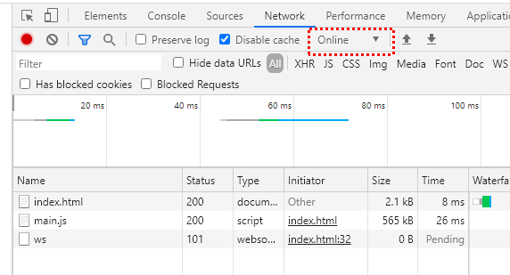<br />	
	- 네트워크 속도에 따라 로딩 시간이 달라진다<br />
	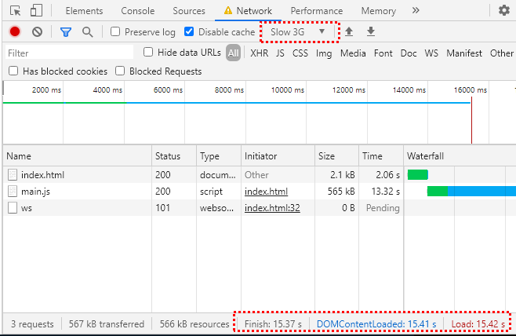<br />	
	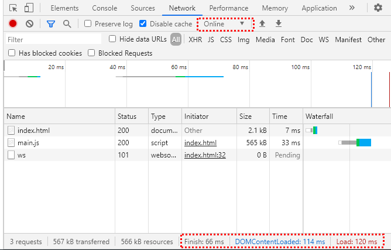<br />	
<br />

- **TIMELINE** : 일반적인 브라우저의 웹페이지를 그리는 과정들, 렌더링 파이브 라인<br />
	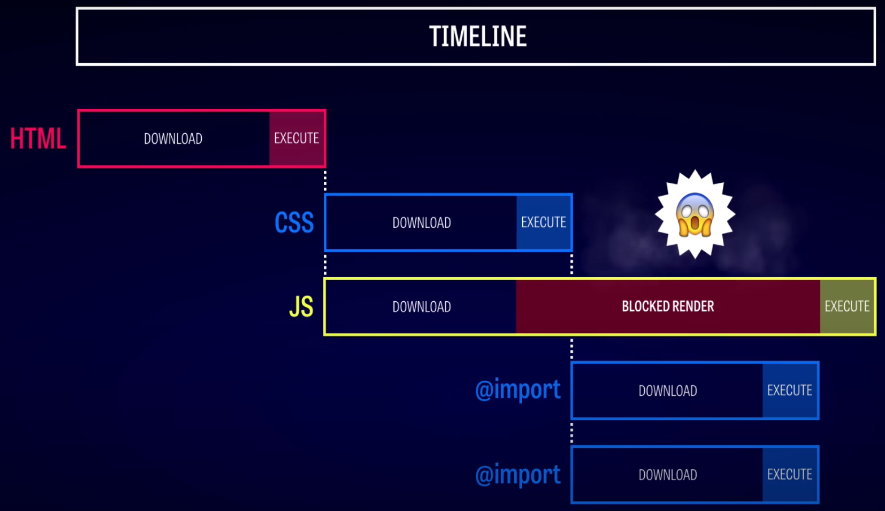<br />	
	- 같은 파일을 웹팩 **적용 전과 후를 비교**했을 때
		- 웹팩 적용 후, 불러오는 파일의 수가 줄어들었다
		- 로딩 속도(시간)가 눈의 띄게 줄어들었다<br />
		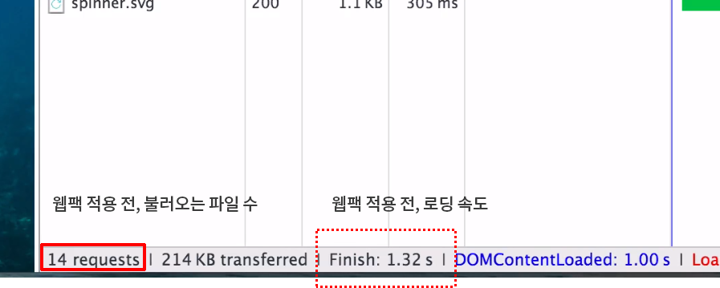<br />	
		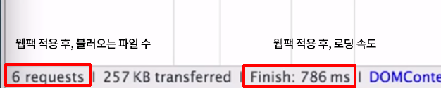<br />	
<br />

- **WEBPACK(웹팩) AN AHEAD OF TIME COMPILER FOR THE BROWSER**(브라우저를 위한 사전 컴파일러)
	- WEBPACK Common Misconception : It's **Not** Just For Javascript<br />: **웹팩**은 자바스크립트만을 위한 게 아닌 **웹 페이지를 구성하는 자원과 관계된 도구**
<br />

- 이전의 웹 개발자들은 Gulp 사용법을 인지한 후 작업(웹 개발자의 몫)을 진행했었다.<br />웹팩은 Gulp처럼 스크립트를 짜는 것이 아니라 설정 방법에 대해 알고 작업을 진행하면 된다<br />때문에 훨씬 더 수월하게 웹 애플리케이션 또는 간단한 웹 자동화 뿐 아니라 모듈 번들러라는 결과와 모듈 관리까지 포함해서 더 진행할 수 있다.<br >즉, **웹팩으로 하는 것이 간결하고 성능이 보장되어 현대 모던 웹에 적합한 개발 방식**이다.
	- 웹 자동화 도구 Gulp(걸프) [바로가기](https://gulpjs.com/)
<br />

- 웹팩은 진입점이 하나만 들어가면 된다.
	- 진입점이 하나만 주어줬을 떄 나머지의 연관 관계된 것은 웹팩에서 다 해석하겠다.
		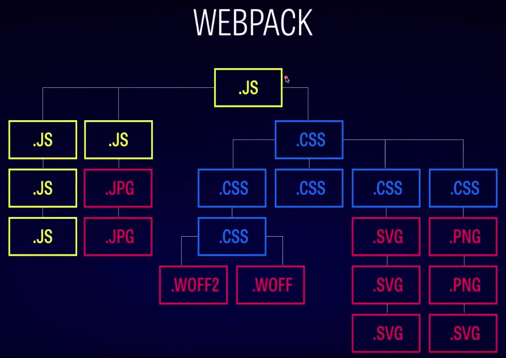<br />	
<br />

### 1.2. 모듈이란?
모듈이란 프로그래밍 관점에서 특정 기능을 갖는 작은 코드 단위를 의미한다.<br />
자바스크립트로 치면 아래와 같은 코드가 모듈이다.    
  - export 코드는 ES6의 Modules 문법을 사용했다.<br />  문법 참고사이트: https://babeljs.io/docs/en/learn#modules
	- **모듈의 특징은 다른 모듈에서 활용할 수도 있고 모듈들을 합쳐 하나의 모듈로 만들 수도 있다**
```javascript
// math.js  
function sum(a, b) {
  return a + b;
}

function substract(a, b) {
  return a - b;
}

const pi = 3.14;

export { sum, substract, pi }
```
이 math.js 파일은 아래와 같이 3가지 기능을 갖고 있는 모듈이다.<br />
  1. 두 숫자의 합을 구하는 sum() 함수
  2. 두 숫자의 차를 구하는 substract() 함수
  3. 원주율 값을 갖는 pi 상수
이처럼 성격이 비슷한 기능들을 하나의 의미 있는 파일로 관리하면 모듈이 된다.
<br />

### 1.3. 웹팩에서의 모듈
**웹팩에서 지칭하는 모듈**이라는 개념은 위와 같이 자바스크립트 모듈에만 국한되지 않고 
**웹 애플리케이션을 구성하는 모든 자원을 의미**한다.<br />
웹 애플리케이션을 제작하려면 HTML, CSS, Javascript, Images, Font 등 많은 파일들이 필요하다.<br />
이 파일 하나하나가 모두 모듈이다.
<br /><br />

### 1.4. 모듈 번들링이란?
아래 그림과 같이 웹 애플리케이션을 구성하는 몇십, 몇백개의 자원들을 
하나의 파일로 병합 및 압축 해주는 동작을 모듈 번들링이라고 한다.<br />
  - 빌드, 번들링, 변환 이 세 단어 모두 같은 의미이다
  <br />

<br /><br /><br />

## 2. Motivation
### 2.1. 웹팩이 필요한 이유
#### 2.1.1. 웹팩의 등장 배경
웹팩이 등장한 이유는 크게 3가지다.<br />
&nbsp;&nbsp;1. 파일 단위의 자바스크립트 모듈 관리의 필요성<br />
&nbsp;&nbsp;2. 웹 개발 작업 자동화 도구 (Web Task Manager)<br />
&nbsp;&nbsp;3. 웹 애플리케이션의 빠른 로딩 속도와 높은 성능<br />

#### 2.1.2. 파일 단위의 자바스크립트 모듈 관리
입문자 관점에서 고안된 자바스크립트는 아래와 같이 편리한 유효 범위를 갖고 있다.
```javascript
var a = 10;
console.log(a); // 10

function logText() {
  console.log(a); // 10
}
```
자바스크립트의 변수 유효 범위는 기본적으로 전역 범위를 갖는다.<br />
최대한 넓은 변수 범위를 갖기 때문에 어디에서도 접근하기가 편리하다.<br />
그런데 이러한 장점이 실제로 웹 애플리케이션을 개발할 때는 아래와 같은 문제점으로 변한다.
```html
<!-- index.html -->
<html>
  <head>
    <!-- ... -->
  </head>
  <body>
    <!-- ... -->
    <script src="./app.js"></script>
    <script src="./main.js"></script>
  </body>
</html>
```
```javascript
// app.js
var num = 10;
function getNum() {
  console.log(num);
}

// main.js
var num = 20;
function getNum() {
  console.log(num);
}
```
위와 같이 index.html에서 두 자바스크립트 파일을 로딩하여 사용한다고 적용하고<br />
스크립트에 아래와 같이 코드를 실행하면 getNum() 값은 20.<br />
```html
<!-- index.html -->
<html>
  <head>
    <!-- ... -->
  </head>
  <body>
    <!-- ... -->
    <script src="./app.js"></script>
    <script src="./main.js"></script>
    <script>
      getNum(); // 20
    </script>
  </body>
</html>
```
app.js에서 선언한 num 변수는 main.js에서 다시 선언하고 20을 할당했기 때문이다.<br />
이러한 문제점은 실제로 복잡한 애플리케이션을 개발할 때 발생하며, <br />
변수의 이름을 모두 기억하지 않은 이상 변수를 중복 선언하거나 의도치 않은 값을 할당할 수 있다.<br />
이처럼 *파일 단위로 변수를 관리하고 싶은 욕구, 자바스크립트 모듈화에 대한 욕구를 예전까진*<br />
*AMD, Common.js와 같은 라이브러리로 풀어왔다*.
<br /><br />

#### 2.1.3. 웹 개발 작업 자동화 도구
이전부터 프런트엔드 개발 업무를 할 때 가장 많이 반복하는 작업은<br />
텍스트 편집기에서 코드를 수정하고 저장한 뒤 브라우저에서 새로 고침을 누르는 것이었다<br />
그래야 화면에 변경된 내용을 볼 수 있었다<br />
<br />
이외에도 웹 서비스를 개발하고 웹 서버에 배포할 때 아래와 같은 작업들을 한다

	- HTML, CSS, JS 압축
	- 이미지 압축
	- CSS 전처리기 변환

이러한 일들을 자동화 해주는 도구들이 필요했다.<br />
그래서 Grunt와 Gulp 같은 도구들이 등장했다.
<br /><br />

#### 2.1.4. 웹 애플리케이션의 빠른 로딩 속도와 높은 성능
일반적으로 특정 웹 사이트를 접근할 때 5초 이내로 웹 사이트가 표시되지 않으면 
대부분의 사용자들은 해당 사이트를 벗어나거나 집중력을 잃게 된다.<br />
그래서 웹 사이트의 로딩 속도를 높이기 위해 많은 노력들이 있다.<br /> 
그 중 대표적인 노력이 브라우저에서 서버로 요청하는 파일 숫자를 줄이는 것이다.<br /> 
이를 위해 앞에서 살펴본 웹 태스크 매니저를 이용해 파일들을 압축하고 병합하는 작업들을 진행했다.<br />
뿐만 아니라 초기 페이지 로딩 속도를 높이기 위해 <br />
나중에 필요한 자원들은 나중에 요청하는 레이지 로딩(Lazy Loading)이 등장했다.<br />
**웹팩은 기본적으로 필요한 자원은 미리 로딩하는게 아니라 그 때 그 때 요청하자는 철학을 갖고 있다**
<br /><br /><br />

### 2.2. 웹팩으로 해결하려는 문제 4가지
웹팩의 등장 배경에서도 살펴봤지만 웹팩에서 해결하고자 하는 기존의 4가지의 문제점이 있다.<br />
&nbsp;&nbsp;- 자바스크립트 변수 유효 범위<br />
&nbsp;&nbsp;- 브라우저별 HTTP 요청 숫자의 제약<br />
&nbsp;&nbsp;- 사용하지 않는 코드의 관리<br />
&nbsp;&nbsp;- Dynamic Loading & Lazy Loading 미지원<br />

#### 2.2.1. 자바스크립트 변수 유효 범위 문제
- 웹팩은 변수 유효 범위의 문제점을 ES6의 Modules 문법과 웹팩의 모듈 번들링으로 해결한다.
- ES6의 Modules 문법 : https://babeljs.io/docs/en/learn#modules

#### 2.2.2. 브라우저별 HTTP 요청 숫자의 제약
TCP 스펙에 따라 브라우저에서 한 번에 서버로 보낼 수 있는 HTTP 요청 숫자는 제약되어 있다.<br />
아래의 표는 최신 브라우저 별 최대 HTTP 요청 횟수이다.<br />
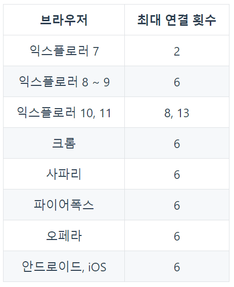<br />
HTTP 요청 숫자를 줄이는 것이 웹 애플리케이션의 성능을 높여줄 뿐만 아니라 
사용자가 사이트를 조작하는 시간을 앞당겨 줄 수 있다.
	- 클라이언트에서 서버에 HTTP 요청을 보내기 위해서는 먼저 TCP/IP가 연결되어야 한다
웹팩을 이용해 여러 개의 파일을 하나로 합치면 위와 같은 브라우저별 HTTP 요청 숫자 제약을 피할 수 있다.
<br />

#### 2.2.3. Dynamic Loading & Lazy Loading 미지원
Require.js와 같은 라이브러리를 쓰지 않으면 *동적으로 원하는 순간에 모듈을 로딩하는 것이 불가능(라이브러리로 대체)* 했다. 
그러나 이젠 웹팩의 **Code Splitting 기능을 이용하여 원하는 모듈을 원하는 타이밍에 로딩**할 수 있다.

<br /><br /><br />

## 3. Node.js와 NPM
웹팩을 사용하기 위해서는 Node.js와 NPM이 컴퓨터에서 설치되어 있어야 한다.<br />
그리고 이 도구들에 대해 어느 정도 배경 지식이 있으면 웹팩을 다루는데 도움이 된다.<br />
<br />

### 3.1. Node.js
- Node.js는 브라우저 밖에서도 자바스크립트를 실행할 수 있는 환경을 의미한다.
- Node.js가 나오기 전까지는 자바스크립트가 브라우저의 동작을 제어하는데 사용되었고 브라우저에서만 실행할 수 있었지만 이제는 **Node.js로 자바스크립트를 브라우저 밖에서도 실행**할 수 있게 되었다.
- node.js 파일은 **LTS 버전으로 설치**
<br />

### 3.2. NPM 소개
- NPM = Node Package Manager
- 공식문서 = https://www.npmjs.com
- npm은 자바스크립트 프로그래밍 언어를 위한 패키지 관리자<br />
(자바스크립트 라이브러리를 관리해주는 도구)
- NPM 사이트는 전세계 모든 자바스크립트 라이브러리(jQuery, tensorflow 등)들을 관리
	- 공개저장소
	- 검색해서 모든 자바스크립트 라이브러리를 확인할 수 있다
		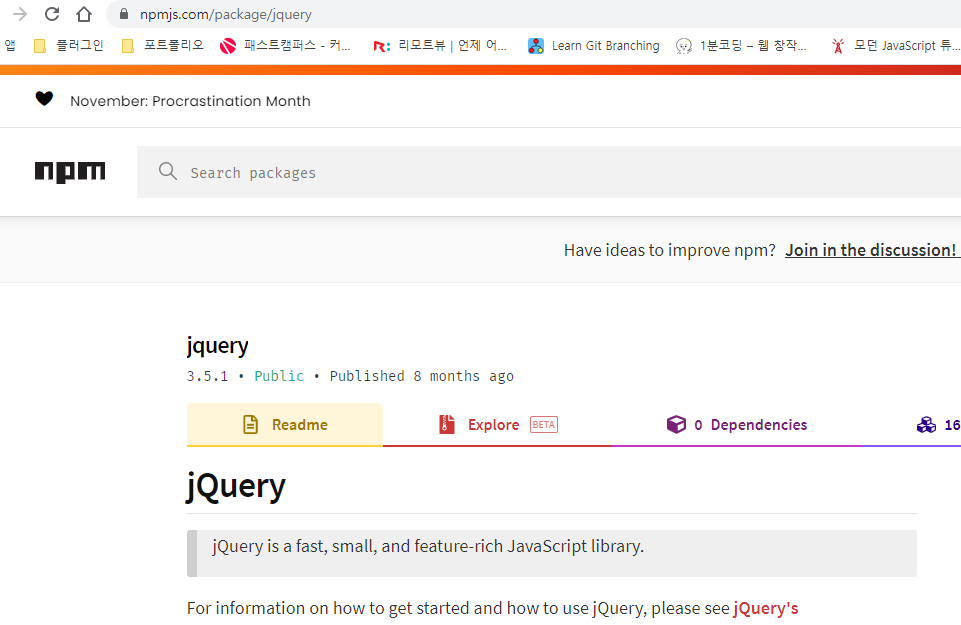<br />
<br />

### 3.3. NPM 시작하기
1. 터미널 창에서 node 버전과 npm 버전을 명령어를 입력하여 확인
	```
	node -v    // node 버전
	npm -v     // npm 버전
	```
	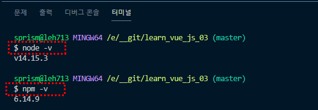<br />
	<br />
2. powersell 로 되어 있을 경우, 해당 버전 확인이 안 되는 경우가 있다.<br />
(https://github.com/eunhye8767/learn_vue_js_01 - 10.3번 참고)

3. npm 폴더를 만들고 open in Terminal 클릭<br />
	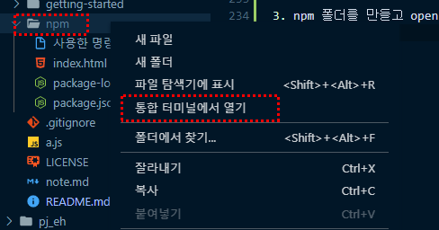<br />

4. 터미널에서 경로가 해당 npm 폴더로 바뀐 것을 확인할 수 있다<br />
	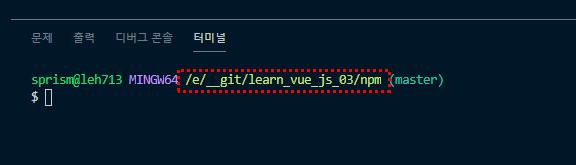<br />

5. [ 터미널 ] npm init 명령어 실행
<br />

### 3.4. NPM 초기화 명령어 - init
1. [ 터미널 ] npm init 명령어 실행
2. 1번 영역 참고, package name(프로젝트 이름 등), version, decription 등 항목별로 입력하라는 메세지가 보여진다<br />2번 영역 참고, 입력한 값이 맞는 지 한 번더 명시해준다.<br />3번 영역 참고, 이대로 진행할 건지 마지막으로 물어본다.<br />
	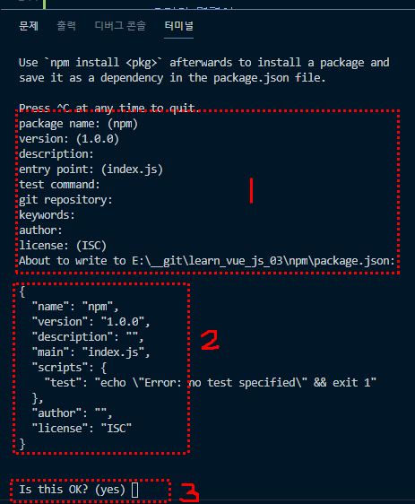<br />

3. 물음에 답을 하면 생성한 npm 폴더 안에 package.json 파일이 생성되고 그 안에 내가 입력한 값(2번 영역)들이 기재되어 있다.<br />
	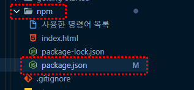<br />
	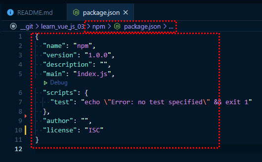<br />

4. 생성된 package.json 파일을 삭제한다
5. [ 터미널 ] npm init -y 명령어를 입력한다
	- npm init -y 명령어는 package name, version 등 항목별로 입력하는 란을 기본값으로 지정한 후 자동으로 package.json 파일까지 생성한다.<br />
	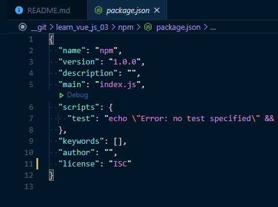<br />
	<br />

### 3.5 NPM 설치 명령어 - install
1. jquery 를 설치해본다
2. [ 터미널 ] npm install jquery 명령어 입력
	- 설치 명령어 : npm install *** 
3. npm 폴더 안에 nodo_modules/jquery 폴더가 생성되었다<br />
	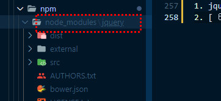<br />
4. 일반적으로 특정 라이브러리가 설치되었을 때에는 nodo_modulex 폴더 아래에 jquery 처럼 해당 폴더가 생성이 되고 그 폴더 아래에 파일들이 저장되어 있다
	- 설치된 라이브러리 폴더 안에 dist 폴더 안에서 파일이 확인이 된다
	- 설치 예시 : jquery/dist/jquery.js 
		- jquery.js 파일을 열면 버전 등의 정보 코드들을 확인할 수 있다<br />
			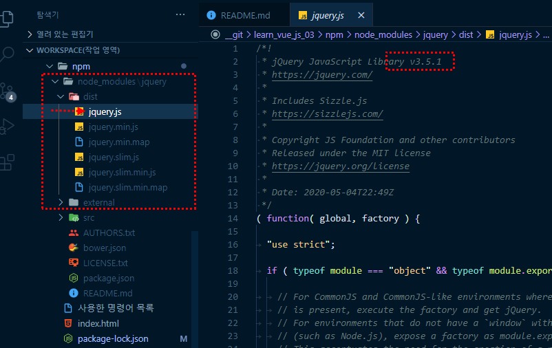<br />
		- **npm/package.json** 파일에서 설치된 **jquery 버전도 확인**할 수 있다<br />
			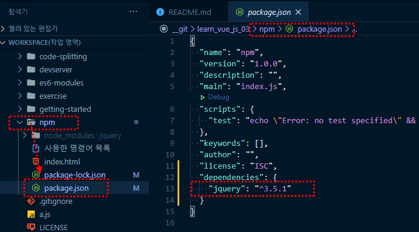<br />
<br />

### 3.6. NPM을 사용하는 이유
1. npm/package.json : **각각의 라이브러리 목록과 버전을 확인**할 수 있다.<br />
	- 각각의 라이브리별 버전 관리가 용이하다.<br />
	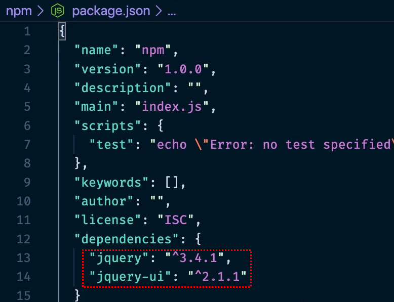<br />
2. 특정 라이브러리 검색하여 cdn 주소를 불러오지 않아도 **간편하게 명령어를 입력하여 해당 라이브러리 설치**가 가능하다.
	- 예: npm install jquery-ui / npm install jquery
<br />

## 4. NPM(Node Package Manager)
### 4.1. NPM 지역 설치 명령어와 제거 명령어 - uninstall
1. npm install gulp 명령어를 입력하여 gulp를 설치한다
	- npm/package.json 파일에 해당 라이브러리가 설치된 것을 확인할 수 있다<br />
	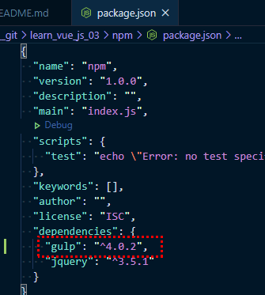<br />
2. 설치가 완료된 후에 npm uninstall gulp 명령어를 입력하여 삭제한다
	- npm/package.json 파일에서 해당 라이브러리가 삭제된 것을 확인할 수 있다<br />
	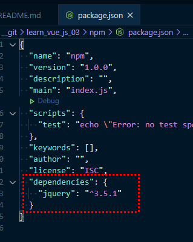<br />
	<br />

### 4.2. NPM 전역 설치 명령어 - install --global
1. install 뒤에 설치옵션(실행옵션) --global 을 넣어본다
	```
	npm install gulp --global
	```
2. permission 에러로 설치가 안되면 sudo 를 추가하여 명령어를 입력한다
	```
	sudo npm install gulp --global
	```
3. 설치가 완료되면 **라이브러리명@버전**을 확인할 수 있다.
	- 스펠링을 잘못기재하여 전혀 다른 라이브러리를 설치할 수 있으니 해당 부분을 확인한다
	- 쓰이지 않는 라이브러리의 경우 버전이 낮기 때문에 해당 부분을 확인한다
	<br />
4. npm install gulp 로 설치했을 때엔 npm/node_modules 폴더에 해당 설치된 라이브러리의 폴더가 자동 생성되었었는데 **--global 옵션으로 설치했을 때앤 node_modules 폴더에 해당 라이브러리의 폴더가 생성되지 않는다.**
5. 설치가 완료된 gulp 명령어를 입력한다
	- 시스템 상에서 명령어를 인식할 수 있게 제공하는 라이브러리들이 몇 개 있는데 그 중에 하나가 gulp 이다.
	```
	gulp
	```
	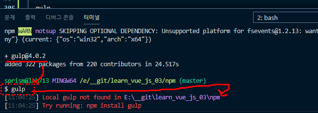<br />
<br />

### 4.3. 전역으로 설치된 라이브러리 경로 확인
1. NPM 전역 설치 경로
	- --global 옵션 명령어로 설치된 라이브러리는 OS에 따라 해당 폴더 경로에 설치된다
	```
	# window
	%USERPROFILE%\AppData\Roaming\npm\node_modules

	# mac
	/usr/local/lib/node_modules
	```
	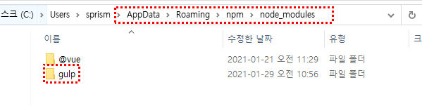<br />
2. 시스템에서 그 라이브러리를 제공하는 CLI, 명령어 인식 기능들을 활용하기 위해서 --global를 설치한다.
<br />

### 4.4. 지역 설치와 전역(--global) 설치 비교 정리
- **NPM 지역 설치**
	- NPM 초기화 명령어로 package.json 파일을 생성하고 나면 해당 프로젝트에서 사용할 자바스크립트 라이브러리를 설치하게 된다. 이때 명령어로는 아래와 같다.
		```
		npm install jquery --save-prod
		```
	- 지역 설치 명령어의 경우 명령어 옵션으로 **--save-prod를 붙이지 않아도 동일한 효과**가 난다<br />(--save-prod 생량 가능)
	- **install 대신 i 를 사용**해도 된다
		```
		npm i jquery
		```
	- npm install 명령어로 라이브러리를 설치하면 **해당 프로젝트의 node_modules 라는 폴더가 생성**된다. 그리고 그 폴더 아래에 해당 라이브러리 파일들이 설치되어 있는 것을 확인할 수 있다.
	<br />
- **NPM 전역 설치**
	- NPM 전역설치는 지역설치처럼 프로젝트에서 사용할 라이브러리를 불러올 때 사용하는 것이 아니라 **시스템 레벨에서 사용할 자바스크립트 라이브러리를 설치할 때 사용**한다.
		```
		npm install gulp --global
		```
	- 라이브러리가 설치되고 나면 이제 명령어 실행 창에 해당 라이브러리 이름을 입력했을 때 명령어를 인식한다
		```
		gulp
		```
	- 전역 설치 명령어 옵션 **--global 대신 -g 를 사용**해도 된다
	- 시스템 레벨의 폴더 경로에 저장이 된다. ([4.3. 참고](#43-전역으로-설치된-라이브러리-경로-확인))
<br />

### 4.5. 지역 설치 명령어 옵션 - --save-dev(-D)
- NPM 지역 설치 옵션 2가지
	- NPM 지역 설치에 자주 사용되는 2가지 옵션은 다음과 같다
		```
		npm install jquery --save-prod
		npm install jquery --save-dev
		```
	- 위 명령어를 축약할 수 있다
		```
		npm i jquery
		npm i jquery -D
		```
- **--save-dev 또는 -D 설치 옵션으로 명령어를 실행**했을 경우
	1. vue 라이브러리를 예시로 설치한다
		```
		npm install vue --save-dev

		// 축약형
		npm i vue -D
		```
	2. node_modulex 폴더 아래에 vue 폴더가 생성된 것을 확인할 수 있다
	3. npm/package.json 파일에서 devDependencies 객체에 vue가 추가된 것을 확인할 수 있다
		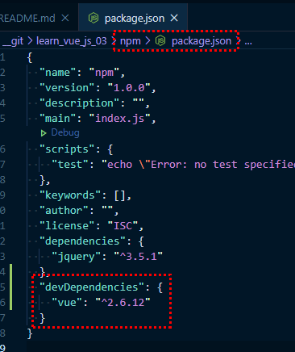<br />
<br />

### 4.6. dependencies와 devDependencies의 차이점
- **dependencies**
	- npm install 또는 npm i 로 설치했을 때 dependenices에 추가가 된다
	- 애플리케이션 로직(동작)을 구현하는 것에 연관이 있다 (= 화면의 로직과 직접적 연관)
		- 예1) jquery : 화면의 DOM을 조작하는 유틸성 라이브러리
		- 예2) jqeury-ui : 화면 DOM 동작을 도와주는 부가적인 라이브러리
	- dependencies 적용될 라이브러리 : vue, react, angular, chart 등

	<br />
- **devDependencies**
	- npm install --save-dev, npm install -D 로 설치했을 때 devDependencies에 추가가 된다<br />(install 은 i 로 축약 가능!!)
	- **개발을 할 때 도움을 주는 개발용 라이브러리**, 개발 보조 라이브러리 
	- devDependencies 적용될 라이브러리 : webpack, js-compression, sass 등
<br />

### 4.7. 개발용 라이브러리와 배포용 라이브러리 구분하기
- **NPM 지역 설치를 할 때 해당 라이브러리가 배포용(dependencies)인지 개발용(devDependencies)인지 꼭 구분**해주어야 한다.
	- 예를 들어, jqeury 와 같이 화면 로직과 직접적으로 관련된 라이브러리는 배포용으로 설치해야 한다.
	- 설치된 배포용 라이브러리는 npm run build 로 빌드를 하면 최종 애플리케이션 코드 안에 포함된다.
	```
	// 배포용 라이브러리 설치
	npm i jquery
	```
	```
	// package.json
	{
	  "dependencies": {
	    "jquery": "^3.4.1"
		}
	}
	```
- **설치된 개발용 라이브러리(devDependencies)는 빌드를 했을 때 애플리케이션에 포함되지 않는다.**
	- 반대로, 배포용 라이브러리(dependencies)에 필요없는 라이브러리가 들어가면서 빌드시간이 오래 걸리는 경우가 발생한다. **배포용과 개발용 라이브러리를 구분해서 적용**해주어야 한다.
- 예로, 라이브러리 [express](#https://www.npmjs.com/package/express) 를 봤을 때<br />Installation을 보면 npm install express 로 되어 있다. Installation 을 확인하여 설치하면 된다
- 라이브러리 별 안내 가이드에 따라 해도 되지만,<br />서비스 내 로직, 애플리케이션을 구현할 때 화면 조작에 직접적인 영향이 없으면 devDependencies 에 적용해도 된다.
<br />
<br />
<br />

## 5. 웹팩 시작하기
### 5.1. 웹팩 소개
- 웹팩이란 최신 프론트엔드 프레임워크에서 가장 많이 사용되는 모듈 번들러(Module Bundlier)이다. 
	- 모듈 번들러란 웹 애플리케이션을 구성하는 자원(HTML, CSS, Javascipt, images 등)을 모두 각각의 모듈로 보고 이를 조합해서 병합된 하나의 결과물을 만드는 도구를 의미한다.
		- 모듈이란?
			- 모듈이란 프로그래밍 관점에서 특정 기능을 갖는 작은 코드 단위
			- 예시) 자바스크립트 코드
				```javascript
				// main.js
				function sum(a, b) {
					return a + b;
				}

				function substract(a, b) {
					return a - b;
				}
				```
		- **모듈 번들링이란?**
			- 웹 애플리케이션을 구성하는 몇 십, 몇 백개의 자원들을 하나의 파일로 병합 및 압축해주는 동작을 모듈 번들링이라고 한다. (= 파일들을 하나로 합친다)<br />
				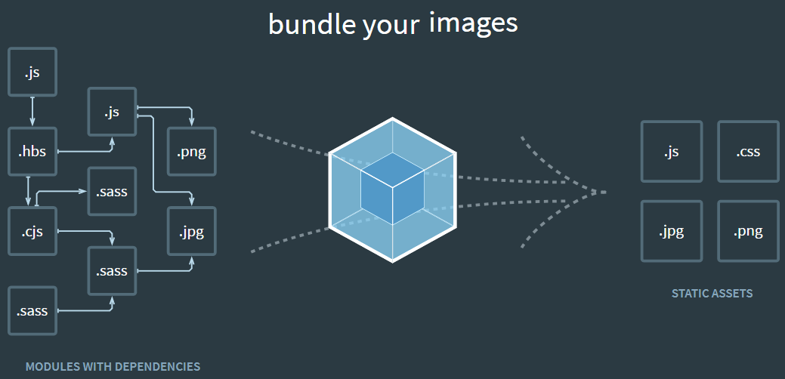<br />
			- 하나의 웹 서비스를 구성하는 모든 파일들을 해석한 후(파일들의 연결 관계를 파악) 그 파일들을 하나로 합쳐주는 것을 모듈 번들러 라고 이해하면 된다.
			- 빌드, 번들링, 변환 이 세 단어 모두 같은 의미이다.
<br />

### 5.2. 튜토리얼 파트 1 - 웹팩 적용 전
- 웹팩 맛보기 튜토리얼 :
	- [참고URL](https://joshua1988.github.io/webpack-guide/getting-started.html)
	- 웹팩을 가볍게 맛볼 수 있는 튜토리얼 진행
	- 튜토리얼로 웹팩을 실행할 수 있는 개발환경을 구성하고 빌드 과정을 경험해 볼 수 있을 것
<br />

- **개발 환경 구성**
	- Node.js LTS Version(버전 10이상)
	- NPM 버전 6 이상
<br />

#### 실습 절차 - 웹 페이지 자원 구성
1. 새폴더를 만들고 만든 폴더 기준으로 터미널 창을 연다<br />
	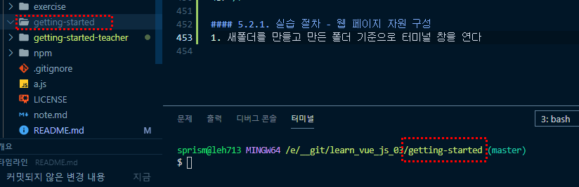<br />
2. npm init -y 명령어 입력, package.json 파일 자동 생성
3. 대부분의 프로젝트의 기본적으로 npm이 동반된다. npm init 또는 package.json 을 설정한다.
4. webpack, webpack-cli 를 설치한다 
	- -D 또는 --save-dev 옵션 설정으로 개발용 라이브러리로 설치한다
	- 개발용 라이브러리는 빌드 시 애플리케이션에 적용되지 않는다
	```
	npm i webpack webpack-cli -D
	```
5. webpack, webpack-cli 가 설치가 완료되면 package.json 파일 - devDependencies 객체에 추가된 것을 확인할 수 있다<br />
	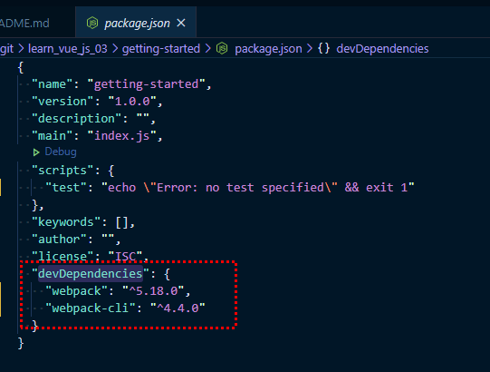<br />
6. lodash 도 설치한다 (배포용 라이브러리)
	- 설치가 완료되면 package.json 파일 - dependencies 항목에 추가된 것을 확인할 수 있다
	- lodash 라이브러리 : 자바스크립트 유틸리티 라이브러리
	```
	npm i lodash
	```
7. (새로 만든 폴더)프로젝트 루트 레벨에 index.html 파일을 만들고 아래 코드를 적용한다
	```html
	<html>
	  <head>
	    <title>Webpack Demo</title>
	    <script src="https://unpkg.com/lodash@4.16.6"></script>
	  </head>
	  <body>
	    <script src="src/index.js"></script>
	  </body>
	</html>
	```
8. (새로 만든 폴더)프로젝트 루트 레벨에 src 폴더를 생성하고 그 안에 index.js 파일 생성하고 아래 코드를 적용한다
	```javascript
	function component() {
	  var element = document.createElement('div');

	  /* lodash is required for the next line to work */
	  element.innerHTML = _.join(['Hello','webpack'], ' ');

	  return element;
	}

	document.body.appendChild(component());
	```
9. index.html 파일을 Live Server 로 실행한다.
<br />

### 5.3. 튜토리얼 파트 2 - 웹팩 적용 후
#### 실습 절차 - 웹팩 빌드를 위한 구성 및 빌드
1. 웹팩 빌드 및 빌드 결과물로 실행하기 위해 index.js, index.html 파일을 아래 코드로 변경한다.
	```javascript
	// index.js
	import _ from 'lodash';

	function component() {
	  var element = document.createElement('div');

	  /* lodash is required for the next line to work */
	  element.innerHTML = _.join(['Hello','webpack'], ' ');

	  return element;
	}

	document.body.appendChild(component());
	```
	```html
	<!-- index.html -->
	<html>
	  <head>
	    <title>Webpack Demo</title>
	    <!-- <script src="https://unpkg.com/lodash@4.16.6"></script> -->
	  </head>
	  <body>
	    <!-- <script src="src/index.js"></script> -->
	    <script src="dist/main.js"></script>
	  </body>
	</html>
	```
2. 위와 같이 적용을 하면 웹팩을 실행시킬 수 있는 상태가 되었기 때문에 scripts 라는 커스텀 명령어를 추가해서 build 라는 명령어를 실행해서 webpack 실행시키려고 한다
	- 웹팩 빌드 명령어를 실행하기 위해 package.json 파일에 아래 내용 추가
		```javascript
		"scripts": {
		  "build": "webpack"
		}
		```
3. npm run build 명령어 입력 후, index.html 페이지를 Live Server 로 확인한다
	```javascript
	npm run build
	```
4. 프로젝트 루트 폴더에 dist/main.js 파일이 생성된 것을 확인할 수 있다<br />
	- main.js 파일을 보면 코드가 한 줄로 길게 나열되어 적용된 것을 확인할 수 있다.<br />
	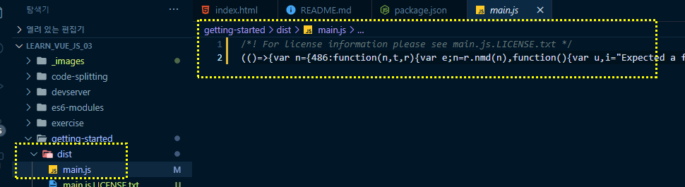<br />
	<br />

### 5.4. 튜토리얼 파트 3 - mode 적용
1. package.json 에 build: webpack 으로 저장한 후 npm run build 를 실행하게 되면 warning 문구를 볼 수도 있는데, 이것은 웹팩 3버전과 4버전의 차이로 이해하면 된다.
	- mode : 'developement' , 'production' , 'none'
	- 기본적으로 mode 는 'none' 으로 설정하여 진행할 예정이다. (수업진행방식)<br />
	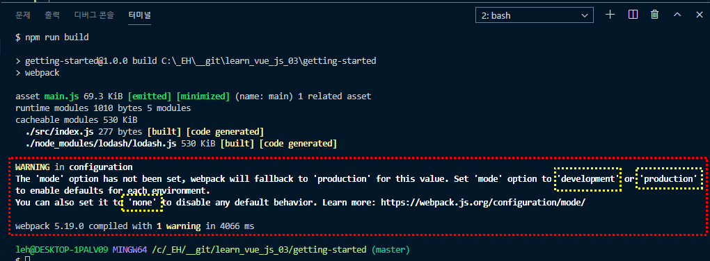<br />
2. [ package.json ] scripts - build: webpack 에 mode 값을 none로 적용한다
	- none 은 wabpack --mode=none 으로 적용
		```javascript
		"scripts": {
		  "build": "webpack --mode=none"
		}
		```
3. 빌드를 실행시킨다
	```
	npm run build
	```
4. **mode 를 none 으로 적용**하여 빌드를 실힝하면 
	1. **warning 문구가 사라진 것**을 확인할 수 있다.
	2. **dist/main.js 파일이 바뀐 것**을 확인할 수 있다.
		- 한줄로 길게 나열된 형태에서 아래와 이미지처럼 알아보기 쉽게 코드 정렬이 바뀐것을 확인할 수 있다<br />
		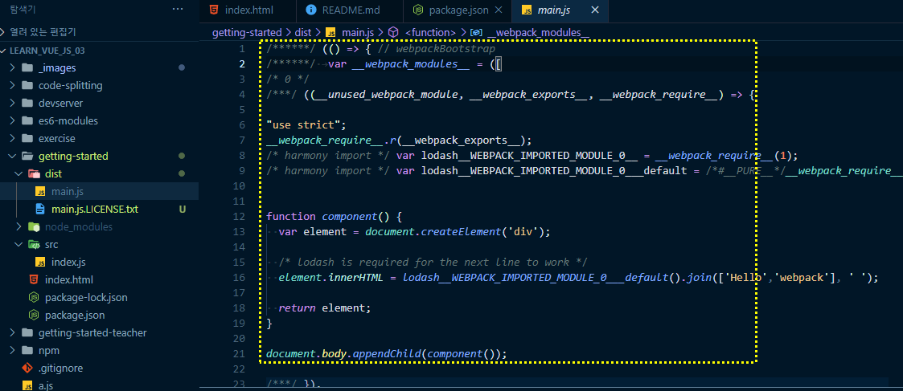<br />
<br />

### 5.5. 튜토리얼 파트 4 - 웹팩 설정 파일 적용
1. 위와 같이 설정을 하면 dist 폴더에 main.js 로 변환이 되었는데 dist 폴더가 아닌 다른 폴더에 설정하려고 할 떈 build에 한 줄로 계속 붙여 나가야 한다. (아래 코드 참고)
	- **웹팩을 사용하게 되면 많은 옵션들을 추가해야 하기 때문에 아래 코드처럼 한 줄로 관리하기엔 문제가 많다.**
	- 따라서, **한 줄로 관리하는 것이 아닌 웹팩 설정 파일을 이용하여 적용**한다.
	```javascript
	// package.json
	"scripts": {
	  "build": "webpack --mode=none --entry=src/index.js --output=public/output.js"
	}
	```
2. 프로젝트 **루트 폴더에 웹팩 설정 파일 webpack.config.js 을 생성**한다<br />
	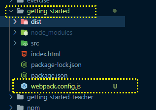<br />
3. [ webpack.congig.js ] 모듈 문법을 이용하여 파일을 작성한다.(아래 코드 적용)
	```javascript
	var path = require('path');

	module.exports = {
	  mode: 'none',
	  entry: './src/index.js',
	  output: {
	    filename: 'main.js',
	    path: path.resolve(__dirname, 'dist')
	  }
	};
	```
4. [ package.json ] build: 'webpack'로 변경한다.
	```javascript
	"build": "webpack"
	```
	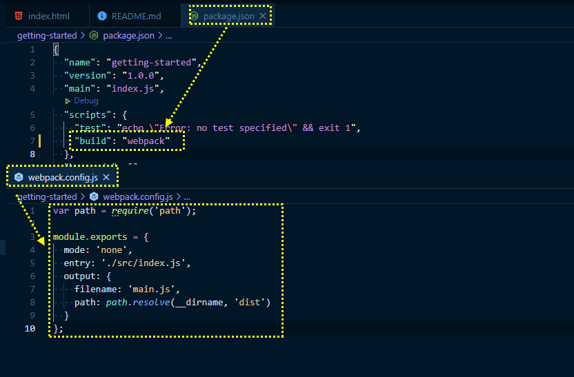<br />
5. 빌드를 실행시킨다
	```
	npm run build
	```
	<br />

### 5.6. 튜토리얼 파트 5 - 웹팩 설정 파일 설명
1. var path = require('path');
	- node js의 모듈 문법
	- path 라는 노드 js의 ptth 라이브러리를 들고와서 로딩해서 path 라는 변수에 담는다<br />
	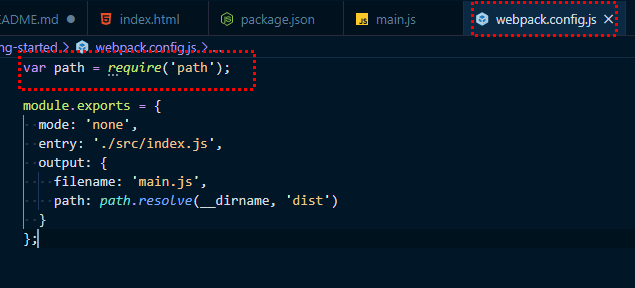<br />
2. path.resolve(__dirname, 'dist') 라는 API를 사용하게 된다<br />
	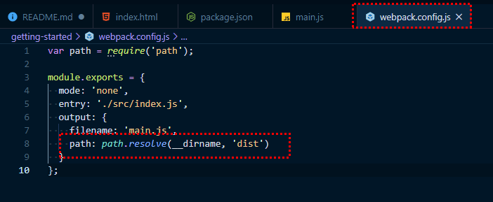<br />
3. node js 의 path 관련 설명 [공식문서 바로가기](https://nodejs.org/api/path.html#path_path_resolve_paths)
4. entry : 변환할 파일 대상
5. output : entry 파일을 어떤 경로에 저장할 것인가<br />
	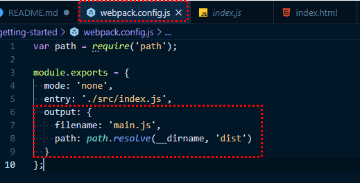<br />
<br />

### 5.7. 튜토리얼 파트 6 - 튜토리얼 소스 분석
1. [lodash join() API 문서](https://lodash.com/docs/4.17.15#join)
2. cdn 으로 불러온 lodash 라이브러리를 npm 으로 설치하여 index.html 파일을 수정하였다
	```html
	<!-- index.html -->
	<html>
	  <head>
	    <title>Webpack Demo</title>
	    <script src="https://unpkg.com/lodash@4.16.6"></script>
	  </head>
	  <body>
	    <script src="src/index.js"></script>
	  </body>
	</html>
	```
3. cdn 으로 불러온 lodash@4.16.6 스크립트 주소와 js/index.js 는 주석(삭제) 처리.
	```html
	<!-- index.html -->
	<html>
	  <head>
	    <title>Webpack Demo</title>
	    <!-- <script src="https://unpkg.com/lodash@4.16.6"></script> -->
	  </head>
	  <body>
	    <!-- <script src="src/index.js"></script> -->
	  </body>
	</html>
	```
4. src/index.js 파일에 설치한 lodash 라이브러리를 ES6 문법으로 import 한다
	- _ 라는 변수에 lodash 변수를 담았다
	- lodash 의 .join API를 이용하여 Hello webpack 문구를 화면에 노출한다
	```
	import _ from 'lodash';

	function component() {
	  var element = document.createElement('div');

	  /* lodash is required for the next line to work */
	  element.innerHTML = _.join(['Hello','webpack'], ' ');

	  return element;
	}

	document.body.appendChild(component());
	```
5. webpack.config.js 에 작성한 코드에 맞게 생성된 dist/main.js 를 인클루드 해준다.
	```html
	<!-- index.html -->
	<html>
	  <head>
	    <title>Webpack Demo</title>
	    <!-- <script src="https://unpkg.com/lodash@4.16.6"></script> -->
	  </head>
	  <body>
	    <!-- <script src="src/index.js"></script> -->
	    <script src="dist/main.js"></script>
	  </body>
	</html>
	```
<br />

### 5.8. 튜토리얼 파트 7 - 웹팩 변환 전후 결과 비교
1. 화면에 보여지는 출력 부분에 대해선 동일하다
2. [ 개발자 도구 ] 네트워크 패널 탭에서 확인을 해보면 requests 수가 다르다
	- 페이지 로딩 수의 차이
	- 웹팩으로 적용할 경우 하나의 js 파일에 합쳐져 로딩되는 것을 확인할 수 있다. 페이지 로딩 속도↑<br />
		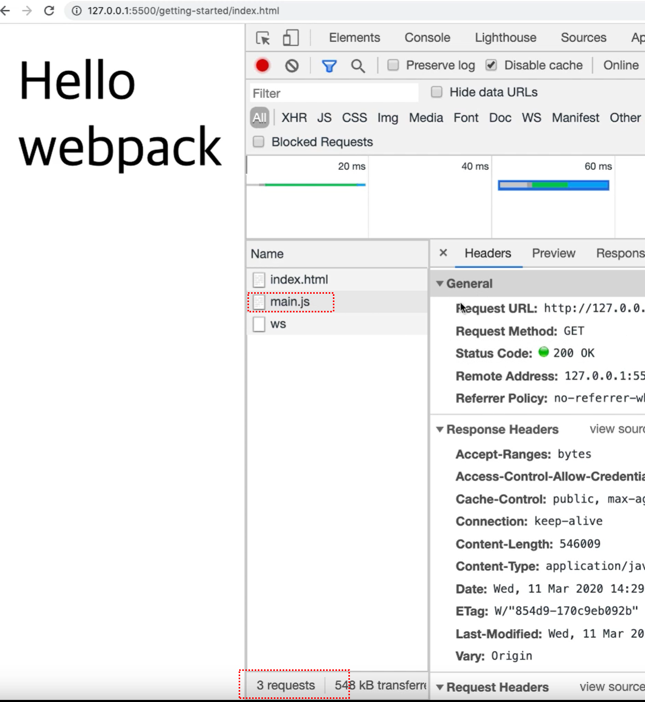<br />
	- cdn 등 기존 방식대로 js 라이브러리 소스를 불러오게 되면 라이브러리 수에 따라 로딩의 수도 많아지면서 페이지 로딩에 영향을 끼치게 된다.
		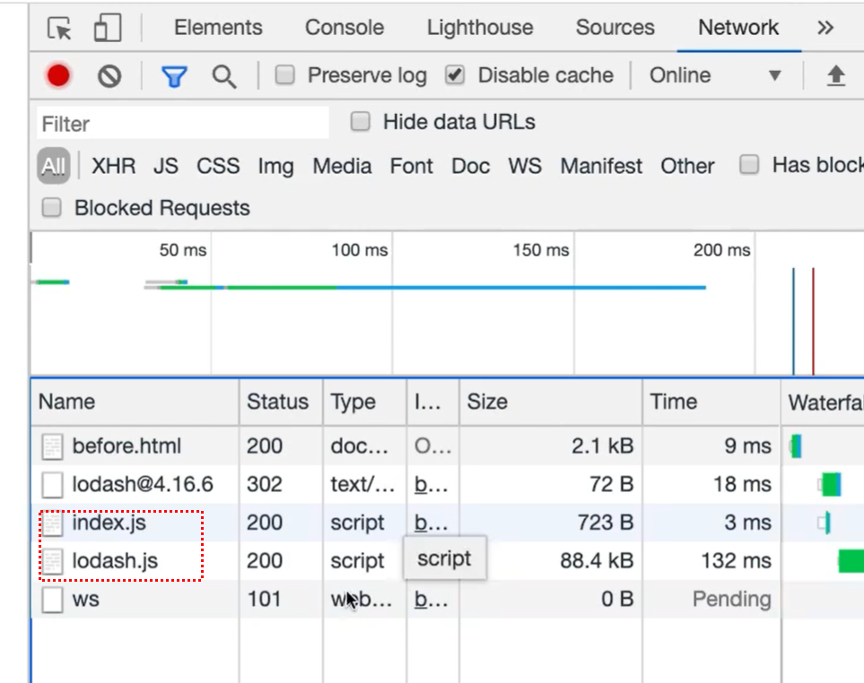<br />
		<br />

### 5.9. 튜토리얼 파트 8 - 웹팩 빌드 결과 파일 분석
- 웹팩에서 웹서비스를 구성하는 각각의 파일들 혹은 하나의 모듈들을 하나의 번호로 관리하는 것으로 볼 수 있다
	- 0 번은 컴포넌트 라고해서 index.js 의 코드가 적용된 부분이다<br />해당 영역에서 import 부분을 보면 var lodash ~~ webpack_require__(1) 을 볼 수 있다. 1번은 lodash 라이브러리의 내용임을 확인할 수 있다
		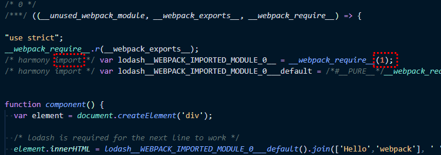<br />
	- 1 번은 lodash 라이브러리
		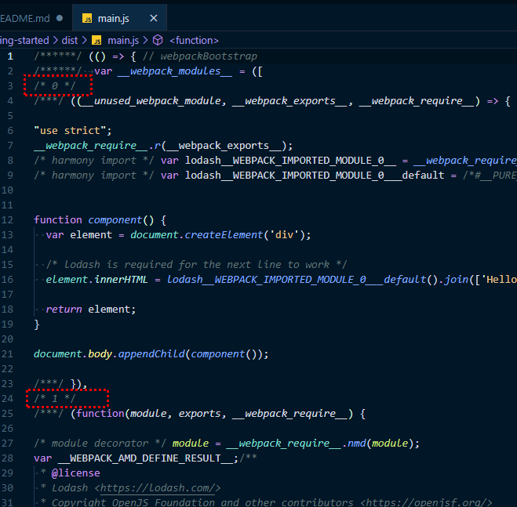<br />
- 즉시 실행 함수 표현식
	- [즉시 실행 함수 문서 바로보기](https://developer.mozilla.org/ko/docs/Glossary/IIFE)
	```javascript
	(function(){

	})()
	```
<br />
<br />
<br />

## 6. 바벨과 ES6 모듈 문법
### 6.1. 바벨 소개
- [바벨 공식 문서](https://babeljs.io/)
	- 공식 문서 사이트에서 변환이 안 될 경우,<br />Try it out 페이지, 왼쪽메뉴 중 FORCE ALL TRANSFORMS 체크<br />
		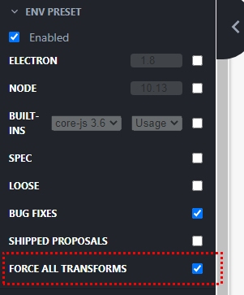<br />
	- 바벨 공식 문서 - Modules [자세히보기](https://babeljs.io/docs/en/learn#modules)
- 자바스크립트의 최신 문법들을 최대한 많은 브라우저가 호환할 수 있게 변환해주는 도구
<br />

### 6.2. ES6 Modules 문법
#### 모듈화 기능을 사용하기 위한 기본적인 import, export 문법
- **export 문법**
	- 다른 파일에서 가져다 쓸 변수나 함수의 앞에 export 라는 키워를 붙인다. 
	- export(익스폭트)된 파일은 import(임포트)로 불러와 사용할 수 있다.
	```javascript
	export 변수, 함수
	```
<br />

- **import 문법**
	- export(익스포트)된 변수나 함수를 {} 에 선언한 뒤 해당 파일이 있는 경로를 적어준다
	```javascript
	import { 불러올 변수 또는 함수 이름 } from '파일 경로';
	```
	<br />

#### import & export 기본 예제
- 예제 1.
	- [math.js] pi 를 선언하고 export 로 꺼냈다. 
	- [app.js] ./math.js 파일의 변수 pi를 불러온다.
	- 자바스크립트 별로 변수의 유효 범위가 구분이 된다. 모듈 차원에서의 관리가 수월해진다.
	```javascript
	// math.js
	export var pi = 3.14;

	// app.js
	import { pi } from './math.js';
	console.log(pi);  // 3.14
	```
	<br />

- 예제 2.
	- [math.js] 선언한 함수 sum을 export로 꺼내고 [app.js] 에서 sum 함수를 불러와서 실행
	```javascript
	// math.js
	export var pi = 3.14;
	export function sum(a,b) {
		return a + b;
	}

	// app.js
	import { sumb } from './math.js';
	sum(10, 20)   // 30
	```
<br />

### 6.3. ES6 Modules 실습
#### 실습 폴더 : ./es6-modules
1. 프로젝트 루트 폴더 기준, 라이브러리를 설치한다.
	- 프로젝트 루트 폴더 기준, **npm i 명령어를 입력**하여 라이브러리를 설치한다
		```javascript
		npm i
		```
	- 기본적으로 [pagckage.json] **devDependencies 속성에 정의되어 있는 라이브러리가 설치**된다.<br />
		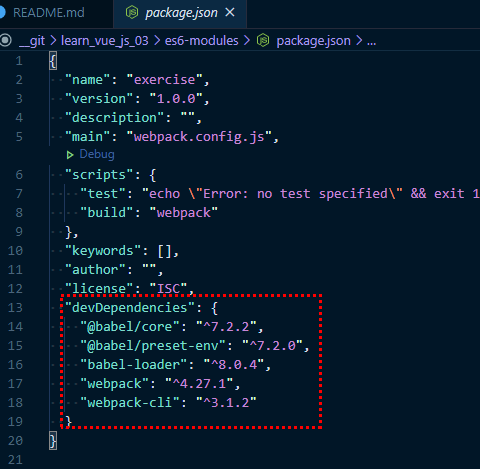<br />
<br />

2. [math.js] sum() 함수 구현 후 export 하세요.
	```javascript
	// math.js
	export function sum(a, b) {
	  return a + b;
	}
	```
<br />

3. [app.js] 두 숫자의 합을 구하는 sum 함수를 import하여 콘솔에 찍어보세요.
	- 문법 : import { 불러올 기능 or 변수 } from '파일의 위치'
	- import 문법에서 파일 경로를 먼저 입력하면 { 변수 / 함수 } 를 입력할 때 첫번째 스펠링만 입력해도 해당 변수/함수와 관련된 문구가 자동완성이 된다.<br />
		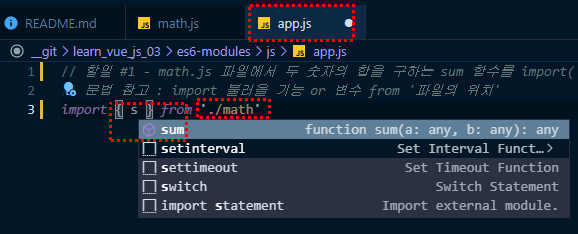<br />
		```javascript
		// app.js
		import { sum } from './math'
		console.log('10 + 20 = ', sum(10,20));
		```
<br />

4. [package.json] scripts - build: "webpack"<br />
	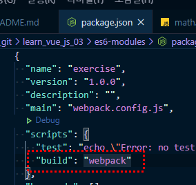<br />
	- [webpack.config.js] entry에 기재된 파일명이 output에 기재된 경로와 파일명으로 변환<br />
		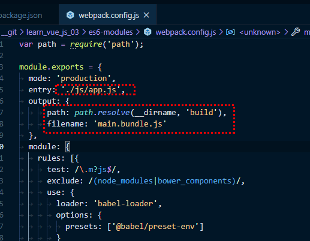<br />
	- **웹팩 속성 정의(/es6-modules/webpack.config.js 참고)**
		- mode : 중요하지 않다. 버전 3과 4의 차이점
		- entry : 빌드를 할 대상 파일을 정의
		- output : (빌드를 하고난 후)웹팩으로 변환을 하고 난 후의 결과물에 대한 정보 정의
		- module : entry 에서 output 으로 변환을 할 때 중간에 개입하는 것이 module
<br />

5. 빌드를 실행시킨다
	```
	npm run build
	```
	<br />

6. index.html 파일을 실행하면 함수로 정의한 콘솔 로그가 찍힌 것을 확인할 수 있다.<br />
	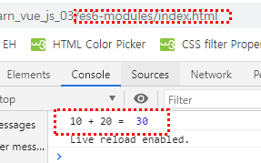<br />
<br />

### 6.4. ES6 Modules 빌드 결과물 분석 - sourcemap
1. 콘솔 로그를 보면 app.js 파일로 확인이 된다
	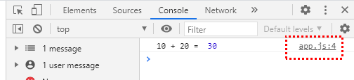<br />
2. 하지만 [개발자도구 - 네트워크 패널] 에서 보면 main.bundle.js 파일만 불러오는 것을 확인할 수 있다.
	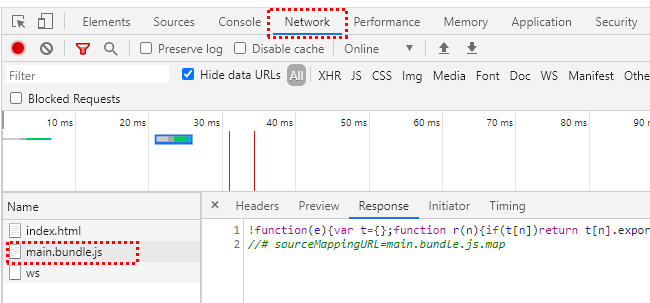<br />
3. **웹팩에서 기본적으로 제공하는 기능으로 콘솔를 찍었을 때 원본 파일로 연결**이 된다
4. [webpack.config.js] devtool: 'source-map' 적용
	- **source-map** 외에 여러 유형들이 있는데, 그 값을 적용하면 빌드한 결과물과 빌드되기 전의 결과물을 연결해주는 그런 기능이 생기게 된다. 꽤 유용한 기능이고 앞으로 매번 마주치게 될 기능이다.
		```javascript
		module.exports = {
		  devtool: 'source-map'
		};
		```
	- surce-map 을 입력하면 콘솔 로그에서 보여진 app.js 파일을 sorce 패널탭 하단에서 어떤 파일로 빌드되었는 지에 대한 정보를 확인할 수 있다.
		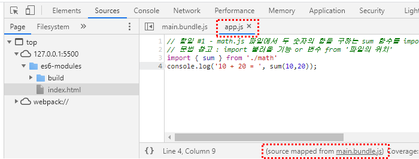<br />
<br />
<br />
<br />

## 7. 웹팩의 주요 속성 4가지
- 참고자료 [바로가기](https://joshua1988.github.io/webpack-guide/concepts/overview.html)
<br />

### 7.1. 웹팩 주요 속성 소개
#### 웹팩의 4가지 주요 속성
웹팩의 빌드(파일 변환) 과정을 이해하기 위해서는 아래 4가지 주요 속성에 대해서 알고 있어야 한다
1. entry
2. output
3. loader
4. plugin
<br />

### 7.2. entry
- 웹팩에서 **웹 자원을 변환하기 위해 필요한 최초 진입점이자 자바스크립트 파일 경로**이다.
	- **빌드 = 변환, 컴파일, 번들링 같은 뜻**이다.
- 기본적으로 **entry 라는 속성을 이용해 파일 경로를 설정**한다.
	```javascript
	// webpack.config.js
	module.exports = {
	  entry: './src/index.js'
	}
	```
	<br />

#### 7.2.1. Entry 파일에는 어떤 내용이 들어가야 하나?
entry 속성에 지정된 파일에는 웹 애플리케이션의 전반적인 구조와 내용이 담겨져 있어야 한다. 웹팩이 해당 파일을 가지고 웹 애플리케이션에서 사용되는 모듈들의 연관 관계를 이해하고 분석하기 때문에 애플리케이션을 동작시킬 수 있는 내용들이 담겨져 있어야 한다. 예를 들어, 블로그 서비스를 웹팩으로 빌드한다고 했을 때 코드의 모양은 아래와 같을 수 있다.
```javascript
// index.js
import LoginView from './LoginView.js';
import HomeView from './HomeView.js';
import PostView from './PostView.js';

function initApp() {
  LoginView.init();
  HomeView.init();
  PostView.init();
}

initApp();
```
위 코드는 해당 서비스가 싱글 페이지 애플리케이션이라고 가정하고 작성한 코드이다. 사용자의 로그인 화면, 로그인 후 진입하는 메인 화면, 그리고 게시글을 작성하는 화면 등 웹 서비스에 필요한 화면들이 모두 index.js 파일에서 불려져 사용되고 있기 때문에 웹팩을 실행하면 해당 파일들의 내용까지 해석하여 파일을 빌드해줄 것이다.<br />
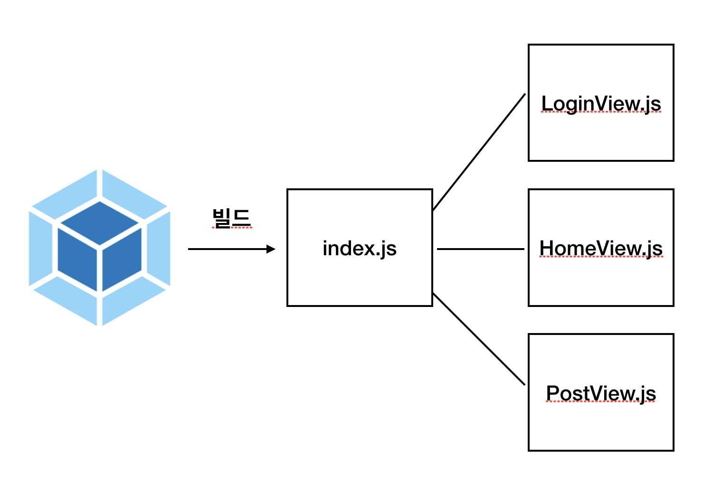<br />
위와 같이 모듈 간의 의존 관계가 생기는 구조를 [디펜던시 그래프(Dependency Graph)](https://webpack.js.org/concepts/dependency-graph/)라고 한다
<br />
<br />

#### 7.2.2. Entry 유형
앞에서 살펴본 것처럼 **entry 포인트는 1개가 될 수도 있지만 아래와 같이 여러 개가 될 수도 있다**
```javascript
entry: {
  login: './src/LoginView.js',
  main: './src/MainView.js'
}
```
위와 같이 엔트리 포인트를 분리하는 경우는 싱글 페이지 애플리케이션이 아닌 특정 페이지로 진입했을 때 서버에서 해당 정보를 내려주는 형태의 멀티 페이지 애플리케이션에 적합하다.
<br />

### 7.3. output
- output 속성은 웹팩을 돌리고(변환,빌드) 난 **결과물의 파일 경로**를 의미한다.
	```javascript
	// webpack.config.js
	module.exports = {
	  output: {
	    filename: 'bundle.js'
	  }
	}
	```
	<br />

#### 7.3.1. Output 속성 옵션 형태
- 최소한 filename은 지정해줘야 하며 일반적으로 아래와 같이 path 속성을 함께 정의한다.
	- filename 속성 : 웹팩으로 빌드한 파일의 이름을 의미한다.
	- path 속성 : 해당 파일의 경로를 의미한다.
	- path 속성에서 사용된 path.resolve() 코드는 인자로 넘어온 경로들을 조합하여 유효한 파일 경로를 만들어주는 Node.js API 이다.
	- ./dist : dist 폴더를 생성하여 해당 경로로 저장한다
	```javascript
	// webpack.config.js
	var path = require('path');

	module.exports = {
	  output: {
	    filename: 'bundle.js',
	    path: path.resolve(__dirname, './dist')
	  }
	}
	```
	- API가 하는 역할을 좀 더 이해하기 쉽게 표현하면 아래와 같다.
		```javascript
		output: './dist/bundle.js'
		```
	- path 라이브러리의 [자세한 사용법 바로가기](https://nodejs.org/api/path.html)
<br />

#### 7.3.2. Output 파일 이름 옵션
filename 속성에 여러 가지 옵션을 넣을 수 있다.
1. 결과 파일 이름에 entry 속성을 포함하는 옵션
	```javascript
	module.exports = {
	  output: {
	    filename: '[name].bundle.js'
	  }
	};
	```
2. 결과 파일 이름에 웹팩 내부적으로 사용하는 모듈 ID를 포함하는 옵션
	```javascript
	module.exports = {
	  output: {
	    filename: '[id].bundle.js'
	  }
	};
	```
3. 매 빌드시 마다 고유 해시 값을 붙이는 옵션
	```javascript
	module.exports = {
	  output: {
	    filename: '[name].[hash].bundle.js'
	  }
	};
	```
4. 웹팩의 각 모듈 내용을 기준으로 생생된 해시 값을 붙이는 옵션
	```javascript
	module.exports = {
	  output: {
	    filename: '[chunkhash].bundle.js'
	  }
	};
	```
이렇게 생성된 결과(빌드했을 때) 파일의 이름에는 각각 엔트리 이름, 모듈 아이디, 해시 값 등이 포함된다.<br />
<br />

항상 bundel.js로 변환이 되면 내부의 파일 내용과 관계가 없이 브라우저 캐싱 때문에 같은 파일을 화면에 뿌려주기 때문에 이거를 강제 새로고침해야하는 캐시를 비워줘야 하는 상황이 생긴다. <br />
따라서, **내용이 변환이 되었을 때에는 chunkhash(청크해시) 같은 것으로 고유값, 구분자를 줘서 이 파일이 변화가 되었다는 인식을 시키면서 사용자가 강제 새로고침하지 않아도 결과물을 잘 확인할 수 있게 하는 전략**이라고 할 수 있다.
<br />

### 7.4. loader
- 웹팩이 웹 애플리케이션을 해석할 때 자바스크립트 파일이 아닌 웹 자원(HTML, CSS, Images, 폰트 등)들을 변환할 수 있도록 도와주는 속성이다.
	- 엔트리나 아웃풋 속성과는 다르게 **module라는 이름을 사용**한다.
	```javascript
	// webpack.config.js
	module.exports = {
	  module: {
	    rules: []
	  }
	}
	```
<br />

### 7.5. 주요 속성을 이해하기 위한 두 번째 튜토리얼
- [참고 자료 - 튜토리얼 문서](https://joshua1988.github.io/webpack-guide/tutorials/code-splitting.html)
<br />

#### 7.5.1. 웹팩의 주요 4가지 속성을 이해하기 위해 간단한 실습
1. 실습할 code-splitting 폴더를 생성하고 해당 프로젝트 폴더 기준 터미널을 연다.
	- 강의 참고 자료 : code-splitting-teacher
	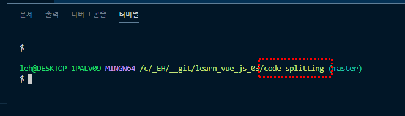<br />
	<br />

2. [터미널] npm init -y 명령어를 입력하여 package.json 파일 생성
	- 웹 서비스 프로젝트 진행, npm 기반으로 진행할 것으로 정의
<br />

3. [터미널] 실습에 필요한 라이브러리 설치(-D 옵션으로 설치)
	```
	npm i webpack webpack-cli css-loader style-loader mini-css-extract-plugin -D
	```
	- [터미널]에서 라이브러리가 설치되면 버전과 함께 확인할 수 있다
	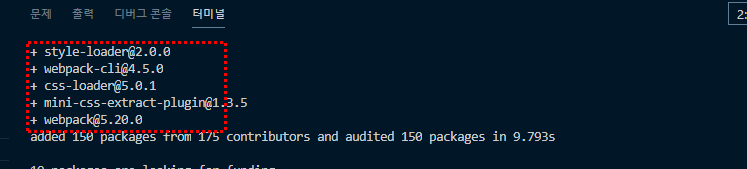<br />
	<br />

4. 프로젝트 루트 레벨에 index.html 파일을 생성하고 아래 내용 추가
	```html
	<!DOCTYPE html>
	<html>
	  <head>
	    <meta charset="utf-8">
	    <title>CSS & Libraries Code Splitting</title>
	  </head>
	  <body>
	    <header>
	      <h3>CSS Code Splitting</h3>
	    </header>
	    <div>
	      <!-- 웹팩 빌드 결과물이 잘 로딩되면 아래 p 태그의 텍스트 색깔이 파란색으로 표시됨 -->
	      <p>
	        This text should be colored with blue after injecting CSS bundle
	      </p>
	    </div>
	    <!-- 웹팩의 빌드 결과물을 로딩하는 스크립트 -->
	    <script src="./dist/bundle.js"></script>
	  </body>
	</html>
	```
	<br />

5. 프로젝트의 루트 레벨에 base.css 파일 생성 후 아래 내용 추가
	```css
	/* base.css */
	p {
	  color : blue;
	}
	```
	<br />

6. 프로젝트 루트 폴더에서 index.js 파일을 생성 후 아래 내용 추가
	- import './base.css' == base.css 파일을 들고 오겠다는 의미
	```javascript
	import './base.css';
	```
	<br />

7. 프로젝트 루트 레벨에 웹팩 설정 파일 webpack.config.js 추가
	- mode 속성은 웹팩 버전 4 이상에서 추가된 속성이다.<br />
	웹팩으로 빌드할 때의 development, production, none 모드를 설정할 수 있다.
	```javascript
	var path = require('path');

	module.exports = {
	  mode: 'none',
	  entry: './index.js',
	  output: {
	    filename: 'bundle.js',
	    path: path.resolve(__dirname, 'dist')
	  },
	  module: {
	    rules: [
	      {
	        test: /\.css$/,
	        use: ['style-loader', 'css-loader']
	      }
	    ]
	  },
	}
	```
	<br />

8. 위 1번~7번까지의 실습이 entry, output, module(= loader)에 관한 실습과정이다.

9. [package.json] "build": "webpack" 항목을 적용한다.
	```javascript
	// package.json
	"scripts": {
	  "build": "webpack"
	}
	```
	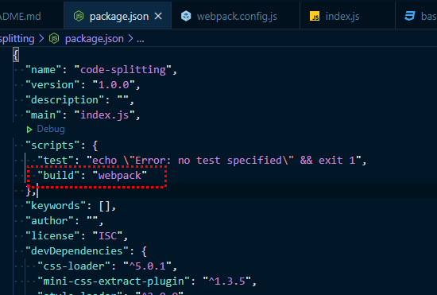<br />
	<br />

10. [터미널] 빌드를 실행시킨다
	```
	npm run build
	```
<br />

### 7.6. 두 번째 튜토리얼 - 웹팩 결과 로그 분석
1. npm run build 명령어를 입력하면 [터미널] 창에서 > webpack 을 볼 수 있는데, [package.json] build에 입력한 webpack이 실행된 것을 알 수 있다<br />
	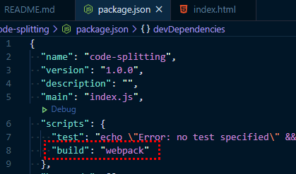<br />
2. webpack 버전과 시간 등 빌드 관련 로그를 [터미널] 창에서 확인할 수 있다
	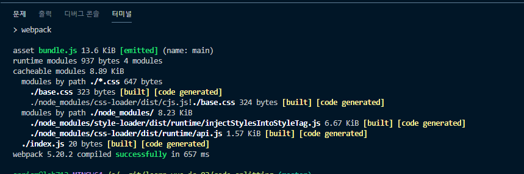<br />
	<br />
	
### 7.7. 두 번째 튜토리얼 - 브라우저에서 빌드 결과물 확인
1. 프로젝트의 index.html 파일을 열고 [개발자도구]로 확인을 해보면, p 태그에 스타일값이 적용된 것을 알 수 있다. 하지만 작업한 index.html 파일을 VS Code에서 확인해보면 style 값을 지정해주지 않았다.
	- index.js 파일에서 base.css 파일을 import 했다.
	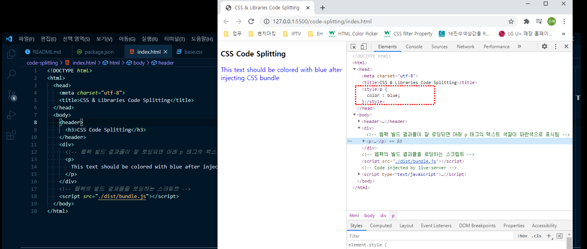<br />
2. [index.html] 에서 script - ./dist/bundle.js 을 주석 처리한다.
	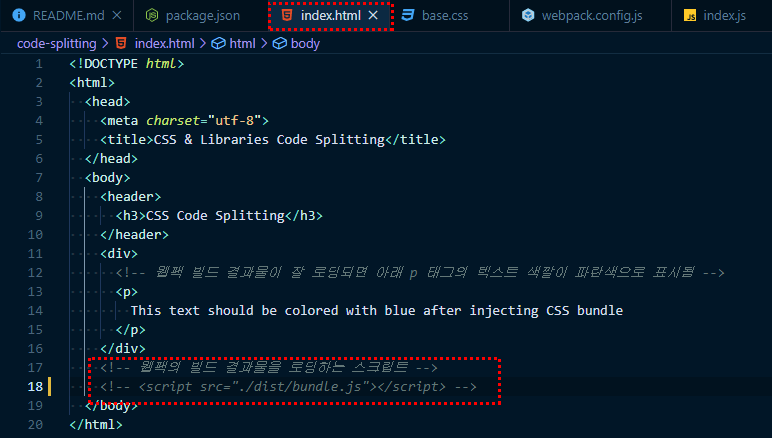<br />
3. [index.html] 을 확인하면 style 값이 사라진 것을 확인할 수 있다.
	- [./dist/bundle.js 파일 확인해보기](#78-두-번째-튜토리얼---웹팩-빌드-결과-파일-분석)<br />
	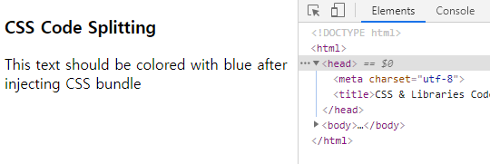<br />

### 7.8. 두 번째 튜토리얼 - 웹팩 빌드 결과 파일 분석
1. [./dist/bundle.js] <code>/* 0 */</code>에 적힌 숫자를 통해 몇 개의 모듈이 적용되어 있는 지 확인할 수 있다.<br />
	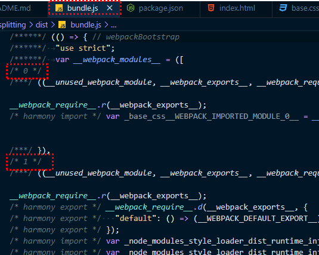<br />
2. [./dist/bundle.js] 파일을 쭉 보다보면 3번 모듈에서 p 태그와 관련 것을 확인할 수 있다.<br />
	- base.css 에서 작성한 css 코드가 bundle.js 파일에 적용되었다.
	- <code>p {\r\n  color : blue;\r\n}</code> 이것을 <b>loader(로더)</b>라고 한다.
	- <b>자바스크립트가 아닌 파일에 대해서 웹팩 안으로 변환할 수 있게 뭔가를 적용해주는 속성을 loader(로더)</b>라고 보면 된다.
	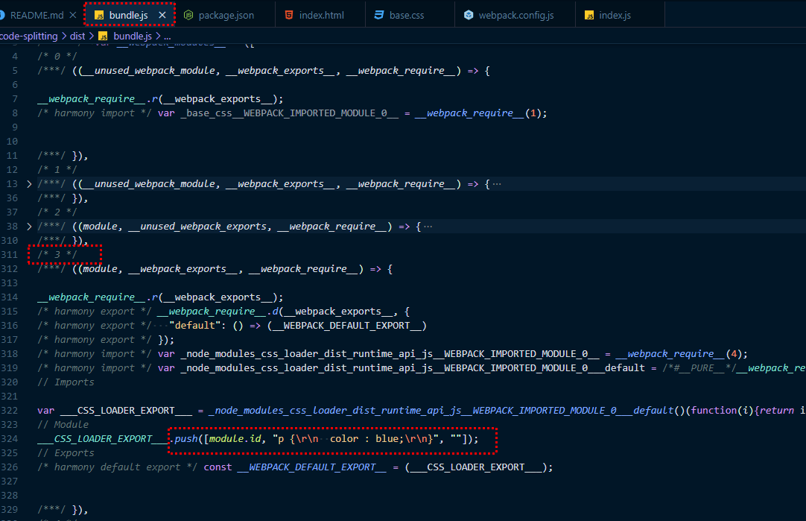<br />
	<br />

### 7.9. 두 번째 튜토리얼 - 웹팩 설정 파일 분석
1. 실습폴더 : code-splitting/webpack.config.js<br />
	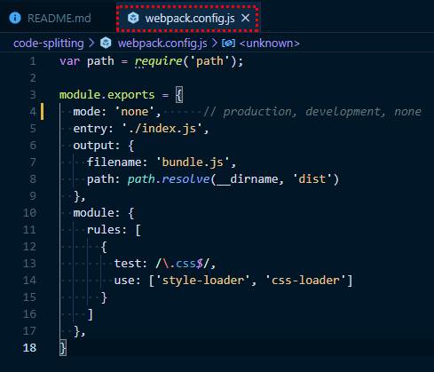<br />
	- <b>mode</b> : production, development, none
		- **production : 배포할 때엔 꼭! 써줘야한다**
		- development : 개발할 때 설정
		- none : 기본적으로 none 으로 설정
	- <b>entry</b> : 웹팩으로 **변환할 대상의 파일** 주소(경로)
		- "index.js 파일을 변환했다." 라고 해석
	- <b>output</b> : 변환한 파일을 **어느 경로에 적용할 것인 지 그 대상을 설정**한다
		- "dist 라는 폴더를 만들어서 bundle.js 파일을 생성한다." 라고 해석
		- <code>filename: '[name][chunkhash].js'</code> 처럼 파일이름을 적용할 수 있다.
		- <code>[chunkhash]</code>은 고유값으로 적용된다.<br />
		[자세히 보기(4번 참고)](#732-output-파일-이름-옵션)
	- <b>module</b> : module = loader
		- module 속성에 rules 객체를 추가하고 웹팩으로 변환할 때 적용될 loader(로더)들을 추가할 수 있다.
			- <b>rules 속성 아래에 추가되는 것이 규칙</b>이다.
			- <code>test: /\.css$/</code> .css 라는 확장자를 가진 파일을 대상으로 <code>use: ['style-loader', 'css-loader']</code>에 적용된 loader(로더)를 적용하겠다는 의미로 해석된다.
			```javascript
			module: {
			  rules: [
			    {
			      test: /\.css$/,
			      use: ['style-loader', 'css-loader']
			    }
			  ]
			}
			```
			- 바벨 적용을 한다고 가정했을 때, babel-loader 처럼 배열로 추가할 수 있다.
			```javascript
			module: {
			  rules: [
			    {
			      test: /\.css$/,
			      use: ['style-loader', 'css-loader']
			    },
			    {
			      test: /\.js$/,
			      use: ['babel-loader']
			    }
			  ]
			}
			```
<br />

### 7.10. 두 번째 튜토리얼 - 로더가 없는 경우의 에러 확인과 css 로더 적용
1. [webpack.config.js] module 부분을 주석처리한다.
	- loader(=module) 속성이 정의가 되지 않은 상태에서 npm run build를 실행하려고 한다.<br />
	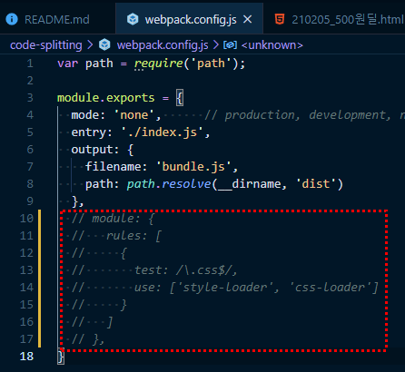<br />
	<br />

2. <code>npm run build</code> 명령어를 터미널창에 입력한다.
<br />

3. [터미널] loader 정의 없이 빌드를 실행할 경우, 오류(error)가 발생한다.
	- index.js 파일로 모듈을 시작한다
	- index.js에서 불러온 base.css 에서 에러가 발생했다<br />
	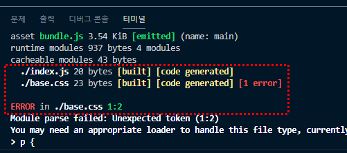<br />
	<br />

4. Moudle parse failed: Unexpected token(웹팩으로 변환하려고 했지만 변환할 수가 없다.)<br />
	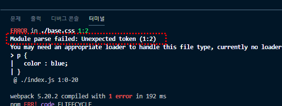<br />
	<br />

5. "loader(로더) 설정을 하세요" 라는 오류 메세지를 확인할 수 있다.
	- 적절한 loader를 설정해달라는 의미<br />
	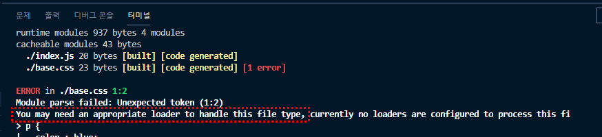<br />
	<br />

6. loader(로더)를 추가한 후, 빌드를 실행(<code>npm run build</code>)한다.
	- test: , use: 를 **아래 코드와 같이 적용**한다.
		```javascript
		// webpack.config.js
		module: {
		  rules: [
		    {
		      test: /\.css$/,
		      use: ['css-loader']
		    }
		  ]
		}
		```
		<br />

7. loader(로더) 추가 후, 빌드를 실행하면 에러는 나지 않는다.
	- ".css 파일을 해석할 수 있다는 의미"로 해석된다.<br />
	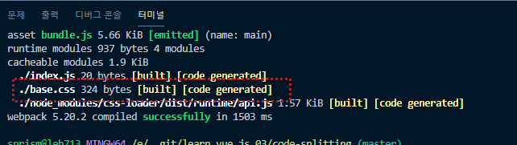<br />
	<br />

8. 프로젝트 - index.html 파일을 열면 잘 보이기는 하지만, p 태그에 css가 적용되지 않는 것으로 확인된다.
	- **css-loader 만 적용**하면, 웹팩 빌드에 대한 오류는 해결되지만 **프로젝트 html 파일에 css가 적용되지 않는 것으로 확인**된다.<br />
	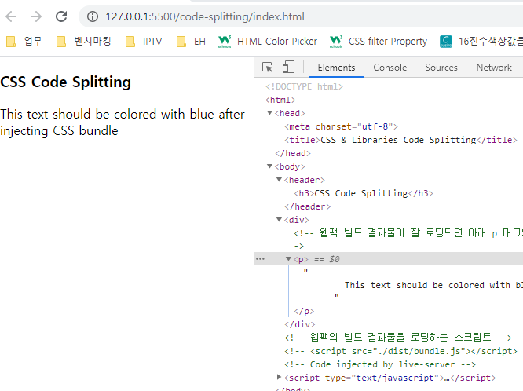<br />
<br />

### 7.11. 두 번째 튜토리얼 - 웹팩 로더 적용 순서와 style-loader
1. 웹팩에서 인식할 수 없는 자바스크립트가 아닌 파일 유형들에 대해서 loader를 적용해야 한다.
2. .css의 스타일값도 적용되게 webpack.confing.js를 수정한다
	- **'style-loader', 'css-loader' 순으로 무조건! 적용해야 한다**.
	- 반대로 'css-loader', 'style-loader' 기입할 경우 에러가 발생한다.
	```javascript
	// webpack.config.js
	module: {
	  rules: [
	    {
	      test: /\.css$/,
	      use: ['style-loader', 'css-loader']
	    }
	  ]
	}
	```
3. style-loader 를 적용하고 프로젝트 폴더의 index.html을 확인하면 정상적으로 작동되는 것을 확인할 수 있다.
4. **style-loader 의 역활**
	- 웹팩 안에 들어가는 스타일 코드(css-loader)를 **head 태그 안에 인라인 스타일로 적용**시켜준다.
	- **loader 는 오른쪽에서 왼쪽 순으로 적용**이 된다. 따라서 style-loader, css-loader 로 적용을 해야 한다.
		```javascript
		use: ['style-loader', 'css-loader']  // 오른쪽에서 왼쪽순으로 적용
		```
	- **sass를 적용해야할 경우**, sass-loader 를 오른쪽 끝에 먼저 써줘야 한다.
		```javascript
		test: /\.scss$/,
		use: ['style-loader', 'css-loader', 'sass-loader']
		```
<br />

### 7.12. 두 번째 튜토리얼 - 플러그인 적용 및 분석, 결과확인
1. CSS 파일을 별도로 분리하기 위해 MiniCssExtractPlugin 플러그인 설정 추가
	- MiniCssExtractPlugin 플러그인을 프로젝트 구성할 때에 설치하였기 때문에 require로 라이브러리를 불러온다
	- 아래 코드를 그대로 붙여넣기 한다.
	```javascript
	// webpack.config.js

	var path = require('path');
	// require로 라이브러리 불러오기
	var MiniCssExtractPlugin = require("mini-css-extract-plugin");

	module.exports = {
	  mode: 'none',
	  entry: './index.js',
	  output: {
	    filename: 'bundle.js',
	    path: path.resolve(__dirname, 'dist')
	  },
	  module: {
	    rules: [
	      {
	        test: /\.css$/,
	        use: [
	          { loader: MiniCssExtractPlugin.loader },
	          "css-loader"
	        ]
	      }
	    ]
	  },
	  plugins: [
	    new MiniCssExtractPlugin()
	  ],
	}
	```
	<br />

2. 플러그인은 새로운 객체를 생성해주는 형태로 적용한다.
	```javascript
	plugins: [
	  new MiniCssExtractPlugin()
	],
	```
	<br />

3. 플러그인 적용 후, 빌드를 실행하면 dist>main.css 파일이 생성된 것을 확인할 수 있다.
	- **플러그인 적용 전** dist 폴더<br />
		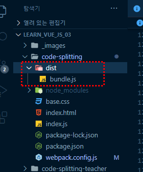<br />
		<br />
	- **플러그인 적용 후** dist 폴더<br />
		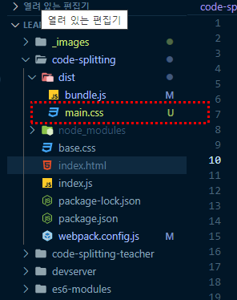<br />
		<br />

4. 프로젝트 폴더의 index.html 에 새로 생성된 main.css 파일을 적용한다
	```html
	<link rel="stylesheet" href="./dist/main.css">
	```
	<br />

5. webpack - plugins(웹팩의 플러그인)이란 것은 **결과물에 대한 정보를 바꾸거나 변형해줘서 우리에게 제공**해준다.
<br />

### 7.13 Plugin
- 플러그인(plugin)은 웹팩의 기본적인 동작에 추가적인 기능을 제공하는 속성이다.
	- VS Code에서 확장 프로그램 라이브러리를 설치하여 이용하는 것과 동일하게 생각하면 된다.
- 로더랑 비교하면 로더는 파일을 해석하고 변환하는 과정에 관여하는 반면, **플러그인은 해당 결과물의 형태를 바꾸는 역할**을 한다고 보면 된다.
- 플러그인은 아래와 같이 선언한다.
	```javascript
	// webpack.config.js
	module.exports = {
	  plugins: []
	}
	```
	<br />
- **플러그인의 배열에는 생성자 함수로 생성한 객체 인스턴스만 추가**될 수 있다.
- [예시 참고]
	- HtmlWebpackPlugin [자세히보기](https://webpack.js.org/plugins/html-webpack-plugin/) :<br />웹팩으로 빌드한 결과물로 HTML 파일을 생성해주는 플러그인
	- ProgressPlugin [자세히보기](https://webpack.js.org/plugins/progress-plugin/#root) :<br />웹팩의 빌드 진행율을 표시해주는 플러그인
	```javascript
	// webpack.config.js
	var webpack = require('webpack');
	var HtmlWebpackPlugin = require('html-webpack-plugin');

	module.exports = {
	  plugins: [
	    new HtmlWebpackPlugin(),
	    new webpack.ProgressPlugin()
	  ]
	}
	```
	<br />

#### 자주 사용하는 플러그인
- [split-chunks-plugin](https://webpack.js.org/plugins/split-chunks-plugin/)
- [clean-webpack-plugin](https://www.npmjs.com/package/clean-webpack-plugin)
- [image-webpack-loader](https://github.com/tcoopman/image-webpack-loader)
- [webpack-bundle-analyzer-plugin](https://github.com/webpack-contrib/webpack-bundle-analyzer)
<br />

### 7.14. 주요 속성 4가지 리뷰 및 정리
-	Entry 속성은 웹팩을 실행할 대상 파일. 진입점
- Output 속성은 웹팩의 결과물에 대한 정보를 입력하는 속성. 일반적으로 filename과 path를 정의
- Loader 속성은 CSS, 이미지와 같은 비 자바스크립트 파일을 웹팩이 인식할 수 있게 추가하는 속성.<br />로더는 오른쪽에서 왼쪽 순으로 적용
- Plugin 속성은 웹팩으로 변환한 파일에 추가적인 기능을 더하고 싶을 때 사용하는 속성.<br />웹팩 변환 과정 전반에 대한 제어권을 갖고 있음<br />
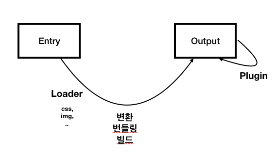<br />
- 위 속성 이외에도 resolve, devServer, devtool 속성에 대해 알고 있으면 좋다
	- resolve [[자세히 보기]](https://webpack.js.org/configuration/resolve/#root)
	- devServer [[자세히 보기]](https://webpack.js.org/configuration/dev-server/#root)
	- devtool [[자세히 보기]](https://webpack.js.org/configuration/devtool/#devtool)
- 참고 - 주요 속성 리뷰 문서 [[자세히 보기]](https://joshua1988.github.io/webpack-guide/concepts/wrapup.html)<br />
<br />

### 7.15. 강좌 이후에 웹팩 설정 파일 설정 및 변경할 때 참고할 자료
- https://webpack.js.org/loaders/
	- github 레퍼지토리 또는 웹팩 공식문서를 통해 사용방법, 설치방법을 확인하면 된다.
- https://webpack.js.org/plugins/
<br />
<br />
<br />

## 8. 웹팩 데브 서버(Webpack Dev Server)
### 8.1. 웹팩 데브 서버 소개
- 웹팩 데브 서버는 웹 애플리케이션을 개발하는 과정에서 **유용하게 쓰이는 도구**이다.
- 웹팩의 빌드 대상 파일이 변경 되었을 때 **매번 웹팩 명령어를 실행하지 않아도 코드만 변경하고 저장하면 웹팩으로 빌드한 후 브라우저를 새로고침** 해준다.
	- npm run build 명령어를 입력하지 않아도 자동 브라우저 새로고침이 가능
- 매번 명령어를 치는 시간과 브라우저를 새로 고침하는 시간 뿐만 아니라 **웹팩 빌드 시간 또한 줄여주기 때문에 웹팩 기반의 웹 애플리케이션 개발에 필수**로 사용된다.
- 웹팩 데브 서버 문서 [[자세히 보기]](https://joshua1988.github.io/webpack-guide/devtools/webpack-dev-server.html)
<br />

### 8.2. 웹팩 데브 서버 튜토리얼 실습
- 웹팩 데브 서버 튜토리얼 [[자세히보기]](https://joshua1988.github.io/webpack-guide/tutorials/webpack-dev-server.html)
<br />

1. devserver 프로젝트 폴더를 생성하고 터미널로 연다.
2. <code>npm init -y</code> 명령어를 입력하여 package.json 파일을 생성한다.
3. 아래 명령어로 필요한 라이브러리를 설치한다.
	```
	npm i webpack webpack-cli webpack-dev-server html-webpack-plugin -D
	```
4. package.json 파일에서 아래와 같이 scripts 속성에 커스텀 명령어를 추가한다.
	```javascript
	// 이전버전
	{
	  // ...
	  "scripts": {
	    "dev": "webpack-dev-serve"
	  },
	}

	// 업데이트 버전
	{
	  // ...
	  "scripts": {
	    "dev": "webpack serve"
	  },
	}
	```
5. 프로젝트 루트 레벨에 index.html 파일 생성 후 아래 내용을 추가
	```html
	<!DOCTYPE html>
	<html>
	  <head>
	    <meta charset="utf-8">
	    <title>Webpack Dev Server</title>
	  </head>
	  <body>
	    <!-- 빌드 결과물이 정상적으로 로딩되면 아래 div 태그의 텍스트가 변경됨 -->
	    <div class="container">
	      TBD..
	    </div>
	    <!-- HTML Webpack Plugin에 의해 웹팩 빌드 내용이 아래에 추가됨 -->
	  </body>
	</html>
	```
6. 프로젝트 루트 레벨에 index.js 파일 생성 및 아래 내용을 추가
	```javascript
	var div = document.querySelector('.container');
	div.innerText = 'Webpack loaded!!';
	```
7. 프로젝트 루트 레벨에 webpack.config.js 생성 후 아래 내용을 추가
	- webpack.config.js 파일은 프로젝트 루트 폴더 바로 아래에 생성하거나 index.html와 같은 폴더 경로에 생성하는 것이 바람직하다!
	```javascript
	var path = require('path');
	var HtmlWebpackPlugin = require('html-webpack-plugin');

	module.exports = {
	  mode: 'none',
	  entry: './index.js',
	  output: {
	    filename: 'bundle.js',
	    path: path.resolve(__dirname, 'dist'),
	  },
	  devServer: {
	    port: 9000,
	  },
	  plugins: [
	    new HtmlWebpackPlugin({
	      // index.html 템플릿을 기반으로 빌드 결과물을 추가해줌
	      template: 'index.html',
	    }),
	  ],
	};
	```
8. [터미널] <code>npm run dev</code> 명령어를 입력하여 빌드 실행
	- port 번호가 9000으로 실행된 것을 확인할 수 있다<br />
		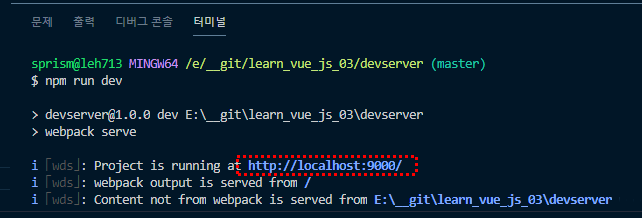<br />
<br />

### 8.3. 웹팩 데브 서버 2가지 특징
1. 로컬호스트 9000번 기준으로 프로젝트가 실행되고 있다.<br />
	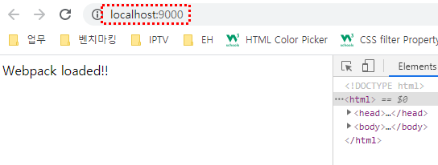<br />
	<br />

2. index.js 에서 **파일을 수정하는 순간, 브라우저에서 바로! 자동으로 새로고침**이 된다.<br />
	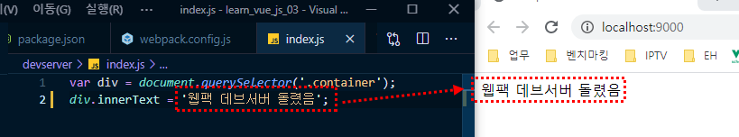<br />
	<br />

3. **파일을 수정할 때마다 자동으로 compiling** 된다.<br />
	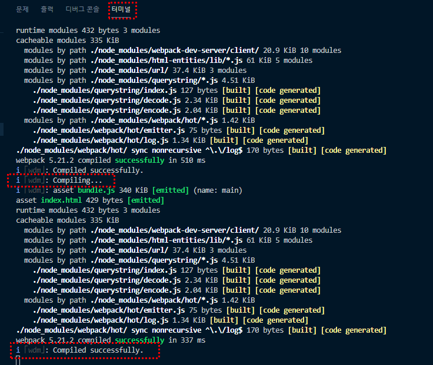<br />
	<br />

4. 웹팩 데브 서버를 실행하여 웹팩 빌드를 하는 경우, **빌드한 결과물이 파일 탐색기나 프로젝트 폴더에서 보이지 않는다.**
	- 웹팩 데브 서버로 빌드한 결과물은 메모리에 저장되고 파일로 생성하지는 않기 때문에 컴퓨터 내부적으로는 접근할 수 있지만 사람이 직접 눈으로 보고 파일을 조작할 순 없다.
		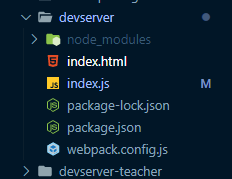<br />
	- 프로젝트 폴더 내부에서 bundle.js 파일을 확인할 순 없지만, 브라우저 상에서는 bundle.js 파일을 확인할 수 있다.
		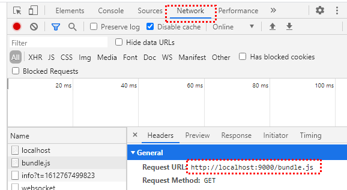<br />
	- **웹팩 데브 서버는 인메모리 기반으로 웹팩의 빌드 결과물을 변환한다.**<br />메모리 상으로만 화면 출력을 해준다 (파일 시스템 변환X)
	- 디스크에 저장되지 않는 메모리 컴파일을 사용하기 때문에 컴파일 속도가 빨라짐
	<br />

5. 개발을 완료하였거나 서버에 등록을 해야할 경우, package.json 파일에 <code>"build": "webpack"</code>을 등록하고 [터미널]에서 빌드를 실행한다.
	```javascript
	// package.json
	"scripts": {
	  "build": "webpack"
	}
	```
	```
	npm run build
	```
	<br />

### 8.4. HTMLWebpackPlugin 설명
1. 웹팩 빌드 실행으로 적용된 script<br />
	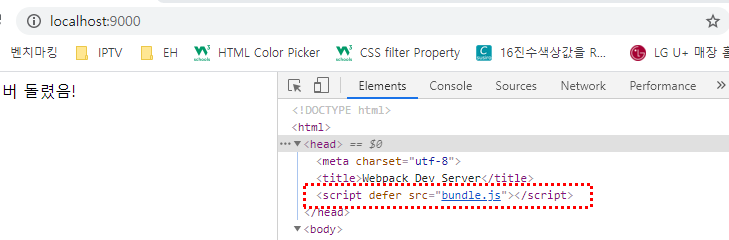<br />
<br />

2. [webpack.config.js] new HtmlWebpackPlugin() 으로만 등록을 할 경우,<br />dist 폴더 아래에 index.html 파일이 새로 생성이 된다.
	```javascript
	plugins: [
	  new HtmlWebpackPlugin({}),
	],
	```
<br />

3. [webpack.config.js] <code>new HtmlWebpackPlugin({ template })</code> 속성을 추가하여 **프로젝트 루트 폴더의 index.html 파일에 적용**될 수 있게 한다.
	```javascript
	plugins: [
	  new HtmlWebpackPlugin({
	    // index.html 템플릿을 기반으로 빌드 결과물을 추가해줌
	    template: 'index.html',
	  }),
	],
	```
<br />

3. css, js 파일 등이 다수로 적용을 해야하거나 해쉬코드 등을 **일일이 입력을 해서 적용할 수가 없기 때문에 HtmlWebpackPlugin 플러그인을 이용**해야 한다.
	- HtmlWebpackPlugin : **빌드 시 css, js 파일들을 자동으로 연결**해준다
	```html
	<link rel="stylesheet" href="./dist/main.css">
	<!-- 해시코드 적용 -->
	<link rel="stylesheet" href="./dist/main.$oidsf!22.css">
	```
	<br />

4. HtmlWebpackPlugin() 옵션에 관한 것은 공식문서를 통해 옵션을 적용한다.
	- HtmlWebpackPlugin [[자세히보기]](https://webpack.js.org/plugins/html-webpack-plugin/)

5. HtmlWebpackPlugin 플러그인 외에 필요한 플러그인 경우, **공식문서를 통해 설치 및 사용법을 확인**한다.
<br />
<br />
<br />

## 9. 실전 퀴즈
### 9.1. 실전 퀴즈 풀이
- <code>mode</code> webpack 4버전대부터 적용. 배포할 때엔 production
- <code>entry</code> 웹팩으로 변환할 대상의 파일(= 진입점)
- <code>output</code> 변환해서 결과물이 나올 결과 파일 정보
	- <code>publicPath</code> 나중에 CDN 배포를 할 때 그 CDN 주소에 포함될 수 있겠끔 속성을 정의
	<br />

- <code>module</code> = loader 
	- <code>test: /\.css$/</code> css-loader -> 특정 프레임워크와 연관된 로더 vue-style-loader 변환
	- <code>test: /\.vue$/</code> .vue 확장 파일에 대한 vue-loader 
	- <code>test: /\.js$/</code> babel-loader 변환
		- <code>loader: 'babel-loader'</code> 자바스크립트의 최신 문법들을 여러 브라우저에서 호환할 수 있게 변환해주는데 이 기능 때문에 웹팩을 자주 사용하기도 한다.
		- <code>exclude: /node_modules/ </code> 프로젝트 내부에서 모든 자바스크립트 대상으로 작업을 하는데 node_modules 폴더는 라이브러리와 관련이 있기 때문에 본 폴더에 있는 라이브러리는 배제한다는 의미.
	- <code>test: /\.(png|jpg|gif|svg)$/</code> 이미지 속성을 'file-loader'을 이용해서 'options'까지 적용
	<br />

- <code>resolve</code> 웹팩으로 파일을 해석해 나갈 때(어떤 파일이 어떤 파일과 연관이 있는 지) - 파일의 해석 방식을 정의
	- <code>alias</code> 'vue$'로 하는 것은 'vue/dist/vue.esm.js' 로 해석하겠다는 의미
	- <code>extensions</code> .js, .vue 를 붙이지 않아도 해석해주겠다는 의미
		- <code>import {} from './math'</code> ./math.js 파일인데 ./math만 써도 해석하겠다는 의미.
	<br />

- <code>performance</code> 성능 관련(크게 신경쓰지 않아도 된다)
	- 결과물에 어떤 사이즈가 초과가 되면 웹팩에서 제안한 파일 사이즈 크기가 있는데 초과가 되면 워닝
	<br />

- <code>devtool: '#eval-source-map'</code>
	- 'source-map'에는 여러가지 종류가 있다.
	- '#eval-source-map' : 빌드된 파일과 빌드된 파일에서 실제 파일과 연결해주는 어떤 링크를 제공
<br />

```javascript
var path = require('path')
var webpack = require('webpack')

module.exports = {
  mode: 'production',
  entry: './src/main.js',
  output: {
    path: path.resolve(__dirname, './dist'),
    publicPath: '/dist/',
    filename: 'build.js'
  },
  module: {
    rules: [
      {
        test: /\.css$/,
        use: [
          'vue-style-loader',
          'css-loader'
        ],
      },      
      {
        test: /\.vue$/,
        loader: 'vue-loader',
        options: {
          loaders: {
          }
          // other vue-loader options go here
        }
      },
      {
        test: /\.js$/,
        loader: 'babel-loader',
        exclude: /node_modules/
      },
      {
        test: /\.(png|jpg|gif|svg)$/,
        loader: 'file-loader',
        options: {
          name: '[name].[ext]?[hash]'
        }
      }
    ]
  },
  resolve: {
    alias: {
      'vue$': 'vue/dist/vue.esm.js'
    },
    extensions: ['*', '.js', '.vue', '.json']
  },
  devServer: {
    historyApiFallback: true,
    noInfo: true,
    overlay: true
  },
  performance: {
    hints: false
  },
  devtool: '#eval-source-map'
}
```
<br />

- <code>process.env.NODE_ENV === 'production'</code>
	- node 환경 변수를 production 일 때
	- <code>npm run build</code> production 모드로 빌드가 실행될 때
- production 으로 배포를 할 때 if문에 적용된 것들을 추가로 적용하겠다는 의미.
	- if문 아래에 있는 코드는 웹팩 3버전이하의 코드
	- **웹팩 4버전 이후로는 아래 코드를 작성할 필요가 없다. mode:'production' 으로 적용하면 된다.**
```javascript
if (process.env.NODE_ENV === 'production') {
  module.exports.devtool = '#source-map'
  // http://vue-loader.vuejs.org/en/workflow/production.html
  module.exports.plugins = (module.exports.plugins || []).concat([
    new webpack.DefinePlugin({
      'process.env': {
        NODE_ENV: '"production"'
      }
    }),
    new webpack.optimize.UglifyJsPlugin({
      sourceMap: true,
      compress: {
        warnings: false
      }
    }),
    new webpack.LoaderOptionsPlugin({
      minimize: true
    })
  ])
}
```