# Vue.js 완벽 가이드 
#### 실습과 리팩토링으로 배우는 실전 개념
- [Vue.js 스타일 가이드](https://vuejs.org/v2/style-guide)
<br />

#### VSCode 플러그인 리스트
- **Vetur :** Vue.js 플러그인
- **Night Owl :** 코드 하이라이팅 플러그인
- **Meterial Icon Theme :** vs코드에서 파일 확장자 명에 따라 아이콘으로 구분
- **ESLint :** 자바스크립트 문법 검사 플러그인
- **TSLint :** 타입스크립트 문법 검사 플러그인
- **Auto Close tag :** HTML 태그 자동 닫기 플러그인
- **Live Server :** 정적 파일을 로컬 서버에 올리고 자동 갱신해주는 플러그인

<br />
<hr />
<br />

## 1. 소개 및 설계
### 1.1. 제작할 사이트 및 API 소개
- 이번 강의를 통해 해커 뉴스 사이트를 제작한다 
	- show, ask, jobs 페이지
	- 해커 뉴스 API를 호출하여 화면에 정보를 노출하려고 한다.
- 페이지 이동을 위한 **뷰 라우터 구현**
- 컴포넌트 기반의 사이트 제작
	- **컴포넌트 공통화 방법**에 대한 안내와 실습
- Vuex를 사용한 API 호출과 Vuex를 사용안한 API 호출 비교

#### 강의 참고 자료
1. [해커 뉴스 공식 사이트 주소](https://news.ycombinator.com/)
2. [해커 뉴스 API 문서 주소](https://github.com/tastejs/hacker-news-pwas/blob/master/docs/api.md)

<br />

### 1.2. 애플리케이션 라우터 설계
#### 사이트 설계란?
기본적으로 웹서비스를 만들 때, 구성되어 있는 사이트 또는 기획자가 만들어 논 기획 문서를 확인하고 그 기획서를 토대로 **컴포넌트 기반으로 설계**를 할 줄 알아야 한다.<br />
그리고 여러 페이지로 구성되어 있는 경우에는 **라우터를 설계**해야 한다. 예를 들어 News, Ask, Jobs 등 각 각 페이지들의 라우터를 구성해야 한다. 
<br />
<br />

### 1.3. 비공개 리포지토리 소개 및 뷰 CLI 설명
- [비공개 리포지토리(수업자료 - 브랜치별 확인)](https://github.com/joshua1988/vue-advanced)
<br />

### 1.4. Vue CLI 2.X vs Vue CLI 3.X
- **명령어**
	- 2.x : <code>vue init '프로젝트 템플릿 이름' '파일 위치'</code>
	- 3.x : <code>vue create '프로젝트 이름'</code>
- **웹팩 설정 파일 (가장 큰 차이점)**
	- 2.x : 노출 O
		- 프로젝트 루트에서 **webpack.config.js 파일 확인 가능**
	- 3.x : 노출 X
- **프로젝트 구성**
	- 2.x : 깃헙의 템플릿 다운로드
	- 3.x : 플러그인 기반으로 기능 추가
- **ES6 이해도(자바스크립트 문법)**
	- 2.x : 필요 X
	- 3.x : 필요 O

#### 강의 참고 자료
1. [Vue CLI 사이트](https://cli.vuejs.org/)
2. [webpack-simple 템플릿 깃헙 주소](https://github.com/vuejs-templates/webpack-simple)
<br />

## 2. 프로젝트 셋업
### 2.1. Vue CLI로 프로젝트 생성 및 ESLint 로그 확인
1. [터미널] <code>npm i -g @vue/cli</code> Vue CLI 설치
2. [터미널] 프로젝트 폴더 기준 <code>vue create vue-news</code> 명령어 입력
3. Vue CLI 3.x 이상부터 선택할 수 있는 preset 
	- preset : 프로젝트를 시작하기 위한 기본적인 플러그인 구성을 할 수 있다. 
	- 플러그인의 집합이라고 보면 된다. 여러 개의 플러그인을 개인적으로 좋아하는 플러그인으로 골라서 셋업
4. <code>Default ([Vue 2] babel, eslint)</code> 선택<br />
	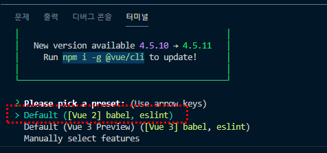<br />
5. [터미널] <code>cd vue-news</code> 명령어 입력 - 폴더 이동
6. [터미널] <code>npm run serve</code> 명령어 입력 - 서버 실행
7. [package.json] "scripts" 에서 "serve" 명령어를 입력하게 되면 "vue-cli-service serve" 가 실행되는 것.<br />
	<br />
	<br />
<br />

### 2.2. ESLint 도구 소개와 사용해야 하는 이유?
- **ESLint**
	- 자바스크립트에서 코딩할 때에 도움말 역활. 
	- 에러가 나지 않게, 코드 작성을 유도하는 보조도구
	- 미관상 등의 이유로 <code>;</code> 을 표시하지 않는다. ESList는 <code>;</code> 표시를 권장한다.<br />
	그 이유로는 아래 <code>if ( a === 1 ) console.log('1이다')</code> 케이스를 보면 된다.<br />
	if문 뒤에 메서드 실행을 적용한다 했을 때, 어느 구간에서 자바스크립트를 끊어야 할 지를 모른다.<br />
	그래서 <b>꼭!</b> <code>;</code> <b>세미클론을 표시</b>해야 한다
		```javascript
		var a = 10  

		import AppHeader from './components/AppHeader'
		import Vue from 'vue' 

		if ( a === 10 ) {
		  console.log('10이다')
		}

		if ( a === 1 ) console.log('1이다') b() c()
		``` 
	- 트레일링 콤마(trailing comma) 경우, 1개만 있을 때엔 <code>,(콤마)</code> 생략이 가능하나<br />
	ESLint 에서는 1개일 때에도 <code>,(콤마)</code> 표시를 권장한다
		```javascript
		components: {
		  '컴포넌트 이름': 컴포넌트 내용
		}
		```
<br />

### 2.3. Vue CLI 3.x에서 ESLint 설정 끄는 방법
- Vue CLI 를 설치하면 자동으로 ESLint 설정이 되어 있다.
	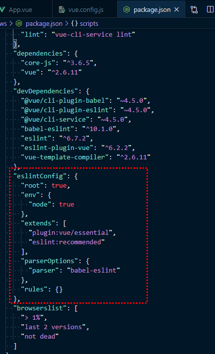<br />
	<br />

- 각 컴포넌트 .vue 파일 마다 <code>/* eslint-disable */</code>를 표기해도 되지만 컴포넌트 마다 적용하게 되면 불필요한 줄이 생기기 때문에 권장하지 않는다.
	```javascript
	<script>
	/* eslint-disable */
	</script>
	```
	- <code>/* eslint-disable */</code> 적용하게 되면 [터미널] 에서 오류 문구가 사라진 것을 확인할 수 있다.<br />
	<br />
	<br />

#### 간단하게 ESLint 설정 끄는 법
1. 프로젝트 폴더 루트에서 vue.config.js 파일 생성
	- 기본 문법 (아래 코드 참고)
	```javascript
	// vue.config.js
	module.exports = {
  
	}
	```
	<br />

2. [[Vue CLI 공식문서]](https://cli.vuejs.org/)에서 'lint' 로 검색한다.<br />
	풀네임은 'lintOnSave' 이다.
	<br />
	<br />

3. [[Vue CLI 공식문서 -lintOnSave]](https://cli.vuejs.org/config/#lintonsave) 가이드를 보면 설정하는 방법이 나오는데 조건없이 false 로 적용을 해주면 된다.
	```javascript
	module.exports = {
	  lintOnSave: false
	}
	```
	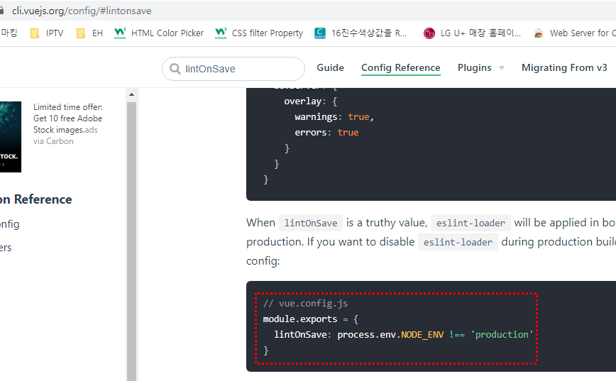<br />
	<br />

4. **개발 작업을 진행할 때엔 ESLint 설정을 켜두고 사용하는 것을 권장**한다.

## 3. 라우터
### 3.1. 라우터 설치 및 라우터 구현
#### 3.1.1. 참고자료
- [Vue.js 중급 ES6 Modules 강좌 링크](https://www.inflearn.com/course/vue-pwa-vue-js-%EC%A4%91%EA%B8%89/lecture/11542?tab=curriculum)
- [Vue.js 중급 ES6 Enhanced Object Literal 강좌 링크](https://www.inflearn.com/course/vue-pwa-vue-js-%EC%A4%91%EA%B8%89/lecture/11537?tab=curriculum)

<br />

1. [터미널] <code>npm i vue-router --save</code> 명령어 실행(= 라우터 설치)
2. 설치가 완료되면 [package.json] **"dependencies" 에 "vue-router" 추가**된다<br />
	- dependencies 에 들어가는 라이브러리들은 실제로 웹을 실행시킬 때 필요한 비즈니스 로직 또는 웹의 동작을 담당하는 라이브러리이며, 배보할 때 포함되어 있어야 하는 라이브러리.<br />
	<br />
	<br />

3. [main.js] 는 기본적으로 애플리케이션의 설정(플러그인, 라이브러리, 구조 등)들을 파악할 수 있어야 한다. (== 구조도가 한 눈에 쉽게 파악)<br />
따라서, router 관련된 정보는 새로운 폴더를 생성하여 해당 폴더에 적용을 한다.
<br />

4. src 폴더 밑에 "router" 폴더 생성 -> index.js 파일 생성, 아래 코드적용
	```javascript
	import Vue from 'vue'
	import VueRouter from 'vue-router'

	vue.use(VueRouter);

	const router = new VueRouter({
	  routes: [
			path: '',
	  ]
	})
	```
<br />

5. 변수 router에 routes를 이용하여 정보를 담는다.
	- routes 속성에 path, component 정보를 적용한다.
	- components == page 로 이해하면 된다.
	```javascript
	import Vue from 'vue'
	import VueRouter from 'vue-router'

	vue.use(VueRouter);

	const router = new VueRouter({
	  routes: [
	    {
	      // path : URL 주소
	      path: '/',
	      // component : URL 주소로 갔을 때 표시될 컴포넌트
	      component: 'MainPage',
	    },
	    {
	      path: '',
	      component: '',
	    },
	    {
	      path: '',
	      component: '',
	    }
	  ]
	})
	```
<br />

6. src 폴더 밑에 views 폴더 생성
	- views 폴더에는 url 마다 뿌려지는 컴포넌트들을 등록할 예정
	<br />

7. [views] 폴더 아래에 NewsView, JobsView, AskView 뷰페이지를 생성
	- Vetur 플러그인 설치로 인해 'vue' 로 자동완성기능으로 템플릿 작성을 한다
	<br />

8. [router/index.js] 각각의 url 주소를 기재한다
	```javascript
	import Vue from 'vue'
	import VueRouter from 'vue-router'

	vue.use(VueRouter);

	const router = new VueRouter({
	  routes: [
	    {
	      // path : URL 주소
	      path: '/news',
	      // component : URL 주소로 갔을 때 표시될 컴포넌트
	      component: '',
	    },
	    {
	      path: '/ask',
	      component: '',
	    },
	    {
	      path: '/jobs',
	      component: '',
	    }
	  ]
	})
	```
<br />

9. [router/index.js] url 주소로 이동했을 때의 컴포넌트를 불러온다.
	- 불러올 컴포넌트를 연결한다.
		```javascript
		import NewsView from '../views/NewsView.vue'
		import AskView from '../views/AskView.vue'
		import JobsView from '../views/JobsView.vue'
		```
	- 연결한 컴포넌트를 routes - component 속성에 적용시킨다
		```javascript
		import Vue from 'vue'
		import VueRouter from 'vue-router'

		import NewsView from '../views/NewsView.vue'
		import AskView from '../views/AskView.vue'
		import JobsView from '../views/JobsView.vue'

		vue.use(VueRouter);

		const router = new VueRouter({
		  routes: [
		    {
		      // path : URL 주소
		      path: '/news',
		      // component : URL 주소로 갔을 때 표시될 컴포넌트
		      component: NewsView,
		    },
		    {
		      path: '/ask',
		      component: AskView,
		    },
		    {
		      path: '/jobs',
		      component: JobsView,
		    }
		  ]
		})
		```
<br />

10. [router/index.js] 파일을 main.js 파일에서 import 하기 위해 변수 router를 export 로 수정한다
	```javascript
	// index.js
	export const router = new VueRouter({ })
	```
	<br />

11. [main.js] 파일에 router 를 import 해준다.
	```javascript
	// main.js
	import { router } from './router/index';

	new Vue({
	  router,
	}).$mount('#app')
	```
<br />

### 3.2. router-view를 이용한 라우팅 컴포넌트 표시
1. [App.vue]에서 라우팅으로 설정한 컴포넌트로 보이게 적용을 해야 한다.<br />이 때, router-view 컴포넌트 태그를 이용한다
	```html
	<router-view></router-view>
	```

2. [터미널] <code>npm run serve</code> 명령어를 실행 후 localhost:8080 을 브라우저에서 확인하면 빈 페이지로 확인이 된다.<br />그 이유는 router에서 기본 url 값 '/' 이 설정되어 있지 않기 때문이다.<br />
	<br />

3. /news, /ask, /jobs 로 페이지를 이동하면 해당 페이지에 맞는 컴포넌트의 내용이 제대로 보여진다.<br />
	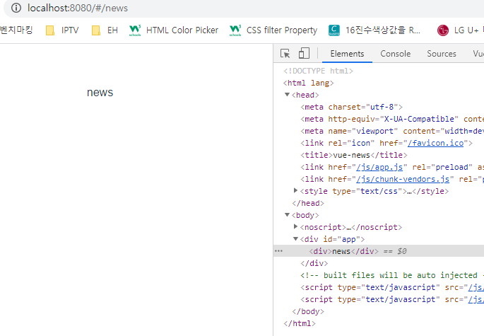<br />
<br />

4. **라우팅 라이브러리를 사용할 때 URL에 #이 들어가는 이유?**<br />브라우저 히스토리 조작을 위해서 #이 들어간다.<br />쉽게 말해 URL에 입력된 값을 자바스크립트로 구분하기 위한 것이라고 이해하면 된다.
<br />

### 3.3. redirect 속성과 router-link
#### 3.3.1. 참고자료
- [케밥 케이스 컴포넌트 스타일 가이드 (Essential)](https://vuejs.org/v2/style-guide/#Multi-word-component-names-essential)
- [파스칼 케이스 컴포넌트 스타일 가이드 (Strongly Recommended)](https://vuejs.org/v2/style-guide/#Component-name-casing-in-templates-strongly-recommended)
<br />

#### 3.3.2. redirect 속성
1. '/' 루트로 접속했을 때 연결된 router-view 가 없을 경우 빈 페이지가 보여지는데,<br />빈 페이지가 아닌 **'/'로 접속하면 특정 페이지를 보이게 적용**한다.
2. **redirect 속성을 이용하여 '/' 접속 시, 특정 폴더를 적용하여 해당 컴포넌트 페이지가 보이게 한다.**
3. '/'로 접속하게 되면 '/news' 폴더의 컴포넌트 페이지가 보이게 적용한다.
	```javascript
	// index.js
	export const router = new VueRouter({
	   routes: [
	     {
	       path: '/',
	       redirect: '/news',
	     },
	  ]
	})
	```

4. '/'로 접속 시, '/news'로 자동 바뀌면서 해당 컴포넌트 페이지가 보인다.<br />
	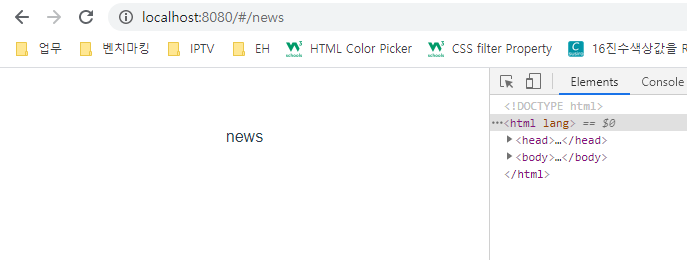<br />
	<br />

#### 3.3.3. router-link 속성
1. components 폴더에 ToolBar.vue 컴포넌트 파일을 생성한다
2. App.vue 파일에 ToolBar 컴포넌트를 적용한다.
	```html
	<template>
	  <div id="app">
	    <tool-bar></tool-bar>
	    <router-view></router-view>  
	  </div>
	</template>
	```
	```javascript
	import ToolBar from './components/ToolBar.vue';

	export default {
	  components: {
	    ToolBar,
	  },
	}
	```
	#### 컴포넌트 태그 형식은 파스칼 문법이 아닌 케밥 문법으로 적용한다.
	- **컴포넌트 태그 형식**
		- 파스칼 케이스 : <ToolBar></ToolBar>
		- 케밥 문법 : <tool-bar></tool-bar>
	- **케밥 문법으로 사용하는 이유는 해당 컴포넌트 태그를 ctrl 또는 alt 누르고 클릭하면 해당 컴포넌트 태그 .vue 페이지로 이동**이 된다.
		- 작은 단어 두개를 - 으로 연결한 컴포넌트 태그로 표기한다.<br />
		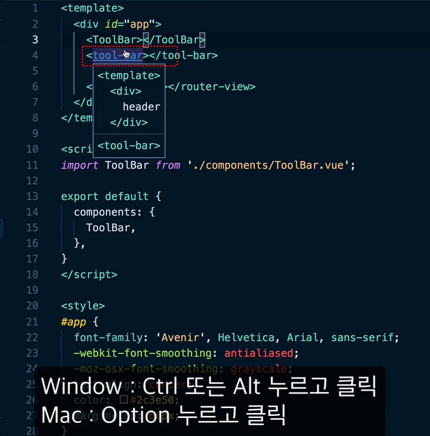<br />
	- Vue에서 권장하는 컴포넌트 태그는 파스칼 케이스지만, **VS Code를 사용할 경우 케밥 문법으로 VS Code에서 제공하는 기능을 사용**하는 것을 추천.
	<br />

3. [ Toolbar.vue ] router-link 로 코드를 작성한다.
	- router-link 기본 문법
	```html
	<router-link to="">router link</router-link>
	```
	- router-link 태그를 사용하면 자동적으로 a 태그로 보여진다
	```html
	<template>  
	  <div>
	    <router-link to="">News</router-link>
	    <router-link to="">Ask</router-link>
	    <router-link to="">Jobs</router-link>
	  </div>
	</template>
	```
	<br />
<br />

4. router-link 태그에서 to 속성에 이동할 링크 URL을 적용한다
	```html
	<template>  
	  <div>
	    <router-link to="/news">News</router-link>
	    <router-link to="/ask">Ask</router-link>
	    <router-link to="/jobs">Jobs</router-link>
	  </div>
	</template>
	```
	<br />

### 3.4. ToolBar의 라우터 링크 스타일링
- <code><style scoped></style></code> :<br />해당 컴포넌트 .vue 파일에만 적용되는 css
- < router-link /> :<br />active인 상태일 때의 클래스 자동추가 == router-link-exact-active
<br />

### 3.5. 라우터 폴더 작명 팁과 라우터 mode 안내
#### 3.5.1. 라우터 폴더 작명  
- 기존의 router(라우터) 폴더명을 routes 로 변경한다
- 기존의 router로 명명했을 때엔 일반폴더로 되어 있었지만 routes로 하게 되면 일반폴더와 달라 구분이 된다.<br />
	<br />
- routes 로 폴더명을 구분했으면 main.js 에서 import router 의 경로도 수정해줘야 한다.
- import 경로가 맞는 지 확인을 할 경우, 변수 영역에 ctrl 또는 alt 와 함께 클릭하여 파일을 확인 해본다.<br />
	<br />
	<br />

#### 3.5.2. 라우터 mode 안내
- [ routes/index.js ] **new VueRouter 인스턴스에 mode를 적용하여 url 주소에 표시된 # 을 제거**한다.
	```javascript
	export const router = new VueRouter({
	  mode: 'history',
	}
	```
	<br />
<br />
<br />
<br />

## 4. API 구현
### 4.1. axios를 이용한 api 호출
#### 참고자료 API
- [API 참고사이트](https://github.com/tastejs/hacker-news-pwas/blob/master/docs/api.md)
	- news, ask, jobs API 활용 예정
	<br />

#### 구성 팁
- views 라는 폴더의 컴포넌트에는 페이지의 라우팅에 대한 정보만 들어가는 것이 좋다.
- 데이터에 관련된 로직에 관한 것을 views에 적용하는 것은 옳지 않다. (유지보수 등에 관리하기가 좋지 않다.)

#### axios 적용법
1. [터미널] <code>npm i axios --save</code> 명령어 실행
2. [ NewsView.vue ] 아래 코드로 파일 작성
	```html
	<template>
	  <div>
	    
	  </div>
	</template>
	```
	```javascript
	import axios from 'axios';

	export default {
	  data() {
	    return {
	      user: []
	    }
	  },
	  created() {
	    axios.get('https://api.hnpwa.com/v0/news/1.json')
	      .then(function(response) {
	        console.log(response);
	    })
	      .catch(function(error){
	        console.log(error);
	    })
	  }
	}
	```
3. [터미널] <code>npm run serve</code> 명령어로 서버 실행
4. Local 사이트를 브라우저에서 확인 가능
	- 개발자도구 > network 패널 탭 > XHR 에서 axios된 내용을 확인할 수 있다.
		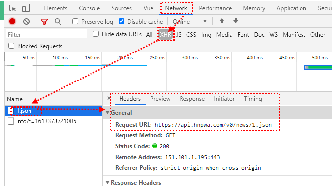<br />

5. [개발자도구] 콘솔 창에서 해당 로그 확인 가능<br />
	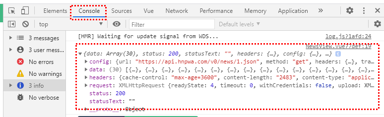<br />

6. 전달 받은 값을 data - user 속성에 대입시킨다
	- 변수 vm을 생성하여 this 값을 대입한다
	```html
	<template>
	  <div>
	    <div v-for="user in users">{{ user }}</div>
	  </div>
	</template>
	```
	```javascript
	import axios from 'axios';

	export default {
	  data() {
	    return {
	      user: []
	    }
	  },
	  created() {
	    var vm = this;

		  axios.get('https://api.hnpwa.com/v0/news/1.json')
		    .then(function(response) {
				  console.log(response);
	        vm.user = response.data;
			})
		    .catch(function(error){
	        console.log(error);
			})
		}
	}
	```

7. [ vue 개발자도구 ] 불러온 data의 값들을 확인할 수 있다

8. 불러온 data 값에서 title 속성의 값만 불러오고 싶을 때엔 .title 속성을 추가하면 된다.
	```html
	<template>
	  <div>
	    <div v-for="user in users">{{ user.title }}</div>
	  </div>
	</template>
	```
	<br />

### 4.2. axios의 api 함수 구조화 방법 및 실습안내
1. 컴포넌트마다 api를 호출해서 쓰는 것이 아닌 **api 폴더를 만들어서 관리**해야 한다
	```javascript
	// NewsView.vue
	import axios from 'axios';

	export default {
	  data() {
	    return {
	      users: []
	    }
	  },
	  created() {
	    var vm = this;
	
		  axios.get('https://api.hnpwa.com/v0/news/1.json')
		    .then(function(response) {
				  console.log(response);
	        vm.users = response.data;
			})
		    .catch(function(error){
	        console.log(error);
			})
		}
	}
	```
2. src 폴더에 api 폴더를 만들고 index.js 파일을 생성한다.<br />
	- 일반 폴더 아이콘과 다른 api 폴더 아이콘을 확인할 수 있다.
		<br />

3. [src/api/index.js] import axios from 'axios';
	- from 'axios' :<br />nodo_modules 에 설치된 axios 라이브러리를 갖고 오는 것을 의미한다.
	```javascript
	import axios from 'axios';
	```

4. NewsView.vue 에서 axios를 호출한 코드를 api/index.js 에 함수로 변환하여 코드를 작성한다.
	- API을 각 컴포넌트별로 적용을 하게 되면 동일한 코드를 각 컴포넌트 페이지에 적용하기 때문에 유지보수 등 관리가 용이하지 않다.<br /> 따라서, 별도의 API 폴더를 만들어 관리하는 것이 좋다.
	```javascript
	// api/index.js 

	import axios from 'axios';

	// 1. HTTP Request & Response와 관련된 기본 설정
	const config = {
	  baseUrl: 'https://api.hnpwa.com/v0/'
	};

	// 2. API 함수들을 정리
	function fetchNewsList() {
	  // return axios.get(config.baseUrl+'news/1.json');
	  return axios.get(`${config.baseUrl}news/1.json`);
	};

	export {
	  fetchNewsList
	};
	```

5. api/index.js 코드 작성이 끝났으면 NewsView.vue 컴포넌트 파일에서 해당 파일을 import 한다.
	```html
	<!-- NewsView.vue -->
	<template>
	  <div>
	    <div v-for="user in users">{{ user.title }}</div>
	  </div>
	</template>
	```
	```javascript
	// NewsView.vue
	import { fetchNewsList } from '../api/index.js';

	export default {
	  data() {
	    return {
	      users: []
	    }
	  },
	  created() {
	    var vm = this;
		  fetchNewsList()
		    .then(function(response) {
				  console.log(response);
	        vm.users = response.data;
	      })
		    .catch(function(error){
	        console.log(error);
	      })
		}
	}
	```
<br />

### 4.3. [실습] JobsView 와 AskView 구현
- created() {} = 라이프사이클 훅, 컴포넌트가 생성되지마자 로직 실행
	- 데이터 요청 시엔 created() 또는 beforeMount 를 사용한다.
- [Reactivity in Depth 자세히 보기](https://vuejs.org/v2/guide/reactivity.html#ad)
- **반드시 export 를 해야 import 로 사용할 수 있다.**
	```javascript
	// index.js
	export {
	  fetchAskList
	};

	// AskView.vue
	import { fetchAskList } from 'index.js';
	```
- v-for = 'item in ask"
 - v-for 디렉티브는 기본적으로 ask 라는 배열을 반복해서 div 태그를 돌린다.
 - item 은 ask를 한 번씩 접근(순회)할 때 각각의 값이 된다.
 ```html
 <div v-for="item in ask">{{item.title}}</div>
 ```
- [ JobsView.vue ] 화살표 함수로 적용하기
	- 화살표 함수 적용 전
		```javascript
		created() {
		  var vm = this;
		  fetchJobsList()
		    .then(function(response) {
		      vm.jobs = response.data;
		    })
		    .catch(function(error){
		      console.log(error);
		    })
		}
		```
	- **화살표 함수 적용 후**
		- 한줄이어서 {} 생략 가능
		- var vm 선언없이 this로 적용 가능하다. [this 바인딩 바로가기](#44-자바스크립트-this-4가지와-화살표-함수의-this)
		```javascript
		etchAskList()
		  .then(response => this.jobs = response.data)
		  .catch(error => console.log(error));
		```
<br />

### 4.4. 자바스크립트 this 4가지와 화살표 함수의 this
#### 4.4.1. 자바스크립트 this 4가지
1. **this == window (최상단의 전역 변수)**
	- 자바스크립트의 this 는 전역 변수로 시작을 한다
	- window 는 브라우저의 객체이다. 
		- 기본적으로 브라우저, dom에 대한 접근을 나타낸다
		- 최상단의 전역변수 window
	```javascript
	var a = 10;
	a            // 10
	window.a     // 10
	this         // window 관련 정보
	```
	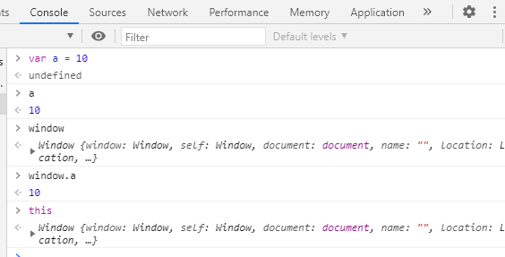<br />
	<br />

2. **함수 안에서 this == 최상단의 전역변수(window)**<br />
	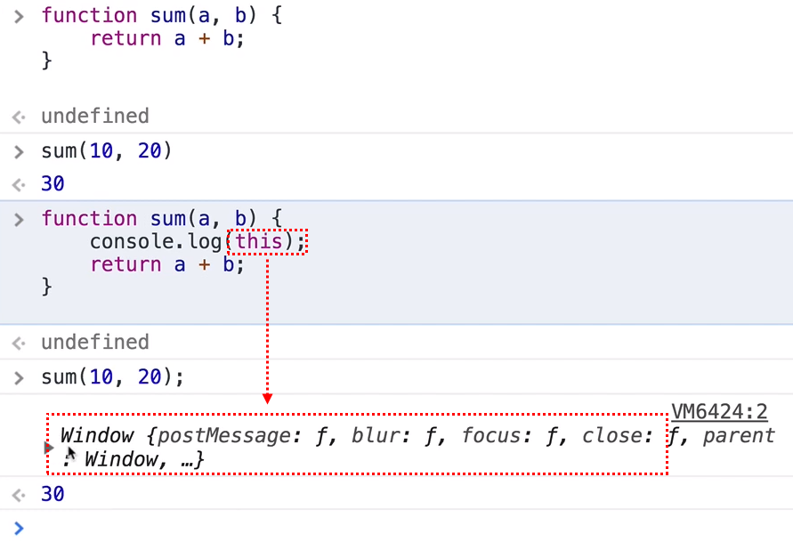<br />
	<br />

3. **생성자 함수에서 this == 함수 자체를 가리킨다**<br />
	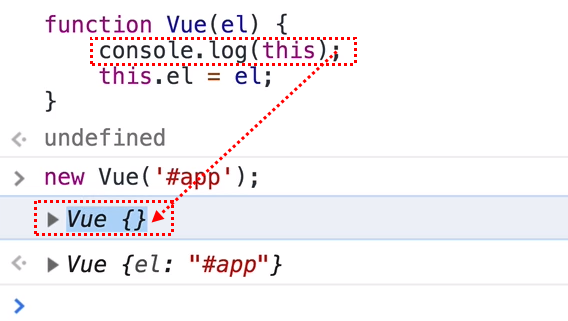<br />
	<br />

4. **비동기 처리에서의 this**
	- data 호출하는 부분도 비동기 처리이다.
	- 호출 전 this 와 호출 후 this 가 가리키는 것이 다르다
		- 호출 전 this == 해당 뷰 컴포넌트
		- 호출 후 this == undefined
	```javascript
	created() {
	  console.log('호출 전: ' + this);
	  fetchNewsList()
	    .then(function(response) {
	      console.log('호출 후: ' + this);
	    })
	}
	```
	<br />
	<br />

#### 4.4.2 화살표 함수의 this
- **화살표 함수에서 this 를 사용하게 되면 호출되는 위치의 this 를 가져오게 된다.**
- 호출 전 this와 호출 후 this 가 동일한 정보를 가리키게 된다.
	```javascript
	created() {
	  console.log('호출 전: ' + this);
	  fetchNewsList()
	    .then(response => {
	      console.log('호출 후: ' + this);
				this.users = response.data;
	    })
	}
	```
	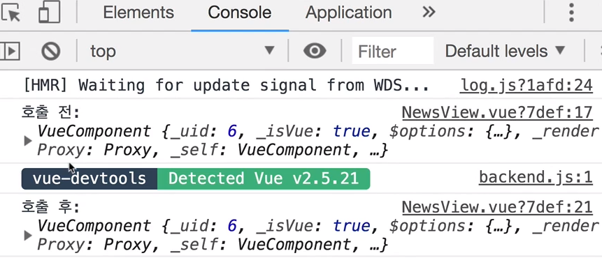<br />

- 화살표 함수를 사용하면 this 바인딩을 할 필요가 없다.<br />
	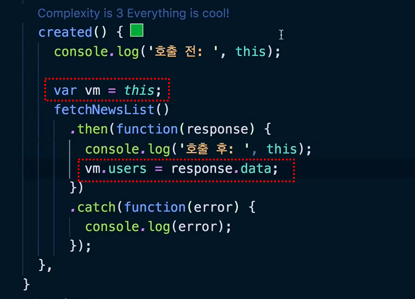<br />

#### ※ 자바스크립트의 this
- 콜백에서 this를 잃어버리는 것이 자바스크립트가 가진 원래의 생김새
- 화살표 함수 사용의 최대 강점인 this 사용법

<br />

### 4.5. 자바스크립트 비동기 처리(1) - Callback
1. Callbak(콜백) 설명
	- Callback(콜백) 이란? 어떤 특정 함수나 기능이 종료되는 시점에 실행되는 함수를 의미
	- 자바스크립트는 함수를 인자로 넘길 수 있는데, 인자로 전달되는 함수를 콜백함수라고 표현

2. src/callback.html 페이지를 생성하고 아래 코드를 적용한다
	- 전형적인 콜백 함수 문법(참고 2번)
	```html
	<!DOCTYPE html>
	<html lang="ko">
	<head>
	  <meta charset="UTF-8">
	  <meta http-equiv="X-UA-Compatible" content="IE=edge">
	  <meta name="viewport" content="width=device-width, initial-scale=1.0">
	  <title>Callback</title>
	</head>
	<body>
	  <div>jquery ajax</div>

	  <script src="https://code.jquery.com/jquery-3.3.1.js"></script>
	  <script>
	    function fetchData() {
	      // 1
	      var result = [];

	      // 2
	      $.ajax({
	        url: 'https://api.hnpwa.com/v0/news/1.json',
	        success: function(data) {
	          console.log('데이터 호출 결과', data);
	          result = data;
	        }
	      });

	      // 3
	      console.log('함수 결과', result);
	    }

	    fetchData();
	  </script>
	</body>
	</html>
	```

3. 위 코드로 적용한 html 를 확인해보면 result 로 값을 불러오지 못 했다<br />
	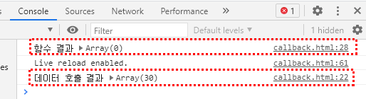<br />

4. ajax(데이터 호출, 비동기처리) 자료를 받기 전에 <code>console.log('함수결과', result)</code> 코드가 실행되었기 때문에 result 가 data의 값을 받아오지 못 했다. 
	- 자바스크립의 특성
	- 비동기 처리의 콜백함수

5. data의 값을 받은 result 값을 출력하려면 ajax 안에 적용을 해야 한다
	- success 는 ajax에서만 유효한 콜백 함수이다.
	```javascript
	function fetchData() {
	  // 1
	  var result = [];
	
	  // 2
	  $.ajax({
	    url: 'https://api.hnpwa.com/v0/news/1.json',
	    success: function(data) {
	      console.log('데이터 호출 결과', data);
	      result = data;
	      console.log('함수 결과', result);
	    }
	  });
	
	  // 3
	  // console.log('함수 결과', result);
	}
	
	fetchData();	
	```
	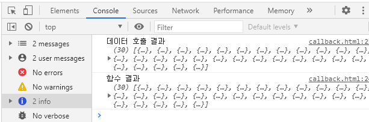<br />

#### ※ 참고자료
- [비동기 처리와 콜백 함수 자세히보기](https://joshua1988.github.io/web-development/javascript/javascript-asynchronous-operation/)

<br />

### 4.6. 자바스크립트 비동기 처리(2) - Promise
#### 4.6.1. Promise(프로미스)를 사용하는 이유?
콜백으로 비동기 처리할 때의 문제점(콜백 헬, 코드 인덴트, 사고의 위배 등)들이 재기되어 왔다.<br />복잡한 데이터 요청이 많아지면 콜백 헬이 열리게 된다. 그래서 콜백 관리를 좀 더 효율적으로 하고, 코드 자체에서도 직관적인 코드를 짜보자는 측면에서 Promise(프로미스)라는 새로운 비동기처리 패턴이 등장했다.

#### 4.6.2. Promise(프로미스) 기본 코드
- Promise 객체에서만 then(성공) 과 catch(실패) 를 사용할 수 있다
	```javascript
	function getData(callback) {
	  // new Promise() 추가
	  return new Promise(function(resolve, reject) {
	    $.get('url 주소/products/1', function(response) {
	      // 데이터를 받으면 resolve() 호출
	      resolve(response);
	    });
	  });
	}

	// getData()의 실행이 끝나면 호출되는 then()
	getData().then(function(tableData) {
	  // resolve()의 결과 값이 여기로 전달됨
	  console.log(tableData); // $.get()의 reponse 값이 tableData에 전달됨
	});
	```

#### 4.6.3. callback 함수를 promise(프로미스)로 변환
1. [ promise.html ] 아래의 callback 함수를 promise 로 변환하려고 한다
	- <code>.ajax({})</code> 코드를 promise 로
	```javascript
	function fetchData() {
	  // 1
	  var result = [];

	  // 2
	  $.ajax({
	    url: 'https://api.hnpwa.com/v0/news/1.json',
	    success: function(data) {
	      console.log('데이터 호출 결과', data);
	      result = data;
	      console.log('함수 결과', result);
	    }
	  });

	  // 3
	  // console.log('함수 결과', result);
	}

	fetchData();
	```

2. ajax를 호출할 **callAjax** 함수를 생성한다
	- new Promise 로 객체를 생성해야 한다.
	- promise 는 **항상 resolve, reject 를 인자로 받는다**
	- ajax를 호출했고 데이터 url도 지정했다
	```javascript
	function call Ajax() {
	  return new Promise(function(resolve, reject) {
	    $.ajax({
	      url:'https://api.hnpwa.com/v0/news/1.json'
	    })
	  });
	}
	```

3. ajax 호출을 성공했을 때의 코드를 아래와 같이 적용한다
	- .then() 은 계속 체인링 할 수 있다
	- .catch() 도 적용해줘야하는 거 명심!!!
	```javascript
	function call Ajax() {
	  return new Promise(function(resolve, reject) {
	    $.ajax({
	      url:'https://api.hnpwa.com/v0/news/1.json',
	      success: function(data) {
	        resolve(data);
	      }
	    })
	  });
	}

	function fetchData() {
	  // 1
	  var result = [];

	  // 2
	  callAjax()
	    .then(function(data) {
	      console.log('데이터 호출 결과', data);
	      result = data;
	      console.log('함수 결과', result);
	    })
			.catch()
	}

	fetchData();
	```


#### ※ 참고자료
- [프로미스 쉽게 이해하기 글 주소 - 자세히보기](https://joshua1988.github.io/web-development/javascript/promise-for-beginners/)
- [Promise MDN 주소 - 자세히보기](https://developer.mozilla.org/ko/docs/Web/JavaScript/Reference/Global_Objects/Promise)

<br />
<br />
<br />

## 5. 스토어 구현
### 5.1. Vuex 설치 및 Vuex가 적용된 앱 구조 소개
- Before(Vuex 설치 전) , After(Vuex 설치 후)
- API 정보를 바로 NewsView에 담는 것이 아니라 Vuex(상태관리 라이브러리) 스테이트에 담은 후, NewsView로 담으려고 한다.<br />
	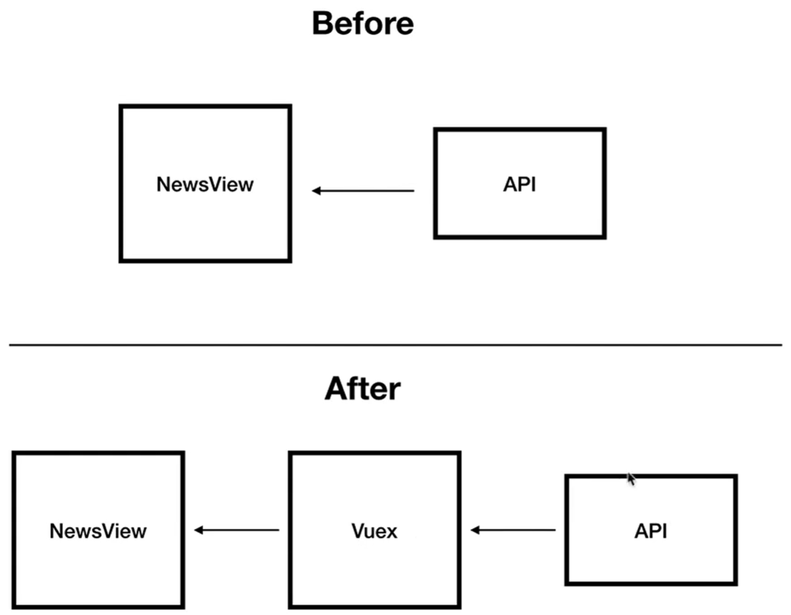<br />
- [Vuex 자세히 보기](https://github.com/eunhye8767/learn_vue_js_02#6-vuex)

#### 5.1.1. Vuex 설치
1. <code>npm i vuex</code> 명령어로 vuex 를 설치한다
2. 설치가 완료되면 프로젝트 루트폴더의 package.json - dependencies 위치에 vuex가 추가된 것을 확인할 수 있다.<br />
	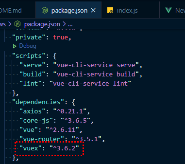<br />
	<br />

### 5.2. Vuex 모듈화 및 state 적용
#### 5.2.1. Vuex 란?
- Vuex는 상태관리 도구이다.
- 상태라는 것은 **여러 컴포넌트 간에 공유**되는 데이터 속성

#### 5.2.2. Vuex 모듈화 및 state 적용방법
1. src/main.js 파일은 파일들의 구조화를 보여져야 하기 때문에<br />src 폴더 아래에 store 폴더 생성 후 index.js 파일을 만든다.
2. [ /src/store/index.js ] 아래와 같이 코드를 적용한다.
	```javascript
	import Vue from 'vue';
	import Vuex from 'Vuex';
	
	Vue.use(Vuex);
	
	new Vuex.Store({
	  state: {
		
	  }
	});
	```

3. [ NewsView.vue ] users의 데이터를 다른 컴포넌트에서도 사용할 수 있게 Vuex - state 를 사용한다.
	- 서비스가 복잡해져을 때, 특히 컴포넌트 레벨이 깊어지거나 관계가 복잡해졌을 때 유용하게 데이터를 조작할 수 있다.
	```javascript
	// ../store/index.js
	import Vue from 'vue';
	import Vuex from 'Vuex';

	Vue.use(Vuex);

	new Vuex.Store({
	  state: {
	    news: []
	  }
	});
	```

4. [ src/store/index.js ] 새로 생성한 Vuex 인스턴스를 변수 store 로 지정한다.
	- 다른 컴포넌트 파일에서도 사용해야 하기 때문에 변수를 지정하고 export 를 적용한다.
	```javascript
	export const store = new Vuex.Store({
	  state: {
	    news: []
	  }
	});
	```

5. [ main.js ] 파일에 Vuex 를 연결해준다
	```javascript
	import Vue from 'vue'
	import App from './App.vue'
	import { router } from './routes/index.js';
	import { store } from './store/index.js';

	Vue.config.productionTip = false

	new Vue({
	  render: h => h(App),
	  router,
	  store,
	}).$mount('#app')
	```
	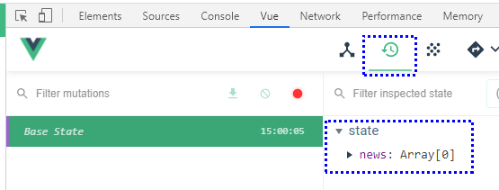<br />
	<br />

### 5.3. NewsView에 actions와 mutations 적용
1. NewsView 페이지 로직을 보면,<br />created가 되자마자 fetchNewsList()로 데이터를 불러와서 users에 정보를 담는다.
	- API(데이터 호출)를 Vuex에서는 actions
	```javascript
	// NewsView
	created() {
	  var vm = this;
	  // 1
	  fetchNewsList()
	    .then(function(response) {
	      console.log(response);
	      // 2
	      vm.users = response.data;
	    })
	    .catch(function(error){
	      console.log(error);
	    })
	}
	```

2. [ store/index.js ] API 호출을 위해 actions 속성을 추가하고 FETCH_NEWS 함수를 생성한다.
	- NewsView.vue 에 적용했던 import fetchNewsList 정보는 store/index.js 로 적용한다
	```javascript
	// store/index.js
	
	import Vue from 'vue';
	import Vuex from 'vuex';
	
	import { fetchNewsList } from '../api/index.js';
	
	Vue.use(Vuex);
	
	export const store = new Vuex.Store({
	  state: {
	    news: []
	  },
	  actions: {
	    FETCH_NEWS() {
			
	    }
	  }
	});
	```

3. [ store/index.js ] 생성한 FETCH_NEWS 함수에 api 호출 함수 fetchNewsList() 를 적용한다
	```javascript
	// store/index.js
	import { fetchNewsList } from '../api/index.js';

	export const store = new Vuex.Store({
	  state: {
	    news: []
	  },
	  actions: {
	    FETCH_NEWS() {
	      fetchNewsList()
	        .then( response => console.log(response))
	        .catch( error => console.log(error))
	    }
	  }
	});
	```

4. [ NewsView.vue ] FETCH_NEWS 함수를 호출한다.
	- Vuex 에서 actions 를 호출하려면 dispatch api를 이용해야 한다.
		- actions 에서 바로 state 로 값을 전달할 수 없다.
		- **비동기 호출은 무조건 actions 에서 하게 되고 거기서 담아온 정보는 mutations 에서 state로 전달**된다.
		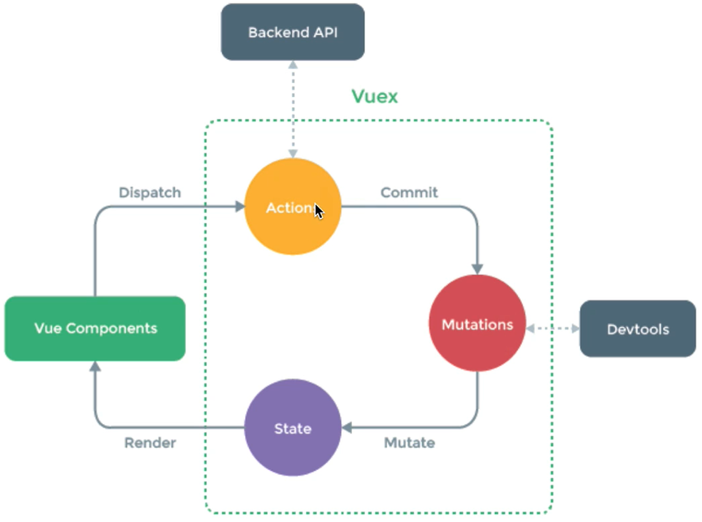<br />
	- **NewsView.vue 코드를 아래의 코드로 변환.**
		```html
		<!-- NewsView.vue -->

		<template>
		  <div>
		    <div v-for="user in users">{{ user.title }}</div>
		  </div>
		</template>

		<script>
		export default {
		  data() {
		    return {
		      users: []
		    }
		  },
		  created() {
		    this.$store.dispatch('FETCH_NEWS');
		  }
		}
		</script>
		```
		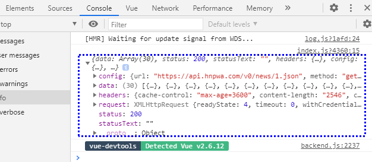<br />

5. [ store/index.js ] mutations 속성을 추가하여 actions로 전달받은 데이터 값을 담는다.
	- **actions -> state 로 데이터 정보를 전달할 수 없다.**

6. [ store/index.js ] actions 에서 mutations의 값을 받을려면 actions - 함수에 context 인자를 받아야 한다
	- context.commit 으로 mutations - SET_NEWS를 실행시킨다
	- [mutations 와 commit 자세히보기](https://github.com/eunhye8767/learn_vue_js_02#75-mutations-%EC%99%80-commit-%ED%98%95%EC%8B%9D-%EC%86%8C%EA%B0%9C)
	- context.commit 을 할 땐, 함수 실행과 함께 전달받은 response.data를 넘겨준다.
	```javascript
	// store/indes.js

	import Vue from 'vue';
	import Vuex from 'vuex';

	import { fetchNewsList } from '../api/index.js';

	Vue.use(Vuex);

	export const store = new Vuex.Store({
	  state: {
	    news: []
	  },
	  mutations: {
	    SET_NEWS() {

	    }
	  },
	  actions: {
	    FETCH_NEWS(context) {
	      fetchNewsList()
	        .then( response => {
	          context.commit('SET_NEWS', response.data);
	          console.log(response)
	        })
	        .catch( error => console.log(error))
	    }
	  }
	});
	```

7. [ store/index.js ] mutations 안에 함수에서는 첫번째 인자로 무조건 state 인자를 받는다. 따라서 첫번째 인자 state를 적용하고 두번째 인자로는 response.data 값을 받아야 하기 때문에 이름을 news 로 정보를 받는다
	- state.news => state - news 속성을 의미한다.
	- state.news = news => news<br />(responese.news의 정보를 news 인자로 받고 그 정보를 state - news로 넘겨준다)
	```javascript
	// store/indes.js

	import Vue from 'vue';
	import Vuex from 'vuex';

	import { fetchNewsList } from '../api/index.js';

	Vue.use(Vuex);

	export const store = new Vuex.Store({
	  state: {
	    news: []
	  },
	  mutations: {
	    SET_NEWS(state, news) {
	      state.news = news
	    }
	  },
	  actions: {
	    FETCH_NEWS(context) {
	      fetchNewsList()
	        .then( response => {
	          context.commit('SET_NEWS', response.data);
	          console.log(response)
	        })
	        .catch( error => console.log(error))
	    }
	  }
	});
	```

8. [ 뷰개발자 도구 ] mutations 와 state 속성에 데이터가 전달된 것을 확인할 수 있다<br />
	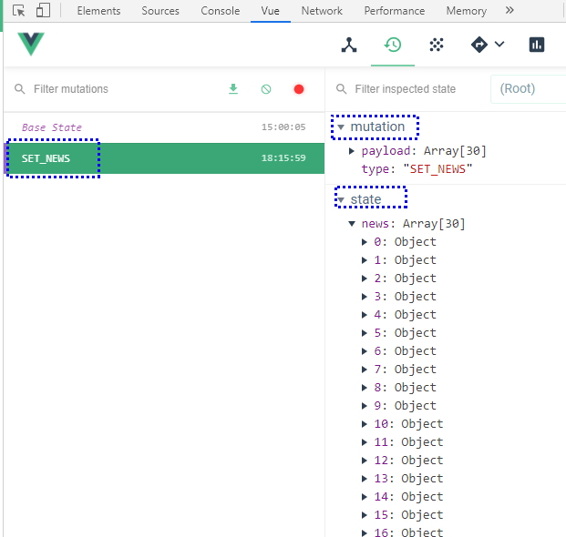<br />

9. [ NewsView.vue ] 전달받은 state 속성의 값을 화면에 뿌려준다.
	- Vuex 적용 전
		- state 값을 불러와서 적용하기 때문에 data - users 는 삭제한다.
		- <code><div v-for=""></div></code> state 값으로 적용한다
		```html
		<template>
		  <div>
		    <div v-for="user in users">{{ user.title }}</div>
		  </div>
		</template>

		<script>
		export default {
		  data() {
		    return {
		      users: []
		    }
		  },
		  created() {
		    this.$store.dispatch('FETCH_NEWS');
		  }
		}
		</script>
		```
	- **Vuex 적용 후**
		```html
		<template>
		  <div>
		    <div v-for="user in this.$store.state.news">{{ user.title }}</div>
		  </div>
		</template>

		<script>
		export default {
		  created() {
		    this.$store.dispatch('FETCH_NEWS');
		  }
		}
		</script>
		```

10. [ Vuex 데이터 흐름 ] API 호출한 데이터값<br />--> actions --> mutations --> state --> NewsView
	<br />

#### ※ 참고자료
- [Vuex Data Flow 자세히보기](https://vuex.vuejs.org/)

<br />

### 5.4. JobsView 와 AskView 실습 안내
- Jobs API 오류로 Show API 로 변경
	- (변경전) https://api.hnpwa.com/v0/jobs/1.json
	- (변경후) https://api.hnpwa.com/v0/show/1.json
	<br />

### 5.5. JobsView에 스토어 적용 (실습)
#### 구조 분해 문법(Destructuring) 적용
- Destructuring(디스트럭처링)으로 코드 수정
	- 적용 전
		```javascript
		// store/index.js
		FETCH_JOBS(context) {
		  fetchJobsList()
		    .then( response => {
		      context.commit('SET_JOBS', response.data);
		      console.log(response);
		    })
		    .catch( error => console.log(error))
		},
		```
	- **적용 후**
		```javascript
		// store/index.js
		FETCH_JOBS({commit}) {
		  fetchJobsList()
		    .then( ({ data }) => {
		      commit('SET_JOBS', data);
		    })
		    .catch( error => console.log(error))
		},
		```

#### ※ 참고자료
- [ES6 Destructuring 설명 글(e북) 자세히보기](https://joshua1988.github.io/es6-online-book/destructuring.html)

<br />

### 5.6. map 헬퍼 함수를 이용한 AskView 풀이
1. [ store/index.js ]Destructuring(디스트럭처링) 으로 문법 변경
	```javascript
	FETCH_ASK({commit}) {
	  fetchAskList()
	    .then( ({data})  => {
	      commit('SET_ASK', data);
	    })
	    .catch( error => console.log(error))
	}
	```

2. mapGetters 함수를 이용하여 코드 수정
	```javascript
	// store/index.js
	getters: {
    fetchAsk(state) {
      return state.ask
    }
  },
	```
	```html
	<template>
	  <div>
	    <div v-for="item in askItems">{{item.title}}</div>
	  </div>
	</template>

	<script>
	import { mapState, mapGetters } from 'vuex';

	export default {
	  computed: {

	    // #2 mapGetters
	    ...mapGetters({
	      askItems : 'fetchAsk',
	    })

	    // #1 mapState
	    // ...mapState({
	    //   fetchedAsk: state => state.ask
	    // }),
	  },
	  created() {
	    this.$store.dispatch('FETCH_ASK')
	  }
	}
	</script>
	```
	- 또는 mapGetters 를 객체가 아닌 배열로 적용할 수도 있다.
	```html
	<template>
	  <div>
	    <div v-for="item in fetchAsk">{{item.title}}</div>
	  </div>
	</template>
	```
	```javascript
	computed: {
	  // #2 mapGetters
	  ...mapGetters([
	    'fetchAsk',
	  ])
	}
	```
#### ※ 참고자료
- [Vue.js 헬퍼 함수 자세히 보기(중급강좌)](https://github.com/eunhye8767/learn_vue_js_02#8-vuex---%ED%97%AC%ED%8D%BC%ED%95%A8%EC%88%98)
- [Vue.js 중급 강좌 map 헬퍼 함수 강의 링크 자세히보기](https://www.inflearn.com/course/vue-pwa-vue-js-%EC%A4%91%EA%B8%89/lecture/11559?tab=curriculum)
- [ES6 Spread Operator 설명글(e북) 자세히보기](https://joshua1988.github.io/es6-online-book/spread-operator.html)

<br />

### 5.7. 스토어 속성 모듈화
1. [ store/index.js ] mutations, actions 속성을 모듈화 한다.
	- store 폴더에 개별 .js 페이지를 생성한다<br />
		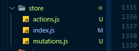<br />
	- state, getters 경우 내용이 많지 않아 모듈화 작업 생략

2. [ store/index.js] mutations 속성에 적용된 내용을 store/mutations.js에 적용한다.
	- **store/mutations.js**
		```javascript
		// mutations.js

		export default {
		  SET_NEWS(state, news) {
		    state.news = news
		  },
		  SET_JOBS(state, jobs) {
		    state.jobs = jobs
		  },
		  SET_ASK(state, ask) {
		    state.ask = ask
		  }
		}
		```
	- **store/index.js**
		- export const store 영역에 *mutations: mutations 로 적용할 경우, key 와 value 값이 동일하기 때문에 축약이 가능*하다.
		```javascript
		// index.js

		import mutations from './mutations.js'

		export const store = new Vuex.Store({
		  mutations
		})
		```

3. [ store/index.js] actions 속성에 적용된 내용을 store/actions.js에 적용한다.
	- **store/actions.js**
		- **actions 경우, index.js 파일에 적용되었던 API 관련 import 문구도 같이 적용**을 해야 한다.
		```javascript
		// actions.js

		import { fetchAskList, fetchJobsList, fetchNewsList } from '../api/index.js';
		
		export default {
		  FETCH_NEWS(context) {
		    fetchNewsList()
		      .then( response => {
		        context.commit('SET_NEWS', response.data);
		        console.log(response)
		      })
		      .catch( error => console.log(error))
		  },
		  FETCH_JOBS({commit}) {
		    fetchJobsList()
		      .then( ({ data }) => {
		        commit('SET_JOBS', data);
		      })
		      .catch( error => console.log(error))
		  },
		  FETCH_ASK({commit}) {
		    fetchAskList()
		      .then( ({data})  => {
		        commit('SET_ASK', data);
		      })
		      .catch( error => console.log(error))
		  }
		}
		```
	- **store/index.js**
		```javascript
		// index.js

		import actions from './actions.js';

		export const store = new Vuex.Store({
		  actions
		})
		```

<br />
<hr />
<br />

# 중간 정리 및 스타일링
- **main.js**
	- router, store 를 import
	- <code>new Vue({})</code> vue 인스턴스에 router, store 적용하여 현재 프로젝트에서 사용중인 것을 한 눈에 알 수 있다.

- **routes/index.js(router)**
	- **mode: 'history'** : URL에서 #(해쉬) 제거
	- **routes** : 각각의 url에 대한 정보 적용
	- **routes - redirect** : 루트 접속 시, 지정한 폴더로 자동 연결
	- **routes에 적용된 코드가 많아지면 모듈화 작업을 한다**

- **store/index.js**
	- mutations, actions 를 모듈화하여 적용
	- API를 연결하여 actions에서 state 값에 접근 했다.
	- API는 Api 폴더를 생성하여 별도로 분리하여 관리 (유지보수 용이)

- **현재까지 작업한 폴더 구조를 항시, 필히!! 참고**(Vuex 권고 가이드)

### ★☆ 중간 정리 == 코드 정리 ★☆
- **NewsView.vue**
	- item.title 클릭했을 때, item.url 로 연결
	- [ Vue 개발자 도구 ] mutations의 값을 보면서 title, url 등 적용할 수 있다<br />
		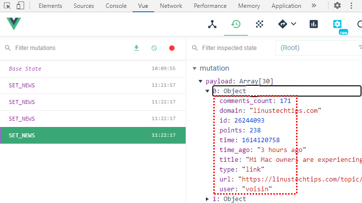<br />
		```html
		<!-- NewsView.vue -->
		<template>
		  <div>
		    <p v-for="item in this.$store.state.news">
		      <a v-bind:href="item.url">
		        {{ item.title}}
		      </a>
		      <small>{{ item.time_ago}} by {{ item.user }}</small>
		    </p>
		  </div>
		</template>
		```
	- JobsView, AskView 도 동일한 방식으로 수정
	- v-bind:href 경우, 축약해서 :href 로 쓸 수 있다.
		```html
		<!-- JobsView.vue -->
		<template>
		  <div>
		    <p v-for="job in this.$store.state.jobs">
		      <a :href="job.url">{{ job.title}}</a>
		      <small>{{ job.time_ago}}, {{ job.domain }}</small>
		    </p>
		  </div>
		</template>
		```
<br />
<hr />
<br />

## 6. 라우터 실전
### 6.1. 동적 라우트 매칭 원리 및 적용
1. News 페이지에서 user 이름 클릭 시 해당 user 정보 페이지로 이동하는 기능을 구현하려고 한다.<br />(이런 기능을 동적 라우트 매칭(Dynamic Route matching))
2. views 폴더에 UserView.vue 컴포넌트 파일을 새로 생성
3. [ routes/index.js ] UserView.vue 를 import 한다
	```javascript
	// routes/index.js
	import UserView from '../views/UserView.vue'

	export const router = new VueRouter({
	  mode: 'history',
	  routes: [
	    {
	      path: '/user',
	      component: UserView,
	    },
	  ]
	});
	```
4. News 페이지에서 user 이름 클릭 시, 해당 user 정보 페이지로 이동하려면<br />[ routes/index.js ] path에 경로를 설정해준다.
	- /:id 변수를 적용한다.
	```javascript
	// routes/index.js
	import UserView from '../views/UserView.vue'

	export const router = new VueRouter({
	  mode: 'history',
	  routes: [
	    {
	      path: '/user/:id',
	      component: UserView,
	    },
	  ]
	});
	```

5. [ NewsView.vue ] router-link 태그를 이용하여 user 정보 페이지로 이동한다.
	```html
	<!-- NewsView.vue  -->
	<template>
	  <div>
	    <p v-for="item in this.$store.state.news">
	      <a v-bind:href="item.url">
	        {{ item.title}}
	      </a>
	      <small>
	        {{ item.time_ago}} by 
	        <router-link to="/user">{{ item.user }}</router-link>
	        </small>
	    </p>
	  </div>
	</template>
	```

6. user 이름을 클릭했을 때, 해당 user 정보 페이지로 이동을 하려면 어떠한 값을 적용해야 하는데 그 값은 user API를 확인한 후 해당 값을 적용하면 된다.
	- [API - User 정보 확인하는 방법](https://github.com/tastejs/hacker-news-pwas/blob/master/docs/api.md#users) 
	- [API - User 정보](https://api.hnpwa.com/v0/user/davideast.json)를 보면 user 네임을 그대로 적용하면 되는 것으로 확인할 수 있다<br />
		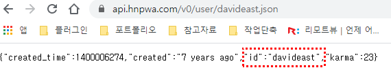<br />
	- 따라서, router-link 태그에 /user 주소 뒤에 user 네임을 적용하면 된다<br />
		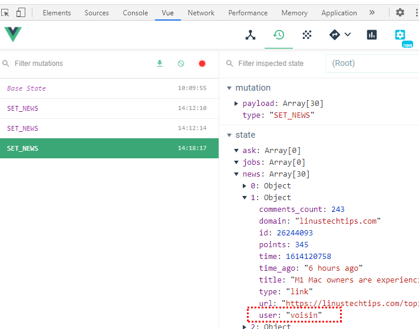<br />
		```html
		<template>
		  <div>
		    <p v-for="item in this.$store.state.news">
		      <a v-bind:href="item.url">
		        {{ item.title}}
		      </a>
		      <small>
		        {{ item.time_ago}} by 
		        <router-link v-bind:to="'/user/' + item.user">{{ item.user }}</router-link>
		        </small>
		    </p>
		  </div>
		</template>
		```
7. ES6 리터럴 문법(템플릿 스트링)을 적용하여 router-link v-bind 코드를 수정한다
	```html
	<template>
	  <div>
	    <p v-for="item in this.$store.state.news">
	      <a v-bind:href="item.url">
	        {{ item.title}}
	      </a>
	      <small>
	        {{ item.time_ago}} by 
	        <router-link v-bind:to="`/user/${item.user}`">{{ item.user }}</router-link>
	        </small>
	    </p>
	  </div>
	</template>
	```

8. 로컬 서버 - 브라우저에서 확인하면, 클릭한 user 이름에 따라 바뀌는 것을 확인할 수 있다<br />
	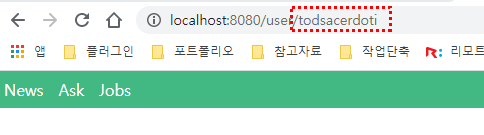<br />

9. 로컬 서버 - 브라우저에서 보면,<br />routes/index.js 파일에서 UserView의 컴포넌트 path 를 /user/:id 로 지정하였기 때문에<br />[ 뷰 개발자 도구] 에서 해당 컴포넌트 클릭 시, params - id 값을 확인할 수 있다.<br />
	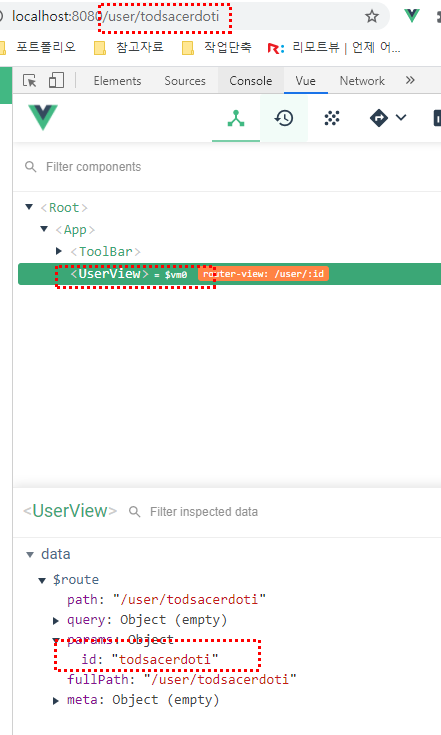<br />

#### ※  참고자료
- [Dynamic Route Matching 공식 문서 자세히보기](https://router.vuejs.org/guide/essentials/dynamic-matching.html)
- [해커 뉴스 API 문서 주소 자세히보기](https://github.com/tastejs/hacker-news-pwas/blob/master/docs/api.md)
- [ES6 템플릿 리터럴 설명 글(e북) 자세히보기](https://joshua1988.github.io/es6-online-book/template-literal.html)

<br />

### 6.2. 라우터 params을 이용한 User 상세 페이지 구현
1. [ UserView.vue ] 콘솔 로그에 route 정보를 출력해본다
	- User 정보 페이지에서 어떤 정보들을 출력할 수 있는 지 확인할 수 가 있다.
	```javascript
	created() {
	  console.log(this.$route);

		// user의 id(user name)값
	  console.log(this.$route.params.id);
	}
	```
	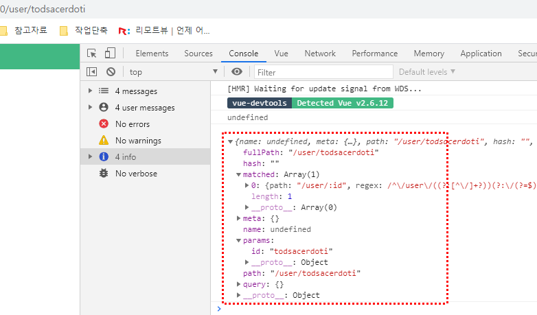<br />

2. [ UserView.vue ] 변수 userName 을 생성한다.
	```javascript
	// UserView.vue
	created() {
	  const userName = this.$route.params.id;
	}
	```

3. api/index.js에 user 정보 API 함수를 생성한다
	- 인자로 username 정보를 받는다.
	- [API - User 정보 확인하는 방법](https://github.com/tastejs/hacker-news-pwas/blob/master/docs/api.md#users)을 보면 url에 username이 주소에 들어가기 때문에 axios.get 으로 호출하는 .json에 해당 username을 적용한다.
	- [예시, username(davideast) API - User API 페이지 주소](https://api.hnpwa.com/v0/user/davideast.json)
	```javascript
	// api/index.js
	function fetchUserInfo(username) {
	  return axios.get(`${config.baseUrl}user/${username}.json`);
	}

	export {
	  fetchUserInfo
	}
	```

4. store/actions.js에 fetchUserInfo 함수를 적용한다.
	```javascript
	// store/actions.js
	import { fetchUserInfo } from '../api/index.js';

	FETCH_USER({commit}) {
	  fetchUserInfo()
	    .then()
	    .catch()
	}
	```

5. [ UserView.vue ] dispatch 로 actions - FETCH_USER 호출한다
	- userName을 인자로 전달한다
	- dispatch로 actions를 호출할 때, 인자는 하나만 전달되기 때문에 여러 개를 전달할 경우 객체로 감싸서 전달한다
		- <code>this.$store.dispatch('FETCH_USER', {userName, userName2});</code>
	```javascript
	export default {
	  created() {
	    const userName = this.$route.params.id;
	    this.$store.dispatch('FETCH_USER', userName);
	  }
	}
	```

6. actions.js 에서 SET_USER 커밋하여 정보를 전달한다.
	- state 에 user 정보를 담을 user 빈객체 속성을 추가한다
	```javascript
	// store/index.js
	state: {
	  user: {},
	},

	// store/mutations.js
	SET_USER(state, user) {
	  state.user = user
	}

	// store/actions.js
	FETCH_USER({commit}, name) {
	  fetchUserInfo(name)
	    .then( ({ data }) => {
	      commit('SET_USER', data)
	    } )
	    .catch( error => console.log(error))
	}
	```

7. [ 뷰 개발자도구 ] user: Object 에 user의 정보가 담긴 것을 확인할 수 있다.<br />
	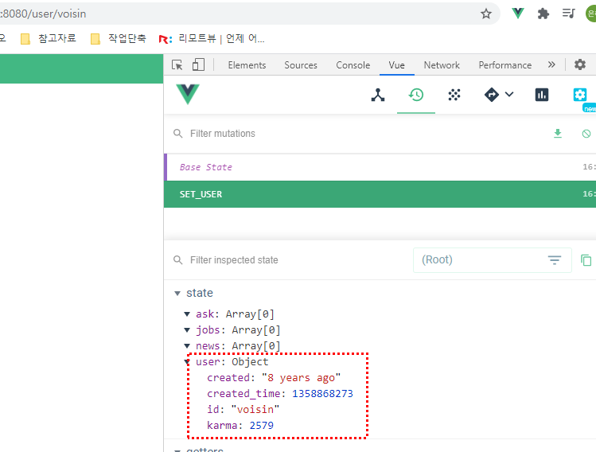<br />

8. user의 정보를 화면에 출력한다.
	```html
	<!-- UserView.vue -->
	<template>
	  <div>
	    <p>name : {{ this.$store.state.user.id }}</p>
	    <p>karma : {{ this.$store.state.user.karma }}</p>
	    <p>created: {{ this.$store.state.user.created }}</p>
	  </div>
	</template>
	```
	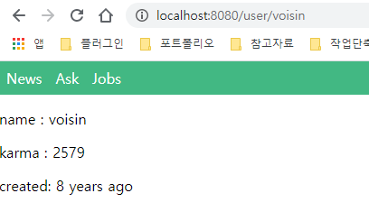<br />

9. template 안에 태그는 **최대한 정돈된 형태로 코드를 작성**해야 한다.
	```html
	<template>
	  <div>
	    <p>name : {{ userInfo.id }}</p>
	    <p>karma : {{ userInfo.karma }}</p>
	    <p>created: {{ userInfo.created }}</p>
	  </div>
	</template>

	<script>
	export default {
	  computed: {
	    userInfo() {
	      return this.$store.state.user;
	    }
	  },
	  created() {
	    const userName = this.$route.params.id;
	    this.$store.dispatch('FETCH_USER', userName);
	  }
	}
	</script>
	```
	<br />

### 6.3. 질문 상세 페이지 구현 실습
- [API - 질문 상세 :: item번호 참고](https://github.com/tastejs/hacker-news-pwas/blob/master/docs/api.md#individual-items)
#### 6.3.1 실습순서
1. ItemView 생성
2. 라우터에 ItemView로 갈 수 있는 라우터 정보를 등록
	```javascript
	{
	  path: '',
	  cmponent: ,
	}
	```
3. 해당 페이지 컴포넌트로 이동했을 때 받아온 params(id)를 이용해서 페이지에 데이터를 표시
	```javascript
	created() {
	  this.$store.dispatch('')
	}
	```
<br />

### 6.4. 질문 상세 페이지 실습 풀이 및 오류 디버깅
- [ routes/index.js ] ItemView의 path: '/item/:id' 로 적용하게 되면 오류가 난다.
	- [ 뷰 개발자도구 ] 에서 ask 부분을 보면 url:"item?id="18776224" 로 보여진다
	- routes에 적용한 /item/:id 표기방법과 맞지 않기 때문에 오류 발생
		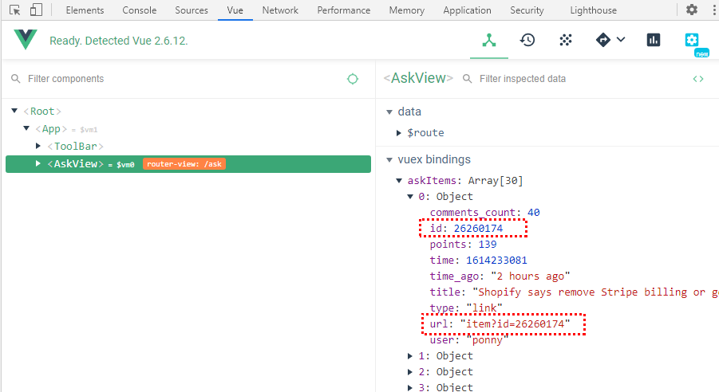<br />
	- routes에 적용한 표기와 맞게 AskView.vue 에서 router-link 태그를 수정한다.
		```html
		<router-link v-bind:to="`/item/${item.id}`">{{ item.title}}</router-link>
		```
		
	<br />

### 6.5. 질문 상세 페이지 스타일링 및 v-html 디렉티브 사용법 소개
1. ...mapGetters 함수를 이용하여 코드 수정
	```javascript
	// store/index.js
	getters: {
	  fetchedItem(state) {
	    return state.item
	  },
	},

	// ItemView.vue
	import { mapGetters } from 'vuex';
	
	export default {
	  computed: {
	    ...mapGetters(['fetchedItem']),
	  },
	}
	```
	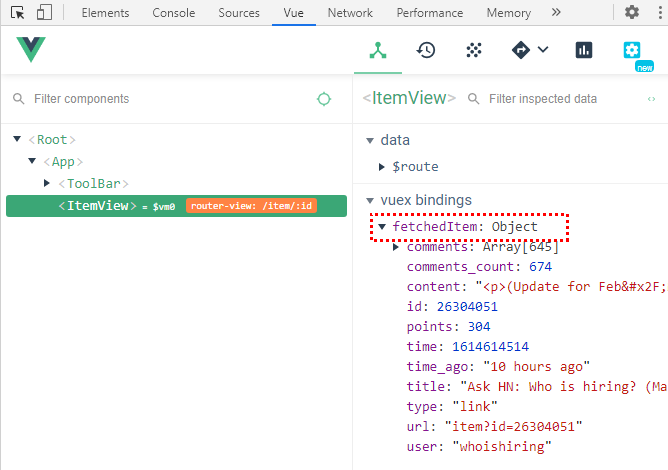<br />

2. **v-html : html 형식으로 불러와야 할 때**
	- 아래 이미지처럼, html 형식으로 된 내용을 불러와야 할 때 사용하는 v-html<br />
		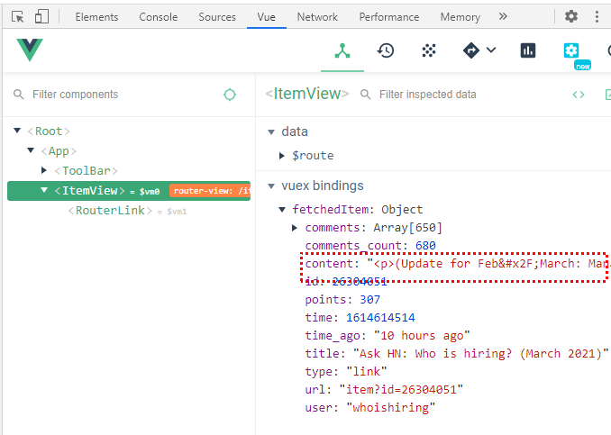<br />
	- v-html 디렉티브를 이용해 불러온다
		```html
		<!-- ItemView.vue -->
		<template>
		  <div>
		    <section>
		      <div v-html="fetchedItem.content"></div>
		    </section>
		  </div>
		</template>
		```
		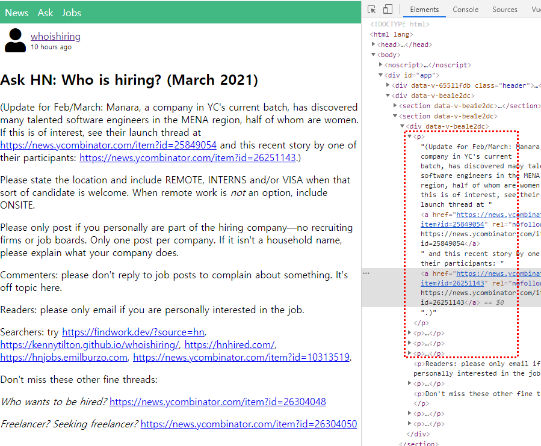<br />

#### ※ 참고자료
- [Font awesome 사이트 자세히보기](https://fontawesome.com/)
- [v-html API 문서 자세히보기](https://vuejs.org/v2/api/#v-html)
- [v-html과 데이터 바인딩 차이점 문서 자세히보기](https://vuejs.org/v2/guide/syntax.html#Raw-HTML)
<br />

### 6.6. 라우터 트랜지션
1. [ App.vue ] router-view 태그를 transition 태그로 감싼다
	- [라우터 트랜지션 문서 자세히보기](https://router.vuejs.org/guide/advanced/transitions.html#per-route-transition)
	- [All transition APIs](https://vuejs.org/v2/guide/transitions.html)
	- [뷰 트랜지션 문서 자세히보기](https://vuejs.org/v2/guide/transitions.html)
	```HTML
	<!-- 예제 -->
	<transition>
	  <router-view></router-view>
	</transition>

	<!-- App.vue -->
	<template>
	  <div id="app">
	    <transition>
	      <router-view></router-view>  
	    </transition>
	  </div>
	</template>
	```

2. [All transition APIs](https://vuejs.org/v2/guide/transitions.html)을 참고하여 테스트로 transition을 적용해본다.
	- transition 태그에 name 값을 부여한다. <code>name="page"</code>
		```HTML
		<!-- App.vue -->
		<template>
		  <div id="app">
		    <transition name="page">
		      <router-view></router-view>  
		    </transition>
		  </div>
		</template>
		```
	- transition 클래스를 적용한다.
		- name 값에 page를 주었기 때문에 page-enter-active, page-leave-to 로 적용한다
		```css
		.page-enter-active, .page-leave-active {
		  transition: opacity .5s;
		}
		.page-enter, .page-leave-to /* .page-leave-active below version 2.1.8 */ {
		  opacity: 0;
		}
		```
		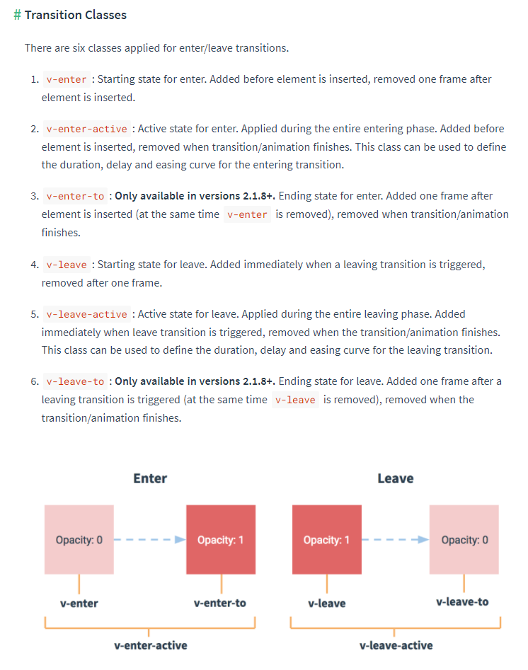<br />
	- [중급강좌 - 트렌지션 소개 및 구현 자세히보기](https://github.com/eunhye8767/learn_vue_js_02#42-%ED%8A%B8%EB%A0%8C%EC%A7%80%EC%85%98-%EC%86%8C%EA%B0%9C-%EB%B0%8F-%EA%B5%AC%ED%98%84)

	<br />
	<br />
	<br />

## 7. 리팩토링 1 - 리스트 아이템 컴포넌트 공통화
### 7.1. 컴포넌트 공통화 리팩토링 소개
현재까지 진행된 프로젝트를 컴포넌트 구조화 == 컴포넌트 공통화 리팩토링
<br />

### 7.2. 뉴스 리스트 스타일링 (실습)
- [ ToolBar.vue ] 툴바 router-link 에 css 적용<br />
	<br />
<br />

### 7.3. 공통 컴포넌트 ListItem 제작 및 실습 안내
1. AskView, JobsView, NewsView 뷰 컴포넌트 페이지에 "ul > li " 영역이 공통으로 보여진다. 해당 부분을 ListItem.vue 파일을 생성하여 공통 컴포넌트로 사용하려고 한다.

2. components 폴더에 ListItem.vue 파일을 생성한다.

3. 현재 3종 페이지 AskView, JobsView, NewsView 에 동일한 css가 적용되어 있는데 해당 css 값을 ListItem.vue에 적용한다.
	```css
	/*ListItem.vue*/
	.news-list {
	  margin: 0;
	  padding: 0;
	  list-style: none;
	}
	.post {
	  display: flex;
	  align-items: center;
	  border-bottom: 1px solid #eee;
	}
	.points {
	  width: 80px;
	  height: 60px;
	  display: flex;
	  align-items: center;
	  justify-content: center;
	  color: #42b883;
	}
	.news-title {
	  margin: 0;
	}
	.link-text {
	  color: #828282
	}
	```

4. NewsView.vue 에 적용된 "template", "script" 영역을 그대로 복사하여 ListItem.vue 에 붙여넣기 한다.
	- 붙여넣기 한 후에 해당 해당 페이지에 맞게 코드 수정 예정

5. NewsView.vue 의 전체 내용을 모두 ListItem.vue 에 적용한 후 NewsView.vue 를 아래와 같이 수정한다
	- import로 ListItem 컴포넌트를 불러온다
	```html
	<!-- NewsView.vue -->
	<template>
	  <list-item></list-item>
	</template>

	<script>
	import ListItem from '../components/ListItem.vue'
	export default {
	  components: {
	    ListItem,
	  }
	}
	</script>

	<style>

	</style>
	```

6. [ 뷰 개발자 도구 ] ListItem 컴포넌트가 적용된 것을 확인할 수 있다<br />
	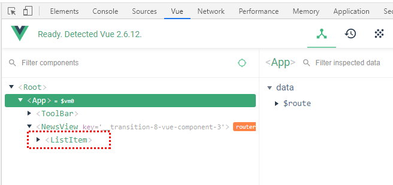<br />

<br />

### 7.4. 공통 컴포넌트 구현(1) - 페이지별 데이터 분기
1. [ components/ListItem.vue ] 파일에서 페이지별 조건을 준 후, 해당 컴포넌트 페이지에 맞게 데이터를 출력해야 한다.
2. [ components/ListItem.vue ] created 시, route 콘솔로그를 뿌려주면 해당 URL에 맞게 path 가 변경됨을 알 수 있다.
	- 데이터 분기 조건 : [ this.$route.path === '/news' ]
	- 본 수업에선 위 조건이 아닌 다른 방식으로 조건 적용 예정
	```javascript
	// ListItem.vue
	export default {
	  created() {
	    console.log(this.$route)
	  }
	}
	```
	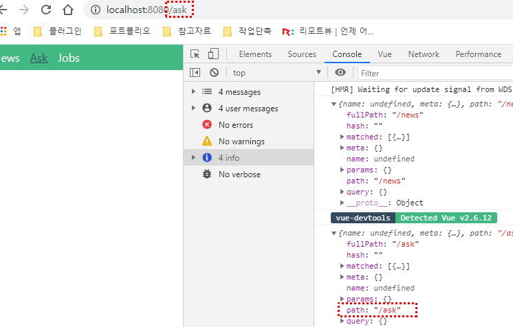<br />
3. [ routes/index.js ] routes 속성에서 path, component 외에 name 값도 적용한다
	```javascript
	routes: [
	  {
	    path: '/news',
	    name: 'news',
	    component: NewsView,
	  },
	  {
	    path: '/ask',
	    name: 'ask',
	    component: AskView,
	  },
	  {
	    path: '/jobs',
	    name: 'jobs',
	    component: JobsView,
	  },
	}
	```
4. 콘솔로그를 확인해보면 name 값이 적용된 것을 알 수 있다<br />
	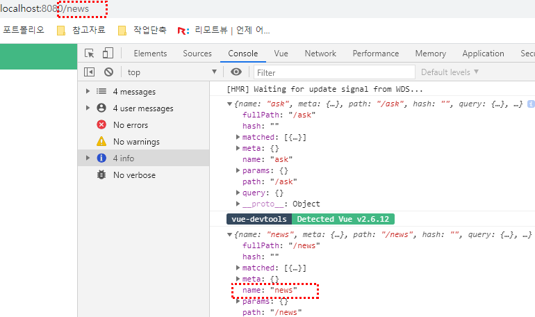<br />

5. [ components/ListItem.vue ] 페이지별 조건을 주어 데이터를 화면에 뿌려준다
	- route의 name을 변수에 담아 if문을 만든다
	- 각 페이지별 달랐던 created() 속성 값을 if문 조건에 맞게 값을 적용한다
	```javascript
	export default {
	  created() {
	    const name = this.$route.name;
			const actionName = this.$store.dispatch();
	    if ( name === 'news') {
	      this.$store.dispatch('FETCH_NEWS');
	    } else if ( name === "ask") {
	      this.$store.dispatch('FETCH_ASK')
	    } else if ( name === "jobs") {
	      this.$store.dispatch('FETCH_JOBS')
	    }
	  }
	}
	```
	- 코드를 보면 this.$store.dispatch 문구도 반복적으로 보여지는데, 해당 문구도 변수로 만들어 사용할 수 있다
		```javascript
		const name = this.$route.name;
		const actionName = (name) => {
		  this.$store.dispatch(name);
		};
		if ( name === 'news') {
		  actionName('FETCH_NEWS');
		} else if ( name === "ask") {
		  actionName('FETCH_ASK');
		} else if ( name === "jobs") {
		  actionName('FETCH_JOBS');
		}
		```
6. 이제, 페이지별로 갖고 온 데이터를 화면에 뿌려주는 작업을 하면 된다<br />
	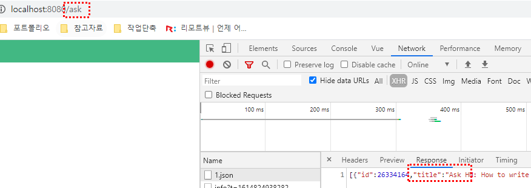<br />
	<br />

### 7.5. 공통 컴포넌트 구현(2) - computed 속성
1. [ components/ListItem.vue ] v-for 디렉티브에서 url 페이지 조건에 따라 데이터를 화면에 출력하려고 한다.
	```html
	<!-- 예시 news -->
	<li v-for="item in this.$store.state.news">
	```
2. v-for 디렉티브에서 this.$store.state.~~ 부분을 listItems 로 적용하고 computed 속성에 listItems 속성을 추가한다
	```html
	<template>
	  <div>
	    <ul class="news-list">
	      <li v-for="item in listItems" class="post">
	      </li>
	    </ul>
	  </div>
	</template>
	```
	```javascript
	export default {
	  computed: {
	    listItems() {
			
	    }
	  },
	}
	```
3. ListItem.vue - computed 코드를 아래와 같이 적용한다
	```javascript
	computed: {
	  listItems() {
	    const name = this.$route.name;
	    if ( name === 'news') {
	      return this.$store.state.news;
	    } else if ( name === "ask") {
	      return this.$store.state.ask;
	    } else if ( name === "jobs") {
	      return this.$store.state.jobs;
	    }
	  }
	},
	```
4. JobsView.vue 파일도 동일하게 수정을 한다
<br />

### 7.6. 공통 컴포넌트 구현(3) - template 속성과 v-if 디렉티브 활용 1
1. template 영역안에 페이지별 분기 처리를 해줘야 한다
	- AskView 경우, 타이틀 클릭 시 route-link 로 페이지 이동이 된다.
	- 특정 조건을 주어 페이지에 따라 적용하려고 한다
2. template 태그와 v-if 디렉티브를 이용하여 적용을 하려고 한다
	- v-if 조건이 맞으면 해당 template 영역이 보여지고 맞지 않으면 v-else template 속성이 보여진다.
	```html
	<div>
	  <p>
			<template v-if=""></template>
			<template v-else></template>
	  </p>
	</div>
	```
<br />

### 7.7. 공통 컴포넌트 구현(4) - template 속성과 v-if 디렉티브 활용 2
1. NewsView, AskView, JobsView 를 보면 NewsView와 JobsView 는 domain 이 있어서 title을 클릭하면 해당 도메인의 url로 이동이 된다<br />
	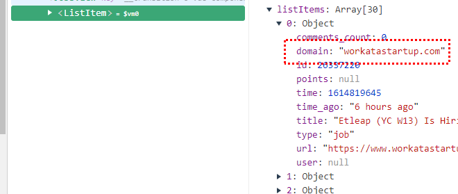<br />
2. v-if 디렉티브의 조건을 item.domain 유무로 적용한다
	```html
	<!-- ListItem.vue -->
	<p class="news-title">
	  <template v-if="item.domain">
	    <a v-bind:href="item.url">
	      {{ item.title}}
	    </a>
	  </template>
	  <template v-else>
	    <router-link v-bind:to="`/item/${item.id}`">
	      {{ item.title}}
	    </router-link>
	  </template>
	</p>
	```
3. JobsView 경우, User(사용자)가 아닌 site(domain)가 나와야 한다
	- router-link 태그에 v-if 로 직접 조건을 걸어준다
	```html
	<small class="link-text">
	  {{ item.time_ago}} by 
	  <router-link 
	    v-if="item.user"
	    v-bind:to="`/user/${item.user}`" class="link-text">
	    {{ item.user }}
	  </router-link>  
	  <a :href="item.url" v-else target="_blank">
	    {{ item.domain }}
	  </a>
	</small>
	```

<br />
<br />
<br />

## 8. 리팩토링 2 - 사용자 프로필 컴포넌트 공통화
### 8.1. 사용자 프로필 컴포넌트 소개 및 등록
1. [ components/UserProfile.vue ] 파일을 새로 생성한다.
2. [ UserProfile.vue ] 코드를 아래와 같이 작성한다.
	```html
	<!-- UserProfile.vue -->
	<template>
	  <div>
	    <div class="user-container">
	        <div>
	          <i class="fas fa-user"></i>
	        </div>
	        <div class="user-description">
	          <!-- <router-link :to="`/user/${fetchedItem.user}`">
	            {{ fetchedItem.user }}
	          </router-link>
	          <div class="time">
	            {{ fetchedItem.time_ago }}
	          </div> -->
	        </div>
	      </div>
	  </div>
	</template>

	<script>
	export default {

	}
	</script>

	<style scoped>
	.user-container { 
	  display: flex;
	  align-items: center;
	  padding: 0.5rem;
	}
	.fa-user {
	  font-size: 2.5rem;
	}
	.user-description {
	  padding-left: 8px;
	}
	.time {
	  font-size: 0.7rem;
	}
	</style>	
	```
3. [ UserView.vue ] UserProfile.vue 를 import 한다
	- 기존 UserView에 적용되었던 id와 krama, created 내용을 UserProfile에 적용하려고 한다.
	```html
	<!-- UserView.vue -->
	<template>
	  <div>
	    <user-profile></user-profile>
	    <!-- <p>name : {{ userInfo.id }}</p>
	    <p>karma : {{ userInfo.karma }}</p>
	    <p>created: {{ userInfo.created }}</p> -->
	  </div>
	</template>

	<script>
	import UserProfile from '../components/UserProfile.vue'
	export default {
	  components: {
	    UserProfile,
	  },
	  // computed: {
	  //   userInfo() {
	  //     return this.$store.state.user;
	  //   }
	  // },
	  // created() {
	  //   const userName = this.$route.params.id;
	  //   this.$store.dispatch('FETCH_USER', userName);
	  // }
	}
	</script>	
	```
	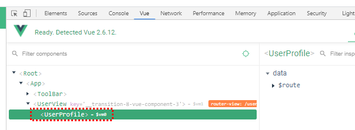<br />
	<br />

### 8.2. 사용자 컴포넌트 데이터 흐름 처리 1
1. [ UserView.vue ] created() 시 dispatch로 'FETCH_USER' 실행되어 state - user에 내용이 담겨 있다.<br />
	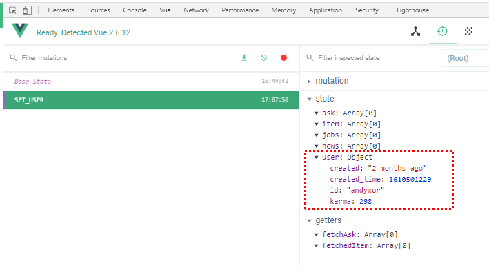<br />
2. [ UserView.vue ] computed에 등록된 userInfo 속성을 삭제하고 UserProfile.vue 에 적용한다.
	```javascript
	computed: {
	  userInfo() {
	    return this.$store.state.user;
	  }
	},
	```
3. [ UserProfile.vue ] template 영역의 코드를 아래와 같이 수정한다
	- fetchedItem -> userInfo 로 변경한다<br />
		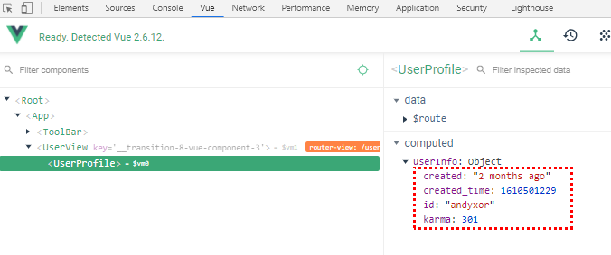<br />
	```html
	<template>
	  <div>
	    <div class="user-container">
	        <div>
	          <i class="fas fa-user"></i>
	        </div>
	        <div class="user-description">
	          <div>
	            {{ userInfo.id }}
	          </div>
	          <div class="time">
	            {{ userInfo.created }}
	          </div>
	        </div>
	      </div>
	  </div>
	</template>
	```
<br />

### 8.3. 사용자 컴포넌트 데이터 흐름 처리 2
1. props 기능을 활용하여 데이터 흐름을 처리한다
2. [props(프롭스) 자세히보기](https://github.com/eunhye8767/learn_vue_js_01#43-props-%EC%86%8D%EC%84%B1)
	```html
	<!-- props: ['프롭스 이름'] -->
	<app-header v-bind:propsdata="message"></app-header>
	```
	```javascript
	var appHeader = {
	  props: ['propsdata']
	}
	```
3. [ UserView.vue ] props(프롭스) 데이터 전달
	- props 이름 : info
	- 데이터 전달 : userInfo
	```html
	<template>
	  <div>
	    <user-profile :info="userInfo"></user-profile>
	  </div>
	</template>

	<script>
	import UserProfile from '../components/UserProfile.vue'
	export default {
	  components: {
	    UserProfile,
	  },
	  computed: {
	    userInfo() {
	      return this.$store.state.user;
	    }
	  },
	  created() {
	    const userName = this.$route.params.id;
	    this.$store.dispatch('FETCH_USER', userName);
	  }
	}
	</script>
	```
4. props를 [ UserProfile.vue ] 에서 명시
	- props: [ 'info' ]
	- props 를 info 로 받고, info의 타입을 Object 로 정의
	```html
	<!-- UserProfile.vuye -->
	<template>
	  <div>
	    <div class="user-container">
	        <div>
	          <i class="fas fa-user"></i>
	        </div>
	        <div class="user-description">
	          <div>
	            {{ info.id }}
	          </div>
	          <div class="time">
	            {{ info.created }}
	          </div>
	        </div>
	      </div>
	  </div>
	</template>

	<script>
	export default {
	  props: {
	    info : Object,
	  },
	}
	</script>
	```
	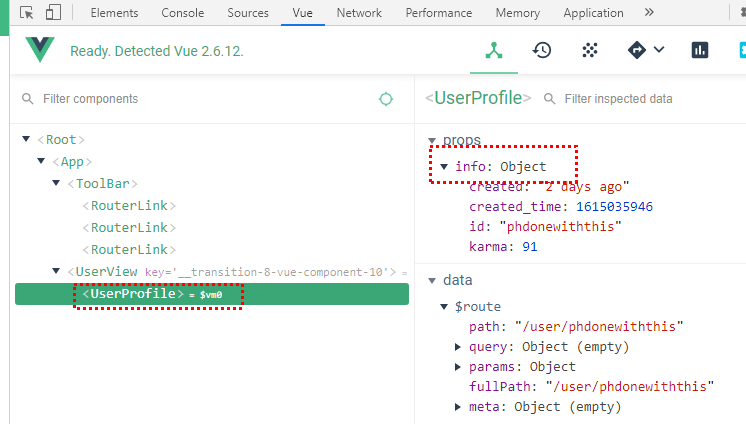<br />
<br />

### 8.4. 2가지 데이터 흐름 비교
- Vuex 구조에 적합한 로직 방법 = [UserProfile에서 computed로 접근하는 방식](https://github.com/eunhye8767/learn_vue_js_04#82-%EC%82%AC%EC%9A%A9%EC%9E%90-%EC%BB%B4%ED%8F%AC%EB%84%8C%ED%8A%B8-%EB%8D%B0%EC%9D%B4%ED%84%B0-%ED%9D%90%EB%A6%84-%EC%B2%98%EB%A6%AC-1)
- 컴포넌트 간에 데이터 연관성의 이점을 알아볼 때 = [UserView에서 propsfh 전달하는 방식](https://github.com/eunhye8767/learn_vue_js_04#83-%EC%82%AC%EC%9A%A9%EC%9E%90-%EC%BB%B4%ED%8F%AC%EB%84%8C%ED%8A%B8-%EB%8D%B0%EC%9D%B4%ED%84%B0-%ED%9D%90%EB%A6%84-%EC%B2%98%EB%A6%AC-2)<br /><br />
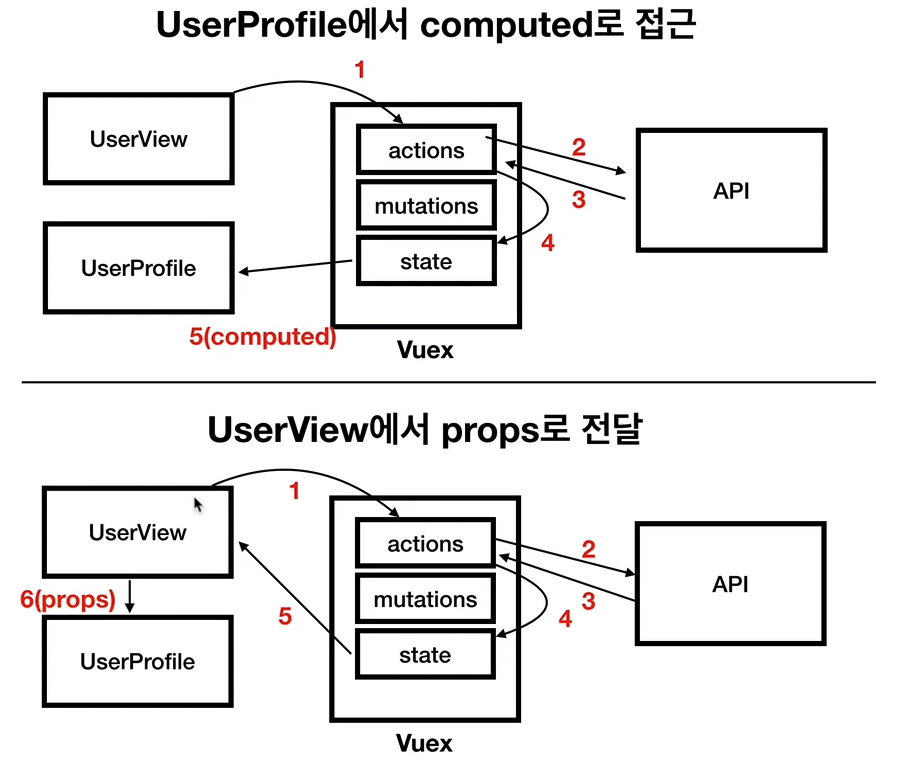<br />

<br />

### 8.5. slot을 이용한 사용자 프로필 컴포넌트 구현
1. [ ItemView.vue ] UserProfile 컴포넌트를 이용하여 코드를 개선한다
2. [ ItemView.vue ]
	- v-bind:info에서 fetchedItem로 데이터를 넘겨받는다.
	- store/index.js 에서 명시한 item=[] 으로 인해 에러 발송<br />
		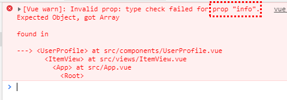<br />
		- UserProfile.vue 에서 props를 Object = 객체로 받았기 때문에 store/index.js에서 명시한 배열로 인해 에러가 발생, 해당 부분을 배열이 아닌 객체로 수정해야 함.
			```javascript
			// store/index.js
			item = {}
			```
	```html
		<template>
		  <div>
		    <section>
		      <!-- 사용자 정보 -->
		      <user-profile :info="fetchedItem"></user-profile>
		      <!-- <div class="user-container">
		        <div>
		          <i class="fas fa-user"></i>
		        </div>
		        <div class="user-description">
		          <router-link :to="`/user/${fetchedItem.user}`">
		            {{ fetchedItem.user }}
		          </router-link>
		          <div class="time">
		            {{ fetchedItem.time_ago }}
		          </div>
		        </div>
		      </div> -->
		    </section>
		  </div>
		</template>	
	```
3. ItemView와 UserProfile 의 props 키 값이 달라 발생하는 오류 이슈
	- UserProfile 에서의 id, created로 화면 출력한 값이 ItemView에서는 user, time_ago 로 에러 발생
		- fetchedItem.user = id(UserProfile) 
		- fetchedItem.time_ago = created(UserProfime)
	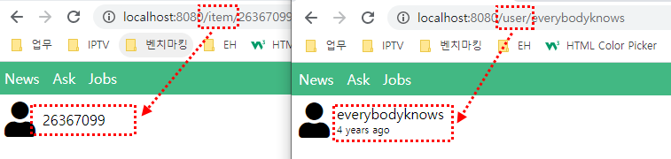<br />

4. slot을 이용하여 같은 컴포넌트에서 조건에 따라 화면 출력되는 내용을 바꾼다
	- [중급강좌 - slot이란? 자세히보기](https://github.com/eunhye8767/learn_vue_js_02#41-%EB%AA%A8%EB%8B%AC-%EC%BB%B4%ED%8F%AC%EB%84%8C%ED%8A%B8-%EB%93%B1%EB%A1%9D)
	- [설명 - slot 코드 형식](https://joshua1988.github.io/vue-camp/reuse/slots.html#%EC%8A%AC%EB%A1%AF-%EC%BD%94%EB%93%9C-%ED%98%95%EC%8B%9D)

5. [ UserProfile.vue ] 2개의 slot 태그를 생성한다
	- slot을 username, time 2개를 만들었다
	```html
	<template>
	  <div>
	    <div class="user-container">
	        <div>
	          <i class="fas fa-user"></i>
	        </div>
	        <div class="user-description">
	          <!-- username <div>
	            {{ info.id }}
	          </div> -->
	          <slot name="username"></slot>
	          <div class="time">
	            <!-- {{ info.created }} -->
	            <slot name="time"></slot>
	          </div>
	        </div>
	      </div>
	  </div>
	</template>	
	```
6. [ ItemView.vue ] user-profile 태그를 아래와 같이 적용한다
	- UserView.vue 도 아래 코드를 참고하여 수정한다
	```html
	<user-profile :info="fetchedItem">
	  <div slot="username">{{ fetchedItem.user }}</div>
	  <template slot="time">{{ fetchedItem.time_ago }}</template>
	</user-profile>	
	```

#### ※ 참고자료
- [Props Validation API 문서 자세히보기](https://vuejs.org/v2/guide/components-props.html#Prop-Validation)
- [Vue.js 중급 강좌 slot 강의 링크 자세히보기](https://www.inflearn.com/course/vue-pwa-vue-js-%EC%A4%91%EA%B8%89/lecture/11520?tab=curriculum)

#### ※ slot를 template로 불러올 때
- **< div slot="time" ></ div >**
	- div 태그 생성과 함께 slot 컨텐츠 내용이 화면에 표시된다<br />
		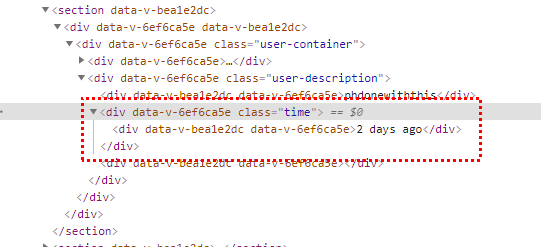<br />
- **< template slot="time" ></ template >**
	- 생성되는 태그 없이 slot 컨텐츠 내용이 화면에 표시된다.
	- template 태그는 화면에 그려질 HTML 태그가 없다.<br />
		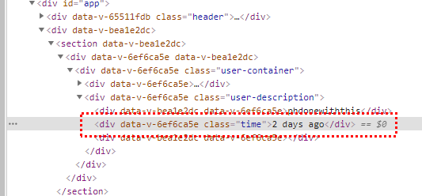<br />
		<br />

### 8.6. 사용자 프로필 컴포넌트 스타일링 및 코드 정리
1. [ ItemView.vue ] UserName 클릭 시 해당 User 정보로 페이지 이동되게 적용
	```html
	<!-- ItemView.vue -->
	<router-link slot="username" :to="`/user/${fetchedItem.user}`">
	  {{ fetchedItem.user }}
	</router-link>
	```
<br />
<br />
<br />

## 9. 리팩토링 3 - Mixin과 하이 오더 컴포넌트
### 9.1. 컴포넌트 재활용 방법 및 재활용할 포인트 소개
1. NewsView, AskView, JobsView 에 해당하는 페이지 컴포넌트를 재활용하려고 한다
2. 3개의 페이지(NewsView, AskView, JobsView )는 list-item 태그에 데이터를 불러오고<br />분기처리는 ListItem.vue에서 처리하고 있다
3. 공통화를 위해 ListItem.vue에 적용된 created() {} 코드를 각각의 페이지에 맞게 적용을 한다
4. created에서 분기처리가 필요한 게 dispatch 이고, 해당 부분을 공통화하려고 한다.
<br />

### 9.2. 이벤트 버스를 이용한 스피너 컴포넌트 구현
#### ※ 참고자료
- [스피너 컴포넌트 소스 주소](https://github.com/joshua1988/vue-advanced/blob/12_spinner/vue-news/src/components/Spinner.vue)
<br />

#### 9.2.1. Spinner 컴포넌트 생성 및 적용하는 방법
1. Mixin과 하이 오더 컴포넌트 적용 전, 해당 부분이 왜 좋은 지를 알기 위해 프로그레스바(=페이지 로딩바)를 적용하려고 한다.
2. components 폴더에 Spinner.vue 파일을 생성하고 아래 코드를 그대로 적용한다
	```html
	<template>
	  <div class="lds-facebook" v-if="loading">
	    <div>
	    </div>
	    <div>
	    </div>
	    <div>
	    </div>
	  </div>
	</template>

	<script>
	export default {
	  props: {
	    loading: {
	      type: Boolean,
	      required: true,
	    },
	  },
	}
	</script>

	<style scoped>
	.lds-facebook {
	  display: inline-block;
	  position: absolute;
	  width: 64px;
	  height: 64px;
	  top: 47%;
	  left: 47%;
	}
	.lds-facebook div {
	  display: inline-block;
	  position: absolute;
	  left: 6px;
	  width: 13px;
	  background: #42b883;
	  animation: lds-facebook 1.2s cubic-bezier(0, 0.5, 0.5, 1) infinite;
	}
	.lds-facebook div:nth-child(1) {
	  left: 6px;
	  animation-delay: -0.24s;
	}
	.lds-facebook div:nth-child(2) {
	  left: 26px;
	  animation-delay: -0.12s;
	}
	.lds-facebook div:nth-child(3) {
	  left: 45px;
	  animation-delay: 0;
	}
	@keyframes lds-facebook {
	  0% {
	    top: 6px;
	    height: 51px;
	  }
	  50%, 100% {
	    top: 19px;
	    height: 26px;
	  }
	}
	</style>	
	```
3. Spinner.vue가 실행되는 지를 확인하려면 App.vue에 아래와 같이 적용한다
	```html
	<template>
	  <div id="app">
	    <spinner :loading="true"></spinner>
	  </div>
	</template>

	<script>
	import Spinner from './components/Spinner.vue';

	export default {
	  components: {
	    Spinner,
	  },
	}
	</script>
	```
4. :loading="true" 로 적용을 하면 아래 이미지처럼 spinner가 보여진다.
	- spinner가 언제 보여주고? 언제 사라지게 할 것인지? 기준을 적용해야 한다.
	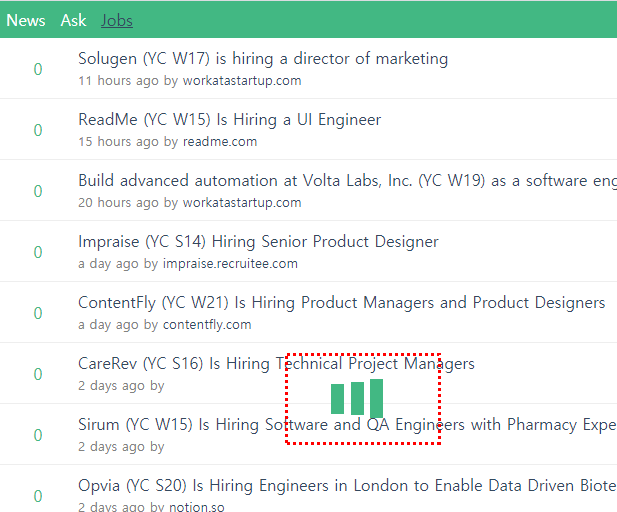<br />
<br />

#### 9.2.2. Spinner 기능 구현하는 방법
1. [ 뷰 개발자도구 ] /news 페이지를 기준으로 컴포넌트 관계도를 확인한다
	- Spinner의 Loading 상태를 전달하려면 NewsView 에서는 props를 내릴 수 없다
	- 이벤트 버스를 통해 NewsView에서 Spinner를 관리하려고 한다<br />
	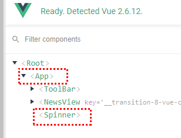<br />

2. src/utils/bus.js 파일 생성 (utils 폴더 생성하여 bus.js 새파일 만들기)

3. **이벤트 버스란?**<br />빈 이벤트 객체를 하나 만들어서 그 이벤트 객체를 통해서 컴포넌트 간의 데이터 전달하는 것을 의미
	- export default new Vue() == new Vue를 그대로 export 하는 것
	- 이벤트 버스 경우, 라이프 사이클 훅에 보통 정의를 내린다.
	```javascript
	// utils/bus.js
	import Vue from 'vue';

	export default new Vue();
	```

4. [ NewsView.vue ] 이벤트 버스 에밋을 적용한다
	```javascript
	// NewsView.vue
	import bus from '../utils/bus.js';

	export default {
	  created() {
	    bus.$emit('start:spinner');
	  }
	}
	```

5. [ App.vue ] 이벤트 버스가 발생되면 Spinner를 실행시킨다.
	- Spinner가 실행되는 메서드와 종료되는 메서드를 만든다
	```html
	<template>
	  <div id="app">
	    <spinner :loading="loadingStatus"></spinner>
	  </div>
	</template>	
	```
	```javascript
	// App.vue
	import bus from './utils/bus.js';

	export default {
	  components: {
	    Spinner,
	  },
	  data() {
	    return {
	      loadingStatus: false,
	    };
	  },
	  methods: {
	    startSpinner() {
	      this.loadingStatus = true;
	    },
	    endSpinner() {
	      this.loadingStatus = false;
	    }
	  },
	  created() {
	    bus.$on('start:spinner', this.startSpinner)
	  }
	}
	```

6. 이벤트가 제대로 왔는 지는 [ 뷰 개발자도구 ]에서 확인한다<br />
	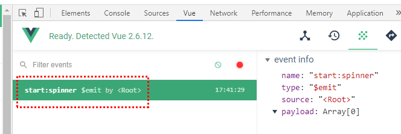<br />

7. 실행되고 난 후, 종료되는 Spinner 코드도 적용해준다
	```javascript
	// NewsView.vue
	created() {
	  bus.$emit('start:spinner');
	  this.$store.dispatch('FETCH_NEWS');
	  bus.$emit('end:spinner')
	}

	// App.vue
	created() {
	  bus.$on('start:spinner', this.startSpinner)
	  bus.$on('end:spinner', this.endSpinner)
	}
	```

8. **이벤트 버스 경우, beforeDestroy에서 off를 꼭 해줘야 한다!!**
	- 이벤트 버스는 이벤트 객체로 계속 쌓이기 때문에 **컴포넌트의 역활이 끝나기 전에 꼭! off 를 해줘야** 한다.
	```javascript
	// App.vue
	created() {
	  bus.$on('start:spinner', this.startSpinner);
	  bus.$on('end:spinner', this.endSpinner);
	},
	beforeDestroy() {
	  bus.$off('start:spinner', this.startSpinner);
	  bus.$off('end:spinner', this.endSpinner);
	}
	```

9. 어떤 시점에서 start 를 하고? 어떤 시점에서 end 할 지? 기준을 적용해야 한다.
<br />

### 9.3. 스피너 실행 및 종료 시점 알아보기
1. [ store/actions.js ] fetchNewsList().then()에 return response 를 추가한다.
	- return response 를 주면 NewsView.vue 에서 then()으로 체인링할 수 있다.
	- return response 를 넣지 않더라도 this.$store.dispatch('FETCH_NEWS').then()으로 코드를 작성할 순 있지만, 해당 코드가 액션 함수 내부에서 실행된 비동기 처리 코드를 기다려주진 않는다.<br />따라서, 비동기 처리 결과인 데이터 호출 값을 컴포넌트까지 넘겨주기 위해서는 **return 데이터 응답** 코드를 넣어주셔야 한다.<br />다시 정리하면 **actions 함수의 호출 결과에는 반드시 Promise 객체가 있어야 하기 때문에 return 코드가 필요**하다.
	```javascript
	// actions.js
	export default {
	  FETCH_NEWS(context) {
	    fetchNewsList()
	      .then( response => {
	        context.commit('SET_NEWS', response.data);
	        return response;
	      })
	      .catch( error => console.log(error))
	  },
	}

2. actions.js 에서 프로미스 객체 responese를 반환하였기 때문에<br />반환한 객체를 가지고 NewsView에서 then 으로 계속 추가적인 처리를 할 수 있다.
	- [ actions.js ] response를 받아오고 conttext.commit(뮤테이션으로) 데이터를 보내주고 return response(응답 데이터를 화면으로 계속 보낸다)
	- this.$store.dispatch('FETCH_NEWS')에서 호출 받은 데이터를 컴포넌트 단에서 접근하려면 .then()으로 체이닝해야 된다는 의미
	```javascript
	// NewsView.vue
	export default {
	  created() {
	    this.$store.dispatch('FETCH_NEWS')
	      .then()
	      .catch();
	  }
	}
	```

3. [ NewsView.vue ] dispatch(데이터 호출) 성공(then), 실패(catch) 시 실행할 로직을 적용한다.
	- 성공(then) : fetched 콘솔로그 메세지가 보여지고 spinner 이벤트 종료를 실행한다
	- 실패(catch) : error 콘솔로그 메세지가 보여진다.
	```javascript
	// NewsView.vue
	export default {
	  created() {
	    bus.$emit('start:spinner');
	    this.$store.dispatch('FETCH_NEWS')
	      .then( ()=> {
	        console.log('fetched');
	        bus.$emit('end:spinner')
	      })
	      .catch( (error)=> {
	        console.log(error);
	      });
	  }
	```

4. [ NewsView.vue ] 로직이 제대로 잘 되는 지 확인하기 위해 setTimeout을 이용하려고 한다
	```javascript
	export default {
	  created() {
	    bus.$emit('start:spinner');
	    setTimeout(() => {
	      this.$store.dispatch('FETCH_NEWS')
	        .then( ()=> {
	          console.log('fetched');
	          bus.$emit('end:spinner')
	        })
	        .catch( (error)=> {
	          console.log(error);
	        });
	    }, 3000);
	  }
	}
	```

5. AskView, JobsView 에도 동일하게 적용한다

<br />

### 9.4. 하이 오더 컴포넌트(HOC) 소개 및 구현
#### 9.4.1. 하이 오더 컴포넌트(HOC) 소개
- 컴포넌트의 코드를 재사용할 수 있는 기술 중 하나이다.
- 리액트에서 하이 오더 컴포넌트를 가장 많이 쓰고 있다.<br />최근 리액트에서 훅이 나왔는데 그 이윤 컴포넌트 코드의 재사용성을 위해서 업데이트된 기능이다.
- 하이 오더 컴포넌트는 컴포넌트 레벨이 깊어지는 단점이 있었기 때문에 리액트에서는 훅, Vue에서는 믹스인을 많이 사용하고 있다.
- 하이 오더 컴포넌트는 **컴포넌트의 로직(코드)을 재사용하기 위한 고급 기술**이다.

#### ※ 참고자료
- [컴포넌트의 코드마저 재상용하는 하이 오더 컴포넌트 자세히보기](https://joshua1988.github.io/vue-camp/design/pattern5.html)
- [리액트 하이 오더 컴포넌트 공식문서](https://reactjs.org/docs/higher-order-components.html)
<br />

#### 9.4.2. 하이 오더 컴포넌트(HOC) 구현
1. [ routes/index.js ] news, ask, jobs - 총 3개는 같은 역활을 하고 있다
2. 위의 내용을 기억해둔다<br />views 폴더에 CreateListView.js 파일을 생성하고 아래 코드를 적용한다
	```javascript
	// views/CreateListView.js
	export default function createListView() {
		// 재사용할 인스턴스(컴포넌트) 옵션들이 들어갈 자리
	}
	```
	- *재사용할 인스턴스(컴포넌트) 옵션들이 들어갈 자리 - 예시*
		```javascript
		// views/CreateListView.js
		export default function createListView() {
		  // 재사용할 인스턴스(컴포넌트) 옵션들이 들어갈 자리
		  el : '',
		  data: '',
		  components: {
		    
		  },
		  created() {
		    
		  }
		}
		```
3. CreatListView.js 를 routes/index.js 에서 사용하려고 한다
	```javascript
	// routes/index.js
	import createListView from '../views/CreateListView.js';

	export const router = new VueRouter({
	  routes: [
	    {
	      path: '/news',
	      name: 'news',
	      // component: NewsView,
	      component: createListView('NewsView'),
	    },
	    {
	      path: '/ask',
	      name: 'ask',
	      // component: AskView,
	      component: createListView('AskView'),
	    },
	    {
	      path: '/jobs',
	      name: 'jobs',
	      // component: JobsView,
	      component: createListView('JobsView'),
	    },
	```

4. createListView()가 하이 오더 컴포넌트 이다.<br />기존에 있었던 컴포넌트들의 위의 하나 컴포넌트가 더 생기는 것이다
 - 아래 이미지 중 화살표 친 부분에 하이 오더 컴포넌트가 생성될 자리<br />
	<br />

5. CreateListView.js - createListView 함수에 인자로 name을 받는다.
	```javascript
	export default function createListView(name) {
		return {

		}
	}	
	```

6. render 함수를 이용하여 로직(코드) 적용
	- 내부적으로 템플릿을 컴파일레이션 변환을 해주고 변환을 할 때 render 함수를 사용한다
	- render 함수로 컴포넌트를 로딩을 한다는 것이다.
	```javascript
	export default function createListView(name) {
		return {
	  	// 재사용할 인스턴스(컴포넌트) 옵션들이 들어갈 자리
	  	name : name,  // 'NewsView'
	  	render(createElement) {
	  	  return createElement();
	  	}
		}
	}
	```

7. views/ListView.vue 라는 컴포넌트를 생성한다
8. CreateListView.js 에서 ListView를 import 한다
	```javascript
	import ListView from './ListView.vue';

	export default function createListView(name) {
	  // 재사용할 인스턴스(컴포넌트) 옵션들이 들어갈 자리
	  name : name,  // 'NewsView'
	  render(createElement) {
	    return createElement(ListView);
	  }
	}
	```
<br />

### 9.5. 하이 오더 컴포넌트에서 사용할 ListView 컴포넌트 구현
1. ListView의 역활 = 데이터를 불러와서 화면에 보여지게 뿌려주는 역활.
	- NewsView, AskView, JobsView에 적용했던 내용을 ListView에 위임(=적용)한다

2. [ ListView.vue ] list-item 컴포넌트 태그를 적용한다
	```html
	<template>
	  <div>
	    <list-item></list-item>
	  </div>
	</template>

	<script>
	import ListItem from '../components/ListItem.vue';

	export default {
	  components: {
	    ListItem,
	  }
	}
	</script>
	```

3. NewsView, AskView, JobsView에 적용된 created() 코드를 재활용하려고 한다
	- createListView.js == created() 코드로 데이터를 요청
	- ListView.vue == 하이 오더 컴포넌트로 등록된 list-item의 데이터를 흘려 보내준다

4. [ store/index.js ] NewsView, AskView, JobsView 데이터를 불러오는 상태를 별도로 만든다.
	- state 속성에 list 배열 속성을 만든다
		```javascript
		// store/index.js
		export const store = new Vuex.Store({
		  state: {
		    news: [],
		    jobs: [],
		    ask : [],
		    list: [],
		  },		
		```

5. [ store/action.js ] FETCH_LIST() 액션을 만든다.
	- FETCH_LIST() 액션 생성으로 인해 api도 만들어줘야 한다
	```javascript
	// store/action.js
	export default {
		FETCH_LIST() {
    
  	}
	```

6. [ api/index.js ] fetchList 함수를 생성하여 페이지 이름(pageName)에 따라 axios 호출한다
	- pageName을 인자로 받아 해당 이름에 따라 axios 호출
	```javascript
	function fetchNewsList() {
	  return axios.get(`${config.baseUrl}news/1.json`);
	};
	function fetchJobsList() {
	  return axios.get(`${config.baseUrl}jobs/1.json`);
	};
	function fetchAskList() {
	  return axios.get(`${config.baseUrl}ask/1.json`);
	};
	function fetchList(pageName) {
	  return axios.get(`${config.baseUrl}${pageName}/1.json`);
	}

	export {
	  fetchNewsList,
	  fetchJobsList,
	  fetchAskList,
	  fetchList
	};
	```

7. [ store/actions.js ] 생성한 fetchList 를 불러온다
	```javascript
	// actions.js 
	import { 
	  fetchList,
	} from '../api/index.js';
	
	export default {
	  FETCH_LIST( {commit}, pageName) {
	    fetchList(pageName)
	      .then(({data}) => commit('SET_LIST', data))
	      .catch(error => console.log(error))
	  }	
	```

8. [ CreateListView.js ] created()에서 FETCH_LIST를 호출한다
	- NewsView, AskView, JobsView에 적용되었던 created() 코드 적용
	- dispatch를 FETCH_LIST 호출하고 name 값을 보낸다
	```javascript
	// CreateListView.js
	import ListView from './ListView.vue';
	import bus from '../utils/bus.js'k

	export default function createListView(name) {
	  // 재사용할 인스턴스(컴포넌트) 옵션들이 들어갈 자리
	  return {
	    name : name,
	    created() {
	      bus.$emit('start:spinner');
	      setTimeout(() => {
	        this.$store.dispatch('FETCH_LIST', this.$route.name)
	          .then( ()=> {
	            console.log('fetched');
	            bus.$emit('end:spinner')
	          })
	          .catch( (error)=> {
	            console.log(error);
	          });
	      }, 3000);
	    },
	    render(createElement) {
	      return createElement(ListView);
	    }
	  }
	}	
	```

9. [ store/mutations.js ] SET_LIST() 속성을 추가한다
	```javascript
	// mutations.js
	export default {
	  SET_LIST(state, list) {
	    state.list = list
	  },
	}
	```

10. 콘솔로그 'fetched' 메세지는 보여지는데, 화면에 출력되지 않았다.<br />데이터가 제대로 불려와졌는 지 확인해야한다<br />
	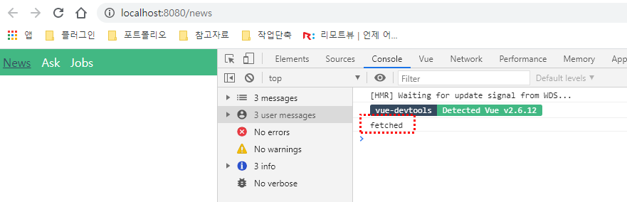<br />

11. [ 뷰 개발자도구 ] SET_LIST - state/list 에 데이터가 담겨있는 것을 확인할 수 있다<br />
	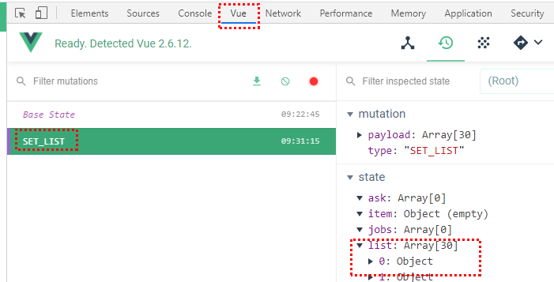<br />

12. 여기에서 알 수 있는 것이 **list 데이터를 화면에** 뿌려주면 된다

13. **화면에 list를 출력시켜주는 것이 [ components/ListItem.vue ] 였다.**

14. [ components/ListItem.vue ] route(라우터)를 본 파일에서 분기처리할 필요가 없다
	- 위 컴포넌트에서 분기처리를 해주었기 때문에 아래 코드를 수정한다
		```javascript
		listItems() {
		  const name = this.$route.name;
		  if ( name === 'news') {
		    return this.$store.state.news;
		  } else if ( name === "ask") {
		    return this.$store.state.ask;
		  } else if ( name === "jobs") {
		    return this.$store.state.jobs;
		  }
		}
		```
	- 위의 코드를 아래와 같이 수정한다
		```javascript
		listItem() {
		  return this.$store.state.list;
		}
		```
	
15. 정상적으로 화면이 노출되는 것을 확인할 수 있다<br />
	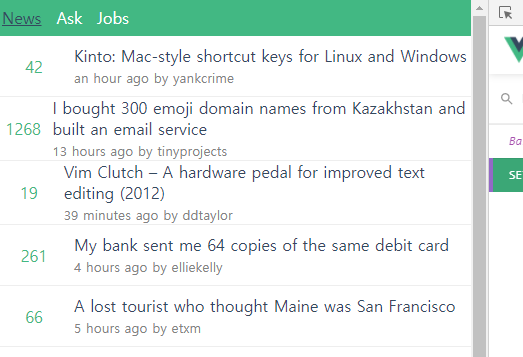<br />

16. [ NewsView.vue, AskView.vue, JobsView.vue ] created() 속성에<br />setTimeout()이 적용되어 있는데, setTimeout()를 제거해준다.
	- setTimeout() 을 제거하고 아래와 같이 수정한다
	- setTimeout 후 cleartimeout도 했어야 하는데 해당 부분을 못 해주었다
	```javascript
	created() {
	  bus.$emit('start:spinner');
	  this.$store.dispatch('FETCH_NEWS')
	    .then( ()=> {
	      console.log('fetched');
	      bus.$emit('end:spinner')
	    })
	    .catch( (error)=> {
	      console.log(error);
	    });
	  // setTimeout(() => {
	  //   this.$store.dispatch('FETCH_NEWS')
	  //     .then( ()=> {
	  //       console.log('fetched');
	  //       bus.$emit('end:spinner')
	  //     })
	  //     .catch( (error)=> {
	  //       console.log(error);
	  //     });
	  // }, 3000);
	}
	```
	<br />

### 9.6. 하이 오더 컴포넌트가 적용된 앱 구조 설명 및 흐름 정리
1. 새로 만든 CreateListView.js 파일이 **"하이 오더 컴포넌트"** 이다.
	- news, jobs, ask 의 코드 재활용(동일한 구조, 기능)으로 하이 오더 컴포넌트 파일을 만들었다.
2. CreateListView.js - 코드 수정 (setTimeout 삭제)
	```javascript
	created() {
	  bus.$emit('start:spinner');
	  this.$store.dispatch('FETCH_LIST', this.$route.name)
	    .then( ()=> {
	      console.log('fetched');
	      bus.$emit('end:spinner')
	    })
	    .catch( (error)=> {
	      console.log(error);
	    });
	},
	```
3. 하이 오더 컴포넌트 파일 생성으로 **불필요한 코드는 삭제한다**
	- routes/index.js
		```javascript
		// routes/index.js
		// 아래 코드 삭제
		import NewsView from '../views/NewsView.vue';
		import AskView from '../views/AskView.vue';
		import JobsView from '../views/JobsView.vue';

		{ component: NewsView }
		{ component: AskView }
		{ component: JobsView }
		```
	- 이 외에 불필요한 코드는 삭제한다

4. [ routes/index.js ] 하이 오더 컴포넌트로 components에 적용되었다
	- 'NewsView' 처럼 네이밍을 적어준다
	```javascript
	component: createListView('NewsView')
	```
	<br />

5. 불필요한 컴포넌트 .vue 페이지를 삭제한다
	- 폴더 views : NewsView, JobsView, AskView
