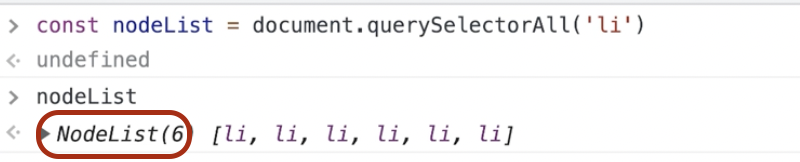

# JavaScript 완전 정복
60일 완주반 | https://zero-base.co.kr/category_dev_camp/JS_challenge<br />
<br />

- 마크업 강의 : https://drive.google.com/drive/folders/15ia78xRRPpCfh2xpBHwIKw2Y0XqvJKus
- Emmet 참고 사이트 : https://zero-base.co.kr/courses/209327
- https://placeholder.com/ 사이트를 이용하여 테스트 이미지 적용하기<br />https://placeholder.com/80 = 이미지, 가로세로 80px<br />https://via.placeholder.com/350x150 = 이미지, 가로 350px, 세로 150px
<br />

<br />
<hr />
<br />

# Part 01. HTML/CSS
## 01.00. 개요
### 마크업이란?
1. **사전적 정의**
    - **마크업 언어(markup language)는 태그 등을 이용하여 문서나 데이터의 구조를 명기하는 언어**의 한 가지이다. 기술적 마크업(descriptive markup)은 문서의 일부에 이름을 다는 데 사용된다. 주요 마크업 언어에는 `HTML`이 있다.<br />※ 출처 : 위키백과
    - 웹페이지라는 것은 문서와 같다. 따라서 컴퓨터가 이해할 수 있도록 **태그로 문서를 작성하는 것을 마크업 개발**이라고 생각하면 된다.
    <br />

2. **마크업 개발의 실질적 의미**
    - 가장 기본적인 역할은 **웹 페이지의 뼈대를 구성하는 HTML과 화면 디자인을 코드로 나타내는 CSS 개발**을 의미하고 마크업 개발이라고 한다.<br />이 과정을 보통 웹 퍼블리싱이라고 한다.
    - HTMl과 CSS를 조금 더 전문적으로 다루는 **마크업 개발자** 직군이 존재한다.<br />
    
    <br /><br />

3. **마크업 개발 왜 중요할까?**
    - 디자인과 기술의  오작교<br />기획 ➡디자인 ➡마크업 ➡ FE / BE ➡ QA(테스트과정) ➡ 릴리즈
    - **웹 서비스의 규모가 클수록,<br />디자인  복잡도  상승 = 마크업  복잡도  상승** 
    - 디자인  관리를  위해  생겨난 **디자인 시스템**을 잘 개발/유지하기 위해서는 결국 마크업의 역할이 가장 중요<br />(SASS로 모듈 관리를 함)
    <br />

4. **FE와의 관계**
    - 프론트 개발자는 크게 2종류로 나뉘는데<br />(왼쪽) 프레임워크, 자바스크립트와 같은 JS 아키텍쳐, 퍼포먼스. 성능 같은 거에 집중을 한 프론트엔드의 로직쪽<br />(오른쪽) 인터렉션 디자인을 잘 구현해낼 수 있고, CSS/Sass 아키텍쳐 구조를 짤 수 있고 간단한 제이쿼리를 포함한 필요에 따라 워드 테마, UX 및 접근성 작업
    - 마크업 개발자도 프론트 개발자로 일컫는다.<br />
    

<br />
<br />

## 01.01. 핵심 HTML
<br />
<br />

- `img` 태그에서 의미가 없는 `alt` 속성을 비워두고 의미가 있을 때에만 `alt` 속성의 값을 적용하면 된다.<br />`img src="주소" alt="코스모스"`
<br />

### 01.01-1. Block vs inline
#### Block
- 기본적으로 블록 레벨 요소는 부모 요소의 전체 공간을 차지하여 "블록"을 만든다.
- 브라우저는 보통 블록 레벨 요소의 앞과 뒤를 개행해서 그립니다. 상자를 쌓는 것 처럼 생각할 수 있다.
- 블록 레벨 요소는 언제나 새로운 줄에서 시작하고, 좌우 양쪽으로 최대한 늘어나 가능한 모든 너비를 차지한다.
<br />

#### inline
- 인라인 요소는 콘텐츠의 흐름을 끊지 않고, 요소를 구성하는 태그에 할당된 공간만 차지한다.

<br />

### 01.01-2. 시멘틱 마크업
1. 검색 엔진 최적화 (SEO)
2. 접근성
3. 유지보수

<br />

**시멘틱 HTML**은 주어진 목적을 위해 요소를 사용하기 때문에 **사람과 기계가 읽고 이해하기가 더 쉽다.**<br />
<br />
<br />

#### 참고 사이트
https://html.com/semantic-markup/
https://seekbrevity.com/semantic-markup-important-web-design/

<br />

### 01.01-3. HTML Emmet
<br />

<br />

### 01.01-4. 공식 문서나 튜토리얼 문서
https://developer.mozilla.org/ko/docs/Web/HTML/Element
https://www.w3schools.com/

<br />
<br />

## 01.02. 핵심 CSS
### 01.02-1. CSS란?
- 종속형 시트 또는 캐스케이딩 스타일 시트(Cascading Style Sheets, CSS)는 마크업 언어가실제 표시되는 방법을 기술하는 **스타일 언어(style sheet language)**로, HTML과 XHTML에주로 쓰이며, XML에서도 사용할 수있다. 기본 파일명 W3C의 표준이며, 레이아웃과 스타일을 정의할 때의 자유도가 높다.

<br />

- **CSS 문법**<br />
    <br />
    <br />

### 01.02-2. CSS 속성들
- **CSS 속성들(주요 속성 골라내기)**<br />
    <br />
    <br />

### 01.02-3. 핵심 CSS 속성과 작성 팁
- **유지보수를 위해 작성 기준**을 갖고 작업하는 걸 추천.
```css
box-sizing: border-box
position: relative | absolute | fixed | sticky 
display: flex | block | inline | inline-block | none 
margin: 100px
padding: 100px 
width: 100px 
height: 100px 
border: 1px solid #000 
background: #fff 
font-size: 16px
font-weight: 300(thin) | 400(normal) | 500(medium) | 700(bold) | 900 (extra bold) 
color: #000
text-align: center | left | right 
overflow: auto | scroll | hidden 
z-index: 1
```
<br />

#### CSS - Box Model
<br />
<br />

#### CSS - position - sticky
- IE 미지원 (모바일에서 자주 사용)
- Fixed와 비슷한 기능. 특정 위치가 되었을 때 스티커 처럼 붙음.
- https://www.w3schools.com/howto/howto_css_sticky_element.asp
```css
body {
  height: 2000px;
}
div {
  position: sticky;
  background: red;
  top: 5px
}
```
<br />
<br />

### 01.02-4. CSS 선택자
<br />

- 기본선택자 `*` : 초기 설정할 때 1번정도만 사용한다. 아무 곳에서나 사용하게 되면 css 성능을 저하시킨다.
- https://developer.mozilla.org/ko/docs/Web/CSS/CSS_Selectors
- `:focus-visible` :<br />가상 클래스(pseudo class) 선택자를 통해 이를 디자인을 해치지 않고 구현.<br />`:focus`와 달리 키보드로 해당 엘리먼트를 선택해야만 적용.<br />[브라우저 지원여부](https://caniuse.com/?search=focus-visible)<br />[MDN 참고 예제](https://developer.mozilla.org/en-US/docs/Web/CSS/:focus-visible)
    ```css
    /* 키보드로 버튼에 포커스 시 */ 
    button:focus-visible { outline: 3px solid #000; } 
    
    /* 마우스, 터치로 버튼에 포커스 시 */ 
    button:focus:not(:focus-visible) { outline: none; box-shadow: 1px 1px 5px rgba(1, 1, 0, .7); }
    ```
- `:only-child` :<br />가상 클래스 선택자로 그 부모의 유일 자식 요소 선택.<br />[MDN only-child 자세히보기](https://developer.mozilla.org/de/docs/Web/CSS/:only-child)
    ```html
    <style>
        p:only-child {background: yellow;}
    </style>
    <div>
        <p>only-child</p>
    </div>
    ```
- 가상 클래스 선택자 == 상태, 가상 요소 선택자 == 영역

<br />

### 01.02-5. CSS Emmet
- https://zero-base.co.kr/courses/209327
<br />
<br />
<br />

### 01.02-6. CSS 공식 문서, 튜토리얼 문서
- https://developer.mozilla.org/ko/docs/Web/CSS
- https://www.w3schools.com/css/default.asp

<br />
<br />

## 01.03. 핵심 Sass
### 01.03-1. Sass 란
- Sass(Syntactically Awesome StyleSheets) is a stylesheet language that’s compiled to CSS. It allows you to use **variables, nested rules, mixins, functions, and more,** all with a fully CSS-compatible syntax. Sass helps keep large stylesheets well-organized and makes it easy to share design within and across projects.
- 컴파일이 필요한 Sass. 컴파일하여 css 파일을 만들어줘야 한다.
- 엄청나게 큰 스타일 시트를 구조화해서 사용할 수 있도록, 효율성에 집중된 Sass
- CSS vs Sass vs Scss<br />- Sass, Scss = **Nesting(네스팅, 중첩) 구조**<br />- Sass에 비해 유지보수 관리가 편한 **Scss**.
    <br />
    <br />

#### CSS 코드가 한 파일로 제작된다면?
- 가독성 저하, 어디서부터 어디까지가 어떤 스타일을 담당하고 있는지 파악하기 어려움.
- 중복 코드 혹은 레거시 코드를 생성하기 쉬움.
- 단순 수정에도 전체 코드를 일일히 확인해야 함.
- 프로젝트가 커질수록 CSS로  작업하는 속도가 느려짐.<br />
<br />

**Sass(Scss) 개발은 선택이 아닌 필수!!**<br />
<br />

### 01.03-2. Sass 7-1 패턴
<br />
<br />

### 01.03-3. Sass @import
- `@import` 예시
```css
/* main.scss */
@import ‘./abstracts/variables.scss’;
@import ‘./abstracts/mixins.scss’;
@import ‘./base/reset.scss’;
@import ‘./component/buttons.scss’;
@import ‘./component/dropdown.scss’;
@import ‘./layout/header.scss’;
@import ‘./layout/footer.scss’;
@import ‘./pages/home.scss’;
@import ‘./theme/theme.scss’;
@import ‘./vendors/bootstrap.scss’;
```
<br />

### 01.03-4. Sass Variables
- Variables(변수) 예제
```css
$h1-size: 5em;
$h1-color: blue;
$h1-align: center;

h1 {
    font-size: $h1-size;
    color: $h1-color;
    text-align: $h1-align;
}

div {
    color: $h1-color;
}
```
<br />

### 01.03-5. Sass @mixin
-  `@mixin` 예제(1)
```css
@mixin ellipsis {
    text-overflow: ellipsis;
    white-space: nowrap;
    overflow: hidden;
}

p {
    width: 300px;
    @include ellipsis;
}
```
<br />

-  `@mixin` 예제(2)<br />>> `$bg-position: center,`처럼 값을 미리 적용하면 따로 값을 넣어주지 않을 때 해당 값으로 적용된다. (= default 값)
```css
@mixin bg-img ($bg-url, $bg-position: center, $bg-size: contain, $bg-color: transparent) {
    background-image: url($bg-url);
    background-repeat: no-repeat;
    background-position: $bg-position;
    background-size: $bg-size;
    background-color: $bg-color;
}

.bg {
    margin: 0 auto;
    width: 100px;
    height: 100px;
    @include bg-img('https://sass-lang.com/assets/img/logos/logo-b6e1ef6e.svg');
}

body {
    background-color: #000;
}
```
<br />

### 01.03-6. Sass @function
```css
@function half-opacity1($color) {
    /* opacity를 고정값으로 적용 */
    $color: rgba($color, 0.5);
    @return $color;
}
@function half-opacity2($color, $opacity) {
    $color: rgba($color, $opacity);
    @return $color;
}

h1 {
    font-size: 10em;
    text-align: center;
    color: half-opacity1(#ff0000);
}
h2 {
    font-size: 10em;
    text-align: center;
    /* color: half-opacity(green, 0.3); */
    color: half-opacity(#ff0000, 0.1);
}
```
<br />

### 01.03-7. 참고
- https://sass-lang.com/documentation
- https://www.w3schools.com/sass/
- https://poiemaweb.com/sass-basics

<br />
<br />

## 01.04. 프로젝트 준비
### 01.04-1. 에디터 설치 및 환경세팅
1. Sass 사용을 위해 NodeJS 설치하기.
2. 터미널에서 Sass 설치 후 버전 확인하기.<br />2-1. `npm i -g sass` 로 Sass 설치하기. 단, 설치 실패될 경우 `sudo npm i -g sass`처럼 앞에 `sudo`를 추가한다.<br />2-2. `sass --version`으로 설치된 sass 버전을 확인할 수 있다.<br />2-3. 터미널에서 sass 설치 시 "password"를 입력하라고 나올 경우, 컴퓨터 password를 입력해주면 된다.
3. vs코드 확장프로그램에서 `Live Sass Compiler` 와 `Liver Server`를 설치한다.
4. `Live Sass Compiler` 설치 완료 후, 아래와 같이 `setting.json`에서 편집한다.<br />
    <br />
    <br />

    - sass 파일을 어느 폴더에 적용해 줄 것인지, 설정하는 내용을 `setting.json`에 추가.
    - `./` = 현재 파일의 위치<br />`../` = 현재 파일의 부모 폴더
    - **scss 파일을 컴파일 할 때엔 해당 프로젝트만 폴더열기로 한 후에 컴파일해야 해당 프로젝트 폴더에 컴파일이 된다.**<br />("/" = scss 파일이 속한 root 폴더를 의미. root 폴더에 .css 파일 생성 후 저장.)
    ```javascript
    "liveSassCompile.settings.generateMap": false,
    "liveSassCompile.settings.formats": [
        {
            "format": "expanded",
            "extensionName": ".css",
            "savePath": "./assets/css/"
        }
    ]
    ```
    <br />

    - [이전 SASS 강의 내용 중 설정 참고, 자세히 보기](https://github.com/eunhye8767/learn_sass#31-live-sass-compiler)<br />
        <br />

    - 현 scss 파일을 기준으로 잡을 때는 `~`로 표시.<br />`~` = .scss 파일 기준으로 잡을 때 ~ 로 표시<br />`~/css` = scss/css 폴더에 .css 파일 생성 후 저장.<br />`~/../css` = scss 폴더와 같은 라인의 css 폴더에 .css 파일 생성 후 저장.
    ```javascript
    "liveSassCompile.settings.generateMap": false,
    "liveSassCompile.settings.formats": [
        {
            "format": "expanded",
            "extensionName": ".css",
            "savePath": "~/../css/"
        }
    ]
    ```
    <br />

### 01.04-2. 프로젝트 생성하기
- [프로젝트 생성 관련 참고자료](https://docs.google.com/presentation/d/1NiCvYL4HqawcZpLTpGrDT7060JY87KGloZpfp3nnE_4/edit#slide=id.gebc659f20b_1_17)
<br />
<br />

### 01.04-3. 개발범위 파악하기
#### 마크업을 하는 과정
- 전체 디자인을 훑어본다
    - 대략적인 큰 레이아웃을 구상한다
    - 메인 컴포넌트를 분석한다
    - 반복되는 컴포넌트를 구분한다
- 가변적인 요소가 들어가는 항목을 확인한다
    - 이미지가 가변일 때, no image 처리는 어떻게 되는가?
    - 이미지 비율이 다를때 어떤 기준으로 크롭하는가?
    - 텍스트가 가변일 때 몇 줄까지 노출하는가? (말줄임)
    - 값이 없을때 0 으로 노출하는지, 항목 자체가 사라지는지? (ex. 별점)
- 기획/디자인 측에서 요청한 인터랙션이 있는지?

<br />
<br />

## 01.05. Proj - 진입 페이지
[강의 내용](https://docs.google.com/presentation/d/1Cmjgjob9X1VFMikenwJ4ADlPk6epcWiXeztPBGJ_OzE/edit#slide=id.ged7e4876ed_0_38)<br />
<br />

<br />
<br />

#### html5에서는 `<a>`가 flow컨텐츠(`div, p, ul...`)를 품을 수 있게 되었다.<br />하지만, 인라인요소가 블럭요소를 품을수 있게 된 건 아니다.
<br />

- 이미지 경우, svg 코드 그대로 사용하는 것을 추천.<br />`path`의 `fill="currentColor"`로 적용하게 되면 상위(부모)요소 `svg`에 적용된 컬러값을 사용하게 된다.
    ```html
    <a href="#" class="type-item">
        <svg class="icon" height="637pt" viewBox="-20 -46 637.33396 637" width="637pt" xmlns="http://www.w3.org/2000/svg">
                <path fill="currentColor" d="m587.648438 98.503906c-6.167969-.769531-11.789063" />
        </svg>
    </a>
    ```

- (왼쪽) svg를 img 태그로 사용했을 때, (오른쪽) svg 코드로 적용했을 때 차이는 **유지보수에 차이가 있다.**<br />아이콘의 색을 red로 수정할 경우, 코드로 적용한 아이콘은 css에서 컬러값만 바꿔주면 된다.
    <br />
    <br />

- 프론트엔드 프레임워크로 넘어가게 되면 svg코드 자체로 컴포넌트를 만들기 떄문에 활용도가 높아진다.<br />그래서 svg로 이미지를 뽑을 수 있다면 svg 코드 그대로 사용하는 것을 추천한다.<br />([*리액트 svg 관련](https://from2020.tistory.com/32?category=366598))<br /><br />단, 다양한 여러 페이지에서 코드 컬러 등의 변경이 없을 경우 img 파일로 적용하는 것이 좋다.<br />**즉 자주 사용되는 이미지 경우, img**

<br />
<br />

## 01.06. Proj - 메뉴 페이지
[강의내용 자세히보기](https://docs.google.com/presentation/d/1YK95ZPAu8tTXt6u4UT5di6LQamBUseq9Wu4dDkgVSag/edit#slide=id.ged7e4876ed_0_38)
<br />
<br />

- `<!-- 고정헤더영역 --> <!-- // 고정헤더영역 -->` 처럼 개발 작업을 할 땐 영역을 표시해주지만 배포할 때엔 주석을 삭제.
<br />

- **컴포넌트 기반으로 css파일을 나눠 작업하는 것이 나중에 컴포넌트 사용할 때 용이.**
<br />

- 부모 요소에 `display: flex`를 주고 자식 요소에 너비를 균등하게 주고싶을 땐 `flex: 1`를 적용.
<br />

- **role 속성**<br />- [WAI-ARIA Roles MDN 자세히 보기](https://developer.mozilla.org/en-US/docs/Web/Accessibility/ARIA/Roles)<br />- [ARIA: banner role](https://developer.mozilla.org/en-US/docs/Web/Accessibility/ARIA/Roles/banner_role)
    ```html
    <div class="place-header" role="banner">
        <h1 class="title">
            <a href="#" class="link-back">
                
            </a>
            샐러드 제로베이스점    
        </h1>
        <a href="#" class="my-orders">주문내역</a>
    </div>
    <div class="place-tab scroll-x" role="tablist">
        <div class="tab-inner">
            <a href="#" class="tab" role="tab"><span class="txt">홈</span></a>
            <a href="#" class="tab is-active" role="tab"><span class="txt">메뉴</span></a>
            <a href="#" class="tab" role="tab"><span class="txt">리뷰</span></a>
            <a href="#" class="tab" role="tab"><span class="txt">사진</span></a>
            <a href="#" class="tab" role="tab"><span class="txt">지도</span></a>
            <a href="#" class="tab" role="tab"><span class="txt">주변</span></a>
        </div>
    </div>
    ```
<br />

- **가로스크롤** `-webkit-overflow-scrolling`
    - [MDN 자세히 보기](https://developer.mozilla.org/ko/docs/Web/CSS/-webkit-overflow-scrolling)
    - `-webkit-overflow-scrolling: touch;`<br />: PC 보다는 모바일에서 사용하는데, 모바일에서 터치로 스크롤링이 가능할 때 사용.(스크롤 할 때 가속도가 붙는다.)
    - **스크롤바 감출 때 사용하는 css** ([예제 바로보기](https://codepen.io/leh8767/pen/rNGdmEN))
        ```css
        -ms-overflow-style: none;           /* IE */
        scrollbar-width: none;              /* 파이어폭스 */
        &::-webkit-scrollbar {              /* 크롬 */
            display: none;
            }
        }
        ```
<br />

- `aria-hidden="true"` = 스크린 리더가 읽지 않아도 될 때 설정. ([자세히 보기](https://developers.google.com/web/fundamentals/accessibility/semantics-aria/hiding-and-updating-content?hl=ko))
    ```html
    <div class="deck">
        <div class="slide" aria-hidden="true">
            Sales Targets
        </div>
        <div class="slide">
            Quarterly Sales
        </div>
        <div class="slide" aria-hidden="true">
            Action Items
        </div>
    </div>
    ```
    - ARIA는 aria-hidden 속성을 사용하여 시각적으로 숨겨지지 않는 콘텐츠를 보조 기술에서 제외하기 위한 메커니즘을 제공한다. 요소에 이 속성을 적용하면 사실상 요소와 모든 하위 항목이 접근성 트리에서 제거된다. aria-labelledby 또는 aria-describedby 속성이 참조하는 요소가 유일한 예외이다.
<br />

- 정사각형에서 원으로 적용할 때 css로
    ```css
    .cilcle {
        width: 80px;
        height: 80px;
        border-radius: 100%;
    }
    ```
<br />

- **메뉴 작업 Tip**<br />해당 메뉴를 감싸는 `<li>`에 간격 등의 속성을 주고,<br />해당 메뉴 `<a>`에 폰트 속성, 클릭한 상태의 배경값을 넣어주는 것이 좋다.<br />
    <br />
    <br />

    ```html
    <style>
    .category-item {
        &:first-child {
            padding-left: $m-padding;
        }
        &:last-child {
            padding-right: $m-padding;
        }
    }

    .category-tab {
        display: flex;
        align-items: center;
        padding: 0 12px;
        font-size: 16px;
        height: 30px;
        border-radius: 15px;
        color: $booking-color-text6;
        &.is-active {
            background-color: $booking-color-bg165;
            font-weight: 700;
            color: #fff;
        }
    }
    </style>
    
    <div class="menu-category-area">
        <div class="common-inner">
            <ul class="category-list scroll-x">
                <li class="category-item"><a href="#" class="category-tab is-active">추천</a></li>
                <li class="category-item"><a href="#" class="category-tab">시즈널 메뉴</a></li>
                <li class="category-item"><a href="#" class="category-tab">시그니처 샐러드</a></li>
                <li class="category-item"><a href="#" class="category-tab">웜볼</a></li>
                <li class="category-item"><a href="#" class="category-tab">샌드</a></li>
                <li class="category-item"><a href="#" class="category-tab">랩</a></li>
                <li class="category-item"><a href="#" class="category-tab">나만의 샐러드</a></li>
                <li class="category-item"><a href="#" class="category-tab">스프</a></li>
                <li class="category-item"><a href="#" class="category-tab">음료</a></li>
                <li class="category-item"><a href="#" class="category-tab">드레싱 추가</a></li>
            </ul>
        </div>
    </div>
    ```
    <br />
    <br />

## 01.07. 작업 Tip.
1. `.new` , `.popular` 2개의 클래스가 아닐 때 `:not`을 이용하여 조건 적용
    ```scss
    &:not(.new):not(.popular) {
        margin-top: 10px;
    }
    ```
    <br />

2. `.is-closed + .is-closed` 상황일 때
    ```scss
    .is-closed {
        & + .is-closed {
        /* 코드 작성 */
        }
    }
    ```
    <br />

3. `flex`가 아닌 `middle`로 가운데 정렬
    ```scss
    .period {
        font-size: 14px;
        letter-spacing: -0.3px;
        color: $booking-color-text4;
        &::before {
            content: '';
            display: inline-block;
            margin: 0 10px;
            width: 4px;
            height: 4px;
            border-radius: 100%;
            background-color: #ededed;
            vertical-align: middle;
        }
    }
    ```
    <br />

3. 이미지(img) 경우, 이만큼 차지한다는 암시적인 의미로 사이즈 적용
(사이즈가 정확하지 않을 때, width, height 쓰는 것이 최적화에 도움이 된다. 웹접근성 관련)
    ```html
    <div class="menu-img-area">
        
    </div>
    ```
    <br />

4. `.section > .area > .group` 처럼 본인 만의 영역지정 순서를 정하는 것이 좋다.
    <br />

5. 특정 태그에서 `padding`만큼 -로 `margin`을 주게 되면 **영역 위치는 그대로 유지되고 padding 영역은 그대로 적용이 된다.**
    ```scss
    .btn-toggle {
        display: flex;
        margin: -16px;
        padding: 16px;
    }
    ```
    <br />
    
6. 변수를 곱해서 빼야할 때, `#{$변수명}` 처럼 조건문을 적는다.
    ```scss
    .btn-order {
        width: calc(100% - #{$m-padding}*2);

    ```
    <br />

7. position으로 꽉 채워야할 때 `top: 0; left: 0; right: 0; bottom: 0`.
    <br />

8. 이미지 경우 display: block으로 설정하게 되면 임의로 제공하는 공백을 없앤다.
    <br />
    
9. 원 만들 때 `width:18px, height: 18px` 처럼 정사이즈 경우, `border-radius: 50%` 또는 `border-radius: 100%` 로 적용.
    <br />

10. `disabled` == 커서모양, 이벤트 처리를 비활성화 할 때<br />pc화면을 대비하여 `cursor: not-allowed; pointer-events: none` 으로 설정

11. 상태값은 모두 화면에 표기하는 것이 협업에 좋다.
    <br />

12. 1줄 라인의 폰트 경우 `line-height`로 세로 가운데 라인 정렬.
    ```scss
    .num {
        width: 18px;
        height: 18px;
        line-height: 18px;
        border-radius: 50%;
        background-color: $point-color;
        font-size: 12px;
        font-weight: 700;
        text-align: center;
        color: #fff;
    }
    ```
    <br />

13. 멀티라인 말줄임 함수를 사용할 경우, `autoprefixer: off` 을 써줘야 `-webkit-box-orient: vertical;` 이 코드가 컴파일 된다.
    ```scss
    @mixin multi-ellipsis($font-size, $line-height, $lines) {
        font-size: $font-size;
        line-height: $line-height;
        max-height: $line-height * $lines;
        overflow: hidden;
        display: -webkit-box;
        -webkit-line-clamp: $lines;
        -webkit-box-orient: vertical; /* autoprefixer: off */
    }
    ```
    <br />
    
14.  css로 화살표 그리기
    ```scss
    .ico-up {
        position: relative;
        display: inline-block;
        margin-left: 4px;
        width: 10px;
        height: 10px;
        &::before {
            content: '';
            position: absolute;
            top: 4px;
            left: 50%;
            width: 5px;
            height: 5px;
            border-top: 2px solid #666;
            border-left: 2px solid #666;
            transform: translate(-50%, -50%) rotate(45deg);
        }
        &::after {
            content: '';
            position: absolute;
            top: 1px;
            left: 50%;
            width: 2px;
            height: 9px;
            background-color: #666;
            transform: translateX(-50%);
        }
    }
    ```
    <br />
    <br />

15. `::before`, `::after`를 이용하여 여백 주기
    ```scss
    .orderer-pic-item {
        display: flex;
        & + .orderer-pic-item {
            margin-left: 1px;
        }
        &:first-child::before,
        &:last-child::after {
            content: '';
            display: block;
            width: $m-padding;
            height: 100%;
        }
    }
    ```
    <br />
    <br />

16. `border`에 컬러를 적용하지 않으면 상위 요소에 적용된 컬러값이 적용된다.
    ```scss
    .btn-more {
        display: flex;
        justify-content: center;
        align-items: center;
        width: 100%;
        height: 50px;
        font-size: 16px;
        font-weight: 500;
        color: $booking-color-text3;    /* 해당 컬러값 적용 */
        &::after {
            content: '';
            margin-left: 6px;
            margin-bottom: 6px;
            width: 8px;
            height: 8px;
            border-top: 1px solid;
            border-right: 1px solid;
            transform: rotate(135deg);
        }
    }
    ```
    <br />

17. 팝업(모달 등)이 출력되어 있을 땐,  뒷배경(body)의 스크롤이 움직이지 않도록 한다.
    ```scss
    body.scroll-off {
        overflow: hidden;
        -ms-touch-action: none;
        touch-action: none;
    }
    ```
    <br />

18. 모바일에서 `touch`(터치스크롤)이 가능하게 적용한다.
    ```scss
    .content-body {
        overflow-y: auto;
        -webkit-overflow-scrolling: touch;
    }
    ```
    <br />

19. 체크박스 선택 시, v모양을 css로 그리기
    ```scss
    .input-check {
        & + .label .label-icon {
            border-radius: 3px;
        }
        &:checked + .label {
            .price {
                font-weight: 600;
                color: $point-color;
            }
            .label-icon {
                position: relative;
                border-color: $green;
                background-color: $green;
                &::before {
                    content: '';
                    position: absolute;
                    top: 6px;
                    right: 6px;
                    width: 14px;
                    height: 9px;
                    border: 2px solid #fff;
                    border-width: 0 0 2px 2px;
                    transform: rotate(-45deg);
                }
            }
        }
    }
    ```
    <br />
    <br />

20. 별 아이콘, 채워짐 효과 코드로 그리기
    - 배경을 깔고 그 위에 빨간별을 추가한다. 그리고 그 빨간별의 영역을 `style="width: 90%"`처럼 값을 적용.
    ```scss
    .review-star {
        display: flex;
        align-items: center;
        font-size: 15px;
        font-weight: 600;
        color: $booking-color-text2;
        transform: translateX(-2px);
    }

    .ico-star-group {
        position: relative;
        margin-right: 6px;
        display: inline-block;
        width: 77px;
        height: 13px;
        background: url("../images/ico-star-group.svg") no-repeat center left;
    }

    .ico-star-group-fill {
        position: absolute;
        top: 0;
        left: 0;
        display: inline-block;
        width: 100%;
        height: 100%;
        background: url("../images/ico-star-group-fill.svg") no-repeat center left;
    }
    ```
    <br />
    <br />
    
21. `@media` 미디어 쿼리<br />(요즘은 디바이스별 사이즈가 다양하다. 그래서 특정 사이즈로 모바일, pc 기준으로 적용한다.)
    ```scss
    @media screen and (max-width: 767px) {
        // 모바일 스타일 적용
    }

    @media screen and (min-width: 768px) and (max-width: 1024px) {
        // 태블릿 스타일 적용
    }

    @media screen and (min-width: 1025px) {
        // PC 스타일 적용
    }
    ```

<br />
<hr />
<br />

# Part 02. JavaScript 기본
## 02.01. 소개
### 02.01-1. 자바스크립트란?
- **브라우저 위에서 동작**되는 인터프리터 언어.<br />(*인터프리터(interpreter)는 프로그래밍 언어의 소스 코드를 바로 실행하는 컴퓨터 프로그램 또는 환경을 말한다.)
- node.js를 통해 런타임이 생겨 서버에서도 사용할 수 있다.
- 다른 프로그래밍 언어(ex.자바, 파이썬, 루비 등등..)는 설치해야 가능하지만,<br />자바스크립트는 브라우저 위에 바로 사용이 가능하다.<br />
<br />

### 02.01-2. 자바스크립트 배경
- Brendan Eich : 자바스크립트 & 파이어폭스 개발
- ECMAS = ES. 
- JS = 프로그래밍 언이이고,<br />버전을 얘기할 땐, ES(ECMAScript)1,2,3..5,6.. 으로 불리다가 2015년부터 년도별로 부른다.<br />2015년이후 대규모 변화가 있어서, ES2015 또는 ES2015+ (=ES6+).<br />(ES2015처럼 연도로 일컫는 것이 정확한 표현, ECMAS는 JS의 명세.)<br />
<br />

### 02.01-3. 자바스크립트 Everywhere
- Node.js는 Chrome V8 JavaScript 엔진으로 빌드된 JavaScript 런타임이다.
- Node.js는 자바스크립트를 실행시켜주는 환경으로 서버를 구축하는 것이지 `Node.js가 서버다` 라는 것은 정확한 표현이 아니다. 즉, Node.js는 자바스크립트의 런타임.
- Node.js가 나오면서 자바스크립트는 Electron(일렉트론), React(리액트), Notion(노션) 등.. 다양한 곳에서 데스크탑 애플리케이션을 만들 수 있다.
- 자바스크립트를 통해 웹 애플리케이션, Mac & Windown에서 실행되는 데스크랍용 애플리케이션, 리액트 네이티브를 활용해 모바일 웹을 만들 수 있다.
- **즉, 자바스크립트는 모든 곳에서 존재한다.**<br />
<br />

### 02.01-4. 자바스크립트의 미래
- 개발자 : 프론트엔드(웹) / 백엔드(서버) / 모바일(앱)<br />자바스크립트를 통해 소화할 수 있는 영역이 많다.
- **웹어셈블리(WebAssembly)**는 최신 웹 브라우저에서 실행할 수 있는 새로운 유형의 코드이며 새로운 기능과 성능 면에서 큰 이점을 제공한다. 직접 코드를 작성하는 것이 아니라 C, C ++, RUST 등의 저급 소스 언어를 효과적으로 컴파일하도록 고안되었다.
- **피그마(Figma)**클라우드 기반으로 웹브라우저로 동작하는 UI 디자인 툴.<br />(피그마는 웹어셉블리로 개발된 툴.)
<br />
<br />

## 02.02. 기본 문법
### 추천, 학습 방법
- 문법 공부 : 문서(MDN), 구글링, 코드 작성<br />* MDN에서 제공하는 JavaScript 문서는 최신 초안 버전을 기반으로 하기 때문에 참고하기에 적합.<br />(JavaScript는 ECMAS 언어 사양이 중요하다.)
- 프로젝트 : 해설, 구현
<br />
<br />

### 02.02-1. 기본 문법 및 키워드
- [어휘문법(기본 문법) MDN 자세히 보기](https://developer.mozilla.org/ko/docs/Web/JavaScript/Reference/Lexical_grammar)
- **개행문자** :<br />개행문자는 코드 내부에 숨겨지기 때문에 자바스크립트 코드 실행에 영향을 미친다. 개행 문자는 새미클론 삽입 규칙에도 영향을 준다.<br />([* 자세히보기](https://developer.mozilla.org/ko/docs/Web/JavaScript/Reference/Lexical_grammar#%EA%B0%9C%ED%96%89_%EB%AC%B8%EC%9E%90))
- ECMAScript 2015 기준 예약 키워드 [자세히 보기](https://developer.mozilla.org/ko/docs/Web/JavaScript/Reference/Lexical_grammar#%ED%82%A4%EC%9B%8C%EB%93%9C)
    `break`, `case`, `catch`, `class`, `const`, `continue`, `debugger`, `default (en-US)`, `delete`, `do`, `else`, `export`, `extends`, `finally`, `for`, `function`, `if`, `import`, `in`, `instanceof`, `new`, `return`, `super`, `switch`, `this`, `throw`, `try`, `typeof`, `var`, `void`, `while`, `with`, `yield` <br />
    <br />

    - 프로그래밍 언어를 사용할 때 예약되어 있는 것. (이 키워드를 사용하면 예상되는 동작
    - 사용을 하게 되면 어떠한 액션이 일어난다.
    - 아래 코드처럼 사용하게 되면 에러가 발생하게 된다.<br />`const` = 변하지 않는 변수를 정의할 때 /  `function` = 함수를 생성할 때 사용할 때 쓰는 키워드로 아래 코드처럼 이름으로 사용할 수 없는 것.
    ```javascript
    const const = 'class';

    function function() {
        return 'hello';
    }

    console.log(function()); 
    ```
- 리터럴 [자세히 보기](https://developer.mozilla.org/ko/docs/Web/JavaScript/Reference/Lexical_grammar#%EB%A6%AC%ED%84%B0%EB%9F%B4)<br />리터럴 : `null` , 불리언 리터럴(`true, false`), 숫자 리터럴, 객체리터럴, 배열 리터럴, 문자 리터럴 등 다양한 리터럴이 존재한다.
- 예전엔 세미클론을 '무조건' 사용했어야 하지만 현재는 새미클론을 생략해도 자동으로 삽입이 된다.
<br />
<br />

### 02.02-2. 변수(Variable)
```javascript
// 변수명 =(할당연산자) 값
// 언어라는 변수에 'javascript' 라는 값을 할당.
const 언어 = 'javascript'
```
- 다양한 값을 담을 수 있는 박스와 같은 컨테이너.
- 값이 저장된 메모리 주소와 이름을 연결, **그 주소의 별칭**
<br />

- 선언 : `var`, `let`, `const`
    ```javascript
    // 선언
    let lang;

    // 할당
    lang = 'JS'

    // 재할당
    lang = 'JavaScript'
    ```
- 선언과 동시에 할당<br />`const lang = 'JavaScript'`
- 복합 할당 연산자<br />ex) `count`에 1을 더해(연산 실행) `count` 값을 수정하려고 한다.
    ```javascript
    let count = 0;

    // 보기 좋을 수 있고 간단하겠지만 실수를 유발할 가능성이 더 커짐.
    count += 1;

    // 잘 읽히고 예상하기 쉬움.
    count = count + 1;
    ```
- **개발을 할 때에는 `const`를 먼저 사용하기를 추천.**
<br />
<br />

### 02.02-3. 값(Value)
- 더 이상 나눌 수 없는 값.
- 더 이상 평가될 수 없는 하나의 식으로 **자료형을 간단한 이루는 값**
- **자료형(Data Type)** : 숫자형(1), True(불리언, 논리), 'A'(문자), 'ABC'(문자열)
- [자바스크립트의 타입과 자료 구조, MDN 자세히보기](https://developer.mozilla.org/ko/docs/Web/JavaScript/Data_structures)
    - 자바스크립트 자료형에 대해선 크게 두가지로 `Primitive value(프리미티브 밸류, 기본타입)`, `Objects(객체)`로 나뉜다.
    - **Primitive value를 원시형, 변경 불가능한 값(불변값)**이라고 한다.
        - *원시값은 객체를 제외한 모든 타입은 불변 값(변경할 수 없는 값)을 정의*한다. 예를 들어 (C 언어와는 달리) 문자열은 불변한다. 이런 일련의 타입을 "원시 값"이라고 한다.
        - `str = 'word'`의 값은 바뀌지 않는다. 원시 값으로 불변값이기 때문.
        - [원시 값(불변값) 자세히보기](https://developer.mozilla.org/ko/docs/Web/JavaScript/Data_structures#javascript%EC%9D%98_%ED%83%80%EC%9E%85)
        ```javascript
        // 문자열 값 (원시 값)
        var str = 'word';
        // toUpperCase 메서드를 통해 문자열을 대문자로 변환.
        str.toUpperCase();
        console.log(str);    // word
        ```
        ```
        undefined : typeof instance === "undefined"
        boolean   : typeof instance === "boolean"
        Number    : typeof instance === "Number"
        String    : typeof instance === "String"
        bigint    : typeof instance === "bigint"
        symbol    : typeof instance === "symbol"
        ```
        <br />

    - 원시 값이 아닌 데이터 타입은 즉..! 레퍼런스, 객체 타입.
        ```javascript
        const obj = {
            name : 'lee'
        }

        const arr = ['lee']

        function func() {
            return 'lee'
        }

        console.log(typeof obj);   // object
        console.log(typeof arr);   // object
        console.log(typeof func);  // function
        ```
<br />
<br />

### 02.02-4. 숫자
- `1`과 `1.0`이 같은 이유는 IEEE 754 부동소수점(ex. 떠돌이 소수점) 방식 때문이다. ([부동소수점 자세히보기](https://ko.wikipedia.org/wiki/%EB%B6%80%EB%8F%99%EC%86%8C%EC%88%98%EC%A0%90))
```javascript
console.log(1 === 1.0); // true
console.log(Math.pow(2, 9999)); // Infinity (안전하지 못한 값을 표현할 때)

// 숫자를 어까 표현할 수  있는지?
console.log(Number.MAX_SAFE_INTEGER)  
```
<br />

- 숫자인지? 아닌지? 확인할 때
```javascript
// Not a Number
console.log(isNaN("1"));  // false
```
<br />

- 자바스크립트에서 숫자는 부동소수점을 사용하고 있고 IEEE 754 표준을 이용하고 있다.
- 인간이 생각하는 숫자는 10진수이고, 컴퓨터는 10진수가 아니기 때문에 정규화를 거쳐 컴퓨터에게 전달하게 된다.
<br />
<br />

### 02.02-5. 문자
```javascript
const word = '문자';
const word2 = "문자";

// 배열처럼 접근할 수 있다.
console.log(word[0]); // '문'
console.log(word[1]); // '자'
console.log(word[2]); // undefined

// 믄지열 길이
console.log(word.length); // 2

// 연산
const words = word + ' ' + word2;
console.log(words);

// ES6 문자리터럴 ` 을 이용해 개행으로도 가능하다
const word3 = `문자
1
`;

console.log(word3); // 출력하게 되면 문자(1줄) 1(2줄) 로 출력이 된다.
```
<br />

### 02.02-6. 연산자
- [연산자 MDN 자세히 보기](https://developer.mozilla.org/ko/docs/Web/JavaScript/Guide/Expressions_and_Operators)
- `=` 할당연산자, `==` 비교연산자, `+` 산술연산자, `&` 비트연산자, `&&` 논리연산자
- `==` 동등, `!=` 부등, `===` 일치, `!==` 불일치<br />**`===` 또는 `!==`을 사용하는 것을 권장. (값과 타입을 검사)**<br />=== 서로 같은지 엄격하게 검사<br />!== 서로 다른지 엄격하게 검사<br /><br />`==` 서로 같은지 느슨하게 검사.
<br />

- 산술연산자 [자세히보기](https://developer.mozilla.org/ko/docs/Web/JavaScript/Guide/Expressions_and_Operators#arithmetic_operators)<br />증가, 감소, 이상연산 외에 다양한 산술 연사자들이 있다. 자세히보기 페이지 참고
```javascript
let count = 0;
console.log(count++); // 단항연산자 그 중에서 증가연산
console.log(count--); // 단항연산자 그 중에서 감소연산

// 이항연산자. 나눴을 때 나머지를 반환.
console.log(12 % 5);  // 2
```
<br />

- 논리연산자 [자세히 보기](https://developer.mozilla.org/ko/docs/Web/JavaScript/Guide/Expressions_and_Operators#logical_operators)<br />**실무에서 자주 사용**되는 것으로 자세히 공부하는 것을 추천!
    - **&& (논리 AND) 연산자의 예제**
        - `&&` : **둘 다 참일 때 true를, 그 외에는 false를 반환**한다.
        - `false && true` : 처음부터 false 값이 나오면 false이기 떄문에 false 값를 반환한다.
    ```javascript
    var a1 =  true && true;     // t && t returns true
    var a2 =  true && false;    // t && f returns false
    var a3 = false && true;     // f && t returns false
    var a4 = false && (3 == 4); // f && f returns false
    var a5 = "Cat" && "Dog";    // t && t returns Dog
    var a6 = false && "Cat";    // f && t returns false
    var a7 = "Cat" && false;    // t && f returns false
    ```
    <br />

    - **|| (논리 OR) 연산자의 예제**
        - `||` : **하나라도 참일 때 true, 그 외에는 false를 반환**한다.
    ```javascript
    var o1 =  true || true;     // t || t returns true
    var o2 = false || true;     // f || t returns true
    var o3 =  true || false;    // t || f returns true
    var o4 = false || (3 == 4); // f || f returns false
    var o5 = "Cat" || "Dog";    // t || t returns Cat
    var o6 = false || "Cat";    // f || t returns Cat
    var o7 = "Cat" || false;    // t || f returns Cat
    ```
    <br />

    - **! (논리 NOT) 연산자의 예제**
    ```javascript
    var n1 = !true;  // !t returns false
    var n2 = !false; // !f returns true
    var n3 = !"Cat"; // !t returns false
    
    var n4 = !!"Cat"; // true
    ```
    <br />

    - **삼항연산자**
    ```javascript
    // const 조건부 ? '참일 때' : '거짓일때';

    // 가독성을 이유로 조건부에 () 으로 감싸주어도 된다.
    //const temp = (1 === 1) ? '참일때' : '거젓일때';
    const temp = 1 === 1 ? '참일때' : '거젓일때';

    let temp2;
    if ( 1 === '1') {
        temp2 = '참일때';
    } else {
        temp2 = '거짓일떄'
    }
    ```
    <br />

### 02.02-7. 배열
```javascript
const data = 'a';
const num = 0;
const boolean = true;


const arr = [data. num, boolean, 'name'];

console.log(arr.length);  // 4
console.log(arr[3]);      // name
console.log(typeof arr);  // object

arr[4] = 'Test';
arr[0] = '첫번째';
arr[1] = 'Second'

// push 메서드를 이용하여 배열의 마지막 요소에 넣는다.
arr.push('마지막');
arr.unshift('첫번째 또 추가');

console.log(arr);
// ['첫번째 또 추가', '첫번째', 'Second', 'name', 비어 있음, 'Test', '마지막']
```
<br />

### 02.02-8. 문
- 문(statement) {} → 명령, 흐름 → 제어
```javascript
if ( 10 > 1 ) {
    return '10은 1보다 크다';
} else if ( 10 === 10) {
    return '';
} else {
    return '';
}

// 초기화(초기값을 설정. let i=0); 평가 (참 => 실행, 거짓 => 다음으로); 매번 실행되는 평가식;  
const array = [1,2,3]
for (let i=0; i < array.length; i++) {
    // i = index 를 의미.
    const element = array[i];
}
```
<br />

### 02.02-9. 함수(function)
- 특정 일을 처리하는 코드 묶음.
```javascript
// 함수 선언문
// 매개변수 num
function func(num) {
    if ( 10 > num ) {
        // 함수는 반환하는 것이 있다.
        return 'Hello'
    }
}

// 함수 실행, 실행할때 파라미터를 넣어준다.
console.log(func(1)); // hello
```
<br />

```javascript
//함수 선언문
function sum(num1, num2) {
    return num1 + num2;
}

function multiple(num1, num2) {
    return num1 * num2
}
console.log(sum(1,2));  // 3
console.log(multiple(1,2));  // 2
```
<br />

### 02.02-10. 객체
- 객체 안에 메서드(introduce)를 만들 수도 있고 배열(hobby)도 만들 수 있다.
- 객체 안에 객체를 또 넣을 수 있다.
```javascript
// 나라는 사람을 프로그래밍 언어로 표현하자면?
const hyeonSeok = {
    // key(property), 속성 : value (행동은 메서드)
    name: {
        first: 'hyeon-seok',
        last: 'jang',
    },
    age: 10,
    gender: 'male',
    introduce: function(guest) {
        return 'hello ' + guest;
    },
    hobby: ['youtube', 'football']
}

console.log(hyeonSeok.name);  // {first: hyeon-seok, last: 'jang'}
console.log(hyeonSeok['name']['first']);  // hyeon-seok
console.log(hyeonSeok.age);   // 10
console.log(hyeonSeok.introduce('jang'));  // hello jang
```
<br />

### 02.02-11. 스코프
```javascript
/**
 * Scope (스코프)
 * - 변수 유효 범위
 * - 내부에서 외부로는 접근 o
 * - 외부에서 내부로는 접근 x
 * 
 *         처음부터 => var         => 함수 단위 유효 범뮈 
 * ES2015+ 이후부터 => let, const  => 블럭 단위 유효 범위
 */

var varVal = '함수-단위';
const constVal = '블럭-단위';

if (true) {
    var b = b;
    let a = a;
}

/**
 * var는 함수단위로 함수 외에 곳 어느곳에서나 접근이 가능함.
 * 굉장히 위험하다. 안전하지 못하다. => 안 좋은 효과를 불러올 수 있다.
 * 꼭! 유효범위를 생각해서 작업하는 것이 좋다.
 * var 보단 let, const를 권장
 * 많은 전역변수를 만드는 것도 옳지 않은 방법이다.
 */ 
console.log(b);  // b
console.log(a);  // a is not defined
```
<br />
<br />
<br />

## 02.03. 개발환경 및 도구
### 02.03-1. 생태계
- 자바스크립트 **개념**을 검색할 땐, `mbn javascript array` 처럼 **mdn + 영어로 검색.**
- 구글에서 검색하는 것을 추천.
- 브라우저 : 크롬, 파이어폭스, 사파리, 웨일(크롬 기반) 권장.
- **[참고 사이트로 권장]**<br />`modern javascript info`를 검색하면 [모던 javascript 튜토리얼](https://ko.javascript.info/)이 나오는데, 정리가 잘 되어 있다.
- **[국내 자바스크립트 참고사이트] :** [PoiemaWeb: 웹 프로그래밍 튜토리얼](https://poiemaweb.com/)<br />자바스크립트 언어 공부에 도움을 주는 국내사이트. 한국인 저자로 많은 내용이 한국어로 정리가 잘 되어 있다.

<br />
<br />

### 02.03-2. 에디터 실행 환경
- (필수) Live Server
    - `settings.josn`에 내용 추가
    ```javascript
    "liveServer.settings.donotShowInfoMsg": true,
    "liveServer.settings.donotVerifyTags": true,
    "liveServer.settings.useWebExt": true,
    ```
    - **바로가기 키맵 설정**<br />`live server - change live server workspace`를 클릭하여 키 설정하기.<br />`↑ + command + /`로 적용.
<br />
<br />

### 02.03-3. 전체 도구 요약
- github (내 코드 저장소) : 공부 내용정리
- node.js + NVM 추천 + 맥 brew
- 터미널(맥) : iterm2 & oh my zsh
- postman : api 테스트 가능
- https://codesandbox.io/ : github에 연동하는 것을 권장. ( gmail, git 계정 연동함.)

<br />
<br />
<br />

## 02.04. 웹 브라우저
### 02.04-1. HTML 문서
- **HTML(Hypertext Markup Language)** : <br />웹을 이루는 가장 기초적인 구성 요소. 웹 콘텐츠의 의미와 구조를 정의할 때 사용.<br />* Hypertext(하이퍼텍스트)란 웹 페이지를 다른 페이지로 연결하는 링크.<br />* Markup : 데이터 구조(`<태그>`)

<br />
<br />

### 02.04-2. DOM 소개
- DOM 공식 문서 : https://dom.spec.whatwg.org/
- DOM 이란? 문서 객체 모델(The Document Object Model).<br />([MDN DOM 자세히 보기](https://developer.mozilla.org/ko/docs/Web/API/Document_Object_Model/Introduction))
    - `<tag>`(태그 = 요소, 엘리먼트) 기반의 HTML 구조.
    - 자바스크립트로 DOM 구조에 접근하여 개발.
    - `console.dir(document.querySelector('body'))` => `dir` : 객체로 확인 가능.
<br />
<br />

### 02.04-3. 디버깅이란?
디버깅 = 프로그램 버그(오류)를 하는 행위.

<br />
<br />
<br />

## 02.05. 문법
### 02.05-1. 문법 개요
- 문법 : 문장을 구성하는 규칙.<br />(키워드, 변수, 값, 문, 함수, 객체, 배열, 스코드의 문법을 지켜야 개발이 가능하다.)
- `sysntacError`(신택스에러) : 문법적 오류가 발생했을 때
```javascript
Failed to instrument quokka.js
> 1 | const a;
    |        ^ SyntaxError: Unexpected token (1:7)
```
- [SyntaxError - MDN 자세히보기](https://developer.mozilla.org/ko/docs/Web/JavaScript/Reference/Global_Objects/SyntaxError)<br />* **SyntaxError** 객체는 문법적으로 유효하지 않은 코드를 해석하려고 시도할 때 발생하는 오류를 의미한다. Javascript 엔진이 코드를 구문 분석할 때 언어의 구문에 맞지 않는 토큰이나 토큰 순서를 만나면 이 오류를 던진다.

<br />
<br />

### 02.05-2.주석
```javascript
// 기본 한 줄 주석

/* 기본 한 줄 주석 */

/*
   여러 줄
   주석입니다.
*/

// JS DOC
// 코드를 사용하는 사람들을 위한 가이드, 주석 (팀, 협업에 좋음. 유지보수 ↑)
/**
 * Represents a book.
 * @constructor
 * @param {string} title - The title of the book.
 * @param {string} author - the author of the book.
 */
function Book(title, author) {

}
```
<br />
<br />

### 02.05-3. 값 & 식 & 문
- 사람과 사람이 대화를 할 때, 문법이 틀려도 어느정도 이해 가능<br />프로그래밍 언어에서 문법을 지키지 않을 때는 => 에러발생.
- **값** : 하나의 값<br />**식 or 표현식(expression)** : 값을 생성, 값으로 귀결.<br />**문(statement)** : 행동을 한다, 흐름을 제어한다.
```javascript
// 값 (즉, 값 식)
1
'문자열 값'
true
false
null
undefined 

// ... 레퍼런스 타입으로된 값


// 값으로 귀결된 식 Or 연산식 (연산자의 조합으로 값을 귀결)
1 + 1
1 > 2
'안' + '냥' + '하세요'


// 인터프리터에게 명령한다. 그것을 지시문으로
// 자바스크립트는 인터프리터 언어이다. (기계어 해석 없이 바로 실행이 가능한 언어)
if() {

}

for(, , ,) {

}

while () {

}
```
<br />
<br />

### 02.05-4. 제어문과 블럭
- 프로그래밍 흐름을 제어하면서 할 수 있는 행위를 제어문
```javascript
// 문
// 제어문에서 바디 (몸통) <= 로직(명령)
for (반복 조건 초기화) {
    if (기상 상태는 비가 온다) {
        // 우산을 쓴다.
        if (기상 상태는 비가 많이 온다) {
            // 큰 우산을 쓴다
        } else if (기상 상태는 비가 조금 온다) {
            // 작은 우산을 쓴다.
        }
    }
}
```
<br />

- 다양한 케이스를 수용할 때에는 if문을 중첩적으로 쓰는 것 보단 switch문을 활용하는 것을 권장.<br />로직을 제어하고 **흐름을 멈출 때는 `break`로 제어**할 수 있다.
```javascript
switch (기상 상태) {
    case 비가 온다 :
        break;
    case 비가 많이 온다 :
        break;
    case 비가 조금 온다 :
        break;
    default :
        break;
}
```
<br />

- `continue` = 건너뛰기.&nbsp;&nbsp;&nbsp;||&nbsp;&nbsp;&nbsp;`break` = 멈춤.
- 아래 코드는 짝수를 건너뛰는 제어문.
```javascript
let i = 0;
const MAX = 10;

// i < MAX 참일 때 계속 반복
while ( i < MAX) {
    i++;

    // i를 2로 나눴을 때 0으로 떨어지면 건너뛰어 i++로 시작
    if ( i % 2 === 0) {
        continue;
    }

    console.log(i); // 1,3,5,7,9
}
```
<br />
<br />

### 02.05-5. 식별자
- [식별자, MDN 자세히 보기](https://developer.mozilla.org/ko/docs/Glossary/Identifier)
- **식별자(Identifier, ID)**는 코드 내의 변수, 함수, 혹은 속성 (en-US)을 식별하는 문자열.
- JavaScript의 식별자는 대소문자를 구별하며 유니코드 글자, `$`, `_`, 숫자(0-9)로 구성할 수 있지만, 숫자로 시작할 수는 없다.
<br />

```javascript
/**
 * 식별자(aka예약어)
 * 1. 문자열 시작 
 *    (_ => 프라이빗한 변수를 가리킬 때 사용)
 *    ($ => jQuery를 뜻함.)
 * 2. 언어의 내장 예약어와 중복 피해야함. 
 *    (const, let, function (자바스크립트에서 정해놓은 예약어) 등등)
 */

function function() {}  // 사용할 수 없음.
function();
```
<br />
<br />

### 02.05-6. 리터럴
```javascript
/** 
 * 리터럴
 * 
 * 데이터 값
 */

// 싱글 리터럴로 만든 객체
const obj = {
    name: 'jang'
}

// 리터럴(= 데이터 값)로 편하게 자바스크립트의 값을 만들어 낼 수 있다.
123
'jang' // => new String('jang')
[1,2,3] // => const arr = new Array(123)
```

<br />
<br />

### 02.05-7. use strict
- `'use strict'` = 느슨한 자바스크립트 언어를 엄격하게 제어해주는 모드.
    - 기존에는 조용히 **무시되던 에러들을 throwing**한다.
    - JavaScript 엔진의 **최적화 작업을 어렵게 만드는 실수들을 바로 잡는다**.<br />가끔씩 업격 모드의 코드는 비-엄격 몯의 동일한 코드보다 더 빨리 작동하도록 만들어 진다.
    - 엄격 모드는 ECMAScript의 차기 버전들에서 정의 될 문법을 금지한다.
    - 모듈에 strict mode 적용<br />**ECMAScript2015 명세부터는 자바스크립트 모듈에서 기본적으로 엄격하게 동작되도록 변경**되었다.<br />때문에 이제는 신경쓸 필요가 없다. 예전엔 필요했었다.<br />다만, 구시대 코드를 작성하는 환경에 있다면 `'use strict'` 사용하는 것을 권장한다.
    - [Strict mode('use strict'), MDN 자세히보기](https://developer.mozilla.org/ko/docs/Web/JavaScript/Reference/Strict_mode)
    <br />

- 아래와 같이 선언만 해주면 끝난다.<br />`globalVal` 변수를 선언없이 사용했기 때문에 `globalVal is not defined` 오류가 발생. 여기에서 `'use strict';` 선언를 주석처리하면 오류 없이 진행되는 것을 확인할 수 있다.
```javascript
function func() {
    'use strict';
    globalVal = 10;  // globalVal is not defined

    return 'hello';
}

func();  // globalVal is not defined
```
<br />

- `this`가 가르키는 것이 달라진다.<br />`'use strict'` 사용했을 때 => undefined<br />`'use strict'` 사용하지 않았을 때 => window
```javascript
function func() {
    'use strict';
    console.log(this);  // undefined
}

func();
```
<br />
<br />
<br />

## 02.06. 값
### 02.06-1. 타입 시스템
```javascript
0 == "0"   // true
0 == []    // true
"0" == []  // false
```
<br />

- [자바스크립트의 타입과 자료 구조형, MDN 자세히보기](https://developer.mozilla.org/ko/docs/Web/JavaScript/Data_structures)
<br />

- 자바스크립트는 느스한 타입(loosely typed) 언어, 혹은 동적(dynamic) 언어.<br />즉, 변수의 타입을 미리 선언할 필요가 없다는 뜻. **타입은 프로그램이 처리되는 과정에서 자동으로 파악(=> 런타임이라고 한다.)**된다는 것 (= 같은 변수에 여러 타입의 값을 넣을 수 있다는 뜻.)
```javascript
var foo = 42;    // foo는 이제 Number
var foo = "bar"; // foo는 이제 String
var foo = true   // foo는 이제 Boolean
```
<br />

#### 자바스크립트의 타입
- [자바스크립트의 타입, MDN 자세히보기](https://developer.mozilla.org/ko/docs/Web/JavaScript/Data_structures#javascript%EC%9D%98_%ED%83%80%EC%9E%850)
- **원시 값** (언어의 최고 로우레벨에서 직접 표현되는 불변 데이터)
    - Boolean 타입
    - Null 타입
    - Undefined 타입
    - Number 타입
    - BigInt 타입
    - String 타입
    - Symbol 타입
- 객체 (속성의 컬렉션)

```javascript
/**
 * JS Type
 * - 원시(Primitive)
 * - 객체, 참조(Reference)
*/
```

<br />
<br />

### 02.06-2. 원시(Primitive) 값
```javascript
typeof undefned           // undefined
typeof true               // boolean
typeof 'string'           // string
typeof 123                // number
typeof 9007199254740992n  // bigint
typeof Symbol()           // symbol
typeof null               // object

// 가장 안전한 값에 대한 범위
typeof Number.MAX_SAFE_INTEGER;  // Number
Number.MAX_SAFE_INTEGER;         // 9007199254740991
/**
 * Number.MAX_SAFE_INTEGER 이 값을 초과한 것을
 * bigint라고 이해하면 된다.
*/
```
<br />

- 원시값 = 불변하는 값(값이 변하지 않는다.)
```javascript
const test = 'string';
console.log(test.toUpperCase()); // STRING
console.log(test); //string

const bool = false;
console.log(!bool); // true
console.log(bool);  // false
/**
 * 변수에 재할당을 하지 않는 한, 값이 변하지 않는다.
 * const 선언이 아닌 let 으로 선언하여 값을 재할당해줘야 한다
 * test = test.toUpperCase()
 * bool = !bool
*/
```

<br />
<br />

### 02.06-3. 참조타입
```javascript
const object = {
   name: 'jang',
   age: 11,
   arr: [],
   func: function() {},
   child: {} 
};
const array = [[]. 11, 'jang', function() {}];
function func() {}

// 변수 object가 Object가 맞는 지? 확인.
console.log(object instanceof Object); // true
console.log(array instanceof Array); // true
console.log(func instanceof Function); // true

console.log(Object.prototype.toString.call(array));  // [object Array]
console.log(Object.prototype.toString.call(func));   // [object Function]
console.log(Object.prototype.toString.call(object)); // [object Object]

console.log(typeof func);   // function
console.log(typeof array);  // Object
```

- 자바스크립트에는 원시값 외에 객체 혹은 참조 또는 Reference(레퍼런스) 타입으로 부른다.
- 참조타입에는 object(오브젝트), 배열, 함수 등이 있다.
- 참조타입(레퍼런스, 객체)는 `instanceof`로 확인할 수 있다.
    - `instanceof` 연산자는 **생성자의 prototype 속성이 객체의 프로토타입 체인 어딘가 존재하는지 판별**합니다.
    - `instanceof` 연산자는 **object의 프로토타입 체인에 constructor.prototype이 존재하는지 판별**합니다.
    - [instanceof, MDN 자세히보기](https://developer.mozilla.org/ko/docs/Web/JavaScript/Reference/Operators/instanceof)
- `'jang', 11, []` 등 참조타입(객체, 레퍼런스) 값들은 가변적이면서도 각각의 값들이 메모리주소(ex. @0001)를 갖고 있다.
- 참조타입 값들은 메모리를 갖고 있다. 즉, 메모리꾸러미 라고 이해하면 된다.
<br />

```javascript
const obj = {
    str: 'string'
}
obj.str.toUpperCase();

// str: 'string' 값이 원시값이라서 변하지 않는다.
console.log(obj); // {str: 'string'}

// 그럼 왜 가변적이라고 한 것일까?
// .(닷) 연산자를 이용해 num, bool을 적용할 수 있다.
obj.num  = 123;
obj.bool = true;

console.log(obj);  // {str: 'string', num: 123, bool: true}

const arr = [1,2,3]
arr[3] = 1000;
console.log(arr);  // [1,2,3,1000]
```
<br />

### 02.06-4. undefined & bull
```javascript
let variable; // 선언
const initValue = null // null을 지정

console.log(variable); // undefined

console.log(Number(undefined)); // NaN
console.log(Number(null));      // 0

console.log(undefined === null);   // false
console.log(!undefined === !null); // true
```
- `undefined` == **정의되지 않았다.**
- `null` == **비어있다.**
<br />
<br />

### 02.06-5. 래퍼 객체
```javascript
// 원시값의 래퍼 객체
const bool = false;
const num = 123;
const str = 'string'

const bool2 = new Boolean(false);
const num2 = new Number(123);
const str2 = new String('string');

console.log(typeof bool);  // boolean
console.log(typeof bool2); // object

// 원시값으로 사용하려면 valueOf() 을 이용한다.
const bool2 = new Boolean(false).valueOf();
const num2 = new Number(123).valueOf();
const str2 = new String('string').valueOf();
```
- 대문자로 시작하는 것을 파스칼케이스 문법 = Boolean, Number
- `new Boolean()` 처럼 `new`로 시작하는 것을 **생성자(인스턴스 생성) 함수**라고 한다.
- 생성자, 래퍼 겍체로 만든 것은 'object'로 뜻한다.
- 객체 경우, 자바스크립트에서 미리 만들어놓은 `Object prototypes` 메서드들이 있다. 상황에 따라서 해당 메서드들valueOf()을 이용하면 조금 더 편하게 개발 기능 작업이 가능하다.
<br />
<br />

### 02.06-6. 타입 변환
```javascript
/**
 * 암시적 & 명시적
 */

/** 자바스크립트에서 형 변환하는 방법은 다양하게 있다
 * !! => Boolean
 * Number(값) String(값) Boolean(값) Array.from() ← 명시적인 형변환
 */

const result1 = 1 + '입니다';
const result2 = '11' + 11;
const result3 = '2' * '2';
const result4 = ['111'] + 111;

console.log(result1); // 1입니다 (typeof string)
console.log(result2); // 1111  (typeof string)
console.log(result3); // 4     (typeof number)
console.log(result4); // 11111 (typeof string)
```
- 연산 등 정확한 값이 필요할 땐, **명시적으로 코드를 작성해주는 것**을 권장.
    ```javascript
    const result1 = String(1) + '입니다';
    const result2 = Number('11') + 11;
    const result3 = Number('2') * 3;
    const result4 = Number(String(['111'])) + 111;
    ```
<br >
<br >
<br >

## 02.07. 불리언
### 02.07-1. 불리언으로 변환
```javascript
/**
 * - Boolean
 * ON : True
 * OFF : False
*/
console.log(Boolean('STRING')); // true
console.log(!!'STRING'); // true
console.log(!false); // true (!(부정연산자))
console.log(!!0);    // false
```
<br />

### 02.07-2. 논리 연산자
```javascript
/**
 * - Logical Operator (논리 연산자)
 * OR  - || (또는)
 * AND - && (그리고)
 * NOT - !  (부정)
 */
if(!false) {
    // !(부정연산자)를 이용하여 불리언 값 변환
    // !false = true
    // !!false = fasle
    // 코드 실행
}
```
<br />

### 02.07-3. == & ===
```javascript
/**
 * == vs === (비교 연산자)  
 * ==  -> 느슨한 비교
 * === -> 엄격한 비교 (형, 값을 비교)
 * 
 * 부정연산자도 
 * != 이 아닌 !== 을 사용한다.
 */
```
- `===`, `!==` 를 쓰는 것을 권장.
- [==와 ===를 썼을 때 비교, MDN 자세히보기](https://developer.mozilla.org/ko/docs/Web/JavaScript/Equality_comparisons_and_sameness#same-value-zero_equality)
<br />
<br />

### 02.07-4. Truthy(참 같은 값)
```javascript
if (true)
if ({})
if ([])
if (42)
if ("0")
if ("false")
if (new Date())
if (-42)
if (12n)
if (3.14)
if (-3.14)
if (Infinity)
if (-Infinity)

console.log({} && 'hello');  // hello
console.log([] && 'hello');  // hello
```
- 위 코드의 식들이 참 같은 값으로 인식된다.
- Truthy로 인식되는 값들을 그대로 사용해도 되고 `Boolean(값)`처럼 형 변환하여 사용해도 된다.
- [Truthy, 참 같은 값 - MDN 자세히보기](https://developer.mozilla.org/ko/docs/Glossary/Truthy)
<br />

```javascript
console.log(expr1 && expr2);
```
- expr1을 false로 변환할 수 있으면 expr1을 반환합니다. 그 외의 경우에는 expr2를 반환합니다.<br />따라서 불리언 값과 함께 사용한 경우, 둘 다 참일 때 true를, 그 외에는 false를 반환합니다.
- [논리연산자(&&, ||, !) 관련 MDN 자세히보기](https://developer.mozilla.org/ko/docs/Web/JavaScript/Guide/Expressions_and_Operators#logical_operators)
<br />

```javascript
console.log(expr1 || expr2);
```
- expr1을 true로 변환할 수 있으면 expr1을 반환합니다. 그 외의 경우에는 expr2를 반환합니다.<br />따라서 불리언 값과 함께 사용한 경우, 둘 중 하나가 참일 때 true를, 그 외에는 false를 반환합니다.
<br />

```javascript
console.log(!expr);
```
- 단일 피연산자를 true로 변환할 수 있으면 false를 반환합니다. 그 외에는 true를 반환합니다.
<br />
<br />

### 02.07-5. Falsy
```javascript
if (false) {} else { //실행 
if (null)  {} else { //실행 
if (undefined) {} else { //실행 
if (0)   {} else { //실행 
if (-0)  {} else { //실행 
if (0n)  {} else { //실행 
if (NaN) {} else { //실행 
if ("")  {} else { //실행 

// 위 코드를 보고 아래 코드 예제 확인.
const emptyString = '';

Boolean(emptyString); // '' === falsy (빈 문자열로)
emptyString.length;   // 0  === falsy 

if(!emptyString.length) { // true로 되면서 코드 실행
    console.log('문자열이 비어있음');
}
```
- [Falsy, 거짓같은 값 - MDN 자세히보기](https://developer.mozilla.org/ko/docs/Glossary/Falsy)

<br />
<br />
<br />

## 02.08. 숫자
### 02.08-1. 숫자 리터럴
- 자바스크립트는 `Number`와 `BigInt` 두 가지의 내장 숫자 타입을 가지고 있다.
- Number 타입은 배정밀도 64비트 이진 형식 IEEE 754 값(-(2^53 − 1)부터 2^53−1까지의 수)이다.
- Number 타입은 부동소수점 숫자 외에도 +Infinity, -Infinity, NaN("Not a Number") 세 개의 상징적인 값을 가진다.
- ±Infinity 범위 내에서 가능한 가장 크거나 작은 수를 확인하려면 `Number.MAX_VALUE`와 `Number.MIN_VALUE` 상수를 사용할 수 있다.
- **ECMAScript 2015부터**는 `Number.isSafeInteger()`와 `Number.MAX_SAFE_INTEGER` 및 `Number.MIN_SAFE_INTEGER`를 사용하여 숫자가 배정밀도 부동 소수점 숫자 범위 안에 있는지 확인할 수도 있다.<br />이 범위를 넘어서면 JavaScript의 정수는 더 이상 안전하지 않으며, 그 값의 배정밀도 부동 소수점 근삿값이 된다.
- 숫자는 보통 그 값만으로 표현되긴 하지만, JavaScript는 이진(비트) 연산자도 제공한다.
- [자바스크립트 Number 타입, 자세히보기](https://developer.mozilla.org/ko/docs/Web/JavaScript/Data_structures#number_%ED%83%80%EC%9E%85)
<br />

```javascript
const num = 123;
new Number(123);

// 콘솔 로그에서 보면
Number {123}
[[Prototype]]: Number
    constructor: ƒ Number()
    toExponential: ƒ toExponential()
    toFixed: ƒ toFixed()
    toLocaleString: ƒ toLocaleString()
    toPrecision: ƒ toPrecision()
    toString: ƒ toString()
    valueOf: ƒ valueOf()
    [[Prototype]]: Object
    [[PrimitiveValue]]: 0
    [[PrimitiveValue]]: 123
```
- 자바스크립트에 미리 만들어져 있는 Prototype 메서드를 사용할 수 있다.<br />(`new Number(값)`을 콘솔로그에서 보면 위와 같은 코드 확인이 가능.)
<br />

```javascript
> 42 / +0
Infinity
> 42 / -0
-Infinity
```
- Number 타입의 값 중 두 가지 방식으로 표현할 수 있는 유일한 값으로 0이 있다. **0은 -0과 +0 둘 다로 표현할 수 있다** (0은 +0의 별칭입니다)
- 실제로는 이 사실이 영향을 주는 것은 거의 없습니다. 예컨대 `+0 === -0`은 참이다. 그러나 0으로 나눌 경우 둘의 차이를 볼 수 있을 것이다.
<br />
<br />

### 02.08-2. 숫자로 변환
```javascript
Number(undefined); // NaN
Number(null);      // 0 
Number('');        // 0
Number('string');  // NaN
Number(true);      // 1 
Number(false);     // 0 
Number(3.141592);  // 3.141592
```
<br />

### 02.08-3. Not a Number
```javascript
/**
 * NaN (Not A Number) => 숫자가 아니다.
 * 
 * - 자바스크립트 전역 객체이다.
 * - Number.NaN 은 NaN과 같다.
*/

// 아래 결과는 모두 NaN
Number(undefined);
parseInt('숫자로 변환 불가능한 문자열');
Math.log(-1);
10 + NaN;
'가나다라' / 10;
// '문자열' + 10 => '문자열10'
```
- 숫자로 표현될 수 없는 값들은 `NaN` 으로 출력된다.
<br />
<br />

### 02.08-4. Infinity
```javascript
/**
 * Infinity
 * - 너무 크거나 작다
 * - 지수 1023까지만 허용
 * - 지수란 숫자 오른쪽 위에 작은 글씨로 쓰여 있는 숫자 ( = 거듭제곱)
*/
Math.pow(2, 1023); // 8.98846567431158e+307
Math.pow(2, 1024); // Infinity
7 / 0; // Infinity
```
- Infinity는 전역 객체의 속성. (즉, 전역 스코프의 변수)
<br />

```javascript
isFinite(Math.pow(2, 1024)); // false
isFinite(Infinity);          // false
isFinite(NaN); // false
isFinite(19);  // true
```
- `isFinite()` 전역 함수는 주어진 값이 유한수인지 판별한다. 필요한 경우 매개변수를 먼저 숫자로 변환한다.
- `Infinity`, `NaN`, 또는 `undefined`면 **false**, 아니면 true.
- [isFinite() 함수, MDN 자세히보기](https://developer.mozilla.org/ko/docs/Web/JavaScript/Reference/Global_Objects/isFinite)

<br />
<br />

### 02.08-5. Bigint
```javascript
/**
 * Bigint
 * 
 * 안정적인 범위의 정수
*/

console.log(Number.MAX_VALUE); // 1.7976931348623157e+308
```
- `Number.MAX_VALUE` 속성은 **JavaScript가 표현할 수 있는 제일 큰 양의 숫자 값**을 나타낸다.
- `Number.MAX_SAFE_INTEGER`(9007199254740991) : <br />자바스크립트에서 안전한 정수, 가장 크다.
<br />

```javascript
const theBiggestInt = 9007199254740991n;

const alsoHuge = BigInt(9007199254740991);
// ↪ 9007199254740991n

const hugeString = BigInt("9007199254740991");
// ↪ 9007199254740991n

const hugeHex = BigInt("0x1fffffffffffff");
// ↪ 9007199254740991n

const hugeBin = BigInt("0b11111111111111111111111111111111111111111111111111111");
// ↪ 9007199254740991n
```
- `BigInt`는 Number 원시 값이 안정적으로 나타낼 수 있는 최대치인 2^53 - 1보다 큰 정수를 표현할 수 있는 내장 객체이다.
- `BigInt`를 사용하여 자바스크립트에서 다루기 어려운 큰 숫자도 다룰 수 있다.
- `BigInt`는 정수 리터럴의 뒤에 **n을 붙이거나(10n) 함수 BigInt()를 호출**해 생성할 수 있다.
- [Bigint, MDN 자세히보기](https://developer.mozilla.org/ko/docs/Web/JavaScript/Reference/Global_Objects/BigInt)
<br />

```javascript
0n === 0
// ↪ false

0n == 0
// ↪ true
```
- BigInt는 Number와 일치하지 않지만 동등하다.
- `BitInt`의 `typeof`는 `Number`가 아니라 `BigInt` 이다.
- BigInt는 무한한 숫자를 자바스크립트에서도 표현할 수 있다. 하지만 지양하는 것이 좋다. 불가피하게 사용해야 하는 상황이라면 사용방법을 숙지한 후에 사용하는 것을 추천한다.
<br />
<br />

### 02.08-6. 정수
```javascript
/**
 * # 정수 (Integer)
 * - 자바스크립트에는 부동소수점(IEEE-754) 숫자만 존재
 * - 정수를 저장하는 2가지 방법
 *   1. 10진 소수가 없는 작은 숫자는 정수로 오래 유지 (예. 31비트)
 *   2. 비트 연산자를 이용 32비트 정수로 바꿔 반환
*/

// 안전한 정수의 최대값
Number.MAX_SAFE_INTEGER; // 9007199254740991

// 안전한 정수의 최소값
Number.MIN_SAFE_INTEGER; // -9007199254740991

// 소수점을 다루는 방법
Math.floor(4.2);  // 내림(가장 가까운 정수로 내림) 4
Math.ceil(4.9);   // 올림(가장 가까운 정수로 올림) 5
Math.round(4.6);  // 반올림(가장 가까운 정수로) 5
```
- 정수 : 숫자 앞에 -, +가 있는 수, 0
<br />
<br />

### 02.08-7. 정수로 변환
```javascript
parseInt('10');
Number('10');
 
parseInt('015', 8)  // 13 (8진수)
parseInt('015', 10) // 15 (10진수)
```
- `Number.isInteger()` = 주어진 값이 정수인지 판별.
- `Number.isSafeInteger()` = 전달된 값이 안전한 정수값인지 확인.
- `Number.parseInt(, radix)` = 문자열을 분석하고 특정 진수를 사용한 정수를 변환해 반환.<br />radix 매개변수는 옵션이지만 10진수, 16진수처럼 해당 값을 적용해주어야 한다.(parseInt는 첫 번째 인자를 지정한 radix 진수로 표현한 정수를 반환)<br />[parseInt, MDN 자세히보기](https://developer.mozilla.org/ko/docs/Web/JavaScript/Reference/Global_Objects/parseInt)
<br />
<br />

### 02.08-8. 산술 연산자
```javascript
/**
 * # 산술 연산자
 * + - / * %(나머지)
*/
1 + 1   // 2
2 - 1   // 1
10 / 5  // 2
2 * 2   // 4
10 % 2  // 0

let x = 5;
++x; // 6 (+ 더하기 연산이 진행되고 값이 반환)
--x; // 5 (- 빼기 연산이 진행되고 값이 반환)
x++; // 5 (+ 더하기가 이루어지고)
x;   //6  (그 다음 값이 반환이 된다.)
```
<br />

```javascript
// 연산의 우선순위를 위해 ()로 구분을 지어준다
console.log(3 + (10 * 2));  // 23
console.log((3 + 10) * 2);  // 26
```
<br />

### 02.08-9. Nuber.isNaN()
```javascript
// Not a Number
// 숫자로 읽어낼 수 없다.
// 잘못된 계산 결과식.
// 정의할 수 없는 결과식.
// 문자열이 포함된 계산식 (덧셈 제외)

NaN === NaN; //false

// 느슨하게 검사
isNaN(undefined); // true
isNaN({});        // true
isNaN('문자열');   // true

// ES2015+ 엄격하게 검사
Number.isNaN(undefined); // false
Number.isNaN({});        // false
Number.isNaN('문자열');   // false
```
- NaN을 검사해야할 경우, `Number.isNaN()`으로 검사한다.
<br />
<br />
<br />

## 02.09. 문자열
### 02.09-1. 문자열 리터럴
```javascript
const sigleQuote = '';
const doubleQuote = "";

// ES2015+ 이후부터 사용
const backQuot = ``;
```
- 문자열 리터럴로 생성할 수 있다.
- 싱글(`''`) 또는 더블(`""`)로 사용할 수 있다.<br />(협업 시 어떤 방법으로 할 건지 정해서 사용하면 된다.)
<br />

```javascript
const multiLine = '1\n2\n5\n3';
console.log(multiLine);

// ES2015+
const multiLine2 = `
1
2
3
4
5`;
console.log(multiLine2); 
/**
 * 개행되서 출력이 된다.
 * 1
 * 2
 * 3
 * 4
 * 5
 */
```
- ES2015 이전에는 개행 하기가 어려웠다. `\n`를 표기해야 에러없이 사용이 가능했다.
- **ES2015**부터는 템플릿 리터럴(`(백틱))을 사용하여 쉽게 개행할 수 있다.
<br />

```javascript
const empty ='';
```
- `''`을 사용하여 빈 문자열을 만들 수 있다.

<br />
<br />

### 02.09-2. 문자열에 접근
```javascript
const str = 'ABC';
str.toUpperCase(); '// ABC'
str.toLowerCase(); // 'abc'

// str.prototype.charAt()
str.charAt(2); // 'C'
str[2]; // 'C'

const str2 = '    bbb    '
str2.trim(); // bbb

// 특정 단어가 포함되어 있는 지 체크 => includes()
const sentence = 'The quick brown fox jumps over the lazy dog.';
const word = 'fox';
sentence.includes(word); // true

// 특정 단어 인덱스 찾기 => indexOf()
const sentence = 'The quick brown fox jumps over the lazy dog.';
const word = 'fox';
sentence.indexOf(word); // 16
```
- `toUpperCase()` 처럼 수많은 내장 객체를 사용할 수 있다. <br />심지어 정규표현식도 간단하게 사용할 수 있다.
- `indexOf()` : 찾고자 하는 **단어가 없다면 -1** 이 나온다.
- [Sring 내장객체(메서드, methods), MDN 자세히 보기](https://developer.mozilla.org/ko/docs/Web/J-vaScript/Reference/Global_Objects/String#)
<br />
<br />

### 02.09-3. 문자열로 변환
```javascript
String(123);            // '123'
String(undefined);      // 'undefined'
String(null);           // 'null'
String({});             // '[object Object]'
String({name: 'jang'}); // '[object Object]'
String([1,2,3]);        // '1,2,3'

JSON.stringify({name: 'jang'}) // {name: 'jang'}
JSON.stringify([1,2,3])        // [1,2,3]
```
- 객체, 배열 같은 것을 표기하고 싶을 땐,<br />`JSON.stringify({name: 'jang'})`<br />`JSON.stringify([1,2,3])`<br /><br />`JSON.stringify()` : 무조건 쓰는 것이 아니라 문자열로 원시값을 변환할떄 쓰는 것. 
<br />

```javascript
123.toString();        // 신서틱 오류
{}.toString();         // 신서틱 오류
['1', 123].toString(); //'1,123'
```
- `toString()`은 다양한 곳에서 사용이 된다.<br />Date, String, Number 등등.. Prototype을 이해하고 `toString`을 써야 한다. (♦︎ MDN 참고)
<br />
<br />

### 02.09-4. 문자열 병합
```javascript
function genHello(name) {
    return '안녕하세요 ' + (name ? name : '이름없음') + '님 반갑습니다.';
}
genHello('lee'); // 안녕하세요 lee님 반갑습니다.
genHello();      // 안녕하세요 이름없음님 반갑습니다.

// 리팩토링
function genHello(name) {
    // const resultName = name ? name : '이름없음';
    const resultName = name || ? name : '이름없음';
    return '안녕하세요 ' + resultName + '님 반갑습니다.';
}
```
<br />

### 02.09-5. 문자열과 배열
```javascript
// 문장을 배열로 바꾸는 방법 - split()
'HELLO WORLD'.split(''); 
// => ['H', 'E', 'L', 'L', 'O', ' ', 'W', 'O', 'R', 'L', 'D']

'HELLO, WORLD'.split(','); 
// => ['HELLO', ' WORLD']
// ,(콤마)를 기준으로 나뉜다.
```
- `split()` : 문자열을 하나하나 배열로 만든다.
<br />

```javascript
['HE','LLO', 'WO', 'RLD'].join(',');
// => HE,LLO,WO,RLD

['HE','LLO', 'WO', 'RLD'].join('');
// => HELLOWORLD
```
- `join()` : 각각의 배열로 나뉘어진 문자열을 합친다.
<br />

```javascript
const helloWorld = 'HELLO WORLD';
[...helloWorld];
// => ['H', 'E', 'L', 'L', 'O', ' ', 'W', 'O', 'R', 'L', 'D']

helloWorld.length; // 11
```
- `[...]` 전개연산자를 이용하여 배열을 쉽게 만들 수 있다.
- [문자열을 배열로 만들어주는 전개 연산자, MDN 자세히 보기](https://developer.mozilla.org/ko/docs/Web/JavaScript/Reference/Operators/Spread_syntax)
<br />
<br />

### 02.09-6. 템플릿 리터럴
```javascript
/**
 * Template Literals
 * 1. 멀티라인 (개행)이 자유로움.
 * 2. Basic String Formatting => 보간법을 활용 => 표현식을 문자열 포함.
 * 3. HTML Escaping : 안전하게 사용하도록 도움(XSS, SQL, Injection)
 */

// 이 경우, 해커들에게 취약한 문제점을 제공.
const htmlTemplate = '<div>' + '안녕하세요' + '</div>';
body.innerHTML = htmlTemplate;

// 위와 같은 문제점을 해결해주는 Template Literals
// (ES2015이후부터 사용 가능)
function genHello(name) {
    return '안녕하세요.\n' + name + '님 반갑습니다.';
}

function genDivision(innerText) {
    return `<div>${innerText}</div>`;
}
const divTag = genDivision('Lee');
body.innerHTML = divTag;
```
<br />
<br />
<br />

## 02.10. 연산자
### 02.10-1. 할당 연산자
```javascript
let x;

// 이미 선언된 변수에 할당
x = '';

// 변수를 선언 & 할당 => 초기화
let y = '';

const obj = {};
obj.prop1 = '';
obj.prop2 = {};
obj.prop3 = [];
obj.prop = function() {};

const arr = [];
arr[0] = 0;
arr[1] = 1;
```
- `=`(할당 연산자) : 우항에서 좌항으로 담는다.
- **변수를 선언하고 할당 => 초기화 하는 습관을 기르자.** <br />(ex. `let y= ''`)
<br />
<br />

### 02.10-2. 삼항 연산자
```javascript
/**
 * 삼항 연산자
 * - 3개의 피연산자, 조건 연산자라고도 부른다.
 */

const val = (조건) ? 참일때 : 거짓일때
// 조건에 표현식이 들어간다.

if(조건) {
    return 참일때;
} else {
    return 거짓일때;
}

const age = 20;
const isAdult = age >= 20 ? '성인' : '미성년자';
console.log(isAdult); // 성인;
```
- 삼항 연산자를 중첩으로도 사용할 순 있지만, 지양하는 것을 추천.
<br />

```javascript
// '미성년자'처럼 값식문만 허용되는 삼항 연산자.
const isAdult = age >= 20 ? function() {} : '미성년자';
```
- 삼항 연산자에는 값식문만 들어올 수 있다.<br />`function() {}`, `if(){}`, `for() {}`문을 적용할 수 없다.
<br />
<br />

### 02.10-3. 비교 연산자
```javascript
// 이상 / 초과;
// 이하 / 미만;
// 작성 팁: 대상(좌항)  <(비교연산자)  비교할 값 (우항)

const age = 20;

// age가 10 미만일 때
if ( age < 10 ) { }

// age가 10 초과일 때
if ( age > 10 ) { }

// age가 10 이상일 때
if ( age >= 10 ) { }

// age가 10 이하일 때
if ( age <= 10 ) { }
```
- [비교연산자, MDN 자세히 보기](https://developer.mozilla.org/ko/docs/Web/JavaScript/Guide/Expressions_and_Operators#comparison_operators)
<br />
<br />

### 02.10-4. typeof
```javascript
/**
 * typeof
 * - primitive 
 *   => string, number, bigint, boolean, undefined, symbol, null
 */

// primitive
typeof 'string';  // string
typeof 123;       // number
typeof 1n;        // bigint
typeof true;      // boolean
typeof Symbol();  // symbol
typeof undefined; // undefined

// reference
typeof [];        // object
typeof {};        // object
typeof null;      // object

// 래퍼객체
typeof new Boolean(true); // object

// 변수에 담아 확인할 수 있다.
const str = 'string';
const func = function() {};

typeof str;      // string
typeof func;     // function
```
- 자바스크립트의 타입은 primitive(원시값), reference(참조 값)로 나뉜다.
<br />
<br />

### 02.10-5. instanceof
```javascript
/**
 * instanceof
 * - 객체의 인스턴스가 어떤 생성자로 생성된 것인 지?
 * - {} instanceof Object
 */ 

const obj = {};
const arr = [];
const func = function() {}
obj instanceof Object;        // true
arr instanceof Array;         // true
arr instanceof Object;        // true
func instanceof Function;     // true
func instanceof Object;       // true
new Date() instanceof Object; // true

undefined instanceof Object;  // false
null instanceof Object;       // false
```
- `null` => 원시값.
- `instanceof`로 확인을 할 때 `Object`로 검사를 해도 된다.<br />자바스크립트에서 Object 체인 안에 많은 것들이 있기 떄문에 레퍼런스 타입의 최상위인 객체(Object)로 검사하면 true로 나오는 것이다.<br />(수많은 객체들이 프로토타입 체인을 타고 최상위객체로 Object로 가지고 있기 때문)
<br />
<br />

### 02.10-6. 기타 연산자
```javascript
// ,(쉼표 연산자) - 오른쪽의 값을 반환.
const test = (123456, 'ABC');      // ABC

// void (표현식) - 표현식 결과를 버릴 때 사용;
void 1;
void 0;
void 10 + 10;   // NaN
void (10 + 10); // undefined
```
- `,`(쉼표 연산자) : 의도적으로 사용하지 않는 것을 추천.
- `void` : 표현식을 평가하고 `undefined`를 반환.
- 예전에 `<a href="javascript:void(0)" id="loginlink">login</a>` 이렇게 사용한 적이 있었다.
<br />
<br />
<br />

## 02.11. 배열
### 02.11-1. 배열의 특성
```javascript
/**
 * # 배열
 * 
 * 1. 객체
 * 2. index: value (딕셔너리) 
*/
// 리터럴로 배열을 만드는 것을 추천.
const arr = [1,2,3];
arr;   // [1,2,3]

// 배열은 왼쪽에서 (index) 0부터 시작.
arr[0] // 1
arr[1] // 2
arr[2] // 3

// 배열을 추가하는 방법.
arr[3] = 4;
arr.push(5);

console.log(arr);  // [1, 2, 3, 4, 5]

// 예시. index: value (딕셔너리) 
arr[9] = 10;
console.log(arr);    // [1, 2, 3, 4, 5, 비어 있음 × 4, 10]
// => 비어있는 값을 둔 상태에서 추가가 된다.
console.log(arr[6]); // undefined

arr.prop = [6, 7];
console.log(arr); 
// [1, 2, 3, 4, 5, 비어 있음 × 4, 10, prop: [6, 7]]
// => 배열도 객체이기 떄문에 `prop` 속성을 가질 수 있는 것이다.
// arr.prop = [6, 7] => arr['prop'] =[6, 7]

// 인스턴스로 만드는 것은 지양.
const arr2 = new Array(1,2,3);
arr2  // [1,2,3]
```
<br />

### 02.11-2. length
```javascript
/**
 * # 배열의 length
 * 
 * 단순히 배열의 길이를 뜻하는 것이 아니라
 * ★★ 배열에서 가장 높은 인덱스를 추적 ★★
*/
const arr = [1,2,3];
arr.length; // 3

arr[9] = undefined;
arr.length; // 10
arr;        // [1, 2, 3, 비어 있음 × 6, undefined]

// length를 임의로 늘리면?
arr.length = 20;
// => 비어있는 값으로 생성이 된다.

// length를 임의로 줄여버리면?
arr.length = 0;
arr; // [] (배열이 비어진다)

// 배열 순회
arr.forEach((el => console.log(el)));
// forEach() 메서드를 사용하여 배열 순회.
// 비어있는 값은 포함되지 않는다.
```
- 배열을 초기화 할 때, `arr.length = 0` 으로 클리어 시키는 경우가 있다.<br />원본을 초기화 시킬 수 있으니 사용할 땐 **주의!**
<br />
<br />

### 02.11-3. 배열 순회
```javascript
/**
 *  # 배열 순회
*/
const arr = [1, 2, 3];

// 방법 1.
for (let i = 0; i < arr.length; i++) {
    console.log(arr[i]);
}

// 방법 2.
let j = 0;
while (j < arr.length) {
    console.log(arr[j]);
    j = j + 1;
}

// 방법 3. 객체를 반복할 때 사용하는 방법으로 배열에선 지양.
// ** 객체까지 같이 반복할 수 있다.
for(let value of arr) {
    console.log(value);
}

// 방법 4. 객체를 반복할 때 사용하는 방법으로 배열에선 지양.
// ** 객체까지 같이 반복할 수 있다.
for (let index in arr) {
    console.log(arr[index]);
}
```
<br />

### 02.11-4. 배열다루기
```javascript
const squidMembers = ['기훈', '상우', '일남', '준호', '새벽'];

// 배열 끝에 요소 추가.
squidMembers.push('덕수');
squidMembers; // ['기훈', '상우', '일남', '준호', '새벽', '덕수']

// 배열 앞에 요소 추가.
squidMembers.unshift('미녀');
squidMembers; // ['미녀', '기훈', '상우', '일남', '준호', '새벽', '덕수']

// 배열에서 요소의 인덱스 찾기
squidMembers.indexOf('현석'); // -1 (해당 단어가 없을 땐 -1 반환.)
squidMembers.indexOf('미녀'); // 0 (존재하는 index)
squidMembers.indexOf('일남'); // 3 (존재하는 index)

// 배열에서 요소 오른쪽에서부터 찾기
// 배열은 기본적으로 왼쪽에서 오른쪽순으로 찾는다.
squidMembers.lastIndexOf('덕수'); // 6 (존재하는 index)

// 배열에서 요소 포함 여부 확인
squidMembers.includes('상우'); // true
squidMembers.includes('은혜'); // false

// 배열의 앞 요소 지우기 (unshift 반대)
squidMembers.shift(); // 미녀'
squidMembers; //['기훈', '상우', '일남', '준호', '새벽', '덕수']

// 배열의 끝 요소 지우기 (push 반대)
squidMembers.pop();  // 덕수
squidMembers; // ['기훈', '상우', '일남', '준호', '새벽']

// 배열에서 특정 인덱스 요소 지우기
// indexOf()를 이용해서 인덱스 번호를 찾고 지우는 방법.
// splice(인덱스 시작번호, 갯수)
// splice(2, 1) => 인덱스 2번부터 1개만 지우겠다.
squidMembers.splice(2, 1); // 일남
squidMembers; // ['기훈', '상우', '준호', '새벽']
```
- **배열 원본에서 추가, 삭제**가 되기 때문에 사용에 주의해야 한다.
<br />
<br />

### 02.11-5. 유사 배열 객체
```javascript
// 유사 배열 객체 (Array Like Object)
function func() {
    console.log(arguments);
    console.log([1,2].__proto__);
}
func(1,2,3,4,5,6);
```
- `function func() {}` 라는 함수를 만들고, `func(1,2,3,4,5,6)` 가변 인자 6개를 넣고 실행.
- `function func() {}` : 매개변수가 정의(선언)되어 있지 않다.
- 하지만, **자바스크립트는 함수 내부적으로 `arguments` 객체를 받는다.**<br />(Array Object의 하나의 사례)
- `arguments` 객체는 매개변수로 받는 것들에 대한 많은 정보들을 갖고 있다.<br />
    <br />
    <br />

- (위 이미지 참고) 브라우저 콘솔로그에서 확인을 하면 **배열처럼 보이지만, 다룰 수 없다.**<br />프로토타입(prototype) 메서드를 확인해보면 배열을 다루는 메서드들이 없다.

- `console.log([1,2].__proto__);` : 콘솔로그에 출력된 배열 prototype을 보면 차이를 알 수 있다.<br />
    <br />
    <br />

```javascript
const nodeList = document.querySelectorAll('li');
nodeList; // [li, li, li, li]
```
<br />
<br />

- 콘솔로그에서 nodeList를 확인할 수 있다.
- nodeList도 유사 배열 객체이다.
- Prototype을 보면 `forEach()`, `keys()` 등을 사용할 순 있지만, 자주 사용되는 `map()`, `push()`, `filter()`, `reduce()`, `pop()` 등은 사용할 수 없다.<br />
    <br />
    <br />

```javascript
Array.isArray(arguments); // false
Array.isArray([]);        // true
```
- `Array.isArray()` : 자바스크립트의 내장 객체로 정말 배열인지? 아닌 지? 체크.<br />(배열이면 true, 아니면 false)
<br />

```javascript
const nodeList = document.querySelectorAll('li');

// 유사 배열 객체인 nodeList를 배열로 변환하려면
const convertNodeList = Array.from(nodeList);
convertNodeList.length; // 6
Array.isArray(convertNodeList); // true
```
- `Array.from()` : 진짜 배열로 변환시켜준다.
- `Array.isArray()`, `Array.from()` 은 비교적 최신 문법으로 폴리필(polyfill)이 필요할 수 있다. (호환성 체크 필수!)<br />(* 폴리필(polyfill)은 웹 개발에서 기능을 지원하지 않는 웹 브라우저 상의 기능을 구현하는 코드)<br />
<br />
<br />
<br />

## 02.12. 함수
### 02.12-1. 함수 선언
```javascript
// 함수 선언문
// parameter를 여러개 만들 수 있다.
// 함수 선언문에 정의된 인자는 '매개변수'라고 부른다.
function name(param1, param2) {
    // 매개변수를 통해서 함수에서 다양한 것을 할 수 있다.
    return param1 + param2
}

// 자바스크립트는 반환문을 생략할 수 있다.
// 하지만 생략을 해도 내부적으로는 undefined가 리턴이 된다.
console.log(name()); // undefined

// 인자를 통해서 소통.
// 함수를 사용하면서 넘기는 것을 아규먼트(arguments) 라고 한다.
name(1,2);

const obj = {
    // 메서드
    prop: function() {

    }
}

// 생성자 함수
// 특정 인스턴스를 만들 수 있다.
// 일반적으로 파스칼케이스로 네이밍.
function MyObj() {

}

// 화살표 함수 (ES2015+, ES6)
const arrowFunc =() => {}
```
<br />

### 02.12-2. 함수 표현식
```javascript
// 함수 선언문
function func(param1, param2) {
    return param1 + param2
}

function func() {
    return 'param1 + param2';
}

func();
```
- 함수 선언문으로 동일한 이름의 함수를 호이스팅으로 여러개 만들 수 있지만, **옳지 않은 방법**이다.
- 함수 선언문으로 동일한 이름으 함수를 생성하고 호출할 경우, 마지막에 있는 함수선언문이 실행된다.
- **함수를 중복 선언하는 것은 옳지 않다. 주의해서 함수를 생성해야 한다.**
<br />

```javascript
// 기명 함수 표현식
const func = function func() {
    return 'func'
}

// 익명 함수 표현식
const func2 = function() {
    return 'func'
}
```
- 함수의 중복 선언을 막고 안전하게 사용할 땐, 변수를 생성하여 만드는 것을 추천.
- 익명 함수 표현식으로 할 경우, 좀 더 간결하게 사용할 수 있다.
<br />
<br />

### 02.12-3. 화살표 함수
```javascript
const arrFunc = function() {
    return 'arrFunc';
}

// 1줄 
const arrFunc = () => return 'arrFunc';

// 멀티 라인
const arrFunc = () => {
    return 'arrFunc';
}
```
- 화살표 함수에서는 기존의 자바스크립트 함수가 가지고 있는 것들이 많이 배제되었다. 그 중 하나가 agument이다.
- 화살표 함수에서는 `this`의 동작이 다르다.<br />`function ()` 함수에서의 `this`는 전역 객체를 바라보지만, 화살표 함수에서는 그렇지 않다.
- 화살표 함수는 동작 방식 등이 다르기 때문에 염두에 두고 사용을 해야 한다.
<br />
<br />

### 02.12-4. 매개변수와 인자 다루기
```javascript
/**
 * #매개 변수
 *
 * - 함수를 생성하는 파라미터 ex. params
 * - 매개 변수는 해당 함수에서 ★★ 지역변수 ★★ 이다.
 */
function func(params) {
    params = params + 10;
    return params;
}

/**
 * # 인자
 *
 * - 함수를 사용(호출)하는 측 ex. 1
 */
const result = func(1);
console.log(result);
```
<br />

```javascript
function func(p1. p2, p3, p4) {
    cosnole.log(p2, p4)
}

const result = func(undefined, 'p2', undefined, 'p4');
console.log(result);

```
- 매개변수가 순서가 중요하다.
- 매개변수 2와 4 자리에만 넣고 싶을 땐, `undefined, 'p2', undefined, 'p4'` 이렇게 넣어줘야 한다. 즉, 값을 넣고 싶지 않은 곳엔 undefined로 적용.
- 매개변수 숫자는 잘 지켜줘야 한다.
<br />

```javascript
function func(objP) {
    const p1 = objP.p1;
    const p2 = objP.p2;
    const p3 = objP.p3;
    const p4 = objP.p4;

    console.log(p2, p4);
    return 
}

// const result = func({
//     p2: 'P2',
//     p4: 'P4'
// });

const obj = {
    p2: 'P2',
    p4: 'P4'
}
const result = func(obj);

console.log(result);
```
- 매개변수로 객체에 많은 정보를 담아 보낼 수 있다. (매개변수 숫자를 동일하게 맞춰주지 않아도 된다.)
<br />

```javascript
function func({ p1, p2, p3, p4 }) {
    console.log(p2, p4);
    return 
}

const obj = {
    p2: 'P2',
    p4: 'P4'
}
const result = func(obj);

console.log(result);
```
- 객체 구조 분해 할당이 생겨서 바로 객체를 풀어 헤칠 수 있다.
- 객체를 넘기면 객체로 받아서 사용할 수 있는 것. (배열도 마찬가지이다)
- [객체 구조 분해 할당, MDN 자세히보기](https://developer.mozilla.org/ko/docs/Web/JavaScript/Reference/Operators/Destructuring_assignment)
    ```javascript
    var a, b, rest;
    [a, b] = [10, 20];
    console.log(a); // 10
    console.log(b); // 20

    [a, b, ...rest] = [10, 20, 30, 40, 50];
    console.log(a); // 10
    console.log(b); // 20
    console.log(rest); // [30, 40, 50]

    ({ a, b } = { a: 10, b: 20 });
    console.log(a); // 10
    console.log(b); // 20


    // Stage 4(finished) proposal
    ({a, b, ...rest} = {a: 10, b: 20, c: 30, d: 40});
    console.log(a); // 10
    console.log(b); // 20
    console.log(rest); // {c: 30, d: 40}
    ```
<br />
<br />

### 02.12-5. arguments(아규먼트)
```javascript
function func() {
    return arguments;
}

// 화살표 함수에는 arguments 객체가 없다.
const func = () => {
    return arguments; // 에러
}
```
- arguments 객체는 함수에 전달된 인수에 해당하는 **Array(배열) 형태의 객체**
- arguments 객체는 **화살표 함수에는 존재하지 않는다.**
- arguments 객체는 **매개변수를 선언하지 않아도 사용할 수 있다.**
- [arguments 객체, MDN 자세히보기](https://developer.mozilla.org/ko/docs/Web/JavaScript/Reference/Functions/arguments)
<br />

```javascript
const func = function() {
    // 배열이 맞는 지 확인? false
    // arguments 객체는 배열 형태의 객체.
    Array.isArray(arguments);

    // arguments 객체를 배열로 형 변환.
    const convertArr = Array.from(arguments);
    
    // reduce - 배열의 총 합 구하기.
    return convertArr.reduce((prev, curr) => prev + curr);
}

console.log(func(1,2,3,4,5,6,7)); // 28
```
- arguments 객체는 가변인자(정해지지 않은 인자)를 넣을 때 좋다.
- **arguments 객체는 배열이 아니기 때문에 형 변환을 배열로 바꿔줘**야 한다.
- `func(1,2,3,4,5,6,7)` 이처럼 수많은 인자들이 정해진 규칙이 없는 상태로 가변인자를 대처하기에 좋은 `arguments`. 하지만 `arguments` 함수 자체가 **불완전하기 때문에 지양하는 것이 좋다.**
<br />
<br />

### 02.12-6. rest parameter(나머지 매개변수)
```javascript
const restParam = (first, second, ...nums) => {
    console.log(first);  //1
    console.log(second); //2
    console.log(Array.isArray(nums)); // true
    return nums.reduce((prev, curr) => prev + curr);
}

console.log(restParam(1,2,3,4,5,6,7)); // 28
```
- `arguments`와 비슷하지만 다르다.
- `나머지 매개변수(rest parameter)`
    - **이미 배열이기 때문에 형 변환을 할 필요가 없다.**
    - **화살표 함수에서도 동작이 가능하다.**
    - `first, second` 처럼 다른 매개변수와 조화를 이룰 수 있다.<br />(first, second 외에 나머지값은 나머지 매개변수인 nums에 들어간다.)
    <br />

- **`나머지 매개변수(rest parameter)`를 통해 가변인자를 대처하는 것을 추천!**
- [나머지 매개변수(rest parameter), MDN 자세히보기](https://developer.mozilla.org/ko/docs/Web/JavaScript/Reference/Functions/rest_parameters)
<br />
<br />
<br />

## 02.13. DOM
### 02.13-1. 문서 구조
- 기본 구조
    ```html
    <html>
    <head>
        <!-- meta -->
        <!-- title -->
        <!-- link -->
        <!-- script -->
    </head>
    <body>
        <!-- 화면에 출력되는 태그들 -->
    </body>
    </html>
    ```
- HTML(Mark UP) => 브라우저(개발자모드 - 구조)에서 확인.
- **시멘틱(의미있는) 구조를 지키려는 습관을 가져야 한다.**
    - 예시) `<ul>` 태그 :<br />`<ul>` 요소는 정렬되지 않은 목록을 나타낸다. 보통 불릿으로 표현.
        ```html
        <ul>
            <li>Milk</li>
            <li>Cheese
                <ul>
                    <li>Blue cheese</li>
                    <li>Feta</li>
                </ul>
            </li>
        </ul>
        ```
    - 예시) `<ol>` 태그 :<br />`<ol>` 요소는 정렬된 목록을 나타낸다. 보통 숫자 목록으로 표현.
        ```html
        <ol>
            <li>사과</li>
            <li>딸기</li>
            <li>포도</li>
            <li>수박</li>
        </ol>
        ```
- HTML을 일종의 문서이고, 그 문서를 열어주는 것이 브라우저이다.<br />문서를 다룰 때, 스타일이 이쁘게 들어간 것을 css. 그리고 문서의 조작은 자바스크립트이다.
<br />
<br />

### 02.13-2. Node, Tree
```javascript
/**
 * HTML => 문서
 * 문서를 조작하는 언어 => Javascript
 * Document Object Model <= javascript
 * (Document Object Model을 통해서 HTML 문서 조작 가능)
 */
```
- **문서 객체 모델(DOM)**은 메모리에 웹페이지 문서 구조를 표현함으로써 스크립트 및 프로그래밍 언어와 페이지를 연결한다. 이 때 스크립트는 주로 JavaScript를 의미하나 **HTML**, SVG, XML **객체를 문서로 모델링**하는 것은 JavaScript 언어의 일부가 아니다.
- **자바스크립트라는 언어로 HTML 문서를 조작하기 위한 것.<br />즉, 자바스크립트 언어의 일부가 아니다!**
<br />

- **Node(노드)** : `<header>`, `<div>` 등 HTML 문서에 있는 하나하나의 태그(요소)들을 Node(노드).
- 노드는 다양한 프로퍼티와 메서드를 갖고 있다.<br />(각각의 노드(태그) => 모델링 => 다양한 프로퍼티와 내장 메서드 생성.)
- **노드는** 자식 요소(태그)들을 가질 수 있고 **트리 구조**로 되어 있다.
<br />

<br />
- `<li>` 태그가 DOM으로 표기가 되면 `textContent`처럼 다양한 프로퍼티 정보들을 개발자모드에서 확인할 수 있다.
<br />
<br />

### 02.13-3. DOM 속성
```javascript
const li = document.querySelector("li");
console.dir(li);
```
- HTML DOM에서 `<li>` 노드를 가져와서 콘솔로그에서 `<li>`를 자바스크립트로 보게되면 많은 정보들을 확인할 수 있다.<br />`classsName, id` 등등.. 다양한 정보가 있기 때문에 필요할 때마다 확인하는 것이 좋고 프로포타입에선 메서드들을 확인할 수 있다.
<br />
<br />

### 02.13-4. DOM 선택
- 자바스크립트에서 `getElement`로 특정 엘리먼트 가져오는 방법
    1. Document.getElementById() :<br />특정 아이디 엘리먼트(노드) 가져오기
    2. Element.getElementsByClassName() :<br />arguments처럼 배열과 유사한 객체를 나타내며 리스트에서 선택할 때 필요한 메서드와 속성을 제공.<br />(진짜 배열로 변환하고 싶을 땐, `Array.from()` 사용하기.)
    3. Document.getElementsByTagName() :<br />주어진 태그 네임 반환.
    4. Document.getElementsByTagNameNS()
    5. Element.getElementsByTagName()
- 태그, 아이디, 클래스로 가져올 때 메서드를 다르게 적용했었는데,<br />**비교적 최신으로 나온 방법이 `querySelector, querySelectorAll` 있다.**
    - `document.querySelector`
        ```javascript
        document.querySelector("div")
        document.querySelector("#foo")
        document.querySelector(".foo")
        document.querySelector("p.foo")
        document.querySelector("div.foo > p")
        ```
        - 하나만 가져온다. (유효한 식별자를 하나만 가져온다.)
        - `.foo`라는 클래스를 가진 엘리먼트가 2개 이상일 경우 인덱스 0번째가 선택이 된다.
        <br />

    - `document.querySelectorAll`
        ```javascript
        document.querySelectorAll(".li")
        ```
        - 해당 아이디, 클래스, 태그네임으로 된 것들을 모두 가져온다.
        - 노드리스트로 배열 메서드를 사용하고 싶다면 `Array.from()`을 사용하여 배열 형변환.
        <br />

    - 꼭 `document`로 쓸 필욘 없다. 특정 엘리먼트를 선택하여 가져올 수도 있다.
        ```javascript
        const nav = document.querySelector("#nav-access");
        nav.querySelectorAll("li");

        // NodeList(3) [li, li, li]
        ```

<br />
<br />

### 02.13-5. DOM 조작
```javascript
const searchButton = document.querySelector(".button");

// 클래스 추가
searchButton.classList.add("add");

// 클래스 삭제
searchButton.classList.remove("add");

// 클래스 포함 여부 확인
searchButton.classList.contains("add");
```
- 클래스 추가(`add()`), 삭제(`remove()`), 포함여부(`contains()`) 조작 
<br />

```javascript
const linkDirect = document.querySelector(".link_direct");

// 적용된 텍스트 가져오기
linkDirect.textContent;

// 텍스트 정보 변경하기
linkDirect.textContent = "변경";
```
<br />

```javascript
const partnerBox = document.querySelector(".partner_box");
const el = document.querySelector(".link_partner");

// 엘리먼트 삭제
partnerBox.removeChild(el);

// 방법1. 엘리먼트 추가 
// 1. 엘리먼트 생성
const el2 = document.createElement("div");
el2.textContent = "NEW";

// partnerBox 마지막 자식요소 뒤에 추가
partnerBox.appebdChild(el2);

// 방법2. innerHTML로 쉽게 엘리먼트 추가
partnerBox.innerHTML = "<div>NEW</div>";
```
<br />
<br />
<br />

## 02.14. 이벤트
### 02.14-1. 이벤트란?
- 브라우저에서 자바스크립트 적용 막게되면 자바스크립트를 확인해볼 수 있다.
- `Event` 인터페이스는 DOM 내에 위치한 이벤트를 나타낸다.
- 이벤트는 마우스를 클릭하거나 키보드를 누르는 등 **사용자의 액션에 의해 발생할 수도 있고, 비동기적 작업의 진행을 나타내기 위해서 API가 생성할 수도 있다.**<br />요소의 `HTMLElement.click()` 메서드를 호출하거나, 이벤트를 정의한 후 특정 대상에 대해서 `EventTarget.dispatchEvent()`로 발송하는 등 프로그래밍적으로도 만들어낼 수 있다.
- [Event, MDN 자세히보기](https://developer.mozilla.org/ko/docs/Web/API/Event)
<br />

```html
<!-- index.html -->
<div class="container">
    <span class="count"></span>

    <div class="btn-group">
        <button>
            <strong class="decrement"></strong>
        </button>
        <button>
            <strong class="reset">RESET</strong>
        </button>
        <button>
            <strong class="increment">+</strong>
        </button>
    </div>
</div>

<script src="./02.14-1.js"></script>
```
- reset 버튼을 클릭하면 '안녕하세요' 알럿창이 열린다.
    - `"click"` : 이벤트 타입 - 클릭<br />클릭(click) 외에 다양한 이벤트 타입이 존재한다.
    - [Event.type - MDN 자세히보기](https://developer.mozilla.org/en-US/docs/Web/API/Event/type)
    ```javascript
        const resetButton = document.querySelector(".reset");

    // 이벤트 생성 
    // addEventListener("이벤트 타입", 함수)
    // 함수 자리에는 함수명(func) 또는 콜백함수 (function() {})
    resetButton.addEventListener("click", function() {
        alert('안녕하세요');
    })
    ```
<br />
<br />

### 02.14-2. 이벤트 객체
- DOM Node가 이벤트 객체를 가지고 있다.<br />`Properties`, `Methods` 참고 : [Event, MDN 자세히보기](https://developer.mozilla.org/ko/docs/Web/API/Event)<br />`Properties`에서 `target, type` 등을 활용할 수 있고 다양한 Methods(메서드)들도 활용할 수 있다.
<br />

```javascript
const resetButton = document.querySelector(".reset");

// 이벤트 생성
resetButton.addEventListener("click", function(event) {
    console.dir(event)
})
```
- `addEventListener`에서 함수를 넘기면 `event`라는 객체를 보내준다.<br />`event` 객체를 콘솔로그에 출력한다. 자주 사용되는 `target` 속성("click"된 DOM 속성이 담겨져 있다)<br />`target` 속성 외에 다양한 속성들을 확인할 수 있다.
<br />
<br />

### 02.14-3. 이벤트 핸들러
- [EventTarget.addEventListener(), MDN 자세히보기](https://developer.mozilla.org/ko/docs/Web/API/EventTarget/addEventListener)
<br />

```javascript
resetButton.addEventListener("click", function(event) {
    console.dir(event)
})

resetButton.removeEventListener("click", function(event) {
    console.dir(event)
})
```
- `addEventListener` 와 `removeEventListener` 가 있다.
<br />

```javascript
resetButton.addEventListener("click", function(event) {
    console.dir(event)
}, option)
```
- 함수 뒤에 `option`을 넣을 수 있다.<br />`option` : 이벤트 리스너에 대한 특성을 지정하는 옵션 객체.<br />[Event - options 참고, MDN 자세히보기](https://developer.mozilla.org/ko/docs/Web/API/EventTarget/addEventListener)
<br />

```javascript
const resetButton = document.querySelector(".reset");

const onReset = function(event) {
    console.log(event.target);
}
// 이벤트 생성
resetButton.addEventListener("click", onReset);
```
- `onReset`함수를 만들어서 `addEventListener`에 적용할 수 있다.
- 반대로 `<button onclick="alert('test')">`처럼 인라인으로 적용하는 것은 지양.
<br />
<br />
<br />

## 02.15. 객체
### 02.15-1. 객체 생성
```javascript
/**
 * 객체 생성
 */

// 싱글 리터럴 객체
const object = {
    // property(key) : value(값)
    property: 'value',
    method: function() {},
}

// 생성자 함수로 객체 생성
function NewObject(name) {
    this.name = name;
}
const newObject = new NewObject('Lee')

// object의 create() 메서드를 이용한 객체 생성
const newObject2 = Object.create(Object.prototype, {
    name : {
        value: 'jang',

        // 덮어쓸 수 있는 지
        writable: true,
        
        // for in문 같은 걸로 열거 할 수 있는 지
        enumerable: true,

        // 객체 서술자(기술자)를 수정할 수 있는 지
        configurable: true,
    }
})

// writable: false면 값이 바뀌지 않음.
newObject2.name = 'Kim';

// enumerable: false면 열거되지 않음.  => undefined로 뜸.
for (const key in newObject2) {
    console.log(key, newObject2[key]); // name 'jang'
}
```
- `const object = {}` = 리터럴로 객체를 생성할 수 있다.
- 값을 함수로 가질 경우 `method`(메서드)라 부른다.<br />(= 객체가 속성을 함수로 가질 경우 메서드)
    <br />

- `function NewObject(name)` = (암묵적인 룰) 생성자 함수를 만들 때는 대문자로 함수를 만든다. 즉, 파스칼 표기법(Pascal case)
    - 생성자 함수는 일반적인 객체를 자주 만들 때 사용
    - `new` 조합을 해야만 객체를 만들 수 있다.
    <br />

- `Object.create(프로토타입, 객체 서술자(기술자))` : true, false일 떄 변화 체크.
<br />
<br />

### 02.15-2. 프로퍼티 열거
```javascript
/**
 * 프로퍼티 열거
 */
const obj = {
    prop1: 'value1',
    prop2: 'value2',
    prop3: 'value3',
    prop4: 'value4',
}

// for ( const key(변수) in '열거하고싶은 대상의 객체')
// 객체의 반복문 - for in문
for (const key in obj) {
    // key가 obj에 객체로 가지고 있는 지 확인 

    /**
     * hasOwnProperty 
     * => 체이닝되서 obj에 담겨있는 객체 외에도 상위에 가진 것들을
     *    체이닝해서 꺼내오지 않도록 for in문에 넣어주는 것.
     *    상속되거나 확장되서 사용된 객체 속성들을 꺼내오지 않게 사전에 방어하는 것.
    */
    if (obj.hasOwnProperty(key)) {
        console.log(key, obj[key]); // prop1, value1 ...
    }
}
```
- 열거 == 반복문을 돌린다, 나열하고 꺼낸다는 뜻.
- 객체를 반복문으로 돌릴 때 **열거**한다. 보통 `for in`문을 객체를 열거할 때 사용한다.
- 객체의 value 값을 가져올 때 `obj.key` , `obj[key]` 형태로 갖고올 수 있다.<br />(`obj[key + 1]`형태로도 사용 가능)
- 객체에서도 체이닝이 되는데, 예로 `{ let a = 1 { let b = 1; console.log(a) } }`에서 현재 `a` 객체의 값이 없을 때 그 값을 찾기 위해 **상위 블럭으로 체이닝이 된다. 그런 것을 방지하고자** `hasOwnProperty` 를 사용한다.
<br />
<br />

### 02.15-3. 프로퍼티 조작
```javascript
/**
 * 프로퍼티 조작
 */

const person = {
    firstName: 'lee',
    location: 'korea',
}

// 프로퍼티 추가
person.lastName = 'eunhye';
person['lastName'] = 'eunhye';

// 프로퍼티 수정
person.lastName = 'Eun-hye';

// 프로퍼티 삭제
delete person.location;
```
- `const`로 변수를 선언할 경우, 재할당을 막는 것 뿐이지 이 외에 <br />**이미 할당된 객체, 함수, 배열 등을 바꿀 수 있다.**
<br />
<br />

### 02.15-4. 프로퍼티 접근자
```javascript
/**
 * 프로퍼티 접근자(getter, setter)
 */

const person = {
    _firstName : 'lee',
    lastName : 'eun-hye',

    get firstName() {
        // 호출될 때마다 대문자로 표시
        return this._firstName.toUpperCase();
    },

    get fullName() {
        return (
            this._firstName + this.lastName + '입니다'
        )
    },
    
    // 받아올 때 set
    // 받아오기 때문에 인자로 받는다.
    set firstName(newFirstName) {
        // set에서 이상한 값이 오는 것을 방지할 때
        if (typeof newFirstName !== 'string') {
            this._firstName = 'undefined name';
            return
        }
        this._firstName = newFirstName;
    }
}

console.log(person.firstName); // LEE

person.firstName = "Hi, Lee";
console.log(person.firstName); // HI, LEE

person.firstName = 1233455;
console.log(person.firstName); // UNDEFINED NAME

console.log(person.fullName); // undefined nameeun-hye입니다
```
- 여기서 `this`는 `person`을 가리킨다.
- `_firstName`과 `get firstName()`에서 이름이 동일하지 않게 적용해야 한다. 동일하게 적용하면 무한으로 루프를 돌기 때문에 에러가 발생한다.
- `set`에서 한 번 거쳐서 데이터를 받아오기 때문에 안전하다.
- **즉, `get`과 `set`을 이용하여 객체에 안전하게 또는 일관적으로 접근할 수가 있다.**
<br />
<br />

### 02.15-5. 인스턴스
```javascript
// 특정 메모리 값을 갖고 있는  me
// 특정 메모리 값을 지닌 객체는 고유한 객체이며 이를 인스턴스라고도 칭한다.
const me = {
    name: 'lee',
    age: 36,
    location: 'korea',
}
const me2 = {
    name: 'lee',
    age: 36,
    location: 'korea',
}
const you = {
    name: 'seok',
    age: 26,
    location: 'Germany',
}
```
- 인스턴스 == 유일한 객체
- 생김이 똑같은 `me`와 `me2`. `console.log(me === me2)`은 `false`가 나온다.
- `me.name === me2.name`은 true.<br />즉, 속성의 값은 일치할 수 있는나 객체 고유의 값은 일치하지 않는다.
- **객체 하나 하나(ex. `me`, `me2`), 고유의 객체를 인스턴스라 부른다.**
- 리터럴로 만든 객체도, 생성자 함수를 통해 만든 객체 **모두 고유한 객체이며 인스턴스**이다.
<br />
<br />

### 02.15-6. 생성자
```javascript
/**
 * 생성자 
 */
const me = {
    name: 'jang',
    age: 10,
    location: 'korea'
}

function Person(name, age, location) {
    // this 는 생성될 인스턴스를 가리킨다. (Person을 가리키는 것이 아니다.)
    this.name = name;
    this.age = age;
    this.location = location;

    // 생성자 함수도 메서드를 만들 수 있다.
    this.getName = function() {
        return this.name + ' 입니다.';
    }
}

const me2 = new Person('jang', 10, 'korea'); 
const you = new Person('lee', 36, 'korea');

me2.getName(); // jang 입니다.
you.getName(); // lee 입니다.
```
- `{ name: '', age: '', location: '' }`처럼 **일정한** 템플릿을 이용해 **다수의 객체를 만들고자 할 때 생성자 함수**를 사용한다.
- 생성자 함수는 암묵적으로 파스칼 기법(`ParcalCase`)으로 이름을 작명한다.
- **`new` 연산자와 더해야만 생성자 함수가 인스턴스를 생성할 수 있다,**<br />`const me2 = new Person('jang', 10, 'korea')`
- 하지만 최근들어서 생성자 함수를 사용하지 않는다.<br />ES2015+ 이후 명세부터는 `class`를 사용한다.
<br />
<hr />
<br />


# Part 03. JavaScript 심화
## 03.01. 자료 다루기
### 03.01-1. 객체_객체를 배열로 순회하기
- 배열을 객체로 순회하는 방법에는 `for()`문, `for in`문도 있지만 객체 안에 내장된 함수들이 있다.<br />`Object key()`, `Object values()`, `Object ertries()` 내장 함수를 통해 유연하게 객체를 배열로 순회해본다.
<br />
<br />

### 03.01-2. 객체_Object keys()
```javascript
const object1 = {
  a: 'somestring',
  b: 42,
  c: false
};

console.log(Object.keys(object1));
// expected output: Array ["a", "b", "c"]
```
- `Object.keys()`메소드는 **주어진 객체의 속성 이름(key)들**을 일반적인 반복문과 동일한 순서로 순회되는 열거할 수 있는 배열로 반환.
- [Object.keys() - MDN 자세히보기](https://developer.mozilla.org/ko/docs/Web/JavaScript/Reference/Global_Objects/Object/keys)
<br />

```javascript
const data = {
    squadName : 'Super hero squad',
    homeTown: 'Metro City',
    formed: 2016,
    active: true,
    members: [
        {
            name: 'Molecule Man',
            age: 29,
            secretIdentity: 'Dan Juckes',
            powers: ['Radiation','Turring']
        },
        {
            name: 'Uppercut',
            age: 49,
            secretIdentity: 'Jane Wilson',
            powers: ['Million tonne punch','Danage', 'resustabce']
        },
    ]
}

const keys = Object.keys(data);
keys; // ['squadName', 'homeTown', 'formed', 'active', 'members']
```
- `Object.keys()`로 불러오면 객체의 **속성**만 순서대로 가져온다.
<br />
<br />

### 03.01-3. 객체_Object values()
```javascript
const object1 = {
  a: 'somestring',
  b: 42,
  c: false
};

console.log(Object.values(object1));
// expected output: Array ["somestring", 42, false]
```
- `Object.values()` 메소드는 전달된 파라미터 객체가 가지는 **(열거 가능한) 속성의 값(value)들로 이루어진 배열을 리턴**.<br />이 배열은 `for .. in` 구문과 동일한 순서로 가진다.<br />(for in 반복문은 프로토타입 체인 또한 열거한다는 점에서 차이가 있다.)
- [Object.values() - MDN 자세히보기](https://developer.mozilla.org/ko/docs/Web/JavaScript/Reference/Global_Objects/Object/values)
<br />

```javascript
const data = {
    squadName : 'Super hero squad',
    homeTown: 'Metro City',
    formed: 2016,
    active: true,
    members: [
        {
            name: 'Molecule Man',
            age: 29,
            secretIdentity: 'Dan Juckes',
            powers: ['Radiation','Turring']
        },
        {
            name: 'Uppercut',
            age: 49,
            secretIdentity: 'Jane Wilson',
            powers: ['Million tonne punch','Danage', 'resustabce']
        },
    ]
}

const values = Object.values(data);
values; 
// ['Super hero squad', 'Metro City', 2016, true, Array(2)]
// Array(2) => {name: 'Molecule Man', age: 29, secretIdentity: 'Dan Juckes', powers: Array(2)} ...
```
- `Object.values()` : **객체의 값(value)만** 순서대로 불러온다.<br />(value에 있는 배열 값도 동일하게 가져온다.)
<br />
<br />

### 03.01-4. 객체_Object entries()
```javascript
const object1 = {
  a: 'somestring',
  b: 42
};

for (const [key, value] of Object.entries(object1)) {
  console.log(`${key}: ${value}`);
}
// expected output:
// "a: somestring"
// "b: 42"

Object.entries(object1).sort((a, b) => b[0].localeCompare(a[0]));
// (2) [['b', 42], ['a', 'somestring']]
```
- `Object.entries()` 메소드는 `for .. in`과 같은 순서로 주어진 객체 자체의 enumerable 속성`[key, value]` 쌍의 배열을 반환한다.<br />(`for-in` 루프가 다른점은 프로토 타입 체인의 속성도 열거한다는 점.)
- [Object.entries() - MDN 자세히보기](https://developer.mozilla.org/ko/docs/Web/JavaScript/Reference/Global_Objects/Object/entries)
<br />

```javascript
const data = {
    squadName : 'Super hero squad',
    homeTown: 'Metro City',
    formed: 2016,
    active: true,
    members: [
        {
            name: 'Molecule Man',
            age: 29,
            secretIdentity: 'Dan Juckes',
            powers: ['Radiation','Turring']
        },
        {
            name: 'Uppercut',
            age: 49,
            secretIdentity: 'Jane Wilson',
            powers: ['Million tonne punch','Danage', 'resustabce']
        },
    ]
}

const entries = Object.entries(data);
entries; 
// (5) [Array(2), Array(2), Array(2), Array(2), Array(2)]
// 0: (2) ['squadName', 'Super hero squad']
// 1: (2) ['homeTown', 'Metro City']
// 2: (2) ['formed', 2016]
// 3: (2) ['active', true]
// 4: (2) ['members', Array(2)]
```
- `['squadName', 'Super hero squad']` => 배열 안에 `[key, value]` 형태로 되어 있다.<br />`{squadName : 'Super hero squad'}`  => `['squadName', 'Super hero squad']`
- `keys()`와 `values()` 모두 써야 할 때 고려해볼 수 있는 방법.
<br />
<br />

### 03.01-5. 배열_요소 추가와 제거
```javascript
/**
 * unshift => 배열의 앞에 요소 추가
 * push    => 배열의 끝에 요소 추가
 * shift   => 배열의 앞에 요소 제거
 * pop     => 배열의 끝에 요소 제거 
 * splice  => 배열의 인덱스를 기반으로 요소 추가 및 삭제
 */

// 배열 안에 있는 것을 요소(element, 엘리먼트) 라고 부른다
// index 번호는 0번부터
const arr = ['one', 'two', 'three' ];

arr.push(1);
arr.push(2);

arr; // ['one', 'two', 'three', 1, 2]

arr.unshift("0");
arr.unshift("-0");

arr; // ['-0', '0', 'one', 'two', 'three', 1, 2]

arr.pop();
arr.pop();
arr; // ['-0', '0', 'one', 'two', 'three']

arr.shift();
arr.shift();

arr; // ['one', 'two', 'three']
```
<br />

```javascript
// splice(배열의 변경을 시작할 인덱스, 배열에서 제거할 요소의 수, 배열에 추가할 요소)

const arr = ['one', 'two', 'three' ];

// 추가
arr.splice(0, 0, 'four');
arr; // ['four', 'one', 'two', 'three']

// one을 삭제하고 four 추가하기
arr.splice(0, 1, 'four');  // 삭제한 값 'one'
arr; // ['four', 'two', 'three']

// one, two를 삭제하고 four 추가하기
let tt = arr.splice(0, 2, 'four');
tt; // ['one', 'two']
arr; // ['four', 'three']

// one과 two 사이에 추가하고 싶을 때
arr.splice(1, 0, 'four'); // ['one', 'four', 'two', 'three']

// two를 지우고 그 자리에 추가하고 싶을 때
arr.splice(1, 1, 'four'); // ['one', 'four', 'three']
```
- `Array.prototype.splice()` 메소드는 배열의 기존 요소를 삭제 또는 교체하거나 새 요소를 추가하여 **배열의 내용을 변경**한다.
- `splice()`는 인자를 많이 받는다.<br />`array.splice(start[, deleteCount[, item1[, item2[, ...]]]])`<br />`splice(배열의 변경을 시작할 인덱스, 배열에서 제거할 요소의 수, 배열에 추가할 요소)`
- `arr.splice(0, 0, 'four')` = '제거할 요소의 수' 자리에 0을 적용함으로써 삭제되지 않았다.
- `splice()` 한 값을 변수에 담을 수도 있다. `let tt = arr.splice(0, 2, 'four')`
- [Array.prototype.splice() - MDN 자세히보기](https://developer.mozilla.org/ko/docs/Web/JavaScript/Reference/Global_Objects/Array/splice)
<br />

```javascript
/**
 * unshift, push, shift, pop, splice 
 * ==> 단점 : 원본 배열을 훼손시킨다.
 */

const arr = ['one', 'two', 'three' ];
const copyArr = arr;

arr.push(0);
arr.unshift(10);
arr.splice(1, 1, 'four');
copyArr;  // [10, 'four', 'two', 'three', 0]

// 반대로 copyArr를 추가/삭제해도 arr이 같이 바뀐다.
copyArr.push(0);
copyArr.unshift(10);
copyArr.splice(1, 1, 'four');
arr;     // [10, 'four', 'two', 'three', 0]
```
- `copyArr`에 `arr`을 할당하고 `arr`을 추가/삭제를 하게 되면 `copyArr`도 같이 변경된다.
- 이와 같은 현상이 일어나는 이유는 **제대로 원본을 복사하지 못 했기 때문**이다.
- `unshift, push, shift, pop, splice` 메소드들은 원본 배열을 변경시킨다.<br />즉, 새로운 배열을 만들지 못 한다. 원본 배열을 훼손(변경)시키면 안되는 상황일 땐, 사용을 주의해야한다.
<br />
<br />

### 03.01-6. 배열_요소 병합(concat())
```javascript
const array1 = ['a', 'b', 'c'];
const array2 = ['d', 'e', 'f'];
const array3 = array1.concat(array2);

console.log(array3);
// expected output: Array ["a", "b", "c", "d", "e", "f"]
```
- `concat()` 메서드는 인자로 주어진 배열이나 값들을 **기존 배열에 합쳐서 새 배열을 반환**.<br />기존배열을 변경하지 않는다.<br />추가된 새로운 배열을 반환한다.
- [Array.prototype.concat() - MDN 자세히보기](https://developer.mozilla.org/ko/docs/Web/JavaScript/Reference/Global_Objects/Array/concat)
<br />

```javascript
const array = ['JS', 'HTML', 'CSS'];
const newArr = array.concat('TS');
const newArr2 = array.concat(['TS', 'Java']);
const newArr3 = ['TS', 'Java'].concat(array);
array;   // ['JS', 'HTML', 'CSS']
newArr;  // ['JS', 'HTML', 'CSS', 'TS']
newArr2; // ['JS', 'HTML', 'CSS', 'TS', 'Java']
newArr3; // ['TS', 'Java', 'JS', 'HTML', 'CSS']
```
- `newArre3`을 예시로, `concat()`에 적용된 값이 뒤에 붙는 것을 확인할 수 있다.
<br />

```javascript
// 배열구조분해할당 == ...

const array = ['JS', 'HTML', 'CSS'];
const newArr = [...array, 'TS', 'Java'];
const newArr2 = ['TS', 'Java', ...array];

array;   // ['JS', 'HTML', 'CSS']
newArr;  // ['JS', 'HTML', 'CSS', 'TS', 'Java']
newArr2; // ['TS', 'Java', 'JS', 'HTML', 'CSS']
```
- `...`으로 배열 전체를 그대로 복사. (ex. `...array`)
<br />

```javascript
const array = ['JS', 'HTML', 'CSS'];
const other = ['TS', 'Java'];
const newArr = [ ...array, ...other];

array;   // ['JS', 'HTML', 'CSS']
newArr;  // ['JS', 'HTML', 'CSS', 'TS', 'Java']
```
<br />
<br />

### 03.01-7. 배열_고차 함수로 조작(내장 메서드)
#### map
```javascript
const langs = ['JS', 'HTML', 'CSS']

// map => forEach문과 비슷
// `langs` 배열 안에 '언어'라는 단어를 붙여서 새로운 배열 newLangs를 만든다.
const newLangs = langs.map(function(lang) {
    return lang + '언어';
})

langs;    // ['JS', 'HTML', 'CSS']
newLangs; // ['JS언어', 'HTML언어', 'CSS언어']
```
- `map()` 메서드는 배열 내의 모든 요소 각각에 대하여 주어진 함수를 호출한 결과를 모아 새로운 배열을 반환.
- `map()`에 인자로 함수를 넣어준다.
- `lang`은 `langs`에 있는 각각의 요소들을 가리킨다. ('JS', 'HTML', 'CSS')
- **`map()`은 필수로 `return`이 있어야 한다.**
- [map() - MDN 자세히보기](https://developer.mozilla.org/ko/docs/Web/JavaScript/Reference/Global_Objects/Array/map)
<br />

#### filter
```javascript
const langs = ['JS', 'HTML', 'CSS', 0, 1, 2, 3]

// filter => 조건이 들어간 함수를 적용해야 한다.
const numbers = langs.filter(function(el) {
    if (typeof el === 'number') {
        // return el;
        return true;
    }
})

// numbers 함수에 적용된 콜백함수를 별도로 빼서 적용
const isNumber = function(el) {
    if (typeof el === 'number') {
        return true;
    }
}
const numbers = langs.filter(isNumber);


const strings = langs.filter(function(el) {
    if (typeof el === 'string') {
        // return el;
        return true;
    }
})

// strings 코드를 화살표 함수로
const strings = langs.filter((el) => (typeof el === 'string'))

numbers; // [1, 2, 3]
strings; // ['JS', 'HTML', 'CSS']
```
- `filter()` 메서드는 주어진 함수의 테스트를 통과하는 모든 요소를 모아 새로운 배열로 반환.<br />(특정 조건에 맞는 요소로 새로운 배열을 만든다.)
- `return el`을 `return true;`만 적용해도 반환이 된다.
- [filter() - MDN 자세히보기](https://developer.mozilla.org/ko/docs/Web/JavaScript/Reference/Global_Objects/Array/filter)
<br />

- array의 `filter()` 메서드는 주어진 콜백이 false를 반환하면 해당 요소를 새로운 배열에 넣지 않습니다.<br />**0은 false로 취급되는 대표적인 falsy value** 입니다.<br />(https://developer.mozilla.org/ko/docs/Glossary/Falsy)<br />따라서 `typeof el === 'number'` 의 조건에 0이 부합하여, 0을 리턴해도 false로 취급되어 새로운 배열에 들어가지 않게 되는 것입니다.<br /><br />**만약 0도 추가하려면 return에 el을 리턴하는 게 아니라, true를 리턴하게 변경하면 됩니다.**<br />이런 경우 `typeof el === 'number'` 의 조건에 0이 부합해서 0이 아닌 true가 리턴되게 됩니다.
<br />

#### reduce
```javascript
// 얼마나 많은 인자가 들어올지 모르는 상태
// 아규먼트를 이용해본다.
function sumTotal() {
    let temp = 0;
    for (let i=0; i<arguments.length; i++) {
        temp = temp + arguments[i];
    }
    return temp;
}
sumTotal(1,2,3,4,5,6,7);

// reduce 예시
function sumTotal(...numbers) {
    // 초기값 0
    return numbers.reduce(function(total, current) {
        // return 결과물이 total에 들어간다.
        return total + current;
    }, 0)
}

// 화살표 함수로
function sumTotal(...numbers) {
    return numbers.reduce((total, current) => total + current, 0)
}

sumTotal(1,2,3,4,5,6,7);
```
- `reduce()` 메서드의 가장 좋은 예는 **누적된 값을 다루는 예제**이다.
- `0` => 초기값을 넣어준다.(초기값은 명시적으로 적용하는 것이 좋다.)<br />초기값은 total에 들어간다.
<br />
<br />

### 03.01-8. 배열_요소 정렬 (sort)
```javascript
const numbers = [ 4,2,5,1,3]

const orderNumbers = numbers.sort(function(a, b) {
    // a, b로 구분하는 것.
    return a - b;
})
orderNumbers; // [1,2,3,4,5]

const strings = ['마', '가', '라', '나', '다'];
const orderStrings = strings.sort(function(a,b) {
    return a.localeCompare(b);
})
orderStrings; // ['가', '나', '다', '라', '마']

// strings 화살표 함수 응용
const strings = ['마', '가', '라', '나', '다'];

// 내림차순
const downSort = (a,b) => b.localeCompare(a);

// 오름차순
const upSort = (a,b) => a.localeCompare(b);

const orderStrings = strings.sort(downSort);  
// => ['마', '라', '다', '나', '가']
```
- `sort()` 메서드는 배열의 요소를 적절한 위치에 정렬한 후 그 배열을 반환.<br />정렬은 stable sort가 아닐 수 있다. 기본 정렬 순서는 문자열의 유니코드 코드 포인트를 따른다.
- 숫자 경우 = `a - b` => 오름차순 / `b - a` => 내림차순으로 정렬할 수 있다.
- [sort() - MDN 자세히보기](https://developer.mozilla.org/ko/docs/Web/JavaScript/Reference/Global_Objects/Array/sort)
<br />

- **문자열을 비교**하는 경우 `localCompare()`을 사용한다. 
- `localeCompare()` 메서드는 기준 문자열과 비교했을 때 비교 대상 문자열이 정렬상 전에 오는지, 후에 오는지 혹은 같은 순서에 배치되는지를 알려주는 숫자를 리턴한다.
- [localCompare() - MDN 자세히보기](https://developer.mozilla.org/ko/docs/Web/JavaScript/Reference/Global_Objects/String/localeCompare)
<br />
<br />

### 03.01-9. 배열_값 검색
```javascript
const members = ['현석', '장현석', '제로', '베이스'];

const result = members.find(function(member) {
    return member === '제로'
})

const result2 = members.findIndex(function(member) {
    return member === '제로'
})

result; // '제로'
result2; // 2
```
- `find()` : 만약 특정 값이 없을 경우, `undefined`로 출력이 된다.
- `findIndex()` : 만약 특정 값이 없을 경우, `-1`을 출력한다.
- [find() - MDN 자세히보기](https://developer.mozilla.org/ko/docs/Web/JavaScript/Reference/Global_Objects/Array/find)
- [findIndex() - MDN 자세히보기](https://developer.mozilla.org/ko/docs/Web/JavaScript/Reference/Global_Objects/Array/findIndex)
<br />

```javascript
// indexOf
const beasts = ['ant', 'bison', 'camel', 'duck', 'bison'];

console.log(beasts.indexOf('bison'));
// expected output: 1

// start from index 2
console.log(beasts.indexOf('bison', 2));
// expected output: 4

console.log(beasts.indexOf('giraffe'));
// expected output: -1
```
- `indexOf` 메서드는 배열에서 지정된 요소를 찾을 수 있는 첫 번째 인덱스를 반환하고 존재하지 않으면 -1을 반환한다.
- `indexOf` 메서드와 비슷한 `lastIndexOf`가 있다.<br />`indexOf` : 왼쪽에서 오른쪽 / `lastIndexOf` : 오른쪽에서 왼쪽
- [indexOf() - MDN 자세히보기](https://developer.mozilla.org/ko/docs/Web/JavaScript/Reference/Global_Objects/Array/indexOf)
- [lastIndexOf() - MDN 자세히보기](https://developer.mozilla.org/ko/docs/Web/JavaScript/Reference/Global_Objects/String/lastIndexOf)
<br />

```javascript
// includes()
const array1 = [1, 2, 3];

console.log(array1.includes(2));
// expected output: true

const pets = ['cat', 'dog', 'bat'];

console.log(pets.includes('cat'));
// expected output: true

console.log(pets.includes('at'));
// expected output: false
```
- `includes()` 메서드는 배열이 특정 요소를 포함하고 있는지 판별한다. (true ? false?)
- 비교적 최근 문법으로 옛날 버전의 브라우저에서는 작동되지 않을 수 있다.
- [includes() - MDN 자세히보기](https://developer.mozilla.org/ko/docs/Web/JavaScript/Reference/Global_Objects/Array/includes)
<br />
<br />
<br />

## 03.02. 스코프 (=> 범위)
### 03.02-1. 전역 스코프 vs 지역 스코프
```javascript
/**
 * 전역 스코프 (Global)
 *
 * 지역 스코프
 * ㄴ 함수 스코프
 * ㄴ 블록 스코프
 *
 * 프로그램이 실행되는 시점 => 런타임
 */

let foo = 'foo';

function func() {
    console.log(foo);
}
```
- `foo`와 `funct()`는 전역스코프.<br />`{}` 안에서 선언되지 않은 것들.(문서 내 제일 바깥쪽에 위치한 것?!)
- 전역 변수는 어디에서나 접근이 가능하다.<br />(`func()`에서 `foo` 변수에 접근이 가능하다)<br />(어디에서나 접근이 가능하며 어디에서나 변경(재정의)이 가능하기 때문에 사용에 유의!)
- 전역 변수가 많아지면 프로그램 실행 결과 때 내가 만든 변수들이 어떻게 동작되는 지 알기가 어렵다.
- `{}`(블록 스코프) 또는 `function() {}`(함수 스코프) 를 활용하여 **지역 스코프 단위로 코드를 작성하는 것이 좋은 습관**이다.<br />(지역 변수는 어렵지만, 예측하기가 쉽다 => 유지보수 관리)
<br />
<br />

### 03.02-2. 전역 객체
```javascript
console.log(window)
console.log(this);

window.aa = 'aa';
window.bar = function() { console.log("zz") }
```
- 브라우저에서 **전역 객체** == `window`
- `window` => 웹 API와 document 객체들이 있다.
- 전역 공간에서 `this`를 호출하면 `window` 객체를 가리킨다.
- `windox` 객체에 접근할 수 있고 모든 걸 사용할 수 있지만 이런 습관이 옳지 않다.
<br />

```javascript
/**
 * # 전역 객체
 *   1. 브라우저 => window
 *   2. NodeJS => global
 */
```
- **전역 객체는 편리하게 사용은 가능하지만 되도록 건들지 않는 것이 좋다.**
- 브라우저에서의 window 전역 객체와 NodeJS 환경에서의 global 전역 객체 환경이 다르다.
<br />
<br />

### 03.02-3. 호이스팅
- **JavaScript에서 호이스팅(hoisting)**이란, 인터프리터가 변수와 함수의 메모리 공간을 선언 전에 미리 할당하는 것을 의미한다.
- `var`로 선언한 변수의 경우 호이스팅 시 undefined로 변수를 초기화한다.
- 반면 **let과 const로 선언한 변수의 경우 호이스팅 시 변수를 초기화하지 않는다.**
<br />

```javascript
function foo() {
    console.log(hoist);

    var hoist = '호이스팅';

    console.log(hoist)
}

foo();
/**
 * 1. console.log => undefined
 * 2. console.log => 호이스팅
 */

// 호이스팅 예시
function foo() {
    var hoist;  // undefined
    console.log(hoist);

    hoist = '호이스팅';
    console.log(hoist)
}
```
- 자바스크립트는 변수 선언을 끌어올린다. (`// 호이스팅 예시` 참고)
- 위와 같은 상황을 방지하려면 `var`를 사용하지 않으면 된다.
<br />

```javascript
function foo() {
    // 오류 발생 표시 
    // Cannot access 'hoist' before initialization
    console.log(hoist);

    let hoist = '호이스팅';

    console.log(hoist)
}
```
- 내부적으로 호이스팅이 일어나지만 사용자에게 **에러**로 알려준다.
- 이러한 호이스팅을 방지하기 위해 `let`과 `const` 사용하는 것을 권장한다.
- 호이스팅의 동작 원리는 사용자가 작성할 때랑 동작할 때랑 다르기 때문에<br />이것조차 런타임때, 자바스크립트가 동작이 되면서 선언과 할당이 분리되는 걸 넘어서 동작 방식이 굉장히 많이 선언했을 때랑 실행되었을 때랑 다르다는 것을 알아야 한다.
<br />
<br />

### 03.02-4. IIFE
```javascript
/**
 * 즉시 실행 함수 표현식
 * (IIFE, Immediately Invoked Function Expression)
 * ㄴ 즉시 실행하는 함수구나 ...
 *
 * ㄴ 블럭 스코프를 흉내내는 새로운 스코프를 만들어 내는구나!
 */

(function() {

})();

// 예시
if(true) {
    (function() {
        var temp = 'hello';
    })
}
// var로 선언했지만 즉시실행함수로 접근할 수가 없다.
console.log(temp)
```
- **즉시 실행 함수 표현(IIFE, Immediately Invoked Function Expression)**은 정의되자마자 즉시 실행되는 Javascript Function 를 말한다.
- **즉시 실행 함수를 사용하는 이유는 공간을 분리**할 수 있기 때문이다.<br />=> 즉, 새로운 스코프를 정의할 수 있다.
- [IIFF(즉시 실행 함수 표현) - MDN 자세히보기](https://developer.mozilla.org/ko/docs/Glossary/IIFE)
<br />

```javascript
(function() { // IIFE 시작
    // IIFE 내부 동작 코드
})();  // IIFE 종료
```
- 즉시실행함수 표현식을 만들면 스코프를 새롭게 가꿀 수 있다.
- 즉시실행함수를 작성할 때에는 끝에 또는 앞에 `;`을 꼭!! 붙여줘야 한다. <br />`(function(){})();` 또는 `;(function(){})()`<br />`;`을 붙이지 않으면 `(function(){})()(function(){})()` 이렇게 붙어버리기 때문이다. => 오류 발생.
<br />

```javascript
// 즉시실행함수 - 매개변수
(function() {

})(매개변수자리);

(function(num) {
    console.log(num); // 1
})(1);
```
<br />

```javascript
(function(num) {
    var privateData = 'secret';
})(1);
```
- 즉시실행함수는 `let`과 `const`를 사용하게 되면서 자주 사용되진 않았다.
- 즉시실행함수는 숨겨야할 데이터, 변수가 있을 때 활용할 수 있다.<br />(외부에서 접근할 수가 없기 때문에)
- `Closure` 라는 함수 사용 기법에 즉시실행함수 표현식이 비슷하게 작용한다.<br />(Closure -> React Hooks 동작 원리와 비슷하다.)<br />
- 정리하면, 즉시실행함수는 전역 스코프를 더럽히지 않고 스코프를 새롭게 정의해서 만들 수 있는 방법이었다. (과거에 널리 사용되었다.)
<br />
<br />
<br />

## 03.03. Ajax
### 03.03-1. HTTP 통신
- HTTP => Hyper Text Transfer Protocol.
- HTML 문서를 주고 받을 때 쓰는 프로토콜<br />(*통신 프로토콜 = 메세지를 주고 받는 양식과 규칙의 체계.)
<br />
<br />

### 03.03-2. Ajax
- Ajax : Asynchronous(비동기) JavaScript(자바스크립트) and XML의 약자.<br />(요즘은 XML이 아닌 `JSON` 형태를 주로 사용한다.)
- 다양한 기술을 AJAX 모델로서 결합했을 때, 웹 어플리케이션은 **전체 페이지를 새로 고칠 필요 없이 사용자 인터페이스에 빠르고 점진적인 업데이트를 적용**할 수 있다. 덕분에 어플리케이션은 보다 빨라지고, 사용자 행동에 대한 반응성도 좋아진다.
- [Ajax - MDN 자세히보기](https://developer.mozilla.org/ko/docs/Web/Guide/AJAX)
<br />

### 03.03-3. XMLHttpRequest
- `XMLHttpRequest`(XHR) 객체는 서버와 상호작용하기 위하여 사용된다.
- **전체 페이지의 새로고침없이도 URL 로부터 데이터를 받아올 수 있다.**<br /> 이는 웹 페이지가 사용자가 하고 있는 것을 방해하지 않으면서 페이지의 일부를 업데이트할 수 있도록 해준다.
- `XMLHttpRequest`는 AJAX 프로그래밍에 주로 사용된다.
- [XMLHttpRequest - MDN 자세히보기](https://developer.mozilla.org/ko/docs/Web/API/XMLHttpRequest)
<br />

- `jsonplaceholder` : 데이터를 받아올 수 있는 지 테스트하기 좋은 사이트.<br />https://jsonplaceholder.typicode.com
<br />

- **XMLHttpRequest 사용법 (예시)** : 현재는 잘 사용되지 않는다. => 현재는 `fetch()`를 사용하고 있다.
    ```javascript
    // xml 인스턴스를 생성한다.
    const xhr = new XMLHttpRequest();
    
    xhr.onreadystatechange = function() {
        if(xhr.readyState === xhr.DONE) {
            if(xhr.status === 200) {
                console.log(xhr.response)
            } else {
                console.log('error')
            }
        }
    }
    xhr.open('GET', 'https://jsonplaceholder.typicode.com/posts/1');
    xhr.send();

    /**
     * JSON 자료를 그대로 출력.
        {
            "userId": 1,
            "id": 1,
            "title": "sunt aut facere repellat provident occaecati excepturi optio reprehenderit",
            "body": "quia et suscipit\nsuscipit recusandae consequuntur expedita et cum\nreprehenderit molestiae ut ut quas totam\nnostrum rerum est autem sunt rem eveniet architecto"
        }
     */
    ```
    <br />

#### 정리하자면,
`HTTP`는 HyperText 문서를 주고 받는 통신이고,<br />`HTTP 통신`에서 **페이지 새로 고침없이 간단한 네트워크 호출로 바로 일종의 XML이나 JSON 형태의 통신을 할 수 있는 것이 비동기 통신이고 Ajax(에이젝스)**이다.
<br />
<br />

### 03.03-4. Fetch
- `Fetch API`는 네트워크 통신을 포함한 리소스 취득을 위한 인터페이스가 정의되어 있다.<br />XMLHttpRequest와 같은 비슷한 API가 존재하지만, **새로운 Fetch API는 좀더 강력하고 유연한 조작이 가능**하다.<br />(XMLHttpRequest의 부족했던 상당 부분을 보완한 **Fetch**)
- [Fetch (웹 API) - MDN 자세히 보기](https://developer.mozilla.org/ko/docs/Web/API/Fetch_API)
<br />

- **기본 사용 문법 (예시)**
```javascript
/**
 * 1. URL fetch 요청
 * 2. fetch 응답 객체를 받아옴. (response)
 *    ㄴ response => 무수히 많은 네트워크 상태 데이터, 응답 객체에 많은 것이 담겨 있다.
 *    ㄴ response 자체를 콘솔로그로 보면 status값을 확인할 수 있는데, 200일 경우 정상
 * 3. 응답 객체가 JSON => 순수 JS 객체로 변환
 */

// 호출할 URL 등록
fetch('https://jsonplaceholder.typicode.com/todos/1')
    // then 체이닝
    .then(response => response.json()) // fetch 결과
    .then(json => console.log(json))
```
- `response => response.json()` => `response.json()`처럼 `json()`만 붙이면 `json`형태로 변환된다.<br />`response.json()`(json 형태로 변환된 데이터) => `json => console.log(json)`(일반적인 자바스크립트 프레임객체로 변환이 된 것)
<br />
<br />

### 03.03-5. JSON
- `JSON`(제이슨, JavaScript Object Notation)은 속성-값 쌍(attribute–value pairs and array data types (or any other serializable value)) 또는 "키-값 쌍"으로 이루어진 데이터 오브젝트를 전달하기 위해 **인간이 읽을 수 있는 텍스트를 사용하는 개방형 표준 포맷**이다.
<br />

```javascript
const obj = {x:5, y:6}
const jsonObj = JSON.stringify({x:5, y:6})

console.log(obj)            // {x: 5, y: 6}
console.log(typeof obj)     // object (객체)
console.log(jsonObj)        // {"x":5,"y":6}
console.log(typeof jsonObj) // string (문자열)
```
- `JSON.stringify()` 메서드는 JavaScript 값이나 객체를 **JSON 문자열로 변환.**
- [JSON.stringify() 자세히보기](https://developer.mozilla.org/ko/docs/Web/JavaScript/Reference/Global_Objects/JSON/stringify)
<br />

```javascript
const obj = {x:5, y:6}
const json = JSON.stringify({x:5, y:6})
const jsonParseObj = JSON.parse(json);

console.log(typeof obj)          // object
console.log(typeof json)         // string
console.log(typeof jsonParseObj) // object
console.log(jsonParseObj)        // {x: 5, y: 6}
```
- `JSON.parse()` 메서드는 JSON 문자열의 구문을 분석하고, 그 결과에서 JavaScript 값이나 객체를 생성.
- [JSON.parse() 자세히보기](https://developer.mozilla.org/ko/docs/Web/JavaScript/Reference/Global_Objects/JSON/parse)
<br />

```javascript
/**
 * ## JSON Parse (서버에서 데이터를 가져올 때)
 *    ㄴ JSON -> JS Object
 *
 * ## JSON stringify (서버로 데이터를 보낼 때)
 *    ㄴ JS Object -> JSON
 *
 * JavaScript (프론트엔드)
 *  |
 * JSON (소통)
 *  |
 * Java, Python, Ruby, Go (백엔드)
 */
```
- 요즘은 `axios` 라이브러리를 이용하여 사용한다.<br />https://axios-http.com/<br />https://github.com/axios/axios
- `fetch`가 Built-in APIs 로서 별도의 설치 없이 모던 브라우저에서 사용이 가능하지만,<br />**`Axios`가 사용하기 쉽고 브라우저 하위 호환성 등 몇몇 이유로 인해 개발자들 사이에서 많이 사용**이 되고 있다.<br />[fetch vs axiox 자세히보기](https://yeonfamily.tistory.com/10)
<br />
<br />
<br />

## 03.04. This
### 03.04-1. This란?
- JavaScript에서 함수의 `this` 키워드는 **다른 언어와 조금 다르게 동작**한다. 또한 엄격 모드와 비엄격 모드에서도 일부 차이가 있다.
- `this`는 스코프와 관계가 있다.
- `this`가 어디에 묶여 있느냐에 따라 코드를 작성하는 시점과 동작하는 시점에서 차이가 있을 수 있다.
- **ES5는 함수를 어떻게 호출했는지 상관하지 않고 this 값을 설정할 수 있는 bind 메서드를 도입했고, ES2015는 스스로의 this 바인딩을 제공하지 않는 화살표 함수를 추가**했다.(이는 렉시컬 컨텍스트안의 this값을 유지한다.)
- [this - mdn 자세히보기](https://developer.mozilla.org/ko/docs/Web/JavaScript/Reference/Operators/this)
<br />
<br />

### 03.04-2. 암시적 바인딩
```javascript
/**
 * This
 *
 * 1. 전역공간
 * 2. 함수
 * 3. 메서드
 *
 * 암시적인 this 바인딩
 * ㄴ 예측하기 어렵다
 * ㄴ 스코프와 실행되는 시점에 따라서 많은 것들이 바뀐다.
 */
```
<br />

#### 전역공간 this
- 브라우저에서 `this` => `window`,<br />NodeJS 환경에서 `this` => `Global`
<br />

#### 함수 this
- 함수에서 `this` => `window`
- **한마디로 함수에서 `this`는 전역 공간을 가리킨다.**<br />브라우저에서의 함수와 nodejs에서의 선언한 함수가 바라보는 것은 `this`가 전역공간을 바라보기 떄문에 전역공간에서 선언한 `this`와 다르지 않다는 것이다.
<br />

#### 메서드 this
```javascript
const obj = {
    name: 'obj',
    method: function() {
        return this.name; // obj
    }
}
```
- 메서드에서의 `this`는 호출되는 대상의 객체를 가리킨다. 즉, `obj`를 뜻함.
<br />

```javascript
const obj2 = {
    name: 'obj',
    depth: {
        name: 'nested obj',
        method: function() {
            return this.name; 
        }
    }
}
obj2.depth.method(); // nested obj
```
- 메서드에서의 `this`는 호출되는 대상의 객체를 가리키기 때문에 `nested obj`을 출력한다.
- depth처럼 하게되면 헷갈리기 때문에 depth 없이 하는 것을 권장한다.
<br />

- `el.addEeventListener('click', function() {})` 에서 `this`는 전역공간이 아닌 해당 객체를 가리킨다.<br />같은 `function`(함수)에서도 `this`가 가리키는 곳이 다르다.
<br />
<br />

### 03.04-3. 명시적 바인딩
```javascript
/**
 * 명시적인 This 바인딩
 * ㄴ 함수의 내장 메서드 이용
 *   call   =>  Function.prototype.call()
 *   apply  =>  Function.prototype.apply()
 *   bind   =>  Function.prototoype.bind()
 */
```
<br />

#### call
```javascript
const person = {
    name: '현석',
    sayName: function() {
        return this.name + '입니다';
    }
}

const zero = {
    name: '베이스',
    sayName: function() {
        return this.name + '입니다';
    }
}

function sayFullName(firstName) {
    return firstName + this.sayName()
}

// call(명시적으로 조작할 this 대상, 원본의 함수가 받을 인자 )
sayFullName.call(person, '장');  // 장현석입니다
sayFullName.call(zero, 'Jang'); // Jang베이스입니다
```
- `var`로 선언하게 되면 `window` 객체에(전역변수로) 속하기 때문에 위험하다(안전하기 못 하다). 해서 `const`로 선언.
<br />

#### apply
```javascript
const person = {
    name: '현석',
    sayName: function() {
        return this.name + '입니다';
    }
}

const zero = {
    name: '베이스',
    sayName: function() {
        return this.name + '입니다';
    }
}

function sayFullName() {
    return arguments[1] + this.sayName()
}

// apply => 배열을 인자로 받는다.
const result = sayFullName.apply(person, ['장', 'Jang']);
const result2 = sayFullName.apply(zero, ['Jang', 'lee']);

console.log(result);  // Jang현석입니다
console.log(result2)  // lee베이스입니다
```
- `apply`는 **배열을 인자**로 받을 수 있고 `call`과 다르지 않다.
- `apply`는 `arguments`를 활용할 수 있다.
<br />

#### bind
```javascript
const person = {
    name: '현석',
    sayName: function() {
        return this.name + '입니다';
    }
}

const zero = {
    name: '베이스',
    sayName: function() {
        return this.name + '입니다';
    }
}

function sayFullName(firstName) {
    return firstName + this.sayName()
}

const sayFullNamePerson = sayFullName.bind(person);
const sayFullNameZero = sayFullName.bind(zero);

console.log(sayFullNamePerson('장'));  // 장현석입니다
console.log(sayFullNameZero('lee'));  // lee베이스입니다
```
- `bind` => 묶여있다. 묶어주다
- `bind`를 사용하게 되면 `this`가 **고정**되어 있다.<br />`sayFullName.bind(person)` => `this`가 `person`으로 고정<br />`sayFullName.bind(zero)` => `this`가 `zero`으로 고정
<br />
<br />
<br />

## 03.05. 프로토타입
### 03.05-1. 프로토타입이란?
```javascript
const str = '문자열';
console.dir(str.__proto__)
```
- 자바스크립트는 프로토타입 기반의 언어이다.
- `__proto__`로 출력하게 되면 `string`(문자열)에 관한 내장 메서드(함수)들과 `[[Prototype]]`을 확인할 수 있다.<br />(String 외에 Number, Boolean, Object, Array, function 모두 확인이 가능하다.)
- 즉, 무엇을 만들던 **자바스크립트는 프로토타입 기반이라는 것**이다.
<br />

```javascript
/**
 * __proto__   -  자신을 만들어낸 객체의 원형과 연결된 속성
 * constructor - 생성자로써, 자신을 만들어낸 객체와 연결된 속성
 * prototype   - 자신을 원형으로 만들어진 새로운 객체들과 연결된 속성
 */
```
- **"자바스크립트의 프로토타입(Prototype)은 무엇인가?"**<br />일반적으로 프로토타입(prototype)이란 시제품, 견본 등과 같은 의미로 일반적으로 **원형이라는 뜻**을 가진다.<br />질문은 "C++, JAVA 에서 Class 란 무엇인가?" 와 같은 맥락이라고 볼 수 있다.<br />이러한 원천적인 질문의 답은 실질적으로는 "원형" 이라는 일반적인 의미를 벗어나지 않는다.<br />즉, **자바스크립트에서 프로토타입은 자신을 만들어낸 객체의 원형**을 뜻한다.<br /><br />출처: https://mygumi.tistory.com/312 [마이구미의 HelloWorld]
<br />
<br />

### 03.05-2. constructor
```javascript
/**
 * constructor (생성자)
 */

// 생성자 함수
function Person(name, age) {
    this.name = name;
    this.age = age;
}

class Person {
    // 클래스 - 생성자함수
    constructor() {}
}

const jang = new Person('jang', 99);
const hs = new Person('hs', 11);

jang.constructor.name;  // Person
hs.constructor.name;    // Person
```
- constructor(생성자)는 모든 자바스크립트에서 확인이 가능하다.
<br />

```javascript
const obj = {};
const arr = [];
const func = function() {}
const str = 'str'

obj.constructor.name;  // 'Object'
arr.constructor.name;  // 'Array'
func.constructor.name; // 'Function'
str.constructor.name;  // 'String'
```
- 자바스크립트에서 만드는 모든 것에는 프로토타입을 가지고 있고 어떠한 생성자로 생성되었는 지 유추할 수 있다.
<br />

```javascript
// instaaceof 구문
object instanceof constructor

const obj = {};
const str1 = 'str1';
const str2 = new String('str2');
obj.constructor.name;  // 'Object'

obj instanceof Object;  // true
str1 instanceof String; // false
str2 instanceof String; // true (레퍼객체로 만들 경우에만 true)
```
- 어떠한 생성자로 생성되었는 지 유추할 수 있는 것 => `instanceof` **활용**<br />`instanceof` 연산자는 **생성자의 prototype 속성이 객체의 프로토타입 체인 어딘가 존재하는지 판별**한다.
- `instanceof`로 확인했던 것들이 constructor도 확인했던 것으로 알 수 있다.
- 자바스크립트의 프로토타입은 누구나 건들 수 있고 컴파일되거나 런타임시에 동작이 바뀔 수 있기 때문에 덮어씌우는 값이 위험해서 `obj.constructor.name;` 이렇게 **바로 constructor에 접근하는 것보단 `instanceof`를 활용하는 것이 좋다.**
- [instanceof - MDN 자세히보기](https://developer.mozilla.org/ko/docs/Web/JavaScript/Reference/Operators/instanceof)
<br />
<br />

### 03.05-3. __proto__
```Javascript
/**
 * __proto__ (던더 프롤토)
 */
```
- `array.__proto__` => `__proto__`를 사용하여 해당 프로토타입에 접근할 수가 있다.<br />getter, setter와 비슷하다고 생각하면 된다. (=> 접근 제어자)
- 하지만 `__proto__`는 **비표준이며 브라우저에서 사용을 추천하지 않는다.**
- `__proto__` 대신 `Object.getPrototypeOf`, `Object.setPrototypeOf`를 추천.
- [__proto__ - MDN 자세히보기](https://developer.mozilla.org/ko/docs/Web/JavaScript/Reference/Global_Objects/Object/proto)
<br />

```javascript
const obj = {};
Object.getPrototypeOf(obj);
```
- `__proto__` 대신 `Object.getPrototypeOf`을 사용한 예시.
- 브라우저에서 **간단하게 확인하는 용도로 `__proto__` 사용할 순 있지만, 코드로 작성하는 것은 지향**해야 한다. => `getPrototypeOf`, `setPrototypeOf` 사용 추천.
<br />
<br />

### 03.05-4. 프로토타입 체인
```javascript
/**
 * 프로토타입 체인
 */

const array = [];
array.__proto__;
// __proto => push(), [[Prototype]] :Object -> hasOwnProperty() 
array.push(10)
array.push(20)

array.hasOwnPerperty(0); // true
array.hasOwnPerperty(1); // true
```
- `hasOwnProperty()` 경우, Object에서 가능한 메서드 이지만<br />배열에서 `__proto__`로 출력하게 되면 `[[Prototype]]`에서 확인이 가능하다.<br />`array instanceof Object`로 보면 `true` 값이 출력이 된다.<br />array 배열은 Object 객체에서도 파생되었다는 것을 알 수 있다.
- `array < Array < Object` => array은 Array 배열이면서 Object 객체이다.<br />이런 체이닝 구조를 가지기 떄문에 배열도 객체가 가지고 있는 메서드를 동일하게 활용할 수 있는 것이다.
<br />

```javascript
const animal = {
    sayName() {
        return 'ANIMAL';
    }
}
animal.sayName();

const dog = Object.create(animal);
dog.sayName(); // ANIMAL
```
- `dog`도 체이닝이 되서 `sayName()` 메서드 출력시 'ANIMAL' 메세지가 출력된다.
- 배열, 오브젝트 등 **내장되어 있는 메서드들을 활용하는 것 => 체이닝(프로토타입 체인)** 이라고 이해하면 된다.
<br />
<br />

### 03.05-5. 프로토타입 확장
```javascript
/**
 * 프로토타입 확장 (extends, 상속)
 * ㄴ 부모 => 확장(상속) => 자식
 */

// super class
function Animal(name, sound) {
    this.name = name;
    this.sound = sound;
}

// 프로토타입을 이용해 기능 추가
Animal.prototype.getInfo = function() {
    return (
        this.name +
        '가(이)' +
        this.sound +
        '소리를 낸다.'
    )
}

function Friends(name, sound) {
    // call로 호출 (this로 명시적 암시 dog)
    Animal.call(this, name, sound);
}

// Sub Class
Friends.prototype = Object.create(Animal.prototype);

// dog, cat의 constructor을 Friends로 바꿔준다.
// 안 바꿔줄 경우, Animal로 되어 있다.
Friends.prototype.constructor = Friends;

const dog = new Friends('개', '멍멍');
const cat = new Friends('고양이', '야옹');

dog.getInfo();
cat.getInfo();

dog.constructor.name; // Friends

dog instanceof Friends // true
dog instanceof Animal  // true
```
- 굳이 프로토타입으로 확장할 필욘없다. 프로토타입 대신 클래스 활용을 추천.
- Super Class가 Sub Class로 확장되었다. (위 코드)<br />Sub Class => `function Friends() {}`는 `Animal.call()`에서 파생되었다.
- Animal이라는 생성자 함수를 확장해서 Friends 라는 생성자 함수를 만들었고,<br />이 Friends로 Animal에 있는 메서드와 속성들을 그대로 확장해서 사용하는 것을 해본 예시이다.
- **복잡한 이 문법 그대로 사용할 필욘 없고 `class`를 이용하는 것을 추천한다.**
<br />
<br />
<br />

## 03.06. 클래스
### 03.06-1. 클래스란?
- `Class`는 **객체를 생성하기 위한 템플릿**이다. 클래스는 데이터와 이를 조작하는 코드를 하나로 추상화한다.<br />자바스크립트에서 클래스는 프로토타입을 이용해서 만들어졌지만 ES5의 클래스 의미와는 다른 문법과 의미를 가진다.
- `class` 선언은 **프로토타입 기반 상속을 사용하여, 주어진 이름의 새로운 클래스**를 만든다.
- [classes - MDN 자세히보기](https://developer.mozilla.org/ko/docs/Web/JavaScript/Reference/Classes)
- [class - MDN 자세히보기](https://developer.mozilla.org/ko/docs/Web/JavaScript/Reference/Statements/class)
<br />

- 고전적인 방식으로 `class`는 붕어빵 틀이고 인스턴스를 붕어빵이라는 유래가 있다.
- 함수를 '함수표현식', '함수 선언'으로 정의하듯 **class 문법도 'class 표현식', 'class 선언' 2가지 방법을 제공**한다.
<br />

```javascript
function Person(name, age) {
    this.name = name;
    this.age = age;
}
```
```javascript
// 위 코드를 class 문법으로 변경

class Person {
    // 인자는 생성자를 통해서 받는다.
    constructor(name, age) {
        this.name = name;
        this.age = age;
    }
}
```
<br />
<br />

### 03.06-2. 인스턴스란?
```javascript
// 싱글 리터럴로 만든 인스턴스 (= 객체)
const me = {
    name: 'lee'
}

function Func() {}
class Classs {}

const newInstance1 = new Func();
const newInstance2 = new Classs();
```
- `class`에서도 생성자 함수와 동일하게 `new` 연산자를 사용하여 인스턴스를 생성한다.
<br />
<br />

### 03.06-3. 클래스와 인스턴스
```javascript
/**
 * 클래스와 인스턴스
 */

function Person(name, age, location) {
    this.name = name;
    this.age = age;
    this.location = location;
}

// 인스턴스를 만들떄마다 함수(메서드)로 불러올 필요없이 프로토타입으로 연결해준다.
Person.prototype.getName = function() {
    return this.name + '입니다';
}

const me = new Person('lee', 30, 'Korea');
const you = new Person('jang', 10, 'Japan');

me.getName();
you.getName();
```
```javascript
// 함수 생성자를 class 문법으로 리팩토링

class Person {
    constructor(name, age, location) {
        this.name = name;
        this.age = age;
        this.location = location;
    }

    // getName : function() => 축약
    getName() {
        return this.name + '입니다';
    }
}

const me = new Person('lee', 30, 'Korea');
const you = new Person('jang', 10, 'Japan');

me.getName();
you.getName();
```
- class 문법에서 get, set도 사용할 수 있으며, 위의 코드 외에도 많은 기능들을 제공한다.
<br />
<br />

### 03.06-4. 클래스 확장
```javascript
/**
 * 클래스 확장 ( extends, 상속)
 */

// Super Class
class Animal {
    constructor(name, sound) {
        this.name = name;
        this.sound = sound;
    }

    getInfo() {
        return `${this.name}가(이) ${this.sound} 소리를 낸다.`;
    }
}

// Sub Class
class Friends extends Animal {
    // 부모(Animal)의 생성자 함수를 호출한다(가져온다) => super
    constructor(name, sound) {
        super(name, sound)
    }
}

const dog = new Friends('개', '멍멍');
const cat = new Friends('고양이', '야옹');

dog.getInfo();
cat.getInfo();

dog.constructor.name; // Friends

dog instanceof Friends // true
dog instanceof Animal  // true
```
- `class Friend extends Animal` => `Animal` 클래스를 `extends`(확장)해서 `Friends` 클래스를 만드는 것.<br />즉, Friends 클래스는 Animal 클래스에서 파생된 것.
- ([프로토타입 확장(생성자 함수 활용) 참고](https://github.com/eunhye8767/__zero-base/tree/master/01_60courses_JS#0305-5-%ED%94%84%EB%A1%9C%ED%86%A0%ED%83%80%EC%9E%85-%ED%99%95%EC%9E%A5))<br />프로토타입 확장과 비교했을 때 `class` 문법이 쉽고 간편하다.
<br />
<br />
<br />

## 03.07. 클로저
### 03.07-1. 클로저란?
```javascript
function returnX() {
    let x = 'x';

    return function returnY() {
        return x + 'y';
    }
}

const x = returnX();
typeof x; // function

// 함수에서 함수를 호출할 땐, ()를 넣어주면 된다.
const x = returnX()();
typeof x; // string => xy 나오기 떄문에 
```
- `클로저(Closures)`는 함수와 함수가 선언된 어휘적 환경의 조합이다.<br />클로저를 이해하려면 자바스크립트가 어떻게 변수의 유효범위를 지정하는지(Lexical scoping)를 먼저 이해해야 한다.
- 클로저는 자바스크립트에서, 리액트에서 다양하게 활용되고 있다.
- [클로저 - MDN 자세히보기](https://developer.mozilla.org/ko/docs/Web/JavaScript/Closures)
<br />

```javascript
function returnChar(x) {
    let outerChar = x;

    return function returnChar2(y) {
        let innerChar = y;

        return outerChar + innerChar;
    }
}

// x는 계속 기억을 하고 있다.
const x = returnChar('x');
const xy = x('y');
const xz = x('z');

console.log(xy);        // xy
console.log(xz);        // xz
console.log(typeof xy); // string
console.log(typeof xz); // string
```
- `x`가 `returnChar('x')`을 계속 기억하고 있기 때문에<br />`xy = x('y')` === `xy = returnChar('x')('y')`
<br />

```javascript
function outer(x) {
    let outerVal = x;

    return function inner(y) {
        let innerVal = y;

        return {
            x: outerVal,
            y: innerVal
        }
    }
}
```
- **함수가 2개 있기 때문에 함수가 2번 호출되야 실행이 종료된다.**
<br />

```javascript
function sum(num1) {
    return function(num2) {
        return num1 + num2;
    }
}

const sum5 = sum(5);
const sum10 = sum(10);
sum5(10);  // 15
sum5(20);  // 25
sum5(35);  // 40

sum10(17); // 27
```
- `return function(num2) {}`처럼 익명함수를 사용해도 된다.
- `num1`에 `sum(5)`가 계속 바인딩(캡쳐) 되어 있는 것이다.
<br />

```javascript
function sum(num1) {
    return function(num2) {
        return function(num3) {
            return num1 + num2 + num3;
        }
    }
}

const sum5 = sum(5);
const sum10 = sum(10);

sum5(10)(15);  // 30
sum10(17)(13); // 40
```
- 익명함수를 하나 더 추가했기 때문에 `sum5(10)(15)`처럼 실행을 해줘야 한다.
<br />

```javascript
// 위의 코드를 화살표 함수로 리팩토링
const sum => (num1) => (num2) => (num3) => return num1 + num2 + num3;

const sum5 = sum(5);
const sum10 = sum(10);

sum5(10)(15);  // 30
sum10(17)(13); // 40
```
- 화살표 함수로 활용하게 되면 코드가 더 간결해진다.
- 리액트 등 다른 상황에서 클로저를 검색해서 예제를 보거나 더하기, 빼기 연산 등을 연습해보는 것도 좋다.
<br />
<br />

### 03.07-2. 은닉화
함수안에 값을 숨기고 싶을 때, 클로저 - 은닉화 활용
<br />

```javascript
function privateData() {
    let temp = 'a';
    return {
        value: function() {
            return temp;
        },
        changeValue: function(newVal) {
            temp = newVal;
        }
    }
}

const private = privateData();
private.value(); // a

private.changeValue('b');
private.value(); // b
```
<br />

```javascript
function privateData() {
    let temp = 'a';
    return {
        value: function() {
            return temp;
        },
        changeValue: function(newVal) {
            temp = newVal;
        }
    }
}

const private1 = privateData();
const private2 = privateData();

private1.changeValue('b');
private1.value();  // b

private2.value(); // a
```
- **클로저 기법을 활용해서 만든 함수는 여러개를 만들어도 그 값이 다른 컨텍스트로 유지가 된다.**<br />`private1`은 바꿔서 'b'가 되었지만, `private2`는 'a'가 유지되고 있는 것처럼 말이다.
- 예전에는 모듈화를 만들 때 클로저 기법을 이용했다고 한다.
<br />

```javascript
// 카운터 앱
function CounterApp(initValue) {
    let countValue = initValue ?? 0;

    return {
        value: function() {
            return countValue;
        },
        increment: function() {
            countValue++;
        },
        decrement: function() {
            countValue--;
        }
    }
}

const counter1 = CounterApp(1);
const counter2 = CounterApp(2);

counter1.value(); // 1
counter2.value(); // 2

counter1.increment();
counter1.increment();
counter1.value(); // 3
counter2.value(); // 2

counter2.decrement();
counter1.value(); // 3
counter2.value(); // 1
```
- 예전엔 **모듈 패턴**이라고도 불렸다.
- **함수는 같지만 각각의 `counter1` , `counter2` 로 관리할 수 있다.**
- `this` 없이 초기값도 설정할 수 있다. (ex. `const counter1 = CounterApp(1)`)
<br />
<br />

### 03.07-3. (클로저) 활용 사례
```javascript
buttonElement.addEventListener('click', debounce(handleClick, 500)

function debounce(func, timeout = 300) {
    let timer;
    return (...args) => {
        clearTimeout(timer);
        timer = setTimeout( ()=> { func.apply(this, args)}, timer)
    }
}
```
- debounce는 자바스크립트에 어떠한 이벤트가 실행할 때 과하게 실행되는 걸 조금 지연시키는 기법.<br />무한스크롤을 구현할 때 가장 많이 사용되고 클릭을 여러번 눌렀을 떄 지연시킬 때도 사용된다.
<br />
<br />
<br />

## 03.08. 비동기
### 03.08-1. 비동기와 동기

- Synchronous(동기) & Asynchronous(비동기)
- **Synchronous(동기)** : 1 > 2 > 3 > 4 처럼 순차적인 흐름.
- **Asynchronous(비동기)** : 실행순서와 흐름이 이해되기 어렵다. 예측하기 어렵다.
<br />

```Javascript
/**
 * 비동기 & 동기
 */

// 동기
console.log(1);
console.log(2);
console.log(3);
console.log(4);

/**
 * 스레드 (프로그램 실행 단위)
 * - 강의를 보는 눈
 * - 강의는 듣는 귀
 */

// 비동기
const btn = document.querySelector('button');

// 사용자가 버튼을 클릭할떄마다 함수를 실행시켜준다 => 비동기
btn.addEventListener('click', () => {
  alert('You clicked me!');

  let pElem = document.createElement('p');
  pElem.textContent = 'This is a newly-added paragraph.';
  document.body.appendChild(pElem);
});
```
- **동기 방식**은 위에서 아래로 처럼 순차적인 흐름으로 진행되는 방식.
- 자바스크립트는 동기 방식 뿐 아니라 **비동기 방식도 필요**하다. 왜냐하면 스레드 개념이 들어가있기 때문이다.<br />자바스크립트는 싱글 스레드 언어.
- [비동기 프로그램 개념 - MDN 자세히보기](https://developer.mozilla.org/ko/docs/Learn/JavaScript/Asynchronous/Concepts)
<br />

- **[ 비동기 코드 리뷰 ]**<br />`alert()`창이 나타났지만 `p`엘리먼트와 메세지는 추가되지 않았다.<br />그 이유는 **자바스크립트는 싱글 스레드(single threaded)**이기 때문이다.<br /><br />**한 번에 한 작업만, 하나의 main thread에서 처리될 수 있다. 그리고 다른 작업은 앞선 작업이 끝나야 수행이 된다.**
<br />

```javascript
console.log('시작 ===');

setTimeout(() => {
    console.log('Set Timeout');
}, 1000);

console.log('종료 ===');
```
- 실행순서 : `console.log('시작 ===')` -> `console.log('종료 ===')` -> `console.log('Set Timeout')`<br />`console.log('Set Timeout')` : 최소 1초 후에 출력.
- 웹 API `setTimeout(() => {})` => 비동기 동작 (이벤트 루프)
<br />
<br />

### 03.08-2. Callback
```Javascript
// callback 예시 1.
[1,2,3].filter(function(ele, index, array) {
    console.log(ele)
});

//
const isFilter = function(ele, index, array) {
    console.log(ele)
}
// filter 메서드가 callback 함수를 실행.
[1,2,3].filter(isFilter);

// callback 예시 2.
Element.addEventListener('click', (e) => console.log(e);)
```
- Callback 패턴은 위임하는 것. 함수의 사용권을 위임한는 것.
<br />

```javascript
console.log('1');

function setTimeoutWithCallback(callbackFunc) {
    setTimeout( ()=> {
        console.log('2');
        callbackFunc();
    }, 1000)
}

setTimeoutWithCallback( () => console.log('3') );
```
- callback을 이용한 함수 사용권 위임.
- `1`이 출력이 되고 1초 후에 `2`, `3`이 출력이 된다.
<br />
<br />

### 03.08-3. promise란?
- `Promise` 객체는 **비동기 작업이 맞이할 미래의 완료 또는 실패와 그 결과 값**을 나타낸다.
- **Promise는 다음 중 하나의 상태를 가진다.**
    - **대기(pending) :** 이행하지도, 거부하지도 않은 **초기 상태**.
    - **이행(fulfilled) :** 연산이 **성공**적으로 완료됨.  => `then`
    - **거부(rejected) :** 연산이 **실패**함. => `catch`
- `promise` 상태들은 `then` 메서드로 이어진다.<br />* `then` 메서드는 promise를 리턴하고 두 개(`resolve(성공), reject(실패)`)의 콜백 함수를 인수로 받는다. ([자세히보기](https://developer.mozilla.org/ko/docs/Web/JavaScript/Reference/Global_Objects/Promise/then))
- [promise - MDN 자세히보기](https://developer.mozilla.org/ko/docs/Web/JavaScript/Reference/Global_Objects/Promise)
<br />
<br />

### 03.08-4. promise resolve
```javascript
const promiseResolve = Promise.resolve('성공')

promiseResolve
    .then((resolve) => {
        console.log('1회' + resolve);
        return promiseResolve
    })
    // return promiseResolve -> resolve 로 넘어가는 것.
    .then((resolve) => {
        console.log('2회' + resolve);
        return promiseResolve
    })
    .then((resolve) => {
        console.log('3회' + resolve);
        return promiseResolve
    })
    .then((resolve) => {
        console.log('4회' + resolve);
        return promiseResolve
    })
```
- `then` 메서드는 `return`이 있어야 한다.
<br />
<br />

### 03.08-5. promise reject
```javascript
const promiseResolve = Promise.resolve('성공');
const promiseReject = Promise.reject('실패');

promiseResolve
    .then((resolve) => {
        console.log('1회' + resolve);
        return promiseResolve
    })
    .then((resolve) => {
        console.log('2회' + resolve);
        return promiseReject
    })
    // return promiseReject -> reject 로 넘어가는 것.
    .catch((reject) => {
        console.log('3회' + reject);
        return promiseResolve
    })
    // return promiseResolve -> resolve 로 넘어가는 것.
    .then((resolve) => {
        console.log('4회' + resolve);
        return promiseResolve
    })
```
- `catch()`가 아닌 `then()`을 사용하게 되면 2회 성공에서 끝난다.
- `catch()`를 사용하게 되면 `promise`를 좀 더 안정적으로 사용할 수 있다.
<br />
<br />

### 03.08-6. new promise
```javascript
const one = Promise.resolve('1');
const two = Promise.resolve('2');
const three = Promise.resolve('3');

one
    .then((oneRes) => {
        console.log(oneRes);
        return two;
    })
    .then((twoRes) => {
        setTimeout(() => {
            console.log(twoRes);
        }, 2000)
        return three;
    })
    .then((threeRes) => {
        console.log(threeRes);
    })
    .finally(() => console.log('END'))
```
- `finally()`는 무조건 마지막에 실행이 된다.
- 실행순서 : `1 > 3 > END > 2` 가 출력이 된다.<br />순차적으로 출력되지 않았다. (아래코드 참고)
<br />

```javascript
const one = Promise.resolve('1');

// new Promise((resolve, reject)) 는 2개의 인자를 받지만
// reject(실패)는 다루지 않기 때문에 res만 인자로 받아 사용한다. 
const two = new Promise((resolve) => 
    setTimeout(() => {
        resolve('2')
    }, 2000)
)
const three = Promise.resolve('3');

one
    .then((oneRes) => {
        console.log(oneRes);
        return two;
    })
    .then((twoRes) => {
        console.log(twoRes);
        return three;
    })
    .then((threeRes) => {
        console.log(threeRes);
    })
    .finally(() => console.log('END'))
```
<br />

```javascript
const one = Promise.resolve('1');
const two = (delay) =>
 new Promise((resolve) => 
    setTimeout(() => {
        resolve('2')
    }, delay)
)
const three = Promise.resolve('3');

one
    .then((oneRes) => {
        console.log(oneRes);
        return two(3000);
    })
    .then((twoRes) => {
        console.log(twoRes);
        return three;
    })
    .then((threeRes) => {
        console.log(threeRes);
    })
    .finally(() => console.log('END'))
```
- `1`이 출력되고 3초 후에 2, 3, END가 출력된다.
<br />

```Javascript
const starbucks = function(coffeeName) {
    return new Promise((resolve, reject) => {
        if ( coffeeName === '아메리카노' ) {
            resolve('아메리카노 한잔입니다')
        } else {
            reject('아메리카노는 없습니다')
        }
    });
}

starbucks('아메리카노')
    .then((res) => console.log(res))
    .catch((rej) => console.log(rej))
    .finally(() => console.log('감사합니다.'))
// 아메리카노 한잔입니다
// 감사합니다.

starbucks('코코아')
    .then((res) => console.log(res))
    .catch((rej) => console.log(rej))
    .finally(() => console.log('감사합니다.'))
// 아메리카노는 없습니다
// 감사합니다.
```
<br />
<br />

### 03.08-7. async & await
- [async - MDN 자세히보기](https://developer.mozilla.org/ko/docs/Web/JavaScript/Reference/Statements/async_function)
- [await - MDN 자세히보기](https://developer.mozilla.org/ko/docs/Web/JavaScript/Reference/Operators/await)
<br />

```javascript
async function asyncCall() {
  console.log('calling');
  const result = await resolveAfter2Seconds();
  console.log(result);
  // expected output: "resolved"
}
```
- `async function` 선언은 AsyncFunction객체를 반환하는 하나의 **비동기 함수를 정의**한다.
- **`then`은 `await`로 대체된다.**
<br />

```Javascript
/**
 * 예제 1
 */
async function foo() {
    // async 함수는 객체로 promise를 반환한다.
    return 1;
}

// 위 코드는 아래와 같다.
function foo() {
    return Promise.resolve(1)
}


/**
 * 예제 2
 */
async function foo() {
    await 1
}

// 위 코드는 아래와 같다.
function foo() {
    return Promise.resolve(1).then(() => undefined)
}
```
- `async` => `Promise.resolve(1)`
- `await` => `then()`<br />`await` 연산자는 Promise를 기다리기 위해 사용된다. 이 연산자는 `async function` 내부에서만 사용할 수 있다.
<br />

```javascript
const starbucks = function(coffeeName) {
    return new Promise((resolve, reject) => {
        if ( coffeeName === '아메리카노' ) {
            resolve('아메리카노 한잔입니다')
        } else {
            reject('아메리카노는 없습니다')
        }
    });
}

// starbucks('아메리카노')
//     .then((res) => console.log(res))
//     .catch((rej) => console.log(rej))
//     .finally(() => console.log('감사합니다.'))

async function americano(someDrink) {
    try {
        const result = await starbucks(someDrink);
        console.log(result)
        return result;
    } catch (error) {
        console.log(error)
    } finally {
        console.log('감사합니다.')
    }
}
americano('아메리카노');
```
- `await`는 무조건적으로 좋은 방법은 아니다.<br />`americano()`를 사용하는 곳에서는 `await`를 계속 붙여줘야 한다. (귀찮은 코드가 많아진다.) <br />때문에 `async`, `await`를 남용할 필욘 없다.
    ```javascript
    async function getDrink() {
        await americano('아메리');
    }
    ```
- `async`, `await`의 장점으론 함수 내부(스코프)에서 코드를 자유롭게 작성할 수가 있다.<br />`then`, `catch` 경우 계속해서 리턴을 시켜서 스코프를 유지해야되는 단점이 있기 떄문이다.<br />어떻게 보면 `then` 체이닝이 늘어지는 것보다 더 깔끔하게 코드를 작성할 수 있다.
<br />
<br />
<br />

## 03.09. 이벤트 다루기
### 03.09-1. 이벤트 전파

- **Event Capturing** => `<html>` > `<div>` > `<video>` 로 위에서 아래로 전파되는 것을 알 수 있다.
- **Event bubbling** => Event Capturing 과는 반대로 아래에서 위로 전파되는 것을 알 수 있다. `<video>` > `<div>` > `<html>`
- 이벤트 디스패치 == 이벤트 전파
- [DOM EVENTS를 비쥬얼라이징으로 볼 수 있는 사이트](https://domevents.dev/)
    - capture => `PARENT -> CHILD -> First GrandChild`
    - bubble => `First GrandChild -> CHILD -> PARENT`
    - 자바스크립트의 이벤트는 전파되는데, 전파되는 방식에는 2가지가 있다. `capture`와 `bubble`.<br />**아래에서 위로 올라가는 bubble, 위에서 아래로 내려오는 capture**
- [이벤트 - MDN 자세히보기](https://developer.mozilla.org/ko/docs/Learn/JavaScript/Building_blocks/Events)
<br />
<br />

### 03.09-2. 이벤트 버블링
```html
<body>
    <article>
        ARTICLE
        <div>
            DIV
            <p>
                p
                <br>
                <button>BUTTON</button>
            </p>
        </div>
    </article>
</body>
```
```javascript
const article = document.querySelector('article');
const division = document.querySelector('div');
const paragraph = document.querySelector('p');
const button = document.querySelector('button');

article.addEventListener('click', () => window.alert('article'));
division.addEventListener('click', () => window.alert('division'));
paragraph.addEventListener('click', () => window.alert('paragraph'));
button.addEventListener('click', () => window.alert('button'));
```
- **버블링(bubbling)** : 버블링(bubbling)의 원리는 간단하다.<br />한 요소에 이벤트가 발생하면, 이 요소에 할당된 핸들러가 동작하고, 이어서 부모 요소의 핸들러가 동작한다.<br />가장 최상단의 조상 요소를 만날 때까지 이 과정이 반복되면서 요소 각각에 할당된 핸들러가 동작한다.
- 이벤트 버블링이 일어나면 계속 상위 요소로 전파된다.<br />하위요소 `button`부터 `p` -> `div` -> `article`. 이런 식으로 위로 계속 전파가 된다.
- `button`을 클릭하면 `button` 알럿창이 나오고, `paragraph`, `division`, `article` 알럿창도 연이어 출력된다.<br />이렇게 이벤트 버블링이 일어나게 된다.
- `button`을 클릭했을 때, 이벤트 버블링을 막기 위해선 아래 코드처럼 수정해주면 된다.<br />`stopPropagation()` 메서드는 현재 이벤트가 캡처링/버블링 단계에서 더 이상 전파되지 않도록 방지.<br />`stopPropagation()`은 추후에 문제가 될 수 있는 상황을 만들어낼 수 있다. 때문에 버블링을 꼭 멈춰야 하는 명백한 상황이 아니라면 버블링을 막으면 안된다.
    ```javascript
    button.addEventListener('click', (event) => {
        // 이벤트 캡처링/버블링 단계 전파 방지(중지)
        event.stopPropagation();
        window.alert('button')
    });
    ```
<br />
<br />

### 03.09-3. 이벤트 캡처링
```html
<body>
    <div>
        <h1>장바구니</h1>
        <ul>
            <li>노트북</li>
            <li>모니터</li>
            <li>책상</li>
            <li>의자</li>
        </ul>
    </div>
</body>
```
```javascript
const container = document.querySelector('div');
const list = document.querySelector('ul');

container.addEventListener("click", (event) => {
    console.error("div 이벤트 발생");
    event.target.style.background = "blue";
})

list.addEventListener("click", (event) => {
    console.warn("ul 이벤트 발생");
    event.target.style.background = "red";
})
```
- 이벤트엔 버블링 이외에도 ‘캡처링(capturing)’ 이라는 흐름이 존재한다. 실제 코드에서 자주 쓰이진 않는다.<br />[캡처링(capturing) - 자세히보기](https://ko.javascript.info/bubbling-and-capturing)
- `container`에 콜백함수 뒤에 아무값도 지정하지 않으면 false이기 때문에 `list` 이벤트 시 버블링이 발생하게 되어 `background` 값이 블루로 지정이 된다.
- `addEventListener()` 명세를 보게 되면 `listener(콜백 함수)` 뒤에 `options`와 `useCapture` 값을 적용할 수 있다.<br />[addEventListener - MDN 자세히보기](https://developer.mozilla.org/ko/docs/Web/API/EventTarget/addEventListener#%EB%A7%A4%EA%B0%9C%EB%B3%80%EC%88%98)
    ```javascript
    // 구문
    addEventListener(type, listener);
    addEventListener(type, listener, options);
    addEventListener(type, listener, useCapture);
    ```
    <br />

    - `container.addEventListener("click", (event) => {}, true)`<br />`useCapture`의 값은 기본값이 false이기 때문에 `true`를 적용하게 되면 이벤트 버블링을 방지하게 되고 캡처링이 일어난다.<br />`list` 영역을 클릭하게 되면 div 이벤트 발생이 일어난 후 ul 이벤트 발생, background 값이 Red로 바뀐다.<br />`container`에 `useCapture`를 true로 적용하게 되면 그 하위 ul까지 호출이 되는 것.
    <br />
    
    - `container.addEventListener("click", (event) => {}, { capture: true, once: true, passive: true })`<br />객체 형식으로도 적용할 수 있다.
<br />
<br />

### 03.09-4. 이벤트 위임
```html
<h1>장바구니</h1>
<ul>
    <li class="item">노트북</li>
    <li class="item">모니터</li>
    <li class="item">책상</li>
    <li class="item">의자</li>
</ul>
```
```javascript
// 활용1
const items = document.querySelector('ul');
items.addEventListener('click', (e) => {
    if (e.target.nodeName === 'li') {
        alert('LI Click')
    } else {
        alert('No LI Click')
    }
})
```
```javascript
// 활용2
const items = document.querySelector('ul');
items.addEventListener('click', (e) => {
    if (e.target.nodeName === 'li') {
        e.target.style.background = 'blue';
    }
})
```
```javascript
// 활용3
const items = document.querySelector('ul');
items.addEventListener('click', (e) => {
    if (e.target.nodeName !== 'li') {
        return
    }
    e.target.style.background = 'blue';
})
```
```javascript
// 활용4
const items = document.querySelector('ul');
items.addEventListener('click', (e) => {
    // const item = event.target.classList[0];
    const [item] = event.target.classList;

    if (item === 'item') {
        e.target.style.background = 'blue';
    }
})
```
- 각각의 `li`에 이벤트리스너(`addEventListener`)를 적용하면 개발 입장에서는 편하지만,<br />브라우저에선 불필요한 메모리가 할당이 된다. 이러한 것을 줄이기 위해 **이벤트 위임**을 적용하는 것이다.
- `item.classList.contains('item');`<br />=> `contains()`을 이용하여 해당 클래스를 체크 유무. true or false 반환.
<br />
<br />

### 03.09-5. debounce
```javascript
/**
 * 마지막 호출 이후 일정 밀리세컨드 이후로 지연된 호출을 하도록
 * debounce된 함수를 만든다.
 */

let i = 0;

// debounce를 사용하게 되면 과한(불필요한) 호출이 줄어든다. => 최적화
document.querySelector('input').addEventListener(
    'keyup',
    debounce(()=>{
        i = i + 1;
        console.log(i);
    }, 1500)
)

/**
 * 이벤트 발생이 많을 때 가장 마지막 이벤트 만을 실행시킨다.
 *                            ㄴ 실행시키는 시점을 밀리세컨드로 좌우한다.
 *
 * debounce를 언제? 어떤 사례에서 적용할지는 고민해봐야 한다.
 * 
 * 인자 : 실행시킬 함수, 지연시킬 밀리세컨드
 */
function debounce(callback, wait) {
    let timeout; // 초기 undefined

    // 함수가 호출 시 매번 반환.
    return function (...args) {
        const context = this;

        // 타이머를 취소시켜준다.
        clearTimeout(timeout);
        timeout = setTimeout(()=> callback.apply(context, args), wait);
    }
}
```
- `debounce`(디바운싱) 
    - 이벤트를 그룹화하여 특정시간이 지난 후 하나의 이벤트만 발생하도록 하는 기술.<br />즉, 순차적 호출을 하나의 그룹으로 "그룹화"할 수 있다.
    - 연이어 호출되는 함수들 중 마지막 함수(또는 제일 처음)만 호출하도록 하는 것
<br />
<br />

### 03.09-6. throttle
```javascript
let i = 0;

window.addEventListener(
    'scroll', 
    throttle(() => {
        i = i + 1;
        console.log(i);
    }, 1000)
)

/**
 * 이벤트 발생이 많을 때 특정 밀리세컨드 동안 이벤트를 차단하고 단 한 번만 실행시킨다.
 *
 * 인자 : 실행시킬 함수, 차단시킬 밀리세컨드
 */
function throttle(callback, wait) {
    let timeout = null;

    // 함수가 호출 시 매번 반환.
    return function (...args) {

        if(!timeout) {
            timeout = setTimeout(()=> {
                callback.apply(this, args);
                timeout = null;
            }, wait);
        }
        // 타이머를 취소시켜준다.
    }
}
```
- `throttle`(쓰로틀링)
    - 활용 예 : 무한 스크롤(카카오메이커스, 스크롤 시 상품이 출력됨.)
    - 마지막 함수가 호출된 후 일정 시간이 지나기 전에 다시 호출되지 않도록 하는 것
    - 이벤트를 일정한 주기마다 발생하도록 하는 기술.<br />예를 들어 Throttle 의 설정시간으로 1ms 를 주게되면 해당 이벤트는 1ms 동안 최대 한번만 발생하게 된다.
<br />

### 03.09-7. debounce & throttle (!!필수!! 이벤트 최적화)
- [lodash - 사이트 추천](https://lodash.com/)
    - 수많은 유틸 코드가 있고 대표적인 코드가 `debounce`, `throttle` 이다.
    - 어떻게 구현되어 있는 지 공개된 소스 코드로 참고하면 된다. (대중성▲, 신빙성▲)
<br />

- [쓰롤틀링과 디바운싱 - 참고사이트](https://www.zerocho.com/category/JavaScript/post/59a8e9cb15ac0000182794fa)
<br />

- 출처: https://webclub.tistory.com/607
- 이벤트를 처리하는 정교한 방법으로 사용되는 것이 `Throttle`, `Debounce` 이란 해결책.
- `Throttle` 과 `Debounce`는 **이벤트 핸들러가 많은 연산(예 : 무거운 계산 및 기타 DOM 조작)을 수행(이벤트 핸들러의 과도한 횟수가 발생하는 것)하는 경우에 대해 제약을 걸어 제어할 수 있는 수준으로 이벤트를 발생(그 핸들러를 더 적게 실행하면 빠져 나갈 수 있음)시키는 것을 목표로 하는 기술**이다.
- **`Throttle` 과 `Debounce` 사용 사례**
    - 사용자가 창 크기 조정을 멈출 때까지 기다렸다가 resizing event 사용하기 위해
    - 사용자가 키보드 입력을 중지(예: 검색창) 할 때까지 ajax 이벤트를 발생시키지 않기 위해
    - 페이지의 스크롤 위치를 측정하고 최대 50ms 마다 응답하기를 바랄 경우에
    - 앱에서 요소를 드래그 할 때 좋은 성능을 보장하기 위해
- 디바운스(debounce)와 스로틀(throttle)은 시간이 지남에 따라 함수를 몇 번이나 실행 할지를 제어하는 유사한 기술이지만 서로 다르다.
- 디바운스 또는 스로틀은 **DOM 이벤트에 함수를 첨부 할 때 특히 유용**하다.<br />그 이유는 이벤트와 함수 실행 사이에 제어 계층을 제공하기 때문이다. 그리고 기억해야 할 것은 DOM 이벤트가 얼마나 자주 내보내 질지는 제어하지 않는다는 것을 알아야 한다.
<br />
<br />
<br />

## 03.10. 동작원리
### 03.10-1. 이벤트-루프
- **이벤트 루프 : 비동기 방식으로 동시성을 지원**하는 방법.
    - 자바스크립트 엔진은 한 번에 한 개의 코드만 실행할 수 있다. (싱글 스레드 언어)<br />하지만 사용되는 환경은 동시에 많은 작업이 처리된다.
- **시작하기 전에 알아야 할 단어 4개**
    - **프로세스** : 프로그램을 메모리에 할당.
    - **스레드** : 프로세스 내의 실행 단위.
    - **스택** : Last in First Out.
        ```javascript
        // 스택 예제
        function third() {
            console.trace();
            console.log('세번째 수건');
        }
        function second() {
            console.log('두번째 수건');
            third();
        }
        function first() {
            console.log('첫번째 수건');
            second();
        }

        first();

        /**
         * 일종의 스택 
         * console.trace
         * third
         * second
         * first
         */
        ```
        - **스택(Stack)은 데이터를 한 줄로 쌓아서 마치 탑을 쌓듯 추가하는 형태의 자료 구조**.
        - 스택(Stack)의 맨 위에 데이터를 추가하는 것을 'push'라고 하고, 반대로 맨 위에 데이터를 하나씩 제거하는 것을 'pop'이라고 한다.<br />즉 하나의 탑에 블록을 계속 쌓아가는 형태이고, 가장 마지막에 올린 데이터가 가장 먼저 나오는 형태라고 해서, Last-In First-Out(LIFO) 형태를 갖고 있다고 한다. 
    - **큐** : First in First Out. (선입선출)
    <br />

- **JS Engine**
    ```javascript
    /**
        * // 위에서 아래로 순서
        *
        * WEB API : 웹을 만들 때 사용할 수 있는 모든 인터페이스(클릭, setTimeout 등등)
        *    |
        * Task Queue : (선입선출) Web API에서 비동기 작업들이 실행된 후 호출되는 콜백 함수들이 대기
        *    |
        * Event Loop
        *    |
        * (Call Stack이 비어(empty) 있을 때 Queue(큐)에서 선입선출로 넘어간다.)
        *    |
        * Call Sstack : 함수 처리를 저장하는 영역
        *    |
        * Heap : 구조화 되어 있지 않은 단순한 영역 (객체가 할당)
        */
    ```
    - [이벤트 루프 시각화 사이트](http://latentflip.com/loupe/?code=JC5vbignYnV0dG9uJywgJ2NsaWNrJywgZnVuY3Rpb24gb25DbGljaygpIHsKICAgIHNldFRpbWVvdXQoZnVuY3Rpb24gdGltZXIoKSB7CiAgICAgICAgY29uc29sZS5sb2coJ1lvdSBjbGlja2VkIHRoZSBidXR0b24hJyk7ICAgIAogICAgfSwgMjAwMCk7Cn0pOwoKY29uc29sZS5sb2coIkhpISIpOwoKc2V0VGltZW91dChmdW5jdGlvbiB0aW1lb3V0KCkgewogICAgY29uc29sZS5sb2coIkNsaWNrIHRoZSBidXR0b24hIik7Cn0sIDUwMDApOwoKY29uc29sZS5sb2coIldlbGNvbWUgdG8gbG91cGUuIik7!!!PGJ1dHRvbj5DbGljayBtZSE8L2J1dHRvbj4%3D)
<br />
<br />

### 03.10-2. 실행-컨텍스트 (Execution Contexts)
- [Execution Contexts 명세](https://tc39.es/ecma262/#sec-execution-contexts)<br />이해하기 어렵고 옛날 자료들이 많다. 때문에 어렵더라도 공식 명세를 보는 것이 좋다.
<br />

- **실행 컨텍스트 : 자바스크립트가 실행되는 방식을 담고 있는 핵심 원리.**
- 자바스크립트 엔진이 코드를 읽고 **실행에 필요한 정보를 모아 놓는 것.**
- **모아놓고 각종 단계와 종류로 구분한다. 이렇게 하는 행위를 실행 컨텍스트**라고 한다.
<br />

- **실행 컨텍스트의 종류**
    - **Global** : 전역(GEC) => this, object, 선언
    - **Function** : 함수(FEC) => 상위 실행 컨텍스트에 접근, this, 매개변수, 아규먼츠
    - Eval : eval 메서드 => 자주 사용하지 않고 있다.
- **실행 컨텍스트의 단계**(자바스크립트 엔진 관점)
    - **Creation Phase : 생성 단계**<br />자바스크립트 엔진이 함수를 호출했지만 실행이 시작되지 않은 단계.
    - **Execution Phase : 실행 단계**<br />전역 변수의 값 할당이 발생하며 코드를 실행하는 단계.
<br />

```javascript
/**
 * 실행 컨텍스트
 */

/**
 * # 생성 단계
 * 
 * 1. 전역 객체 생성
 * 2. 변수 생성
 * 3. 변수는 undefined로 초기화 (호이스팅)
 * 4. hello 함수는 메모리에 위치 (함수를 선언만)
 *
 *
 * # 실행 단계
 *
 * 1. 함수 호출 시 함수 실행 컨텍스트 생성 => hello()
 * 2. arguments 접근 가능
 * 3. GEC(전역 공간)에서 생성된 환경에 접근 가능
 * 4. 만약 함수가 다른 함수 호출 시 새로운 함수의 실행 컨텍스트 생성되며 반복 (콜스택) 
 */

var name = 'zero';

function hello() {
    console.log(this.name);
    console.log(name)
}

hello();
```
<br />
<br />
<br />

## 03.11. 모듈
### 03.11-1. 모듈이란
- **모듈 : 독립적인 특성을 가진 기능 단위의 부품.**
- 프로그램의 기능을 독립적인 부품으로 분리한 것.<br />동시에 여러 다른 모듈과 함께 조합하여 **재사용**될 수 있다.
<br />
<br />

### 03.11-2. CommonJS
- CommonJS : 자바스크립트의 하나의 모듈 시스템. <br />[CommonJS 자세히보기](http://www.commonjs.org/)
- CommonJS는 자바스크립트에서 공식적으로 지원하는 것은 아니다.<br />=> 자바스크립트 커뮤니티에서 만든 모듈 시스템.
- ex. NodeJS에서 CommonJS를 기본 모듈 시스템으로 채택.
<br />

```javascript
// Person.js
// CommonJS (Export)
function Person(name, age, location) {
    this.name = name;
    this.age = age;
    this.location = location;

    this.getName = function() {
        return this.name + '입니다';
    }
}

// 객체로 여러개를 exports(내보낼 수 있다.) => { Person: Person }
module.exports = Person;

// Test.js
// CommonJS (Import)
// require(가져올 파일 경로)
const Person = require('Person.js')

const me = new Person('lee', 36, 'Korea');
const you = new Person('jang', 10, 'Japan');

me.getName();
you.getName();
```
<br />
<br />

### 03.11-3. amd
```javascript
// CommonJS
const module = require('module');
module.exports = module

// AMD
// define으로 module을 받아 함수로 리턴
define(['module'], function(module) {
    return function() {

    }
})
```
- CommonJS와 다른 결이 있다.
- AMD = Asynchronous Module Definition
- 모듈을 선언하면서 의존하고 있는 모듈을 함께 명시.<br />**비동기적으로 의존 모듈을 불러온다.**
- **요즘은 `AMD`를 많이 사용되고 있지 않다.**
- 서버 & 동기 => CommonJS<br />브라우저(클라이언트) & 비동기 => AMD
<br />
<br />

### 03.11-4. umd
<br/>
<br />

- **AMD와 마찬가지로 UMD도 요즘에 많이 사용되고 있지 않다.**
- UMD : Universal Module Definition
- AMD와 CommonJS 두 방식 모두 지원<br />클라이언트, 서버 어디에서나 작동.
<br />
<br />

### 03.11-5. es-module
```javascript
// export.js
// 내보내기
export const a = 'a;

export function hello() {
    return 'hello';
}

// => export를 한번만 써도 된다.
const a = 'a;

function hello() {
    return 'hello';
}

export { a, hello }

// import.js
// 가져오기
import {a, hello} from './export.js';

console.log(a);
console.log(hello());

// => as 키워드를 이용해서 가져올 수 있다.
import * as i from './export.js';

console.log(i.a);
console.log(i.hello());
```
- **최신 브라우저**에서 기본적으로 `import`, `export` 지원이 된다.<br />[자바스크립트 module - MDN 자세히보기](https://developer.mozilla.org/ko/docs/Web/JavaScript/Guide/Modules)
<br />

```javascript
// 기본(단 1개만) 모듈 export
// export.js
export default function hello() {
    return 'hello';
}

// => 아래와 같이 쓸 수도 있다.
function hello() {
    return 'hello';
}

export default hello;


// 기본(단 1개만) 모듈 import
// import.js
import hello from './export.js';

console.log(hello());
```
- `default` 키워드를 이용하여 단 1개만을 `export`(내보낼 때) 사용한다.
- 기본 내보내기 이기 때문에 `{}` 괄호가 없어지고 이름도 다른 이름으로 작명이 가능하다.<br />`hello` 대신 `h` 등으로 변경이 가능하다.
- 문법이 위의 코드 외에 다양하기 때문에 `mdn` 사이트를 참고하여 익히기 추천!
<br />

```html
<!-- MODULE 파일을 사용하기 -->
<script type="module" src="export1.js"></script>
<script type="module" src="export2.js"></script>
```
- `type="module"` => 모듈 파일을 HTML 문서에 적용할 때, `script` type에 `module` 키워드를 적용해야 한다.<br />그리고 위에서 아래로 순차적으로 불러온다.
<br />

```html
<!-- script 파일을 비동기로 로딩 == 예측불가 -->
<script async type="module" src="export1.js"></script>
<script async type="module" src="export2.js"></script>
```
- `async` => 해당 키워드를 쓰면 위에서 아래로 순차적으로 불러오는 것이 아니라 **비동기로 로딩이 되기 때문에 (불러오는 순서)예측이 불가**하다.
<br />

```html
<!-- module 출력 -->
<script type="module" src="export.js"></script>
<script type="module">
    import {a, hello} from './export.js';
    
    console.log(a);
    console.log(hello());
</script>
```
- HTML에 인라인으로도 적용할 수 있다.
<br />
<br />
<br />

## 03.12. 예외처리
### 03.12-1. 예외처리란
- 트랜잭션 : 어떠한 에러가 났을 때 그 에러를 바로 되돌리는 형태를 뜻한다.<br />예를 들어 상품을 구매했을 때 환불하는 과정.
<br />

<br />
<br />

- **예외처리 (= 에러를 처리하는 방법)** (특정 문 실행시 에러가 발생된다면?)<br />=> 나머지 코드를 계속 실행하는 것은 의미가 없다.
    - ex 1. Google 계정을 찾을 수 없습니다.
    - ex 2. (모달)현재 페이지를 작성중입니다. 페이지 이동 시 변경된 내용은 저장되지 않습니다.
    - ex 3. 패스워드가 짧습니다. 가입을 할 수가 없습니다.
<br />
<br />

### 03.12-2. try-catch
```Javascript
/**
 *  try-catch
 */
try {
    // 존재하지 않는 함수를 실행
    x();
} catch (e) {
    // try에서 에러가 발생할 경우 실행되는 구문
    
    console.log(e); 
    // => 에러 객체로 들어온 e (에러에 대한 정보가 담겨있다.)

    console.error('에러발생');
} finally {
    // 어떠한 상황에서도 실행
}
```
- 기본적으로 에러를 다룰 때 쓰는 구문 => `try-catch`
- `try`에서 발생된 에러 구문은 `catch()`의 매개변수 `e` 에 들어오게 된다.
<br />
<br />

### 03.12-3. 에러-던지기
```javascript
function login(id, pw) {
    if (id === 'zero' && pw === 0000) {
        return true
    }

    throw new Error('로그인 실패');
}

try {
    login('one', 111);
} catch (error) {
    console.error(error);
    console.error('에러발생');
    window.alert(error);    // 사용자에게 노출
} finally {
    console.log('로그인 시도 시간 : ' + new Date());
}
```
<br />
<br />

### 03.12-4. 스택-추적
```Javascript
/**
 *  try-catch
 */
try {
    x();
} catch (e) {
    console.error(e.stack); 
}
```
- 에러는 스택 형태로 **쌓여서 기록**이 된다.
- `stack` 키워드를 사용하여 에러가 어디서 어떻게 일어났는 지 스택 형태로 찾아볼 수 있다.<br />(스택 == 에러 코드 라인)
<br />
<br />

### 03.12-5. 커스텀-에러
```javascript
// class 문법을 활용한 커스텀 로그인 에러
// Error 에러에서 확장한 LoginError
class LoginError extends Error {
    constructor(message) {
        super(message)

        this.name = 'Login Error';
    }
}

function login(id, pw) {
    if (id !== 'a') {
        throw new LoginError('아이디 불일치 실패');
    }

    if (id === 'a' && pw === 'a') {
        return true
    }
    
    throw new Error('로그인 실패');
}

try {
    login('one', 111);
} catch (e) {
    console.error(e);

    if (e instanceof LoginError) {
        console.error('로그인 에러가 발생했습니다');
    } else {
        console.error('에러발생');
    }
    window.alert(e);    // 사용자에게 노출
} finally {
    console.log('로그인 시도 시간 : ' + new Date());
}
```

<br />
<hr />
<br />